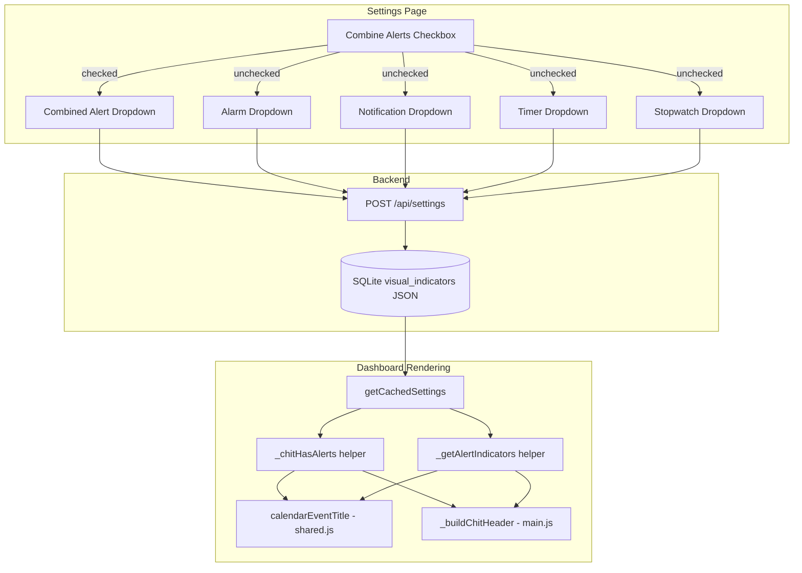

# Design Document: Alert Indicators Display

## Overview

Alert Indicators Display adds visual alert icons to chit entries across all CWOC views (Calendar, Checklists, Tasks, Notes, Alarms) except Projects. The feature introduces two display modes controlled by a new "Combine Alerts" toggle in Settings:

1. **Combined mode** — A single universal alert icon (⚠️) appears on any chit that has alerts, regardless of type. This is the space-efficient default for calendar views.
2. **Individual mode** — Separate per-type icons (🔔 alarm, 📢 notification, ⏱️ timer, ⏲️ stopwatch) appear based on which alert types the chit contains, each with its own Always/Never/If Space visibility setting.

Calendar views always use the single universal icon (space-constrained). Card-style views (Checklists, Tasks, Notes, Alarms) respect the combine/individual toggle.

The settings page gains:
- A "Combine Alerts" checkbox in the Visual Indicators section
- Two new indicator dropdowns for Timer and Stopwatch (visible when combine is off)
- A single "Combined Alerts" dropdown (visible when combine is on)

No new backend endpoints or database columns are needed. The existing `visual_indicators` JSON object within the settings API gains new keys (`combine_alerts`, `timer`, `stopwatch`, `combined_alert`). Backward compatibility is maintained by defaulting missing keys.

## Architecture



### Key Design Decisions

- **Universal icon on calendar, configurable on cards**: Calendar cells are space-constrained, so they always show at most one icon. Card views have room for multiple icons, so they respect the combine/individual toggle.
- **Settings stored in existing `visual_indicators` object**: No schema migration needed. New keys (`combine_alerts`, `timer`, `stopwatch`, `combined_alert`) are added alongside existing `alarm`, `notification`, `weather`, `people`, `indicators` keys.
- **Helper functions in `shared.js`**: Alert detection (`_chitHasAlerts`) and indicator string building (`_getAlertIndicators`) go in `shared.js` since `calendarEventTitle` already lives there and both dashboard and editor may need them.
- **"If Space" simplified**: Card views always have space, so "If Space" = "Always" for cards. Calendar month cells check title length; day/week slots have sufficient width so "If Space" = "Always" there too. Only month cells conditionally hide.
- **Backward compatibility via defaults**: Missing `combine_alerts` defaults to `false` (individual mode). Missing `timer`/`stopwatch` default to `"always"`. Existing `alarm` and `notification` values are preserved untouched.

## Components and Interfaces

### 1. Settings Page UI (`frontend/settings.html` + `frontend/settings.js`)

**New HTML elements** within the existing Visual Indicators `<div class="indicator-list">`:

- `<input type="checkbox" id="combine-alerts-toggle">` — Combine Alerts checkbox
- `<div id="combined-alert-row">` — Contains the single combined dropdown (hidden when unchecked)
- `<div id="individual-alert-rows">` — Contains alarm, notification, timer, stopwatch dropdowns (hidden when checked)
- Two new `<select>` elements: `name="timer_indicator"` and `name="stopwatch_indicator"`

**JavaScript changes in `settings.js`**:

- `SettingsManager.updateForm()` — Read `combine_alerts`, `timer`, `stopwatch`, `combined_alert` from loaded settings; set checkbox state; show/hide rows; set dropdown values with defaults.
- `SettingsManager.gatherSettings()` — Include `combine_alerts` (boolean), `timer`, `stopwatch`, and `combined_alert` in the `visual_indicators` object.
- New `_toggleCombineAlerts()` function — Called on checkbox change; toggles visibility of combined vs individual rows. Wired to `monitorChanges()` for unsaved-state tracking.

### 2. Alert Detection Helper (`frontend/shared.js`)

```javascript
/**
 * Returns true if a chit has any real alerts (alarm, timer, stopwatch, notification).
 * Excludes _notify_flags entries. Also checks legacy boolean flags.
 */
function _chitHasAlerts(chit) { ... }
```

### 3. Alert Indicator Builder (`frontend/shared.js`)

```javascript
/**
 * Returns an HTML string of alert indicator icon(s) for a chit,
 * based on visual_indicators settings and rendering context.
 *
 * @param {Object} chit - The chit object
 * @param {Object} settings - The visual_indicators settings object
 * @param {string} context - 'calendar-month' | 'calendar-slot' | 'card'
 * @returns {string} HTML string (may be empty)
 */
function _getAlertIndicators(chit, settings, context) { ... }
```

Logic:
- If chit has no alerts → return `""`
- If `combine_alerts` is true OR context is `'calendar-month'` or `'calendar-slot'`:
  - Check `combined_alert` display mode (or `"always"` default)
  - If mode permits → return `"⚠️ "`
- If `combine_alerts` is false and context is `'card'`:
  - For each alert type present on the chit, check its display mode
  - Return concatenated icons for permitted types

### 4. Calendar Event Title (`frontend/shared.js`)

Modify `calendarEventTitle()` to accept a `settings` parameter and call `_getAlertIndicators(chit, settings, context)` to prepend alert icons.

### 5. Chit Header Builder (`frontend/main.js`)

Modify `_buildChitHeader()` to accept a `settings` parameter and insert alert indicator icons into the `chit-header-left` div, after pinned/archived icons and before the title.

### 6. View Renderers (`frontend/main.js`)

Each view renderer that calls `_buildChitHeader` or `calendarEventTitle` passes the cached settings. The Projects view is explicitly excluded — no alert indicators there.

Affected renderers:
- `displayChecklists()` — passes settings to `_buildChitHeader`
- `displayTasks()` — passes settings to `_buildChitHeader`
- `displayNotes()` — passes settings to `_buildChitHeader`
- `displayAlarms()` — passes settings to `_buildChitHeader`
- All calendar renderers (week, day, month, year, itinerary, seven-day, x-day) — pass settings and context to `calendarEventTitle`

The `displayProjects()` renderer is NOT modified.

## Data Models

### Settings `visual_indicators` Object (Extended)

```json
{
  "alarm": "always" | "never" | "space",
  "notification": "always" | "never" | "space",
  "timer": "always" | "never" | "space",
  "stopwatch": "always" | "never" | "space",
  "weather": "always" | "never" | "space",
  "people": "always" | "never" | "space",
  "indicators": "always" | "never" | "space",
  "combine_alerts": true | false,
  "combined_alert": "always" | "never" | "space"
}
```

**New keys**:
| Key | Type | Default | Description |
|-----|------|---------|-------------|
| `combine_alerts` | boolean | `false` | Whether to use combined mode |
| `timer` | string | `"always"` | Timer indicator display mode |
| `stopwatch` | string | `"always"` | Stopwatch indicator display mode |
| `combined_alert` | string | `"always"` | Combined alert indicator display mode |

**Backward compatibility**: When loading settings, missing keys are filled with defaults in `_getAlertIndicators`. No backend migration needed — the `visual_indicators` column is already a free-form JSON text field.

### Chit Alert Structure (Existing, No Changes)

```json
{
  "alerts": [
    { "_type": "alarm", "time": "08:00", "enabled": true, "days": [...] },
    { "_type": "timer", "duration": 300, ... },
    { "_type": "stopwatch", ... },
    { "_type": "notification", ... },
    { "_type": "_notify_flags", ... }
  ],
  "alarm": true,
  "notification": true
}
```

The `_notify_flags` type is excluded from alert detection. Legacy `alarm` and `notification` boolean flags are treated as fallbacks when the `alerts` array is empty.


## Correctness Properties

*A property is a characteristic or behavior that should hold true across all valid executions of a system — essentially, a formal statement about what the system should do. Properties serve as the bridge between human-readable specifications and machine-verifiable correctness guarantees.*

### Property 1: Calendar display mode correctness

*For any* chit and any alert indicator display mode setting, the calendar event title SHALL contain the universal alert icon if and only if the chit has alerts (real alert entries or legacy flags) AND the display mode is not "never" (accounting for context-specific "If Space" resolution).

**Validates: Requirements 1.1, 1.4, 1.5**

### Property 2: Calendar icon uniqueness

*For any* chit with any number of alerts of any combination of types, the calendar event title SHALL contain at most one universal alert icon character.

**Validates: Requirements 1.2**

### Property 3: Alert detection with legacy flags

*For any* chit, `_chitHasAlerts` SHALL return true if the chit has at least one entry in its alerts array with `_type` in {alarm, timer, stopwatch, notification}, OR if the legacy `alarm` or `notification` boolean flag is true — and SHALL return false otherwise.

**Validates: Requirements 1.3, 2.1**

### Property 4: Combined mode shows single universal icon on cards

*For any* chit with alerts, when `combine_alerts` is true and the display mode permits display, `_getAlertIndicators` in card context SHALL return exactly the universal alert icon, regardless of how many or which types of alerts the chit contains.

**Validates: Requirements 2.4**

### Property 5: Individual mode shows correct per-type icons on cards

*For any* chit with alerts and any combination of per-type display mode settings, when `combine_alerts` is false, `_getAlertIndicators` in card context SHALL return icons only for alert types that are (a) present on the chit AND (b) whose individual display mode permits display. No icon SHALL appear for types not present or whose mode is "never".

**Validates: Requirements 2.5, 2.6**

### Property 6: "If Space" resolves to show for non-month contexts

*For any* chit with alerts, when the display mode is "space" and the rendering context is "card" or "calendar-slot", `_getAlertIndicators` SHALL return the same result as if the display mode were "always".

**Validates: Requirements 5.2, 5.3**

### Property 7: Backward-compatible defaults

*For any* `visual_indicators` settings object that is missing one or more of the keys `combine_alerts`, `timer`, `stopwatch`, or `combined_alert`, the indicator logic SHALL behave as if `combine_alerts` is `false`, `timer` is `"always"`, `stopwatch` is `"always"`, and `combined_alert` is `"always"`. Existing `alarm` and `notification` values SHALL be preserved and used as-is.

**Validates: Requirements 4.5, 6.1, 6.2**

## Error Handling

| Scenario | Handling |
|----------|----------|
| `chit.alerts` is `null`, `undefined`, or not an array | `_chitHasAlerts` falls back to checking legacy `alarm`/`notification` boolean flags |
| `visual_indicators` is `null` or `undefined` in settings | All display modes default to `"always"`, `combine_alerts` defaults to `false` |
| Unknown `_type` value in alerts array | Ignored — only `alarm`, `timer`, `stopwatch`, `notification` are recognized |
| `_notify_flags` entries in alerts array | Excluded from alert detection (not real alerts) |
| Settings saved with combine_alerts=true but individual keys also present | Individual keys are preserved in storage but ignored during rendering when combine mode is active |
| Invalid display mode value (not "always", "never", or "space") | Treated as `"always"` (fail-open) |

## Testing Strategy

### Unit Tests (Example-Based)

- **Settings UI toggle**: Verify checkbox toggles visibility of combined vs individual dropdown rows (Requirements 3.2, 3.3, 3.5)
- **Settings persistence**: Verify `gatherSettings()` includes all new keys in `visual_indicators` (Requirements 3.4, 4.4)
- **Settings defaults on load**: Verify `updateForm()` correctly defaults missing timer/stopwatch to "always" (Requirement 4.5)
- **Projects exclusion**: Verify `displayProjects()` does not call `_getAlertIndicators` (Requirement 2.3)
- **Non-alert keys preserved**: Verify weather, people, indicators keys are untouched after save (Requirement 6.3)

### Property-Based Tests

Property-based tests use [fast-check](https://github.com/dubzzz/fast-check) (vanilla JS compatible via CDN or script tag for test runner).

Each property test runs a minimum of 100 iterations with randomly generated chits and settings configurations.

- **Property 1**: Generate random chits (with/without alerts, varying types and counts) and random display modes. Assert calendar indicator output matches expected presence/absence.
  - Tag: `Feature: alert-indicators-display, Property 1: Calendar display mode correctness`
- **Property 2**: Generate chits with 1–20 alerts of mixed types. Assert calendar output contains at most one universal icon.
  - Tag: `Feature: alert-indicators-display, Property 2: Calendar icon uniqueness`
- **Property 3**: Generate chits with random alert arrays and legacy flags. Assert `_chitHasAlerts` matches expected boolean.
  - Tag: `Feature: alert-indicators-display, Property 3: Alert detection with legacy flags`
- **Property 4**: Generate chits with mixed alert types, set combine_alerts=true. Assert card output is exactly the universal icon.
  - Tag: `Feature: alert-indicators-display, Property 4: Combined mode shows single universal icon on cards`
- **Property 5**: Generate chits with random alert types and random per-type display modes, combine_alerts=false. Assert each icon appears iff its type is present and permitted.
  - Tag: `Feature: alert-indicators-display, Property 5: Individual mode shows correct per-type icons on cards`
- **Property 6**: Generate chits with alerts, set mode to "space", test with "card" and "calendar-slot" contexts. Assert output equals the "always" mode output.
  - Tag: `Feature: alert-indicators-display, Property 6: If Space resolves to show for non-month contexts`
- **Property 7**: Generate random visual_indicators objects with random subsets of keys missing. Assert defaults are applied correctly.
  - Tag: `Feature: alert-indicators-display, Property 7: Backward-compatible defaults`

### Integration Tests

- **View rendering**: Manually verify alert indicators appear on Checklists, Tasks, Notes, Alarms views and NOT on Projects view (Requirements 2.2, 2.3)
- **Calendar month "If Space"**: Manually verify with long and short titles in month view that icons appear/hide based on available space (Requirement 5.1)
- **Settings round-trip**: Save settings with various configurations, reload page, verify all values are restored correctly
