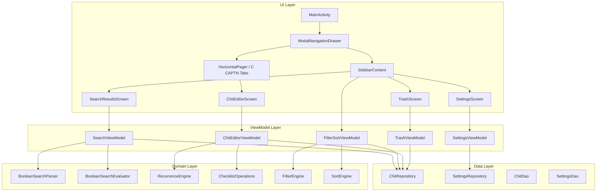

# Design Document — Phase 5a: Core Usability

## Overview

Phase 5a transforms the CWOC Android app from a basic viewer into a daily-driver by implementing the sidebar/menu navigation, settings page, proper editor UIs (date picker, checklist, color picker, alerts, recurrence), global search, filters, sort, trash management, unsaved changes detection, and undo-on-delete. The existing bottom navigation bar is replaced with a swipe-panel architecture matching the mobile web app's interaction patterns.

### Key Design Decisions

1. **ModalNavigationDrawer replaces BottomNavBar** — The bottom nav bar with its Debug tab is removed entirely. Navigation moves to a Material 3 `ModalNavigationDrawer` (left-swipe or hamburger button), containing nav links, filters, sort, and quick actions. The C CAPTN view tabs remain accessible via a right-swipe `HorizontalPager` or tab row at the top of the main screen.

2. **Editor uses collapsible Zones** — Each editor section (Dates, Checklist, Color, Alerts, Recurrence) is a collapsible "Zone" composable, matching the web app's zone pattern. This keeps the editor scannable while providing full functionality when expanded.

3. **In-memory filter/sort state with ViewModel** — Filter and sort state lives in a shared `FilterSortViewModel` scoped to the activity, persisted across view switches within a session. No Room persistence needed for filter state.

4. **Existing domain modules reused** — The `BooleanSearchParser`, `BooleanSearchEvaluator`, `RecurrenceEngine`, and `ChecklistOperations` are reused directly. New UI composables wrap these existing domain classes.

5. **Settings sync via existing dirty-tracking** — Settings changes mark the `SettingsEntity` as dirty and the existing `SyncPushEngine` handles upload.

## Architecture



## Components and Interfaces

### 1. Navigation Overhaul

**Files modified:**
- `MainActivity.kt` — Replace `Scaffold` with `ModalNavigationDrawer` + inner `Scaffold`
- `BottomNavBar.kt` — Delete entirely
- `Screen.kt` — Add `Settings`, `Trash`, `Search` routes; remove `Debug` from `bottomNavItems`
- `CwocNavGraph.kt` — Add new routes, remove Debug route

**New files:**
- `ui/navigation/SidebarContent.kt` — Drawer content composable
- `ui/navigation/CCaptnTabRow.kt` — Horizontal tab row for C CAPTN views (replaces bottom nav)

```kotlin
// SidebarContent.kt
@Composable
fun SidebarContent(
    onNavigate: (Screen) -> Unit,
    onNewChit: () -> Unit,
    onClose: () -> Unit,
    filterSortViewModel: FilterSortViewModel
)

// CCaptnTabRow.kt  
@Composable
fun CCaptnTabRow(
    selectedTab: CCaptnTab,
    onTabSelected: (CCaptnTab) -> Unit
)

enum class CCaptnTab(val label: String, val route: String) {
    Calendar("Calendar", "calendar"),
    Checklists("Checklists", "checklists"),
    Alarms("Alarms", "alarms"),
    Projects("Projects", "projects"),
    Tasks("Tasks", "tasks"),
    Notes("Notes", "notes")
}
```

### 2. Settings Screen

**New files:**
- `ui/screens/settings/SettingsScreen.kt` — Tab scaffold (General, Views, Admin)
- `ui/screens/settings/SettingsViewModel.kt` — Loads/saves settings via SettingsRepository
- `ui/screens/settings/GeneralSettingsTab.kt` — Time format, week start, snap, snooze, timezone, units
- `ui/screens/settings/ViewsSettingsTab.kt` — Default view, enabled periods, view order
- `ui/screens/settings/AdminSettingsTab.kt` — Diagnostics section (migrated from DebugScreen)

```kotlin
// SettingsViewModel.kt
@HiltViewModel
class SettingsViewModel @Inject constructor(
    private val settingsRepository: SettingsRepository,
    private val syncRepository: SyncRepository
) : ViewModel() {
    val settings: StateFlow<SettingsFormState>
    fun updateSetting(key: String, value: String)
    fun save()  // Persists to Room, marks dirty, triggers sync
}

data class SettingsFormState(
    val timeFormat: String = "12h",
    val weekStartDay: String = "sunday",
    val calendarSnap: Int = 15,
    val snoozeLength: Int = 10,
    val defaultTimezone: String = "America/New_York",
    val unitSystem: String = "imperial",
    val defaultView: String = "Tasks",
    val enabledPeriods: List<String> = listOf("Day", "Week", "Month"),
    val viewOrder: List<String> = listOf("Calendar", "Checklists", "Alarms", "Projects", "Tasks", "Notes"),
    val tags: List<TagSetting> = emptyList(),
    val customColors: List<String> = emptyList()
)
```

### 3. Editor Zone Components

**New files:**
- `ui/screens/editor/zones/DateZone.kt` — Date mode selector, date/time pickers, all-day toggle, timezone
- `ui/screens/editor/zones/ChecklistZone.kt` — Interactive checklist with drag-drop, indent, progress
- `ui/screens/editor/zones/ColorZone.kt` — Color swatch grid with preview
- `ui/screens/editor/zones/AlertsZone.kt` — Alert list with add/remove
- `ui/screens/editor/zones/RecurrenceZone.kt` — Preset selector + custom builder
- `ui/screens/editor/zones/EditorZoneHeader.kt` — Reusable collapsible zone header

```kotlin
// EditorZoneHeader.kt
@Composable
fun EditorZoneHeader(
    title: String,
    isExpanded: Boolean,
    onToggle: () -> Unit,
    trailingContent: @Composable (() -> Unit)? = null
)

// DateZone.kt
@Composable
fun DateZone(
    formState: ChitFormState,
    onFormUpdate: (ChitFormState) -> Unit,
    timeFormat: String,  // "12h" or "24h"
    calendarSnap: Int,   // minutes
    defaultTimezone: String
)

// ChecklistZone.kt
@Composable
fun ChecklistZone(
    checklistJson: String?,
    onChecklistChange: (String?) -> Unit,
    onUndo: () -> Unit
)

// ColorZone.kt
@Composable
fun ColorZone(
    selectedColor: String?,
    defaultPalette: List<String>,
    customColors: List<String>,
    onColorSelected: (String?) -> Unit
)

// AlertsZone.kt
@Composable
fun AlertsZone(
    alertsJson: String?,
    onAlertsChange: (String?) -> Unit,
    timeFormat: String
)

// RecurrenceZone.kt
@Composable
fun RecurrenceZone(
    recurrenceRule: String?,
    recurrence: String?,
    onRecurrenceChange: (rule: String?, display: String?) -> Unit
)
```

### 4. Search

**New files:**
- `ui/screens/search/SearchScreen.kt` — Search UI with results
- `ui/screens/search/SearchViewModel.kt` — Debounced search using existing parser

```kotlin
@HiltViewModel
class SearchViewModel @Inject constructor(
    private val chitRepository: ChitRepository,
    private val searchParser: BooleanSearchParser,
    private val searchEvaluator: BooleanSearchEvaluator
) : ViewModel() {
    val query: MutableStateFlow<String>
    val results: StateFlow<List<SearchResult>>
    
    // 300ms debounce on query changes
    // Evaluates against all non-deleted chits
    // Supports field::value, #tag, and boolean operators
}

data class SearchResult(
    val chit: ChitEntity,
    val matchedFields: List<String>,
    val highlightRanges: Map<String, List<IntRange>>
)
```

### 5. Filter & Sort Engine

**New files:**
- `domain/filter/FilterEngine.kt` — Pure function: applies filter predicates to chit list
- `domain/sort/SortEngine.kt` — Pure function: sorts chit list by field + direction
- `ui/viewmodel/FilterSortViewModel.kt` — Shared ViewModel holding filter/sort state

```kotlin
// FilterEngine.kt
object FilterEngine {
    fun applyFilters(
        chits: List<ChitEntity>,
        filters: FilterState
    ): List<ChitEntity>
}

data class FilterState(
    val statuses: Set<String> = emptySet(),       // empty = any
    val priorities: Set<String> = emptySet(),      // empty = any
    val tags: Set<String> = emptySet(),
    val tagMatchMode: TagMatchMode = TagMatchMode.ANY,
    val people: Set<String> = emptySet(),
    val showArchived: Boolean = false,
    val showPinned: Boolean = true,
    val showSnoozed: Boolean = false,
    val showPastDue: Boolean = true
)

enum class TagMatchMode { ANY, ALL }

// SortEngine.kt
object SortEngine {
    fun sort(
        chits: List<ChitEntity>,
        field: SortField,
        direction: SortDirection
    ): List<ChitEntity>
}

enum class SortField {
    TITLE, DUE_DATE, START_DATE, CREATED_DATE, MODIFIED_DATE, PRIORITY, STATUS, MANUAL
}

enum class SortDirection { ASC, DESC }
```

### 6. Trash Screen

**New files:**
- `ui/screens/trash/TrashScreen.kt` — List of deleted chits with restore/purge
- `ui/screens/trash/TrashViewModel.kt` — Queries deleted chits, handles restore/purge

```kotlin
@HiltViewModel
class TrashViewModel @Inject constructor(
    private val chitRepository: ChitRepository
) : ViewModel() {
    val trashedChits: StateFlow<List<ChitEntity>>
    fun restore(chitId: String)   // Sets deleted=false, marks dirty
    fun purge(chitId: String)     // Hard-deletes locally, syncs deletion
}
```

### 7. Unsaved Changes Detection

**Modified files:**
- `ui/screens/editor/ChitEditorViewModel.kt` — Add `isDirty` state, back-press interception
- `ui/screens/editor/ChitEditorScreen.kt` — Add `BackHandler`, unsaved changes dialog

```kotlin
// In ChitEditorViewModel
val isDirty: StateFlow<Boolean>  // Computed from formState vs savedState
val showUnsavedDialog: MutableStateFlow<Boolean>

fun onBackPressed() {
    if (isDirty.value) {
        showUnsavedDialog.value = true
    } else {
        // Navigate back
    }
}

fun saveAndExit()
fun discardAndExit()
fun cancelBack()  // Dismiss dialog, stay in editor
```

### 8. Undo Toast

**New files:**
- `ui/components/UndoToast.kt` — Bottom-positioned countdown bar with Undo button

```kotlin
@Composable
fun UndoToast(
    message: String,
    durationMs: Long = 5000L,
    onUndo: () -> Unit,
    onExpire: () -> Unit,
    onDismiss: () -> Unit
)
```

## Data Models

### Filter State (in-memory, not persisted to Room)

```kotlin
data class FilterState(
    val statuses: Set<String> = emptySet(),
    val priorities: Set<String> = emptySet(),
    val tags: Set<String> = emptySet(),
    val tagMatchMode: TagMatchMode = TagMatchMode.ANY,
    val people: Set<String> = emptySet(),
    val showArchived: Boolean = false,
    val showPinned: Boolean = true,
    val showSnoozed: Boolean = false,
    val showPastDue: Boolean = true
)
```

### Sort State (persisted per-tab in SharedPreferences)

```kotlin
data class SortState(
    val field: SortField = SortField.MANUAL,
    val direction: SortDirection = SortDirection.ASC
)
```

### Checklist Item (parsed from JSON)

```kotlin
data class ChecklistItem(
    val id: String,
    val text: String,
    val checked: Boolean = false,
    val depth: Int = 0  // 0 = top-level, 1+ = nested
)
```

### Alert Item (parsed from JSON)

```kotlin
data class AlertItem(
    val id: String,
    val type: AlertType,  // ALARM, TIMER, REMINDER
    val offsetMinutes: Int? = null,  // Relative to start/due
    val absoluteTime: String? = null,  // ISO datetime
    val label: String? = null
)

enum class AlertType { ALARM, TIMER, REMINDER }
```

### Recurrence Rule (parsed from JSON)

```kotlin
data class RecurrenceRuleUi(
    val frequency: RRuleFrequency,  // DAILY, WEEKLY, MONTHLY, YEARLY
    val interval: Int = 1,
    val byDay: Set<DayOfWeek> = emptySet(),
    val until: String? = null,  // ISO date
    val count: Int? = null
)

enum class RRuleFrequency { DAILY, WEEKLY, MONTHLY, YEARLY }
```

### Settings Form State

```kotlin
data class SettingsFormState(
    val timeFormat: String = "12h",
    val weekStartDay: String = "sunday",
    val calendarSnap: Int = 15,
    val snoozeLength: Int = 10,
    val defaultTimezone: String = "America/New_York",
    val unitSystem: String = "imperial",
    val defaultView: String = "Tasks",
    val enabledPeriods: List<String> = listOf("Day", "Week", "Month"),
    val viewOrder: List<String> = listOf("Calendar", "Checklists", "Alarms", "Projects", "Tasks", "Notes"),
    val tags: List<TagSetting> = emptyList(),
    val customColors: List<String> = emptyList()
)

data class TagSetting(
    val name: String,
    val color: String? = null,
    val favorite: Boolean = false
)
```

### Color Palette (constants)

```kotlin
val DEFAULT_COLOR_PALETTE = listOf(
    "#FF6B6B", "#FF8E53", "#FFC93C", "#6BCB77", "#4D96FF",
    "#9B59B6", "#E91E63", "#00BCD4", "#8BC34A", "#FF5722",
    "#795548", "#607D8B", "#F44336", "#2196F3", "#4CAF50"
)
```

## Correctness Properties

*A property is a characteristic or behavior that should hold true across all valid executions of a system — essentially, a formal statement about what the system should do. Properties serve as the bridge between human-readable specifications and machine-verifiable correctness guarantees.*

### Property 1: Settings persistence round-trip

*For any* valid settings value (time format, week start day, calendar snap, snooze length, timezone, unit system, default view, enabled periods, view order, tag colors, custom colors), saving the value to the SettingsRepository and then reloading it should produce an identical value.

**Validates: Requirements 2.3, 2.4, 2.5**

### Property 2: Time snap interval

*For any* time value (hours 0–23, minutes 0–59) and any valid snap interval (1, 5, 10, 15, 30, 60 minutes), the snapped time should be the nearest multiple of the snap interval that is ≤ the original time, and the snapped minutes should be evenly divisible by the interval.

**Validates: Requirements 3.2**

### Property 3: Date/time format correctness

*For any* valid datetime and format preference (12h or 24h), the formatted string should match the expected pattern: 12h format contains AM/PM and hours 1–12, 24h format uses hours 0–23 with no AM/PM suffix.

**Validates: Requirements 3.4, 6.5**

### Property 4: Timezone search filtering

*For any* substring of a valid IANA timezone ID, searching the timezone list with that substring should return a non-empty result set where every result contains the search substring (case-insensitive).

**Validates: Requirements 3.6**

### Property 5: Checklist add/remove invariant

*For any* checklist and any non-empty text string, adding an item should increase the item count by exactly 1 and the new item should be present in the list. Conversely, for any checklist with at least one item, removing an item should decrease the count by exactly 1 and the removed item should no longer be present.

**Validates: Requirements 4.2, 4.3**

### Property 6: List reorder preserves items

*For any* ordered list of items (checklist items or chits in manual sort) and any valid move operation (from index i to index j where both are within bounds), the resulting list should contain exactly the same set of items with no additions or removals.

**Validates: Requirements 4.4, 10.5**

### Property 7: Checklist indent/outdent depth

*For any* checklist item at depth d, indenting should produce depth d+1, and outdenting should produce max(0, d-1). No item should ever have a negative depth.

**Validates: Requirements 4.5**

### Property 8: Checklist progress calculation

*For any* list of checklist items with random checked/unchecked states, the progress count should equal (number of checked items, total number of items) where both values are non-negative and checked ≤ total.

**Validates: Requirements 4.6**

### Property 9: Checklist undo round-trip

*For any* checklist state and any single operation (toggle check, reorder, delete, indent, outdent), performing the operation and then immediately undoing should produce a state identical to the original.

**Validates: Requirements 4.7**

### Property 10: Alert list add/remove invariant

*For any* alert list and any valid alert configuration (type + time), adding an alert should increase the list length by 1. For any alert list with at least one alert, removing an alert by ID should decrease the length by 1 and that ID should no longer appear.

**Validates: Requirements 6.2, 6.3**

### Property 11: Recurrence rule generation round-trip

*For any* valid combination of frequency, interval, by-day selection, and until/count, the generated RRULE JSON should be parseable by the existing RecurrenceEngine and produce the same frequency/interval/by-day/until/count values when parsed back.

**Validates: Requirements 7.2**

### Property 12: Recurrence human-readable summary

*For any* valid RecurrenceRuleUi object, the human-readable summary should be a non-empty string that contains the frequency keyword (daily, weekly, monthly, or yearly) and, when interval > 1, should contain the interval number.

**Validates: Requirements 7.3**

### Property 13: Search matches correct fields

*For any* chit with content in a searchable field (title, note, tags, checklist text, people) and any substring of that content used as a search query, the search should return that chit in results. For field-specific search (`field::value`), only chits with that value in the specified field should match. For tag search (`#tagname`), only chits containing that exact tag should match.

**Validates: Requirements 8.2, 8.4, 8.5**

### Property 14: Boolean search operator semantics

*For any* two search terms A and B and any set of chits, `A AND B` results should be the intersection of chits matching A and chits matching B; `A OR B` should be the union; `NOT A` should be the complement of chits matching A within the full set.

**Validates: Requirements 8.3**

### Property 15: Filter predicate correctness

*For any* set of chits and any filter state (selected statuses, priorities, people, archive/pinned/snoozed toggles, past-due toggle), the filtered result should contain exactly those chits that satisfy all active filter predicates simultaneously. A chit passes a multi-value filter (status, priority, people) if its value is in the selected set (or the set is empty, meaning "any").

**Validates: Requirements 9.2, 9.3, 9.5, 9.6, 9.7**

### Property 16: Tag filter match modes

*For any* set of selected tags and any set of chits, match-ANY mode should return chits that have at least one of the selected tags, and match-ALL mode should return only chits that have every selected tag.

**Validates: Requirements 9.4**

### Property 17: Sort ordering correctness

*For any* non-empty list of chits and any sort field, the sorted result in ascending order should have each element's sort key ≤ the next element's sort key. Descending order should have each element's sort key ≥ the next. The sorted list should contain exactly the same elements as the input.

**Validates: Requirements 10.2, 10.3**

### Property 18: Trash query returns only deleted chits

*For any* set of chits with various deleted states, the trash query should return exactly those chits where `deleted == true`, and no chit with `deleted == false` should appear in trash results.

**Validates: Requirements 11.2**

### Property 19: Trash restore clears deleted flag

*For any* chit in the trash (deleted == true), restoring it should set `deleted = false` and the chit should subsequently appear in active queries and no longer appear in trash queries.

**Validates: Requirements 11.3**

### Property 20: Dirty state detection

*For any* two `ChitFormState` instances (original and current), the dirty detection function should return `true` if and only if at least one field differs between them. If all fields are identical, it should return `false`.

**Validates: Requirements 12.1**

### Property 21: Undo restores pre-deletion state

*For any* active chit (deleted == false), soft-deleting it and then immediately undoing should produce a chit state identical to the original (same field values, deleted == false).

**Validates: Requirements 13.3**

## Error Handling

| Scenario | Handling |
|----------|----------|
| Settings save fails (Room error) | Show Snackbar with error message, keep form state for retry |
| Search query parse error | Graceful fallback to literal term search (existing parser behavior) |
| Checklist JSON parse error | Show empty checklist with error indicator, preserve raw JSON for manual editing |
| Alert JSON parse error | Show empty alerts list with warning, preserve raw JSON |
| Recurrence rule parse error | Show "Custom" with raw value displayed, allow clearing |
| Timezone list load failure | Fall back to system default timezone, show error toast |
| Trash restore sync failure | Mark chit dirty for retry on next sync cycle, show warning |
| Back-press during save | Queue save, show progress indicator, navigate after completion |
| Date picker invalid range (end < start) | Show inline validation error, prevent save until corrected |
| Filter produces zero results | Show empty state with "No chits match filters" message and Clear Filters button |

## Testing Strategy

### Unit Tests (Example-Based)

- **Navigation**: Verify sidebar contains expected links, hamburger button opens drawer
- **Settings tabs**: Verify General/Views/Admin tabs render with correct fields
- **Date mode selector**: Verify correct fields shown/hidden per mode (Start/End, Due Only, Perpetual, Point-in-Time, None)
- **Color picker**: Verify default palette renders, custom colors appear, clear works
- **Undo toast**: Verify 5-second countdown, Undo button presence
- **Unsaved changes dialog**: Verify Save/Discard/Cancel options and their behaviors
- **Recurrence presets**: Verify None/Daily/Weekly/Monthly/Yearly options exist

### Property-Based Tests

Property-based testing is appropriate for this feature because it contains significant pure logic (filtering, sorting, searching, checklist operations, date formatting, dirty detection) that operates over large input spaces.

**Library**: [Kotest](https://kotest.io/) with its property testing module (`kotest-property`)

**Configuration**:
- Minimum 100 iterations per property test
- Each test tagged with: `Feature: android-phase5a-core-usability, Property {N}: {title}`

**Properties to implement** (referencing the Correctness Properties section above):
1. Settings persistence round-trip
2. Time snap interval
3. Date/time format correctness
4. Timezone search filtering
5. Checklist add/remove invariant
6. List reorder preserves items
7. Checklist indent/outdent depth
8. Checklist progress calculation
9. Checklist undo round-trip
10. Alert list add/remove invariant
11. Recurrence rule generation round-trip
12. Recurrence human-readable summary
13. Search matches correct fields
14. Boolean search operator semantics
15. Filter predicate correctness
16. Tag filter match modes
17. Sort ordering correctness
18. Trash query returns only deleted chits
19. Trash restore clears deleted flag
20. Dirty state detection
21. Undo restores pre-deletion state

### Integration Tests

- Settings sync push: verify SettingsEntity marked dirty triggers SyncPushEngine
- Trash purge: verify hard-delete + sync push
- Search debounce: verify 300ms delay before query execution
- Filter persistence across view switches
