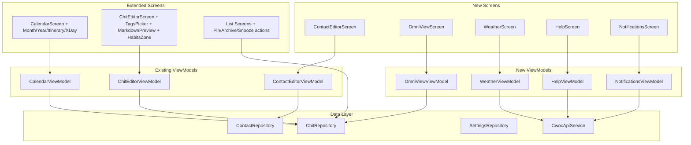

# Design Document — Phase 5b: Feature Parity

## Overview

Phase 5b brings the CWOC Android app to full feature parity with the web app by implementing 10 features: Contact Editor screen, additional calendar views (Month/Year/Itinerary/X-Day), Omni View dashboard, proper Tags UI with tree picker, Markdown preview in editor notes, Pin/Archive/Snooze actions, Habits view and editor zone, Weather page, Help page, and Notifications display. All features build on existing entities, repositories, and UI patterns established in Phases 4 and 5a.

### Key Design Decisions

1. **Contact Editor Screen** — The `ContactEditorViewModel` already exists with full save/delete/dirty logic. We only need the UI composable (`ContactEditorScreen.kt`) and to wire the navigation route in `CwocNavGraph.kt`. The screen follows the same zone-based pattern as `ChitEditorScreen`.

2. **Calendar views extend existing CalendarViewModel** — The `CalendarViewMode` enum gains MONTH, YEAR, ITINERARY, and X_DAY entries. Each mode has its own composable section within `CalendarScreen`. The ViewModel's `getDateRange()` and `headerTitle` logic expand to handle new modes.

3. **Omni View is a new screen** — A dedicated `OmniViewScreen` with configurable sections. Section visibility/order comes from a new `omniViewConfig` field in SettingsEntity (JSON string). Each section is a composable that queries the appropriate subset of chits.

4. **Tags UI uses a BottomSheet picker** — The existing `TagsZone` in the editor gets replaced with a proper tag picker using `ModalBottomSheet`. The picker shows the tag tree (parsed from `SettingsEntity.tags` JSON), supports search, favorites, and inline creation.

5. **Markdown preview uses Compose richtext** — A toggle in the Notes zone switches between the raw `OutlinedTextField` and a rendered markdown view using a lightweight Compose markdown renderer (no external dependencies — custom composable parsing marked syntax).

6. **Pin/Archive/Snooze are action buttons** — Added to long-press context menus on list cards and as buttons in the editor toolbar. These update the existing `pinned`, `archived`, `snoozedUntil` fields on `ChitEntity`.

7. **Habits zone in editor** — A new `HabitsZone` composable in the editor zones directory. Reads/writes the existing `habit`, `habitGoal`, `habitSuccess`, `habitResetPeriod`, `habitLastActionDate`, `habitHideOverall` fields.

8. **Weather/Help are server-rendered content** — Both fetch from existing API endpoints (`/api/weather/forecasts`, `/api/docs`) and display the content. No independent API calls to external services.

9. **Notifications use existing sync data** — The server already pushes notification data. We add a `NotificationEntity` to Room (new table, new migration), a badge in the TopAppBar, and an inbox screen.

## Architecture



## Components and Interfaces

### 1. Contact Editor Screen

**New files:**
- `ui/screens/contacts/ContactEditorScreen.kt` — Full editor UI

**Modified files:**
- `ui/navigation/CwocNavGraph.kt` — Wire `ContactEditor` route
- `ui/navigation/Screen.kt` — Add `ContactEditor` route with `contactId` argument

```kotlin
// Screen.kt addition
data object ContactEditor : Screen("contact-editor/{contactId}") {
    const val NEW_CONTACT_ID = "new"
    fun createRoute(contactId: String) = "contact-editor/$contactId"
}

// ContactEditorScreen.kt
@Composable
fun ContactEditorScreen(
    contactId: String,
    onNavigateBack: () -> Unit,
    viewModel: ContactEditorViewModel = hiltViewModel()
)
```

The screen uses the existing `ContactEditorViewModel` (which handles save, delete, dirty tracking, sync push). The UI renders:
- Name fields (given, family, middle, prefix, suffix) in a collapsible "Name" section
- Multi-value fields (phones, emails, addresses) with add/remove buttons
- Tags (using the new TagsPicker)
- Color picker (reusing `ColorZone` pattern)
- Notes (multiline text)
- Dates (JSON-parsed list of labeled dates)
- Favorite toggle, organization, social context

### 2. Calendar Additional Views

**Modified files:**
- `ui/screens/calendar/CalendarViewModel.kt` — Extend `CalendarViewMode` enum, add date range logic
- `ui/screens/calendar/CalendarScreen.kt` — Add view composables for Month/Year/Itinerary/X-Day

```kotlin
enum class CalendarViewMode {
    DAY, WEEK, MONTH, YEAR, ITINERARY, X_DAY
}

// New composables within CalendarScreen.kt:
@Composable
private fun MonthView(events: List<ChitEntity>, selectedDate: LocalDate, onDayTap: (LocalDate) -> Unit)

@Composable
private fun YearView(events: Map<LocalDate, List<ChitEntity>>, selectedDate: LocalDate, onMonthTap: (LocalDate) -> Unit)

@Composable
private fun ItineraryView(events: List<ChitEntity>, onEventTap: (String) -> Unit)

@Composable
private fun XDayView(events: List<ChitEntity>, dayCount: Int, startDate: LocalDate, onEventTap: (String) -> Unit)
```

The `ViewModeToggle` becomes a scrollable `FilterChip` row with all 6 modes. The ViewModel persists the last-used mode in SharedPreferences.

### 3. Omni View

**New files:**
- `ui/screens/omni/OmniViewScreen.kt` — Dashboard composable
- `ui/screens/omni/OmniViewViewModel.kt` — Loads sections from settings, queries chits

**Modified files:**
- `ui/navigation/Screen.kt` — Add `OmniView` route
- `ui/navigation/CwocNavGraph.kt` — Wire route
- `ui/navigation/SidebarContent.kt` — Add Omni View nav item

```kotlin
data object OmniView : Screen("omni")

@HiltViewModel
class OmniViewViewModel @Inject constructor(
    private val chitRepository: ChitRepository,
    private val settingsRepository: SettingsRepository
) : ViewModel() {
    val sections: StateFlow<List<OmniSection>>
    val chronoAnchored: StateFlow<List<ChitEntity>>
    val reminders: StateFlow<List<ChitEntity>>
    val onDeck: StateFlow<List<ChitEntity>>
    val soon: StateFlow<List<ChitEntity>>
    val pinnedNotes: StateFlow<List<ChitEntity>>
    val pinnedChecklists: StateFlow<List<ChitEntity>>
}

data class OmniSection(
    val type: OmniSectionType,
    val visible: Boolean,
    val order: Int
)

enum class OmniSectionType {
    CHRONO_ANCHORED, REMINDERS, ON_DECK, SOON, PINNED_NOTES, PINNED_CHECKLISTS
}
```

### 4. Tags UI (Tag Picker)

**New files:**
- `ui/screens/editor/zones/TagsPickerSheet.kt` — ModalBottomSheet with tag tree

**Modified files:**
- `ui/screens/editor/ChitEditorScreen.kt` — Replace inline `TagsZone` with picker-based version

```kotlin
@Composable
fun TagsPickerSheet(
    allTags: List<TagNode>,
    selectedTags: List<String>,
    onTagToggled: (String) -> Unit,
    onTagCreated: (String) -> Unit,
    onDismiss: () -> Unit
)

data class TagNode(
    val name: String,
    val fullPath: String,       // e.g., "Work/Projects/Alpha"
    val color: String?,
    val favorite: Boolean,
    val children: List<TagNode>
)
```

The tag tree is parsed from `SettingsEntity.tags` JSON (which stores `[{name, color, favorite, children}]`). Favorites appear at the top. Search filters the flat list. Inline creation adds to the local tag list and marks settings dirty.

### 5. Markdown Preview

**New files:**
- `ui/components/MarkdownRenderer.kt` — Composable that renders markdown to annotated text

**Modified files:**
- `ui/screens/editor/ChitEditorScreen.kt` — Add preview toggle to NotesZone

```kotlin
@Composable
fun MarkdownRenderer(
    markdown: String,
    modifier: Modifier = Modifier
)

// In NotesZone:
@Composable
private fun NotesZone(
    note: String,
    onNoteChange: (String) -> Unit,
    showPreview: Boolean,
    onTogglePreview: () -> Unit
)
```

The renderer handles: headings (H1-H6), bold, italic, links, unordered/ordered lists, code blocks (monospace background), blockquotes, and images (constrained to max-width). Uses `AnnotatedString` with `SpanStyle` for inline formatting and `Column` layout for block elements.

### 6. Pin/Archive/Snooze Actions

**New files:**
- `ui/components/ChitActionMenu.kt` — Long-press context menu composable
- `ui/components/SnoozePickerDialog.kt` — Snooze duration picker

**Modified files:**
- `ui/screens/tasks/TasksScreen.kt` (and other list screens) — Add long-press menu
- `ui/screens/editor/ChitEditorScreen.kt` — Add pin/archive/snooze buttons to toolbar
- `data/repository/ChitRepository.kt` — Add `pin()`, `unpin()`, `archive()`, `unarchive()`, `snooze()`, `unsnooze()` convenience methods

```kotlin
@Composable
fun ChitActionMenu(
    expanded: Boolean,
    chit: ChitEntity,
    onDismiss: () -> Unit,
    onPin: () -> Unit,
    onArchive: () -> Unit,
    onSnooze: () -> Unit,
    onEdit: () -> Unit,
    onDelete: () -> Unit
)

@Composable
fun SnoozePickerDialog(
    onDurationSelected: (Instant) -> Unit,
    onCustom: () -> Unit,
    onDismiss: () -> Unit
)
```

Snooze presets: 15 min, 1 hour, 3 hours, Tomorrow 9am, Next Monday 9am, Custom (opens date/time picker).

### 7. Habits Zone

**New files:**
- `ui/screens/editor/zones/HabitsZone.kt` — Editor zone for habit configuration

**Modified files:**
- `ui/screens/editor/ChitEditorScreen.kt` — Add HabitsZone between Recurrence and Tags
- `ui/screens/tasks/TasksScreen.kt` — Show habit indicators on task cards

```kotlin
@Composable
fun HabitsZone(
    isHabit: Boolean,
    habitGoal: Int?,
    habitSuccess: Int?,
    habitResetPeriod: String?,
    habitLastActionDate: String?,
    habitHideOverall: Boolean?,
    onHabitToggle: (Boolean) -> Unit,
    onGoalChange: (Int?) -> Unit,
    onSuccessIncrement: () -> Unit,
    onSuccessDecrement: () -> Unit,
    onResetPeriodChange: (String?) -> Unit,
    onHideOverallChange: (Boolean?) -> Unit
)
```

Habit indicators on cards: streak count (consecutive periods meeting goal), success rate (percentage), and a progress bar (success/goal for current period).

### 8. Weather Screen

**New files:**
- `ui/screens/weather/WeatherScreen.kt` — Weather forecast display
- `ui/screens/weather/WeatherViewModel.kt` — Fetches from `/api/weather/forecasts`

**Modified files:**
- `ui/navigation/CwocNavGraph.kt` — Wire Weather route (replace placeholder)

```kotlin
@HiltViewModel
class WeatherViewModel @Inject constructor(
    private val apiService: CwocApiService
) : ViewModel() {
    val forecasts: StateFlow<List<LocationForecast>>
    val isLoading: StateFlow<Boolean>
    fun refresh()
}

data class LocationForecast(
    val locationName: String,
    val current: WeatherCondition?,
    val daily: List<DailyForecast>
)

data class DailyForecast(
    val date: String,
    val tempHigh: Double,
    val tempLow: Double,
    val conditions: String,
    val precipChance: Int,
    val windSpeed: Double,
    val icon: String
)
```

### 9. Help Screen

**New files:**
- `ui/screens/help/HelpScreen.kt` — Help documentation viewer
- `ui/screens/help/HelpViewModel.kt` — Fetches from `/api/docs`

**Modified files:**
- `ui/navigation/CwocNavGraph.kt` — Wire Help route (replace placeholder)

```kotlin
@HiltViewModel
class HelpViewModel @Inject constructor(
    private val apiService: CwocApiService
) : ViewModel() {
    val topics: StateFlow<List<HelpTopic>>
    val selectedTopic: StateFlow<HelpTopic?>
    val isLoading: StateFlow<Boolean>
    fun selectTopic(slug: String)
    fun goBack()
}

data class HelpTopic(
    val slug: String,
    val title: String,
    val content: String  // Markdown
)
```

The Help screen shows a topic list on the left (or as a list that navigates to detail). Topic content is rendered using the same `MarkdownRenderer` composable from feature 5.

### 10. Notifications Display

**New files:**
- `ui/components/NotificationBadge.kt` — Badge overlay for TopAppBar
- `ui/screens/notifications/NotificationsScreen.kt` — Notification inbox
- `ui/screens/notifications/NotificationsViewModel.kt` — Manages notification state
- `data/local/entity/NotificationEntity.kt` — Room entity
- `data/local/dao/NotificationDao.kt` — DAO
- `data/local/migration/Migration_5_6.kt` — Creates notifications table

**Modified files:**
- `ui/navigation/Screen.kt` — Add `Notifications` route
- `ui/navigation/CwocNavGraph.kt` — Wire route
- `MainActivity.kt` — Add badge to TopAppBar
- `data/local/CwocDatabase.kt` — Add entity, bump version to 6

```kotlin
@Entity(tableName = "notifications")
data class NotificationEntity(
    @PrimaryKey val id: String,
    val type: String,           // "invitation", "reminder", "system"
    val title: String,
    val body: String?,
    val chitId: String?,
    val senderId: String?,
    val isRead: Boolean = false,
    val isDismissed: Boolean = false,
    val createdDatetime: String,
    val actionTaken: String? = null  // "accepted", "declined", "dismissed"
)

@HiltViewModel
class NotificationsViewModel @Inject constructor(
    private val notificationDao: NotificationDao,
    private val chitRepository: ChitRepository,
    private val syncPushEngine: SyncPushEngine
) : ViewModel() {
    val notifications: StateFlow<List<NotificationEntity>>
    val unreadCount: StateFlow<Int>
    fun markRead(id: String)
    fun accept(id: String)
    fun decline(id: String)
    fun dismiss(id: String)
}
```

## Data Models

### Tag Node (parsed from SettingsEntity.tags JSON)

```kotlin
data class TagNode(
    val name: String,
    val fullPath: String,
    val color: String?,
    val favorite: Boolean,
    val children: List<TagNode>
)
```

### Omni View Section Config (parsed from settings JSON)

```kotlin
data class OmniSection(
    val type: OmniSectionType,
    val visible: Boolean,
    val order: Int
)
```

### Location Forecast (from /api/weather/forecasts)

```kotlin
data class LocationForecast(
    val locationName: String,
    val current: WeatherCondition?,
    val daily: List<DailyForecast>
)

data class WeatherCondition(
    val temp: Double,
    val conditions: String,
    val icon: String
)

data class DailyForecast(
    val date: String,
    val tempHigh: Double,
    val tempLow: Double,
    val conditions: String,
    val precipChance: Int,
    val windSpeed: Double,
    val icon: String
)
```

### Help Topic (from /api/docs)

```kotlin
data class HelpTopic(
    val slug: String,
    val title: String,
    val content: String
)
```

### Notification Entity

```kotlin
@Entity(tableName = "notifications")
data class NotificationEntity(
    @PrimaryKey val id: String,
    val type: String,
    val title: String,
    val body: String?,
    val chitId: String?,
    val senderId: String?,
    val isRead: Boolean = false,
    val isDismissed: Boolean = false,
    val createdDatetime: String,
    val actionTaken: String? = null
)
```

## Error Handling

| Scenario | Handling |
|----------|----------|
| Contact save fails | Show Snackbar with error, keep form state for retry |
| Calendar date range query returns empty | Show "No events" empty state per view mode |
| Omni View section query fails | Show error card in that section, other sections unaffected |
| Tag picker parse error (malformed tags JSON) | Show flat list fallback, log warning |
| Markdown render error | Show raw text as fallback |
| Snooze time in past | Show validation error, prevent save |
| Weather API fetch fails | Show "Unable to load weather" with retry button |
| Help API fetch fails | Show "Unable to load help" with retry button |
| Notification action fails (accept/decline) | Show error toast, keep notification in inbox |
| Room migration failure (v5→v6) | App crashes on start — destructive migration fallback creates fresh DB |

## Dependencies

- **Existing**: Hilt, Room, Jetpack Compose, Material 3, Coroutines/Flow, Gson
- **New Room migration**: Version 5 → 6 (adds `notifications` table)
- **No new external libraries** — Markdown rendering is custom Compose code using `AnnotatedString`
