# Design Document: Android Email Client Parity

## Overview

This design covers the implementation of full email client feature parity between the CWOC Android app and the CWOC web mobile email client. The existing Android app has basic email functionality (folder filtering, thread grouping, swipe actions, basic compose via `EmailScreen.kt`, `EmailViewModel.kt`, and `EmailComposeZone.kt`). This design extends those foundations to cover all 65 requirements spanning: email list view enhancements, bundle system, bulk actions, controls/sync, compose/editor features, and email settings.

The implementation follows the existing MVVM architecture with Jetpack Compose, Hilt DI, Room persistence, and Retrofit API communication. New functionality is organized into focused composables, ViewModels, repositories, and domain-layer utilities that integrate with the existing codebase patterns.

## Architecture

### High-Level Component Diagram

```mermaid
graph TB
    subgraph UI Layer
        ES[EmailScreen.kt]
        ECZ[EmailComposeZone.kt]
        BT[BundleToolbar.kt]
        BAB[BulkActionsBar.kt]
        ECard[EmailCardEnhanced.kt]
        SLB[SmartLinkBadges.kt]
        AFP[AccountFilterPills.kt]
        ECM[EmailContextMenu.kt]
        BundleModals[BundleModals.kt]
        SLModal[SendLaterModal.kt]
        TagPicker[TagPickerModal.kt]
        AttachBar[AttachmentBar.kt]
        ThreadView[EmailThreadView.kt]
        EmailSettings[EmailSettingsScreen.kt]
    end

    subgraph ViewModel Layer
        EVM[EmailViewModel.kt]
        ECVM[EmailComposeViewModel.kt]
        BVM[BundleViewModel.kt]
        ESVM[EmailSettingsViewModel.kt]
    end

    subgraph Domain Layer
        BPS[BodyPreviewStripper.kt]
        SLD[SmartLinkDetector.kt]
        DFmt[EmailDateFormatter.kt]
        DGrp[DateGrouper.kt]
        CColor[ContrastColor.kt]
        MFmt[MarkdownFormatter.kt]
        TGrp[ThreadGrouper.kt]
        ACSearch[AutocompleteSearch.kt]
        PGPMgr[PgpManager.kt]
    end

    subgraph Data Layer
        BR[BundleRepository.kt]
        ER[EmailRepository.kt]
        CR[ContactRepository.kt]
        SR[SettingsRepository.kt]
        API[CwocApiService.kt]
        DB[(Room DB)]
    end

    ES --> EVM
    ES --> BT
    ES --> BAB
    ES --> ECard
    ES --> AFP
    ECZ --> ECVM
    BT --> BVM
    EmailSettings --> ESVM

    EVM --> ER
    EVM --> BPS
    EVM --> SLD
    EVM --> DFmt
    EVM --> DGrp
    EVM --> TGrp
    ECVM --> ER
    ECVM --> ACSearch
    ECVM --> MFmt
    ECVM --> PGPMgr
    BVM --> BR

    ER --> API
    ER --> DB
    BR --> API
    BR --> DB

```



### Design Decisions

1. **Domain-layer pure functions for testable logic**: Body preview stripping, smart link detection, date formatting, contrast color computation, markdown formatting, and autocomplete search are extracted into standalone Kotlin objects/functions in the `domain/email/` package. This keeps them unit-testable and property-testable without UI dependencies.

2. **Extend existing EmailViewModel rather than replace**: The current `EmailViewModel` already handles folder filtering, threading, and basic actions. We extend it with new state fields (multi-select, bundles, account filters, pagination) and delegate new domain logic to injected domain classes.

3. **Separate BundleViewModel**: Bundle management (CRUD, reorder, context menu) is complex enough to warrant its own ViewModel, injected alongside `EmailViewModel` in the email screen.

4. **Separate EmailComposeViewModel**: The compose zone needs its own ViewModel for autocomplete, PGP state, formatting, undo-send flow, and draft detection. This keeps `EmailViewModel` focused on the list view.

5. **BundleRepository for API-backed bundle data**: Bundles come from `GET /api/bundles` and are not part of the sync system. A dedicated repository handles fetch, cache, create, update, delete, reorder, and disable operations.

6. **EmailRepository extends ChitRepository**: Email-specific operations (sync, send, schedule, archive-original, backfill, mark-read) are added to a new `EmailRepository` that delegates chit CRUD to the existing `ChitRepository` and adds email-specific API calls.

7. **Reuse existing UndoToast component**: The existing `UndoToast.kt` composable already implements the countdown + undo pattern. We reuse it for archive, delete, and undo-send flows.

8. **WebView for HTML email rendering**: Android's `WebView` with JavaScript disabled provides sandboxed HTML rendering. DOMPurify-equivalent sanitization is done in Kotlin before passing HTML to the WebView.

## Components and Interfaces

### New Files to Create

#### Domain Layer (`domain/email/`)

| File | Purpose |
|------|---------|
| `BodyPreviewStripper.kt` | Pure function: strips HTML, markdown, URLs, zero-width chars, collapses whitespace, truncates to 250 chars |
| `SmartLinkDetector.kt` | Pure function: detects tracking patterns (package, flight, hotel, etc.) from email body text |
| `EmailDateFormatter.kt` | Pure function: formats email dates based on recency (time today, "Yesterday", "Mon DD", "Mon DD, YYYY") |
| `DateGrouper.kt` | Pure function: assigns emails to temporal groups (Today, Yesterday, Last Week, Older) |
| `ContrastColor.kt` | Pure function: computes WCAG-compliant contrast-safe text color for any background color |
| `MarkdownFormatter.kt` | Pure function: applies markdown formatting operations (bold, italic, link, etc.) to text selections |
| `AutocompleteSearch.kt` | Pure function: searches contacts by name/email, favorites first, max 5, excludes existing chips |
| `PgpManager.kt` | Handles PGP encryption/decryption using Bouncy Castle (Android-compatible OpenPGP) |
| `DraftDetector.kt` | Pure function: finds existing reply/forward drafts by matching in_reply_to or normalized subject |

#### UI Layer (`ui/screens/email/`)

| File | Purpose |
|------|---------|
| `EmailCardEnhanced.kt` | Full-featured email card with contact image, pin, badges, reply indicator, body preview, tags, smart links, attachments |
| `BundleToolbar.kt` | Two-row sticky toolbar: bulk actions (row 1) + bundle tabs (row 2) |
| `BulkActionsBar.kt` | Select All, Archive, Tag, Read/Unread, Delete buttons with enabled/disabled states |
| `AccountFilterPills.kt` | Per-account toggle pills with sync status indicators |
| `SmartLinkBadges.kt` | Inline badge composables for detected tracking patterns |
| `EmailContextMenu.kt` | Long-press context menu for email cards (Archive, Delete, Mark Unread) |
| `BundleModals.kt` | Create Bundle and Edit Bundle modal dialogs |
| `BundleContextMenu.kt` | Long-press context menu for bundle tabs (Edit, Disable, Delete) |
| `SendLaterModal.kt` | Date/time picker for scheduling email delivery |
| `TagPickerModal.kt` | Full-screen tag picker for bulk tagging |
| `AttachmentBar.kt` | Attachment chips with thumbnails at bottom of compose zone |
| `EmailThreadView.kt` | Thread section in editor (simple list ≤3, stacked >3) |
| `RecipientChipField.kt` | To/CC/BCC field with autocomplete dropdown and styled chips |
| `FormattingToolbar.kt` | Markdown formatting buttons for email body |
| `HtmlEmailRenderer.kt` | WebView-based HTML email rendering with sanitization |
| `EmailSettingsScreen.kt` | Email settings tab (accounts, privacy, display, bundles, backfill) |
| `AccountsModal.kt` | Account list/edit modal for managing email accounts |
| `SignatureEditorModal.kt` | Markdown signature editor with live preview |

#### ViewModel Layer (`ui/screens/email/` and `ui/viewmodel/`)

| File | Purpose |
|------|---------|
| `EmailComposeViewModel.kt` | Compose state: autocomplete, PGP, formatting, undo-send, draft detection |
| `BundleViewModel.kt` | Bundle CRUD, reorder, counts, context menu actions |
| `EmailSettingsViewModel.kt` | Email settings state and persistence |

#### Data Layer (`data/repository/`)

| File | Purpose |
|------|---------|
| `EmailRepository.kt` | Email-specific operations: sync, send, schedule, archive-original, mark-read, backfill |
| `BundleRepository.kt` | Bundle CRUD, reorder, disable/enable via API |

### Key Interfaces

```kotlin
// domain/email/BodyPreviewStripper.kt
object BodyPreviewStripper {
    fun strip(body: String?): String  // Returns clean preview text, max 250 chars
}

// domain/email/SmartLinkDetector.kt
data class SmartLink(val category: String, val label: String, val url: String, val logoRes: Int?)
object SmartLinkDetector {
    fun detect(bodyText: String, maxBadges: Int = 3): List<SmartLink>
}

// domain/email/EmailDateFormatter.kt
object EmailDateFormatter {
    fun format(dateStr: String?, use24Hour: Boolean = false): String
}

// domain/email/DateGrouper.kt
enum class DateGroup { TODAY, YESTERDAY, LAST_WEEK, OLDER }
object DateGrouper {
    fun assign(dateStr: String?): DateGroup
}

// domain/email/ContrastColor.kt
object ContrastColor {
    fun forBackground(backgroundColor: Color): Color  // Returns black or white for best contrast
    fun contrastRatio(fg: Color, bg: Color): Double
}

// domain/email/AutocompleteSearch.kt
object AutocompleteSearch {
    fun search(
        query: String,
        contacts: List<ContactEntity>,
        existingChips: List<String>,
        maxResults: Int = 5
    ): List<ContactEntity>
}

// domain/email/MarkdownFormatter.kt
data class TextSelection(val start: Int, val end: Int, val text: String)
object MarkdownFormatter {
    fun applyBold(text: String, selection: TextSelection): String
    fun applyItalic(text: String, selection: TextSelection): String
    fun applyStrikethrough(text: String, selection: TextSelection): String
    fun applyLink(text: String, selection: TextSelection, url: String): String
    fun applyHeading(text: String, lineStart: Int, level: Int): String
    fun applyBulletList(text: String, lineStart: Int): String
    fun applyNumberedList(text: String, lineStart: Int): String
    fun applyBlockquote(text: String, selection: TextSelection): String
    fun applyInlineCode(text: String, selection: TextSelection): String
    fun applyHorizontalRule(text: String, cursorPos: Int): String
}

// domain/email/DraftDetector.kt
object DraftDetector {
    fun findExistingReply(drafts: List<ChitEntity>, originalMessageId: String?): ChitEntity?
    fun findExistingForward(drafts: List<ChitEntity>, originalSubject: String?): ChitEntity?
}

// data/repository/EmailRepository.kt
interface EmailRepository {
    suspend fun syncEmail(backfill: Boolean = false): Result<EmailSyncResponse>
    suspend fun sendEmail(chitId: String): Result<EmailSendResponse>
    suspend fun scheduleEmail(chitId: String, sendAt: String): Result<Unit>
    suspend fun cancelSchedule(chitId: String): Result<Unit>
    suspend fun archiveOriginal(inReplyToMessageId: String): Result<Unit>
    suspend fun markRead(chitId: String, read: Boolean): Result<Unit>
    suspend fun backfillEstimate(): Result<EmailBackfillEstimateResponse>
    suspend fun testConnection(config: Map<String, Any?>): Result<EmailTestConnectionResponse>
    suspend fun getPrivatePgpKey(password: String): Result<String>
    suspend fun downloadRawEml(chitId: String): Result<ByteArray>
}

// data/repository/BundleRepository.kt
interface BundleRepository {
    val bundles: StateFlow<List<BundleDto>>
    suspend fun fetchBundles(): Result<List<BundleDto>>
    suspend fun createBundle(name: String, description: String?, color: String?, showInOmni: Boolean): Result<BundleDto>
    suspend fun updateBundle(id: String, name: String?, description: String?, color: String?, showInOmni: Boolean?): Result<BundleDto>
    suspend fun deleteBundle(id: String): Result<Unit>
    suspend fun disableBundle(id: String): Result<Unit>
    suspend fun enableBundle(id: String): Result<Unit>
    suspend fun reorderBundles(orderedIds: List<String>): Result<Unit>
}
```

### State Management

The `EmailViewModel` UI state is extended:

```kotlin
data class EmailUiState(
    // Existing
    val currentFolder: String = "inbox",
    val activeBundle: String? = null,
    val accountFilter: List<String> = emptyList(),
    val threads: List<EmailThread> = emptyList(),
    val unreadCount: Int = 0,
    val isLoading: Boolean = true,

    // New — Multi-select
    val isMultiSelectMode: Boolean = false,
    val selectedIds: Set<String> = emptySet(),

    // New — Bundles
    val bundles: List<BundleDto> = emptyList(),
    val bundleCountMode: String = "both",  // "both", "unread", "total", "none"
    val isMultiPlacement: Boolean = false,

    // New — Account pills
    val accounts: List<EmailAccountInfo> = emptyList(),
    val syncingAccounts: Set<String> = emptySet(),
    val accountErrors: Map<String, String> = emptyMap(),

    // New — Display settings
    val groupByDate: Boolean = true,
    val unreadAtTop: Boolean = false,
    val paginateEnabled: Boolean = false,
    val currentPage: Int = 0,
    val totalThreadCount: Int = 0,

    // New — Undo state
    val undoAction: UndoAction? = null,

    // New — Pending send (undo-send flow)
    val pendingSend: PendingSendInfo? = null
)

data class EmailAccountInfo(
    val id: String,
    val nickname: String,
    val email: String,
    val isActive: Boolean = true,
    val syncState: SyncState = SyncState.IDLE,
    val lastSyncTime: String? = null,
    val error: String? = null
)

enum class SyncState { IDLE, SYNCING, SUCCESS, ERROR }

data class UndoAction(
    val type: UndoType,
    val chitId: String,
    val subject: String,
    val durationMs: Long = 5000L
)

enum class UndoType { ARCHIVE, DELETE, SEND }

data class PendingSendInfo(
    val chitId: String,
    val archiveOriginalMessageId: String? = null
)
```

## Data Models

### Existing Entities (No Changes Needed)

The `ChitEntity` already has all email fields needed:
- `emailMessageId`, `emailFrom`, `emailTo`, `emailCc`, `emailBcc`, `emailSubject`
- `emailBodyText`, `emailBodyHtml`, `emailDate`, `emailFolder`, `emailStatus`
- `emailRead`, `emailInReplyTo`, `emailReferences`, `emailAccountId`
- `emailSendAt`, `emailRequestReadReceipt`
- `attachments`, `nestThreadId`, `pinned`, `color`, `tags`

### Existing DTOs (Already in CwocApiService.kt)

- `BundleDto` — bundle data from `GET /api/bundles`
- `EmailSendResponse` — send result
- `EmailSyncResponse` — sync result with new/deleted counts
- `EmailBackfillEstimateResponse` — backfill estimate
- `EmailTestConnectionResponse` — IMAP/SMTP test results

### New DTOs Needed

```kotlin
// For POST /api/bundles (create)
data class CreateBundleRequest(
    val name: String,
    val description: String? = null,
    val color: String? = null,
    @SerializedName("show_in_omni") val showInOmni: Boolean = false
)

// For PUT /api/bundles/{id} (update)
data class UpdateBundleRequest(
    val name: String? = null,
    val description: String? = null,
    val color: String? = null,
    @SerializedName("show_in_omni") val showInOmni: Boolean? = null
)

// For PUT /api/bundles/reorder
data class ReorderBundlesRequest(
    @SerializedName("ordered_ids") val orderedIds: List<String>
)

// For POST /api/email/schedule/{chitId}
data class ScheduleEmailRequest(
    @SerializedName("send_at") val sendAt: String,  // ISO datetime
    val cancel: Boolean? = null
)

// For POST /api/email/archive-original
data class ArchiveOriginalRequest(
    @SerializedName("message_id") val messageId: String
)

// For POST /api/auth/private-pgp-key
data class PgpKeyRequest(val password: String)
data class PgpKeyResponse(
    @SerializedName("private_key") val privateKey: String
)

// For PATCH /api/email/{id}/read
data class MarkReadRequest(val read: Boolean)
```

### New API Endpoints to Add to CwocApiService

```kotlin
// Bundle CRUD
@POST("/api/bundles")
suspend fun createBundle(@Body request: CreateBundleRequest): Response<BundleDto>

@retrofit2.http.PUT("/api/bundles/{id}")
suspend fun updateBundle(@Path("id") id: String, @Body request: UpdateBundleRequest): Response<BundleDto>

@retrofit2.http.DELETE("/api/bundles/{id}")
suspend fun deleteBundle(@Path("id") id: String): Response<Unit>

@retrofit2.http.PUT("/api/bundles/reorder")
suspend fun reorderBundles(@Body request: ReorderBundlesRequest): Response<Unit>

// Email operations
@POST("/api/email/schedule/{chitId}")
suspend fun scheduleEmail(@Path("chitId") chitId: String, @Body request: ScheduleEmailRequest): Response<Unit>

@POST("/api/email/archive-original")
suspend fun archiveOriginal(@Body request: ArchiveOriginalRequest): Response<Unit>

@retrofit2.http.PATCH("/api/email/{id}/read")
suspend fun markEmailRead(@Path("id") id: String, @Body request: MarkReadRequest): Response<Unit>

// PGP
@POST("/api/auth/private-pgp-key")
suspend fun getPrivatePgpKey(@Body request: PgpKeyRequest): Response<PgpKeyResponse>

// Raw email download
@Streaming
@GET("/api/email/{chitId}/raw")
suspend fun downloadRawEmail(@Path("chitId") chitId: String): Response<ResponseBody>
```

## Correctness Properties

*A property is a characteristic or behavior that should hold true across all valid executions of a system — essentially, a formal statement about what the system should do. Properties serve as the bridge between human-readable specifications and machine-verifiable correctness guarantees.*

### Property 1: Body Preview Stripping Produces Clean Text

*For any* email body string (containing arbitrary HTML, markdown, URLs, zero-width characters, and whitespace), the `BodyPreviewStripper.strip()` output SHALL contain no HTML tags, no markdown syntax markers, no raw URLs, no zero-width characters, no consecutive whitespace characters, and SHALL be at most 250 characters in length.

**Validates: Requirements 6.2, 6.3, 6.4, 6.5, 6.6, 6.7**

### Property 2: Smart Link Badge Constraints

*For any* email body text and any maximum badge count N, the `SmartLinkDetector.detect()` output SHALL contain at most N badges total AND at most one badge per category.

**Validates: Requirements 8.2, 8.3**

### Property 3: Contrast-Safe Color Computation

*For any* valid background color, the text color returned by `ContrastColor.forBackground()` SHALL have a WCAG contrast ratio of at least 4.5:1 against that background color.

**Validates: Requirements 10.3, 12.2, 37.5**

### Property 4: Tag Chip Display Invariant

*For any* email with N non-system tags (where N >= 0), the display SHALL show exactly min(N, 3) tag chips, and when N > 3, the overflow indicator SHALL display the value "+(N-3)".

**Validates: Requirements 10.1, 10.4**

### Property 5: Date Formatting Correctness

*For any* valid ISO timestamp, `EmailDateFormatter.format()` SHALL return: time-only for today's dates, "Yesterday" for yesterday's dates, "Mon DD" format for this-year dates (not today/yesterday), and "Mon DD, YYYY" format for prior-year dates.

**Validates: Requirements 11.1, 11.2, 11.3, 11.4**

### Property 6: Date Group Assignment

*For any* valid ISO timestamp, `DateGrouper.assign()` SHALL return TODAY for today's dates, YESTERDAY for yesterday's dates, LAST_WEEK for dates within the past 7 days (excluding today and yesterday), and OLDER for all other dates.

**Validates: Requirements 14.1, 14.2, 14.3, 14.4, 14.5**

### Property 7: Pinned Emails Sort First

*For any* list of email threads containing both pinned and unpinned items, after sorting, every pinned thread SHALL appear before every unpinned thread in the output list.

**Validates: Requirements 3.4**

### Property 8: Unread-at-Top Sorting

*For any* list of email threads with mixed read/unread states, when the unread-at-top toggle is enabled, every unread thread SHALL appear before every read thread within the same date group.

**Validates: Requirements 34.2**

### Property 9: Selection State Consistency

*For any* set of email threads with a selection subset, the displayed count SHALL equal the size of the selection set, AND the Select All checkbox SHALL be: unchecked when selection is empty, indeterminate when selection is non-empty but not all, and checked when all are selected.

**Validates: Requirements 2.5, 27.2, 27.3, 27.4**

### Property 10: Account Filter Correctness

*For any* list of emails with various account IDs and any subset of active account filters, the filtered output SHALL contain only emails whose account ID is in the active set (or all emails if no filter is active).

**Validates: Requirements 33.3, 33.4**

### Property 11: Contact Autocomplete Search

*For any* query string (2+ chars), contact list, and set of existing chips, `AutocompleteSearch.search()` SHALL return at most 5 results, all matching the query by name or email, with favorites sorted first, and excluding any contact whose email is already in the existing chips set.

**Validates: Requirements 36.1, 36.2, 36.3, 36.4, 36.5, 36.6**

### Property 12: Markdown Formatting Round-Trip Structure

*For any* text string and valid selection range, applying a markdown formatting operation (bold, italic, strikethrough, code) SHALL produce output that contains the original selected text wrapped with the correct markers, and the output length SHALL equal the input length plus the marker characters.

**Validates: Requirements 38.3, 38.4, 38.5, 38.11**

### Property 13: Subject/Title Bidirectional Sync

*For any* non-empty string value, setting the subject field SHALL result in the title field containing the same value, and setting the title field (when subject is empty or matches previous title) SHALL result in the subject field containing the same value.

**Validates: Requirements 43.1, 43.2, 43.3**

### Property 14: Reply Indicator Detection

*For any* set of email chits, the reply indicator SHALL appear on a message if and only if there exists another chit in the set with `emailInReplyTo` matching that message's `emailMessageId` and with `emailStatus` of "sent" or "draft".

**Validates: Requirements 5.1, 5.2**

### Property 15: Bundle Count Badge Formatting

*For any* unread count U, total count T, and display mode setting, the formatted badge text SHALL be: "U/T" for mode "both", "U" for mode "unread", "T" for mode "total", and empty for mode "none".

**Validates: Requirements 20.1, 20.2, 20.3, 20.4**

### Property 16: Nested Chit Sort Order

*For any* set of nested chits within a thread, the sort order SHALL be: chits with due_date sorted ascending first, then chits with start_datetime sorted ascending, then chits with no dates positioned after the top email message.

**Validates: Requirements 18.5**

### Property 17: Pagination Invariant

*For any* list of N email threads with pagination enabled, the first page SHALL display exactly min(N, 50) threads, and the "Load More" button SHALL be visible if and only if N > 50.

**Validates: Requirements 15.1, 15.2**

### Property 18: PGP Key Validation

*For any* set of recipients, PGP encryption SHALL be enableable if and only if every recipient in the set has a non-null PGP public key in their contact record.

**Validates: Requirements 48.2, 48.3**

### Property 19: HTML Sanitization

*For any* HTML string, after sanitization, the output SHALL contain none of the forbidden tags (script, iframe, object, embed, form, input, button, select, textarea) while preserving all allowed tags.

**Validates: Requirements 50.2**

### Property 20: External Content Blocking

*For any* HTML email with external image URLs, when the setting is "block", all external image `src` attributes SHALL be replaced with placeholder values. When the setting is "allow", all original `src` attributes SHALL be preserved. When the setting is "known_senders", images SHALL be loaded only when the sender is in the user's contacts.

**Validates: Requirements 51.1, 51.4, 51.5**

### Property 21: Existing Draft Detection

*For any* set of draft chits and an original message ID, `DraftDetector.findExistingReply()` SHALL return a draft if and only if there exists a draft with `emailInReplyTo` matching the original message ID. For forward detection, it SHALL return a draft if and only if there exists a draft with a normalized subject matching the original.

**Validates: Requirements 58.1, 58.2, 58.3, 58.4**

### Property 22: Sender Initial Extraction

*For any* non-empty sender display name string, the extracted initial SHALL be the uppercase first character of the display name (after trimming whitespace and quotes).

**Validates: Requirements 1.2**

## Error Handling

### Network Errors

| Scenario | Handling |
|----------|----------|
| Email sync fails | Persistent error toast with "Email Settings" and "Copy Error" options. Account pill turns red with ⚠️ prefix. |
| Send email fails | Toast with error message. Draft remains in Drafts folder for retry. |
| Bundle API fails | Toast with error. Local state unchanged. Retry on next interaction. |
| Test connection fails | Display which connection failed (IMAP/SMTP/both) with error details in the account edit view. |
| Backfill fails | Error toast with details. No partial state corruption — backfill is atomic on server. |
| PGP key fetch fails | Toast "Failed to retrieve private key." Decryption banner remains. |

### State Errors

| Scenario | Handling |
|----------|----------|
| PGP enabled but recipient added without key | Auto-disable PGP, show explanatory toast. |
| Send with empty To/Subject/Body | Send button disabled (not clickable). Validation prevents action. |
| Undo-send countdown expires during network loss | Queue the send for when connectivity returns (via SyncPushEngine). |
| Bulk action partial failure | Show "N succeeded, M failed" toast. Refresh list to show current state. |
| Draft detection finds stale draft | Navigate to existing draft. User can discard if unwanted. |

### Data Integrity

- All email mutations go through `DirtyTracker` + `SyncPushEngine` for eventual consistency.
- Undo actions delay the actual API call — if the app is killed during countdown, the action is NOT executed (safe default).
- PGP decrypted text is NEVER persisted — only displayed in-memory during the viewing session.
- HTML sanitization runs before WebView rendering — no unsanitized HTML ever reaches the WebView.

## Testing Strategy

### Unit Tests (Example-Based)

Focus on specific scenarios and edge cases:
- UI state transitions (multi-select mode entry/exit, folder switching)
- Bundle CRUD operations with mocked API
- Undo-send flow timing
- PGP encryption/decryption with test keys
- Account management form validation
- Thread expansion/collapse state

### Property-Based Tests

Using a Kotlin property-based testing library (e.g., Kotest property testing or jqwik), each correctness property above is implemented as a property test with minimum 100 iterations:

- **Tag format**: Feature: android-email-client-parity, Property {N}: {property text}
- **Minimum iterations**: 100 per property
- **Generators**: Custom generators for email bodies (with HTML/markdown/URLs), ISO timestamps, color values, contact lists, recipient sets, and chit entities with email fields

Key property tests by domain function:
1. `BodyPreviewStripper` — Properties 1
2. `SmartLinkDetector` — Property 2
3. `ContrastColor` — Property 3
4. `EmailDateFormatter` + `DateGrouper` — Properties 5, 6
5. Sort functions (pinned, unread-at-top) — Properties 7, 8
6. Selection state logic — Property 9
7. Account filter logic — Property 10
8. `AutocompleteSearch` — Property 11
9. `MarkdownFormatter` — Property 12
10. Subject/title sync logic — Property 13
11. Reply indicator logic — Property 14
12. Bundle count formatting — Property 15
13. Nested chit sorting — Property 16
14. Pagination logic — Property 17
15. PGP validation logic — Property 18
16. HTML sanitization — Property 19
17. External content blocking — Property 20
18. `DraftDetector` — Property 21
19. Sender initial extraction — Property 22

### Integration Tests

- Email sync flow (mock server responses, verify local DB updates)
- Bundle fetch + display pipeline
- Undo-send with actual countdown timing
- WebView HTML rendering with sanitized content
- Attachment download flow
