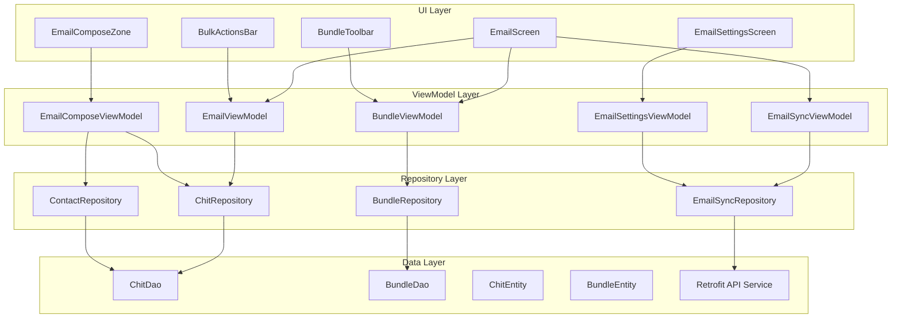
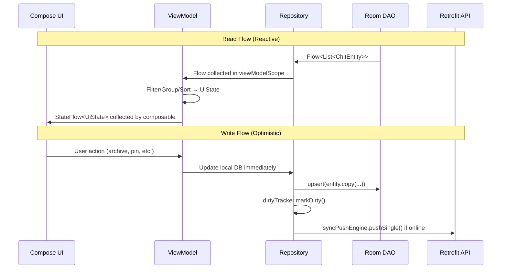
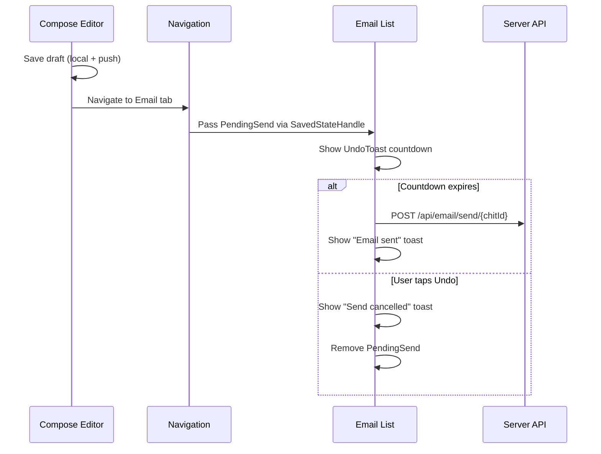

# Design Document: Android Email Client Parity

## Overview

This design covers the full implementation of email client feature parity between the CWOC Android app and the web mobile email client. The Android app currently has basic email functionality (folder filtering, thread grouping, swipe actions, basic compose) but is missing ~77 features covering: enhanced list view cards, bundle system, bulk actions, controls/sync, compose/editor, and settings.

The implementation follows the existing MVVM architecture with Jetpack Compose, Hilt DI, Room database, and Retrofit networking. New features are organized into modular ViewModels, repositories, and composables that extend the existing `EmailScreen`, `EmailViewModel`, and `EmailComposeZone`.

### Key Design Decisions

1. **Extend existing architecture** rather than rewrite — the current EmailViewModel and EmailScreen patterns are sound; we add capabilities incrementally.
2. **New ViewModels for distinct concerns** — BundleViewModel, EmailSyncViewModel, EmailSettingsViewModel keep responsibilities separated.
3. **Shared utility functions** for pure logic (body stripping, date formatting, contrast computation, smart link detection) to enable unit testing.
4. **Repository pattern for bundles** — new BundleRepository + BundleEntity + BundleDao for the bundle system.
5. **WebView for HTML rendering** — Android WebView with custom sanitization for received HTML emails.
6. **Bouncy Castle for PGP** — use the existing Android-compatible OpenPGP library rather than a JS bridge.

## Architecture

### High-Level Component Diagram



### Data Flow



## Components and Interfaces

### 1. Email List View Enhancements

#### New Composables

| Composable | File | Purpose |
|---|---|---|
| `ContactAvatar` | `EmailCardComponents.kt` | Circular avatar with image or initial fallback |
| `EmailCardEnhanced` | `EmailCardComponents.kt` | Full-featured email card with pin, badges, smart links |
| `DateGroupHeader` | `EmailCardComponents.kt` | "Today" / "Yesterday" / "Last Week" / "Older" headers |
| `SmartLinkBadge` | `EmailCardComponents.kt` | Tracking/flight/hotel badge with icon + label |
| `TagChipRow` | `EmailCardComponents.kt` | Colored tag chips (max 3) with overflow indicator |
| `AttachmentThumbnailRow` | `EmailCardComponents.kt` | Inline attachment previews on cards |
| `ThreadRibbon` | `EmailCardComponents.kt` | Vertical bar on left of threaded cards |
| `NestedChitCard` | `EmailCardComponents.kt` | Non-email chit card within expanded thread |
| `UndoToast` | `UndoToast.kt` | Bottom-positioned countdown toast with Undo button |
| `PaginationFooter` | `EmailCardComponents.kt` | "Load More (N remaining)" button |

#### Enhanced EmailViewModel Functions

```kotlin
// New state fields in EmailUiState
data class EmailUiState(
    // ... existing fields ...
    val isMultiSelectMode: Boolean = false,
    val selectedIds: Set<String> = emptySet(),
    val unreadAtTop: Boolean = false,
    val dateGrouping: String = "date", // "date" or "none"
    val paginateEmail: Boolean = false,
    val visibleThreadCount: Int = 50,
    val pendingUndo: UndoAction? = null
)

data class UndoAction(
    val type: UndoType, // ARCHIVE, DELETE
    val chitIds: List<String>,
    val subject: String,
    val startTimeMs: Long,
    val durationMs: Long = 5000
)
```

### 2. Bundle System

#### New Files

| File | Purpose |
|---|---|
| `BundleEntity.kt` | Room entity for bundles |
| `BundleDao.kt` | Room DAO for bundle CRUD |
| `BundleRepository.kt` | Repository wrapping BundleDao + API |
| `BundleViewModel.kt` | ViewModel for bundle state management |
| `BundleToolbar.kt` | Composable for bundle tabs row |
| `BundleModals.kt` | Create/Edit bundle modal composables |

#### BundleViewModel Interface

```kotlin
@HiltViewModel
class BundleViewModel @Inject constructor(
    private val bundleRepository: BundleRepository
) : ViewModel() {

    val bundles: StateFlow<List<BundleEntity>>
    val activeBundle: StateFlow<BundleEntity?>
    val isMultiPlacement: StateFlow<Boolean>
    val showCount: StateFlow<String> // "both", "unread", "total", "none"

    fun selectBundle(bundle: BundleEntity?)
    fun createBundle(name: String, description: String?, color: String?, showInOmni: Boolean)
    fun updateBundle(id: String, name: String, description: String?, color: String?, showInOmni: Boolean)
    fun deleteBundle(id: String)
    fun disableBundle(id: String)
    fun reorderBundles(orderedIds: List<String>)
    fun getBundleEmailCount(bundleId: String): Flow<BundleCount>
}

data class BundleCount(val unread: Int, val total: Int)
```

### 3. Bulk Actions

#### BulkActionsBar Composable

```kotlin
@Composable
fun BulkActionsBar(
    selectedCount: Int,
    totalCount: Int,
    isAllSelected: Boolean,
    onSelectAll: () -> Unit,
    onArchive: () -> Unit,
    onTag: () -> Unit,
    onToggleRead: () -> Unit,
    onDelete: () -> Unit
)
```

Buttons are enabled/disabled based on `selectedCount > 0`. Delete uses danger styling.

### 4. Controls and Sync

#### EmailSyncViewModel

```kotlin
@HiltViewModel
class EmailSyncViewModel @Inject constructor(
    private val emailSyncRepository: EmailSyncRepository,
    private val settingsRepository: SettingsRepository
) : ViewModel() {

    val syncState: StateFlow<SyncState> // IDLE, SYNCING, SUCCESS, ERROR
    val accountStates: StateFlow<Map<String, AccountSyncState>>
    val autoCheckInterval: StateFlow<String> // "manual", "5", "15", "30", "60"

    fun triggerSync()
    fun startAutoCheckTimer()
    fun stopAutoCheckTimer()
}

data class AccountSyncState(
    val accountId: String,
    val nickname: String,
    val isSyncing: Boolean,
    val lastSyncTime: String?,
    val error: String?,
    val newEmailCount: Int = 0
)
```

#### EmailSyncRepository

```kotlin
@Singleton
class EmailSyncRepository @Inject constructor(
    private val apiService: CwocApiService,
    private val chitDao: ChitDao
) {
    suspend fun syncEmails(): SyncResult
    suspend fun testConnection(account: EmailAccountConfig): ConnectionTestResult
    suspend fun backfillEstimate(): BackfillEstimate
    suspend fun backfill(): BackfillResult
}
```

### 5. Compose/Editor Enhancements

#### EmailComposeViewModel

```kotlin
@HiltViewModel
class EmailComposeViewModel @Inject constructor(
    private val chitRepository: ChitRepository,
    private val contactRepository: ContactRepository,
    private val settingsRepository: SettingsRepository,
    private val apiService: CwocApiService
) : ViewModel() {

    val composeState: StateFlow<EmailComposeState>
    val autocompleteResults: StateFlow<List<ContactSuggestion>>
    val markdownPreview: StateFlow<String>
    val pgpState: StateFlow<PgpState>
    val threadMessages: StateFlow<List<ThreadMessage>>

    // Autocomplete
    fun searchContacts(query: String)
    fun addRecipient(field: RecipientField, contact: ContactSuggestion)
    fun removeRecipient(field: RecipientField, index: Int)
    fun chipifyText(field: RecipientField, text: String)

    // Formatting
    fun applyFormatting(action: FormatAction, selectionStart: Int, selectionEnd: Int)

    // Actions
    fun saveDraft()
    fun send(): PendingSend
    fun sendAndArchive(): PendingSend
    fun scheduleSend(sendAt: String)
    fun cancelSchedule()
    fun discardDraft()

    // PGP
    fun togglePgp()
    fun decryptMessage(password: String)

    // Draft detection
    fun findExistingReplyDraft(originalMessageId: String): String?
    fun findExistingForwardDraft(normalizedSubject: String): String?
}
```

#### New Compose Composables

| Composable | File | Purpose |
|---|---|---|
| `RecipientChipField` | `EmailComposeComponents.kt` | To/CC/BCC field with chips + autocomplete |
| `AutocompleteDropdown` | `EmailComposeComponents.kt` | Contact suggestion dropdown |
| `RecipientChip` | `EmailComposeComponents.kt` | Styled chip (teal for known, neutral for unknown) |
| `FormattingToolbar` | `EmailComposeComponents.kt` | Markdown formatting buttons |
| `MarkdownPreview` | `EmailComposeComponents.kt` | Rendered markdown preview |
| `RenderToggle` | `EmailComposeComponents.kt` | Edit ↔ Rendered view toggle |
| `PgpToggleButton` | `EmailComposeComponents.kt` | PGP encryption toggle with status |
| `PgpDecryptBanner` | `EmailComposeComponents.kt` | Decrypt banner for received PGP emails |
| `HtmlEmailWebView` | `EmailComposeComponents.kt` | Sandboxed WebView for HTML emails |
| `HtmlTextToggle` | `EmailComposeComponents.kt` | HTML/Text pill toggle |
| `ExternalContentBanner` | `EmailComposeComponents.kt` | "External images blocked" banner |
| `SendLaterModal` | `EmailComposeModals.kt` | Date/time picker for scheduled send |
| `ScheduledIndicator` | `EmailComposeComponents.kt` | "Scheduled: {datetime}" badge with Cancel |
| `EmailThreadSection` | `EmailThreadView.kt` | Thread view (simple list or stacked) |
| `AttachmentBar` | `EmailComposeComponents.kt` | Attachment chips at bottom of body |
| `EmailSaveButtons` | `EmailComposeComponents.kt` | Save Draft / Send / Send & Archive |
| `SignatureEditorModal` | `EmailSettingsComponents.kt` | Markdown signature editor with preview |

### 6. Settings

#### EmailSettingsViewModel

```kotlin
@HiltViewModel
class EmailSettingsViewModel @Inject constructor(
    private val settingsRepository: SettingsRepository,
    private val emailSyncRepository: EmailSyncRepository
) : ViewModel() {

    val accounts: StateFlow<List<EmailAccountConfig>>
    val syncSettings: StateFlow<EmailSyncSettings>
    val privacySettings: StateFlow<EmailPrivacySettings>
    val displaySettings: StateFlow<EmailDisplaySettings>
    val bundleSettings: StateFlow<EmailBundleSettings>
    val signature: StateFlow<String>

    // Account management
    fun addAccount(config: EmailAccountConfig)
    fun updateAccount(config: EmailAccountConfig)
    fun deleteAccount(accountId: String)
    fun testConnection(config: EmailAccountConfig): Flow<ConnectionTestResult>

    // Settings
    fun updateSyncSettings(settings: EmailSyncSettings)
    fun updatePrivacySettings(settings: EmailPrivacySettings)
    fun updateDisplaySettings(settings: EmailDisplaySettings)
    fun updateBundleSettings(settings: EmailBundleSettings)
    fun updateSignature(markdown: String)

    // Backfill
    fun estimateBackfill(): Flow<BackfillEstimate>
    fun executeBackfill(): Flow<BackfillProgress>
}
```

## Data Models

### BundleEntity (New Room Entity)

```kotlin
@Entity(tableName = "bundles")
data class BundleEntity(
    @PrimaryKey val id: String,
    val name: String,
    val description: String?,
    val color: String?,           // Hex color for tab background
    val showInOmniView: Boolean,
    val isAutoBundle: Boolean,    // System-generated vs user-created
    val enabled: Boolean,
    val displayOrder: Int,
    val rules: String?,           // JSON rules definition
    val createdAt: String?,
    val updatedAt: String?
)
```

### EmailAccountConfig (Settings Data Class)

```kotlin
data class EmailAccountConfig(
    val id: String,
    val nickname: String,
    val emailAddress: String,
    val displayName: String,
    val username: String,
    val password: String,         // Stored in EncryptedSharedPreferences
    val imapHost: String,
    val imapPort: Int,
    val imapSecurity: String,     // "SSL/TLS", "STARTTLS", "None"
    val smtpHost: String,
    val smtpPort: Int,
    val smtpSecurity: String,     // "STARTTLS", "SSL/TLS", "None"
    val pgpPublicKey: String?,
    val pgpPrivateKeyId: String?
)
```

### Settings Data Classes

```kotlin
data class EmailSyncSettings(
    val maxPull: Int = 50,
    val checkInterval: String = "manual" // "manual", "5", "15", "30", "60"
)

data class EmailPrivacySettings(
    val blockTrackingPixels: Boolean = true,
    val externalContent: String = "block", // "allow", "block", "known_senders"
    val readReceipts: String = "never",    // "never", "always", "ask", "contacts_only"
    val undoSendDelay: Int = 5             // seconds
)

data class EmailDisplaySettings(
    val groupBy: String = "date",  // "date", "none"
    val paginateEmail: Boolean = false
)

data class EmailBundleSettings(
    val bundlesEnabled: Boolean = true,
    val multiPlacement: Boolean = false,
    val showCount: String = "both", // "both", "unread", "total", "none"
    val autoBundles: Map<String, Boolean> = emptyMap() // bundleId → enabled
)
```

### Compose State Models

```kotlin
data class EmailComposeState(
    val mode: ComposeMode,          // DRAFT, RECEIVED, SENT
    val from: String,
    val toRecipients: List<RecipientChipData>,
    val ccRecipients: List<RecipientChipData>,
    val bccRecipients: List<RecipientChipData>,
    val subject: String,
    val body: String,
    val bodyHtml: String?,
    val isRenderMode: Boolean = false,
    val isHtmlMode: Boolean = true,  // For received: HTML vs Text toggle
    val isPgpEnabled: Boolean = false,
    val isPgpEncrypted: Boolean = false,
    val isDecrypted: Boolean = false,
    val scheduledAt: String? = null,
    val requestReadReceipt: Boolean = false,
    val attachments: List<AttachmentData> = emptyList(),
    val signature: String = "",
    val hasExistingReplyDraft: Boolean = false,
    val existingDraftId: String? = null
)

data class RecipientChipData(
    val email: String,
    val displayName: String?,
    val imageUrl: String?,
    val color: String?,
    val isKnownContact: Boolean
)

data class ContactSuggestion(
    val contactId: String,
    val displayName: String,
    val email: String,
    val imageUrl: String?,
    val isFavorite: Boolean
)

data class AttachmentData(
    val id: String,
    val filename: String,
    val size: Long,
    val mimeType: String,
    val thumbnailUrl: String?,
    val isImage: Boolean
)

enum class ComposeMode { DRAFT, RECEIVED, SENT }
enum class RecipientField { TO, CC, BCC }
enum class FormatAction {
    BOLD, ITALIC, STRIKETHROUGH, LINK,
    H1, H2, H3, BULLET_LIST, NUMBERED_LIST,
    BLOCKQUOTE, INLINE_CODE, HORIZONTAL_RULE
}

data class PendingSend(
    val chitId: String,
    val subject: String,
    val archiveOriginalId: String? = null, // For Send & Archive
    val durationMs: Long = 5000
)
```

### Room Entity Changes (ChitEntity)

No new columns needed — the existing `ChitEntity` already has all email fields (`emailMessageId`, `emailFrom`, `emailTo`, `emailCc`, `emailBcc`, `emailSubject`, `emailBodyText`, `emailBodyHtml`, `emailDate`, `emailFolder`, `emailStatus`, `emailRead`, `emailInReplyTo`, `emailReferences`, `emailAccountId`, `emailSendAt`, `emailRequestReadReceipt`, `attachments`, `nestThreadId`, `pinned`, `archived`).

The new `BundleEntity` requires a new Room migration to create the `bundles` table.

### API Endpoints (Retrofit Interface Additions)

```kotlin
interface CwocApiService {
    // Existing endpoints used...

    // New email-specific endpoints
    @POST("api/email/sync")
    suspend fun syncEmails(): Response<SyncResponse>

    @POST("api/email/send/{chitId}")
    suspend fun sendEmail(@Path("chitId") chitId: String): Response<Unit>

    @POST("api/email/schedule/{chitId}")
    suspend fun scheduleEmail(
        @Path("chitId") chitId: String,
        @Body body: ScheduleRequest
    ): Response<Unit>

    @POST("api/email/archive-original")
    suspend fun archiveOriginal(@Body body: ArchiveOriginalRequest): Response<Unit>

    @PATCH("api/email/{chitId}/read")
    suspend fun toggleRead(@Path("chitId") chitId: String): Response<Unit>

    @GET("api/email/{chitId}/raw")
    suspend fun downloadRawEml(@Path("chitId") chitId: String): Response<ResponseBody>

    @POST("api/email/test-connection")
    suspend fun testConnection(@Body config: TestConnectionRequest): Response<TestConnectionResponse>

    @POST("api/email/backfill-estimate")
    suspend fun backfillEstimate(): Response<BackfillEstimateResponse>

    // Bundle endpoints
    @GET("api/bundles")
    suspend fun getBundles(): Response<List<BundleResponse>>

    @POST("api/bundles")
    suspend fun createBundle(@Body bundle: CreateBundleRequest): Response<BundleResponse>

    @PUT("api/bundles/{id}")
    suspend fun updateBundle(
        @Path("id") id: String,
        @Body bundle: UpdateBundleRequest
    ): Response<BundleResponse>

    @DELETE("api/bundles/{id}")
    suspend fun deleteBundle(@Path("id") id: String): Response<Unit>

    @PUT("api/bundles/reorder")
    suspend fun reorderBundles(@Body body: ReorderRequest): Response<Unit>

    @POST("api/bundles/{id}/disable")
    suspend fun disableBundle(@Path("id") id: String): Response<Unit>

    // PGP
    @POST("api/auth/private-pgp-key")
    suspend fun getPrivatePgpKey(@Body body: PgpKeyRequest): Response<PgpKeyResponse>
}
```

## Key Algorithms

### 1. Thread Grouping with Nested Chits

The existing `groupIntoThreads()` in EmailViewModel is extended to include nested chits:

```
Input: List<ChitEntity> (all email chits + chits with nestThreadId)
Output: List<EmailThread> with nested chits interspersed

Algorithm:
1. Separate email chits from nested chits (nestThreadId != null)
2. Group email chits into threads (existing logic: Message-ID chain → subject fallback)
3. For each thread, find nested chits where nestThreadId matches any email's ID in the thread
4. Sort nested chits within thread: due_date ASC → start_datetime ASC → after top email
5. Ensure nested chits never appear as the topmost card of a collapsed thread
6. Return threads sorted by latestDate DESC, with pinned threads first
```

### 2. Bundle Filtering

```
Input: List<EmailThread>, activeBundle: BundleEntity?, bundleRules: List<BundleRule>
Output: List<EmailThread> filtered to active bundle

Algorithm:
1. If activeBundle is null (All tab), return all threads
2. If multi-placement enabled: thread matches if ANY message has the bundle's tag
3. If single-placement: thread matches if the HIGHEST-PRIORITY bundle tag on the latest message equals activeBundle
4. "Everything Else" bundle: threads that don't match any other bundle
```

### 3. Smart Link Detection

```
Input: emailBodyText: String
Output: List<SmartLinkBadge> (max 3, one per category)

Algorithm:
1. For each category (Package, Flight, Hotel, Rental, Event, Restaurant, Transit, Order):
   a. Check keyword gate (e.g., "tracking", "shipped", "delivered" for Package)
   b. If keyword found, apply category-specific regex patterns
   c. Extract tracking URL and label from match
2. Deduplicate by category (first match per category wins)
3. Truncate to max badge count (from settings, default 3)
4. Return list of SmartLinkBadge(category, label, url, logoResId)
```

### 4. Body Preview Stripping Pipeline

```
Input: emailBodyText or emailBodyHtml: String
Output: Clean preview string (max 250 chars, single line)

Pipeline:
1. If HTML: strip <style> and <script> blocks entirely
2. Strip all HTML tags (regex: <[^>]+>)
3. Decode HTML entities (&amp; → &, etc.)
4. Strip markdown syntax: **bold** → bold, _italic_ → italic, [text](url) → text
5. Remove raw URLs (regex: https?://\S+)
6. Remove zero-width characters (U+200B, U+200C, U+200D, U+FEFF)
7. Collapse whitespace (regex: \s+ → single space)
8. Trim and truncate to 250 characters
```

### 5. PGP Encryption/Decryption

```
Encryption (outgoing):
1. Collect all recipient public keys from ContactRepository
2. Validate ALL recipients have keys (fail if any missing)
3. Use Bouncy Castle OpenPGP to encrypt body text with all recipient keys
4. Replace body with ASCII-armored ciphertext
5. Mark chit as PGP-encrypted (no HTML alternative sent)

Decryption (incoming):
1. Detect PGP-encrypted body (starts with "-----BEGIN PGP MESSAGE-----")
2. User provides account password
3. POST /api/auth/private-pgp-key with password → get private key
4. Decrypt private key with password (if passphrase-protected)
5. Decrypt message body with Bouncy Castle
6. Display decrypted text in-place (read-only, never saved)
7. Store original ciphertext — navigation away returns to encrypted state
```

### 6. HTML Sanitization

```
Input: emailBodyHtml: String
Output: Sanitized HTML safe for WebView rendering

Algorithm:
1. Parse HTML string
2. Remove forbidden tags entirely: script, iframe, object, embed, form, input, button, select, textarea
3. For allowed tags: strip event handler attributes (onclick, onerror, etc.)
4. Force all <a> tags to target="_blank" (external navigation)
5. If external content blocking enabled:
   a. Replace all external  with transparent 1x1 placeholder
   b. Store original URL in data-original-src attribute
6. Remove tracking pixels (1x1 or 1x2 images by dimension)
7. Return sanitized HTML string for WebView.loadDataWithBaseURL()
```

### 7. Contact Autocomplete Search

```
Input: query: String (2+ chars), existingRecipients: Set<String>
Output: List<ContactSuggestion> (max 5, favorites first)

Algorithm:
1. Search contacts where name OR email contains query (case-insensitive)
2. Exclude contacts whose email is already in existingRecipients
3. Partition results: favorites vs non-favorites
4. Sort each partition by relevance (exact prefix match > contains)
5. Concatenate: favorites first, then non-favorites
6. Take first 5 results
```

### 8. Date Formatting

```
Input: dateStr: String (ISO 8601), timeFormat: String ("12h" or "24h")
Output: Formatted display string

Algorithm:
1. Parse ISO date string to LocalDate/LocalDateTime
2. Compare to today:
   - Same day → format time only (respecting 12h/24h setting)
   - Yesterday → "Yesterday"
   - Same year → "Mon DD" (e.g., "May 18")
   - Prior year → "Mon DD, YYYY" (e.g., "May 18, 2023")
```

### 9. Contrast-Safe Text Color Computation

```
Input: backgroundColor: Color (hex string)
Output: textColor: Color (black or white for maximum contrast)

Algorithm:
1. Parse hex to RGB components
2. Compute relative luminance: L = 0.2126*R + 0.7152*G + 0.0722*B (linearized)
3. If L > 0.179: return dark text (#1a1208)
4. Else: return light text (#fffaf0)
```

### 10. Markdown Formatting Actions

```
Input: text: String, selectionStart: Int, selectionEnd: Int, action: FormatAction
Output: newText: String, newSelectionStart: Int, newSelectionEnd: Int

Actions:
- BOLD: wrap selection with "**" → "**selected**"
- ITALIC: wrap selection with "_" → "_selected_"
- STRIKETHROUGH: wrap selection with "~~" → "~~selected~~"
- LINK: wrap as "[selected](url)" with cursor on "url"
- H1/H2/H3: prefix current line with "#"/"##"/"###" + space
- BULLET_LIST: prefix current line with "- "
- NUMBERED_LIST: prefix current line with "1. "
- BLOCKQUOTE: prefix selected lines with "> "
- INLINE_CODE: wrap selection with backticks
- HORIZONTAL_RULE: insert "\n---\n" at cursor
```

## Navigation Patterns

### New Screens/Modals

| Screen/Modal | Navigation Route | Trigger |
|---|---|---|
| Email Settings | `email_settings` | Settings → Email section |
| Account Edit | `email_account_edit/{id}` | Manage Accounts → tap account |
| Create Bundle Modal | Dialog overlay | "+" button on bundle toolbar |
| Edit Bundle Modal | Dialog overlay | Bundle context menu → Edit |
| Tag Picker Modal | Full-screen dialog | Bulk Tag button |
| Send Later Modal | Dialog overlay | Send Later button in compose |
| Signature Editor Modal | Dialog overlay | Edit Signature button in settings |
| Attachment Preview | Dialog overlay | Tap attachment thumbnail |
| PGP Password Modal | Dialog overlay | Decrypt button on PGP email |

### Navigation Flow for Undo-Send



## Correctness Properties

*A property is a characteristic or behavior that should hold true across all valid executions of a system — essentially, a formal statement about what the system should do. Properties serve as the bridge between human-readable specifications and machine-verifiable correctness guarantees.*

### Property 1: Body Preview Sanitization Pipeline

*For any* email body string (HTML or markdown), the body preview stripping function SHALL produce output that contains no HTML tags, no markdown syntax markers, no raw URLs, no zero-width characters, no consecutive whitespace characters, and has length ≤ 250 characters.

**Validates: Requirements 6.2, 6.3, 6.4, 6.5, 6.6, 6.7**

### Property 2: Date Formatting Correctness

*For any* valid ISO 8601 date string and any time format setting ("12h" or "24h"), the date formatting function SHALL produce: time-only for today's dates, "Yesterday" for yesterday's dates, "Mon DD" format for same-year dates, and "Mon DD, YYYY" format for prior-year dates.

**Validates: Requirements 11.1, 11.2, 11.3, 11.4**

### Property 3: Date Group Assignment

*For any* valid email date, the date group classification function SHALL assign it to exactly one group: "Today" (same day), "Yesterday" (previous day), "Last Week" (past 7 days excluding today/yesterday), or "Older" (everything else).

**Validates: Requirements 14.1, 14.2, 14.3, 14.4, 14.5**

### Property 4: Pinned Emails Sort First

*For any* list of email threads with mixed pinned states, the sorted output SHALL place all pinned threads before all unpinned threads, with relative ordering preserved within each group.

**Validates: Requirements 3.4**

### Property 5: Unread-at-Top Sort Invariant

*For any* list of email threads within a date group, when unread-at-top is enabled, all unread threads SHALL appear before all read threads within that group, with newest-first ordering preserved within each sub-group.

**Validates: Requirements 34.2, 34.3**

### Property 6: Tag Chip Display Constraints

*For any* email with N non-system tags, the display SHALL show min(N, 3) tag chips, and when N > 3, SHALL show a "+{N-3}" overflow indicator whose value equals the count of remaining tags.

**Validates: Requirements 10.1, 10.4**

### Property 7: Contrast-Safe Text Color

*For any* background color (valid hex), the computed text color SHALL produce a WCAG-compliant contrast ratio of at least 4.5:1 against that background.

**Validates: Requirements 10.3, 12.2**

### Property 8: Smart Link Badge Constraints

*For any* email body with detected tracking patterns, the badge list SHALL contain at most the configured maximum count (default 3), and SHALL contain at most one badge per category.

**Validates: Requirements 8.2, 8.3**

### Property 9: Account Filter Correctness

*For any* subset of active account IDs and any list of email chits, the filtered result SHALL contain only chits whose emailAccountId is in the active set, and SHALL contain all such chits from the input.

**Validates: Requirements 33.3, 33.4**

### Property 10: Contact Autocomplete Filtering

*For any* query string (2+ chars), contact list, and set of already-selected recipients, the autocomplete results SHALL: match the query by name or email, exclude already-selected recipients, place favorites before non-favorites, and contain at most 5 results.

**Validates: Requirements 36.1, 36.2, 36.3, 36.4, 36.5, 36.6**

### Property 11: Markdown Formatting Round-Trip

*For any* text string and cursor selection, applying a formatting action (bold, italic, strikethrough, code) and then removing it SHALL produce the original text unchanged.

**Validates: Requirements 38.3, 38.4, 38.5, 38.11**

### Property 12: Subject-Title Bidirectional Sync

*For any* string value, setting the subject field SHALL update the title to match, and setting the title (when subject is empty or matches previous title) SHALL update the subject to match.

**Validates: Requirements 43.1, 43.2, 43.3**

### Property 13: PGP Encryption Round-Trip

*For any* plaintext message body and valid set of recipient public keys + matching private key, encrypting with the public keys and then decrypting with the private key SHALL produce the original plaintext.

**Validates: Requirements 48.7, 49.4**

### Property 14: HTML Sanitization Removes Forbidden Tags

*For any* HTML string, the sanitization function SHALL produce output that contains no instances of forbidden tags (script, iframe, object, embed, form, input, button, select, textarea) while preserving the content of allowed tags.

**Validates: Requirements 50.2**

### Property 15: External Content Blocking

*For any* HTML string containing external image sources, when blocking is enabled, the output SHALL have all external `src` attributes replaced with placeholder values, and the original URLs SHALL be preserved in `data-original-src` attributes.

**Validates: Requirements 51.1, 51.2**

### Property 16: Pagination Limit

*For any* list of N email threads where N > 50 and pagination is enabled, the initially rendered list SHALL contain exactly 50 threads, and after each "Load More" action SHALL contain min(previous + 50, N) threads.

**Validates: Requirements 15.1, 15.2, 15.3**

### Property 17: Bundle Count Accuracy

*For any* bundle and set of email chits classified into that bundle, the computed unread count SHALL equal the number of chits with emailRead != true, and the total count SHALL equal the total number of chits in that bundle.

**Validates: Requirements 20.1, 20.2, 20.3**

### Property 18: Select-All Selects All Visible

*For any* list of visible email threads, after a select-all action, the selection set SHALL equal the complete set of visible thread IDs, and the selected count SHALL equal the visible thread count.

**Validates: Requirements 27.2, 2.5**

### Property 19: Existing Draft Detection

*For any* email with Message-ID M, if a draft chit exists with email_in_reply_to == M, the reply draft detection function SHALL return that draft's ID. If no such draft exists, it SHALL return null.

**Validates: Requirements 58.1, 58.2**

### Property 20: Nested Chit Sort Order

*For any* set of nested chits within a thread, the sort order SHALL be: chits with due_date sorted ascending first, then chits with start_datetime sorted ascending, then chits with no dates positioned after the top email message.

**Validates: Requirements 18.5, 18.6**

## Error Handling

### Network Errors

| Scenario | Handling |
|---|---|
| Email sync fails | Per-account error state on pills; persistent error toast with "Email Settings" / "Copy Error" / "Dismiss" options |
| Send fails after undo countdown | Toast "Failed to send: {error}"; draft remains in Drafts folder |
| Bundle API fails | Toast with error; fall back to cached bundle data from Room |
| Test Connection fails | Display which connection failed (IMAP/SMTP/both) with error details in the account edit view |
| PGP key fetch fails | Toast "Failed to retrieve PGP key"; decryption banner remains |
| Backfill fails | Toast with error message; no partial state corruption |

### Local Errors

| Scenario | Handling |
|---|---|
| Room query fails | Log error; show empty state with retry option |
| Attachment download fails | Toast "Download failed: {filename}" |
| HTML sanitization encounters malformed HTML | Graceful degradation: show plain text fallback |
| PGP decryption fails (wrong password) | Toast "Decryption failed — check your password" |

### Optimistic Update Rollback

For archive/delete with undo:
1. Immediately hide card from UI (optimistic)
2. Start countdown timer
3. If countdown expires: execute API call; on failure, restore card + show error toast
4. If user taps Undo: restore card with flash animation, cancel timer

## Testing Strategy

### Property-Based Tests

Property-based testing is appropriate for this feature because it contains many pure functions with clear input/output behavior (body stripping, date formatting, contrast computation, sorting, filtering, autocomplete search, markdown formatting, HTML sanitization).

**Library:** [Kotest](https://kotest.io/) with the property testing module (`kotest-property`)

**Configuration:** Minimum 100 iterations per property test.

**Tag format:** Each test is tagged with `Feature: android-email-client-parity, Property {N}: {title}`

Properties to implement as PBT:
1. Body preview sanitization pipeline (Property 1)
2. Date formatting correctness (Property 2)
3. Date group assignment (Property 3)
4. Pinned sort invariant (Property 4)
5. Unread-at-top sort invariant (Property 5)
6. Tag chip display constraints (Property 6)
7. Contrast-safe text color (Property 7)
8. Smart link badge constraints (Property 8)
9. Account filter correctness (Property 9)
10. Contact autocomplete filtering (Property 10)
11. Markdown formatting round-trip (Property 11)
12. Subject-title sync (Property 12)
13. PGP round-trip (Property 13)
14. HTML sanitization (Property 14)
15. External content blocking (Property 15)
16. Pagination limit (Property 16)
17. Bundle count accuracy (Property 17)
18. Select-all correctness (Property 18)
19. Draft detection (Property 19)
20. Nested chit sort order (Property 20)

### Unit Tests (Example-Based)

Focus areas for example-based unit tests:
- Contact avatar initial extraction (specific edge cases: empty string, single char, emoji names)
- Status badge rendering (draft vs sent vs received)
- Reply indicator detection (specific thread configurations)
- Undo toast timing behavior
- Bundle context menu option visibility (auto-bundle vs user-created vs "Everything Else")
- Compose mode transitions (draft → sent, received → reply)
- Signature auto-apply logic
- Scheduled send indicator display

### Integration Tests

Focus areas:
- Email sync flow (mock API → verify Room updates)
- Bulk operations (archive, delete, tag — verify all selected items updated)
- Send flow (save draft → undo countdown → API call)
- Bundle CRUD (create → verify in Room → verify API called)
- Test Connection (mock IMAP/SMTP responses)
- Backfill flow (estimate → confirm → sync)

### UI Tests (Compose Testing)

Focus areas:
- Multi-select mode entry/exit via long-press
- Swipe-to-dismiss with undo restoration
- Bundle tab interaction (tap to filter, long-press for context menu)
- Recipient chip field (type → autocomplete → select → chip appears)
- Formatting toolbar button interactions
- Render toggle (edit ↔ preview)
- Thread expansion/collapse animation
