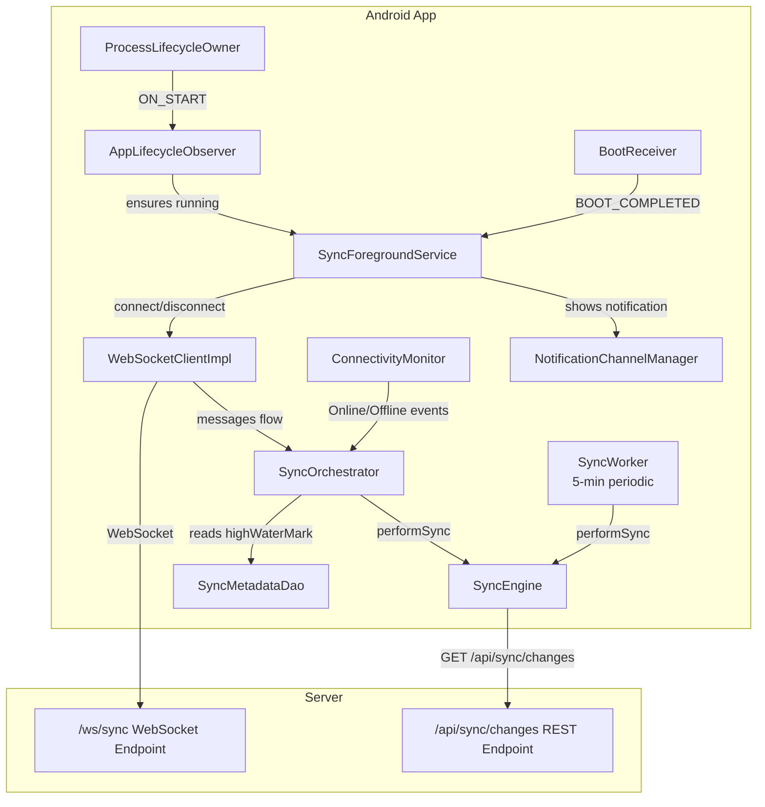

# Design Document: Android Real-Time Sync

## Overview

This feature adds a **foreground service**-based WebSocket connection to the Android app so that data changes are received instantly regardless of whether the app UI is in the foreground, background, or closed. The design leverages the **existing** `WebSocketClient`, `SyncOrchestrator`, `ConnectivityMonitor`, and `SyncEngine` infrastructure — the primary new work is a `SyncForegroundService` that owns the WebSocket lifecycle (similar to how FairEmail maintains IMAP IDLE connections), a simplified `AppLifecycleObserver` that ensures the service is running, and enhancing the existing `SyncOrchestrator` with sync coalescing and retry logic.

**Key design decisions:**

1. **Foreground service owns the WebSocket** — `SyncForegroundService` calls `connect()` on start and `disconnect()` on stop. The WebSocket stays alive through app close, background, and reboot (via `START_STICKY` + `BootReceiver`).
2. **Reuse existing WebSocketClient** — The app already has `WebSocketClientImpl` with exponential backoff reconnection. We adapt its parameters (initial delay → 1s, max → 30s, add 10-attempt cap) rather than building a new class.
3. **Simplified AppLifecycleObserver** — No longer connects/disconnects. It only ensures the foreground service is running when the app comes to the foreground (in case Android killed it).
4. **Enhance SyncOrchestrator** — Add sync coalescing (one-at-a-time with a single queued follow-up) and single-retry-on-failure logic.
5. **No server changes** — The server's `/ws/sync` endpoint already broadcasts JSON messages with a `type` field. The Android app simply connects and listens.
6. **Battery optimization prompt** — One-time prompt after login to request Doze exemption for reliable background delivery.

## Architecture



**Data flow on message receipt:**

1. Server broadcasts `{"type": "chits_changed"}` over WebSocket
2. `WebSocketClientImpl` parses JSON → emits `WebSocketMessage` on `messages` flow
3. `SyncOrchestrator` collects the message, checks if type is recognized
4. If recognized and no sync in progress: reads `highWaterMark` from `SyncMetadataDao`, calls `SyncEngine.performSync(since)`
5. If sync already in progress: sets a "queued" flag (coalescing)
6. `SyncEngine` fetches changes from REST API, upserts into Room DB

**Lifecycle flow (foreground service model):**

1. User logs in → app starts `SyncForegroundService`
2. `SyncForegroundService.onStartCommand()` → shows persistent notification → calls `SyncWebSocketManager.connect()`
3. App enters background / closed → service stays alive, WebSocket stays connected
4. App returns to foreground → `AppLifecycleObserver.onStart()` → verifies service is running, starts it if killed
5. Device reboots → `BootReceiver` starts `SyncForegroundService` if `device_token` present
6. User logs out → app stops `SyncForegroundService` → `disconnect()` called

## Components and Interfaces

### SyncForegroundService (NEW)

```kotlin
@AndroidEntryPoint
class SyncForegroundService : Service() {

    @Inject lateinit var syncWebSocketManager: SyncWebSocketManager

    companion object {
        const val NOTIFICATION_ID = 9001
        const val ACTION_STOP = "com.cwoc.app.STOP_SYNC_SERVICE"

        fun start(context: Context) {
            val intent = Intent(context, SyncForegroundService::class.java)
            ContextCompat.startForegroundService(context, intent)
        }

        fun stop(context: Context) {
            context.stopService(Intent(context, SyncForegroundService::class.java))
        }
    }

    override fun onStartCommand(intent: Intent?, flags: Int, startId: Int): Int {
        // Show persistent notification
        val notification = buildNotification("CWOC connected")
        startForeground(NOTIFICATION_ID, notification, ServiceInfo.FOREGROUND_SERVICE_TYPE_DATA_SYNC)

        // Establish WebSocket connection
        syncWebSocketManager.connect()

        return START_STICKY  // Auto-restart if killed
    }

    override fun onDestroy() {
        syncWebSocketManager.disconnect()
        super.onDestroy()
    }

    override fun onBind(intent: Intent?): IBinder? = null

    private fun buildNotification(text: String): Notification { /* ... */ }
    fun updateNotificationText(text: String) { /* ... */ }
}
```

**Key behaviors:**
- Starts on login, stops on logout
- Shows a persistent `IMPORTANCE_MIN` notification ("CWOC connected") on `cwoc_sync_service` channel
- Calls `SyncWebSocketManager.connect()` on start, `disconnect()` on destroy
- Returns `START_STICKY` from `onStartCommand()` so Android restarts it if killed by memory pressure
- Uses `FOREGROUND_SERVICE_TYPE_DATA_SYNC` to declare its purpose to the OS
- Updates notification text to "CWOC reconnecting..." when WebSocket is in backoff state
- Runs in the same process as the main app (no `android:process` attribute) to share the singleton `SyncWebSocketManager`

### AppLifecycleObserver (NEW — simplified)

```kotlin
@Singleton
class AppLifecycleObserver @Inject constructor(
    private val prefs: SharedPreferences
) : DefaultLifecycleObserver {

    override fun onStart(owner: LifecycleOwner) {
        // Ensure the foreground service is running (in case Android killed it)
        if (hasDeviceToken()) {
            SyncForegroundService.start(appContext)
        }
    }

    override fun onStop(owner: LifecycleOwner) {
        // Do nothing — service stays alive in background
    }

    private fun hasDeviceToken(): Boolean =
        prefs.getString("device_token", null)?.isNotBlank() == true
}
```

- Registered with `ProcessLifecycleOwner.get().lifecycle` in `CwocApplication.onCreate()`
- **Does NOT call connect/disconnect** — that's the service's job
- Only ensures the service is running when the app comes to foreground (recovery from system kill)
- Guards behind credential check (`device_token` present)
- Does NOT interact with `WorkManager` or `SyncWorker` in any way

### SyncOrchestrator (MODIFIED)

Enhanced `handleWebSocketMessage()`:
- Adds sync coalescing: `Mutex` guards sync execution, a `syncQueued` flag coalesces messages during in-progress sync
- Adds single retry on failure: if sync fails, retry once after 5s delay
- Triggers immediate sync on successful reconnection (catch-up sync)
- Notifies `SyncForegroundService` of connection state changes (for notification text updates)

### WebSocketClientImpl (MODIFIED)

Parameter adjustments to existing implementation:
- `INITIAL_BACKOFF_MS`: 2000 → 1000 (per requirements: start at 1 second)
- `MAX_BACKOFF_MS`: 60000 → 30000 (per requirements: cap at 30 seconds)
- Add `MAX_RECONNECT_ATTEMPTS = 10` counter
- Add `resetBackoff()` method (called on connectivity restore or foreground transition)
- Add 401 detection in `onFailure` to stop reconnection permanently
- Emits connection state changes (connected/reconnecting/disconnected) for notification updates

### NotificationChannelManager (MODIFIED)

```kotlin
companion object {
    const val CHANNEL_ID_ALARMS = "cwoc_alarms"
    const val CHANNEL_ID_REMINDERS = "cwoc_reminders"
    const val CHANNEL_ID_TIMERS = "cwoc_timers"
    const val CHANNEL_ID_SYNC_SERVICE = "cwoc_sync_service"  // NEW
}

fun createChannels() {
    // ... existing channels ...

    // Sync Service channel — silent, minimal visual presence
    val syncServiceChannel = NotificationChannel(
        CHANNEL_ID_SYNC_SERVICE,
        "Sync Service",
        NotificationManager.IMPORTANCE_MIN
    ).apply {
        description = "Persistent notification for the background sync connection"
        setShowBadge(false)
    }

    notificationManager.createNotificationChannels(
        listOf(alarmsChannel, remindersChannel, timersChannel, syncServiceChannel)
    )
}
```

### BootReceiver (MODIFIED)

```kotlin
class BootReceiver : BroadcastReceiver() {

    @EntryPoint
    @InstallIn(SingletonComponent::class)
    interface BootReceiverEntryPoint {
        fun notificationScheduler(): NotificationScheduler
    }

    override fun onReceive(context: Context, intent: Intent) {
        if (intent.action != Intent.ACTION_BOOT_COMPLETED) return

        // Start SyncForegroundService if authenticated
        val prefs = context.getSharedPreferences("cwoc_prefs", Context.MODE_PRIVATE)
        val hasToken = prefs.getString("device_token", null)?.isNotBlank() == true
        if (hasToken) {
            SyncForegroundService.start(context)
        }

        // Existing alarm rescheduling logic
        val pendingResult = goAsync()
        val entryPoint = EntryPointAccessors.fromApplication(
            context.applicationContext,
            BootReceiverEntryPoint::class.java
        )
        val scheduler = entryPoint.notificationScheduler()

        CoroutineScope(Dispatchers.IO).launch {
            try {
                scheduler.rescheduleAll()
            } finally {
                pendingResult.finish()
            }
        }
    }
}
```

### Battery Optimization Prompt (NEW)

```kotlin
object BatteryOptimizationHelper {

    private const val PREF_BATTERY_PROMPT_SHOWN = "battery_optimization_prompt_shown"

    fun shouldShowPrompt(context: Context, prefs: SharedPreferences): Boolean {
        if (prefs.getBoolean(PREF_BATTERY_PROMPT_SHOWN, false)) return false
        val pm = context.getSystemService(Context.POWER_SERVICE) as PowerManager
        return !pm.isIgnoringBatteryOptimizations(context.packageName)
    }

    fun recordPromptShown(prefs: SharedPreferences) {
        prefs.edit().putBoolean(PREF_BATTERY_PROMPT_SHOWN, true).apply()
    }

    fun requestExemption(context: Context) {
        val intent = Intent(Settings.ACTION_REQUEST_IGNORE_BATTERY_OPTIMIZATIONS).apply {
            data = Uri.parse("package:${context.packageName}")
        }
        context.startActivity(intent)
    }
}
```

- Called once after successful login
- Checks `PowerManager.isIgnoringBatteryOptimizations()` before showing
- Records dismissal/acceptance in SharedPreferences — never shown again
- One-time per device, regardless of login/logout cycles

### SyncEngine (UNCHANGED)

The existing `SyncEngine.performSync()` already:
- Accepts a `since` parameter (high water mark)
- Uses `upsertAll()` for idempotent writes
- Returns `SyncResult` (Success/Error/NetworkError)

No modifications needed. Concurrent access is serialized via the `Mutex` in `SyncOrchestrator`.

### ConnectivityMonitor (UNCHANGED)

Already provides `isOnline: StateFlow<Boolean>` and `events: Flow<ConnectivityEvent>`. Used by `SyncOrchestrator` to trigger reconnection on network restore.

## Data Models

### WebSocketMessage (EXISTING — no changes)

```kotlin
data class WebSocketMessage(
    val type: String,           // "chits_changed", "settings_changed", "contacts_changed", etc.
    val entity: String? = null,
    val id: String? = null,
    val serverVersion: Int? = null
)
```

### Recognized Message Types

```kotlin
private val SYNC_TRIGGER_TYPES = setOf(
    "chits_changed",
    "settings_changed",
    "contacts_changed",
    // Legacy types already handled by existing code:
    "change",
    "changes_available"
)
```

### SyncOrchestrator State

```kotlin
// Coalescing state (internal to SyncOrchestrator)
private val syncMutex = Mutex()
private var syncInProgress = false
private var syncQueued = false

// Retry state
private var retryJob: Job? = null
```

### WebSocketClientImpl State

```kotlin
// Reconnection state (modifications to existing fields)
private var reconnectAttempts: Int = 0          // NEW: counter for 10-attempt cap
private var permanentlyDisabled: Boolean = false // NEW: set on 401
```

### Connection State (NEW)

```kotlin
enum class WebSocketConnectionState {
    CONNECTED,
    RECONNECTING,
    DISCONNECTED
}

// Emitted by WebSocketClientImpl, observed by SyncForegroundService for notification updates
val connectionState: StateFlow<WebSocketConnectionState>
```

## Correctness Properties

*A property is a characteristic or behavior that should hold true across all valid executions of a system — essentially, a formal statement about what the system should do. Properties serve as the bridge between human-readable specifications and machine-verifiable correctness guarantees.*

### Property 1: WebSocket URL Scheme Transformation

*For any* server URL string with an `http://` or `https://` scheme, the `buildWebSocketUrl()` function SHALL produce a URL with `ws://` or `wss://` respectively, preserving the host, port, and path, and appending `/ws/sync`.

**Validates: Requirements 1.5**

### Property 2: Connection Guard on Missing Credentials

*For any* combination of server URL and device token where either value is null or blank, calling `connect()` SHALL NOT establish a WebSocket connection (no network request is made).

**Validates: Requirements 1.4, 4.5**

### Property 3: Authorization Header Construction

*For any* non-blank device token string, the WebSocket handshake request SHALL include an `Authorization` header with value `"Bearer "` concatenated with the exact token string.

**Validates: Requirements 1.6**

### Property 4: Exponential Backoff with Cap and Attempt Limit

*For any* number of consecutive reconnection failures N (where 1 ≤ N ≤ 10), the delay before the Nth attempt SHALL equal `min(1 * 2^(N-1), 30)` seconds, and no further automatic reconnection attempts SHALL be made after N = 10.

**Validates: Requirements 1.7, 3.1, 3.6**

### Property 5: Backoff Reset on Successful Connection

*For any* sequence of consecutive failures followed by a successful WebSocket connection, the next failure's reconnection delay SHALL be the initial value (1 second) and the attempt counter SHALL be 0.

**Validates: Requirements 1.8, 3.7**

### Property 6: Message Type Routing

*For any* WebSocket message, `performSync()` is triggered if and only if the message's `type` field is in the set `{chits_changed, settings_changed, contacts_changed, change, changes_available}`. Messages with any other type value SHALL NOT trigger a sync.

**Validates: Requirements 2.1, 2.3**

### Property 7: Sync Coalescing Invariant

*For any* sequence of N WebSocket messages (N ≥ 1) received while a sync is already in progress, at most one additional sync SHALL be queued, and after the in-progress sync completes, exactly one follow-up sync SHALL execute (not N syncs).

**Validates: Requirements 2.2**

### Property 8: Concurrent Sync Serialization

*For any* concurrent invocations of `performSync()` from different sources (WebSocket-triggered and WorkManager-triggered), the executions SHALL be serialized such that no two `performSync()` calls execute their network request simultaneously.

**Validates: Requirements 5.2**

### Property 9: Idempotent Upsert

*For any* set of sync changes from the server, applying them N times (N ≥ 1) via `SyncEngine.performSync()` SHALL produce the same database state as applying them exactly once — no duplicate records are created.

**Validates: Requirements 5.4**

### Property 10: Service Persistence Through App UI Lifecycle

*For any* sequence of app UI lifecycle events (Activity created, destroyed, finished, removed from recents) while the `SyncForegroundService` is running and has not been explicitly stopped, the service SHALL remain running and the WebSocket connection SHALL remain active.

**Validates: Requirements 7.1, 11.3**

### Property 11: Notification State Reflects Connection State

*For any* `WebSocketConnectionState` value (CONNECTED, RECONNECTING, DISCONNECTED) while the `SyncForegroundService` is running, the foreground notification text SHALL reflect the current connection state — "CWOC connected" when connected, "CWOC reconnecting..." when reconnecting.

**Validates: Requirements 7.4, 8.2, 8.5**

### Property 12: Boot Restart Conditional on Authentication

*For any* device boot event, the `BootReceiver` SHALL start `SyncForegroundService` if and only if a non-blank `device_token` is present in SharedPreferences. If no token is present, the service SHALL NOT be started.

**Validates: Requirements 11.4**

### Property 13: Battery Optimization Prompt One-Time Behavior

*For any* sequence of login/logout cycles on a device, the battery optimization prompt SHALL appear at most once — specifically on the first login where battery optimization is not already disabled and the prompt has not been previously shown or dismissed.

**Validates: Requirements 10.1, 10.3, 10.5**

## Error Handling

| Scenario | Behavior |
|----------|----------|
| Missing server URL or device token | `connect()` is a no-op; logs reason at warn level |
| WebSocket handshake returns 401 | Stop all reconnection permanently; log auth failure |
| WebSocket unexpected close (non-1000) | Exponential backoff reconnect (1s → 30s cap, max 10 attempts) |
| Network lost while connected | WebSocket `onFailure` fires → backoff reconnect begins; notification updates to "reconnecting" |
| Network restored while disconnected | `ConnectivityMonitor` emits `Online` → reset backoff, reconnect immediately |
| Sync triggered by WS message fails | Retry once after 5 seconds; if retry fails, wait for next message |
| Sync triggered by WS while sync in progress | Coalesce: set `syncQueued = true`, execute one follow-up after current completes |
| Service killed by Android (low memory) | `START_STICKY` causes automatic restart; service re-establishes WebSocket on restart |
| App UI closed (removed from recents) | Service continues running; WebSocket stays connected |
| Device reboots | `BootReceiver` starts service if `device_token` present |
| `performSync()` throws exception | Caught by `SyncOrchestrator`; logged; does not crash the app |
| WebSocket message with malformed JSON | `parseMessage()` returns null; message is dropped; logged at warn level |
| Battery optimization kills service | `START_STICKY` + battery exemption prompt mitigate; service restarts when possible |

## Testing Strategy

### Unit Tests (Example-Based)

- **SyncForegroundService**: Verify `onStartCommand` calls `connect()`, `onDestroy` calls `disconnect()`
- **SyncForegroundService**: Verify `onStartCommand` returns `START_STICKY`
- **SyncForegroundService**: Verify notification uses `FOREGROUND_SERVICE_TYPE_DATA_SYNC`
- **AppLifecycleObserver**: Verify `onStart` starts service when token present; skips when token absent
- **AppLifecycleObserver**: Verify `onStop` does nothing (no disconnect, no service stop)
- **SyncOrchestrator retry**: Verify single retry after 5s on sync failure, no further retries on second failure
- **WebSocketClientImpl 401 handling**: Verify `permanentlyDisabled` is set and no reconnect scheduled
- **Reconnection on network restore**: Verify backoff resets and immediate reconnect on `ConnectivityEvent.Online`
- **Catch-up sync on reconnect**: Verify `performSync()` is called after successful reconnection
- **BootReceiver**: Verify service started when token present; not started when token absent
- **BatteryOptimizationHelper**: Verify prompt shown only when not exempted and not previously dismissed
- **BatteryOptimizationHelper**: Verify prompt never shown after dismissal regardless of login cycles
- **NotificationChannelManager**: Verify `cwoc_sync_service` channel created with `IMPORTANCE_MIN`

### Property-Based Tests

Property-based testing library: **Kotest** (property testing module, already compatible with the Kotlin/JVM project).

Each property test runs a minimum of **100 iterations** with randomized inputs.

| Property | Test Description |
|----------|-----------------|
| Property 1 | Generate random URLs with http/https schemes, various hosts/ports/paths → verify ws/wss transformation and `/ws/sync` suffix |
| Property 2 | Generate random combinations of null/blank/valid URLs and tokens → verify no connection when either is invalid |
| Property 3 | Generate random non-blank token strings → verify header format is exactly `"Bearer $token"` |
| Property 4 | Generate random N in 1..15 → verify delay = min(2^(N-1), 30) seconds; verify no attempt after N=10 |
| Property 5 | Generate random failure sequences (length 1..10) followed by success → verify next delay is 1s |
| Property 6 | Generate random type strings (mix of recognized and unrecognized) → verify sync triggered iff type is recognized |
| Property 7 | Generate random message counts (1..100) arriving during in-progress sync → verify exactly 1 follow-up sync |
| Property 8 | Generate random concurrent sync invocations → verify serial execution via Mutex |
| Property 9 | Generate random sync payloads, apply 1..5 times → verify DB state is identical each time |
| Property 10 | Generate random sequences of Activity lifecycle events → verify service remains running throughout |
| Property 11 | Generate random connection state transitions → verify notification text matches expected value for each state |
| Property 12 | Generate random combinations of boot event + token presence/absence → verify service start iff token present |
| Property 13 | Generate random sequences of login/logout/dismiss events → verify prompt appears at most once and only when conditions met |

**Tag format:** `Feature: android-realtime-sync, Property {N}: {property_text}`

### Integration Tests

- End-to-end: Start app → verify service starts → verify WebSocket connects → send message from server → verify sync triggers → verify data appears in Room DB
- Service persistence: Start service → close app UI → verify WebSocket still connected → send message → verify sync still triggers
- Boot recovery: Simulate boot with token present → verify service starts and WebSocket connects
- Lifecycle recovery: Start service → simulate system kill → verify service restarts via START_STICKY → verify WebSocket reconnects
- Coexistence: Run periodic SyncWorker while WebSocket is active → verify no conflicts
- Notification: Start service → verify notification shows "CWOC connected" → simulate disconnect → verify notification updates to "CWOC reconnecting..."

### What Is NOT Property-Tested

- DI wiring (Requirements 6.x) — verified at compile time by Hilt
- Lifecycle registration timing (4.1, 6.3) — verified by code structure
- Non-interference with SyncWorker (4.4, 5.1, 5.3) — verified by code review (no WorkManager references in new code)
- Notification channel creation (8.1, 8.6) — smoke test only (one-time setup)
- `FOREGROUND_SERVICE_TYPE_DATA_SYNC` usage (7.5) — example test only (implementation detail)
- Alarm scheduling from sync (9.x) — existing behavior, integration test coverage
