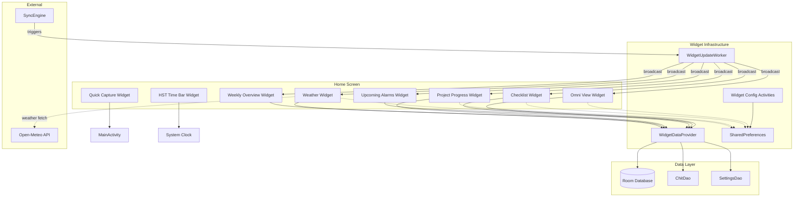

# Design Document

## Overview

This design covers 8 Android home screen widgets for the CWOC app, built on top of the existing widget infrastructure (`WidgetDataProvider`, `WidgetUpdateWorker`, and the `AppWidgetProvider` pattern already used by the Quick Add, Today Calendar, and Upcoming Tasks widgets).

All widgets use Android's `RemoteViews` system, read data from the local Room database via `WidgetDataProvider`, and follow the parchment theme (#fffaf0 background, #6b4e31 accent, Serif font family). Widgets that require user configuration (Checklist, Project Progress, Weather) use a `Widget_Config_Activity` that persists selections in `SharedPreferences` keyed by `appWidgetId`.

The 8 new widgets are:

1. **Omni View Widget** — Scrollable list of chits using `RemoteViewsService`/`RemoteViewsFactory`
2. **Quick Capture Widget** — 1×1 tap-to-create with type selection menu
3. **Checklist Widget** — Interactive checkboxes for a selected checklist chit
4. **Upcoming Alarms Widget** — Next 3 alarms with countdown timers
5. **Project Progress Widget** — HST-colored progress bar for a selected project
6. **Weather Widget** — Current conditions for a chosen location
7. **Weekly Overview Widget** — 7-day strip with chit counts per day
8. **HST Time Bar Widget** — Decimal time progress bar with 1-second updates

### Key Design Decisions

- **RemoteViewsService pattern** for scrollable widgets (Omni View, Checklist) — required by Android for ListView/StackView in widgets
- **Direct Room access** via `WidgetDataProvider` singleton — widgets run outside the app process and cannot use Hilt injection, so they open their own database connection (matching the existing pattern)
- **SharedPreferences for config** — standard Android widget configuration persistence, keyed by `appWidgetId`
- **WorkManager for periodic refresh** — extends the existing `WidgetUpdateWorker` to include all new widget types in its 30-minute cycle
- **Handler-based timer** for HST widget — the only widget needing sub-minute updates; uses screen on/off broadcasts to pause/resume

## Architecture



### Widget Update Flow

1. **Periodic (30 min)**: `WidgetUpdateWorker` fires → broadcasts `ACTION_APPWIDGET_UPDATE` to all registered providers
2. **Sync-triggered**: `SyncEngine` completes pull → calls `WidgetUpdateWorker.refreshNow(context)` → immediate broadcast
3. **Local edit**: Chit CRUD operations → call `WidgetUpdateWorker.refreshNow(context)` → immediate broadcast
4. **HST-specific**: `Handler.postDelayed` every 1 second while screen is on; pauses on `ACTION_SCREEN_OFF`

### Package Structure

```
com.cwoc.app.widget/
├── refresh/
│   ├── WidgetDataProvider.kt          (extended with new query methods)
│   └── WidgetUpdateWorker.kt          (extended with new widget types)
├── omniview/
│   ├── OmniViewWidgetProvider.kt
│   ├── OmniViewRemoteViewsService.kt
│   └── OmniViewRemoteViewsFactory.kt
├── quickcapture/
│   ├── QuickCaptureWidgetProvider.kt
│   └── QuickCaptureMenuActivity.kt
├── checklist/
│   ├── ChecklistWidgetProvider.kt
│   ├── ChecklistRemoteViewsService.kt
│   ├── ChecklistRemoteViewsFactory.kt
│   └── ChecklistWidgetConfigActivity.kt
├── alarms/
│   └── UpcomingAlarmsWidgetProvider.kt
├── progress/
│   ├── ProjectProgressWidgetProvider.kt
│   └── ProjectProgressConfigActivity.kt
├── weather/
│   ├── WeatherWidgetProvider.kt
│   └── WeatherWidgetConfigActivity.kt
├── weekly/
│   └── WeeklyOverviewWidgetProvider.kt
├── hstbar/
│   └── HstTimeBarWidgetProvider.kt
├── calendar/
│   └── TodayCalendarWidgetProvider.kt  (existing)
├── quickadd/
│   └── QuickAddWidgetProvider.kt       (existing)
└── tasks/
    └── UpcomingTasksWidgetProvider.kt  (existing)
```

## Components and Interfaces

### WidgetDataProvider (Extended)

New query methods added to the existing singleton:

```kotlin
object WidgetDataProvider {
    // Existing
    suspend fun getTodayCalendarChits(context: Context): List<WidgetCalendarItem>
    suspend fun getUpcomingTasks(context: Context): List<WidgetTaskItem>

    // New — Omni View
    suspend fun getOmniViewChits(context: Context, limit: Int = 20): List<WidgetOmniItem>

    // New — Checklist
    suspend fun getChecklistItems(context: Context, chitId: String): List<WidgetChecklistItem>
    suspend fun getChecklistChits(context: Context): List<WidgetChecklistSummary>
    suspend fun toggleChecklistItem(context: Context, chitId: String, itemIndex: Int): Boolean

    // New — Alarms
    suspend fun getUpcomingAlarms(context: Context, limit: Int = 3): List<WidgetAlarmItem>

    // New — Project Progress
    suspend fun getProjectProgress(context: Context, projectId: String): WidgetProjectProgress?
    suspend fun getProjectChits(context: Context): List<WidgetProjectSummary>

    // New — Weather
    suspend fun getWeatherData(context: Context, locationKey: String): WidgetWeatherData?

    // New — Weekly Overview
    suspend fun getWeeklyCounts(context: Context, weekStartDate: String): List<WidgetDayCount>

    // Auth check
    suspend fun isLoggedIn(context: Context): Boolean
}
```

### Widget Providers

Each widget provider follows the existing pattern:

| Widget | Provider Class | Config Activity | RemoteViewsService |
|--------|---------------|-----------------|-------------------|
| Omni View | `OmniViewWidgetProvider` | None | `OmniViewRemoteViewsService` |
| Quick Capture | `QuickCaptureWidgetProvider` | None | None |
| Checklist | `ChecklistWidgetProvider` | `ChecklistWidgetConfigActivity` | `ChecklistRemoteViewsService` |
| Upcoming Alarms | `UpcomingAlarmsWidgetProvider` | None | None |
| Project Progress | `ProjectProgressWidgetProvider` | `ProjectProgressConfigActivity` | None |
| Weather | `WeatherWidgetProvider` | `WeatherWidgetConfigActivity` | None |
| Weekly Overview | `WeeklyOverviewWidgetProvider` | None | None |
| HST Time Bar | `HstTimeBarWidgetProvider` | None | None |

### Config Activities

Config activities persist user selections and follow this interface pattern:

```kotlin
abstract class BaseWidgetConfigActivity : AppCompatActivity() {
    protected val appWidgetId: Int  // from intent extras
    protected val prefs: SharedPreferences  // "cwoc_widget_config"

    protected fun saveConfig(key: String, value: String)
    protected fun finishWithResult()
    protected fun cancelConfig()
}
```

### Quick Capture Menu Activity

A transparent-themed Activity that displays a floating menu:

```kotlin
class QuickCaptureMenuActivity : AppCompatActivity() {
    // Displays: Task, Note, Checklist, Project, Calendar Event, Alarm
    // On selection → launches MainActivity with navigate_to = "editor/new?type=<type>"
    // On outside tap or Back → finish() without action
}
```

### WidgetUpdateWorker (Extended)

The existing `refreshAllWidgets()` method is extended to broadcast to all 8 new widget providers in addition to the existing 3.

## Data Models

### Widget Data Classes

```kotlin
// Omni View
data class WidgetOmniItem(
    val id: String,
    val title: String?,
    val categoryColor: Int,       // resolved color int for left border
    val statusIcon: String?,      // status indicator type
    val dueDate: String?,         // formatted due date badge
    val priority: String?         // priority marker
)

// Checklist
data class WidgetChecklistItem(
    val index: Int,               // position in checklist JSON array
    val text: String,
    val checked: Boolean,
    val depth: Int                // nesting level (0-2)
)

data class WidgetChecklistSummary(
    val chitId: String,
    val title: String?
)

// Alarms
data class WidgetAlarmItem(
    val chitId: String,
    val title: String?,           // truncated to 30 chars
    val triggerTime: Long,        // epoch millis
    val countdownText: String     // formatted: "Xd Yh", "Xh Ym", or "Xm"
)

// Project Progress
data class WidgetProjectProgress(
    val projectId: String,
    val title: String?,
    val completedCount: Int,
    val totalCount: Int,
    val progressPercent: Float,   // 0.0 to 1.0
    val hstColor: Int?            // resolved color from HST hue/sat/tone, null = use default
)

data class WidgetProjectSummary(
    val chitId: String,
    val title: String?
)

// Weather
data class WidgetWeatherData(
    val temperature: String,      // formatted with unit (e.g., "72°F" or "22°C")
    val conditionText: String,    // max 20 chars, truncated with ellipsis
    val weatherIcon: Int,         // drawable resource ID mapped from WMO code
    val lastUpdated: Long,        // epoch millis of last successful fetch
    val isStale: Boolean          // true if data is older than 30 min
)

// Weekly Overview
data class WidgetDayCount(
    val date: String,             // ISO date string
    val dayAbbrev: String,        // "Mon", "Tue", etc.
    val dayNumber: Int,           // day of month
    val chitCount: Int,
    val isToday: Boolean
)
```

### SharedPreferences Schema

All widget config stored in `SharedPreferences` named `"cwoc_widget_config"`:

| Key Pattern | Widget | Value |
|-------------|--------|-------|
| `checklist_{appWidgetId}` | Checklist | chit ID string |
| `project_{appWidgetId}` | Project Progress | chit ID string |
| `weather_location_{appWidgetId}` | Weather | location key (saved location name or "custom:lat,lon") |
| `weather_lat_{appWidgetId}` | Weather | latitude as string |
| `weather_lon_{appWidgetId}` | Weather | longitude as string |
| `weather_label_{appWidgetId}` | Weather | display name for location |

### AndroidManifest Registrations

Each widget provider requires:
- `<receiver>` with `android:exported="true"`
- `<intent-filter>` for `android.appwidget.action.APPWIDGET_UPDATE`
- `<meta-data>` pointing to `@xml/widget_<name>_info`

Config activities require:
- `<activity>` with `<intent-filter>` for `android.appwidget.action.APPWIDGET_CONFIGURE`

### Widget Info XML Metadata

Each widget gets an `@xml/widget_<name>_info.xml` specifying:
- `minWidth` / `minHeight` (grid cells × 70dp - 30dp per Android convention)
- `resizeMode` (horizontal|vertical or both)
- `updatePeriodMillis` (0 for WorkManager-managed, 1800000 for 30-min system updates)
- `initialLayout` resource
- `configure` activity (for configurable widgets)
- `previewImage` resource
- `widgetCategory="home_screen"`


## Correctness Properties

*A property is a characteristic or behavior that should hold true across all valid executions of a system — essentially, a formal statement about what the system should do. Properties serve as the bridge between human-readable specifications and machine-verifiable correctness guarantees.*

### Property 1: HST Time Calculation

*For any* valid time of day (hours 0–23, minutes 0–59, seconds 0–59), the HST calculation SHALL produce a value equal to `(hours×3600 + minutes×60 + seconds) / 86400 × 100`, formatted as "XX.XXX sd" with exactly 3 decimal places, and the corresponding progress bar fill percentage SHALL equal `dayFraction × 100` (where dayFraction is the raw ratio before ×100).

**Validates: Requirements 8.1, 8.2**

### Property 2: Countdown Timer Formatting

*For any* positive time difference in seconds between now and a future alarm trigger time, the countdown formatter SHALL produce: "Xd Yh" when the difference exceeds 86400 seconds (24 hours), "Xh Ym" when the difference is between 3600 and 86400 seconds (1–24 hours), and "Xm" when the difference is less than 3600 seconds (under 1 hour), where X and Y are the correct integer values for the respective units.

**Validates: Requirements 4.2**

### Property 3: Alarm Filtering and Sorting

*For any* list of alarms with various trigger times (past and future), the upcoming alarms query SHALL return only alarms whose trigger time is strictly in the future, sorted by trigger time ascending, limited to at most 3 results.

**Validates: Requirements 4.1, 4.5**

### Property 4: Checklist Toggle Preserves Other Items

*For any* valid checklist JSON array and any valid item index within that array, toggling the checked state at that index SHALL flip exactly that item's `checked` field and leave all other items' `checked` fields, text, and depth unchanged.

**Validates: Requirements 3.4**

### Property 5: Checklist Depth Calculation

*For any* nested checklist structure (items with sub-items), the depth assigned to each item SHALL equal its nesting level (0 for top-level, 1 for first sub-level, 2 for second sub-level), capped at a maximum depth of 2 (3 levels total: 0, 1, 2).

**Validates: Requirements 3.3**

### Property 6: Project Progress Computation

*For any* project with N child chits (N ≥ 0) where C of them have status "Complete", the progress ratio SHALL equal C/N (or 0 when N=0), and the progress bar color SHALL be the resolved HST color from the project's hue/saturation/tone values when set, or the default accent color #6b4e31 when no HST color is defined.

**Validates: Requirements 5.2, 5.3, 5.9**

### Property 7: Weekly Day Count Aggregation

*For any* list of non-deleted chits with scheduled dates and any 7-day week range, the count for each day SHALL equal the number of chits whose scheduled date (startDatetime, dueDatetime, or pointInTime) falls within that day's boundaries (midnight to midnight).

**Validates: Requirements 7.2**

### Property 8: Week Range Calculation

*For any* date and any week-start preference (Monday through Sunday), the generated 7-day strip SHALL start on the week-start day of the week containing that date, contain exactly 7 consecutive dates, and each day cell SHALL show the correct abbreviated day name and day-of-month number.

**Validates: Requirements 7.1**

### Property 9: Omni View Filter Compliance

*For any* set of chits and any combination of Omni View settings (sort order, visible categories, active filters), the widget query result SHALL contain only chits that match all active filters and belong to visible categories, sorted according to the configured sort order, limited to at most 20 items.

**Validates: Requirements 1.4, 1.1**

### Property 10: WMO Weather Code Mapping

*For any* valid WMO weather code (0–99), the weather icon resolver SHALL return a valid drawable resource ID (non-zero), and the condition text mapper SHALL return a non-empty string of at most 20 characters.

**Validates: Requirements 6.3**

### Property 11: Title Truncation

*For any* string, the title truncation function SHALL return the original string unchanged if its length is ≤ the limit, or return the first (limit - 1) characters followed by "…" if its length exceeds the limit. For alarm titles the limit is 30; for weather conditions the limit is 20.

**Validates: Requirements 4.2, 6.3**

### Property 12: Widget Data Query Bounds

*For any* database state, each WidgetDataProvider query method SHALL return at most its specified maximum number of items (20 for Omni View, 20 for checklist items, 3 for alarms, 7 for weekly counts, 50 for the general contract) and the results SHALL be sorted by the method's documented sort criterion.

**Validates: Requirements 9.1**

## Error Handling

### Database Unavailable

All `WidgetDataProvider` methods wrap database access in try/catch. On failure:
- Return empty list (for list queries) or null (for single-item queries)
- Widget providers display cached content if available, or empty-state message
- No crash propagation to the widget host

### Stale Configuration

When a configured chit (checklist or project) is deleted:
- `WidgetDataProvider` returns null for the configured ID
- Widget provider detects null and shows "unavailable" message with reconfigure prompt
- Widget remains functional (doesn't crash or show blank)

### Auth Guard

Before any data query, widgets check `WidgetDataProvider.isLoggedIn(context)`:
- If not logged in → show "Please log in" message, skip all queries
- Prevents Room queries on empty/unsynced database

### Weather Fetch Failure

- `WidgetDataProvider.getWeatherData()` returns cached data with `isStale = true` flag
- Widget shows last-known data + stale indicator with timestamp
- If no cached data exists → shows "Weather unavailable" message

### Checklist Toggle Failure

- Toggle writes to Room optimistically
- If sync push fails within 5 seconds → revert the toggle in Room
- Show brief error indicator on the widget (3 seconds)
- Widget auto-refreshes to show reverted state

### Widget Removal Cleanup

`onDeleted()` in each configurable widget provider:
- Removes SharedPreferences entries for the deleted `appWidgetId`
- Prevents orphaned config data accumulation

## Testing Strategy

### Unit Tests (Example-Based)

- **Quick Capture menu options**: Verify all 6 creation types are present and map to correct editor routes
- **PendingIntent construction**: Verify each widget builds correct navigation intents
- **Config persistence**: Verify SharedPreferences read/write with correct key patterns
- **Empty state detection**: Verify widgets correctly identify when to show empty states
- **Auth guard**: Verify "Please log in" state when no token exists
- **Widget info XML validation**: Verify correct dimensions, resize modes, and configure activities

### Property-Based Tests

Property-based testing library: **Kotest** (already available in the project's test dependencies based on existing property tests in `WidgetDataProviderPropertyTest.kt`).

Each property test runs a minimum of **100 iterations** with random inputs.

| Property | Test Class | Tag |
|----------|-----------|-----|
| Property 1: HST Calculation | `HstCalculationPropertyTest` | Feature: android-widgets, Property 1: HST time calculation |
| Property 2: Countdown Format | `CountdownFormatPropertyTest` | Feature: android-widgets, Property 2: Countdown timer formatting |
| Property 3: Alarm Filtering | `AlarmFilterPropertyTest` | Feature: android-widgets, Property 3: Alarm filtering and sorting |
| Property 4: Checklist Toggle | `ChecklistTogglePropertyTest` | Feature: android-widgets, Property 4: Checklist toggle preserves other items |
| Property 5: Checklist Depth | `ChecklistDepthPropertyTest` | Feature: android-widgets, Property 5: Checklist depth calculation |
| Property 6: Project Progress | `ProjectProgressPropertyTest` | Feature: android-widgets, Property 6: Project progress computation |
| Property 7: Weekly Counts | `WeeklyCountPropertyTest` | Feature: android-widgets, Property 7: Weekly day count aggregation |
| Property 8: Week Range | `WeekRangePropertyTest` | Feature: android-widgets, Property 8: Week range calculation |
| Property 9: Omni View Filter | `OmniViewFilterPropertyTest` | Feature: android-widgets, Property 9: Omni View filter compliance |
| Property 10: WMO Mapping | `WmoMappingPropertyTest` | Feature: android-widgets, Property 10: WMO weather code mapping |
| Property 11: Title Truncation | `TitleTruncationPropertyTest` | Feature: android-widgets, Property 11: Title truncation |
| Property 12: Query Bounds | `QueryBoundsPropertyTest` | Feature: android-widgets, Property 12: Widget data query bounds |

### Integration Tests

- Sync-to-widget refresh pipeline (verify broadcast is sent after sync)
- Widget update timing (verify WorkManager scheduling)
- HST timer lifecycle (verify pause on screen off, resume on screen on)
- Config activity → widget update flow

### Manual Testing

- Visual verification of parchment theme on various launcher backgrounds
- Widget resize behavior on different grid sizes
- Checklist checkbox tap targets (touch area sufficient)
- HST timer accuracy over extended periods
