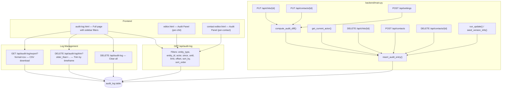

# Design Document: Audit Log

## Overview

The Audit Log feature adds comprehensive change tracking to CWOC. Every create, update, and delete operation on chits, contacts, and settings is recorded in a dedicated `audit_log` SQLite table. Each entry captures the actor (username from settings), the affected entity, a field-level diff of changes, and a timestamp.

The primary interface is a new dedicated Audit Log page (`/frontend/audit-log.html`) with a sidebar filter panel (similar to the main dashboard sidebar), sortable table columns, configurable pagination, and log management tools (clear, trim by timeframe, CSV download). Per-entity audit panels are also embedded in the chit editor and contact editor.

The implementation follows CWOC's existing patterns: inline migration in `backend/main.py`, vanilla JS frontend pages using `shared-page.css`/`shared-page.js`, and REST API endpoints under `/api/`.

**Future-proofing note:** Audit logging is implemented via helper functions (`insert_audit_entry`, `compute_audit_diff`, `get_current_actor`) that any new endpoint can call. However, each new feature's CRUD endpoints must explicitly call these helpers — it is not automatic. A steering rule is added to `General Principles.md` to ensure all future features include audit logging.

**Upgrade tracking:** Application upgrades (via the update/configurinator flow) are also logged as audit entries with entity_type `"system"`, action `"updated"`, and changes recording the old and new version strings. The `seed_version_info()` startup function and the `run_update()` endpoint both insert audit entries when the version changes.

## Architecture

The audit log is an append-first system. Audit entries are created as side effects of existing CRUD operations. The log can be trimmed or cleared by the user through dedicated management endpoints.



### Design Decisions

1. **Inline audit insertion** (not middleware): Audit entries are inserted within each endpoint handler, after the main DB operation succeeds. This keeps the audit tightly coupled to the actual change. Future features must explicitly call the audit helpers — a steering rule enforces this.

2. **Snapshot actor** (not foreign key): The actor field stores the username string at the time of the change. If the user later changes their username, old entries still reflect who they were when the change was made.

3. **Default actor: "Unknown Gremlin"**: When no username is configured in settings, the actor defaults to `"Unknown Gremlin"` rather than a generic "system" string — keeping with CWOC's personality.

4. **JSON diff storage**: The `changes` column stores a JSON array of `{field, old, new}` objects. This is flexible enough to handle any entity type without schema changes.

5. **Managed log lifecycle**: Unlike the original immutable design, the user can clear the entire log, trim entries older than a timeframe, and download as CSV. Deletion uses the same confirmation pattern as chit deletion (red danger button, confirmation modal).

6. **Sidebar filter panel**: The audit log page uses a sidebar similar to the main dashboard, providing filters for entity type, actor, and date range. This keeps the UI consistent across CWOC.

## Components and Interfaces

### Backend Components (all in `backend/main.py`)

#### 1. Migration: `migrate_add_audit_log()`
Creates the `audit_log` table and indexes at startup, using the existing column-existence-check pattern.

#### 2. Helper: `get_current_actor() -> str`
Reads the `username` field from the settings table for `default_user`. Returns `"Unknown Gremlin"` if no username is configured.

#### 3. Helper: `compute_audit_diff(old_dict, new_dict, exclude_fields) -> list`
Compares two dictionaries field-by-field. Returns a list of `{"field": str, "old": any, "new": any}` for each field that differs. JSON-serialized fields (tags, checklist, people, alerts, etc.) are compared in their deserialized form. Excludes `modified_datetime` and `created_datetime` by default.

#### 4. Helper: `insert_audit_entry(conn, entity_type, entity_id, action, actor, changes, entity_summary)`
Inserts a single row into the `audit_log` table with a UUID primary key and ISO 8601 timestamp.

#### 5. Upgrade Tracking
- **`seed_version_info()`**: At startup, after syncing the version from `/app/VERSION`, if the version has changed from what's stored in `instance_meta`, insert an audit entry with entity_type `"system"`, entity_id `"version"`, action `"updated"`, and changes `[{"field": "version", "old": "<previous>", "new": "<current>"}]`. The actor for startup-detected upgrades uses `get_current_actor()` (which reads the configured username, or "Unknown Gremlin").
- **`run_update()`**: After a successful update (exit code 0), insert an audit entry with the same shape, recording the version transition. The actor is the currently configured username (read via `get_current_actor()`) since the user who clicked "Update" in settings is the one who initiated it.

#### 6. Endpoint: `GET /api/audit-log`
Returns audit entries with optional filters and sorting.

**Query Parameters:**
| Parameter     | Type   | Default       | Description                                    |
|---------------|--------|---------------|------------------------------------------------|
| `entity_type` | string | None          | Filter: "chit", "contact", "settings", "system" |
| `entity_id`   | string | None          | Filter by specific entity ID                   |
| `actor`       | string | None          | Filter by actor username                       |
| `since`       | string | None          | ISO 8601 datetime — entries on or after         |
| `until`       | string | None          | ISO 8601 datetime — entries on or before        |
| `limit`       | int    | 50            | Max entries to return (25, 50, 100, 500)       |
| `offset`      | int    | 0             | Pagination offset                              |
| `sort_by`     | string | "timestamp"   | Column to sort by (timestamp, actor, action, entity_type, entity_summary) |
| `sort_order`  | string | "desc"        | "asc" or "desc"                                |

**Response:** JSON object with `entries` array and `total` count for pagination.

```json
{
  "entries": [...],
  "total": 1234
}
```

#### 7. Endpoint: `DELETE /api/audit-log`
Clears all audit log entries. Returns `{"message": "Audit log cleared", "deleted_count": N}`.

#### 8. Endpoint: `DELETE /api/audit-log/trim`
Trims entries older than a specified timeframe.

**Query Parameters:**
| Parameter    | Type   | Description                                         |
|--------------|--------|-----------------------------------------------------|
| `older_than` | string | Timeframe: "1h", "1d", "1w", "1m", "1y"            |

Returns `{"message": "Trimmed entries older than ...", "deleted_count": N}`.

#### 9. Endpoint: `GET /api/audit-log/export`
Downloads audit log entries as CSV.

**Query Parameters:** Same filters as `GET /api/audit-log` (entity_type, actor, since, until) but no limit/offset — exports all matching entries.

Returns a CSV file download with columns: timestamp, actor, action, entity_type, entity_id, entity_summary, changes.

### Frontend Components

#### 1. `frontend/audit-log.html` + inline `<script>`
New page following `_template.html` pattern. Uses `shared-page.css` and `shared-page.js` for header/footer injection.

**Layout:**
- **Sidebar** (left, similar to dashboard sidebar): Filter controls for entity type (All / Chits / Contacts / Settings / System), actor dropdown, date range (since/until), and page size selector (25 / 50 / 100 / 500).
- **Main content area**: Sortable table with clickable column headers (timestamp, actor, action, entity type, entity summary). Clicking a header toggles asc/desc sort. Each row has an expandable details toggle showing the Change_Detail diff.
- **Toolbar** (above table): Log management buttons — "Download CSV" (standard button), trim dropdown (Past Hour / Day / Week / Month / Year), and "Clear All" (danger red button, same style as chit delete). Trim and Clear use confirmation modals matching the chit editor's delete confirmation pattern.
- **Pagination**: "Load More" button at bottom, respecting the selected page size.

#### 2. Audit Panel (embedded in `editor.html`)
A collapsible `<div>` section in the chit editor that fetches and displays audit history for the current chit. Collapsed by default.

#### 3. Audit Panel (embedded in `contact-editor.html`)
Same pattern as the editor panel, but for the currently viewed contact.

#### 4. Settings Page: "System" Block
A new `setting-group` block on the settings page titled "System" containing a link/button to the Audit Log page.

## Data Models

### `audit_log` Table Schema

| Column          | Type | Constraints                    | Description                                    |
|-----------------|------|--------------------------------|------------------------------------------------|
| `id`            | TEXT | PRIMARY KEY                    | UUID v4                                        |
| `entity_type`   | TEXT | NOT NULL                       | "chit", "contact", "settings", or "system"     |
| `entity_id`     | TEXT | NOT NULL                       | ID of the changed record                       |
| `action`        | TEXT | NOT NULL                       | "created", "updated", or "deleted"             |
| `actor`         | TEXT | NOT NULL                       | Username snapshot (or "Unknown Gremlin")        |
| `timestamp`     | TEXT | NOT NULL                       | ISO 8601 datetime                              |
| `changes`       | TEXT |                                | JSON array of {field, old, new} objects         |
| `entity_summary`| TEXT |                                | Human-readable label (chit title, contact name) |

### Indexes

- `idx_audit_entity` on `(entity_type, entity_id)` — fast per-entity lookups
- `idx_audit_timestamp` on `(timestamp)` — fast chronological queries

### Audit Entry JSON Shape (API response)

```json
{
  "id": "uuid-string",
  "entity_type": "chit",
  "entity_id": "chit-uuid",
  "action": "updated",
  "actor": "cwholeman",
  "timestamp": "2025-01-15T10:30:00",
  "changes": [
    {"field": "title", "old": "Old Title", "new": "New Title"},
    {"field": "status", "old": "ToDo", "new": "In Progress"}
  ],
  "entity_summary": "My Important Chit"
}
```

## Correctness Properties

*A property is a characteristic or behavior that should hold true across all valid executions of a system — essentially, a formal statement about what the system should do. Properties serve as the bridge between human-readable specifications and machine-verifiable correctness guarantees.*

### Property 1: Identical dictionaries produce empty diff (no false positives)

*For any* dictionary `d` representing an entity state (with any combination of string, numeric, boolean, null, list, and nested dict values), `compute_audit_diff(d, d)` SHALL return an empty list.

**Validates: Requirements 5.3, 10.6**

### Property 2: Differing dictionaries produce non-empty diff (no false negatives)

*For any* two dictionaries `old` and `new` that differ in at least one tracked field (i.e., a field not in the excluded set), `compute_audit_diff(old, new)` SHALL return a non-empty list containing at least one change entry for a field that actually differs.

**Validates: Requirements 10.1, 10.7**

### Property 3: Diff excludes bookkeeping fields

*For any* two dictionaries `old` and `new` (even if `modified_datetime` or `created_datetime` differ between them), `compute_audit_diff(old, new)` SHALL never include `modified_datetime` or `created_datetime` in the returned change entries.

**Validates: Requirements 3.4, 4.4, 10.3**

### Property 4: Changes JSON round-trip

*For any* valid list of change detail objects (each with `field`, `old`, and `new` keys where values are strings, numbers, booleans, null, or lists), serializing to JSON via `json.dumps` and deserializing via `json.loads` SHALL produce a list equal to the original.

**Validates: Requirements 6.5**

## Error Handling

| Scenario | Handling |
|----------|----------|
| Audit insert fails (DB error) | Log the error but do NOT fail the parent operation. The chit/contact/settings save should succeed even if audit logging fails. Audit is best-effort. |
| `get_current_actor()` fails | Return `"Unknown Gremlin"` as fallback. |
| `compute_audit_diff()` receives non-dict input | Return empty list and log a warning. |
| `GET /api/audit-log` with invalid `entity_type` | Return empty results (no error). The query simply won't match any rows. |
| `GET /api/audit-log` with invalid `sort_by` column | Default to `"timestamp"`. |
| `GET /api/audit-log` with negative `limit`/`offset` | Clamp to 0. |
| `DELETE /api/audit-log` or `/trim` fails | Return 500 with error message. |
| `changes` column contains invalid JSON | Return the raw string in the `changes` field and log a warning. |
| CSV export with no matching entries | Return a CSV file with only the header row. |

## Testing Strategy

### Property-Based Tests (Python `unittest` only — no external libraries)

Since no pip installs are allowed, property-based tests will use a custom lightweight PBT harness built on Python's `unittest` and `random` modules. Each property test runs a minimum of 100 iterations with randomly generated inputs.

**Library:** Custom PBT harness using `unittest` + `random` (stdlib only)
**Location:** `backend/test_audit.py`
**Configuration:** 100 iterations per property test

Each property test will:
- Generate random dictionaries with varied field types (str, int, float, bool, None, list, dict)
- Include edge cases: empty dicts, dicts with only excluded fields, dicts with JSON-serialized fields
- Tag format: `Feature: audit-log, Property {N}: {property_text}`

### Unit Tests (Example-Based)

| Test | Validates |
|------|-----------|
| Create chit → audit entry with action "created" | Req 3.1 |
| Update chit → audit entry with action "updated" and correct diff | Req 3.2 |
| Delete chit → audit entry with action "deleted" | Req 3.3 |
| Create contact → audit entry with action "created" | Req 4.1 |
| Update contact → audit entry with correct diff | Req 4.2 |
| Delete contact → audit entry with action "deleted" | Req 4.3 |
| Save settings with changes → audit entry | Req 5.2 |
| Save settings without changes → no audit entry | Req 5.3 |
| Actor reads from settings username | Req 2.1 |
| Actor defaults to "Unknown Gremlin" when no username | Req 2.2 |
| Actor is snapshot, not live reference | Req 2.3 |
| GET /api/audit-log returns entries with correct sort | Req 6.1 |
| GET /api/audit-log filters by entity_type | Req 6.4 |
| GET /api/audit-log filters by entity_type + entity_id | Req 6.3 |
| GET /api/audit-log respects limit and offset | Req 6.2 |
| GET /api/audit-log sorts by different columns | New |
| DELETE /api/audit-log clears all entries | New |
| DELETE /api/audit-log/trim removes old entries only | New |
| GET /api/audit-log/export returns valid CSV | New |
| Diff handles null → non-null transitions | Req 10.4 |
| Diff handles non-null → null transitions | Req 10.5 |
| Upgrade creates audit entry with old/new version | New |
| seed_version_info logs version change on startup | New |

### Integration / Smoke Tests

| Test | Validates |
|------|-----------|
| `audit_log` table exists with correct columns | Req 1.1, 1.2 |
| Indexes exist on (entity_type, entity_id) and (timestamp) | Req 1.3, 1.4 |
| `audit-log.html` exists and references shared-page.css/js | Req 7.1 |
| Settings page contains System block with Audit Log link | New |
| Help page contains Audit Log section | Req 12.1 |
