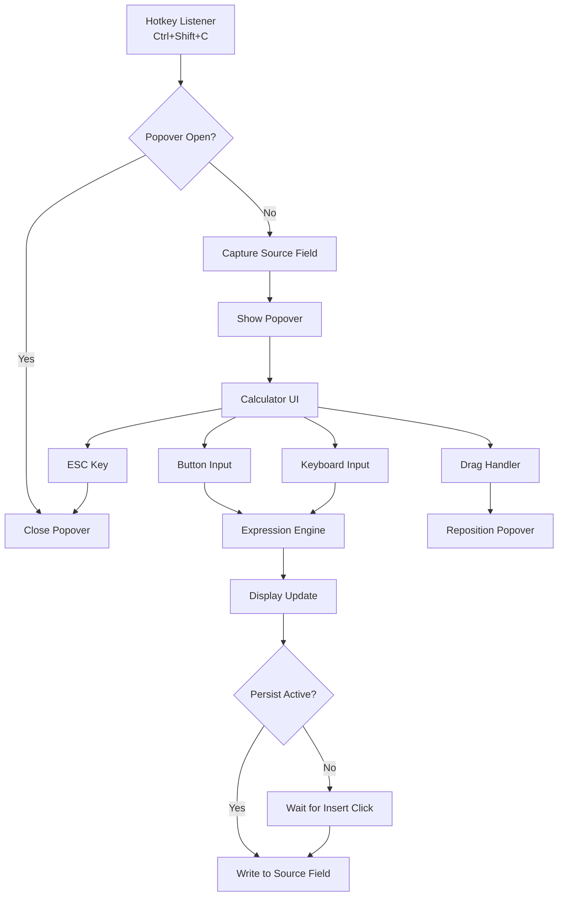
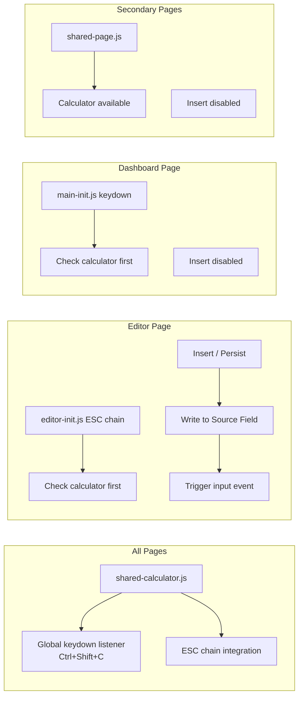

# Design Document: Calculator Popover

## Overview

The Calculator Popover is a floating, draggable arithmetic calculator available on every CWOC page via the `Ctrl+Shift+C` hotkey. It provides basic arithmetic operations (add, subtract, multiply, divide) with standard operator precedence, and can insert results into editor fields with an optional "Persist" mode that auto-updates the field as the calculation changes.

The feature is implemented entirely in vanilla JS/CSS with no external dependencies. It consists of a single shared JS file (`shared-calculator.js`) loaded on all pages, and CSS rules added to `shared-page.css`. The calculator integrates into CWOC's layered ESC chain at the highest priority and follows the 1940s parchment aesthetic.

### Key Design Decisions

1. **Single shared JS file** — `shared-calculator.js` is loaded via `<script>` tag on all pages (dashboard, editor, secondary pages). This keeps the calculator available everywhere without duplicating code.

2. **CSS in shared-page.css** — Calculator styles go in a dedicated section of `shared-page.css`, the canonical source for shared CSS variables and component styles.

3. **Expression evaluation via tokenizer + parser** — Rather than using `eval()` (security risk) or a simple left-to-right accumulator (wrong precedence), the calculator uses a small recursive-descent parser that respects multiplication/division before addition/subtraction.

4. **z-index: 200000** — The calculator must float above everything, including the bold alert overlay (z-index 100000) and the cwocToast (z-index 10000). Using 200000 provides clear separation.

5. **Singleton pattern** — A module-level variable (`_calcPopover`) holds the single instance. The hotkey toggles it open/closed. State (expression, result) persists across open/close within a page load.

6. **Source field capture** — On hotkey press, `document.activeElement` is captured before the popover opens. Insert and Persist only work when the source field is on the editor page.

## Architecture



### Page Integration



## Components and Interfaces

### 1. `shared-calculator.js` — Calculator Module

All calculator logic lives in a single file. Functions use the `_calc` prefix for internal helpers.

#### Public API

| Function | Description |
|---|---|
| `cwocToggleCalculator()` | Opens or closes the calculator popover. Called by the hotkey listener. |
| `cwocIsCalculatorOpen()` | Returns `true` if the calculator is currently visible. Used by ESC chain handlers. |
| `cwocCloseCalculator()` | Closes the calculator and unchecks Persist. Used by ESC handlers. |

#### Internal Functions

| Function | Description |
|---|---|
| `_calcCreatePopover()` | Builds the calculator DOM (display, buttons, insert, persist) and appends to `document.body`. |
| `_calcOnButton(value)` | Handles a button press (digit, operator, equals, clear, backspace). |
| `_calcEvaluate(expr)` | Parses and evaluates an arithmetic expression string. Returns a number or `'Error'`. |
| `_calcTokenize(expr)` | Splits an expression string into number and operator tokens. |
| `_calcParse(tokens)` | Recursive-descent parser: handles `+`, `-` at the top level, `*`, `/` at the next level. |
| `_calcUpdateDisplay()` | Updates the display element with the current expression and result. Triggers persist if active. |
| `_calcInsertResult()` | Writes the current result into the captured source field and fires an `input` event. |
| `_calcInitDrag(titleBar)` | Attaches mouse and touch drag handlers to the title bar for repositioning. |
| `_calcClampToViewport(el)` | Ensures the popover stays within the visible viewport. |
| `_calcIsEditorPage()` | Returns `true` if the current page is the chit editor (`editor.html`). |
| `_calcSetupHotkey()` | Registers the global `Ctrl+Shift+C` keydown listener. Called once on script load. |

### 2. CSS in `shared-page.css`

A dedicated `/* ── Calculator Popover ──── */` section containing:

- `.cwoc-calc-popover` — The main container (fixed position, z-index 200000, parchment styling)
- `.cwoc-calc-titlebar` — Drag handle with title text and close button
- `.cwoc-calc-display` — Expression/result display area
- `.cwoc-calc-buttons` — Grid layout for calculator buttons
- `.cwoc-calc-btn` — Individual button styling (digits, operators, special)
- `.cwoc-calc-btn-op` — Operator button variant (accent gold)
- `.cwoc-calc-btn-eq` — Equals button variant (brown)
- `.cwoc-calc-btn-clear` — Clear/backspace variant
- `.cwoc-calc-actions` — Insert button and Persist checkbox row
- `.cwoc-calc-persist-indicator` — Visual indicator when persist is active

### 3. ESC Chain Integration

The calculator's ESC handling is integrated into each page's existing ESC chain:

- **Editor page** (`editor-init.js`): Add a check at the very top of the ESC keydown handler — if `cwocIsCalculatorOpen()`, call `cwocCloseCalculator()` and return.
- **Dashboard page** (`main-init.js`): Same pattern — check calculator before any hotkey mode or panel checks.
- **Secondary pages**: `shared-calculator.js` registers its own keydown listener that handles ESC when the calculator is open. Since secondary pages don't have complex ESC chains, this is sufficient.

### 4. Script Loading

`shared-calculator.js` is loaded after `shared.js` and before page-specific scripts on all pages:

```
shared-auth.js → shared-utils.js → ... → shared.js → shared-calculator.js → shared-page.js → page-specific.js
```

This ensures shared utilities are available and the calculator is ready before any page-specific ESC handlers run.

## Data Models

The calculator has no backend data model — it is entirely client-side. State is held in module-level variables:

```javascript
// Module-level state (persists across open/close within a page load)
var _calcExpression = '';      // Current expression string, e.g. "12+3*4"
var _calcResult = '0';         // Last computed result as a string
var _calcSourceField = null;   // The DOM element that had focus when hotkey was pressed
var _calcPersistActive = false; // Whether persist mode is on
var _calcPopoverEl = null;     // Reference to the popover DOM element (singleton)
var _calcIsOpen = false;       // Whether the popover is currently visible
var _calcLastOperatorWasEquals = false; // Track if last action was "=" for chaining
```

### Expression Evaluation Data Flow

```
User input → _calcExpression (string) → _calcTokenize() → tokens[] → _calcParse() → numeric result → _calcResult
```

**Token types:**
- `NUMBER`: `{ type: 'NUMBER', value: 3.14 }`
- `OP`: `{ type: 'OP', value: '+' }`

The parser handles:
- Standard precedence: `*` and `/` bind tighter than `+` and `-`
- Negative numbers at the start of an expression or after an operator
- Division by zero → returns `'Error'`
- Malformed expressions → returns `'Error'`


## Correctness Properties

*A property is a characteristic or behavior that should hold true across all valid executions of a system — essentially, a formal statement about what the system should do. Properties serve as the bridge between human-readable specifications and machine-verifiable correctness guarantees.*

### Property 1: Toggle Idempotence

*For any* positive integer N, toggling the calculator N times should leave it open if N is odd and closed if N is even. Additionally, after each toggle the popover's visibility state should be consistent with `cwocIsCalculatorOpen()`.

**Validates: Requirements 1.1, 1.2, 8.2**

### Property 2: Viewport-Clamped Drag

*For any* starting position (x, y) within the viewport and *any* drag delta (dx, dy) — including values that would move the popover outside the viewport — the `_calcClampToViewport` function should produce final coordinates such that the entire popover remains within `[0, viewportWidth - popoverWidth]` horizontally and `[0, viewportHeight - popoverHeight]` vertically.

**Validates: Requirements 2.2, 2.4**

### Property 3: Clear Resets State

*For any* arbitrary expression string (including valid expressions, partial expressions, and error states), pressing Clear should reset the expression to empty and the result to `'0'`.

**Validates: Requirements 3.2**

### Property 4: Expression Evaluation Correctness

*For any* valid arithmetic expression composed of non-negative numbers and the operators `+`, `-`, `*`, `/` (with no division by zero), `_calcEvaluate(expr)` should return the same numeric result as a reference evaluation of the same expression (using standard arithmetic precedence where `*` and `/` bind tighter than `+` and `-`).

**Validates: Requirements 3.4, 3.7**

### Property 5: Persist Keeps Field in Sync

*For any* sequence of calculator button presses (digits and operators) while Persist mode is active and a valid source field exists on the editor page, the source field's value should always equal the calculator's current displayed result after each operation.

**Validates: Requirements 5.2**

### Property 6: Singleton Invariant

*For any* sequence of toggle, open, and close operations on the calculator, the number of `.cwoc-calc-popover` elements in the DOM should never exceed 1.

**Validates: Requirements 8.1**

### Property 7: State Persistence Across Open/Close

*For any* arithmetic expression that has been evaluated, closing the calculator and reopening it should display the same result that was shown before closing. The expression and result survive across open/close cycles within a single page load.

**Validates: Requirements 8.3**

### Property 8: Accessibility Labels on All Buttons

*For any* button element within the calculator popover, that button should have a non-empty `aria-label` attribute describing its function.

**Validates: Requirements 10.1**

## Error Handling

### Expression Errors

| Condition | Behavior |
|---|---|
| Division by zero | Display shows `'Error'`. Insert button remains functional but inserts `'Error'` text (user can clear and retry). |
| Malformed expression (e.g., `++`, `3*/2`) | Display shows `'Error'`. User can press C to clear or Backspace to correct. |
| Empty expression on Equals | No-op — display stays at current result or `'0'`. |
| Extremely long expression | Expression is capped at 50 characters. Further input is ignored. |
| Result overflow (Infinity) | Display shows `'Error'`. |

### Source Field Errors

| Condition | Behavior |
|---|---|
| Source field removed from DOM while calculator is open | Insert silently fails (field reference is stale). Persist is automatically disabled. |
| Source field is read-only or disabled | Insert has no effect. No error shown — the button was already disabled if the field wasn't on the editor page. |
| Source field is a contenteditable element | Treated the same as a regular input — value is set via `textContent` or `value` depending on element type. |

### Drag Errors

| Condition | Behavior |
|---|---|
| Viewport resized while popover is open | On next drag or on `resize` event, popover is re-clamped to viewport. |
| Touch and mouse events interleaved | Only one drag mode is active at a time. Touch takes priority. |

## Testing Strategy

### Property-Based Tests

Property-based testing is appropriate for this feature because the calculator contains pure functions (expression evaluation, viewport clamping) with clear input/output behavior and large input spaces.

**Library:** [fast-check](https://github.com/dubzzz/fast-check) — the standard PBT library for JavaScript.

**Configuration:**
- Minimum 100 iterations per property test
- Each test tagged with: `Feature: calculator-popover, Property {N}: {title}`

**Properties to implement as PBT:**

1. **Property 4 (Expression Evaluation Correctness)** — Generate random valid arithmetic expressions, evaluate with `_calcEvaluate`, compare against a reference. This is the highest-value property test.
2. **Property 2 (Viewport-Clamped Drag)** — Generate random positions and deltas, verify clamping.
3. **Property 3 (Clear Resets State)** — Generate random expression strings, verify clear behavior.
4. **Property 1 (Toggle Idempotence)** — Generate random toggle counts, verify state.
5. **Property 6 (Singleton Invariant)** — Generate random sequences of toggle/open/close, verify DOM count.
6. **Property 7 (State Persistence)** — Generate random expressions, evaluate, close/reopen, verify.
7. **Property 5 (Persist Sync)** — Generate random button sequences with persist active, verify field sync.
8. **Property 8 (Accessibility Labels)** — Generate the popover, verify all buttons have aria-labels. (This is more of an example test but can be run as a property over different popover creation scenarios.)

### Unit Tests (Example-Based)

| Test | Validates |
|---|---|
| Hotkey opens calculator, second press closes it | Req 1.1, 1.2 |
| Source field is captured on open | Req 1.3 |
| All expected buttons exist in DOM | Req 3.1 |
| `2+3` evaluates to `5` | Req 3.4 |
| `2+3*4` evaluates to `14` (not `20`) | Req 3.7 |
| `10/0` shows `'Error'` | Req 3.5 |
| Keyboard digits update expression | Req 3.6 |
| Enter key triggers evaluation | Req 3.6 |
| Backspace removes last character | Req 3.6 |
| Insert writes result to source field | Req 4.2 |
| Insert fires `input` event on source field | Req 4.4 |
| Insert disabled when no source field | Req 4.5 |
| Insert disabled on non-editor pages | Req 4.3 |
| Persist auto-updates field on each operation | Req 5.2 |
| Persist unchecked on close | Req 5.4 |
| Persist disabled on non-editor pages | Req 5.6 |
| ESC closes calculator before other handlers | Req 6.1 |
| ESC passes through when calculator is closed | Req 6.3 |
| Focus is set to display on open | Req 10.2 |
| Tab key cycles within calculator | Req 10.3 |

### Integration Tests

| Test | Validates |
|---|---|
| Calculator available on editor page | Req 1.4 |
| Calculator available on dashboard page | Req 1.4 |
| Calculator available on settings page | Req 1.4 |
| ESC chain priority on editor page (calculator closes before modals) | Req 6.2 |
| ESC chain priority on dashboard page | Req 6.2 |
| Drag works with mouse events | Req 2.1, 2.2, 2.3 |
| Drag works with touch events | Req 2.5 |
