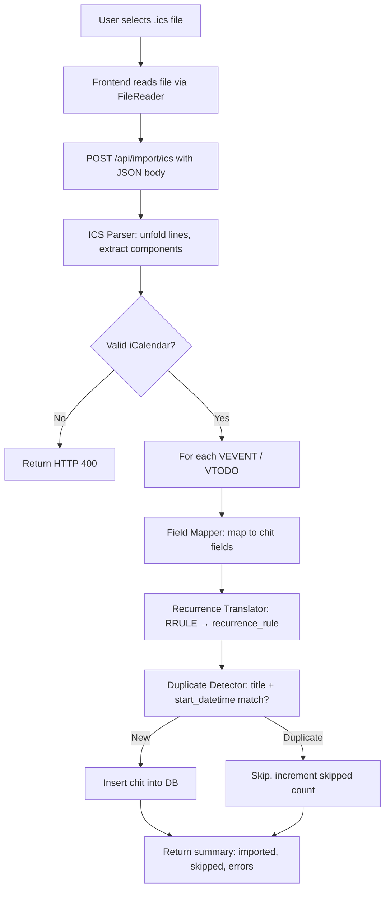

# Design Document: Calendar ICS Import

## Overview

This feature adds iCalendar (.ics) file import to CWOC, allowing users to bring in calendar events and tasks from Google Calendar, Apple Calendar, and Windows/Outlook. Since all three sources conform to RFC 5545, a single parser handles all of them.

The implementation consists of four backend components and one frontend addition:

1. **ICS Parser** (`ics_serializer.py`) — Parses raw .ics text into structured component dictionaries, handling line unfolding, VEVENT/VTODO extraction, timezone preservation, and all-day detection.
2. **ICS Printer** (`ics_serializer.py`) — Serializes component dictionaries back into valid iCalendar text, enabling round-trip testing.
3. **Field Mapper & Recurrence Translator** (inside the import route) — Maps iCalendar fields to CWOC chit fields and translates RRULE patterns to the existing `recurrence_rule` JSON format.
4. **Import API Endpoint** (`routes/ics_import.py`) — POST `/api/import/ics` that orchestrates parsing, mapping, duplicate detection, and chit creation within a single transaction.
5. **Frontend Import UI** (settings page) — An "Import Calendar (.ics)" button in the Data Management section that opens a file picker, sends the file content to the endpoint, and displays the result summary.

The parser and printer follow the same architectural pattern as the existing vCard serializer in `serializers.py` — pure functions with no external dependencies, using only Python stdlib.

## Architecture



### Key Design Decisions

1. **No external libraries.** The parser uses Python stdlib only (string splitting, regex for datetime patterns). The iCalendar format is line-oriented and straightforward to parse without a library like `icalendar`. This keeps the zero-dependency constraint intact and avoids any `pip install`.

2. **Parser + Printer in one module.** Following the vCard pattern (`serializers.py` has `vcard_parse` and `vcard_print`), the ICS parser and printer live together in `src/backend/ics_serializer.py`. This keeps the serialization logic cohesive and makes round-trip testing natural.

3. **Import route in a dedicated file.** The import endpoint goes in `src/backend/routes/ics_import.py` rather than adding to the already-large `routes/chits.py` (1600+ lines). This follows the project's modularity principle.

4. **Transaction-scoped inserts.** All chit inserts happen within a single SQLite transaction. If an unrecoverable error occurs, the entire batch rolls back. Individual component parse failures are recorded but don't abort the transaction.

5. **Duplicate detection is simple and deterministic.** Matching on `title + start_datetime` (case-sensitive, exact ISO string match to the minute) is intentionally simple. It avoids false positives from fuzzy matching while catching the most common re-import scenario.

## Components and Interfaces

### 1. ICS Parser — `ics_parse(ics_text: str) -> dict`

**Location:** `src/backend/ics_serializer.py`

**Input:** Raw .ics file content as a string.

**Output:** A dictionary with structure:
```python
{
    "components": [
        {
            "type": "VEVENT" | "VTODO",
            "summary": str | None,
            "dtstart": str | None,        # ISO datetime or date string
            "dtstart_tzid": str | None,    # e.g. "America/New_York"
            "dtend": str | None,
            "dtend_tzid": str | None,
            "due": str | None,             # VTODO only
            "description": str | None,
            "location": str | None,
            "categories": list[str],
            "priority": int | None,        # 0-9 per RFC 5545
            "uid": str | None,
            "rrule": dict | None,          # parsed RRULE fields
            "status": str | None,          # VTODO: NEEDS-ACTION, IN-PROCESS, COMPLETED
            "all_day": bool,
        },
        ...
    ],
    "errors": [str, ...]  # per-component parse errors
}
```

**Behavior:**
- Unfolds RFC 5545 continuation lines (lines starting with space/tab are appended to the previous line).
- Splits the file into VEVENT and VTODO blocks by tracking `BEGIN:VEVENT` / `END:VEVENT` (and VTODO) markers.
- Silently ignores other component types (VTIMEZONE, VJOURNAL, VFREEBUSY, VALARM).
- Parses DTSTART/DTEND with TZID parameter preservation and DATE vs DATE-TIME detection.
- Parses RRULE into a structured dict: `{"freq": "DAILY", "interval": 2, "byday": ["MO","WE"], "until": "20251231", "count": 10}`.
- Validates that each component has a SUMMARY; components without SUMMARY are recorded as errors and skipped.
- Returns an error (not a component list) if the content doesn't begin with `BEGIN:VCALENDAR` or contains no VEVENT/VTODO.

### 2. ICS Printer — `ics_print(components: list[dict]) -> str`

**Location:** `src/backend/ics_serializer.py`

**Input:** A list of component dictionaries (same format as parser output).

**Output:** A valid iCalendar string with `BEGIN:VCALENDAR` / `END:VCALENDAR` wrapper, `VERSION:2.0`, and `PRODID:-//CWOC//EN`.

**Behavior:**
- Formats each component with properly structured properties.
- Serializes RRULE dicts back into RFC 5545 `RRULE:FREQ=WEEKLY;INTERVAL=2;BYDAY=MO,WE` format.
- Includes TZID parameters on DTSTART/DTEND when `dtstart_tzid` / `dtend_tzid` are present.
- Uses DATE format (no time) for all-day events, DATE-TIME for timed events.

### 3. Field Mapper — `map_component_to_chit(component: dict, user_id: str, display_name: str, username: str) -> dict`

**Location:** `src/backend/routes/ics_import.py`

**Input:** A single parsed component dict plus authenticated user info.

**Output:** A dict ready for insertion into the chits table.

**Field Mapping (VEVENT):**

| iCalendar Field | Chit Field | Transformation |
|---|---|---|
| SUMMARY | title | Direct copy |
| DESCRIPTION | note | Direct copy |
| DTSTART | start_datetime | Convert to ISO format |
| DTEND | end_datetime | Convert to ISO; if missing, set equal to DTSTART (timed) or DTSTART (all-day single day) |
| LOCATION | location | Direct copy |
| CATEGORIES | tags | Split comma-separated values into list |
| PRIORITY 1–4 | priority = "High" | RFC 5545 priority mapping |
| PRIORITY 5 | priority = "Medium" | |
| PRIORITY 6–9 | priority = "Low" | |
| RRULE | recurrence_rule | See Recurrence Translator below |
| all_day flag | all_day = True/False | From parser's DATE vs DATE-TIME detection |

**Field Mapping (VTODO):**

| iCalendar Field | Chit Field | Transformation |
|---|---|---|
| SUMMARY | title | Direct copy |
| DESCRIPTION | note | Direct copy |
| DUE | due_datetime | Convert to ISO format |
| CATEGORIES | tags | Split comma-separated values into list |
| PRIORITY | priority | Same mapping as VEVENT |
| STATUS=COMPLETED | status = "Complete" | |
| STATUS=IN-PROCESS | status = "In Progress" | |
| STATUS=NEEDS-ACTION | status = "ToDo" | |

**Common fields set on all imported chits:**
- `owner_id`, `owner_display_name`, `owner_username` — from authenticated user
- `created_datetime`, `modified_datetime` — current UTC time
- `deleted` = False
- `id` — new UUID
- `tags` — always includes `cwoc_system/imported` in addition to any CATEGORIES-derived tags

### 4. Recurrence Translator — `map_rrule_to_recurrence(rrule: dict) -> dict | None`

**Location:** `src/backend/routes/ics_import.py` (helper function)

**Input:** Parsed RRULE dict from the parser.

**Output:** CWOC `recurrence_rule` JSON format: `{"freq": "WEEKLY", "interval": 2, "byDay": ["MO","WE"], "until": "2025-12-31"}`

**Mapping:**

| RRULE Field | recurrence_rule Field | Notes |
|---|---|---|
| FREQ=DAILY | freq = "DAILY" | |
| FREQ=WEEKLY | freq = "WEEKLY" | |
| FREQ=MONTHLY | freq = "MONTHLY" | |
| FREQ=YEARLY | freq = "YEARLY" | |
| FREQ=SECONDLY/MINUTELY/HOURLY | Returns None | Unsupported; event imported as single occurrence |
| INTERVAL | interval | Default 1 |
| BYDAY | byDay | List of day abbreviations: MO, TU, WE, TH, FR, SA, SU |
| UNTIL | until | Converted to ISO date string (YYYY-MM-DD) |
| COUNT | until | Approximate: start_date + (count × interval × freq_days) |

### 5. Duplicate Detector — `find_duplicates(cursor, user_id: str, components: list[dict]) -> set[int]`

**Location:** `src/backend/routes/ics_import.py`

**Input:** DB cursor, user ID, list of mapped chit dicts.

**Output:** Set of component indices that are duplicates.

**Logic:**
- Queries all non-deleted chits for the user.
- For each component, checks if any existing chit has the same `title` (case-sensitive) AND the same `start_datetime` or `due_datetime` (exact ISO string match, truncated to the minute).
- Returns the set of indices that matched.

### 6. Import API Endpoint — `POST /api/import/ics`

**Location:** `src/backend/routes/ics_import.py`

**Request Body:**
```json
{
    "ics_content": "<raw .ics file text>"
}
```

**Response (200):**
```json
{
    "imported": 5,
    "skipped": 2,
    "errors": [
        "Component 3: Missing SUMMARY property"
    ]
}
```

**Error Response (400):**
```json
{
    "detail": "Invalid iCalendar file: does not begin with BEGIN:VCALENDAR"
}
```

### 7. Frontend Import UI

**Location:** `src/frontend/html/settings.html` + `src/frontend/js/pages/settings.js`

**UI Addition:** A new sub-section in the Data Management setting-group, after the User Data import/export buttons:

```
📅 Calendar Import
[Import Calendar (.ics)] button
<input type="file" accept=".ics" hidden>
```

**Behavior:**
1. Click button → opens file picker filtered to `.ics`.
2. File selected → FileReader reads as text → POST to `/api/import/ics`.
3. While request is in flight, button is disabled and shows "Importing…".
4. On success → alert/modal showing "Imported X events, skipped Y duplicates, Z errors".
5. On error → alert showing the error message from the API.

## Data Models

### Parsed Component Dictionary (internal, not persisted)

```python
{
    "type": "VEVENT",           # or "VTODO"
    "summary": "Team Meeting",
    "dtstart": "2025-06-15T10:00:00",
    "dtstart_tzid": "America/New_York",
    "dtend": "2025-06-15T11:00:00",
    "dtend_tzid": "America/New_York",
    "due": None,                # VTODO only
    "description": "Weekly sync",
    "location": "Conference Room A",
    "categories": ["Work", "Meetings"],
    "priority": 1,              # RFC 5545: 1-9, 0=undefined
    "uid": "abc123@google.com",
    "rrule": {
        "freq": "WEEKLY",
        "interval": 1,
        "byday": ["MO"],
        "until": "20251231T235959Z",
        "count": None
    },
    "status": None,             # VTODO: "NEEDS-ACTION", "IN-PROCESS", "COMPLETED"
    "all_day": False
}
```

### Pydantic Request Model (new, in `models.py`)

```python
class ICSImportRequest(BaseModel):
    ics_content: str
```

### Pydantic Response Model (new, in `models.py`)

```python
class ICSImportResponse(BaseModel):
    imported: int
    skipped: int
    errors: List[str] = []
```

### Existing Models Used

- **Chit** — The target model. Imported components are mapped to chit fields and inserted via direct SQL (same pattern as `create_chit` in `routes/chits.py`).
- **recurrence_rule** format — `{"freq": "WEEKLY", "interval": 1, "byDay": ["MO"], "until": "2025-12-31"}` — already supported by the frontend calendar and editor.

### Database

No schema changes required. Imported chits use the existing `chits` table with all existing columns. The `recurrence_rule` column already stores JSON with `freq`, `interval`, `byDay`, and `until` fields.

