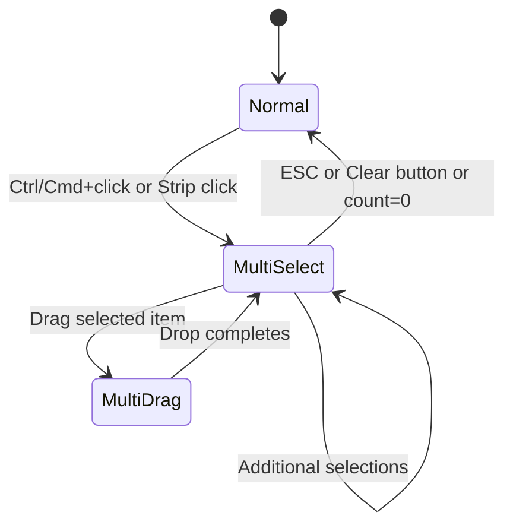
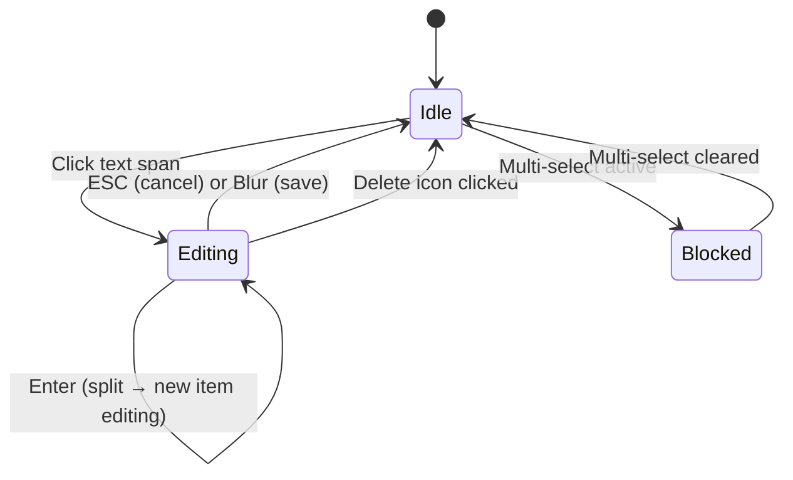
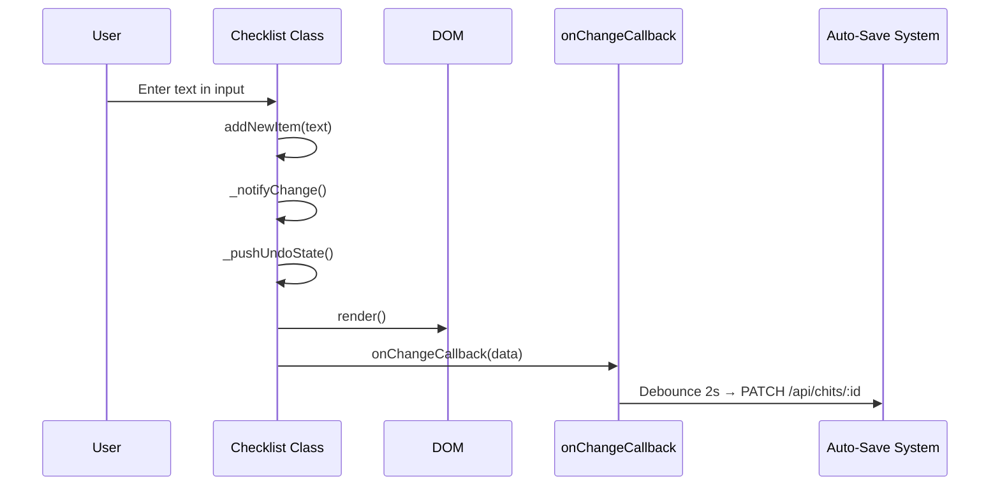
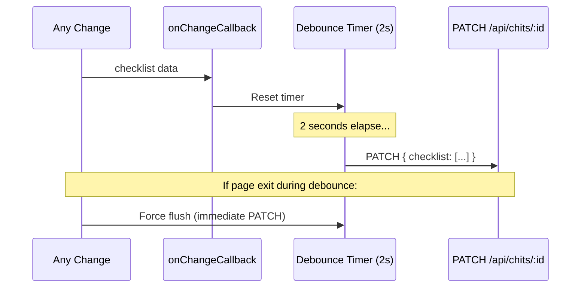
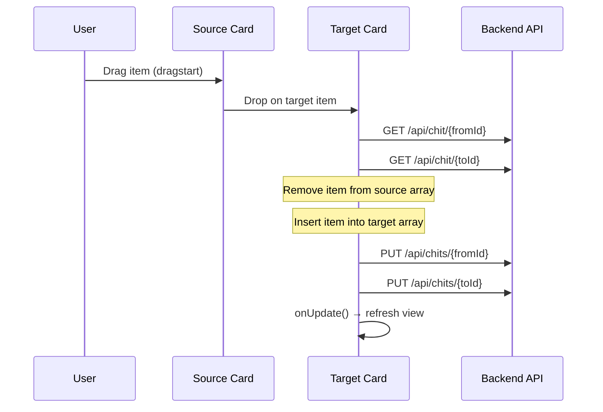
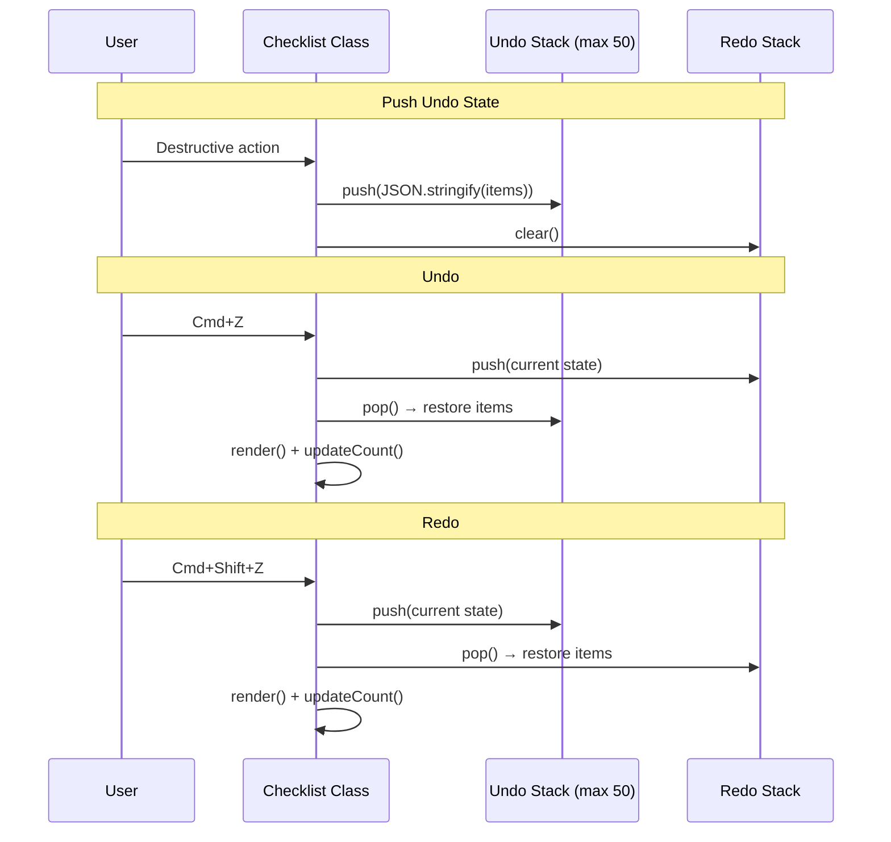

# Design Document: Checklist Zone Specification

## Overview

The Checklist Zone is a core feature of CWOC that provides nested, interactive checklist management in two contexts: the **Editor** (full editing with the `Checklist` class) and the **Dashboard** (inline interactive cards via `renderInlineChecklist`). The architecture follows a shared-utility pattern where markdown rendering logic is centralized in `shared-checklist.js`, while context-specific behavior lives in `editor_checklists.js` (editor) and `main-views.js` (dashboard).

The system manages a tree-structured data model (items with parent references and nesting levels 0–4), supports undo/redo via JSON snapshot stacks, multi-select batch operations, drag-and-drop reordering (desktop and touch), inline textarea editing with keyboard shortcuts, and auto-save with debounced PATCH requests.

## Architecture

```mermaid
graph TD
    subgraph Editor Context
        EC[editor_checklists.js<br/>Checklist Class]
        EH[editor.html<br/>#checklistSection]
        ES[editor-save.js<br/>Auto-save / PATCH]
    end

    subgraph Dashboard Context
        DV[main-views.js<br/>Checklists Tab Rendering]
        SC[shared-checklist.js<br/>renderInlineChecklist]
    end

    subgraph Shared Utilities
        SM[shared-checklist.js<br/>renderChecklistItemMarkdown]
        ST[shared-touch.js<br/>enableTouchDrag]
        SU[shared-utils.js<br/>cwocConfirm, cwocUndoToast]
    end

    subgraph Backend
        API[/api/chits/:id<br/>GET / PUT / PATCH]
        DB[(SQLite<br/>checklist JSON field)]
    end

    EC --> SM
    EC --> ST
    EC --> SU
    EC --> ES
    ES --> API
    DV --> SC
    SC --> SM
    SC --> ST
    SC --> API
    API --> DB
```

### Key Architectural Decisions

1. **Single class for editor, functions for dashboard**: The editor uses a stateful `Checklist` class managing items, undo/redo, multi-select, and editing state. The dashboard uses stateless functions (`renderInlineChecklist`, `toggleChecklistItem`, `moveChecklistItem`) that operate directly on API data.

2. **JSON snapshot undo/redo**: Rather than command-pattern undo, the system serializes the entire items array as JSON strings. This is simpler and handles all operations uniformly at the cost of O(n) memory per snapshot (capped at 50).

3. **Tree via parent references**: Items store a `parent` ID field rather than being nested objects. This flat-array-with-references approach simplifies serialization, array manipulation (splice/filter), and rendering while requiring helper functions (`getSubtree`, `getChildren`, `getParent`) for tree operations.

4. **Shared markdown rendering**: `renderChecklistItemMarkdown` in `shared-checklist.js` is used by both editor and dashboard, ensuring consistent formatting across contexts.

5. **Touch/desktop parity via `enableTouchDrag`**: The shared touch utility translates touch events into a consistent callback interface (`onStart`, `onMove`, `onEnd`), allowing the same reorder logic to work on both platforms.

## Components and Interfaces

### 1. Checklist Class (Editor) — `editor_checklists.js`

The primary component managing all editor checklist behavior.

**Constructor:**
```javascript
class Checklist {
  constructor(container, initialItems = [], onChangeCallback = null)
}
```

**State Properties:**
| Property | Type | Description |
|----------|------|-------------|
| `items` | Array<Item> | Flat array of all checklist items |
| `draggedItem` | Item\|null | Currently dragged item |
| `draggedSubtree` | Array<Item> | Subtree being dragged |
| `dragOverItem` | Item\|null | Current drop target |
| `dragOverPosition` | 'above'\|'on'\|'below'\|null | Drop zone within target |
| `editingItem` | Item\|null | Item currently in inline edit mode |
| `_undoStack` | Array<string> | JSON snapshots (max 50) |
| `_redoStack` | Array<string> | Redo snapshots (cleared on new action) |
| `_selectedIds` | Set<string> | IDs of multi-selected items |
| `_multiSelectMode` | boolean | Whether multi-select is active |
| `_lastSelectedId` | string\|null | Anchor for Shift+click range select |

**Public Methods:**
| Method | Returns | Description |
|--------|---------|-------------|
| `loadItems(itemsArray)` | void | Load items, reset undo/redo, render |
| `getChecklistData()` | Array<Item> | Serialize items for persistence |
| `hasPendingContent()` | boolean | Check for uncommitted input/edit |
| `commitPendingContent()` | boolean | Commit pending content before exit |
| `addNewItem(text, level, checked, id)` | void | Add item and notify change |
| `generateId()` | string | Generate "item-" + 9 random chars |
| `render()` | void | Full re-render of unchecked + completed sections |
| `undo()` | void | Restore previous state from undo stack |
| `redo()` | void | Restore next state from redo stack |

**Internal Methods:**
| Method | Description |
|--------|-------------|
| `_pushUndoState()` | Snapshot current state to undo stack |
| `_notifyChange()` | Push undo + update count + callback + auto-complete |
| `_notifyChangeQuiet()` | Update count + callback (no undo push) |
| `startEditing(item, textSpan, clickEvent)` | Open inline textarea |
| `toggleCheck(item, checked)` | Check/uncheck with animation + subtree |
| `deleteItem(item, element)` | Animate + remove item + subtree |
| `onDragStart/Over/Leave/Drop(e, item)` | Desktop drag handlers |
| `_toggleSelectItem(itemId)` | Toggle multi-select on item |
| `_rangeSelectTo(itemId)` | Shift+click range selection |
| `_clearSelection()` | Exit multi-select mode |
| `_selectAll()` | Select all unchecked items |
| `_startMultiDrag(e, triggerItem)` | Initiate multi-item drag |
| `_updateSubLevels(sub, newRootLevel)` | Adjust subtree levels by delta |
| `_reassignFollowingSiblings(item, oldParentId)` | Fix parent refs after unindent |
| `getSubtree(item)` | Get item + all recursive descendants |
| `getChildren(item)` | Get direct children |
| `getParent(item)` | Get parent item |

### 2. Shared Checklist Utilities — `shared-checklist.js`

**Functions:**
| Function | Description |
|----------|-------------|
| `renderChecklistItemMarkdown(el, text)` | Render markdown into element via marked.js |
| `toggleChecklistItem(chitId, itemIndex, newChecked)` | Toggle + PUT to API |
| `moveChecklistItem(chitId, fromIndex, toIndex)` | Reorder within chit + PUT |
| `moveChecklistItemCrossChit(fromChitId, fromIndex, toChitId, toIndex)` | Move between chits + PUT both |
| `renderInlineChecklist(container, chit, onUpdate)` | Render interactive dashboard checklist |
| `_updateChecklistProgressCount(container, chit)` | Update progress count span |

### 3. Editor Helper Functions — `editor_checklists.js` (module-level)

| Function | Description |
|----------|-------------|
| `_copyChecklistToNote(checklist)` | Convert checklist → markdown in notes field |
| `_noteToChecklistFromHeader(e)` | Button handler for notes → checklist |
| `_copyNoteToChecklist(checklist)` | Convert note lines → checklist items |
| `_pasteClipboardAsChecklistItems(checklist)` | Clipboard → checklist items |
| `_copyIncompleteToClipboard(checklist)` | Unchecked items → clipboard markdown |
| `_toggleChecklistAutoComplete(e)` | Cycle auto-complete states |
| `_checkAutoCompleteChecklist(checklist)` | Evaluate and trigger auto-complete |

### 4. Touch Drag Utility — `shared-touch.js`

```javascript
function enableTouchDrag(element, { onStart, onMove, onEnd })
```

Translates `touchstart`/`touchmove`/`touchend` into callback-based interface with `clientX`/`clientY` coordinates.

## Data Models

### Checklist Item (stored in chit's `checklist` JSON array field)

```javascript
{
  id: string,       // "item-" + 9 random alphanumeric chars
  text: string,     // Markdown-capable text content
  level: number,    // 0–4 (MAX_INDENT_LEVEL = 4)
  checked: boolean, // Completion state
  parent: string|null // Parent item ID or null for top-level
}
```

### Chit Fields (relevant to checklist)

```javascript
{
  checklist: Array<Item>,           // JSON-serialized in SQLite
  auto_complete_checklist: boolean, // Default true — auto-set status to Complete
  checklist_autosave: boolean|null  // null = use global, true/false = per-chit override
}
```

### Undo/Redo Snapshot Format

```javascript
// JSON.stringify of:
items.map(i => ({ id: i.id, text: i.text, level: i.level, checked: i.checked, parent: i.parent }))
```

### State Machine: Multi-Select Mode



### State Machine: Inline Editing



## Data Flow

### Item CRUD Flow (Editor)



### Auto-Save Debounce Flow



### Cross-Chit Move Flow (Dashboard)



### Undo/Redo Flow



## Event Handling Architecture

### Keyboard Shortcuts Map

| Context | Key | Action |
|---------|-----|--------|
| Input field | Enter | Add new item |
| Input field | Escape | Exit page flow |
| Input field | Cmd+Z | Undo |
| Input field | Cmd+Shift+Z | Redo |
| Input field | Cmd+B/I | Markdown format |
| Editing textarea | Enter | Split item at cursor |
| Editing textarea | Shift+Enter | Insert newline |
| Editing textarea | Escape | Cancel edit |
| Editing textarea | Tab | Indent item |
| Editing textarea | Shift+Tab | Unindent item |
| Editing textarea | Cmd+] | Indent single item |
| Editing textarea | Cmd+[ | Unindent single item |
| Editing textarea | Cmd+Shift+) | Indent item + subtree |
| Editing textarea | Cmd+Shift+( | Unindent item + subtree |
| Editing textarea | ArrowUp (pos 0) | Navigate to previous item |
| Editing textarea | ArrowDown (end) | Navigate to next item |
| Editing textarea | Cmd+Z | Browser undo → checklist undo |
| Editing textarea | Cmd+Shift+Z | Browser redo |
| Editing textarea | Cmd+B/I | Markdown format |
| Multi-select | Escape (capture) | Clear selection |
| Item row | Ctrl/Cmd+click | Toggle selection |
| Item row | Shift+click | Range select |

### Drag-and-Drop Event Flow

**Desktop (HTML5 Drag API):**
- `dragstart` → store item + subtree, set opacity 0.5
- `dragover` → calculate position (thirds), show indicator
- `dragleave` → clear indicators
- `drop` → execute move, push undo, re-render

**Touch (`enableTouchDrag`):**
- `onStart` → store item + subtree, record start coordinates
- `onMove` → detect swipe vs drag, show indicators or execute indent
- `onEnd` → execute drop or no-op if swipe handled

### Touch Swipe Detection

```
if (|dx| > 40 && |dx| > |dy| * 2):
    → Horizontal swipe (indent/unindent)
else:
    → Vertical drag (reorder)
```

## CSS Architecture

### Class Hierarchy

```
.zone-container (#checklistSection)
  .zone-header
    .zone-title (h2 "✅ Checklist")
      .checklist-count-display
    .zone-actions
      .zone-button (Data menu wrapper)
        .zone-more-menu (dropdown)
      .location-actions-spacer
      .zone-button.notes-undo-redo (Undo ↺)
      .zone-button.notes-undo-redo (Redo ↻)
      .zone-toggle-icon
  .zone-body (#checklistContent)
    .checklist-container
      .checklist-input (input[type=text])
      .checklist-multiselect-toolbar (when active)
      .checklist-item [draggable, data-id]
        .left-container [padding-left: level*20px]
          .checklist-drag-handle (⠿)
          input[type=checkbox]
          .text-wrapper
            .checklist-text / textarea.checklist-edit-input
        .checklist-send-icon (📤)
        .trash-icon (✕)
        .checklist-select-strip
      .completed-checklist-container
        .completed-section-header
        .completed-section-body
          .completed-checklist-item
          .ghost-checklist-item
```

### Animation Classes

| Class | Effect | Duration |
|-------|--------|----------|
| `.dragging` | opacity: 0.5 | Instant |
| `.deleting` | Fade + shrink animation | 300ms |
| `.checklist-checking` | Strikethrough + green tint | Applied first |
| `.checklist-checking-fade` | Fade + translateX(10px) | Applied after 100ms |
| `.drag-over-above` | Blue border-top | Instant |
| `.drag-over-below` | Blue border-bottom | Instant |
| `.drag-over-on` | White background | Instant |
| `.checklist-multi-selected` | Teal highlight | Instant |
| `.checklist-multiselect-active` | pointer-events:none on text | Instant |
| `.debounce-pending` | Visual indicator on input | During debounce |

### Responsive Breakpoints

- **Desktop**: Hover-reveal for send/delete icons, standard drag handles
- **Touch/Mobile**: Always-visible drag handles, larger touch targets, swipe gestures enabled via `enableTouchDrag`

## Integration Points

### 1. Editor Save System (`editor-save.js`)

The `onChangeCallback` passed to the Checklist constructor connects to the editor's auto-save debounce system. Changes trigger a 2-second debounce timer that issues `PATCH /api/chits/:id` with just the checklist data. The `commitPendingContent()` method is called during page exit to flush any uncommitted input or editing state.

### 2. Dashboard Refresh

After dashboard checkbox toggles or drag moves, the system calls `fetchChits()` or `displayChits()` (after a 300ms delay for auto-complete chits) to refresh the view with server-side state changes.

### 3. Notes Zone Integration

Bidirectional conversion between checklist items and note markdown:
- **Checklist → Note** (`_copyChecklistToNote`): Formats items as `- [x]/[ ] text` with indentation, appends to note field
- **Note → Checklist** (`_copyNoteToChecklist`): Parses markdown checkboxes, list markers, and indentation into items

Both operations show undo toasts that restore the previous state of both zones.

### 4. Send-to-Chit System

Items (individual, subtree, multi-selected batch, or entire checklist) can be transferred to another chit via the send-to-chit search modal. The system uses `_openSendItemPopup` for per-item sends and `_openSendContentModal` for bulk sends.

### 5. Auto-Complete / Auto-Archive

When `auto_complete_checklist` is true and all non-empty items become checked:
1. Status select is set to "Complete"
2. If auto-archive is also enabled, the archived flag is set to true
3. The save button is marked unsaved


## Correctness Properties

*A property is a characteristic or behavior that should hold true across all valid executions of a system — essentially, a formal statement about what the system should do. Properties serve as the bridge between human-readable specifications and machine-verifiable correctness guarantees.*

### Property 1: Data Model Serialization Invariant

*For any* array of checklist items loaded via `loadItems`, every item returned by `getChecklistData()` SHALL have exactly five fields (`id`, `text`, `level`, `checked`, `parent`) where `id` is a string, `text` is a string, `level` is an integer between 0 and 4 inclusive, `checked` is a boolean, and `parent` is either a string or null.

**Validates: Requirements 1.1, 1.3**

### Property 2: ID Generation Format

*For any* call to `generateId()`, the returned string SHALL match the pattern `/^item-[a-z0-9]{9}$/` (the prefix "item-" followed by exactly 9 lowercase alphanumeric characters).

**Validates: Requirements 1.2**

### Property 3: Non-Empty Input Adds Item

*For any* non-empty, non-whitespace-only string entered in the input field, pressing Enter SHALL increase the items array length by exactly one, and the new item's `text` field SHALL equal the trimmed input string.

**Validates: Requirements 3.3**

### Property 4: Whitespace Input Rejected

*For any* string composed entirely of whitespace characters (including empty string), pressing Enter SHALL leave the items array unchanged (same length, same content).

**Validates: Requirements 3.4**

### Property 5: Check/Uncheck Subtree Propagation

*For any* checklist item in any tree structure, when that item's checked state is toggled to a value V, all items in its subtree (recursive descendants) SHALL also have their checked state set to V.

**Validates: Requirements 8.1, 8.3**

### Property 6: Delete Removes Exactly the Subtree

*For any* checklist item in any tree structure, deleting that item SHALL remove it and all its recursive descendants from the items array, and SHALL leave all other items unchanged (same id, text, level, checked, parent values).

**Validates: Requirements 9.1**

### Property 7: Tree Structure Integrity

*For any* sequence of operations (add, delete, indent, unindent, drag-drop, check, uncheck) on any valid checklist, the resulting state SHALL satisfy: (a) every item with level 0 has parent === null, (b) every item with level > 0 has a parent field referencing an existing item ID, (c) no item's level exceeds MAX_INDENT_LEVEL (4), (d) the referenced parent item has a level exactly one less than the child's level or the parent exists in the items array.

**Validates: Requirements 36.1, 36.2, 36.3, 36.4, 36.5, 36.6, 36.7, 36.8, 36.9, 7.14, 7.15**

### Property 8: Level Delta Preserves Relative Hierarchy

*For any* subtree of items passed to `_updateSubLevels(subtree, newRootLevel)`, the relative level differences between all items in the subtree SHALL be preserved (i.e., for any two items A and B in the subtree, `A.level - B.level` before the call equals `A.level - B.level` after the call).

**Validates: Requirements 10.7**

### Property 9: Undo/Redo Round-Trip

*For any* checklist state S, after performing an action that changes the state to S', invoking `undo()` SHALL restore the state to S (items array deep-equals the pre-action snapshot), and subsequently invoking `redo()` SHALL restore the state to S'.

**Validates: Requirements 15.3, 15.4**

### Property 10: Undo Stack Bounded

*For any* sequence of N actions (where N > 50), the undo stack length SHALL never exceed 50 entries.

**Validates: Requirements 15.1**

### Property 11: Checklist ↔ Markdown Round-Trip

*For any* array of checklist items, converting to markdown format via `_copyChecklistToNote` and then parsing back via `_copyNoteToChecklist` SHALL produce items with the same `text` content and `checked` state as the originals (level and parent may be reconstructed from indentation).

**Validates: Requirements 17.5, 17.6, 18.3, 22.1, 23.3**

### Property 12: Bulk Delete Preserves Complement

*For any* checklist with mixed checked/unchecked/empty items: (a) "Delete checked items" SHALL remove all items where checked===true and preserve all items where checked===false, (b) "Delete unchecked items" SHALL remove all items where checked===false and preserve all items where checked===true, (c) "Clean up empty items" SHALL remove all items with empty/whitespace-only text and preserve all items with non-empty text.

**Validates: Requirements 19.4, 20.4, 21.3**

### Property 13: Split Item Preserves Text

*For any* item with text T and any cursor position P (0 ≤ P ≤ T.length), splitting the item at position P SHALL produce two items whose trimmed texts, when concatenated with appropriate handling of the split point, account for all characters in the original text T.

**Validates: Requirements 6.7**

### Property 14: Range Select Covers Contiguous Items

*For any* list of unchecked items and any two indices A (anchor) and T (target) within that list, range-selecting from A to T SHALL result in all items at indices min(A,T) through max(A,T) being included in the selection set.

**Validates: Requirements 12.3**

### Property 15: Auto-Complete Triggers Correctly

*For any* checklist where `auto_complete_checklist` is true, if all items with non-empty text (text.trim() !== '') have checked===true, the auto-complete evaluation SHALL trigger status change to "Complete".

**Validates: Requirements 28.2**

### Property 16: Progress Count Excludes Empty Items

*For any* checklist state, the progress count SHALL report checked/total where "total" counts only items with non-whitespace text, and "checked" counts only checked items with non-whitespace text.

**Validates: Requirements 39.4**

## Error Handling

### Editor Context

| Error Condition | Handling |
|----------------|----------|
| marked.js unavailable | Fall back to `el.textContent = text` (no markdown rendering) |
| Clipboard access denied | Show toast "⚠️ Clipboard access denied", abort operation |
| Empty clipboard paste | No action (silent) |
| Drop onto own descendant | Abort drop, clear indicators |
| Indent at MAX_INDENT_LEVEL | No action (constraint prevents) |
| Indent first item (no preceding item) | No action (constraint prevents) |
| Unindent at level 0 | No action (constraint prevents) |
| Undo with empty stack | No action (button disabled) |
| Redo with empty stack | No action (button disabled) |
| Edit while multi-select active | Early return (editing blocked) |
| Checkbox toggle while multi-select | Revert checkbox state, no action |

### Dashboard Context

| Error Condition | Handling |
|----------------|----------|
| API fetch failure | `console.error`, no UI change |
| Invalid chit data (no checklist array) | Early return, skip rendering |
| Cross-chit move API failure | `console.error`, no UI change |
| Item with no text | Skip rendering (filter out) |

### Data Integrity

- **Undo stack overflow**: Oldest entry removed (shift) when exceeding 50
- **Duplicate undo states**: JSON string comparison prevents pushing identical consecutive states
- **Orphaned parent references**: `loadItems` preserves whatever parent values exist; tree operations maintain consistency via `_reassignFollowingSiblings`
- **Level overflow on load**: `Math.min(item.level || 0, MAX_INDENT_LEVEL)` caps at 4

## Testing Strategy

### Unit Tests (Example-Based)

Focus on specific scenarios and edge cases:

- **DOM structure**: Verify rendered elements match specification (classes, attributes, order)
- **Keyboard shortcuts**: Test each key combination triggers correct action
- **Animation sequences**: Verify class additions and timing for check/delete animations
- **UI state transitions**: Multi-select mode entry/exit, editing mode entry/exit
- **Data menu operations**: Each menu item triggers correct behavior
- **Auto-save debounce**: Timer behavior, flush on exit
- **Dashboard rendering**: Card structure, progress counts, read-only mode

### Property-Based Tests

**Library**: fast-check (JavaScript property-based testing library)

**Configuration**: Minimum 100 iterations per property test.

Each property test references its design document property:

- **Feature: checklist-zone-specification, Property 1**: Data model serialization invariant
- **Feature: checklist-zone-specification, Property 2**: ID generation format
- **Feature: checklist-zone-specification, Property 3**: Non-empty input adds item
- **Feature: checklist-zone-specification, Property 4**: Whitespace input rejected
- **Feature: checklist-zone-specification, Property 5**: Check/uncheck subtree propagation
- **Feature: checklist-zone-specification, Property 6**: Delete removes exactly the subtree
- **Feature: checklist-zone-specification, Property 7**: Tree structure integrity
- **Feature: checklist-zone-specification, Property 8**: Level delta preserves relative hierarchy
- **Feature: checklist-zone-specification, Property 9**: Undo/redo round-trip
- **Feature: checklist-zone-specification, Property 10**: Undo stack bounded
- **Feature: checklist-zone-specification, Property 11**: Checklist ↔ markdown round-trip
- **Feature: checklist-zone-specification, Property 12**: Bulk delete preserves complement
- **Feature: checklist-zone-specification, Property 13**: Split item preserves text
- **Feature: checklist-zone-specification, Property 14**: Range select covers contiguous items
- **Feature: checklist-zone-specification, Property 15**: Auto-complete triggers correctly
- **Feature: checklist-zone-specification, Property 16**: Progress count excludes empty items

### Integration Tests

- **API persistence**: Verify PATCH/PUT calls save and retrieve correct checklist data
- **Cross-chit moves**: Verify both source and target chits are updated correctly
- **Auto-complete with server**: Verify status changes persist through API
- **Dashboard refresh**: Verify view updates after checkbox toggles

### Key Generators for Property Tests

```javascript
// Generate a valid checklist item
const arbItem = fc.record({
  id: fc.string().map(s => 'item-' + s.replace(/[^a-z0-9]/g, '').padEnd(9, 'a').slice(0, 9)),
  text: fc.string(),
  level: fc.integer({ min: 0, max: 4 }),
  checked: fc.boolean(),
  parent: fc.constant(null) // Parent assigned after tree construction
});

// Generate a valid tree (items with consistent parent references)
const arbChecklist = fc.array(arbItem, { minLength: 0, maxLength: 20 }).map(items => {
  // Fix parent references to form valid tree
  items.forEach((item, idx) => {
    if (item.level === 0) { item.parent = null; }
    else {
      // Find nearest preceding item at level-1
      for (let i = idx - 1; i >= 0; i--) {
        if (items[i].level === item.level - 1) { item.parent = items[i].id; break; }
      }
    }
  });
  return items;
});
```
