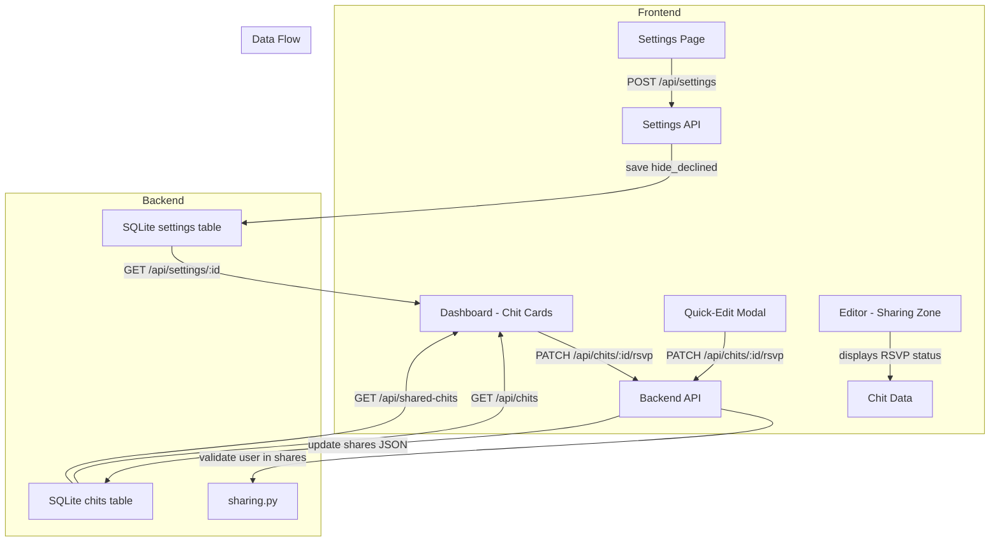

# Design Document: Chit Invitation RSVP

## Overview

This feature adds an invitation/RSVP system to the existing CWOC chit sharing mechanism. Currently, when a chit is shared with a user, it immediately appears in their dashboard with no ability to accept or decline. This design introduces three RSVP states — `invited`, `accepted`, and `declined` — stored as a new field on each share entry in the chit's `shares` JSON array.

The feature touches four layers:
1. **Data model** — add `rsvp_status` to each share entry in the `shares` JSON column on chits, add `hide_declined` to the settings table
2. **Backend API** — new PATCH endpoint for RSVP updates, backward-compatible normalization of legacy share entries, filtering support
3. **Dashboard frontend** — RSVP action controls on chit cards and quick-edit modal, faded visual treatment for declined chits, hide-declined filtering
4. **Editor frontend** — RSVP status display in the Sharing Zone, accept/decline controls for shared users
5. **Settings frontend** — new "Hide declined chits" toggle

No new database tables are needed. The change is additive to the existing `shares` JSON structure and the `settings` table.

## Architecture



### Design Decisions

1. **RSVP stored inside the shares JSON array, not a separate table.** The shares list is already a JSON array on each chit (`[{user_id, role}]`). Adding `rsvp_status` to each entry keeps the data co-located and avoids a new table + join. The shares array is small (typically 1–5 entries), so scanning it is trivial.

2. **Dedicated PATCH endpoint for RSVP updates.** A shared user with `viewer` role cannot edit the chit via PUT. Rather than relaxing the PUT permission model, a new `PATCH /api/chits/{chit_id}/rsvp` endpoint allows any shared user to update only their own `rsvp_status` field. This preserves the existing permission boundaries.

3. **Backward compatibility via normalization.** Existing share entries without `rsvp_status` are treated as `invited` at read time. No data migration is needed — the backend normalizes on load, and the frontend handles both cases.

4. **Filtering happens in the frontend.** The `hide_declined` setting is loaded with the user's settings and applied during `displayChits()` filtering. This matches the existing pattern for other filters (search, tab filters, archived visibility) and avoids duplicating filter logic in the backend query.

5. **Declined opacity uses 0.35.** This is visually distinct from archived (0.45) and completed (0.5), making declined chits clearly faded but still readable. The hover behavior matches the existing archived chit pattern (increase to 0.7).

## Components and Interfaces

### Backend Components

#### 1. New API Endpoint: `PATCH /api/chits/{chit_id}/rsvp`

**File:** `src/backend/routes/chits.py`

```python
@router.patch("/api/chits/{chit_id}/rsvp")
def update_rsvp_status(chit_id: str, body: dict, request: Request):
    """Update the current user's RSVP status on a shared chit.
    
    Body: { "rsvp_status": "accepted" | "declined" | "invited" }
    
    Authorization: The requesting user must be in the chit's shares list.
    The owner cannot have an RSVP status.
    Users can only update their own RSVP status.
    """
```

**Request body:**
```json
{ "rsvp_status": "accepted" }
```

**Response (200):**
```json
{ "message": "RSVP status updated", "rsvp_status": "accepted" }
```

**Error responses:**
- 400: Invalid `rsvp_status` value
- 403: User is the chit owner (owners don't have RSVP status)
- 404: Chit not found or user not in shares list

**Logic:**
1. Validate `rsvp_status` is one of `invited`, `accepted`, `declined`
2. Load the chit from the database
3. Verify the requesting user is NOT the owner (owners don't have RSVP)
4. Verify the requesting user IS in the shares list
5. Update the user's `rsvp_status` in the shares JSON array
6. Save the updated shares back to the database
7. Log an audit entry for the RSVP change

#### 2. Backward-Compatible Share Normalization

**File:** `src/backend/sharing.py` (existing `_parse_shares` function)

When shares are parsed, any entry missing `rsvp_status` gets it set to `"invited"`. This is done in the `_deserialize_chit_fields` function and in the `get_shared_chits_for_user` function so that all API responses include normalized RSVP data.

#### 3. Settings Migration

**File:** `src/backend/migrations.py`

New migration function `migrate_add_hide_declined()`:
- Adds `hide_declined` column to `settings` table (TEXT DEFAULT '0')
- Follows the existing idempotent migration pattern (check column existence before ALTER)

#### 4. Settings Model Update

**File:** `src/backend/models.py`

Add `hide_declined` field to the `Settings` Pydantic model:
```python
hide_declined: Optional[str] = "0"  # "0" = show declined (faded), "1" = hide declined
```

#### 5. Settings Route Update

**File:** `src/backend/routes/settings.py`

Add `hide_declined` to the `get_settings` response and `save_settings` INSERT/REPLACE query, following the existing pattern for other settings fields.

### Frontend Components

#### 1. RSVP Controls on Chit Cards

**File:** `src/frontend/js/dashboard/main-views.js` (in `_buildChitHeader`)

For shared chits where the current user is in the shares list, render RSVP action buttons in the header meta area:
- **Accept button:** ✓ icon, green-tinted, calls `PATCH /api/chits/{id}/rsvp` with `accepted`
- **Decline button:** ✗ icon, red-tinted, calls `PATCH /api/chits/{id}/rsvp` with `declined`
- Buttons reflect current state (active button is highlighted)
- Only shown for shared chits (not owned chits)

#### 2. RSVP Indicators on Chit Cards

**File:** `src/frontend/js/dashboard/main-views.js` (in `_buildChitHeader`)

For chits with shares, display small RSVP status indicators in the header meta area showing each shared user's response:
- `invited`: ⏳ neutral/pending style
- `accepted`: ✓ green-tinted
- `declined`: ✗ muted/crossed style
- Each indicator shows the user's display name on hover (tooltip)

#### 3. Declined Chit Visual Treatment

**File:** `src/frontend/css/dashboard/styles-cards.css`

New CSS class `.chit-card.declined-chit`:
```css
.chit-card.declined-chit {
    opacity: 0.35;
}
.chit-card.declined-chit:hover {
    opacity: 0.7;
}
```

Applied in all six dashboard views and calendar views when the current user's RSVP status is `declined`.

#### 4. RSVP Controls in Quick-Edit Modal

**File:** `src/frontend/js/shared/shared.js` (in `showQuickEditModal`)

For shared chits, add an RSVP row in the quick-edit modal with accept/decline buttons, consistent with the chit card controls. No new modal is introduced.

#### 5. Hide Declined Filtering

**File:** `src/frontend/js/dashboard/main-init.js` (in `displayChits`)

During the chit filtering phase in `displayChits()`, check the `hide_declined` setting. If enabled, exclude chits where the current user's RSVP status is `declined`. This applies to all six views and all calendar period views.

Helper function in `main-views.js`:
```javascript
function _isDeclinedByCurrentUser(chit) {
    // Returns true if the current user has declined this shared chit
}
```

#### 6. RSVP Status in Editor Sharing Zone

**File:** `src/frontend/js/editor/editor-people.js`

In `_renderPeopleChips()`, add RSVP status badges next to each shared user:
- Small colored badge showing `invited`, `accepted`, or `declined`
- Uses the same visual indicators as the dashboard chit cards
- For the current user (if they are a shared user viewing the editor), show accept/decline buttons
- Owner and manager roles cannot change another user's RSVP status

#### 7. Settings Page Toggle

**File:** `src/frontend/html/settings.html` and `src/frontend/js/pages/settings.js`

Add a "Hide declined chits" checkbox in the General Settings group (or a new "Sharing" group if appropriate). The toggle:
- Defaults to unchecked (show declined with faded treatment)
- Persists via the existing settings save mechanism
- Uses the `hide_declined` field in the settings API

## Data Models

### Share Entry (updated)

The existing share entry structure in the `shares` JSON column gains a new field:

```json
{
    "user_id": "uuid-string",
    "role": "viewer" | "manager",
    "rsvp_status": "invited" | "accepted" | "declined"
}
```

**Backward compatibility:** Entries without `rsvp_status` are normalized to `"invited"` at read time.

### Settings Table (updated)

New column:

| Column | Type | Default | Description |
|--------|------|---------|-------------|
| `hide_declined` | TEXT | `'0'` | `"0"` = show declined chits (faded), `"1"` = hide them entirely |

### Settings Pydantic Model (updated)

```python
class Settings(BaseModel):
    # ... existing fields ...
    hide_declined: Optional[str] = "0"
```

### RSVP Status Enum

Valid values: `"invited"`, `"accepted"`, `"declined"`

No Python enum class is needed — validation is done inline in the PATCH endpoint, consistent with how other string-enum fields (like `role`) are handled in the codebase.

### API Contract: PATCH /api/chits/{chit_id}/rsvp

**Request:**
```json
{
    "rsvp_status": "accepted" | "declined" | "invited"
}
```

**Success Response (200):**
```json
{
    "message": "RSVP status updated",
    "rsvp_status": "accepted"
}
```

**Error Responses:**
- `400 Bad Request`: `{"detail": "Invalid rsvp_status. Must be one of: invited, accepted, declined"}`
- `403 Forbidden`: `{"detail": "Owner cannot have RSVP status"}`
- `404 Not Found`: `{"detail": "Chit not found or user not in shares list"}`

## Correctness Properties

*A property is a characteristic or behavior that should hold true across all valid executions of a system — essentially, a formal statement about what the system should do. Properties serve as the bridge between human-readable specifications and machine-verifiable correctness guarantees.*

### Property 1: RSVP status is always valid

*For any* share entry in any chit's shares list, the `rsvp_status` field SHALL be present and its value SHALL be one of `"invited"`, `"accepted"`, or `"declined"`. When a new share entry is created, `rsvp_status` SHALL default to `"invited"`.

**Validates: Requirements 1.1, 1.2**

### Property 2: Missing rsvp_status normalized to invited

*For any* share entry that lacks an `rsvp_status` field (legacy data), loading the chit through the backend SHALL produce a share entry with `rsvp_status` set to `"invited"`.

**Validates: Requirements 1.3**

### Property 3: RSVP status round-trip preservation

*For any* chit with shares containing `rsvp_status` values, saving the chit and then loading it SHALL produce share entries with identical `rsvp_status` values.

**Validates: Requirements 1.4**

### Property 4: RSVP update authorization

*For any* user and any chit, an RSVP status update request SHALL succeed if and only if: (a) the user is in the chit's shares list, (b) the user is not the chit owner, and (c) the requested `rsvp_status` is a valid value. All other requests SHALL be rejected.

**Validates: Requirements 2.4, 2.6, 2.7, 2.8, 6.4**

### Property 5: Owner exclusion from RSVP

*For any* chit, the owner SHALL never appear in the shares list with an `rsvp_status` field. The RSVP system applies exclusively to shared users, not the owner.

**Validates: Requirements 2.8**

### Property 6: Hide declined filtering correctness

*For any* set of chits and a user with `hide_declined` enabled, the filtered output SHALL contain zero chits where that user's `rsvp_status` is `"declined"`. All non-declined chits SHALL still be present.

**Validates: Requirements 5.2, 7.2**

### Property 7: Hide declined setting round-trip

*For any* boolean value of the `hide_declined` setting, saving it to the backend and loading it back SHALL produce the same value.

**Validates: Requirements 5.5**

## Error Handling

### Backend Errors

| Scenario | HTTP Status | Response | Handling |
|----------|-------------|----------|----------|
| Invalid `rsvp_status` value | 400 | `{"detail": "Invalid rsvp_status..."}` | Frontend shows toast/alert |
| Owner tries to set RSVP | 403 | `{"detail": "Owner cannot have RSVP status"}` | Frontend hides RSVP controls for owners |
| User not in shares list | 404 | `{"detail": "Chit not found or user not in shares list"}` | Frontend shows error, refreshes chit list |
| Chit not found | 404 | `{"detail": "Chit not found..."}` | Frontend shows error, refreshes chit list |
| Database error | 500 | `{"detail": "Failed to update RSVP status"}` | Frontend shows generic error |

### Frontend Error Handling

- **RSVP button click fails:** Show a brief error message via `console.error`, revert the button state to the previous RSVP status, and refresh the chit list.
- **Settings save fails:** The existing `CwocSaveSystem` error handling applies — the save button shows an error state.
- **Legacy chits without rsvp_status:** The frontend treats missing `rsvp_status` as `"invited"`, matching the backend normalization. No special error handling needed.

### Edge Cases

- **Chit owner removes a user from shares after they've set RSVP:** The RSVP data is lost when the share entry is removed. This is acceptable — the user no longer has access to the chit.
- **Concurrent RSVP updates:** SQLite's write lock prevents data corruption. The last write wins, which is acceptable for RSVP status (it's a single user updating their own status).
- **User shared via tag-level sharing:** Tag-level shares don't have explicit share entries in the chit's `shares` array, so they don't get RSVP status. RSVP only applies to chit-level shares. This is by design — tag-level sharing is implicit and doesn't represent an "invitation."

## Testing Strategy

### Property-Based Tests

Property-based testing is appropriate for this feature because the core logic involves:
- Data validation (RSVP status enum)
- Authorization rules (who can update RSVP)
- Data transformation (normalization, round-trips)
- Filtering logic (hide declined)

These are pure functions with clear input/output behavior and universal properties.

**Library:** Python's built-in `random` module for generating test inputs (no external PBT library — per project constraints, no pip installs). Tests will use a loop of 100+ random iterations to approximate property-based testing.

**Configuration:**
- Minimum 100 iterations per property test
- Each test references its design document property
- Tag format: **Feature: chit-invitation-rsvp, Property {number}: {property_text}**

### Unit Tests

Unit tests cover specific examples and edge cases:
- RSVP PATCH endpoint returns correct status codes for valid/invalid requests
- Backward compatibility: loading a chit with legacy shares (no `rsvp_status`) returns `"invited"`
- `getSharingData()` in `editor-sharing.js` includes `rsvp_status` in the clean shares output
- Declined chit CSS class is applied correctly
- Hide declined toggle persists through settings save/load
- RSVP controls are hidden for chit owners
- RSVP controls appear in quick-edit modal for shared chits

### Integration Tests

- End-to-end flow: share a chit → shared user accepts → verify status persists → shared user declines → verify faded treatment → enable hide_declined → verify chit is hidden
- Settings migration: verify `hide_declined` column is added idempotently
- Concurrent access: two users updating their own RSVP on the same chit simultaneously
