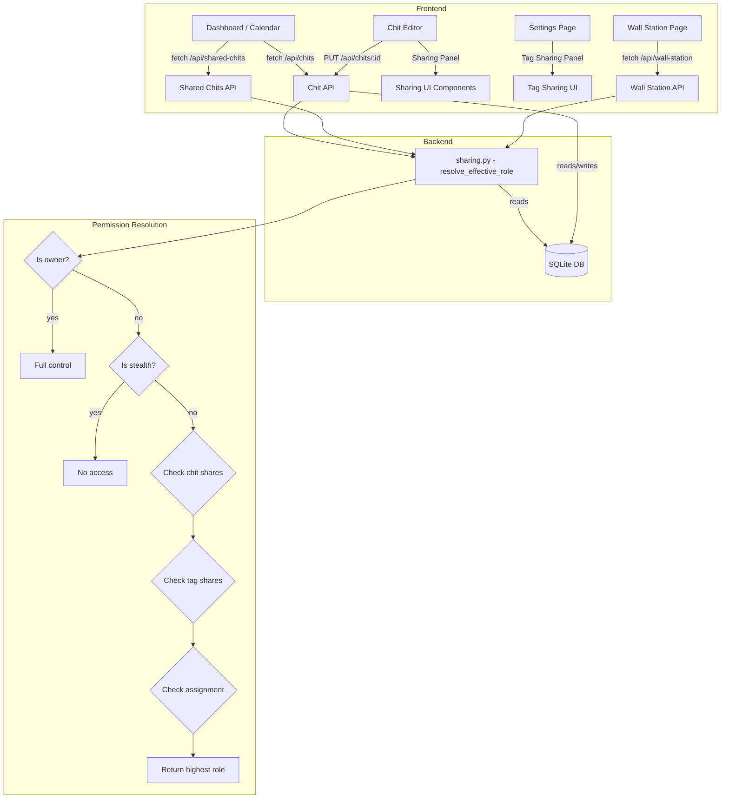

# Design Document: Chit Sharing System

## Overview

This design describes the chit-level and tag-level sharing system for CWOC, building on the completed multi-user foundation (Project 1). The system adds role-based access control (Owner / Manager / Viewer) to individual chits and tag groups, a permission resolution engine that merges access from multiple paths, stealth chits, chit assignment, shared calendars, a tag editor overhaul for managing sharing, and a multi-owner wall station view.

### Design Decisions & Rationale

1. **Shares stored as JSON on the chit row** — The `shares` column on `chits` is a JSON array (`[{user_id, role}]`). This avoids a separate join table, keeps the existing single-query-per-chit pattern, and matches how CWOC already stores `tags`, `checklist`, `alerts`, and other structured data as JSON TEXT columns in SQLite.

2. **Tag sharing stored on the settings row** — The `shared_tags` column on `settings` is a JSON array (`[{tag, shares: [{user_id, role}]}]`). This keeps tag sharing configuration co-located with the user's other tag settings and avoids a new table.

3. **Permission resolution in a shared Python module** — A new `src/backend/sharing.py` module provides `resolve_effective_role(chit, user_id, owner_settings)` that evaluates chit-level shares, tag-level shares, and assignment to return the highest role. All route handlers call this single function, ensuring consistent access control.

4. **Wall station view as an unauthenticated page** — The wall station operates without a session cookie. Its API endpoint is added to `_is_excluded()` in `middleware.py`. It accepts user UUIDs as query parameters and returns a combined view. This keeps the shared-screen use case simple — just bookmark a URL.

5. **No new tables** — All sharing data is stored as new columns on existing tables (`chits.shares`, `chits.stealth`, `chits.assigned_to`, `settings.shared_tags`). This follows the existing migration pattern and avoids schema complexity.

## Architecture



### Request Flow for Shared Chits

1. `GET /api/chits` returns the user's own chits (existing behavior, unchanged)
2. `GET /api/shared-chits` is a new endpoint that returns chits shared with the authenticated user (via chit-level shares, tag-level shares, or assignment), each annotated with `effective_role`
3. The frontend merges both result sets for display, using `effective_role` to determine edit vs. read-only behavior
4. `PUT /api/chits/:id` checks the caller's effective role before allowing edits — owner and manager can edit, viewer is rejected with 403

### File Changes

| File | Change |
|------|--------|
| `src/backend/sharing.py` | **New** — Permission resolution engine |
| `src/backend/migrations.py` | Add `migrate_add_sharing()` function |
| `src/backend/main.py` | Register new migration and route module |
| `src/backend/models.py` | Add sharing-related Pydantic models |
| `src/backend/routes/chits.py` | Extend with sharing permission checks, new `/api/shared-chits` endpoint |
| `src/backend/routes/settings.py` | Extend settings model to include `shared_tags` |
| `src/backend/routes/sharing.py` | **New** — Sharing management endpoints (add/remove shares) |
| `src/backend/routes/health.py` | Add wall station page route, exclude from auth |
| `src/backend/middleware.py` | Add wall station path to `_is_excluded()` |
| `src/frontend/html/wall-station.html` | **New** — Wall station page |
| `src/frontend/js/editor/editor-sharing.js` | **New** — Sharing panel in chit editor |
| `src/frontend/js/pages/settings.js` | Extend tag editor with sharing configuration |
| `src/frontend/js/dashboard/main-views.js` | Add "Assigned to Me" view, shared chit rendering |
| `src/frontend/js/dashboard/main-calendar.js` | Merge shared calendar events |
| `src/frontend/js/shared/shared-auth.js` | No changes needed |
| `src/frontend/css/shared/shared-page.css` | Add sharing panel styles |
| `src/frontend/css/editor/editor.css` | Add sharing panel styles for editor |

## Components and Interfaces

### Backend Components

#### 1. Permission Resolution Engine (`src/backend/sharing.py`)

```python
def resolve_effective_role(chit_row: dict, user_id: str, owner_settings: dict = None) -> str | None:
    """
    Determine the effective role for a user on a given chit.
    
    Returns: 'owner', 'manager', 'viewer', or None (no access).
    
    Resolution order (highest wins):
    1. owner_id match → 'owner'
    2. stealth=True and not owner → None
    3. chit-level shares → role from shares list
    4. tag-level shares → role from owner's shared_tags settings
    5. assigned_to match → 'viewer' (minimum; may be elevated by other paths)
    6. None → no access
    """

def get_shared_chits_for_user(user_id: str) -> list[dict]:
    """
    Query all chits visible to user_id through any sharing path.
    Returns chit dicts annotated with 'effective_role' and 'share_source'.
    
    Implementation:
    1. Query all non-deleted, non-stealth chits where:
       - shares JSON contains user_id, OR
       - assigned_to = user_id
    2. For each candidate, also check tag-level sharing by loading
       each chit owner's shared_tags settings
    3. Resolve effective role and filter out None results
    """

def can_edit_chit(chit_row: dict, user_id: str, owner_settings: dict = None) -> bool:
    """Return True if user has owner or manager role."""

def can_delete_chit(chit_row: dict, user_id: str) -> bool:
    """Return True only if user is the owner."""

def can_manage_sharing(chit_row: dict, user_id: str) -> bool:
    """Return True only if user is the owner."""
```

#### 2. Sharing Management Routes (`src/backend/routes/sharing.py`)

| Route | Method | Description |
|-------|--------|-------------|
| `/api/chits/{chit_id}/shares` | GET | Get the shares list for a chit (owner only) |
| `/api/chits/{chit_id}/shares` | PUT | Set the entire shares list for a chit (owner only) |
| `/api/chits/{chit_id}/shares/{user_id}` | DELETE | Remove a specific user from a chit's shares (owner only) |
| `/api/shared-chits` | GET | Get all chits shared with the authenticated user |
| `/api/settings/shared-tags` | GET | Get the authenticated user's shared_tags configuration |
| `/api/settings/shared-tags` | PUT | Set the authenticated user's shared_tags configuration |

#### 3. Extended Chit Routes (`src/backend/routes/chits.py`)

Existing endpoints are modified:

- `GET /api/chits` — unchanged (returns only owned chits)
- `PUT /api/chits/{chit_id}` — now checks `can_edit_chit()` instead of only checking `owner_id`. Managers can edit content but cannot change `shares`, `stealth`, or `assigned_to` fields.
- `DELETE /api/chits/{chit_id}` — now checks `can_delete_chit()` (owner only)
- `GET /api/chit/{chit_id}` — now allows access if user has any role (owner, manager, viewer)

#### 4. Wall Station API (`src/backend/routes/health.py`)

| Route | Method | Description |
|-------|--------|-------------|
| `/api/wall-station` | GET | Accept `user_ids` query param (comma-separated UUIDs), return combined chits from those users (only non-stealth, non-deleted chits) |
| `/wall-station` | GET | Serve the wall station HTML page |

### Frontend Components

#### 1. Sharing Panel (`src/frontend/js/editor/editor-sharing.js`)

A new zone in the chit editor (visible only to the chit owner) that provides:
- User picker dropdown (populated from `/api/auth/switchable-users`)
- Role selector (Manager / Viewer)
- Add/remove share buttons
- Current shares list with role badges
- Stealth toggle checkbox
- Assigned-to user picker

#### 2. Tag Sharing Panel (extension of `src/frontend/js/pages/settings.js`)

Extends the existing tag editor in settings with:
- A "Sharing" section per tag showing current share recipients
- Add user + role controls
- Remove user button
- Visual indicator (🔗 icon) on tags that have active shares

#### 3. Dashboard Extensions

- **Assigned to Me view**: A new sub-view under the Tasks tab (alongside Tasks and Habits) showing chits where `assigned_to` matches the current user
- **Shared chit rendering**: All dashboard views merge results from `/api/shared-chits` with owned chits, displaying an owner badge and role indicator
- **Calendar merge**: Calendar views include shared chits with date fields, visually distinguished by owner badge

#### 4. Wall Station Page (`src/frontend/html/wall-station.html`)

A standalone page that:
- Reads `users` query parameter from the URL
- Fetches combined data from `/api/wall-station?user_ids=...`
- Renders a combined calendar and task list
- Auto-refreshes on the same sync interval as the dashboard
- Does not require authentication

## Data Models

### Database Schema Changes

#### `chits` table — new columns

| Column | Type | Default | Description |
|--------|------|---------|-------------|
| `shares` | TEXT | NULL | JSON array: `[{"user_id": "uuid", "role": "manager"|"viewer"}]` |
| `stealth` | BOOLEAN | 0 | When true, hides chit from all non-owner users |
| `assigned_to` | TEXT | NULL | UUID of the assigned user (references `users.id`) |

#### `settings` table — new column

| Column | Type | Default | Description |
|--------|------|---------|-------------|
| `shared_tags` | TEXT | NULL | JSON array: `[{"tag": "TagName", "shares": [{"user_id": "uuid", "role": "manager"|"viewer"}]}]` |

### Pydantic Models

```python
# New models in src/backend/models.py

class ShareEntry(BaseModel):
    user_id: str
    role: str  # "manager" or "viewer"

class SharedTagEntry(BaseModel):
    tag: str
    shares: List[ShareEntry]

# Extended Chit model — add fields:
#   shares: Optional[List[ShareEntry]] = None
#   stealth: Optional[bool] = False
#   assigned_to: Optional[str] = None

# Extended Settings model — add field:
#   shared_tags: Optional[List[SharedTagEntry]] = None
```

### Migration Function

```python
def migrate_add_sharing():
    """Add sharing columns to chits and settings tables."""
    conn = sqlite3.connect(DB_PATH)
    cursor = conn.cursor()
    
    # chits table
    cursor.execute("PRAGMA table_info(chits)")
    chit_cols = {row[1] for row in cursor.fetchall()}
    if "shares" not in chit_cols:
        cursor.execute("ALTER TABLE chits ADD COLUMN shares TEXT")
    if "stealth" not in chit_cols:
        cursor.execute("ALTER TABLE chits ADD COLUMN stealth BOOLEAN DEFAULT 0")
    if "assigned_to" not in chit_cols:
        cursor.execute("ALTER TABLE chits ADD COLUMN assigned_to TEXT")
    
    # settings table
    cursor.execute("PRAGMA table_info(settings)")
    settings_cols = {row[1] for row in cursor.fetchall()}
    if "shared_tags" not in settings_cols:
        cursor.execute("ALTER TABLE settings ADD COLUMN shared_tags TEXT")
    
    conn.commit()
    conn.close()
```

### API Response Shapes

#### `GET /api/shared-chits` response

```json
[
  {
    "chit": { /* full chit object */ },
    "effective_role": "manager",
    "share_source": "chit-level",
    "owner_display_name": "Alice"
  }
]
```

#### `GET /api/chits/{chit_id}/shares` response

```json
{
  "shares": [
    { "user_id": "uuid-1", "role": "manager", "display_name": "Bob" },
    { "user_id": "uuid-2", "role": "viewer", "display_name": "Carol" }
  ]
}
```

#### `GET /api/settings/shared-tags` response

```json
{
  "shared_tags": [
    {
      "tag": "Family Calendar",
      "shares": [
        { "user_id": "uuid-1", "role": "viewer", "display_name": "Bob" }
      ]
    }
  ]
}
```

#### `GET /api/wall-station?user_ids=uuid1,uuid2` response

```json
{
  "chits": [ /* combined chit objects with owner_display_name */ ],
  "users": [
    { "id": "uuid1", "display_name": "Alice" },
    { "id": "uuid2", "display_name": "Bob" }
  ]
}
```


## Correctness Properties

*A property is a characteristic or behavior that should hold true across all valid executions of a system — essentially, a formal statement about what the system should do. Properties serve as the bridge between human-readable specifications and machine-verifiable correctness guarantees.*

### Property 1: Viewer access is read-only

*For any* chit and any user granted `viewer` role (via chit-level shares or tag-level shares), `resolve_effective_role` SHALL return `'viewer'` and `can_edit_chit` SHALL return `False`.

**Validates: Requirements 1.2, 2.2**

### Property 2: Manager access allows editing

*For any* chit and any user granted `manager` role (via chit-level shares or tag-level shares), `resolve_effective_role` SHALL return at least `'manager'` and `can_edit_chit` SHALL return `True`.

**Validates: Requirements 1.3, 2.3**

### Property 3: Only owner can delete and manage sharing

*For any* chit and any user who is not the owner (regardless of their role — manager, viewer, or assigned), `can_delete_chit` SHALL return `False` and `can_manage_sharing` SHALL return `False`. Only when `user_id == chit.owner_id` SHALL both return `True`.

**Validates: Requirements 1.4, 2.6**

### Property 4: Removing a share revokes access

*For any* chit and any user, if the user is not present in the chit's `shares` list, not present in any matching tag's shares in the owner's `shared_tags`, and not the `assigned_to` user, then `resolve_effective_role` SHALL return `None`.

**Validates: Requirements 1.5, 2.4, 2.5**

### Property 5: Multiple sharing paths resolve to highest role

*For any* chit and any non-owner user who has access through multiple paths (chit-level share, tag-level share, and/or assignment), `resolve_effective_role` SHALL return the highest role across all paths, where the precedence order is `owner > manager > viewer`.

**Validates: Requirements 5.1, 5.2**

### Property 6: Owner always has full control

*For any* chit (including stealth chits) where `user_id == chit.owner_id`, `resolve_effective_role` SHALL return `'owner'`, `can_edit_chit` SHALL return `True`, `can_delete_chit` SHALL return `True`, and `can_manage_sharing` SHALL return `True`, regardless of the chit's `shares`, `stealth`, or `assigned_to` values.

**Validates: Requirements 5.3, 6.3**

### Property 7: Stealth overrides all sharing for non-owners

*For any* chit where `stealth == True` and any user where `user_id != chit.owner_id`, `resolve_effective_role` SHALL return `None` regardless of the chit's `shares` list, tag-level sharing rules, or `assigned_to` value.

**Validates: Requirements 5.4, 6.2**

### Property 8: Assignment grants at least viewer access

*For any* chit where `assigned_to` is set to a user's ID (and the chit is not stealth), `resolve_effective_role` SHALL return at least `'viewer'` for that user. If the user also has a higher role via chit-level or tag-level shares, the higher role SHALL be returned instead.

**Validates: Requirements 7.2**

### Property 9: Migration is idempotent and preserves data

*For any* database state, running `migrate_add_sharing()` multiple times SHALL produce no errors, the `shares`, `stealth`, `assigned_to` columns SHALL exist on the `chits` table, the `shared_tags` column SHALL exist on the `settings` table, and all pre-existing row data SHALL remain unchanged.

**Validates: Requirements 9.1, 9.2, 9.4**

## Error Handling

### Backend Error Handling

| Scenario | Response | Details |
|----------|----------|---------|
| Non-owner tries to edit shares | 403 Forbidden | `"Only the chit owner can manage sharing"` |
| Non-owner tries to delete chit | 404 Not Found | Same as current behavior — don't reveal the chit exists |
| Viewer tries to edit chit | 403 Forbidden | `"You have read-only access to this chit"` |
| Invalid role value in shares | 400 Bad Request | `"Role must be 'manager' or 'viewer'"` |
| User ID not found in users table | 400 Bad Request | `"User not found"` |
| Sharing with self (owner adds themselves) | 400 Bad Request | `"Cannot share a chit with yourself"` |
| Invalid user_ids in wall station request | 400 Bad Request | `"Invalid user IDs"` |
| Malformed shares JSON in database | Graceful fallback | Log error, treat as empty shares list |
| Malformed shared_tags JSON in database | Graceful fallback | Log error, treat as empty shared_tags |

### Frontend Error Handling

| Scenario | Behavior |
|----------|----------|
| Sharing panel fails to load users | Show error message in panel, allow retry |
| Save shares fails | Show alert with error message, preserve form state |
| Shared chit fetch fails | Log error, show only owned chits (graceful degradation) |
| Wall station fetch fails | Show "Unable to load data" message, auto-retry on next interval |
| User tries to edit a viewer-only chit | Disable all form fields, show "Read-only" banner |

### Audit Logging

All sharing changes are logged to the audit system:
- Adding/removing chit-level shares → audit entry on the chit entity
- Changing tag-level shares → audit entry on the settings entity
- Stealth toggle → audit entry on the chit entity
- Assignment changes → audit entry on the chit entity

## Testing Strategy

### Property-Based Tests

The permission resolution engine (`src/backend/sharing.py`) is the core logic component and is well-suited for property-based testing. It is a set of pure functions that take structured input (chit data, user ID, settings) and return deterministic output (role string or None).

**Library**: Python `hypothesis` (already available in the Python stdlib ecosystem — no install needed; if not available, use a lightweight custom generator approach matching the existing test pattern in `test_audit.py` and `test_auth.py`)

**Configuration**: Minimum 100 iterations per property test.

**Tag format**: Each test is tagged with `Feature: chit-sharing-system, Property {N}: {title}`

Property tests to implement:
1. **Property 1**: Generate random chits with viewer shares, verify read-only access
2. **Property 2**: Generate random chits with manager shares, verify edit access
3. **Property 3**: Generate random chits with various roles, verify only owner can delete/manage
4. **Property 4**: Generate random chits with no matching shares, verify no access
5. **Property 5**: Generate random chits with multiple sharing paths, verify highest role wins
6. **Property 6**: Generate random chits (including stealth), verify owner always has full control
7. **Property 7**: Generate random stealth chits with shares, verify non-owners get no access
8. **Property 8**: Generate random chits with assigned_to, verify at least viewer access
9. **Property 9**: Create test database, run migration multiple times, verify idempotency

### Unit Tests (Example-Based)

| Test | Validates |
|------|-----------|
| Sharing panel renders with add/remove controls | Req 1.6 |
| Tag sharing UI shows current recipients | Req 3.1, 3.2 |
| Tag sharing UI has add/remove/role controls | Req 3.3, 3.4 |
| Tags with active shares show visual indicator | Req 3.5 |
| Shared calendar events show owner badge | Req 4.2 |
| Viewer-role chit opens in read-only mode | Req 4.3 |
| Manager-role chit opens in edit mode | Req 4.4 |
| Stealth chits show visual indicator to owner | Req 6.5 |
| Assigned chit shows assignee display name | Req 7.4 |
| Owner can change/remove assignment | Req 7.5 |
| Wall station combines calendar events | Req 8.2 |
| Wall station combines task lists | Req 8.3 |

### Integration Tests

| Test | Validates |
|------|-----------|
| `GET /api/shared-chits` returns chits shared with user | Req 4.1 |
| `GET /api/shared-chits` includes chits with dates for calendar | Req 4.1 |
| "Assigned to Me" filter returns correct chits | Req 7.3 |
| `GET /api/wall-station` returns combined chits | Req 8.1 |
| Wall station endpoint works without authentication | Req 8.4 |
| Wall station auto-refreshes | Req 8.5 |

### Smoke Tests

| Test | Validates |
|------|-----------|
| `shares` column exists on chits table | Req 1.1, 9.1 |
| `stealth` column exists on chits table | Req 6.1, 9.1 |
| `assigned_to` column exists on chits table | Req 7.1, 9.1 |
| `shared_tags` column exists on settings table | Req 2.1, 9.2 |
| Migration registered after multi-user migrations | Req 9.5 |
