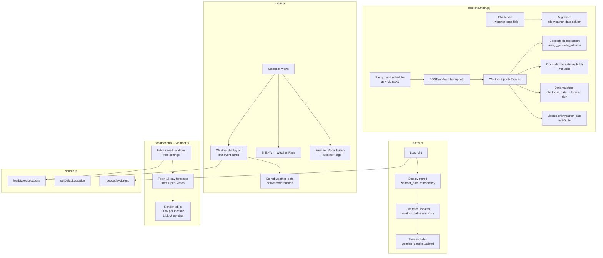

# Design Document: Chit Weather Forecasts

## Overview

This feature extends the existing weather infrastructure (Open-Meteo API, Nominatim geocoding, saved locations, weather modal) to persist weather forecasts directly on chits, display weather on calendar views, automatically refresh forecasts on a schedule, and provide a dedicated full-page weather view.

Currently, weather data is fetched live and cached only in localStorage — it is not stored in the chit record itself. This design adds a `weather_data` JSON field to each chit, a backend weather update service with two tiers (hourly for 7-day window, daily for 16-day window), calendar view weather display, editor integration, and a full weather page accessible via Shift+W.

### Key Design Decisions

1. **`weather_data` as a JSON text column on chits** — Follows the existing pattern used by `alerts`, `recurrence_rule`, `checklist`, etc. Serialized/deserialized via `serialize_json_field`/`deserialize_json_field`. No new tables needed.

2. **Backend-driven weather updates** — Unlike the current frontend-only approach, the update service runs server-side using Python's `urllib` (already imported) to call Open-Meteo and Nominatim. This enables scheduled background updates without requiring a browser to be open.

3. **Two-tier update schedule** — Hourly updates for chits within 7 days (higher accuracy needed), daily updates for 8–16 days out (general forecast sufficient). Both tiers share the same update logic, differing only in query window and schedule interval.

4. **Geocode deduplication** — The update endpoint geocodes each unique location string once and reuses coordinates for all chits sharing that location. This minimizes Nominatim calls and respects rate limits.

5. **Weather page as a secondary page** — Uses `_template.html` pattern with `shared-page.css` and `shared-page.js` for consistent styling and header/footer injection. No new dependencies.

6. **Celsius storage, Fahrenheit display** — Open-Meteo returns Celsius by default. Store raw Celsius values; convert to Fahrenheit in the frontend display layer. This keeps stored data API-native and avoids double-conversion issues.

## Architecture



## Components and Interfaces

### Backend Changes (main.py)

**Chit Model Update:**
- Add `weather_data: Optional[str] = None` to the `Chit` Pydantic model (JSON-serialized string, same pattern as `alerts`, `recurrence_rule`)

**Migration Function:**
- `migrate_add_weather_data()` — adds `weather_data TEXT` column to the `chits` table if not present. Called at startup alongside existing migrations.

**Chit CRUD Updates:**
- `create_chit()` — include `weather_data` in INSERT column list, serialize via `serialize_json_field()`
- `update_chit()` — include `weather_data` in UPDATE SET clause, serialize via `serialize_json_field()`
- `get_chit()`, `get_all_chits()`, `search_chits()` — deserialize `weather_data` via `deserialize_json_field()`

**Weather Update Endpoint:**
- `POST /api/weather/update` — triggers the weather update process
  - Queries all non-deleted chits with a non-empty `location` and at least one date field (`start_datetime` or `due_datetime`) within the next 16 days
  - Groups chits by unique location string
  - Geocodes each unique location once (reuses existing `_geocode_address()` async function with caching)
  - Fetches 16-day forecast from Open-Meteo per unique location (single API call per location)
  - Matches each chit's focus date (earliest of `start_datetime`, `due_datetime`) to the correct day in the forecast response
  - Updates each chit's `weather_data` field in the database
  - Returns `{ "updated": int, "skipped": int, "elapsed_seconds": float }`

**Background Scheduler:**
- Two `asyncio` background tasks started on app startup:
  - Hourly task: calls the update logic for chits in the 0–7 day window every 60 minutes
  - Daily task: calls the update logic for chits in the 8–16 day window every 24 hours
- Uses `asyncio.create_task()` with `asyncio.sleep()` loops (same pattern as existing background work in the codebase)
- A shared `_update_lock` (already exists in main.py) prevents concurrent runs

### Weather Data Shape

```json
{
  "focus_date": "2025-07-15",
  "updated_time": "2025-07-14T10:30:00Z",
  "high": 28.5,
  "low": 16.2,
  "precipitation": 2.4,
  "weather_code": 3
}
```

- `focus_date` (string): ISO date the forecast is for (derived from chit's earliest date field)
- `updated_time` (string): ISO timestamp of when the forecast was last fetched
- `high` (float): High temperature in Celsius
- `low` (float): Low temperature in Celsius
- `precipitation` (float): Precipitation sum in mm
- `weather_code` (int): WMO weather code integer (0–99)

### Frontend — Calendar Views (main.js)

**Weather display on chit event cards:**
- In the card rendering function, check if `chit.weather_data` exists and is non-null
- If present: render weather icon (from `weather_code` using existing `_getWeatherIcon()`), high °F, low °F
- For Day/Week/Work/X-Days views: also show precipitation
- If `weather_data.updated_time` is older than 24 hours: show a stale indicator (⏳) next to the weather data
- If `weather_data` is absent but `chit.location` exists: fall back to existing live-fetch indicator behavior (`_queueChitWeatherFetch`)

**Celsius-to-Fahrenheit conversion utility:**
- `_celsiusToFahrenheit(c)` — `Math.round(c * 9 / 5 + 32)` — used by both calendar cards and weather page

**Shift+W hotkey:**
- Add `Shift+W` case to the existing keydown handler in main.js (when no input focused)
- Navigates to `/frontend/weather.html`

**Weather Modal enhancement:**
- Add a "📊 Full Forecast" button to the weather modal that navigates to `/frontend/weather.html`

### Frontend — Editor (editor.js)

**Display stored weather_data on load:**
- In `loadChitData()`, after fetching the chit, check if `chit.weather_data` exists
- If present: immediately call `_displayWeatherInCompactSection()` with the stored data (before any live fetch)
- Then proceed with the existing live-fetch logic, which will update `weather_data` in memory

**Update weather_data in memory after live fetch:**
- After `_fetchWeatherData()` succeeds, build a `weather_data` object from the API response and store it on the in-memory chit object
- Fields: `focus_date` (from the chit's date), `updated_time` (current ISO timestamp), `high`, `low`, `precipitation`, `weather_code` (from Open-Meteo response)

**Include weather_data in save payload:**
- In the save function, include `weather_data` as a JSON string in the payload sent to `PUT /api/chits/{chit_id}`
- Use `JSON.stringify()` to serialize the weather_data object before including in the save payload

### Frontend — Weather Page (weather.html + weather.js)

**Page structure:**
- Uses `_template.html` pattern with `data-page-title="Weather Forecast"` and `data-page-icon="🌤️"` on `<body>`
- Loads `shared-page.css`, `shared-page.js`, `shared.js`, and page-specific `weather.js`
- Contains a `<div id="weather-content">` for the forecast table

**weather.js logic:**
- On page load:
  1. Call `loadSavedLocations()` from shared.js
  2. If no saved locations: show message directing user to Settings
  3. For each saved location: geocode the address, fetch 16-day forecast from Open-Meteo
  4. Render the forecast table

**Table layout:**
- One row per saved location
- Row header: location label + address
- Each forecast day is a separate block/cell within the row
- Date displayed above each block
- Each block shows: weather icon, high °F, low °F, precipitation
- Horizontal scrolling for the 16-day range
- Parchment/brown theme matching existing pages

**Navigation:**
- Accessible via Shift+W from dashboard
- Accessible via button on weather modal
- Accessible via button/link from calendar views (added to the view header area)
- ESC navigates back (handled by shared-page.js)

## Data Models

### Chits Table Schema Change

```sql
ALTER TABLE chits ADD COLUMN weather_data TEXT;
```

The column stores a JSON string. Example value:

```json
{"focus_date": "2025-07-15", "updated_time": "2025-07-14T10:30:00Z", "high": 28.5, "low": 16.2, "precipitation": 2.4, "weather_code": 3}
```

### Chit Pydantic Model Update

```python
class Chit(BaseModel):
    # ... existing fields ...
    weather_data: Optional[str] = None  # JSON string of weather forecast data
```

### Weather Data Object Shape (Frontend)

```javascript
{
  focus_date: "2025-07-15",       // ISO date string
  updated_time: "2025-07-14T10:30:00Z",  // ISO timestamp
  high: 28.5,                     // Celsius float
  low: 16.2,                      // Celsius float
  precipitation: 2.4,             // mm float
  weather_code: 3                 // WMO integer (0-99)
}
```

### Open-Meteo API Response Shape (Reference)

```
GET https://api.open-meteo.com/v1/forecast
  ?latitude={lat}&longitude={lon}
  &daily=weathercode,temperature_2m_max,temperature_2m_min,precipitation_sum
  &timezone=auto&forecast_days=16
```

Response `daily` object:
```json
{
  "time": ["2025-07-14", "2025-07-15", ...],
  "weathercode": [3, 1, ...],
  "temperature_2m_max": [28.5, 30.1, ...],
  "temperature_2m_min": [16.2, 17.8, ...],
  "precipitation_sum": [2.4, 0.0, ...]
}
```


## Correctness Properties

*A property is a characteristic or behavior that should hold true across all valid executions of a system — essentially, a formal statement about what the system should do. Properties serve as the bridge between human-readable specifications and machine-verifiable correctness guarantees.*

### Property 1: Weather data round-trip

*For any* valid `weather_data` JSON object (containing `focus_date` as an ISO date string, `updated_time` as an ISO timestamp, `high` as a float, `low` as a float, `precipitation` as a non-negative float, and `weather_code` as an integer 0–99), creating a chit with that `weather_data` via the POST endpoint and then loading the chit via the GET endpoint SHALL return an equivalent `weather_data` object with exact numeric precision preserved for `high`, `low`, and `precipitation`.

**Validates: Requirements 1.2, 1.4, 1.5, 1.6, 8.1, 8.2**

### Property 2: Chit eligibility partitioning by date window

*For any* set of chits with varying locations, date fields, and deleted statuses, the eligibility filter SHALL correctly partition chits into three mutually exclusive buckets: hourly-eligible (non-deleted, has location, has date within 0–7 days), daily-eligible (non-deleted, has location, has date within 8–16 days, not in hourly bucket), and ineligible (all others). No chit SHALL appear in more than one bucket.

**Validates: Requirements 3.1, 4.1**

### Property 3: Forecast-to-weather_data mapping

*For any* valid Open-Meteo daily forecast response (with arrays of `time`, `weathercode`, `temperature_2m_max`, `temperature_2m_min`, `precipitation_sum`) and any focus date that exists in the response's `time` array, the mapping function SHALL produce a `weather_data` object where `high` equals the `temperature_2m_max` at the matching index, `low` equals the `temperature_2m_min` at the matching index, `precipitation` equals the `precipitation_sum` at the matching index, `weather_code` equals the `weathercode` at the matching index, and `focus_date` equals the target date.

**Validates: Requirements 3.3, 4.3, 5.3**

### Property 4: Celsius-to-Fahrenheit conversion

*For any* Celsius temperature value, the displayed Fahrenheit value SHALL equal `round(celsius * 9/5 + 32)`.

**Validates: Requirements 2.4**

### Property 5: Stale indicator detection

*For any* `updated_time` ISO timestamp, the stale detection function SHALL return true if and only if the timestamp is more than 24 hours before the current time.

**Validates: Requirements 2.5**

### Property 6: Geocode deduplication

*For any* set of chits where N chits share M unique location strings (M ≤ N), the weather update process SHALL make exactly M geocoding calls, not N.

**Validates: Requirements 5.2**

### Property 7: Weather page layout structure

*For any* non-empty list of saved locations and valid 16-day forecast data for each, the weather page SHALL render exactly one row per saved location, and each row SHALL contain exactly one block per forecast day, with each block displaying a weather icon, high temperature in Fahrenheit, low temperature in Fahrenheit, and precipitation value.

**Validates: Requirements 7.4, 7.5, 7.6**

## Error Handling

### Weather Update Service Errors

| Error Condition | Behavior |
|---|---|
| Geocoding fails for a location | Log error, skip all chits with that location, continue with remaining locations |
| Open-Meteo API returns error | Log error, skip all chits for that location, continue with remaining |
| Open-Meteo response missing expected date | Log warning, skip that chit (focus_date not in forecast range) |
| Network timeout on geocoding or weather fetch | Log error, skip that location batch, continue with remaining |
| Database write fails for a chit update | Log error, skip that chit, continue with remaining |
| Concurrent update attempt (lock held) | Return immediately with `{"updated": 0, "skipped": 0, "message": "Update already in progress"}` |

### Calendar View Weather Errors

| Error Condition | Behavior |
|---|---|
| `weather_data` is null/missing but location exists | Fall back to existing live-fetch indicator behavior |
| `weather_data` has invalid/missing fields | Skip weather display for that card (no error shown) |
| `weather_code` not in icon map | Display ❓ icon |

### Editor Weather Errors

| Error Condition | Behavior |
|---|---|
| Stored `weather_data` exists but live fetch fails | Keep displaying stored data with stale badge |
| No stored `weather_data` and live fetch fails | Show error message in compact weather section (existing behavior) |

### Weather Page Errors

| Error Condition | Behavior |
|---|---|
| No saved locations configured | Display message: "No saved locations configured. Add locations in ⚙️ Settings." |
| Geocoding fails for a location | Show error row: "Could not find location: [address]" |
| Weather fetch fails for a location | Show error row: "Weather unavailable for [label]" |
| Settings API fails to load | Show error: "Could not load settings" |

## Testing Strategy

### Unit Tests (Example-Based)

Focus on specific scenarios and edge cases:

- **Migration idempotency**: Verify `migrate_add_weather_data()` can run multiple times without error
- **Chit CRUD with weather_data**: Verify create/read/update cycle includes weather_data field
- **Update endpoint response shape**: Verify response contains `updated`, `skipped`, `elapsed_seconds` fields
- **Error isolation**: Verify one bad location in a batch doesn't prevent other chits from updating
- **Calendar fallback**: Verify chits without weather_data but with location fall back to live-fetch
- **Precipitation display by view**: Verify precipitation shown in Day/Week/Work/X-Days views but not Month/Year
- **Editor stored data display**: Verify stored weather_data displays immediately before live fetch
- **Editor save payload**: Verify weather_data included in save payload
- **Weather page empty state**: Verify "no locations" message when no saved locations configured
- **Weather page navigation**: Verify Shift+W, modal button, and calendar view button all navigate correctly
- **Stale badge on editor**: Verify stale badge appears during refresh and is removed after

### Property-Based Tests

Using Python stdlib only (`random`, `string`, `uuid`, `unittest`) — no Hypothesis.

- **Property 1** (Weather data round-trip): Generate random weather_data objects with varying field values (random floats for temperatures, random ints 0–99 for weather_code, random ISO dates/timestamps). POST a chit with the weather_data, GET it back, verify exact equivalence including numeric precision. Minimum 100 iterations.
  - Tag: `Feature: chit-weather-forecasts, Property 1: Weather data round-trip`

- **Property 2** (Chit eligibility partitioning): Generate random sets of chits with varying locations (some empty), dates (some in 7-day window, some in 8–16 day, some outside, some null), and deleted flags. Run the eligibility filter, verify correct partitioning into hourly/daily/ineligible buckets with no overlaps. Minimum 100 iterations.
  - Tag: `Feature: chit-weather-forecasts, Property 2: Chit eligibility partitioning by date window`

- **Property 3** (Forecast-to-weather_data mapping): Generate random Open-Meteo-shaped forecast responses (arrays of dates, temperatures, precipitation, weather codes) and random focus dates from within the response. Run the mapping function, verify each field matches the correct index. Minimum 100 iterations.
  - Tag: `Feature: chit-weather-forecasts, Property 3: Forecast-to-weather_data mapping`

- **Property 4** (Celsius-to-Fahrenheit conversion): Generate random Celsius values (-50 to 60 range), convert, verify result equals `round(c * 9/5 + 32)`. Minimum 100 iterations.
  - Tag: `Feature: chit-weather-forecasts, Property 4: Celsius-to-Fahrenheit conversion`

- **Property 5** (Stale indicator detection): Generate random timestamps (some within 24h, some older), verify the stale detection function returns the correct boolean. Minimum 100 iterations.
  - Tag: `Feature: chit-weather-forecasts, Property 5: Stale indicator detection`

- **Property 6** (Geocode deduplication): Generate random chit sets with overlapping locations, mock the geocoder, run the update logic, verify geocode call count equals unique location count. Minimum 100 iterations.
  - Tag: `Feature: chit-weather-forecasts, Property 6: Geocode deduplication`

- **Property 7** (Weather page layout structure): Generate random saved location lists (1–10) with random 16-day forecast data, call the rendering function, verify row count equals location count and each row has 16 day blocks with all required fields. Minimum 100 iterations.
  - Tag: `Feature: chit-weather-forecasts, Property 7: Weather page layout structure`

### Integration Tests

- **End-to-end weather update**: Create chits with locations and dates, call `POST /api/weather/update`, verify weather_data is populated on the chits
- **Calendar display flow**: Load dashboard with chits that have weather_data, verify weather icons appear on calendar cards
- **Editor round-trip**: Open a chit with weather_data in editor, verify display, save, reload, verify persistence
- **Weather page flow**: Configure saved locations, navigate to weather page, verify forecast table renders
