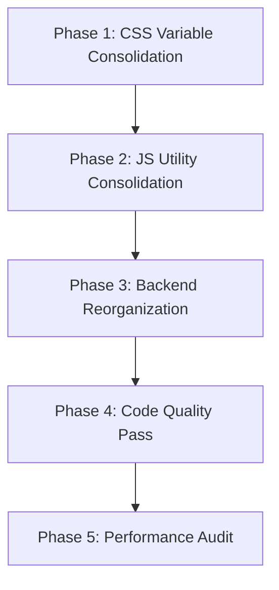

# Design Document — Codebase Refactor

## Overview

This design specifies a safe, incremental refactor of the CWOC codebase that eliminates redundancies, improves code organization, and aligns with the General Principles steering file — all while preserving 100% identical functionality.

The refactor targets three layers:
1. **Frontend CSS** — Consolidate triplicated CSS variable definitions into a single canonical source
2. **Frontend JS** — Extract duplicated utility functions into `shared.js`, consolidate save-system wrappers
3. **Backend Python** — Reorganize `backend/main.py` into clearly separated, commented sections with consistent patterns

The approach is conservative: each change is isolated, testable, and reversible. No new files are created (except potentially a `frontend/shared-variables.css` if needed). No frameworks, build steps, or module systems are introduced.

## Architecture

The existing architecture remains unchanged. The refactor operates within the current file structure:

```
backend/main.py          — single-file FastAPI backend (reorganize sections)
frontend/shared.js       — shared utilities (receives consolidated functions)
frontend/shared-page.js  — shared page components (unchanged)
frontend/shared-page.css — shared secondary page styles (becomes CSS variable source of truth)
frontend/shared-editor.css — shared editor styles (removes duplicate :root, imports from shared-page.css)
frontend/styles.css      — dashboard styles (removes duplicate :root, imports from shared-page.css)
frontend/editor.css      — editor-specific styles (unchanged)
frontend/editor.js       — editor logic (removes duplicates, delegates to shared.js)
frontend/editor_projects.js — projects zone (removes duplicate generateUniqueId)
frontend/main.js         — dashboard logic (removes duplicates, delegates to shared.js)
frontend/settings.js     — settings logic (removes duplicate setSaveButtonUnsaved)
```

### Refactor Execution Order (Risk Minimization)



Each phase is independently testable. If any phase introduces a regression, it can be reverted without affecting other phases.

## Components and Interfaces

### Component 1: CSS Variable Consolidation

**Problem**: `:root` CSS variables are defined identically in three files:
- `frontend/shared-page.css` (lines 11–25) — 14 variables
- `frontend/styles.css` (lines 6–30) — 30 variables (superset)
- `frontend/shared-editor.css` (lines 11–30) — 22 variables (superset with editor-specific additions)

**Solution**: Designate `frontend/shared-page.css` as the single source of truth for the common variable set. The `styles.css` and `shared-editor.css` files will retain only their unique additions (e.g., `--accent-teal`, `--warning-orange`, `--zone-header-bg` in `shared-editor.css`; sidebar/calendar-specific variables in `styles.css`).

**Approach**:
1. Identify the common variable set shared across all three files
2. Keep the full common set in `shared-page.css` `:root`
3. In `styles.css` `:root`, remove variables already defined identically in `shared-page.css`, keep only dashboard-specific additions
4. In `shared-editor.css` `:root`, remove variables already defined identically in `shared-page.css`, keep only editor-specific additions (e.g., `--accent-teal`, `--zone-header-bg`, `--input-bg`, `--modal-bg`, `--hover-bg-light`, `--warning-orange`)
5. Verify that pages loading only `shared-page.css` still get all needed variables
6. Verify that pages loading `shared-editor.css` (which is loaded after `shared-page.css` on editor pages, or standalone on the chit editor) still get all needed variables

**Key constraint**: The dashboard (`index.html`) loads only `styles.css`, not `shared-page.css`. So `styles.css` must remain self-contained with its own `:root` block. The consolidation here means ensuring `styles.css` and `shared-page.css` don't drift — we document that `shared-page.css` is the canonical reference and `styles.css` mirrors the common subset.

**Revised approach for dashboard**: Since `index.html` doesn't load `shared-page.css`, `styles.css` must keep its own `:root` with all variables it needs. The consolidation for `styles.css` is limited to:
- Removing any variables defined but never used in `styles.css`
- Adding a comment referencing `shared-page.css` as the canonical source
- Ensuring values match exactly

For `shared-editor.css`, which is loaded alongside `shared-page.css` on contact-editor pages but standalone (without `shared-page.css`) on the chit editor page (`editor.html`), the same constraint applies — it must remain self-contained.

**Final approach**: The CSS consolidation is primarily a documentation and consistency pass:
- Add clear comments in each `:root` block indicating the canonical source
- Ensure all three files have identical values for shared variables
- Remove any truly unused variables
- Extract any inline styles in HTML files into appropriate CSS classes where they repeat 3+ times

### Component 2: JS Utility Consolidation

**Problem**: Several utility functions are duplicated across files:

| Function | Files | Identical? |
|---|---|---|
| `generateUniqueId()` | `editor.js`, `editor_projects.js` | Yes |
| `formatDate(date)` | `editor.js`, `main.js` | Similar (both use monthNames array) |
| `formatTime(date)` | `editor.js`, `main.js` | Yes |
| `setSaveButtonUnsaved()` | `editor.js`, `settings.js` | Yes (both delegate to `window._cwocSave.markUnsaved()`) |

**Solution**:

1. **`generateUniqueId()`** → Move to `shared.js`. Remove from `editor.js` and `editor_projects.js`. Both files load `shared.js` first, so the function will be available.

2. **`formatDate(date)`** → Consolidate into `shared.js`. The `editor.js` version uses `YYYY-Mon-DD` format, the `main.js` version uses `Mon-DD Day` format. These are actually different functions serving different purposes. Rename for clarity:
   - Keep `formatDate()` in `shared.js` with the editor's `YYYY-Mon-DD` format (used more broadly)
   - In `main.js`, rename the dashboard-specific version to `_formatDateWithDay()` or keep it local since it includes day-of-week info specific to the dashboard

3. **`formatTime(date)`** → Move to `shared.js`. Remove from `editor.js` and `main.js`. Both are identical.

4. **`setSaveButtonUnsaved()`** → Move to `shared.js` as a global convenience wrapper. Remove from `editor.js` and `settings.js`.

**Migration safety**: Since all JS is loaded via `<script>` tags with `shared.js` first, moving functions to `shared.js` makes them available to all downstream scripts. No import changes needed.

### Component 3: Backend Reorganization

**Problem**: `backend/main.py` (1971 lines) has routes, models, helpers, and migrations interleaved without clear section boundaries. Routes are not grouped by resource.

**Solution**: Reorganize into clearly commented sections with consistent ordering:

```python
# ═══════════════════════════════════════════════════════════════════════════
# Section 1: Imports
# ═══════════════════════════════════════════════════════════════════════════

# ═══════════════════════════════════════════════════════════════════════════
# Section 2: Constants & Configuration
# ═══════════════════════════════════════════════════════════════════════════

# ═══════════════════════════════════════════════════════════════════════════
# Section 3: Pydantic Models
# ═══════════════════════════════════════════════════════════════════════════

# ═══════════════════════════════════════════════════════════════════════════
# Section 4: Database Helpers (init, migrations, serialize/deserialize)
# ═══════════════════════════════════════════════════════════════════════════

# ═══════════════════════════════════════════════════════════════════════════
# Section 5: vCard & CSV Serializers
# ═══════════════════════════════════════════════════════════════════════════

# ═══════════════════════════════════════════════════════════════════════════
# Section 6: Database Initialization (runs at import time)
# ═══════════════════════════════════════════════════════════════════════════

# ═══════════════════════════════════════════════════════════════════════════
# Section 7: Static File Serving & Page Routes
# ═══════════════════════════════════════════════════════════════════════════

# ═══════════════════════════════════════════════════════════════════════════
# Section 8: Chit API Routes
# ═══════════════════════════════════════════════════════════════════════════

# ═══════════════════════════════════════════════════════════════════════════
# Section 9: Trash API Routes
# ═══════════════════════════════════════════════════════════════════════════

# ═══════════════════════════════════════════════════════════════════════════
# Section 10: Settings API Routes
# ═══════════════════════════════════════════════════════════════════════════

# ═══════════════════════════════════════════════════════════════════════════
# Section 11: Contact API Routes
# ═══════════════════════════════════════════════════════════════════════════

# ═══════════════════════════════════════════════════════════════════════════
# Section 12: Health Check
# ═══════════════════════════════════════════════════════════════════════════
```

**Key changes**:
- Move `import csv` and `import io` to the top imports section (currently inline at line ~490)
- Group all migration functions together before the initialization calls
- Group all route handlers by resource (chits, trash, settings, contacts, health)
- Add consistent section headers using the `═══` banner style already used in frontend files
- Ensure all route handlers follow the same pattern: open connection, try/except/finally with conn.close()
- Add `conn = None` initialization before try blocks where missing (some handlers already do this, some don't)

### Component 4: Code Quality Pass

**Inline styles extraction**: Several HTML files contain repeated inline styles that should be CSS classes. Key candidates:
- `editor.html`: Multiple `style="display:flex;align-items:center;gap:..."` patterns on zone action rows
- `settings.html`: Repeated inline styles on setting groups and filter items
- `index.html`: Inline styles on sidebar sections

**Comment cleanup**: Remove redundant "what" comments, keep "why" comments. Examples:
- `editor_projects.js` has triple-duplicated function comments (e.g., three comment lines above `renderChildChitsByStatus` and `createChildChitCard`)
- `editor.js` has `// Checklist logic removed` stubs that should be cleaned up

**Naming consistency**: Ensure all private JS helpers use `_` prefix per General Principles.

### Component 5: Performance Improvements

1. **Event listener deduplication**: Audit `editor.js` and `main.js` for event listeners that may be re-attached on re-render (e.g., in `renderChildChitsByStatus`, `openAddChitModal`). Use event delegation where possible.

2. **DOM batch updates**: In `main.js` calendar rendering, use `DocumentFragment` for batch DOM insertions instead of individual `appendChild` calls.

3. **Database connection patterns**: Ensure all backend route handlers use consistent `conn = None; try: ... finally: if conn: conn.close()` pattern. Some handlers currently lack the `conn = None` guard.

4. **Unnecessary duplicate API calls**: Audit frontend init sequences for redundant `/api/settings/default_user` calls. Both `editor.js` and `shared.js` independently call this endpoint — consolidate into a single cached call.

## Data Models

No data model changes. All Pydantic models (`Chit`, `Settings`, `Contact`, `Tag`, `MultiValueEntry`), database schemas, and JSON serialization formats remain identical.

## Correctness Properties

*A property is a characteristic or behavior that should hold true across all valid executions of a system — essentially, a formal statement about what the system should do. Properties serve as the bridge between human-readable specifications and machine-verifiable correctness guarantees.*

### Property 1: JSON Serialization Round-Trip

*For any* valid JSON-serializable value (string, number, boolean, null, list, or dict), calling `serialize_json_field` followed by `deserialize_json_field` SHALL produce a value equal to the original input.

**Validates: Requirements 1.3**

### Property 2: Migration Idempotence

*For any* fresh SQLite database, running all migration functions once and then running them all again SHALL produce an identical database schema — no errors, no duplicate columns, no changed defaults.

**Validates: Requirements 1.4**

### Property 3: vCard Round-Trip Fidelity

*For any* valid Contact dict with arbitrary combinations of name fields, phone entries, email entries, address entries, website entries, call signs, X handles, signal status, PGP key, and favorite flag, calling `vcard_parse(vcard_print(contact))` SHALL produce a contact dict with equivalent field values for all mapped properties.

**Validates: Requirements 5.5**

### Property 4: CSV Round-Trip Fidelity

*For any* list of valid Contact dicts, calling `csv_import(csv_export(contacts))` SHALL produce a list of contact dicts where each contact's given_name, surname, middle_names, prefix, suffix, phones, emails, addresses, call_signs, x_handles, websites, has_signal, pgp_key, and favorite fields are equivalent to the originals (up to the 5-entry-per-field limit).

**Validates: Requirements 5.6**

### Property 5: Display Name Concatenation

*For any* contact with arbitrary combinations of present and absent name parts (prefix, given_name, middle_names, surname, suffix), `compute_display_name` SHALL produce a string equal to the space-joined non-empty, non-whitespace-only parts in order.

**Validates: Requirements 9.5**

### Property 6: Tag Tree Structure Invariants

*For any* list of tag objects with hierarchical names (using `/` as separator), `buildTagTree` SHALL produce a tree where: (a) every leaf tag's `fullPath` matches its input name, (b) every parent node's children are exactly the set of tags that share that parent prefix, and (c) the total number of leaf nodes equals the number of input tags.

**Validates: Requirements 7.1**

### Property 7: Pydantic Model Field Preservation

*For any* valid Chit object constructed with arbitrary field values, serializing it to a JSON dict and reconstructing a Chit from that dict SHALL produce an object with identical field values for all fields.

**Validates: Requirements 1.2**

## Error Handling

The refactor preserves all existing error handling patterns without modification:

- **Backend API errors**: All route handlers maintain their existing `try/except/finally` patterns with `HTTPException` for client errors (404, 400, 422) and 500 for unexpected errors. The reorganization adds consistent `conn = None` guards where missing.
- **Frontend fetch errors**: All `async/await` + `try/catch` patterns with `console.error` logging are preserved. No error handling logic changes.
- **Database errors**: All migration functions maintain their column-existence checks. The `serialize_json_field` / `deserialize_json_field` helpers maintain their `TypeError` / `JSONDecodeError` catch-and-log patterns.
- **Graceful degradation**: Weather fetch failures, geocoding failures, and QR code generation failures continue to show user-friendly messages in the UI.

## Testing Strategy

### Dual Testing Approach

**Property-Based Tests** (using `hypothesis` for Python):
- Minimum 100 iterations per property test
- Each test references its design document property via tag comment
- Tag format: `Feature: codebase-refactor, Property {number}: {property_text}`
- Tests target the pure backend functions: `serialize_json_field`/`deserialize_json_field`, `vcard_parse`/`vcard_print`, `csv_export`/`csv_import`, `compute_display_name`, `buildTagTree` (JS — tested via Node or manual verification)
- Migration idempotence tested by running migrations on an in-memory SQLite database

**Unit Tests** (example-based):
- Verify each API endpoint returns expected status codes for valid and invalid inputs
- Verify `generateUniqueId()` produces unique, non-empty strings
- Verify `formatDate()` and `formatTime()` produce expected output for known dates
- Verify `setSaveButtonUnsaved()` delegates correctly to `window._cwocSave.markUnsaved()`
- Verify CSS variable values match across `shared-page.css`, `styles.css`, and `shared-editor.css`

**Integration / Smoke Tests**:
- Start the server and verify all 24 API endpoints respond correctly
- Load each HTML page and verify no JavaScript console errors
- Verify all static assets are accessible
- Verify the database schema after startup matches expected columns

**Manual Verification Checklist** (for UI preservation):
- Dashboard: all 6 tabs render, all 7 calendar periods work, sidebar filters/sort/hotkeys work
- Editor: all zones expand/collapse, save system works, all date modes work, recurrence works
- Settings: all sections load, save/cancel works, tag editor works, clock drag-drop works
- People: contact list loads, search works, import/export works, QR sharing works
- Contact Editor: all zones work, image upload works, save/delete works
- Trash: table loads, restore/purge works
- Help: all sections render

