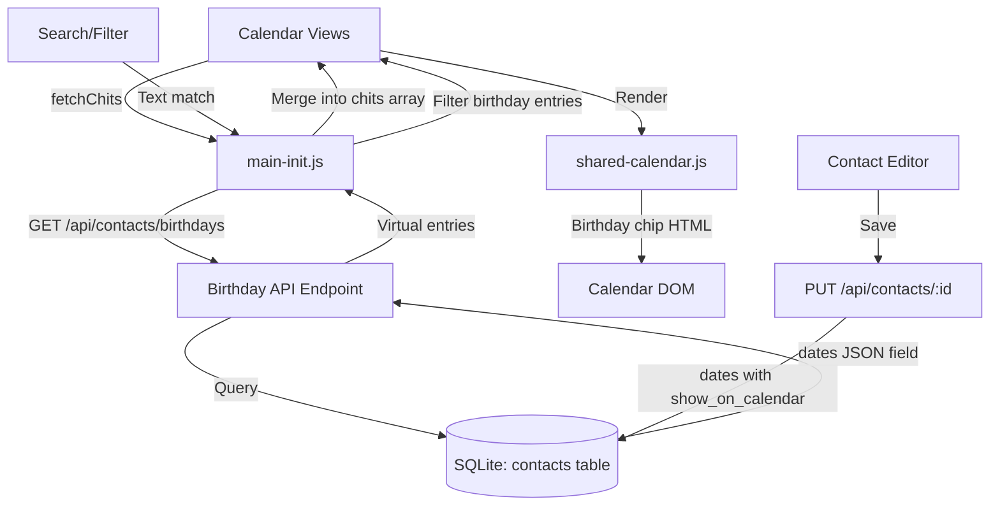

# Design Document: Contact Birthday Calendar

## Overview

This feature generates virtual calendar entries from contact date fields (birthdays, anniversaries, etc.) and displays them on the existing calendar views. The system is stateless — no new database tables or columns are needed. The backend endpoint queries contacts on each request and synthesizes virtual chit-like objects. The frontend merges these into the existing calendar rendering pipeline with a distinctive visual treatment.

The implementation leverages the existing architecture:
- Backend: A single new endpoint `/api/contacts/birthdays` in `src/backend/routes/contacts.py` (already implemented)
- Frontend: Integration into `main-init.js` fetch pipeline (already implemented), calendar rendering in `shared-calendar.js` (partially implemented), and the contact editor's date field UI in `contact-editor.js` (already implemented)
- CSS: Styling for the concave-notch shape and birthday chip in `styles-calendar.css` (partially implemented)

## Architecture



The architecture is intentionally simple:
- **No caching layer**: The birthday endpoint is lightweight (single SQL query + in-memory date math). Re-fetching on each `fetchChits()` call ensures data is always fresh.
- **No new database schema**: The `show_on_calendar` flag is stored within the existing `dates` JSON field on each contact row.
- **Virtual entries**: Birthday entries are never persisted as chits. They exist only in the frontend's `chits` array during a session.

## Components and Interfaces

### Backend: Birthday API Endpoint

**File**: `src/backend/routes/contacts.py`  
**Route**: `GET /api/contacts/birthdays`  
**Auth**: Requires authenticated user (via `request.state.user_id`)

**Logic**:
1. Query contacts where `(owner_id = user_id OR shared_to_vault = 1) AND (deleted = 0 OR deleted IS NULL)`
2. For each contact, deserialize the `dates` JSON field
3. For each date entry where `show_on_calendar` is not explicitly `False`:
   - Parse the date value (YYYY-MM-DD format)
   - Skip unparseable dates silently
   - Generate entries for years: `[today.year - 1, today.year, today.year + 1]`
   - Handle Feb 29 → Feb 28 fallback for non-leap years
   - Calculate age when original year > 1900 and < target year
   - Format title: `"🎂 {display_name} — {label} ({age} yrs)"` or `"🎂 {display_name}{age_str}"` when no label
4. Return array of virtual chit-like objects

**Response shape** (per entry):
```json
{
  "id": "birthday_{contact_id}_{label}_{date}",
  "title": "🎂 Jane Doe — Birthday (34 yrs)",
  "start_datetime": "2025-05-15T00:00:00",
  "end_datetime": "2025-05-15T23:59:59",
  "all_day": true,
  "color": "#E3B23C",
  "tags": ["Calendar"],
  "people": ["Jane Doe"],
  "_is_birthday": true,
  "_contact_id": "uuid-here",
  "_contact_image_url": "/data/contacts/profile_pictures/uuid.jpg",
  "_date_label": "Birthday"
}
```

### Frontend: Contact Editor Date Toggle

**File**: `src/frontend/js/pages/contact-editor.js`  
**Function**: `addMultiValueEntry('dates', ...)`

Each date row includes a checkbox with class `mv-show-on-calendar`. When saving, the `show_on_calendar` boolean is included in the date entry's JSON object. New entries default to `checked = true`.

### Frontend: Calendar Rendering

**File**: `src/frontend/js/shared/shared-calendar.js`  
**Function**: `calendarEventTitle(chit, ...)`

When `chit._isBirthday` is true, renders a birthday chip instead of the standard event title:
```html
<span class="birthday-chip" style="background-color:{color};">
  
  {display_name} 🎂 {label} ({age} yrs)
</span>
```

### Frontend: Calendar Integration

**File**: `src/frontend/js/dashboard/main-init.js`  
**Function**: `fetchChits()`

Fetches `/api/contacts/birthdays` in parallel with owned and shared chits. Merges results into the global `chits` array with `_isBirthday = true` flag.

### Frontend: Click Navigation

**File**: `src/frontend/js/dashboard/main-calendar.js`  
**Function**: `openChitForEdit(chit)`

When `chit._isBirthday && chit._contact_id`, navigates to `/frontend/html/contact-editor.html?id={_contact_id}` instead of the chit editor.

### Frontend: Search Integration

**File**: `src/frontend/js/dashboard/main-search.js` and calendar filter logic

Birthday entries are included in the global `chits` array, so the existing sidebar text filter and calendar search naturally apply to them. The `title` and `people` fields on birthday entries contain the contact name and label, making them searchable.

### CSS: Concave Notch Shape

**File**: `src/frontend/css/dashboard/styles-calendar.css`

The `.birthday-event` class applies a concave-notch clip-path (inward triangular cutouts on left and right edges) — the visual inverse of the `.point-in-time` outward-pointing shape. Text padding prevents content from overlapping the notched areas.

```css
.birthday-event {
  clip-path: polygon(
    0% 0%, 8px 50%, 0% 100%,
    100% 100%, calc(100% - 8px) 50%, 100% 0%
  );
  padding-left: 12px;
  padding-right: 12px;
}
```

## Data Models

### Date Entry (within Contact.dates JSON array)

```python
# Stored as JSON in contacts.dates column
{
  "label": "Birthday",       # str — user-defined label
  "value": "1990-05-15",     # str — YYYY-MM-DD format
  "show_on_calendar": true   # bool — defaults to true if absent
}
```

No schema migration is needed. The `show_on_calendar` field is stored within the existing JSON blob. The backend treats absence of the field as `true` (opt-out model).

### Virtual Calendar Entry (API response, not persisted)

```python
{
  "id": str,                    # "birthday_{contact_id}_{label}_{date}"
  "title": str,                 # "🎂 Name — Label (age yrs)"
  "start_datetime": str,        # ISO 8601, always T00:00:00
  "end_datetime": str,          # ISO 8601, always T23:59:59
  "all_day": True,
  "color": str,                 # Contact color or "#f5e6d3"
  "tags": ["Calendar"],
  "people": [str],              # [display_name]
  "_is_birthday": True,         # Discriminator flag
  "_contact_id": str,           # For click-through navigation
  "_contact_image_url": str,    # For thumbnail display
  "_date_label": str,           # Original label text
  # Standard chit fields set to null/false for compatibility
  "status": None, "note": None, "pinned": False,
  "archived": False, "deleted": False, ...
}
```

## Correctness Properties

*A property is a characteristic or behavior that should hold true across all valid executions of a system — essentially, a formal statement about what the system should do. Properties serve as the bridge between human-readable specifications and machine-verifiable correctness guarantees.*

### Property 1: show_on_calendar filtering

*For any* set of contacts with date entries, the Birthday API SHALL return Virtual_Calendar_Entries only for date entries where `show_on_calendar` is not explicitly `False`. Date entries with `show_on_calendar = true` or with the field absent SHALL produce entries; those with `show_on_calendar = false` SHALL be excluded.

**Validates: Requirements 1.1, 2.3, 2.4**

### Property 2: Three-year generation

*For any* valid date entry on a contact, the Birthday API SHALL generate exactly 3 Virtual_Calendar_Entries: one for the previous year, one for the current year, and one for the next year relative to today.

**Validates: Requirements 1.2**

### Property 3: Title formatting with age calculation

*For any* contact with a date entry where the original year is between 1901 and (target_year - 1) inclusive and a non-empty label exists, the Virtual_Calendar_Entry title SHALL match the format `"🎂 {display_name} — {label} ({target_year - original_year} yrs)"`.

**Validates: Requirements 1.3, 1.4**

### Property 4: Entry structure invariants

*For any* generated Virtual_Calendar_Entry: (a) `start_datetime` SHALL end with `T00:00:00`, (b) `end_datetime` SHALL end with `T23:59:59`, (c) `color` SHALL equal the contact's color when set or `"#f5e6d3"` when the contact has no color, and (d) `_contact_id`, `_contact_image_url`, and `_date_label` SHALL be present and match the source contact and date entry.

**Validates: Requirements 1.5, 1.7, 1.8**

### Property 5: show_on_calendar persistence round-trip

*For any* contact saved with date entries containing explicit `show_on_calendar` boolean values, reloading that contact SHALL return the same `show_on_calendar` values in the dates JSON field.

**Validates: Requirements 2.5**

### Property 6: Search matches by name or label across years

*For any* birthday Virtual_Calendar_Entry, a search query containing a substring of the contact's display name or the date label SHALL include that entry in results, and results SHALL span all three generated years.

**Validates: Requirements 4.1, 4.2, 4.3**

### Property 7: Calendar filter applies uniformly to birthday entries

*For any* text filter applied to the calendar view, Virtual_Calendar_Entries SHALL be filtered using the same text-matching logic as regular chits (matching against `title` and `people` fields).

**Validates: Requirements 4.4**

### Property 8: Access control and soft-delete exclusion

*For any* authenticated user, the Birthday API SHALL return entries only for contacts where `(owner_id = user_id OR shared_to_vault = 1) AND (deleted = 0 OR deleted IS NULL)`. Soft-deleted contacts and contacts owned by other users (not shared to vault) SHALL produce zero entries.

**Validates: Requirements 5.1, 5.2**

### Property 9: Graceful skip of unparseable dates

*For any* contact with a mix of valid and invalid date values (non-YYYY-MM-DD strings, empty strings, malformed data), the Birthday API SHALL produce entries for all valid dates and silently skip invalid ones without returning an error response.

**Validates: Requirements 5.4**

## Error Handling

| Scenario | Handling |
|----------|----------|
| Unparseable date value in contact's dates field | Skip silently, continue processing other dates (try/except around date parsing) |
| Feb 29 in non-leap target year | Fall back to Feb 28 |
| Contact with no dates field or empty dates | Skip contact, continue to next |
| Date entry missing `value` key | Skip entry, continue |
| Database connection error | Return HTTP 500 with error message |
| Non-list dates field (corrupted JSON) | Skip contact via `isinstance(dates_raw, list)` check |
| Contact with no display_name | Fall back to `given_name` or "Unknown" |
| Birthday fetch fails in frontend | Catch error, log it, continue with empty birthday array (non-blocking) |

## Testing Strategy

### Unit Tests (Example-Based)

- Verify the contact editor renders the "Show on Calendar" checkbox for date entries
- Verify new date entries default to `show_on_calendar = true`
- Verify clicking a birthday event navigates to the contact editor
- Verify the concave-notch CSS class is applied to birthday events
- Verify the birthday chip renders with profile image when available

### Property Tests

Property-based testing is applicable to this feature because the Birthday API is a pure data transformation: contacts in → virtual entries out. The logic involves date arithmetic, string formatting, and filtering — all well-suited to PBT.

**Library**: Python `hypothesis` (backend) — but since no installs are allowed, property tests are optional and documented here for future implementation.

**Configuration**: Minimum 100 iterations per property test.

**Tag format**: `Feature: contact-birthday-calendar, Property {N}: {title}`

Each correctness property (1–9 above) maps to a single property-based test that generates random contacts with random date entries and verifies the stated invariant holds.

### Integration Tests

- End-to-end: Create a contact with dates via API, fetch `/api/contacts/birthdays`, verify entries appear
- Update contact (toggle show_on_calendar off), re-fetch, verify entry disappears
- Delete contact (soft-delete), re-fetch, verify entries disappear
- Verify birthday entries appear in calendar views alongside regular chits
