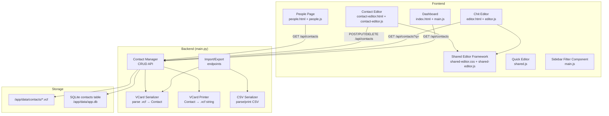
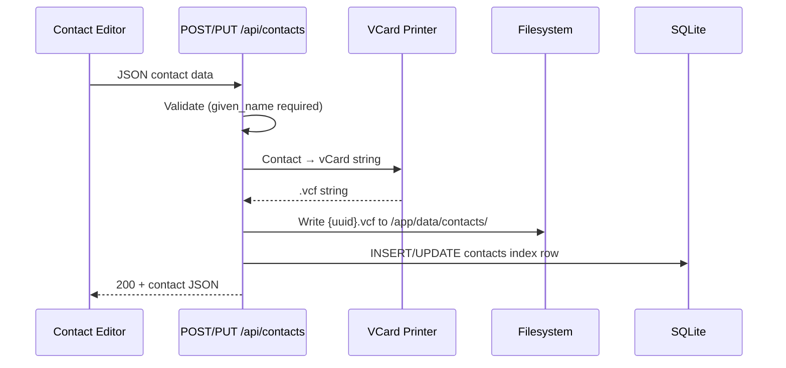
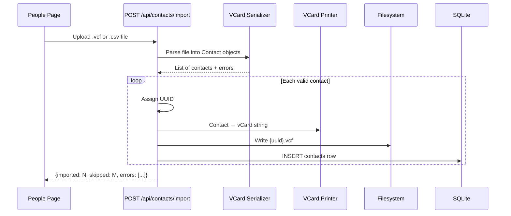
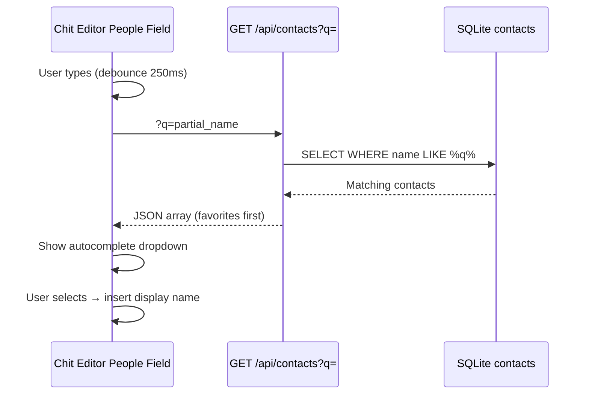

# Design Document: Contacts Rolodex

## Overview

The Contacts Rolodex adds a full-featured contact management system to CWOC. Contacts are stored as vCard 3.0 `.vcf` files on disk (one per contact) with a SQLite index for fast search and filtering. The feature introduces two new frontend pages (People browse page, Contact Editor), a shared editor framework extracted from the existing chit editor, backend CRUD/import/export API endpoints, vCard serialization/deserialization, QR code sharing, People Picker autocomplete integration in the chit editor, compact people chips in the Quick Editor, a dashboard People filter panel, and a generalized sidebar filter component that unifies the tag and people filter patterns.

### Design Decisions & Rationale

1. **vCard 3.0 over 4.0**: vCard 3.0 (RFC 2426) is chosen for maximum compatibility with existing contact apps (iOS, Android, Outlook, Google). Custom fields (Signal, PGP) use X-properties which are well-supported in 3.0.

2. **Dual storage (`.vcf` files + SQLite index)**: `.vcf` files provide portability and human-readability for backup. The SQLite `contacts` table provides fast search, sort, and filter without parsing files on every request. Writes are atomic — both are updated in a single operation.

3. **Python-side vCard parsing**: No external vCard library — the vCard 3.0 format is simple enough to parse/print with Python string operations. This avoids adding pip dependencies and keeps the single-file backend pattern.

4. **Reuse `qrcode-generator@1.4.4`**: The chit editor already loads this CDN library. The Contact Editor and People Page will reuse it for QR code generation.

5. **Shared Editor Framework extraction**: Rather than duplicating the header-row/zone/save-button patterns, we extract `shared-editor.css` and `shared-editor.js` from the existing chit editor. The chit editor then imports these shared files, and the Contact Editor builds on the same foundation.

6. **Generalized Sidebar Filter Component**: The tag filter panel pattern (search, favorites-first, hotkeys, click-to-toggle) is extracted into a reusable function. Both the existing tag filter and the new People filter use it, reducing code duplication and ensuring consistent UX.

## Architecture



### Data Flow: Create/Update Contact



### Data Flow: Import Contacts



### Data Flow: People Picker Autocomplete



## Components and Interfaces

### Backend Components (all in `backend/main.py`)

#### Contact Pydantic Model

```python
class MultiValueEntry(BaseModel):
    label: Optional[str] = None    # "Work", "Home", "Mobile", custom
    value: Optional[str] = None

class Contact(BaseModel):
    id: Optional[str] = None
    given_name: str                          # Required
    surname: Optional[str] = None
    middle_names: Optional[str] = None
    prefix: Optional[str] = None
    suffix: Optional[str] = None
    addresses: Optional[List[MultiValueEntry]] = None
    phones: Optional[List[MultiValueEntry]] = None
    emails: Optional[List[MultiValueEntry]] = None
    call_signs: Optional[List[MultiValueEntry]] = None
    x_handles: Optional[List[MultiValueEntry]] = None
    websites: Optional[List[MultiValueEntry]] = None
    has_signal: Optional[bool] = False
    pgp_key: Optional[str] = None
    favorite: Optional[bool] = False
    created_datetime: Optional[str] = None
    modified_datetime: Optional[str] = None
```

#### API Endpoints

| Method | Path | Description | Request | Response |
|--------|------|-------------|---------|----------|
| `POST` | `/api/contacts` | Create contact | `Contact` JSON | `Contact` with id |
| `GET` | `/api/contacts` | List/search contacts | `?q=search_term` | `Contact[]` (favorites first, then alpha) |
| `GET` | `/api/contacts/{id}` | Get single contact | — | `Contact` |
| `PUT` | `/api/contacts/{id}` | Update contact | `Contact` JSON | `Contact` |
| `DELETE` | `/api/contacts/{id}` | Delete contact (hard) | — | `{message}` |
| `PATCH` | `/api/contacts/{id}/favorite` | Toggle favorite | — | `Contact` |
| `POST` | `/api/contacts/import` | Import .vcf/.csv | File upload | `{imported, skipped, errors}` |
| `GET` | `/api/contacts/export?format=vcf\|csv` | Export all | `?format=` | File download |
| `GET` | `/api/contacts/{id}/export?format=vcf` | Export single | — | File download |

#### VCard Serializer (`vcard_parse`)

Parses a vCard 3.0 string into a `Contact` dict. Maps standard properties:

| vCard Property | Contact Field |
|---------------|---------------|
| `N` | surname, given_name, middle_names, prefix, suffix |
| `FN` | (computed display name — used for fallback) |
| `TEL;TYPE=x` | phones (label=TYPE value) |
| `EMAIL;TYPE=x` | emails (label=TYPE value) |
| `ADR;TYPE=x` | addresses (label=TYPE, value=formatted address) |
| `URL;TYPE=x` | websites (label=TYPE value) |
| `NOTE` | (not mapped — contacts don't have notes) |
| `X-SIGNAL` | has_signal (boolean) |
| `X-PGP-KEY` | pgp_key (text) |
| `X-CALLSIGN;TYPE=x` | call_signs |
| `X-XHANDLE;TYPE=x` | x_handles |

#### VCard Printer (`vcard_print`)

Formats a `Contact` dict into a valid vCard 3.0 string:

```
BEGIN:VCARD
VERSION:3.0
N:Surname;GivenName;MiddleNames;Prefix;Suffix
FN:Prefix GivenName MiddleNames Surname Suffix
TEL;TYPE=Work:+1-555-0100
EMAIL;TYPE=Home:user@example.com
ADR;TYPE=Home:;;123 Main St;Anytown;NY;10001;US
URL;TYPE=Work:https://example.com
X-SIGNAL:true
X-PGP-KEY:-----BEGIN PGP PUBLIC KEY BLOCK-----...
X-CALLSIGN;TYPE=Ham:KD2ABC
X-XHANDLE;TYPE=X:@username
END:VCARD
```

#### CSV Serializer

- **Export**: Flattens contacts into rows with columns: `given_name`, `surname`, `middle_names`, `prefix`, `suffix`, `phone_1_label`, `phone_1_value`, `phone_2_label`, `phone_2_value`, ... (up to 5 per multi-value type), `has_signal`, `pgp_key`, `favorite`.
- **Import**: Maps CSV column headers to Contact fields. Requires `given_name` column. Multi-value fields use `{type}_N_label` / `{type}_N_value` naming.

### Frontend Components

#### People Page (`frontend/people.html` + `frontend/people.js`)

- Built from `_template.html`, loads `shared-page.css` + `shared-page.js`
- `<body data-page-title="People" data-page-icon="👥">`
- Displays a scrollable contact list with search input
- Each row: star toggle (★/☆) + display name + Share (QR) button
- "New Contact", "Import", "Export" buttons in the header
- Loads `qrcode-generator` CDN for QR sharing
- Search input filters in real-time via client-side filtering of loaded contacts (with fallback to `?q=` API for large lists)

#### Contact Editor (`frontend/contact-editor.html` + `frontend/contact-editor.js`)

- Loads `shared-editor.css` + `shared-editor.js` for header row, zones, save logic
- Loads `shared-page.css` for base parchment styling
- Header row: logo, "Contact Editor" title, star toggle, save buttons (CwocSaveSystem), Share QR button, Delete button
- Zones:
  - **Name Zone**: prefix (dropdown+custom), given name, middle names, surname, suffix (dropdown+custom)
  - **Communication Zone**: multi-value editors for phone, email, address, call sign, X handle, website/social — each with label input + value input + "Add" button
  - **Security Zone**: Signal toggle, PGP public key textarea
- URL pattern: `/frontend/contact-editor.html?id={uuid}` (new contact if no `?id`)

#### Shared Editor Framework (`frontend/shared-editor.css` + `frontend/shared-editor.js`)

Extracted from existing `editor.css` and `editor.js`:

**`shared-editor.css`** provides:
- `.header-row` — flex container with logo, title, left/right button groups
- `.zone-container`, `.zone-header`, `.zone-body`, `.zone-toggle-icon` — collapsible zone pattern
- `.main-zones-grid` — two-column responsive grid
- `.field`, `.field label`, `.field input/select/textarea` — form field styling within zones
- Button styles (save, cancel, delete, action buttons)

**`shared-editor.js`** provides:
- `cwocToggleZone(event, sectionId, contentId)` — zone expand/collapse
- `CwocEditorSaveSystem` class — wraps `CwocSaveSystem` with editor-specific defaults (markUnsaved on any input change, save button state management)
- `cwocInitEditorHotkeys(zoneMap)` — Alt+N hotkeys for zone focus (parameterized zone map)

**Migration**: The chit editor's `editor.css` retains only chit-specific styles (date pickers, checklist, alerts, etc.). `editor.js` retains chit-specific logic but delegates zone toggle and save state to the shared framework.

#### People Picker Enhancement (`frontend/editor.js`)

- Adds autocomplete to the existing `#people` input field
- On keyup (debounced 250ms): `GET /api/contacts?q={typed_text}`
- Renders dropdown below input: favorites first (★), then alphabetical
- Click/Enter inserts display name as comma-separated entry
- Free-text entry still allowed (names not in Rolodex)

#### Quick Editor People Chips (`frontend/shared.js`)

- In `showQuickEditModal()`, after the title section, render people as compact chips
- Each chip: `<span class="cwoc-people-chip">{name}</span>`
- If chips overflow one row: show "+N more" with hover tooltip listing all names
- Chips are read-only in the quick editor

#### Dashboard People Filter (`frontend/main.js`)

- New filter group `section-people-filter` in the sidebar, after the Label filter group
- Uses the `CwocSidebarFilter` component (see below)
- Data source: `GET /api/contacts` (cached, refreshed on page load)
- Selection stored in `window._sidebarPeopleSelection`
- Filters chits by matching `chit.people` array against selected contact names

#### Generalized Sidebar Filter Component (`frontend/main.js`)

```javascript
/**
 * CwocSidebarFilter — reusable filter panel for sidebar.
 * @param {Object} config
 * @param {string} config.containerId — DOM element ID for the panel
 * @param {Array}  config.items — [{name, favorite, color?}]
 * @param {Array}  config.selection — current selected names (mutated in place)
 * @param {Function} config.onChange — called when selection changes
 * @param {string} [config.searchPlaceholder] — e.g. "Search tags..."
 * @param {boolean} [config.showColorBadge] — show colored badge (tags) vs plain text (people)
 */
function CwocSidebarFilter(config) { ... }
```

- Renders search input, favorites-first sorted list (capped at 9 visible), click-to-toggle, hotkey 1–9 support
- Existing `_buildTagFilterPanel()` refactored to call `CwocSidebarFilter` with `showColorBadge: true`
- People filter calls `CwocSidebarFilter` with `showColorBadge: false`

### Dashboard Navigation

- New "People" button in `section-settings` area of `index.html`, placed directly above the Settings button
- Uses Font Awesome `fa-address-book` icon (or a static asset if preferred)
- `onclick` navigates to `/frontend/people.html`

## Data Models

### SQLite `contacts` Table Schema

```sql
CREATE TABLE IF NOT EXISTS contacts (
    id TEXT PRIMARY KEY,
    given_name TEXT NOT NULL,
    surname TEXT,
    middle_names TEXT,
    prefix TEXT,
    suffix TEXT,
    display_name TEXT,          -- Computed: "Prefix Given Middle Surname Suffix"
    phones TEXT,                -- JSON: [{"label":"Work","value":"+1-555-0100"}]
    emails TEXT,                -- JSON: [{"label":"Home","value":"user@example.com"}]
    addresses TEXT,             -- JSON: [{"label":"Home","value":"123 Main St, ..."}]
    call_signs TEXT,            -- JSON: [{"label":"Ham","value":"KD2ABC"}]
    x_handles TEXT,             -- JSON: [{"label":"X","value":"@username"}]
    websites TEXT,              -- JSON: [{"label":"Work","value":"https://..."}]
    has_signal BOOLEAN DEFAULT 0,
    pgp_key TEXT,
    favorite BOOLEAN DEFAULT 0,
    created_datetime TEXT,
    modified_datetime TEXT
);
```

Multi-value fields are stored as JSON strings (same pattern as chits' `tags`, `checklist`, etc.) using the existing `serialize_json_field` / `deserialize_json_field` helpers.

The `display_name` column is computed on write and used for search/sort without needing to concatenate at query time.

### Contact `.vcf` File Storage

- Directory: `/app/data/contacts/`
- Filename: `{uuid}.vcf`
- One vCard per file
- Created/updated atomically with the SQLite index row
- Deleted from disk when contact is deleted

### Existing Chit Model — People Field

The chit `people` field is already a JSON array of strings (names). No schema change needed. The People Picker enhancement simply provides autocomplete suggestions from the contacts table when editing this field.


## Correctness Properties

*A property is a characteristic or behavior that should hold true across all valid executions of a system — essentially, a formal statement about what the system should do. Properties serve as the bridge between human-readable specifications and machine-verifiable correctness guarantees.*

### Property 1: Contact API round-trip

*For any* valid Contact object (with arbitrary name parts, multi-value entries with arbitrary labels, boolean flags, and PGP key text), creating the contact via `POST /api/contacts` and then retrieving it via `GET /api/contacts/{id}` SHALL return a contact whose fields are equivalent to the original (excluding server-assigned `id`, `created_datetime`, `modified_datetime`, and `display_name`).

**Validates: Requirements 1.1, 1.4, 1.5, 1.6, 1.8, 1.9**

### Property 2: Favorites-first alphabetical sort invariant

*For any* set of contacts with arbitrary `favorite` flags and display names, the list returned by `GET /api/contacts` SHALL be ordered such that all contacts with `favorite=true` appear before all contacts with `favorite=false`, and within each group contacts are sorted alphabetically by `display_name` (case-insensitive).

**Validates: Requirements 3.8, 4.8, 10.5, 14.3, 15.2, 15.3, 15.4, 16.3**

### Property 3: vCard serialization round-trip

*For any* valid Contact object (including multi-value fields with labels, Signal flag, and PGP key), formatting it with `vcard_print` and then parsing the result with `vcard_parse` and then formatting again with `vcard_print` SHALL produce a vCard string equivalent to the first `vcard_print` output.

**Validates: Requirements 8.1, 8.2, 8.3, 8.4, 8.5**

### Property 4: CSV serialization round-trip

*For any* valid Contact object, exporting it to CSV format and then importing the CSV back SHALL produce a Contact whose core fields (name parts, multi-value entries, flags) are equivalent to the original.

**Validates: Requirements 6.2, 6.3, 7.1, 7.2**

### Property 5: Search results relevance

*For any* set of contacts and any non-empty search query string `q`, every contact returned by `GET /api/contacts?q={q}` SHALL have at least one field (display_name, email value, phone value, or call_sign value) that contains `q` as a case-insensitive substring.

**Validates: Requirements 3.2**

### Property 6: Favorite toggle involution

*For any* contact, calling `PATCH /api/contacts/{id}/favorite` twice in succession SHALL return the contact to its original `favorite` state.

**Validates: Requirements 3.9**

### Property 7: People filter correctness

*For any* set of chits (each with a `people` array of strings) and any non-empty set of selected person names, the filtered result SHALL contain exactly those chits whose `people` array contains at least one name from the selected set.

**Validates: Requirements 14.4**

## Error Handling

### Backend Error Handling

| Scenario | HTTP Status | Response |
|----------|-------------|----------|
| Contact not found (GET/PUT/DELETE/PATCH) | 404 | `{"detail": "Contact {id} not found"}` |
| Missing `given_name` on create/update | 422 | Pydantic validation error |
| Malformed vCard during import | 200 | `{"imported": N, "skipped": M, "errors": [{"entry": i, "reason": "..."}]}` |
| CSV missing `given_name` column | 200 | Same summary format with skip reasons |
| File write failure (disk full, permissions) | 500 | `{"detail": "Failed to write contact file: ..."}` |
| Invalid export format parameter | 400 | `{"detail": "Invalid format. Use 'vcf' or 'csv'"}` |
| Database error | 500 | `{"detail": "Database error: ..."}` |

### Frontend Error Handling

- **API errors**: All `fetch` calls use `async/await` with `try/catch`. Errors are logged with `console.error` and shown to the user via a toast or inline message.
- **Import errors**: The import response summary is displayed in a modal showing imported count, skipped count, and individual error reasons.
- **QR code overflow**: If vCard data exceeds QR capacity (~2,953 bytes for alphanumeric at error correction level L), display a message suggesting file export instead.
- **Network failures**: Show "Connection error — please try again" message. Do not lose unsaved editor state.
- **People Picker**: If the contacts API is unreachable, the People Picker falls back to free-text-only mode (no autocomplete suggestions).

## Testing Strategy

### Unit Tests (Example-Based)

- **Prefix/Suffix dropdowns**: Verify preset values are present (Req 1.2, 1.3)
- **Contact validation**: Verify 422 on missing `given_name` (Req 3.7)
- **404 on nonexistent contact**: Verify error response (Req 3.6)
- **Malformed vCard import**: Verify skip + error summary (Req 6.4, 6.5)
- **QR code overflow**: Verify error message for oversized data (Req 9.4)
- **Display name computation**: Verify correct concatenation for various name part combinations
- **Debounce**: Verify People Picker debounce is >= 250ms (Req 10.4)
- **Sidebar filter cap**: Verify max 9 visible items (Req 16.6)

### Property-Based Tests

Property-based tests use [Hypothesis](https://hypothesis.readthedocs.io/) (Python) for backend properties and validate universal correctness across generated inputs. Each test runs a minimum of 100 iterations.

| Property | Test | Tag |
|----------|------|-----|
| Property 1 | Generate random Contact, POST, GET, compare fields | `Feature: contacts-rolodex, Property 1: Contact API round-trip` |
| Property 2 | Generate N contacts with random favorites, GET list, verify sort | `Feature: contacts-rolodex, Property 2: Favorites-first alphabetical sort` |
| Property 3 | Generate random Contact, vcard_print → vcard_parse → vcard_print, compare | `Feature: contacts-rolodex, Property 3: vCard serialization round-trip` |
| Property 4 | Generate random Contact, csv_export → csv_import, compare fields | `Feature: contacts-rolodex, Property 4: CSV serialization round-trip` |
| Property 5 | Generate contacts + query substring, GET with ?q=, verify all results match | `Feature: contacts-rolodex, Property 5: Search results relevance` |
| Property 6 | Generate contact, PATCH favorite twice, verify original state | `Feature: contacts-rolodex, Property 6: Favorite toggle involution` |
| Property 7 | Generate chits with people arrays + selected names, filter, verify correctness | `Feature: contacts-rolodex, Property 7: People filter correctness` |

### Integration Tests

- **Dual storage consistency**: Create contact, verify both `.vcf` file and SQLite row exist and match (Req 2.1, 2.4)
- **Delete cleanup**: Delete contact, verify both `.vcf` file and SQLite row removed (Req 2.5)
- **Import endpoint**: Upload multi-entry `.vcf` file, verify all contacts created (Req 6.1, 6.2)
- **Export endpoint**: Export all contacts as `.vcf` and `.csv`, verify file downloads (Req 7.1, 7.2, 7.3)
- **People Picker API integration**: Type in People field, verify autocomplete dropdown populated from contacts API (Req 10.1)
- **Shared Editor Framework regression**: Verify chit editor still functions after extracting shared code (Req 13.6)
- **Tag filter refactor regression**: Verify tag filter still works after refactoring to use Sidebar_Filter_Component (Req 16.7)

### Smoke Tests

- **Database schema**: Verify `contacts` table exists with expected columns after `init_db` (Req 2.3, 2.6)
- **Contacts directory**: Verify `/app/data/contacts/` directory exists (Req 2.1)
