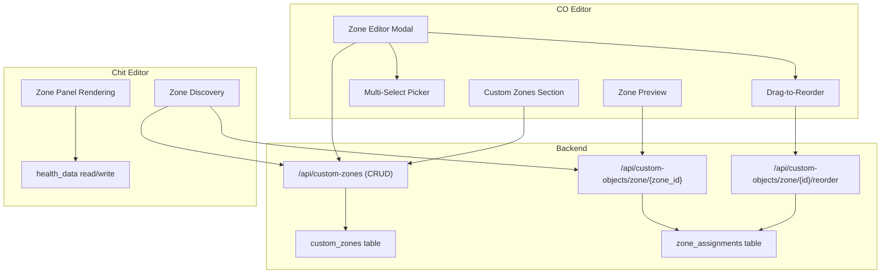
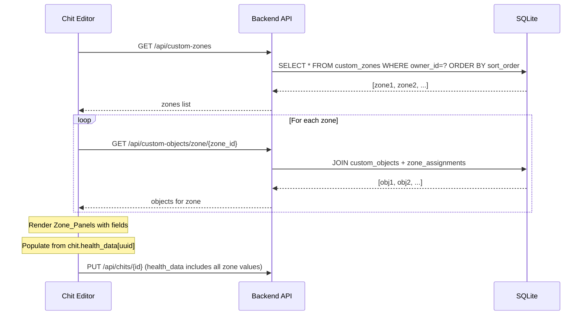

# Design Document: Custom Zones

## Overview

Custom Zones extends the existing Custom Objects system to let users create named groupings of Custom Objects that render as additional collapsible zones in the chit editor. The architecture mirrors the existing `indicators_zone` pattern — a metadata table defines zones, `zone_assignments` links objects to zones, and the chit editor dynamically discovers and renders them using the same UUID-keyed `health_data` storage.

The feature touches three layers:
1. **Backend** — New `custom_zones` table + CRUD API endpoints + bulk reorder endpoint
2. **CO Editor** — Zone management UI (list, create, edit, reorder, delete, preview)
3. **Chit Editor** — Dynamic zone discovery and rendering via a new `editor-custom-zones.js` module

All rendering logic reuses the pure functions already in `editor-health.js` (`_evaluateConditionalDisplay`, `_getUnitLabel`, `_getRangeHighlightClass`, `_renderIndicatorField`). The chit editor renders custom zones as single-column grid items in the `.main-zones-grid`, letting CSS grid auto-placement alternate them left/right.

## Architecture



## Components and Interfaces

### Backend Components

#### 1. Migration: `migrate_create_custom_zones_table()`
- Location: `src/backend/migrations.py`
- Creates the `custom_zones` table with idempotent `CREATE TABLE IF NOT EXISTS`
- Called at startup from `main.py` alongside existing migrations

#### 2. Route Module: `src/backend/routes/custom_zones.py`
- New router registered in `main.py`
- Endpoints:
  - `GET /api/custom-zones` — List all zones for user, ordered by sort_order
  - `POST /api/custom-zones` — Create zone (accepts `name`, generates `zone_id`)
  - `PUT /api/custom-zones/{zone_id}` — Update name and/or sort_order
  - `DELETE /api/custom-zones/{zone_id}` — Delete zone + cascade delete zone_assignments

#### 3. Bulk Reorder Endpoint (added to existing `custom_objects.py`)
- `PUT /api/custom-objects/zone/{zone_id}/reorder`
- Accepts `{ "object_ids": ["uuid1", "uuid2", ...] }`
- Updates sort_order sequentially (1, 2, 3, ...)

### Frontend Components — CO Editor

#### 4. Custom Zones Section (`custom-objects-editor.js` additions)
- Renders above the filter bar
- Lists zones with name, object count, edit/delete buttons
- "Create Custom Zone" button opens creation modal
- Drag-to-reorder zones in the listing (reuses `shared-touch.js` pattern)

#### 5. Zone Editor Modal
- Editable zone name field at top
- Assigned objects list (3-column grid, grouped by sub_type)
- "Add Objects" button opens Multi-Select Picker
- Drag-to-reorder within the assigned list
- "Preview" button renders a live preview panel
- Remove button (×) on each assigned object

#### 6. Multi-Select Picker
- Reuses the same grouped/searchable pattern from `_showAddIndicatorPicker` in `editor-health.js`
- Filters by name, type, sub_type
- Checkboxes for multi-select
- "Add Selected" confirms and creates zone_assignments

### Frontend Components — Chit Editor

#### 7. New Module: `src/frontend/js/editor/editor-custom-zones.js`
- Loaded after `editor-health.js`, before `editor-init.js`
- On chit load:
  1. Fetches `GET /api/custom-zones` to discover user's zones
  2. For each zone, fetches `GET /api/custom-objects/zone/{zone_id}`
  3. Renders collapsible Zone_Panels using shared rendering functions
- Exposes `_gatherCustomZoneData()` for the save flow to collect values

#### 8. Integration with `editor-save.js`
- The save flow calls `_gatherCustomZoneData()` which returns a UUID-keyed object
- Merged with `window._healthData` (indicators zone values) into the final `health_data` payload

## Data Models

### `custom_zones` Table Schema

| Column | Type | Constraints | Description |
|--------|------|-------------|-------------|
| id | TEXT | PRIMARY KEY | UUID, auto-generated |
| zone_id | TEXT | NOT NULL | Slugified identifier (e.g., `cz_vitals`) |
| name | TEXT | NOT NULL | Display name (e.g., "Vitals") |
| sort_order | INTEGER | DEFAULT 0 | Ordering in zone list |
| owner_id | TEXT | NOT NULL | User who owns this zone |
| created_datetime | TEXT | NOT NULL | ISO 8601 timestamp |

**Unique constraint:** `(zone_id, owner_id)` — one zone_id per user.

### Zone_id Generation

The `zone_id` is derived from the user-provided name:
1. Lowercase the name
2. Replace non-alphanumeric characters with underscores
3. Collapse consecutive underscores
4. Strip leading/trailing underscores
5. Prefix with `cz_`

Example: `"My Vitals!"` → `cz_my_vitals`

### API Request/Response Models

```python
# Pydantic models (added to models.py)

class CustomZoneCreate(BaseModel):
    name: str

class CustomZoneUpdate(BaseModel):
    name: Optional[str] = None
    sort_order: Optional[int] = None

class BulkReorderRequest(BaseModel):
    object_ids: List[str]
```

### API Responses

**GET /api/custom-zones**
```json
[
  {
    "id": "uuid",
    "zone_id": "cz_vitals",
    "name": "Vitals",
    "sort_order": 1,
    "owner_id": "default_user",
    "created_datetime": "2025-01-01T00:00:00Z",
    "object_count": 5
  }
]
```

**POST /api/custom-zones** (request: `{"name": "Vitals"}`)
```json
{
  "id": "uuid",
  "zone_id": "cz_vitals",
  "name": "Vitals",
  "sort_order": 0,
  "owner_id": "default_user",
  "created_datetime": "2025-01-01T00:00:00Z",
  "object_count": 0
}
```

**PUT /api/custom-objects/zone/{zone_id}/reorder** (request: `{"object_ids": ["id1", "id2", "id3"]}`)
```json
{"detail": "Reorder complete", "updated": 3}
```

### Chit Editor Data Flow



### Grid Placement Strategy

Custom zones are rendered as standard grid items (not spanning 2 columns) inside `.main-zones-grid`. The existing CSS grid uses `grid-template-columns: 1fr 1fr`, so single-column items auto-place left-then-right:

```
| Built-in Col 1    | Built-in Col 2    |
| (Dates, Tags...)  | (People, Notes...)| 
| Health Indicators  | (spans 2 cols)    |
| Custom Zone 1     | Custom Zone 2     |
| Custom Zone 3     | Custom Zone 4     |
```

Each custom zone panel is a `.zone-container` (same as existing zones) without `grid-column: span 2`, so CSS grid auto-placement handles the alternation naturally.

On mobile (≤768px), the existing media query collapses the grid to `grid-template-columns: 1fr`, stacking everything vertically.

## Correctness Properties

*A property is a characteristic or behavior that should hold true across all valid executions of a system — essentially, a formal statement about what the system should do. Properties serve as the bridge between human-readable specifications and machine-verifiable correctness guarantees.*

### Property 1: Zone_id Slugification

*For any* valid zone name (non-empty, non-whitespace string), the generated zone_id SHALL be the name lowercased, with non-alphanumeric characters replaced by underscores, consecutive underscores collapsed, leading/trailing underscores stripped, and prefixed with `cz_`.

**Validates: Requirements 2.3, 13.3**

### Property 2: Zone Ordering

*For any* set of custom zones with distinct sort_order values, the API response from GET /api/custom-zones and the rendered zone panels in both the CO Editor and Chit Editor SHALL appear in ascending sort_order.

**Validates: Requirements 1.4, 7.10, 12.3, 13.2**

### Property 3: Object Grouping and Ordering Within Zones

*For any* zone with assigned objects, the rendered display SHALL group objects by sub_type (groups sorted alphabetically) and sort objects within each group by their zone_assignment sort_order.

**Validates: Requirements 3.1, 7.4**

### Property 4: Value_type to Input Type Mapping

*For any* Custom Object, the rendered input field type SHALL be: numeric (`<input type="number">`) for value_type "integer" or "decimal", checkbox (`<input type="checkbox">`) for "boolean", and text (`<input type="text">`) for "string".

**Validates: Requirements 6.3, 7.5**

### Property 5: Range Highlighting

*For any* numeric value and range bounds (range_min, range_max), the CSS class applied SHALL be `indicator-range-high` when value > range_max, `indicator-range-low` when value < range_min, and empty string otherwise.

**Validates: Requirements 6.4, 7.7**

### Property 6: Conditional Display Evaluation

*For any* conditional_display rule `{"setting": S, "equals": V}` and user settings object, the field SHALL be shown if and only if `settings[S] === V`. A null/absent rule always shows the field.

**Validates: Requirements 7.6**

### Property 7: Unit Label Selection

*For any* Custom Object with `units` and `metric_units` fields, and a user unit_system setting, the displayed label SHALL be `metric_units` when unit_system is "metric" and metric_units is non-empty, otherwise `units`.

**Validates: Requirements 7.8**

### Property 8: Health Data Round-Trip

*For any* set of Custom Object UUIDs and their associated values, storing them in health_data (UUID-keyed) and then loading the chit SHALL populate each field with its original stored value.

**Validates: Requirements 9.1, 9.2, 9.4**

### Property 9: Cascading Zone Deletion

*For any* custom zone with N zone_assignments, deleting the zone via DELETE /api/custom-zones/{zone_id} SHALL remove the zone record AND all N associated zone_assignments, while leaving health_data on chits unchanged.

**Validates: Requirements 10.2, 10.4, 13.5**

### Property 10: Rename Preserves Zone_id

*For any* custom zone, updating the name via PUT /api/custom-zones/{zone_id} SHALL change only the `name` field; the `zone_id` SHALL remain unchanged.

**Validates: Requirements 11.3**

### Property 11: Bulk Reorder Sequential Assignment

*For any* ordered list of N custom_object_ids sent to PUT /api/custom-objects/zone/{zone_id}/reorder, the resulting sort_order values in zone_assignments SHALL be 1, 2, 3, ..., N respectively for each ID that has an existing assignment. IDs without assignments are skipped without error.

**Validates: Requirements 14.1, 14.2, 14.3**

## Error Handling

### Backend Errors

| Scenario | HTTP Status | Response |
|----------|-------------|----------|
| Create zone with empty name | 422 | `{"detail": "Zone name is required"}` |
| Create zone with duplicate zone_id | 409 | `{"detail": "A zone with this identifier already exists"}` |
| Update/delete non-existent zone | 404 | `{"detail": "Zone not found"}` |
| Reorder with empty object_ids list | 400 | `{"detail": "object_ids list is required"}` |
| Reorder with non-existent assignments | 200 | Skips missing, processes rest |
| Database error | 500 | `{"detail": "Internal server error"}` |

### Frontend Error Handling

- **Network failures**: Show `cwocToast('Failed to load/save zones', 'error')` and retain current UI state
- **Validation errors**: Inline error messages in modals (red text below input)
- **Empty states**: Friendly message ("No custom zones yet — create one to get started")
- **Stale data**: After any mutation (create/update/delete), re-fetch the zone list to ensure consistency

## Testing Strategy

### Unit Tests (Example-Based)

- Zone creation modal opens with correct elements
- Empty name validation prevents creation
- Duplicate zone_id shows error
- Delete confirmation dialog appears
- Preview renders correct layout
- Mobile responsive behavior (single column)

### Property-Based Tests

Property-based testing is appropriate for this feature because several core functions are pure with clear input/output behavior (slugification, range highlighting, conditional display, unit label selection) and the data storage follows a round-trip pattern.

**Library**: Python `unittest` with manual randomized inputs (no external PBT library needed given project constraints — no installs allowed)

**Configuration**: Minimum 100 iterations per property test

**Tag format**: `Feature: custom-zones, Property {number}: {property_text}`

Each correctness property above maps to a single property-based test that generates random inputs and verifies the universal property holds.

Key properties to test:
- **Property 1** (slugification): Generate random Unicode strings, verify output format
- **Property 5** (range highlighting): Generate random (value, min, max) tuples, verify CSS class
- **Property 6** (conditional display): Generate random rules and settings, verify boolean result
- **Property 7** (unit label): Generate random objects and unit systems, verify label selection
- **Property 8** (round-trip): Generate random UUID→value maps, verify store/load identity
- **Property 11** (reorder): Generate random ID lists, verify sequential sort_order assignment

### Integration Tests

- Full CRUD lifecycle: create zone → add objects → reorder → rename → delete
- Chit editor loads zones and renders panels
- Save flow merges custom zone data with indicators data
- Cascading delete removes assignments but preserves health_data

### Tests Are Optional

Per project rules, tests are optional and never a blocker for completing the feature. The property-based tests above serve as a specification of correctness that can be implemented if desired.
