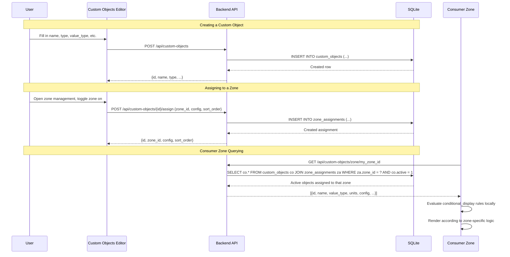

# Design Document: Custom Objects

## Overview

The Custom Objects system introduces a generic, extensible registry for trackable data entities in CWOC. It stores typed object *definitions* in a registry and lets consumers (zones, views, pages) independently configure which objects they display via zone assignments.

The architecture follows a registry + zone assignment pattern:
- **Registry** — stores object definitions (name, type, value_type, units, range, etc.)
- **Zone Assignments** — separate table mapping objects to consumer zones with per-zone config (sort_order, zone-specific flags)
- **Editor Page** — dedicated management UI for browsing, creating, editing, and assigning objects

The registry is fully generic — it has no knowledge of any specific consumer zone. Consumers query the registry by their zone identifier and handle their own rendering, display logic, and data storage.

## Architecture

```mermaid
graph TD
    subgraph "Data Layer (SQLite)"
        CO[custom_objects table]
        ZA[zone_assignments table]
    end

    subgraph "Backend API"
        API[/api/custom-objects/*]
    end

    subgraph "Frontend"
        ED[Custom Objects Editor Page]
        C1[Consumer Zone A]
        C2[Consumer Zone B]
        C3[Consumer Zone N...]
    end

    API --> CO
    API --> ZA
    ED --> API
    C1 --> API
    C2 --> API
    C3 --> API
```

**Key design decisions:**
1. **Registry is zone-agnostic** — the `custom_objects` table has no knowledge of where objects are displayed. Zone preferences live entirely in `zone_assignments`.
2. **Types are free-text** — no enum constraint on the `type` field. New types are introduced by simply using a new string value.
3. **Zone identifiers are free-text** — new consumers register themselves by simply using a new zone_id string. No schema changes needed.
4. **Conditional display is stored on the object, evaluated by consumers** — the API returns the rule; the consuming zone/page evaluates it against cached user settings.
5. **The registry does not store readings** — readings are the responsibility of the consuming zone. The registry only defines *what* can be tracked, not *where* or *how* values are stored.

## Components and Interfaces

### Backend Components

#### 1. Database Tables

**`custom_objects` table** — stores object definitions:

| Column | Type | Notes |
|--------|------|-------|
| id | TEXT PRIMARY KEY | UUID |
| type | TEXT NOT NULL | Free-text (e.g., "Symptom", "Vital", "Measurement", "Activity", or any user-defined string) |
| sub_type | TEXT | Optional free-text |
| category | TEXT | Optional free-text (e.g., "Illnesses", "Vitals", "Body", or any user-defined string) |
| name | TEXT NOT NULL | Display name |
| value_type | TEXT NOT NULL | One of: "integer", "decimal", "boolean", "string" |
| units | TEXT | Primary units (e.g., "bpm", "lbs", "°F") |
| metric_units | TEXT | Metric units (e.g., "bpm", "kg", "°C") |
| range_min | REAL | Optional acceptable range minimum |
| range_max | REAL | Optional acceptable range maximum |
| active | INTEGER DEFAULT 1 | 1 = active, 0 = inactive |
| deleted | INTEGER DEFAULT 0 | Soft-delete flag |
| sort_order | INTEGER DEFAULT 0 | Global sort order |
| is_standard | INTEGER DEFAULT 0 | 1 = seeded/standard, 0 = user-created |
| conditional_display | TEXT | JSON rule (e.g., `{"setting": "sex", "equals": "Woman"}`) |
| owner_id | TEXT | User who owns this object |
| created_datetime | TEXT | ISO 8601 |
| modified_datetime | TEXT | ISO 8601 |

**Unique constraint:** `UNIQUE(type, category, name, owner_id)` — enforces name uniqueness within type+category per user.

**`zone_assignments` table** — maps objects to consumer zones:

| Column | Type | Notes |
|--------|------|-------|
| id | TEXT PRIMARY KEY | UUID |
| custom_object_id | TEXT NOT NULL | FK → custom_objects.id |
| zone_id | TEXT NOT NULL | Free-text zone identifier (any string — consumers define their own) |
| config | TEXT | JSON blob for zone-specific configuration (each zone defines its own schema) |
| sort_order | INTEGER DEFAULT 0 | Display order within the zone |
| owner_id | TEXT | User who owns this assignment |

**Unique constraint:** `UNIQUE(custom_object_id, zone_id, owner_id)` — prevents duplicate assignments.

**Note on zone-specific config:** The `config` JSON field allows each consumer zone to store its own flags and preferences without polluting the generic schema. For example, one zone might store `{"is_default": true}` while another stores `{"chart_type": "line"}`. The registry API passes this through opaquely — it does not interpret or validate the contents.

#### 2. Route Module: `src/backend/routes/custom_objects.py`

New APIRouter with endpoints:

| Method | Path | Description |
|--------|------|-------------|
| GET | `/api/custom-objects` | List all objects (optional `?type=` and `?category=` filters) |
| POST | `/api/custom-objects` | Create new object |
| PUT | `/api/custom-objects/{id}` | Update object |
| DELETE | `/api/custom-objects/{id}` | Soft-delete (active=0, deleted=1) |
| POST | `/api/custom-objects/{id}/restore` | Restore soft-deleted standard object |
| GET | `/api/custom-objects/zone/{zone_id}` | Get active objects assigned to a zone |
| POST | `/api/custom-objects/{id}/assign` | Create zone assignment |
| PUT | `/api/custom-objects/{id}/assign/{zone_id}` | Update zone assignment config |
| DELETE | `/api/custom-objects/{id}/assign/{zone_id}` | Remove zone assignment |

#### 3. Pydantic Models (added to `models.py`)

```python
class CustomObjectCreate(BaseModel):
    type: str
    sub_type: Optional[str] = None
    category: Optional[str] = None
    name: str
    value_type: str  # "integer", "decimal", "boolean", "string"
    units: Optional[str] = None
    metric_units: Optional[str] = None
    range_min: Optional[float] = None
    range_max: Optional[float] = None
    conditional_display: Optional[Dict[str, Any]] = None

class CustomObjectUpdate(BaseModel):
    name: Optional[str] = None
    sub_type: Optional[str] = None
    category: Optional[str] = None
    units: Optional[str] = None
    metric_units: Optional[str] = None
    range_min: Optional[float] = None
    range_max: Optional[float] = None
    active: Optional[bool] = None
    sort_order: Optional[int] = None
    conditional_display: Optional[Dict[str, Any]] = None

class ZoneAssignmentCreate(BaseModel):
    zone_id: str
    config: Optional[Dict[str, Any]] = None
    sort_order: Optional[int] = 0

class ZoneAssignmentUpdate(BaseModel):
    config: Optional[Dict[str, Any]] = None
    sort_order: Optional[int] = None
```

#### 4. Migration Strategy

Added to `migrations.py` as a new function called at startup:

**`migrate_create_custom_objects_tables()`** — creates `custom_objects` and `zone_assignments` tables if they don't exist.

This migration only creates the generic infrastructure. Consumer-specific migrations (e.g., migrating legacy data into the registry, creating seed data, setting up zone assignments) are the responsibility of each consumer's own spec/implementation.

#### 5. Seed Data Function

**`seed_custom_objects(owner_id)`** — called after table creation, seeds the standard library for a user if no custom_objects exist for that user yet. Includes:

- **Illnesses** (10 items): type="Symptom", category="Illnesses", value_type="boolean"
- **Injuries** (10 items): type="Symptom", category="Injuries", value_type="boolean"
- **Allergies** (10 items): type="Symptom", category="Allergies", value_type="boolean"
- **Vitals** (5 items): type="Vital", category="Vitals" — with units and ranges
- **Body** (3 items): type="Measurement", category="Body" — with units
- **Activity** (2 items): type="Activity", category="Activity" — with units

All seeded entries have `is_standard = 1`. The seed function does NOT create any Zone_Assignments — that is the responsibility of each consumer zone's setup/migration.

### Frontend Components

#### 1. Custom Objects Editor Page

**Files:**
- `src/frontend/html/custom-objects-editor.html` — page structure
- `src/frontend/js/pages/custom-objects-editor.js` — page logic

**Structure:** Follows the secondary page pattern (`shared-page.css`, `shared-page.js`, `data-page-title`). Layout:

```
┌─────────────────────────────────────────────┐
│ Header (auto-injected by shared-page.js)    │
├─────────────────────────────────────────────┤
│ Filter Bar: [All Types ▼] [Search...]       │
├─────────────────────────────────────────────┤
│ + Create Custom Object                      │
├─────────────────────────────────────────────┤
│ ┌─ Type: Vital ─────────────────────────┐   │
│ │ ❤️ Heart Rate  [Zone Badges] [⚙️]     │   │
│ │ 🩸 Blood Pressure [Zone Badges] [⚙️]  │   │
│ │ ...                                    │   │
│ └────────────────────────────────────────┘   │
│ ┌─ Type: Symptom ───────────────────────┐   │
│ │ Cough [Zone Badges] [⚙️]             │   │
│ │ ...                                    │   │
│ └────────────────────────────────────────┘   │
├─────────────────────────────────────────────┤
│ Footer (auto-injected)                      │
└─────────────────────────────────────────────┘
```

Each object row shows:
- Name (with conditional display note if applicable)
- Zone assignment badges — small labels showing which zones this object is assigned to (derived from zone_assignments query)
- Active/inactive toggle
- Edit button (opens inline edit or modal for object properties)
- Zone management button (opens modal to add/remove zone assignments and configure per-zone settings)
- Delete button (soft-delete)

**Zone Assignment Modal:**
When the user clicks the zone management button on an object, a modal appears showing:
- List of all known zone identifiers (derived from existing assignments across all objects)
- Toggle to assign/unassign the object to each zone
- Per-zone config editor (JSON or structured fields depending on zone — the editor shows the raw config for unknown zones, structured fields for known zones)
- Sort order field per zone

**Create/Edit Modal:**
- Name (required)
- Type (free-text with autocomplete from existing types)
- Sub-type (optional free-text)
- Category (optional free-text with autocomplete from existing categories)
- Value type (dropdown: integer, decimal, boolean, string)
- Units (shown only for integer/decimal)
- Metric units (shown only for integer/decimal)
- Range min/max (shown only for integer/decimal)
- Conditional display rule (optional, advanced section)

### Data Flow



## Data Models

### Custom Object Definition (API Response)

```json
{
    "id": "550e8400-e29b-41d4-a716-446655440000",
    "type": "Vital",
    "sub_type": null,
    "category": "Vitals",
    "name": "Heart Rate",
    "value_type": "integer",
    "units": "bpm",
    "metric_units": "bpm",
    "range_min": 60,
    "range_max": 100,
    "active": true,
    "deleted": false,
    "sort_order": 1,
    "is_standard": true,
    "conditional_display": null,
    "zone_assignments": [
        {"zone_id": "indicators_zone", "config": {"is_default": true}, "sort_order": 1},
        {"zone_id": "graphs", "config": {"chart_type": "line"}, "sort_order": 1}
    ]
}
```

### Zone Assignment (API Response)

```json
{
    "id": "assignment-uuid",
    "custom_object_id": "550e8400-e29b-41d4-a716-446655440000",
    "zone_id": "some_zone",
    "config": {"is_default": true},
    "sort_order": 1
}
```

### Conditional Display Rule Format

```json
{
    "setting": "sex",
    "equals": "Woman"
}
```

Evaluation (performed by consumers, not the registry): `userSettings[rule.setting] === rule.equals` → show if true, hide if false.

## Correctness Properties

### Property 1: Custom Object Serialization Round-Trip

*For any* valid Custom_Object definition with all fields populated, serializing it to the database format and deserializing it back SHALL produce an equivalent object with all fields preserved.

**Validates: Requirements 1.1**

### Property 2: Value Type Determines Valid Fields

*For any* Custom_Object, if its value_type is "boolean" or "string", then units, metric_units, range_min, and range_max SHALL all be null/empty after storage. If its value_type is "integer" or "decimal", then units and range fields SHALL be preserved as provided.

**Validates: Requirements 1.2, 1.3, 1.4**

### Property 3: Type Field Accepts Any String

*For any* non-empty string value used as the type field when creating a Custom_Object, the system SHALL accept and store it without validation error.

**Validates: Requirements 1.7, 13.2**

### Property 4: Value Type Validation

*For any* string that is NOT one of "integer", "decimal", "boolean", or "string", attempting to create a Custom_Object with that value_type SHALL be rejected. For any of the four valid strings, creation SHALL succeed.

**Validates: Requirements 1.8**

### Property 5: Name Uniqueness Within Type and Category

*For any* two Custom_Objects with the same type, category, and owner, if they have the same name, the system SHALL reject the second creation with a 409 Conflict response.

**Validates: Requirements 1.5, 12.9**

### Property 6: Inactive Objects Hidden From Zone Queries

*For any* Custom_Object that has active=false, querying any zone via GET `/api/custom-objects/zone/{zone_id}` SHALL never include that object in the results, regardless of existing Zone_Assignments.

**Validates: Requirements 2.5**

### Property 7: Zone Assignment Config Passthrough

*For any* JSON object stored in a Zone_Assignment's config field, querying that zone SHALL return the config exactly as stored — the registry does not interpret, validate, or modify zone-specific config.

**Validates: Requirements 13.3, 13.6**

### Property 8: Zone Identifier Accepts Any String

*For any* non-empty string used as a zone_id when creating a Zone_Assignment, the system SHALL accept and store it without validation error. No predefined list of valid zones exists.

**Validates: Requirements 13.3**

### Property 9: Multi-Zone Assignment

*For any* active Custom_Object and any set of distinct zone identifier strings, creating Zone_Assignments for all of them SHALL succeed, and querying each zone SHALL include that object.

**Validates: Requirements 2.3, 13.3**

### Property 10: Soft Delete Preserves Data

*For any* Custom_Object that is soft-deleted, its data SHALL remain in the database (deleted=1, active=0), and if it is a standard object, it SHALL be restorable via the restore endpoint.

**Validates: Requirements 4.8, 12.4, 12.5**

### Property 11: Conditional Display Rule Storage

*For any* valid JSON object stored as a conditional_display rule, the registry SHALL store and return it exactly as provided. The registry does NOT evaluate the rule — that is the consumer's responsibility.

**Validates: Requirements 6.1, 13.6**

## Error Handling

### API Error Responses

| Scenario | Status Code | Response |
|----------|-------------|----------|
| Duplicate name within type+category | 409 | `{"detail": "A custom object with this name already exists in type '{type}' category '{category}'"}` |
| Invalid value_type | 422 | `{"detail": "value_type must be one of: integer, decimal, boolean, string"}` |
| Object not found | 404 | `{"detail": "Custom object {id} not found"}` |
| Assignment already exists | 409 | `{"detail": "Object is already assigned to zone '{zone_id}'"}` |
| Assignment not found | 404 | `{"detail": "Zone assignment not found"}` |
| Restore non-standard object | 400 | `{"detail": "Only standard objects can be restored"}` |

### Frontend Error Handling

- API fetch failures show a toast notification (using existing CWOC toast pattern)
- Invalid form inputs are rejected client-side with inline validation messages
- Network errors during zone assignment changes are retried once, then shown as toast errors

## Testing Strategy

### Property-Based Testing

The core logic involves data transformations (serialization, uniqueness enforcement, zone filtering) that have clear universal properties.

**Configuration:** Minimum 100 iterations per property test.

**Tag format:** `Feature: custom_objects, Property {number}: {property_text}`

### Unit Tests (Example-Based)

- Seed data verification: confirm all expected standard objects exist after seeding
- API CRUD: create, read, update, soft-delete, restore
- Zone assignment: create, list by zone, update config, remove
- Uniqueness enforcement: duplicate name rejection
- Inactive filtering: deactivated objects excluded from zone queries

### Tests Are Optional

Per project rules, all tests are optional and never block feature completion.
