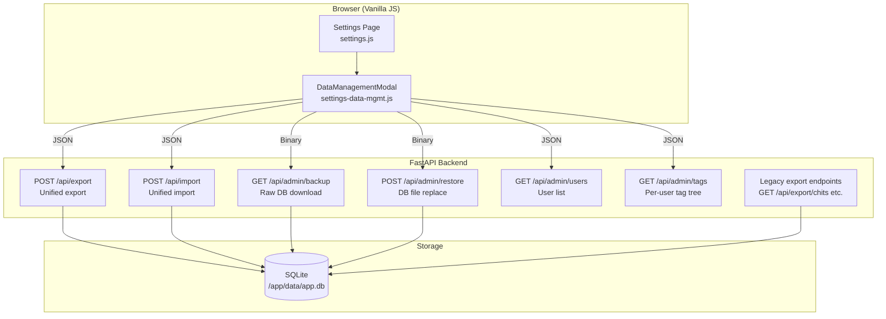
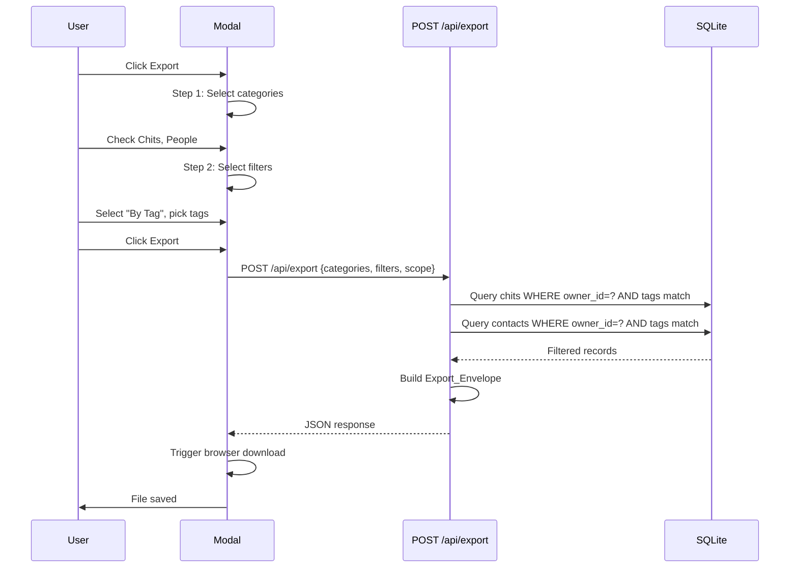
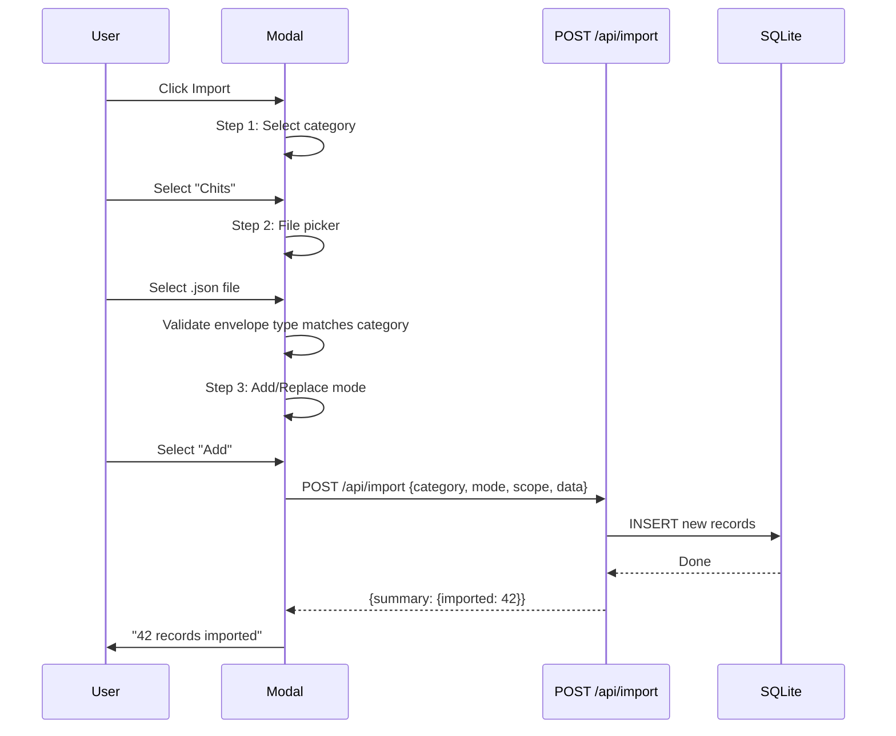
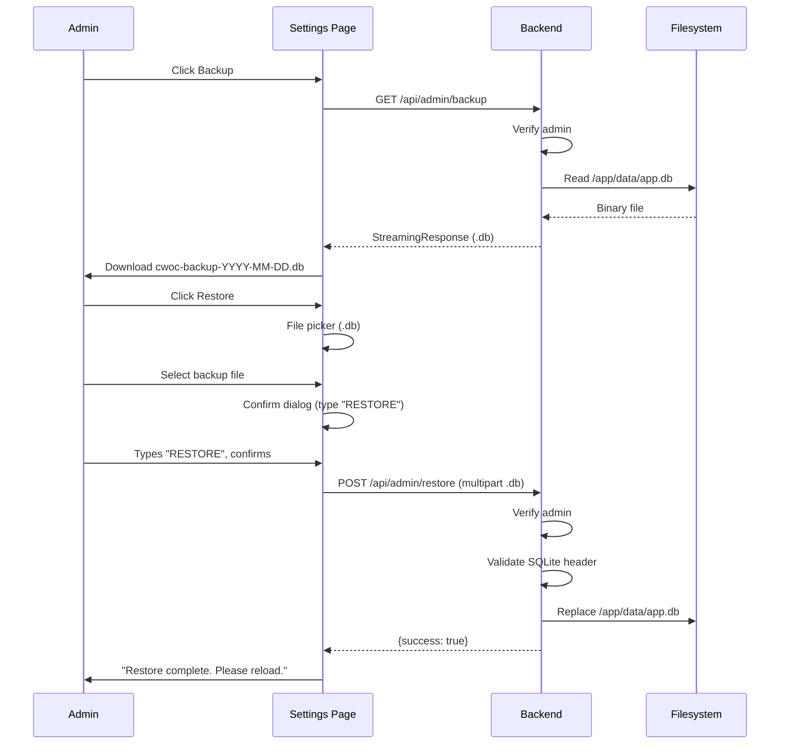

# Design Document — Data Management Overhaul

## Overview

This design replaces the flat export/import buttons in CWOC Settings with a modal-driven, two-tier data management system. The per-user tier (visible to all users) provides category selection and tag-based filtering scoped to the current user's data. The admin tier (visible only to admins in the Administration section) adds cross-user exports with owner and tag filters, raw SQLite backup, and full database restore.

The implementation reuses existing patterns: the `_build_export_envelope` helper for envelope construction, `serialize_json_field`/`deserialize_json_field` for JSON column handling, and the existing `shared-page.css` parchment theme for modal styling. New backend endpoints consolidate the six legacy export/import routes into two unified endpoints (`POST /api/export`, `POST /api/import`) plus two admin-only endpoints (`GET /api/admin/backup`, `POST /api/admin/restore`).

### Key Design Decisions

1. **Unified export/import endpoints** — Instead of separate routes per data type (`/api/export/chits`, `/api/export/userdata`, `/api/export/all`), a single `POST /api/export` accepts a JSON body specifying categories, filters, and scope. This simplifies the frontend modal flow and makes filter combinations straightforward. Legacy endpoints remain functional for backward compatibility.

2. **Modal as a multi-step wizard** — Both export and import modals use a step-based flow (category → filter → execute) rather than cramming everything into one screen. Each step validates before advancing. This keeps the UI clean on mobile.

3. **Shared modal component** — A single `DataManagementModal` class (vanilla JS, no Shadow DOM) handles both per-user and admin flows. The `scope` parameter ("user" or "admin") controls which filter options and confirmation dialogs appear.

4. **OR filter semantics** — When multiple tags or owners are selected, the backend returns the union. This matches user expectations ("show me everything tagged Work OR Personal") and is simpler to implement than AND logic with exclusions.

5. **Backup/restore as file operations** — Backup streams the raw `.db` file. Restore validates the uploaded file is a valid SQLite database before replacing. No schema migration is attempted on restore — the assumption is the backup came from a compatible CWOC version.

6. **No new dependencies** — All backend work uses Python stdlib (`sqlite3`, `json`, `shutil`, `os`, `tempfile`). Frontend is vanilla JS with existing CSS patterns.

---

## Architecture

### System Architecture



### Export Flow



### Import Flow



### Backup/Restore Flow



---

## Components and Interfaces

### Backend Components

#### 1. `src/backend/routes/data_management.py` — New Route Module

New FastAPI router module for the unified data management endpoints.

**Endpoints:**

| Method | Path | Description |
|--------|------|-------------|
| `POST` | `/api/export` | Unified export with category/filter/scope selection |
| `POST` | `/api/import` | Unified import with category/mode/scope |
| `GET` | `/api/admin/backup` | Stream raw SQLite `.db` file (admin only) |
| `POST` | `/api/admin/restore` | Accept `.db` upload and replace database (admin only) |
| `GET` | `/api/admin/users` | List all users with id, display_name, username (admin only) |
| `GET` | `/api/admin/tags` | Tags grouped by user (admin only) |

**Internal helpers:**

- `_require_admin(request) -> str` — Verify `request.state.is_admin`, raise 403 if not. Returns `user_id`.
- `_export_chits(cursor, owner_ids, tag_filter) -> list` — Query and deserialize chits with optional owner/tag filtering.
- `_export_contacts(cursor, owner_ids, tag_filter) -> list` — Query and deserialize contacts with optional owner/tag filtering.
- `_export_settings(cursor, owner_ids) -> list` — Query and deserialize settings with optional owner filtering.
- `_import_chits(cursor, records, user_id, mode) -> dict` — Insert/replace chit records.
- `_import_contacts(cursor, records, user_id, mode) -> dict` — Insert/replace contact records.
- `_import_settings(cursor, records, user_id, mode) -> dict` — Insert/replace settings records.
- `_validate_sqlite_file(file_path) -> bool` — Check SQLite magic bytes and attempt to open.
- `_build_new_export_envelope(categories, filters_applied, data) -> dict` — Build the new envelope format with categories and filters_applied fields.

**Registration in `main.py`:**
```python
from src.backend.routes.data_management import router as data_mgmt_router
app.include_router(data_mgmt_router)
```

#### 2. Existing Route Modules (Unchanged)

The legacy endpoints in `routes/chits.py` (`GET /api/export/chits`, `GET /api/export/userdata`, `GET /api/export/all`, `POST /api/import/chits`, `POST /api/import/userdata`, `POST /api/import/all`) remain functional for backward compatibility. They are no longer referenced by the UI.

### Frontend Components

#### 1. `src/frontend/js/pages/settings-data-mgmt.js` — Data Management Modal Logic

New JS file loaded by `settings.html` after `settings.js`. Contains the modal wizard logic for both per-user and admin flows.

**Functions:**

- `openExportModal(scope)` — Open the export modal. `scope` is "user" or "admin".
- `openImportModal(scope)` — Open the import modal.
- `_renderCategoryStep(modal, scope)` — Render category checkboxes (export) or radio buttons (import).
- `_renderFilterStep(modal, scope, categories)` — Render filter options. Admin scope shows "All", "By Owner", "By Tag". User scope shows "All", "By Tag".
- `_renderOwnerPicker(container)` — Fetch `/api/admin/users` and render multi-select checkboxes.
- `_renderTagPicker(container, scope)` — For user scope: fetch user's tags from cached settings. For admin scope: fetch `/api/admin/tags` and render as a tree grouped by user.
- `_executeExport(scope, categories, filters)` — POST to `/api/export`, trigger download.
- `_executeImport(scope, category, mode, fileData)` — POST to `/api/import`, show summary.
- `_triggerBackup()` — Fetch `/api/admin/backup`, trigger `.db` download.
- `_triggerRestore()` — File picker → confirm dialog (type "RESTORE") → POST to `/api/admin/restore`.
- `_validateExportEnvelope(data, expectedCategory)` — Client-side validation of uploaded JSON.

#### 2. `src/frontend/html/settings.html` — HTML Changes

**Per-user Data Management section** (replaces existing flat buttons):
```html
<div class="setting-group">
    <h3>📦 Data Management</h3>
    <div style="display:flex;gap:8px;flex-wrap:wrap;margin-bottom:14px;">
        <button onclick="openExportModal('user')" class="standard-button" style="flex:1;">📄 Export</button>
        <button onclick="openImportModal('user')" class="standard-button" style="flex:1;">📥 Import</button>
    </div>
    <label class="setting-subheader">📅 Calendar Import</label>
    <p class="setting-hint">Import events and tasks from Google Calendar, Apple Calendar, or Outlook.</p>
    <div style="display:flex;gap:8px;flex-wrap:wrap;margin-bottom:14px;">
        <button id="icsImportBtn" onclick="triggerIcsImport()" class="standard-button" style="flex:1;">📅 Import Calendar (.ics)</button>
        <input type="file" id="icsImportFile" accept=".ics" style="display:none" />
    </div>
</div>
```

**Admin Data Management section** (new, inside `admin-section` div):
```html
<div class="setting-group">
    <h3>📦 Admin Data Management</h3>
    <div style="display:flex;gap:8px;flex-wrap:wrap;margin-bottom:14px;">
        <button onclick="openExportModal('admin')" class="standard-button" style="flex:1;">📄 Export</button>
        <button onclick="openImportModal('admin')" class="standard-button" style="flex:1;">📥 Import</button>
    </div>
    <div style="display:flex;gap:8px;flex-wrap:wrap;margin-bottom:14px;">
        <button onclick="_triggerBackup()" class="standard-button" style="flex:1;">💾 Backup</button>
        <button onclick="_triggerRestore()" class="standard-button" style="flex:1;">🔄 Restore</button>
    </div>
</div>
```

**Modal template** (added at bottom of `settings.html`):
```html
<template id="tmpl-data-mgmt-modal">
    <div class="cwoc-modal-overlay" style="display:none;">
        <div class="cwoc-modal data-mgmt-modal">
            <div class="data-mgmt-header">
                <h3 class="data-mgmt-title"></h3>
                <button class="data-mgmt-close" aria-label="Close">&times;</button>
            </div>
            <div class="data-mgmt-body"></div>
            <div class="data-mgmt-footer">
                <button class="standard-button data-mgmt-back" style="display:none;">← Back</button>
                <div style="flex:1;"></div>
                <button class="standard-button data-mgmt-cancel">Cancel</button>
                <button class="standard-button data-mgmt-next" disabled>Next →</button>
            </div>
        </div>
    </div>
</template>
```

#### 3. CSS Additions

Modal styles added to `src/frontend/css/shared/shared-page.css` (since the modal pattern is reusable):

- `.data-mgmt-modal` — Modal container with max-width, parchment background, border-radius
- `.data-mgmt-header` — Title bar with close button
- `.data-mgmt-body` — Scrollable content area
- `.data-mgmt-footer` — Button row with Back/Cancel/Next
- `.data-mgmt-category-list` — Checkbox/radio list for categories
- `.data-mgmt-filter-section` — Filter option containers
- `.data-mgmt-tag-tree` — Admin tag tree with collapsible user nodes
- `.data-mgmt-owner-list` — Owner picker checkboxes
- Responsive: full-width modal on screens < 600px

---

## Data Models

### New Pydantic Models (`models.py`)

```python
class ExportRequest(BaseModel):
    categories: List[str]  # ["chits", "people", "settings"]
    filters: Optional[Dict[str, Any]] = None  # {"tags": [...], "owners": [...]}
    scope: str = "user"  # "user" or "admin"

class ImportRequestV2(BaseModel):
    category: str  # "chits", "people", or "settings"
    mode: str  # "add" or "replace"
    scope: str = "user"  # "user" or "admin"
    data: dict  # The Export_Envelope
```

### Updated Export Envelope Format

The new envelope extends the existing `_build_export_envelope` format:

```json
{
    "type": "cwoc-export",
    "version": "20260615.1430",
    "exported_at": "2026-06-15T14:30:00Z",
    "instance_id": "abc-123-def",
    "categories": ["chits", "people"],
    "filters_applied": {
        "scope": "user",
        "tags": ["Work", "Personal"],
        "owners": []
    },
    "data": {
        "chits": [...],
        "people": [...],
        "settings": [...]
    }
}
```

The `data` object is keyed by category name. Only selected categories are present. Each category value is an array of records in the same format as the existing export (deserialized JSON fields, native booleans).

### SQLite Query Patterns

**Per-user export with tag filter (chits):**
```sql
SELECT * FROM chits WHERE owner_id = ? AND deleted = 0
-- Then filter in Python: any(tag in selected_tags for tag in deserialize_json_field(row["tags"]))
```

Tags are stored as JSON arrays in SQLite TEXT columns, so tag filtering happens in Python after fetching. This is acceptable for single-user data volumes. For admin cross-user exports, the same pattern applies but without the `owner_id` restriction (or with `owner_id IN (...)` for owner filtering).

**Admin export with owner + tag filter (OR logic):**
```python
# Fetch records matching any selected owner
owner_records = query("SELECT * FROM chits WHERE owner_id IN (?...)")
# Fetch all records and filter by tag
tag_records = query("SELECT * FROM chits")  # filtered in Python
# Union by record ID
result = deduplicate_by_id(owner_records + tag_records)
```

### Backup/Restore File Handling

**Backup:** Read `/app/data/app.db` and stream as `application/octet-stream` with `Content-Disposition: attachment; filename=cwoc-backup-YYYY-MM-DD.db`.

**Restore validation:**
1. Check file starts with SQLite magic bytes: `b"SQLite format 3\x00"`
2. Write to a temp file, attempt `sqlite3.connect(temp_path)` and execute `PRAGMA integrity_check`
3. If valid, use `shutil.copy2(temp_path, DB_PATH)` to replace
4. Clean up temp file

---

## Correctness Properties

*A property is a characteristic or behavior that should hold true across all valid executions of a system — essentially, a formal statement about what the system should do. Properties serve as the bridge between human-readable specifications and machine-verifiable correctness guarantees.*

### Property 1: Per-User Export Scoping and Tag Filtering

*For any* authenticated user, any set of chits and contacts across multiple users, and any set of selected tags (including an empty set meaning "All"), a per-user export SHALL return exactly the records that are (a) owned by the authenticated user AND (b) if a tag filter is applied, have at least one tag matching any of the selected tags. Records owned by other users SHALL never appear in the result, even if the user is an admin.

**Validates: Requirements 3.2, 3.4, 4.1, 4.2, 4.3, 13.2**

### Property 2: Admin Export Filtering with OR Logic

*For any* set of records across all users, any set of selected owner IDs, and any set of selected tags, an admin export SHALL return exactly the records that match any selected owner OR have at least one tag matching any selected tag. When no filters are applied ("All"), all records across all users SHALL be returned. The result set SHALL be the union (no duplicates) of owner-matched and tag-matched records.

**Validates: Requirements 8.3, 8.5, 8.6, 9.1, 9.2, 9.3, 9.4, 13.3**

### Property 3: Admin-Only Endpoint Access Control

*For any* non-admin user, requests to `POST /api/export` with `scope: "admin"`, `POST /api/import` with `scope: "admin"`, `GET /api/admin/backup`, `POST /api/admin/restore`, `GET /api/admin/users`, and `GET /api/admin/tags` SHALL all return HTTP 403. The response body SHALL contain the message "Admin access required".

**Validates: Requirements 11.4, 11.5, 12.7, 13.4, 14.7, 15.3**

### Property 4: Export Envelope Completeness

*For any* valid export request (any combination of categories and filters), the response SHALL be a JSON object containing all required fields: `type`, `version`, `exported_at` (valid ISO 8601), `instance_id`, `categories` (matching the requested categories), `filters_applied`, and `data` (an object keyed by category name with array values).

**Validates: Requirements 13.5, 16.1**

### Property 5: JSON Field Deserialization in Exports

*For any* chit or contact record that contains JSON-serialized fields (tags, checklist, people, child_chits, alerts, recurrence_rule, recurrence_exceptions, phones, emails, addresses, call_signs, x_handles, websites), the exported record SHALL contain those fields as native Python objects (lists/dicts), not as JSON strings. Specifically, for any record where a JSON field was stored as a string in SQLite, the exported value SHALL be the result of `json.loads()` on that string.

**Validates: Requirements 13.6**

### Property 6: Invalid Database File Rejection on Restore

*For any* uploaded file that is not a valid SQLite database (does not start with the SQLite magic bytes, or fails `PRAGMA integrity_check`), the restore endpoint SHALL return HTTP 400 with a descriptive error message, and the current database file SHALL remain unchanged (byte-identical to its state before the request).

**Validates: Requirements 12.8**

### Property 7: Export/Import Round-Trip

*For any* valid set of chits, contacts, and settings owned by a user, exporting all categories with the "All" filter and then importing the result in "replace" mode SHALL produce a dataset where every exported record is present in the database with equivalent field values. The round-trip SHALL preserve all data fields including tags, checklist items, people, alerts, recurrence rules, and contact multi-value fields.

**Validates: Requirements 16.4**

---

## Error Handling

### Export Errors

| Error Scenario | HTTP Status | Response |
|----------------|-------------|----------|
| No categories selected | 400 | `"At least one category must be selected"` |
| Invalid category name | 400 | `"Invalid category: {name}. Must be one of: chits, people, settings"` |
| Invalid scope | 400 | `"Invalid scope: must be 'user' or 'admin'"` |
| Non-admin requests admin scope | 403 | `"Admin access required"` |
| Database read error | 500 | `"Export failed: {error details}"` |

### Import Errors

| Error Scenario | HTTP Status | Response |
|----------------|-------------|----------|
| Invalid mode | 400 | `"Invalid mode: must be 'add' or 'replace'"` |
| Invalid category | 400 | `"Invalid category: must be one of: chits, people, settings"` |
| Missing envelope fields | 400 | `"Invalid export envelope: missing required fields"` |
| Category mismatch | 400 | `"File contains {actual} data but {expected} was selected"` |
| Invalid scope | 400 | `"Invalid scope: must be 'user' or 'admin'"` |
| Non-admin requests admin scope | 403 | `"Admin access required"` |
| Database write error | 500 | `"Import failed: {error details}"` (transaction rolled back) |

### Backup/Restore Errors

| Error Scenario | HTTP Status | Response |
|----------------|-------------|----------|
| Non-admin requests backup | 403 | `"Admin access required"` |
| Database file not found | 500 | `"Database file not found"` |
| Non-admin requests restore | 403 | `"Admin access required"` |
| No file uploaded | 400 | `"No file uploaded"` |
| File is not valid SQLite | 400 | `"Uploaded file is not a valid SQLite database"` |
| File fails integrity check | 400 | `"Database integrity check failed: {details}"` |
| File replace fails | 500 | `"Restore failed: {error details}"` |

### Frontend Error Display

- Export/import errors: displayed in the modal body as a red-bordered message box with the error text
- Backup download errors: displayed via `alert()` (matching existing export error pattern)
- Restore errors: displayed in the confirmation dialog area
- Successful operations: green success message in the modal with record counts
- File validation errors (wrong type, wrong category): displayed immediately in the modal before any API call

---

## Testing Strategy

### Property-Based Tests

Property-based testing is appropriate for this feature because it contains pure functions with clear input/output behavior (export filtering, tag matching, envelope construction, round-trip serialization) and universal properties that hold across a wide input space (any combination of records, tags, owners, and filter configurations).

**Library:** Python stdlib `unittest` with a custom lightweight property test runner (no external dependencies per project rules). The runner generates random inputs and runs each property 100+ times.

**Configuration:** Minimum 100 iterations per property test.

**Tag format:** `Feature: data-management-overhaul, Property {number}: {property_text}`

**Test file:** `src/backend/test_data_management.py`

| Property | What It Tests |
|----------|---------------|
| 1 | Per-user export scoping: ownership filter + tag filter intersection |
| 2 | Admin export filtering: owner OR tag union logic, deduplication |
| 3 | Admin access control: 403 for all admin endpoints when non-admin |
| 4 | Export envelope structure: all required fields present and valid |
| 5 | JSON field deserialization: exported fields are native objects, not strings |
| 6 | Invalid SQLite rejection: non-SQLite files return 400, DB unchanged |
| 7 | Export/import round-trip: export → replace-import → re-export produces equivalent data |

### Unit Tests (Example-Based)

| Test | What It Verifies |
|------|------------------|
| Export with single category (chits only) | Correct envelope with only chits in data |
| Export with all categories | All three categories present in data |
| Export settings skips tag filter | Settings exported without tag filtering |
| Import add mode merges records | New records added, existing unchanged |
| Import replace mode deletes then inserts | Old records gone, new records present |
| Import with mismatched category | Returns 400 with descriptive error |
| Import with invalid mode | Returns 400 |
| Backup returns valid binary | Response is a valid SQLite file |
| Restore with valid .db file | Database replaced successfully |
| Admin users endpoint returns all users | Correct user list with id, display_name, username |
| Admin tags endpoint returns grouped tags | Tags grouped by user with correct structure |
| Legacy export endpoints still work | GET /api/export/chits returns valid data |

### Integration Tests

| Test | What It Verifies |
|------|------------------|
| Full export → import round-trip | End-to-end: export all → import replace → verify data matches |
| Admin cross-user export | Export with owner filter returns correct cross-user data |
| Backup → restore cycle | Backup DB → modify data → restore → verify original state |

### Test Helpers

A `_generate_random_chit()` helper generates chits with random titles, tags (drawn from a pool), owners, and field values. Similarly `_generate_random_contact()` and `_generate_random_settings()` for contacts and settings. These are used by both property tests and integration tests.
