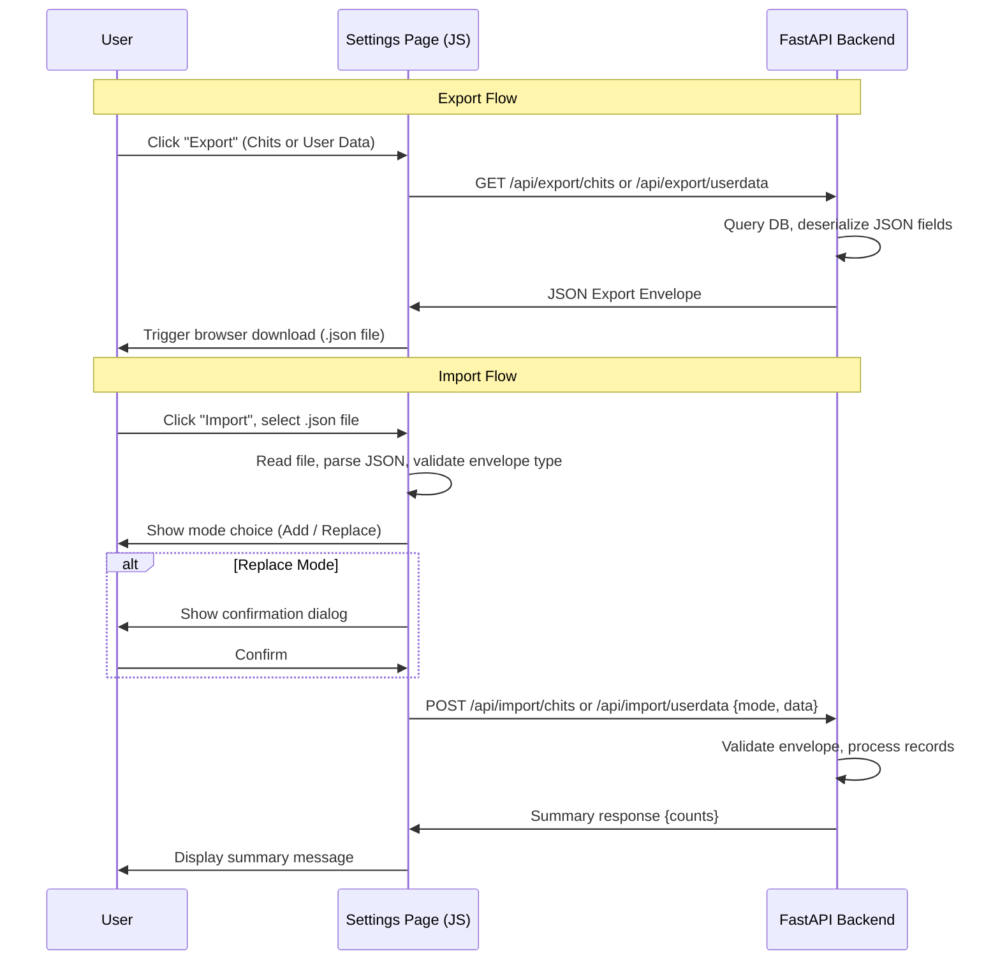

# Design Document: Data Management

## Overview

Data Management replaces the existing CSV export/import in the Chit Options box with a unified JSON-based export and import system. A new "📦 Data Management" `.setting-group` box on the Settings page provides separate controls for Chit Data and User Data. Exported files use a self-contained JSON envelope format with metadata (version, timestamp, instance ID, data type) and a data payload. Import supports two modes: **Add** (merge with existing) and **Replace** (overwrite after confirmation).

The feature touches three layers:
1. **Backend** — Two new export endpoints (`GET /api/export/chits`, `GET /api/export/userdata`) and two new import endpoints (`POST /api/import/chits`, `POST /api/import/userdata`) in `backend/main.py`
2. **Frontend** — New Data Management box in `frontend/settings.html` with JS logic in `frontend/settings.js`, replacing the old CSV export/import section
3. **Documentation** — Updated help page at `frontend/help.html`

### Design Decisions

- **JSON over CSV**: JSON preserves nested structures (tags, checklists, alerts, people, addresses) without lossy flattening. The existing CSV export already loses data for complex fields.
- **Envelope format**: Every export file wraps data in a metadata envelope so imports can validate file type, version, and origin before processing.
- **Backend-driven export**: Export endpoints return the full envelope as JSON. The frontend triggers a download from the response rather than building the file client-side. This keeps serialization logic in one place.
- **Frontend-driven file reading**: Import reads the JSON file client-side, validates the envelope type, then POSTs the parsed data to the backend. This avoids multipart file upload complexity.
- **No new dependencies**: Pure Python stdlib (json, sqlite3, uuid) on the backend; vanilla JS on the frontend. No pip, no npm.

## Architecture



### File Changes

| File | Changes |
|---|---|
| `backend/main.py` | Add 4 new endpoints, add `ExportEnvelope` / import request models |
| `frontend/settings.html` | Add Data Management box, remove CSV section from Chit Options |
| `frontend/settings.js` | Add export/import JS functions, remove `exportCSV`/`importCSV`/`_parseCSVLine` |
| `frontend/help.html` | Add Data Management section, update Settings reference |

## Components and Interfaces

### Backend API Endpoints

#### `GET /api/export/chits`

Returns all chit records (including soft-deleted) wrapped in an Export Envelope.

- Queries `SELECT * FROM chits` (all records, including deleted)
- Deserializes all JSON-serialized fields (tags, checklist, people, child_chits, alerts, recurrence_rule, recurrence_exceptions)
- Wraps in envelope with `type: "chits"`

**Response**: `ExportEnvelope` with `data: List[dict]`

#### `GET /api/export/userdata`

Returns all settings and contacts records wrapped in an Export Envelope.

- Queries `SELECT * FROM settings` and `SELECT * FROM contacts`
- Deserializes all JSON-serialized fields in both tables
- Wraps in envelope with `type: "userdata"`, `data: { settings: [...], contacts: [...] }`

**Response**: `ExportEnvelope` with `data: { settings: List[dict], contacts: List[dict] }`

#### `POST /api/import/chits`

Accepts an import request with mode and export envelope data.

**Request body**:
```json
{
  "mode": "add" | "replace",
  "data": { /* ExportEnvelope */ }
}
```

**Behavior**:
- Validates `mode` is "add" or "replace" → 400 if not
- Validates `data.type` is "chits" → 400 if not
- **Add mode**: For each chit in `data.data`, generate a new UUID, insert with all fields preserved
- **Replace mode**: `DELETE FROM chits`, then insert all records from the envelope with new UUIDs

**Response**: `{ "summary": { "imported": N } }`

#### `POST /api/import/userdata`

Accepts an import request with mode and export envelope data.

**Request body**:
```json
{
  "mode": "add" | "replace",
  "data": { /* ExportEnvelope */ }
}
```

**Behavior**:
- Validates `mode` is "add" or "replace" → 400 if not
- Validates `data.type` is "userdata" → 400 if not
- **Add mode (settings)**: For array fields (tags, custom_colors, saved_locations), merge with existing values, deduplicating. Scalar fields are not overwritten.
- **Add mode (contacts)**: Insert each contact with a new UUID, skipping contacts where `display_name` AND `given_name` match an existing contact.
- **Replace mode**: `DELETE FROM settings`, `DELETE FROM contacts`, then insert all records from the envelope.

**Response**: `{ "summary": { "contacts_added": N, "settings_merged": N } }` (add) or `{ "summary": { "settings_replaced": N, "contacts_replaced": N } }` (replace)

### Frontend Components

#### Data Management Box (settings.html)

A new `.setting-group` box in the `.settings-grid` with heading "📦 Data Management". Contains two subsections:

1. **Chit Data** — Export button, Import button
2. **User Data** — Export button, Import button

#### Import Mode Dialog

When a valid file is selected, a modal presents two buttons:
- "➕ Add to existing data"
- "🔄 Replace all data"

#### Replace Confirmation Dialog

Styled after the existing delete chit modal pattern. Shows warning text specific to the data type being replaced. Confirm and Cancel buttons.

#### JS Functions (settings.js)

| Function | Purpose |
|---|---|
| `exportChitData()` | Fetch from `/api/export/chits`, trigger download |
| `exportUserData()` | Fetch from `/api/export/userdata`, trigger download |
| `importChitData()` | Open file picker, validate, show mode choice, POST to `/api/import/chits` |
| `importUserData()` | Open file picker, validate, show mode choice, POST to `/api/import/userdata` |
| `_triggerJsonDownload(data, filename)` | Create blob, trigger `<a>` download |
| `_showImportModeDialog(type, fileData)` | Show Add/Replace choice modal |
| `_showReplaceConfirmDialog(type, onConfirm)` | Show confirmation modal for replace mode |

## Data Models

### Export Envelope

```json
{
  "type": "chits" | "userdata",
  "version": "20260427.1702",
  "exported_at": "2026-04-27T17:02:00Z",
  "instance_id": "uuid-string",
  "data": [ ... ] | { "settings": [...], "contacts": [...] }
}
```

### Chit Record (within envelope)

All fields from the `chits` table with JSON-serialized fields in their deserialized (native) form:
- `tags`: `Array<object>` (tag objects with name, color, etc.)
- `checklist`: `Array<object>` (checklist items)
- `people`: `Array<string>`
- `child_chits`: `Array<string>`
- `alerts`: `Array<object>`
- `recurrence_rule`: `object | null`
- `recurrence_exceptions`: `Array<string> | null`
- Boolean fields (`alarm`, `notification`, `pinned`, `archived`, `deleted`, `is_project_master`, `all_day`): native booleans

### Settings Record (within envelope)

All fields from the `settings` table with JSON-serialized fields deserialized:
- `tags`: `Array<object>`
- `default_filters`: `object`
- `custom_colors`: `Array<string>`
- `visual_indicators`: `object`
- `chit_options`: `object`
- `active_clocks`: `string` (comma-separated, not JSON)
- `saved_locations`: `string` (JSON-serialized in DB, deserialized in envelope)

### Contact Record (within envelope)

All fields from the `contacts` table with JSON-serialized fields deserialized:
- `phones`: `Array<object>`
- `emails`: `Array<object>`
- `addresses`: `Array<object>`
- `call_signs`: `Array<object>`
- `x_handles`: `Array<object>`
- `websites`: `Array<object>`
- `tags`: `Array<object>`
- Boolean fields (`has_signal`, `favorite`): native booleans

### Import Request (Pydantic)

```python
class ImportRequest(BaseModel):
    mode: str  # "add" or "replace"
    data: dict  # The full ExportEnvelope
```


## Correctness Properties

*A property is a characteristic or behavior that should hold true across all valid executions of a system — essentially, a formal statement about what the system should do. Properties serve as the bridge between human-readable specifications and machine-verifiable correctness guarantees.*

### Property 1: Chit export completeness and correctness

*For any* set of chit records in the database (with any combination of populated and null fields, including JSON-serialized fields like tags, checklist, people, child_chits, alerts, recurrence_rule, recurrence_exceptions), calling `GET /api/export/chits` SHALL return a valid Export Envelope with `type` equal to `"chits"`, a `version` string, an ISO 8601 `exported_at` timestamp, an `instance_id` string, and a `data` array containing every chit record with all JSON-serialized fields in their deserialized (native object/array) form.

**Validates: Requirements 2.2, 2.4, 2.5, 9.3**

### Property 2: User data export completeness and correctness

*For any* set of settings and contact records in the database (with any combination of populated and null JSON-serialized fields), calling `GET /api/export/userdata` SHALL return a valid Export Envelope with `type` equal to `"userdata"`, a `version` string, an ISO 8601 `exported_at` timestamp, an `instance_id` string, and a `data` object containing a `settings` array and a `contacts` array, where every record has all JSON-serialized fields in their deserialized form.

**Validates: Requirements 3.2, 3.4, 3.5, 3.6, 9.4**

### Property 3: Import validation rejects invalid requests

*For any* import request where the `mode` is not `"add"` or `"replace"`, or where the envelope `type` does not match the endpoint's expected type (`"chits"` for `/api/import/chits`, `"userdata"` for `/api/import/userdata`), the backend SHALL return HTTP 400 with a descriptive error message and make no changes to the database.

**Validates: Requirements 4.6, 6.7, 10.3, 10.4**

### Property 4: Add mode chit import preserves fields with new IDs

*For any* valid chit export envelope imported via `POST /api/import/chits` with `mode` `"add"`, each imported chit SHALL be inserted with a newly generated UUID that differs from the original ID, and all other field values (title, note, tags, dates, status, priority, checklist, alerts, etc.) SHALL be preserved identically to the input.

**Validates: Requirements 4.4**

### Property 5: Add mode settings merge deduplicates array fields

*For any* existing settings record and any valid imported settings record, when imported via `POST /api/import/userdata` with `mode` `"add"`, the resulting array fields (tags, custom_colors, saved_locations) SHALL be the deduplicated union of the existing and imported values — no existing items are removed, and no duplicate items appear.

**Validates: Requirements 6.4**

### Property 6: Add mode contact import skips duplicates

*For any* set of existing contacts and any set of imported contacts, when imported via `POST /api/import/userdata` with `mode` `"add"`, contacts whose `display_name` AND `given_name` both match an existing contact SHALL be skipped, and all non-matching contacts SHALL be inserted with newly generated UUIDs.

**Validates: Requirements 6.5**

### Property 7: Export-import round trip

*For any* valid dataset (chits, or settings+contacts), exporting the data, then importing it in `"replace"` mode, then exporting again SHALL produce a dataset equivalent to the first export (same records with same field values, ignoring generated IDs and export metadata like `exported_at`).

**Validates: Requirements 8.5, 5.3, 7.3**

## Error Handling

### Backend Errors

| Scenario | HTTP Status | Response |
|---|---|---|
| Invalid `mode` (not "add"/"replace") | 400 | `{ "detail": "Invalid mode: must be 'add' or 'replace'" }` |
| Envelope `type` mismatch | 400 | `{ "detail": "Invalid data: expected type 'chits'" }` or `"...type 'userdata'"` |
| Missing or malformed envelope | 400 | `{ "detail": "Invalid export envelope: missing required fields" }` |
| Database error during import | 500 | `{ "detail": "Import failed: <error>" }` — transaction rolled back, no partial writes |
| Database error during export | 500 | `{ "detail": "Export failed: <error>" }` |

### Frontend Errors

| Scenario | Behavior |
|---|---|
| File is not valid JSON | Alert: "Invalid file: could not parse JSON" |
| File has wrong envelope type | Alert: "Invalid file: expected a CWOC chit data export" or "...user data export" |
| Network error on export | Alert: "Export failed: <error>" |
| Network error on import | Alert: "Import failed: <error>" |
| Backend returns 400/500 | Alert with the error detail from the response |

### Transaction Safety

- **Replace mode imports** use a single SQLite transaction: DELETE + all INSERTs. If any INSERT fails, the entire transaction rolls back, preserving the original data.
- **Add mode imports** also use a single transaction for atomicity.

## Testing Strategy

### Unit Tests (Example-Based)

Focus on specific scenarios and edge cases:

- Export endpoints return correct envelope structure with empty DB
- Export endpoints return correct envelope structure with populated DB
- Import with empty `data` array succeeds with zero count
- Import mode validation rejects invalid modes
- Import envelope type validation rejects mismatched types
- Add mode contact dedup correctly matches on display_name + given_name
- Settings merge correctly deduplicates tags by name
- Replace mode clears all existing data before inserting
- Summary response contains correct counts

### Property-Based Tests

Use Python's `hypothesis` library — **wait, no installs allowed**. Since no pip installs are permitted, property-based tests will be implemented using a lightweight custom approach: a test helper that generates random data and runs assertions in a loop (minimum 100 iterations) using only Python stdlib (`random`, `string`, `uuid`, `unittest`).

Each property test references its design document property:

| Test | Property | Min Iterations |
|---|---|---|
| `test_chit_export_completeness` | Feature: data-management, Property 1: Chit export completeness and correctness | 100 |
| `test_userdata_export_completeness` | Feature: data-management, Property 2: User data export completeness and correctness | 100 |
| `test_import_validation_rejects_invalid` | Feature: data-management, Property 3: Import validation rejects invalid requests | 100 |
| `test_add_mode_chit_preserves_fields` | Feature: data-management, Property 4: Add mode chit import preserves fields with new IDs | 100 |
| `test_add_mode_settings_merge_dedup` | Feature: data-management, Property 5: Add mode settings merge deduplicates array fields | 100 |
| `test_add_mode_contact_skips_duplicates` | Feature: data-management, Property 6: Add mode contact import skips duplicates | 100 |
| `test_export_import_round_trip` | Feature: data-management, Property 7: Export-import round trip | 100 |

### Integration Tests

- Full export → download → re-import flow via browser (manual)
- Verify settings page reloads after replace import
- Verify old CSV section is removed from DOM
- Verify help page contains new Data Management section

### Test Data Generation (stdlib only)

Random test data generators using `random` and `string` modules:
- `random_chit()` — generates a chit dict with random field values
- `random_contact()` — generates a contact dict with random field values
- `random_settings()` — generates a settings dict with random array/object fields
- `random_envelope(type, data)` — wraps data in a valid export envelope
