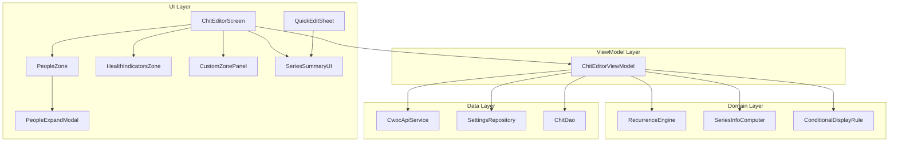

# Design Document: Editor Zones Parity

## Overview

This design covers four feature groups that bring the Android chit editor to full parity with the web implementation for editor zones:

1. **People Zone Expand Modal** — Wire the existing `showExpandModal` stub in `PeopleZone` to render a full-screen dialog containing the complete people management UI.
2. **Custom Zones in Editor** — Fetch user-defined custom zones from the API, render them as collapsible panels with typed input fields, and persist values in `health_data`.
3. **Health Indicators Enhancements** — Add conditional display filtering, metric unit label switching, and range highlighting to the existing `HealthIndicatorsZone`.
4. **Recurrence Series Info & Actions** — Compute series statistics, render a visual summary, and implement Complete Series, Break Off, and Auto-Archive actions.

All changes follow existing patterns: `EditorZoneHeader` for collapsible sections, `ChitEditorViewModel` for state management, `CwocApiService` for Retrofit API calls, and `SettingsRepository` for user preferences.

## Architecture



### Data Flow

1. **Custom Zones**: `ChitEditorViewModel.init` → `apiService.getCustomZones()` → for each zone, `apiService.getCustomObjectsForZone(zoneId)` → state flows to `CustomZonePanel` composables → user edits update `formState.healthData` → save merges into single JSON.

2. **Health Indicators Enhancements**: `SettingsRepository.settings` provides `unitSystem` and `sex` → `HealthIndicatorsZone` filters objects by `conditional_display`, selects unit label, and applies range highlighting.

3. **Recurrence Series**: `RecurrenceEngine` expanded with `computeSeriesInfo()` → `SeriesSummaryUI` renders instances → actions (Complete Series, Break Off) call API and update local state → `checkAutoArchive()` evaluates post-action.

## Components and Interfaces

### 1. People Zone Expand Modal

**File**: `ChitEditorScreen.kt` (within existing `PeopleZone` composable)

```kotlin
/**
 * Full-screen dialog containing the complete PeopleZone content.
 * Triggered by the expand button in the PeopleZone header.
 * Operates on the same in-memory state as the inline zone.
 */
@Composable
private fun PeopleExpandModal(
    people: List<String>,
    stealth: Boolean?,
    contactNames: List<String>,
    contactColors: Map<String, String>,
    contactImages: Map<String, String?>,
    serverUrl: String,
    authToken: String,
    shares: String?,
    sharedUsers: List<String>,
    assignedTo: String?,
    peopleSearchResults: List<String>,
    onPeopleSearchQueryChange: (String) -> Unit,
    onPeopleChange: (List<String>) -> Unit,
    onStealthChange: (Boolean?) -> Unit,
    onSharesChange: (String?) -> Unit,
    onAssignedToChange: (String?) -> Unit,
    onDismiss: () -> Unit
)
```

**Design decisions**:
- Uses `Dialog(properties = DialogProperties(usePlatformDefaultWidth = false))` for true full-screen.
- Reuses the exact same composable content as the inline `PeopleZone` body (extracted into a shared `PeopleZoneContent` internal composable).
- All callbacks operate on the same `formState` — no separate sync step needed.
- The expand button is an `IconButton` with `Icons.Default.OpenInFull` placed in the `EditorZoneHeader` trailing content.

### 2. Custom Zones in Editor

#### 2a. API Additions

**File**: `CwocApiService.kt`

```kotlin
/** Response model for a custom zone. */
data class CustomZoneResponse(
    val zone_id: String,
    val name: String,
    val sort_order: Int = 0,
    val object_count: Int = 0
)

/** Fetch all custom zones for the authenticated user. */
@GET("/api/custom-zones")
suspend fun getCustomZones(): Response<List<CustomZoneResponse>>
```

The existing `getCustomObjectsForZone(zoneId: String)` endpoint already returns `List<IndicatorObject>` which includes all needed fields (`id`, `name`, `value_type`, `units`, `metric_units`, `range_min`, `range_max`, `conditional_display`, `type`, `sub_type`, `zone_sort_order`). We reuse `IndicatorObject` for custom zone objects as well.

#### 2b. ViewModel State

**File**: `ChitEditorViewModel.kt`

```kotlin
/** State for a single custom zone with its objects. */
data class CustomZoneState(
    val zoneId: String,
    val name: String,
    val sortOrder: Int,
    val objects: List<IndicatorObject>
)

// New state flows in ChitEditorViewModel:
private val _customZones = MutableStateFlow<List<CustomZoneState>>(emptyList())
val customZones: StateFlow<List<CustomZoneState>> = _customZones.asStateFlow()

/** Called from init block after loadIndicatorObjects(). */
private fun loadCustomZones() {
    viewModelScope.launch {
        try {
            val zonesResponse = apiService.getCustomZones()
            if (!zonesResponse.isSuccessful) return@launch
            val zones = zonesResponse.body() ?: return@launch

            val zoneStates = zones.mapNotNull { zone ->
                try {
                    val objResponse = apiService.getCustomObjectsForZone(zone.zone_id)
                    if (objResponse.isSuccessful) {
                        CustomZoneState(
                            zoneId = zone.zone_id,
                            name = zone.name,
                            sortOrder = zone.sort_order,
                            objects = objResponse.body()
                                ?.sortedBy { it.zone_sort_order ?: 0 }
                                ?: emptyList()
                        )
                    } else null
                } catch (_: Exception) { null }
            }.sortedBy { it.sortOrder }

            _customZones.value = zoneStates
        } catch (_: Exception) {
            // Non-critical — editor loads without custom zones
        }
    }
}
```

#### 2c. Custom Zone Panel Composable

**File**: `ChitEditorScreen.kt` (new private composable)

```kotlin
/**
 * Renders a single custom zone as a collapsible panel with typed input fields.
 * Groups objects by sub_type (or type, or "Other") with collapsible sub-sections.
 *
 * @param zone The zone metadata and objects
 * @param healthData Current health_data JSON string
 * @param settings Current user settings (for conditional display and unit system)
 * @param onHealthDataChange Callback when any field value changes
 */
@Composable
private fun CustomZonePanel(
    zone: CustomZoneState,
    healthData: String?,
    settings: SettingsEntity?,
    onHealthDataChange: (String?) -> Unit
)
```

**Rendering logic**:
1. Filter objects by `evaluateConditionalDisplay(obj.conditional_display, settings)`.
2. If no visible objects remain, don't render the zone at all.
3. Group visible objects by `sub_type ?: type ?: "Other"`, sort groups alphabetically.
4. Within each group, sort by `zone_sort_order` ascending (null treated as 0).
5. Render input field per object based on `value_type`:
   - `"integer"` → `OutlinedTextField` with `KeyboardType.Number`, step=1 validation
   - `"decimal"` → `OutlinedTextField` with `KeyboardType.Decimal`
   - `"boolean"` → `Checkbox`
   - `"string"` → `OutlinedTextField` with `KeyboardType.Text`
6. Display unit label using `resolveUnitLabel(obj, settings)`.
7. Apply range highlighting using `rangeHighlightColor(value, obj.range_min, obj.range_max)`.

#### 2d. Data Persistence

**Algorithm for saving health_data**:
```
1. Parse existing healthData JSON into Map<String, Any?>
2. For each custom zone field with a non-null, non-empty value:
   - Set map[object.id] = typedValue
3. For each custom zone field with null/empty value:
   - Remove map[object.id] (don't store nulls)
4. Serialize map back to JSON
5. Update formState.healthData
```

This merges with indicator zone values since both use the same UUID-keyed map.

### 3. Health Indicators Enhancements

#### 3a. Conditional Display Evaluation

**File**: `ChitEditorScreen.kt` (utility function)

```kotlin
/**
 * Evaluates a conditional display rule against user settings.
 * Returns true if the object should be displayed.
 *
 * @param rule The conditional_display map, e.g., {"setting": "sex", "equals": "male"}
 * @param settings The current user's SettingsEntity
 * @return true if no rule exists or rule matches; false if rule doesn't match
 */
private fun evaluateConditionalDisplay(
    rule: Map<String, String>?,
    settings: SettingsEntity?
): Boolean {
    if (rule == null || rule.isEmpty()) return true
    val settingKey = rule["setting"] ?: return true
    val expectedValue = rule["equals"] ?: return true
    val actualValue = getSettingValue(settings, settingKey)
    return actualValue == expectedValue
}

/**
 * Retrieves a setting value by key name from SettingsEntity.
 * Maps known keys to entity fields.
 */
private fun getSettingValue(settings: SettingsEntity?, key: String): String? {
    if (settings == null) return null
    return when (key) {
        "sex" -> settings.sex
        "unit_system" -> settings.unitSystem
        // Add other setting keys as needed
        else -> null
    }
}
```

#### 3b. Unit Label Resolution

```kotlin
/**
 * Resolves the display unit label based on user's unit system preference.
 * - If metric and metric_units is non-null/non-empty → use metric_units
 * - Otherwise → use units
 * - Only for integer/decimal value types
 */
private fun resolveUnitLabel(
    obj: IndicatorObject,
    settings: SettingsEntity?
): String {
    if (obj.value_type != "integer" && obj.value_type != "decimal") return ""
    val isMetric = settings?.unitSystem == "metric"
    return if (isMetric && !obj.metric_units.isNullOrBlank()) {
        obj.metric_units
    } else {
        obj.units ?: ""
    }
}
```

#### 3c. Range Highlighting

```kotlin
/**
 * Determines the background color for a numeric field based on range bounds.
 * Returns null for no highlight, a Color for out-of-range values.
 */
@Composable
private fun rangeHighlightColor(
    value: String,
    rangeMin: Double?,
    rangeMax: Double?
): Color? {
    if (rangeMin == null && rangeMax == null) return null
    val numericValue = value.toDoubleOrNull() ?: return null

    return when {
        rangeMax != null && numericValue > rangeMax ->
            Color(0xFFFFE0CC) // Orange/red tint for high
        rangeMin != null && numericValue < rangeMin ->
            Color(0xFFCCE5FF) // Blue tint for low
        else -> null // Within range
    }
}
```

### 4. Recurrence Series Info & Actions

#### 4a. Series Info Computation

**File**: `RecurrenceEngine.kt` (new function)

```kotlin
/**
 * Computed series info for a recurring chit instance.
 */
data class SeriesInfo(
    val instanceNumber: Int,
    val totalPast: Int,
    val completedPast: Int,
    val successRate: Int // 0-100 percentage
)

/**
 * Computes series statistics for a recurring chit.
 * Walks the recurrence rule from start, counting instances up to today.
 *
 * @param rule The recurrence rule
 * @param startDate The chit's calendar start date
 * @param exceptions List of recurrence exceptions
 * @param targetDate The date of the current virtual instance (for instanceNumber)
 * @return SeriesInfo or null if rule is invalid
 */
fun computeSeriesInfo(
    rule: RecurrenceRule,
    startDate: LocalDate,
    exceptions: List<RecurrenceException>,
    targetDate: LocalDate = LocalDate.now()
): SeriesInfo? {
    if (rule.freq.isBlank()) return null

    val today = LocalDate.now()
    val brokenOffDates = exceptions.filter { it.brokenOff }.map { it.date }.toSet()
    val completedDates = exceptions.filter { it.completed }.map { it.date }.toSet()
    val byDayDows = rule.byDay?.mapNotNull { DAY_MAP[it.uppercase()] } ?: emptyList()

    var currentDate = startDate
    var totalPast = 0
    var completedPast = 0
    var instanceNumber = 0
    var iterCount = 0

    while (iterCount < 730) { // MAX_SERIES_ITERATIONS
        val dateStr = currentDate.format(DateTimeFormatter.ISO_LOCAL_DATE)

        // For weekly with byDay, check day match
        var dayMatches = true
        if (rule.freq.uppercase() == "WEEKLY" && byDayDows.isNotEmpty()) {
            dayMatches = currentDate.dayOfWeek in byDayDows
        }

        if (dayMatches && dateStr !in brokenOffDates) {
            instanceNumber++

            if (!currentDate.isAfter(today)) {
                totalPast++
                if (dateStr in completedDates) completedPast++
            }

            if (currentDate == targetDate) {
                // Found the target instance
            }
        }

        // Check termination
        val untilDate = rule.until?.let { parseDate(it) }
        if (untilDate != null && currentDate.isAfter(untilDate)) break
        if (currentDate.isAfter(today.plusDays(30))) break

        currentDate = advanceDate(currentDate, rule.freq.uppercase(), rule.interval.coerceAtLeast(1), byDayDows)
        iterCount++
    }

    val successRate = if (totalPast > 0) ((completedPast.toDouble() / totalPast) * 100).roundToInt() else 0

    return SeriesInfo(
        instanceNumber = instanceNumber,
        totalPast = totalPast,
        completedPast = completedPast,
        successRate = successRate
    )
}
```

#### 4b. Series Summary UI

**File**: New composable in `ChitEditorScreen.kt` or extracted to `zones/SeriesSummaryZone.kt`

```kotlin
/**
 * A single instance in the series summary display.
 */
data class SeriesInstanceDisplay(
    val date: LocalDate,
    val status: InstanceStatus
)

enum class InstanceStatus {
    COMPLETED,  // ✅
    MISSED,     // ❌
    BROKEN_OFF, // ✂️
    UPCOMING    // ⬜
}

/**
 * Renders a scrollable visual summary of all instances in a recurring series.
 * Shows instances from start date up to 30 days in the future, max 50 instances.
 *
 * @param rule The recurrence rule
 * @param startDate Series start date
 * @param exceptions List of recurrence exceptions
 */
@Composable
fun SeriesSummaryUI(
    rule: RecurrenceRule,
    startDate: LocalDate,
    exceptions: List<RecurrenceException>
)
```

**Rendering**: A `LazyColumn` (or scrollable `Column`) with each row showing:
- Status emoji icon (✅ ❌ ✂️ ⬜)
- Date formatted as "Mon, Jan 15"
- Abbreviated day-of-week

#### 4c. Complete Series Action

**File**: `ChitEditorViewModel.kt`

```kotlin
/**
 * Marks the entire recurring series as Complete.
 * Sets parent chit status to "Complete" with completed_datetime = now.
 *
 * @param chitId The parent recurring chit ID
 * @param onSuccess Callback on successful completion
 * @param onError Callback with error message on failure
 */
fun completeSeries(
    chitId: String,
    onSuccess: () -> Unit,
    onError: (String) -> Unit
) {
    viewModelScope.launch {
        try {
            val entity = chitDao.getById(chitId) ?: throw Exception("Chit not found")
            val now = Instant.now().toString()
            val updated = entity.copy(
                status = "Complete",
                completedDatetime = now,
                isDirty = true,
                lastModified = now
            )
            chitDao.upsert(updated)
            dirtyTracker.markChitDirty(chitId)
            if (connectivityMonitor.isOnline.value) {
                syncPushEngine.pushAll()
            }
            onSuccess()
        } catch (e: Exception) {
            onError("Could not complete series: ${e.message}")
        }
    }
}
```

#### 4d. Break Off Instance Action

**File**: `ChitEditorViewModel.kt`

```kotlin
/**
 * Breaks off a single virtual recurring instance into a standalone chit.
 * 1. Creates a new chit as a copy of the parent with instance-specific dates
 * 2. Adds a broken_off exception to the parent's recurrence_exceptions
 * 3. Returns the new chit ID for navigation
 *
 * @param parentChitId The parent recurring chit ID
 * @param instanceDate The date of the virtual instance to break off (YYYY-MM-DD)
 * @param instanceStart The instance's specific start datetime
 * @param instanceEnd The instance's specific end datetime
 * @param onSuccess Callback with new chit ID for navigation
 * @param onError Callback with error message on failure
 */
fun breakOffInstance(
    parentChitId: String,
    instanceDate: String,
    instanceStart: String?,
    instanceEnd: String?,
    onSuccess: (newChitId: String) -> Unit,
    onError: (String) -> Unit
)
```

**Algorithm**:
1. Load parent entity from Room.
2. Generate new UUID for standalone chit.
3. Copy parent fields to new entity, setting:
   - `id` = new UUID
   - `startDatetime` = instanceStart
   - `endDatetime` = instanceEnd
   - `dueDatetime` = instanceStart (or parent's due pattern)
   - `recurrence` = null
   - `recurrenceRule` = null
   - `recurrenceExceptions` = null
   - `recurrenceId` = null
4. Insert new entity into Room.
5. Parse parent's `recurrenceExceptions` JSON, append `{"date": instanceDate, "broken_off": true}`.
6. Update parent entity with new exceptions JSON.
7. Mark both chits dirty, trigger sync.
8. Call `checkAutoArchive(parentChitId)`.
9. Return new chit ID via `onSuccess`.

If any step fails, roll back (delete new chit if inserted, restore parent exceptions).

#### 4e. Auto-Archive Check

**File**: `RecurrenceEngine.kt` (new function)

```kotlin
/**
 * Checks if a recurring chit should be auto-archived.
 * Conditions:
 * - Chit has an end date (rule.until)
 * - End date is not in the future
 * - Chit is not already archived
 * - ALL generated instances from start to until are covered by exceptions
 *   (completed=true or broken_off=true)
 *
 * @return true if the chit should be archived
 */
fun shouldAutoArchive(
    rule: RecurrenceRule,
    startDate: LocalDate,
    exceptions: List<RecurrenceException>,
    isArchived: Boolean
): Boolean {
    if (isArchived) return false
    val untilDate = rule.until?.let { parseDate(it) } ?: return false
    if (untilDate.isAfter(LocalDate.now())) return false

    val brokenOffDates = exceptions.filter { it.brokenOff }.map { it.date }.toSet()
    val completedDates = exceptions.filter { it.completed }.map { it.date }.toSet()
    val coveredDates = brokenOffDates + completedDates
    val byDayDows = rule.byDay?.mapNotNull { DAY_MAP[it.uppercase()] } ?: emptyList()

    var currentDate = startDate
    var iterCount = 0

    while (iterCount < 730) {
        if (currentDate.isAfter(untilDate)) break

        var dayMatches = true
        if (rule.freq.uppercase() == "WEEKLY" && byDayDows.isNotEmpty()) {
            dayMatches = currentDate.dayOfWeek in byDayDows
        }

        if (dayMatches) {
            val dateStr = currentDate.format(DateTimeFormatter.ISO_LOCAL_DATE)
            if (dateStr !in coveredDates) return false
        }

        currentDate = advanceDate(currentDate, rule.freq.uppercase(), rule.interval.coerceAtLeast(1), byDayDows)
        iterCount++
    }

    return true
}
```

**ViewModel integration**: After any completion or break-off action, call:
```kotlin
private fun checkAutoArchive(chitId: String) {
    viewModelScope.launch {
        val entity = chitDao.getById(chitId) ?: return@launch
        if (entity.archived == true) return@launch
        val rule = parseRecurrenceRule(entity.recurrenceRule) ?: return@launch
        val startDate = parseDate(entity.startDatetime) ?: return@launch
        val exceptions = parseExceptions(entity.recurrenceExceptions)

        if (recurrenceEngine.shouldAutoArchive(rule, startDate, exceptions, entity.archived == true)) {
            val now = Instant.now().toString()
            val archived = entity.copy(
                archived = true,
                status = "Complete",
                isDirty = true,
                lastModified = now
            )
            chitDao.upsert(archived)
            dirtyTracker.markChitDirty(chitId)
            if (connectivityMonitor.isOnline.value) syncPushEngine.pushAll()
        }
    }
}
```

## Data Models

### Custom Zone API Response

```json
// GET /api/custom-zones
[
  {
    "zone_id": "fitness_zone",
    "name": "Fitness",
    "sort_order": 1,
    "object_count": 5
  }
]
```

### Custom Object (Zone Member) API Response

```json
// GET /api/custom-objects/zone/{zone_id}
[
  {
    "id": "uuid-123",
    "name": "Body Weight",
    "type": "Measurement",
    "sub_type": "Body",
    "value_type": "decimal",
    "units": "lbs",
    "metric_units": "kg",
    "range_min": 50.0,
    "range_max": 400.0,
    "zone_sort_order": 1,
    "zone_config": null,
    "conditional_display": {"setting": "sex", "equals": "female"}
  }
]
```

### Health Data JSON (stored on chit)

```json
{
  "uuid-indicator-1": 120,
  "uuid-indicator-2": 72.5,
  "uuid-custom-zone-obj-1": "some text",
  "uuid-custom-zone-obj-2": true
}
```

All indicator zone values and custom zone values share the same flat UUID-keyed map. This matches the web implementation.

### Recurrence Exceptions JSON

```json
[
  {"date": "2025-01-15", "completed": true},
  {"date": "2025-01-22", "broken_off": true},
  {"date": "2025-01-29", "completed": true, "title": "Modified title"}
]
```

### SeriesInfo (computed, not persisted)

```kotlin
data class SeriesInfo(
    val instanceNumber: Int,   // e.g., 12 (this is the 12th instance)
    val totalPast: Int,        // e.g., 10 (10 instances up to today)
    val completedPast: Int,    // e.g., 8 (8 of those were completed)
    val successRate: Int       // e.g., 80 (80% success rate)
)
```

## Correctness Properties

*A property is a characteristic or behavior that should hold true across all valid executions of a system — essentially, a formal statement about what the system should do. Properties serve as the bridge between human-readable specifications and machine-verifiable correctness guarantees.*

### Property 1: Conditional display evaluation correctness

*For any* conditional_display rule (which may be null, have a missing setting key, or reference a valid setting) and *for any* user settings state, `evaluateConditionalDisplay` shall return true if and only if the rule is null/empty OR the user's setting value at `rule.setting` strictly equals `rule.equals`. When the rule references a setting key not present in settings, the function shall return false.

**Validates: Requirements 5.1, 5.2, 5.3, 5.4, 5.5**

### Property 2: Unit label resolution

*For any* Custom_Object with any combination of `units`, `metric_units`, and `value_type`, and *for any* user `unitSystem` setting value, `resolveUnitLabel` shall return:
- The empty string when `value_type` is "boolean" or "string"
- `metric_units` when `unitSystem` == "metric" AND `metric_units` is non-null and non-empty
- `units` (or empty string if null) in all other cases

**Validates: Requirements 6.1, 6.2, 6.3, 6.4, 6.6**

### Property 3: Range highlight classification

*For any* numeric string value (or empty/non-numeric string) and *for any* combination of `range_min` and `range_max` (either or both may be null), `rangeHighlightColor` shall return:
- null when both range_min and range_max are null
- null when the value is empty or non-numeric
- high-range color when range_max is defined and value > range_max
- low-range color when range_min is defined and value < range_min
- null when value is within [range_min, range_max] inclusive

**Validates: Requirements 7.1, 7.2, 7.3, 7.5, 7.6, 7.7, 7.8**

### Property 4: Custom zone visibility filtering

*For any* list of CustomZoneState objects (each containing a list of Custom_Objects with optional conditional_display rules) and *for any* user settings, the set of rendered zones shall be exactly those zones that have at least one object where `evaluateConditionalDisplay` returns true, and they shall be ordered by `sortOrder` ascending.

**Validates: Requirements 2.2, 3.5**

### Property 5: Object grouping and ordering within zones

*For any* list of Custom_Objects within a zone, grouping by `(sub_type ?? type ?? "Other")` shall produce groups sorted alphabetically by group name, and within each group, objects shall be sorted by `(zone_sort_order ?? 0)` ascending.

**Validates: Requirements 3.3, 3.4**

### Property 6: Health data round-trip preservation

*For any* valid health_data JSON map containing UUID-keyed values (numbers, booleans, strings), loading the map into the editor fields and then saving without modification shall produce a JSON map equivalent to the original (same keys, same typed values). Additionally, saving shall never overwrite keys that belong to zones not currently being edited.

**Validates: Requirements 4.1, 4.3, 4.4**

### Property 7: Initial zone expansion state

*For any* Custom_Zone with N objects and *for any* health_data JSON map, the zone's initial `isExpanded` state shall be true if and only if at least one of the zone's object UUIDs exists as a key with a non-null value in the health_data map.

**Validates: Requirements 3.1**

### Property 8: Series info computation correctness

*For any* valid RecurrenceRule (with non-empty freq), start date, and list of RecurrenceExceptions, `computeSeriesInfo` shall produce a SeriesInfo where:
- `totalPast` equals the count of generated instance dates up to and including today, excluding dates with broken_off=true exceptions
- `completedPast` equals the count of those totalPast instances whose date matches a completed=true exception
- `successRate` equals `round((completedPast / totalPast) * 100)` when totalPast > 0, or 0 when totalPast == 0

**Validates: Requirements 8.2, 8.3, 8.4**

### Property 9: Series computation iteration bound

*For any* RecurrenceRule (including high-frequency rules like DAILY with no end date), `computeSeriesInfo` shall generate at most 730 dates before terminating, preventing unbounded computation.

**Validates: Requirements 8.6**

### Property 10: Instance status classification

*For any* instance date, today's date, and recurrence exceptions list, the instance status shall be:
- COMPLETED if the date has a recurrence_exception with completed=true
- BROKEN_OFF if the date has a recurrence_exception with broken_off=true
- MISSED if the date is strictly before today and has no completed or broken_off exception
- UPCOMING if the date is today or in the future

**Validates: Requirements 9.2**

### Property 11: Series summary display bounds

*For any* recurrence rule and start date, the series summary shall display at most 50 instances and shall not include any instance with a date more than 30 days in the future from today.

**Validates: Requirements 9.3**

### Property 12: Series summary chronological ordering

*For any* generated series summary instance list, the instances shall be ordered by date ascending (oldest first).

**Validates: Requirements 9.1**

### Property 13: Break-off produces correct standalone chit and parent exception

*For any* parent recurring chit and *for any* valid instance date within the series, breaking off that instance shall produce:
- A new chit with a unique ID, the parent's content fields (title, note, tags, people, etc.), the instance-specific start/end datetimes, and all recurrence fields (recurrence_rule, recurrence_exceptions, recurrence, recurrence_id) set to null
- The parent's recurrence_exceptions list updated to include an entry with the instance date and broken_off=true

**Validates: Requirements 11.1, 11.2, 11.3**

### Property 14: Auto-archive evaluation correctness

*For any* recurring chit with a RecurrenceRule that has `until` <= today, `shouldAutoArchive` shall return true if and only if every generated instance date from start through until has a corresponding recurrence_exception with either completed=true or broken_off=true. It shall return false when: until is null, until > today, or the chit is already archived.

**Validates: Requirements 12.1, 12.2, 12.3, 12.4, 12.5**

### Property 15: Complete series state transition

*For any* recurring chit, the "Complete Series" action shall set status to "Complete" and completed_datetime to a valid ISO 8601 UTC timestamp representing the current time.

**Validates: Requirements 10.2**

## Error Handling

| Scenario | Behavior |
|----------|----------|
| `/api/custom-zones` returns error/non-200 | Log error, continue without custom zone panels. `_customZones` remains empty list. |
| `/api/custom-objects/zone/{id}` returns error for one zone | Skip that zone, continue fetching remaining zones. |
| `/api/custom-zones` returns empty array | No custom zone panels rendered, no error shown. |
| Health data JSON is malformed | Catch parse exception, treat as empty map `{}`. |
| Save API call fails | Retain `isDirty=true`, show error toast "Save failed". |
| `computeSeriesInfo` receives invalid rule (no freq) | Return null. UI shows no series info. |
| Break-off: parent fetch fails | Show error toast, no navigation, no state change. |
| Break-off: new chit creation fails | Show error toast, no orphaned chit (nothing was inserted). |
| Break-off: parent exception update fails after new chit created | Delete the newly created chit, show error toast. Transactional rollback. |
| Complete Series: API/DB failure | Show error toast, leave status unchanged. |
| Auto-archive: any failure during evaluation | Silently skip (non-critical background operation). |
| Conditional display rule references unknown setting key | Treat as non-matching (hide the object). |
| Range highlight with non-numeric input | No highlight applied (graceful no-op). |

## Testing Strategy

### Unit Tests (Example-Based)

- **PeopleExpandModal**: Verify modal opens/closes, verify all controls are present.
- **Custom Zone rendering**: Verify correct input types for each value_type.
- **Error scenarios**: Verify graceful degradation for API failures, malformed JSON.
- **Series Summary formatting**: Verify date/day-of-week formatting.
- **Complete Series confirmation**: Verify confirmation dialog appears before action.

### Property-Based Tests

Property-based testing is appropriate for this feature because it contains multiple pure functions with clear input/output behavior and universal properties that hold across wide input spaces.

**Library**: [Kotest](https://kotest.io/) with the property testing module (`kotest-property`).

**Configuration**: Minimum 100 iterations per property test.

**Tag format**: `// Feature: editor-zones-parity, Property {N}: {title}`

Properties to implement as PBT:
1. `evaluateConditionalDisplay` — Property 1
2. `resolveUnitLabel` — Property 2
3. `rangeHighlightColor` — Property 3
4. `computeSeriesInfo` — Property 8
5. `shouldAutoArchive` — Property 14
6. Object grouping/sorting — Property 5
7. Health data round-trip — Property 6
8. Instance status classification — Property 10
9. Series summary bounds — Property 11
10. Break-off correctness — Property 13

### Integration Tests

- Custom zones fetch flow (ViewModel → API → state)
- Save flow (health_data merge → API call → dirty state cleared)
- Break-off transactional integrity (failure at each step → consistent state)
- Auto-archive trigger after completion/break-off actions

