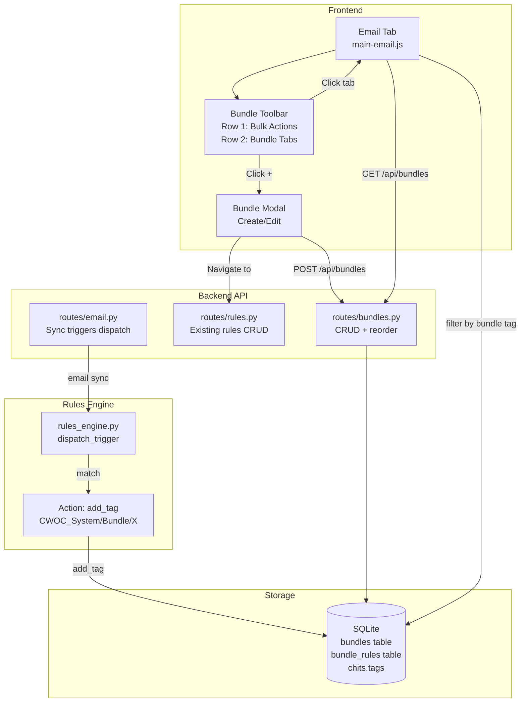
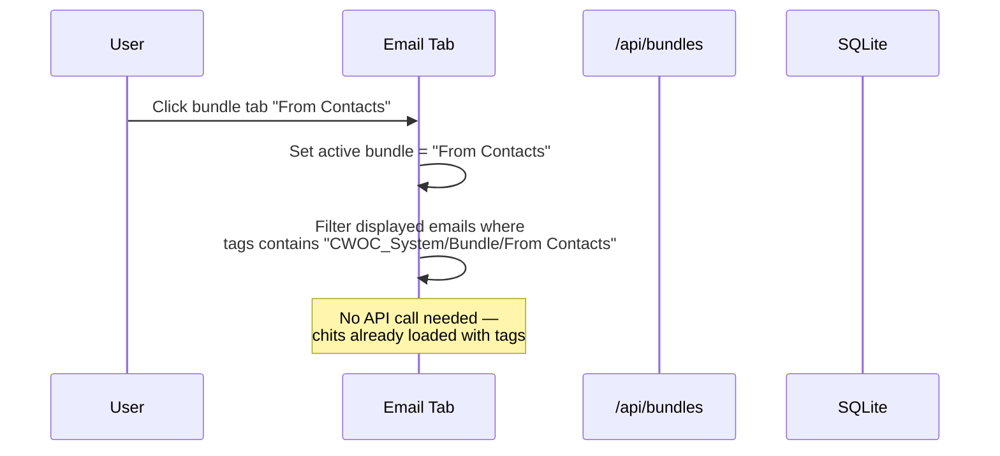
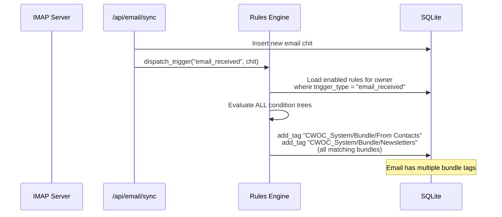
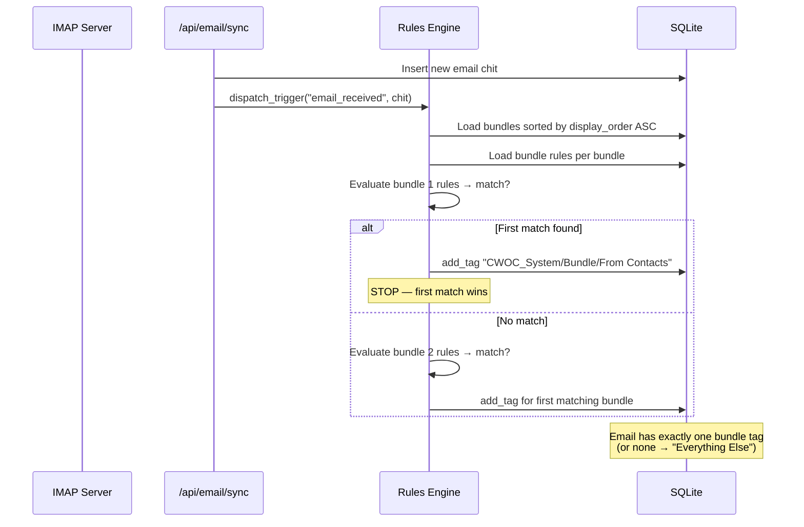

# Design Document: Email Bundles

## Overview

Email Bundles adds Google Inbox-style bundle categorization to CWOC's Email tab. A bundle is a virtual sub-inbox that groups emails by user-defined rules. The feature introduces a permanent two-row toolbar at the top of the Email tab: Row 1 has bulk action controls (always visible, greyed out until selection), Row 2 has bundle tabs for switching between categories.

The system is composed of four layers:

1. **Data Layer** — Two new SQLite tables (`bundles`, `bundle_rules`) managed via inline migration in `migrations.py`. New Pydantic v1 models for request validation.
2. **Classification Engine** — Piggybacks on the existing Rules Engine. Bundle rules are standard rules with trigger_type `"email_received"` whose action is `add_tag` with a `CWOC_System/Bundle/{name}` tag. No new evaluation logic needed.
3. **API Layer** — A new route module `routes/bundles.py` exposing CRUD endpoints under `/api/bundles/*`. Follows the existing REST pattern (JSON in/out, owner-scoped).
4. **Frontend Layer** — Modifications to `main-email.js` to replace the current dynamic bulk bar with a permanent toolbar and add bundle tab navigation. A new modal for bundle creation. New CSS in `styles-email-bundles.css`.

### Design Rationale

- **Bundles as metadata, not rules**: Bundles have display properties (name, description, order, removability) that don't belong on the rules model. A lightweight `bundles` table keeps concerns separated while the junction table `bundle_rules` links bundles to their classification rules.
- **Classification via existing Rules Engine**: Bundle rules are just regular rules with `add_tag` actions. This means zero new evaluation logic — the existing `dispatch_trigger` flow handles everything. Bundle membership is a tag, which integrates with CWOC's existing tag infrastructure.
- **"Everything Else" as computed**: Rather than a fragile catch-all rule, "Everything Else" displays inbox emails that lack any `CWOC_System/Bundle/*` tag. This is always correct regardless of rule ordering.
- **Multi-placement as a setting**: By default, emails go to only the first (leftmost) matching bundle — this keeps the inbox clean and predictable. Users who want comprehensive categorization can enable multi-placement in settings, which allows emails to appear in every matching bundle. The setting only affects newly synced emails (no retroactive reclassification).
- **Permanent toolbar**: Replaces the current show-on-select bulk bar with an always-visible toolbar. Bulk controls are greyed out when nothing is selected, improving discoverability. Bundle tabs are always accessible.
- **Lazy default initialization**: Default bundles are created on first query (not at user creation time), keeping the migration simple and avoiding orphaned defaults for users who never use email.

## Architecture



### Request Flow — Bundle Filtering



### Request Flow — Email Classification (Multi-Placement Enabled)



### Request Flow — Email Classification (Single-Placement / Default)



### File Organization

| Layer | File | Purpose |
|-------|------|---------|
| Backend — Routes | `src/backend/routes/bundles.py` | Bundle CRUD API, reorder, rule association |
| Backend — Models | `src/backend/models.py` | `BundleCreate`, `BundleUpdate`, `BundleReorder` Pydantic models |
| Backend — Migrations | `src/backend/migrations.py` | `migrate_create_bundles_tables()` |
| Backend — Main | `src/backend/main.py` | Register bundles routes, call migration |
| Frontend — JS | `src/frontend/js/dashboard/main-email.js` | Modified: permanent toolbar, bundle tabs, filtering |
| Frontend — JS | `src/frontend/js/dashboard/main-email-bundles.js` | Bundle-specific logic: modal, tab rendering, CRUD calls |
| Frontend — CSS | `src/frontend/css/dashboard/styles-email-bundles.css` | Bundle toolbar and modal styles |

## Components and Interfaces

### 1. Bundle CRUD API (`routes/bundles.py`)

New FastAPI router module following the existing route pattern. All endpoints require authentication via `get_actor_from_request()` and scope queries by `owner_id`.

**Endpoints:**

| Method | Path | Description |
|--------|------|-------------|
| `GET` | `/api/bundles` | List all bundles for authenticated user, sorted by display_order. Includes associated rule_ids. Triggers default bundle initialization if none exist. |
| `POST` | `/api/bundles` | Create a new bundle (UUID generated, owner_id from auth) |
| `PUT` | `/api/bundles/{bundle_id}` | Update bundle name, description, or display_order |
| `DELETE` | `/api/bundles/{bundle_id}` | Delete bundle (403 if removable=false, 404 if not owned) |
| `PUT` | `/api/bundles/reorder` | Accept ordered list of bundle IDs, update display_order |
| `POST` | `/api/bundles/{bundle_id}/rules` | Associate an existing rule with a bundle |
| `DELETE` | `/api/bundles/{bundle_id}/rules/{rule_id}` | Remove a rule association from a bundle |

**Registration in `main.py`:**
```python
from src.backend.routes.bundles import bundles_router
app.include_router(bundles_router)
```

**Key implementation details:**

```python
@bundles_router.get("/api/bundles")
async def get_bundles(request: Request):
    """List all bundles for the authenticated user.
    
    If no bundles exist, initializes defaults ("From Contacts", "Everything Else").
    Returns bundles with their associated rule_ids.
    """
    actor = get_actor_from_request(request)
    owner_id = actor["user_id"]
    
    # Check if user has any bundles
    bundles = _query_bundles(owner_id)
    if not bundles:
        _initialize_default_bundles(owner_id)
        bundles = _query_bundles(owner_id)
    
    return bundles
```

**Default bundle initialization:**

```python
def _initialize_default_bundles(owner_id: str):
    """Create the two default bundles and the From Contacts rule.
    
    - "From Contacts" (display_order=0, is_default=True, removable=True)
    - "Everything Else" (display_order=1, is_default=True, removable=False)
    
    Also creates a rule for "From Contacts" with:
    - trigger_type: "email_received"
    - condition: email_from contains_contact_email
    - action: add_tag "CWOC_System/Bundle/From Contacts"
    """
```

**Bundle rename — tag migration:**

When a bundle is renamed via PUT, the endpoint must:
1. Update the bundle record
2. Find all chits with the old `CWOC_System/Bundle/{old_name}` tag
3. Replace it with `CWOC_System/Bundle/{new_name}` in each chit's tags
4. Update the associated rule's action params to use the new tag

```python
def _rename_bundle_tags(cursor, owner_id: str, old_name: str, new_name: str):
    """Update bundle tags on all email chits when a bundle is renamed."""
    old_tag = f"CWOC_System/Bundle/{old_name}"
    new_tag = f"CWOC_System/Bundle/{new_name}"
    
    cursor.execute(
        "SELECT id, tags FROM chits WHERE owner_id = ? AND tags LIKE ?",
        (owner_id, f'%{old_tag}%')
    )
    for row in cursor.fetchall():
        chit_id, tags_raw = row
        tags = deserialize_json_field(tags_raw) or []
        tags = [new_tag if t == old_tag else t for t in tags]
        cursor.execute(
            "UPDATE chits SET tags = ?, modified_datetime = ? WHERE id = ?",
            (serialize_json_field(tags), datetime.utcnow().isoformat(), chit_id)
        )
```

**Bundle delete — tag cleanup:**

When a bundle is deleted via DELETE, the endpoint must:
1. Remove the `CWOC_System/Bundle/{name}` tag from all chits
2. Delete associated `bundle_rules` records
3. Delete the associated rules themselves
4. Delete the bundle record

### 2. Default Bundle Rule — "From Contacts"

The default "From Contacts" rule uses the existing `contains_contact_email` cross-reference operator already implemented in `rules_engine.py`:

```json
{
  "name": "Bundle: From Contacts",
  "trigger_type": "email_received",
  "enabled": true,
  "priority": 0,
  "conditions": {
    "type": "leaf",
    "field": "email_from",
    "operator": "contains_contact_email",
    "value": ""
  },
  "actions": [
    {
      "type": "add_tag",
      "params": {
        "tag": "CWOC_System/Bundle/From Contacts"
      }
    }
  ],
  "confirm_before_apply": false
}
```

This leverages the existing `resolve_contact_cross_ref` function in `rules_engine.py` which already handles `contains_contact_email` by checking if the entity's field value matches any email in the user's contacts.

### 3. Bundle Classification Dispatcher (`routes/bundles.py`)

The bundle classification logic is a thin wrapper around the existing Rules Engine that respects the multi-placement setting. It is called from the email sync flow after a new email chit is created.

**Single-placement mode (default — `bundles_multi_placement: false`):**

```python
def classify_email_into_bundle(chit: dict, owner_id: str):
    """Classify an email into exactly one bundle (first match by display_order).
    
    Evaluates bundle rules in bundle display_order (left-to-right).
    Stops at the first matching bundle and assigns only that bundle's tag.
    """
    bundles = _query_bundles_with_rules(owner_id)  # sorted by display_order ASC
    contacts = _load_user_contacts(owner_id)  # for cross-reference conditions
    
    for bundle in bundles:
        if bundle["name"] == "Everything Else":
            continue  # Skip — computed, not rule-based
        
        rules = _get_rules_for_bundle(bundle["id"], owner_id)
        for rule in rules:
            if not rule["enabled"]:
                continue
            conditions = deserialize_json_field(rule["conditions"])
            if evaluate_condition_tree(conditions, chit, contacts):
                # First match wins — assign this bundle's tag and stop
                tag = f"CWOC_System/Bundle/{bundle['name']}"
                _add_tag_to_chit(chit["id"], tag, owner_id)
                return  # Done — single placement
    
    # No match — email falls into "Everything Else" (no tag needed)
```

**Multi-placement mode (`bundles_multi_placement: true`):**

```python
def classify_email_into_bundles(chit: dict, owner_id: str):
    """Classify an email into all matching bundles.
    
    Evaluates ALL bundle rules regardless of match order.
    Assigns bundle tags for every matching bundle.
    """
    bundles = _query_bundles_with_rules(owner_id)
    contacts = _load_user_contacts(owner_id)
    
    for bundle in bundles:
        if bundle["name"] == "Everything Else":
            continue
        
        rules = _get_rules_for_bundle(bundle["id"], owner_id)
        for rule in rules:
            if not rule["enabled"]:
                continue
            conditions = deserialize_json_field(rule["conditions"])
            if evaluate_condition_tree(conditions, chit, contacts):
                tag = f"CWOC_System/Bundle/{bundle['name']}"
                _add_tag_to_chit(chit["id"], tag, owner_id)
                break  # This bundle matched — move to next bundle
    
    # Any unmatched emails fall into "Everything Else" (no tag needed)
```

**Integration with email sync:**

The email sync endpoint (`routes/email.py`) calls the bundle classifier after creating each new email chit:

```python
# In _create_email_chit() or after the sync loop:
settings = _get_user_settings(owner_id)
multi_placement = settings.get("bundles_multi_placement", False)

if multi_placement:
    classify_email_into_bundles(new_chit, owner_id)
else:
    classify_email_into_bundle(new_chit, owner_id)
```

**Note:** This replaces the generic Rules Engine `dispatch_trigger` for bundle-specific rules. Non-bundle rules with trigger_type "email_received" still fire via the normal dispatch flow. Bundle rules are identified by their association in the `bundle_rules` junction table.

### 4. Frontend — Bundle Toolbar (modifications to `main-email.js`)

The current `displayEmailView` function builds a dynamic bulk bar (`#emailBulkBar`) that shows/hides based on selection. This is replaced with a permanent two-row toolbar.

**Row 1 — Bulk Actions (always visible):**
- Select All checkbox
- Archive button (greyed out when nothing selected)
- Tag button (greyed out when nothing selected)
- Mark Read/Unread button (greyed out when nothing selected)
- Selected count indicator

**Row 2 — Bundle Tabs (always visible when sub-filter is "inbox"):**
- One tab per bundle, ordered by `display_order`
- Active tab has visual distinction (darker background, bottom border)
- Unread count badge on each tab
- "+" button at the end for creating new bundles
- Horizontally scrollable on mobile

**Filtering logic:**

```javascript
/**
 * Filter email chits by the active bundle.
 * @param {Array} chits - Already sub-filtered email chits (inbox only)
 * @param {string|null} activeBundle - Bundle name or null for "all"
 * @returns {Array} Filtered chits
 */
function _filterByBundle(chits, activeBundle) {
    if (!activeBundle) return chits; // No bundle filter active
    
    if (activeBundle === 'Everything Else') {
        // Show emails that don't have ANY CWOC_System/Bundle/* tag
        return chits.filter(function(c) {
            var tags = c.tags || [];
            return !tags.some(function(t) {
                return t.startsWith('CWOC_System/Bundle/');
            });
        });
    }
    
    // Show emails with the specific bundle tag
    var bundleTag = 'CWOC_System/Bundle/' + activeBundle;
    return chits.filter(function(c) {
        var tags = c.tags || [];
        return tags.indexOf(bundleTag) !== -1;
    });
}
```

**Bundle tab state:**
- Stored in `_emailActiveBundle` (null = no bundle filter, or bundle name)
- Persisted to `localStorage` key `cwoc_email_active_bundle`
- Restored on Email tab load
- Reset to null when sub-filter changes away from "inbox"

### 5. Frontend — Bundle Modal (`main-email-bundles.js`)

A new JS file for bundle-specific logic, loaded after `main-email.js`.

**Modal structure:**
```html
<template id="tmpl-bundle-modal">
  <div class="cwoc-modal-overlay" id="bundleModalOverlay">
    <div class="cwoc-modal bundle-modal">
      <h3 class="bundle-modal-title">Create Bundle</h3>
      <div class="bundle-modal-field">
        <label for="bundleNameInput">Name</label>
        <input type="text" id="bundleNameInput" placeholder="e.g. Newsletters" maxlength="50">
      </div>
      <div class="bundle-modal-field">
        <label for="bundleDescInput">Description (optional)</label>
        <textarea id="bundleDescInput" rows="2" placeholder="What kind of emails go here?"></textarea>
      </div>
      <div class="bundle-modal-actions">
        <button class="zone-button" id="bundleCancelBtn">Cancel</button>
        <button class="zone-button bundle-define-rule-btn" id="bundleDefineRuleBtn">Define Rule</button>
      </div>
      <p class="bundle-modal-hint" id="bundleModalHint"></p>
    </div>
  </div>
</template>
```

**Modal flow:**
1. User clicks "+" → modal opens
2. User enters name (required) and description (optional)
3. User clicks "Define Rule" → validates name is non-empty and not duplicate
4. Creates the bundle via `POST /api/bundles`
5. Navigates to Rule Editor with `?trigger=email_received&bundle_id={id}&return=/frontend/html/index.html#Email`
6. Rule Editor pre-selects trigger type and adds the bundle tag action automatically

**ESC handling:** Follows the CWOC ESC priority chain — modal closes on ESC before any page-level ESC behavior.

### 6. Frontend — Bundle Tab Rendering

```javascript
/**
 * Render the bundle tabs row in the toolbar.
 * @param {Array} bundles - Array of bundle objects from API
 * @param {Array} emailChits - All inbox email chits (for unread counts)
 */
function _renderBundleTabs(bundles, emailChits) {
    // Build tab elements for each bundle
    // Calculate unread count per bundle
    // Highlight active tab
    // Add "+" button at end
    // Handle horizontal scroll on mobile
}
```

**Unread count calculation:**
```javascript
function _getBundleUnreadCount(bundleName, emailChits) {
    if (bundleName === 'Everything Else') {
        return emailChits.filter(function(c) {
            var tags = c.tags || [];
            var hasBundleTag = tags.some(function(t) {
                return t.startsWith('CWOC_System/Bundle/');
            });
            return !hasBundleTag && !c.email_read;
        }).length;
    }
    
    var bundleTag = 'CWOC_System/Bundle/' + bundleName;
    return emailChits.filter(function(c) {
        var tags = c.tags || [];
        return tags.indexOf(bundleTag) !== -1 && !c.email_read;
    }).length;
}
```

### 7. Frontend — Context Menu for Bundle Management

Right-click (or long-press on mobile) on a bundle tab shows a context menu:
- **Edit** — Opens the bundle modal pre-populated with current name/description
- **Reorder** — Enables drag-and-drop on bundle tabs (using `shared-sort.js` pattern)
- **Delete** — Shows confirmation via `cwocConfirm()`, then calls `DELETE /api/bundles/{id}`

The "Everything Else" tab shows only "Edit" (for description changes) — no delete option.

### 8. Bundle Tabs Visibility Logic

Bundle tabs are only interactive when the email sub-filter is "inbox":
- When sub-filter is "inbox": tabs are full color, clickable, show unread counts
- When sub-filter is "sent", "drafts", "trash", or "archived": tabs are visually dimmed (opacity 0.4), non-interactive, no unread counts shown

### 9. Settings Page — Multi-Placement Toggle

A new toggle is added to the Email section of the Settings page (`settings.html` / `settings.js`).

**HTML (in the Email Account section):**
```html
<div class="settings-field">
  <label class="settings-toggle-label">
    <input type="checkbox" id="bundlesMultiPlacement">
    <span>Allow Multi-Placement</span>
  </label>
  <p class="settings-hint">When enabled, emails can appear in multiple bundles. When disabled, each email goes to the first matching bundle (left to right).</p>
</div>
```

**Backend storage:**
The `bundles_multi_placement` field is stored as a boolean in the `settings` table. Added via migration as a new column with default `0` (false).

**API integration:**
- Read via existing `GET /api/settings/default_user` (included in the settings response)
- Written via existing `POST /api/settings` (included in the settings save payload)
- Also returned in `GET /api/bundles` response as a top-level field for frontend convenience

**Frontend behavior:**
- The toggle is loaded from settings on page init
- Changing it triggers the standard `CwocSaveSystem` dirty-state tracking
- Saved alongside other settings via the existing settings save flow

## Data Models

### SQLite Tables

**`bundles` table:**

| Column | Type | Default | Description |
|--------|------|---------|-------------|
| id | TEXT PRIMARY KEY | — | UUID |
| owner_id | TEXT | — | User UUID (scoping) |
| name | TEXT | — | Bundle display name |
| description | TEXT | NULL | Optional description (shown as tooltip) |
| display_order | INTEGER | 0 | Tab ordering (lower = leftmost) |
| is_default | BOOLEAN | 0 | Whether this is a system-created default bundle |
| removable | BOOLEAN | 1 | Whether the bundle can be deleted (false for "Everything Else") |
| created_datetime | TEXT | — | ISO 8601 UTC |
| modified_datetime | TEXT | — | ISO 8601 UTC |

**`bundle_rules` junction table:**

| Column | Type | Default | Description |
|--------|------|---------|-------------|
| id | TEXT PRIMARY KEY | — | UUID |
| bundle_id | TEXT | — | FK to bundles.id |
| rule_id | TEXT | — | FK to rules.id |
| owner_id | TEXT | — | User UUID (for scoping) |
| created_datetime | TEXT | — | ISO 8601 UTC |

### Pydantic Models (additions to `models.py`)

```python
# ── Email Bundles Models ─────────────────────────────────────────────────

class BundleCreate(BaseModel):
    name: str
    description: Optional[str] = None

class BundleUpdate(BaseModel):
    name: Optional[str] = None
    description: Optional[str] = None

class BundleReorder(BaseModel):
    bundle_ids: List[str]  # Ordered list of bundle IDs

class BundleRuleAssociate(BaseModel):
    rule_id: str
```

### Migration Function

```python
def migrate_create_bundles_tables():
    """Create bundles and bundle_rules tables if they don't exist.
    Also adds bundles_multi_placement column to settings table.
    """
    conn = None
    try:
        conn = sqlite3.connect(DB_PATH)
        cursor = conn.cursor()
        
        cursor.execute("""
        CREATE TABLE IF NOT EXISTS bundles (
            id TEXT PRIMARY KEY,
            owner_id TEXT,
            name TEXT,
            description TEXT,
            display_order INTEGER DEFAULT 0,
            is_default BOOLEAN DEFAULT 0,
            removable BOOLEAN DEFAULT 1,
            created_datetime TEXT,
            modified_datetime TEXT
        )
        """)
        
        cursor.execute("""
        CREATE TABLE IF NOT EXISTS bundle_rules (
            id TEXT PRIMARY KEY,
            bundle_id TEXT,
            rule_id TEXT,
            owner_id TEXT,
            created_datetime TEXT
        )
        """)
        
        # Add bundles_multi_placement to settings table
        cursor.execute("PRAGMA table_info(settings)")
        columns = [col[1] for col in cursor.fetchall()]
        if "bundles_multi_placement" not in columns:
            cursor.execute("ALTER TABLE settings ADD COLUMN bundles_multi_placement BOOLEAN DEFAULT 0")
        
        conn.commit()
        logger.info("Bundles tables created/verified")
    except Exception as e:
        logger.error(f"Error creating bundles tables: {str(e)}")
    finally:
        if conn:
            conn.close()
```

### Bundle API Response Format

```json
// GET /api/bundles response
{
  "bundles_multi_placement": false,
  "bundles": [
    {
      "id": "uuid-1",
      "name": "From Contacts",
      "description": "Emails from people in your contacts list",
      "display_order": 0,
      "is_default": true,
      "removable": true,
      "rule_ids": ["rule-uuid-1"],
      "created_datetime": "2025-01-15T10:00:00",
      "modified_datetime": "2025-01-15T10:00:00"
    },
    {
      "id": "uuid-2",
      "name": "Everything Else",
      "description": "Emails not matched by any other bundle",
      "display_order": 1,
      "is_default": true,
      "removable": false,
      "rule_ids": [],
      "created_datetime": "2025-01-15T10:00:00",
      "modified_datetime": "2025-01-15T10:00:00"
    }
  ]
}
```

### Bundle Tag Format

All bundle tags follow the pattern: `CWOC_System/Bundle/{bundle_name}`

Examples:
- `CWOC_System/Bundle/From Contacts`
- `CWOC_System/Bundle/Newsletters`
- `CWOC_System/Bundle/Receipts`

These tags are protected by the existing `CWOC_System/` namespace enforcement — users cannot manually create or assign them.


## Correctness Properties

*A property is a characteristic or behavior that should hold true across all valid executions of a system — essentially, a formal statement about what the system should do. Properties serve as the bridge between human-readable specifications and machine-verifiable correctness guarantees.*

### Property 1: Bundle CRUD Round-Trip

*For any* valid bundle name (non-empty string) and optional description, creating a bundle via the API and then reading it back SHALL produce a bundle with the same name, description, owner_id, and a valid UUID id. Subsequently updating the bundle's name or description and reading it back SHALL reflect the updated values.

**Validates: Requirements 1.1, 8.2, 8.3**

### Property 2: Owner Scoping Isolation

*For any* two distinct users A and B, and *any* bundle owned by user B, querying bundles with user A's owner_id SHALL never return user B's bundle. Attempting to read, update, or delete user B's bundle via user A's authenticated session SHALL return HTTP 404.

**Validates: Requirements 1.3, 8.8**

### Property 3: Bundle Rename Tag Migration

*For any* bundle with name N and *any* set of email chits carrying the tag `CWOC_System/Bundle/N`, renaming the bundle to M SHALL result in all those chits having the tag `CWOC_System/Bundle/M` and none having the tag `CWOC_System/Bundle/N`. The total number of chits with the new tag SHALL equal the number that previously had the old tag.

**Validates: Requirements 3.5, 7.7**

### Property 4: Bundle Delete Tag Cleanup

*For any* bundle with name N and *any* set of email chits carrying the tag `CWOC_System/Bundle/N`, deleting the bundle SHALL result in zero chits carrying that tag. Additionally, all `bundle_rules` records for that bundle SHALL be deleted, and the associated rules SHALL be deleted.

**Validates: Requirements 3.6, 7.5**

### Property 5: Bundle List Sort Order

*For any* set of bundles with varying display_order values, the GET `/api/bundles` response SHALL return them sorted by display_order in ascending order. Bundles with equal display_order SHALL maintain a stable relative order.

**Validates: Requirements 5.1, 8.1**

### Property 6: Bundle Filtering Correctness

*For any* set of inbox email chits with varying bundle tags, and *any* active bundle name B:
- If B is a named bundle (not "Everything Else"), filtering SHALL return exactly the chits whose tags list contains `CWOC_System/Bundle/B`.
- If B is "Everything Else", filtering SHALL return exactly the chits whose tags list does NOT contain any tag matching the prefix `CWOC_System/Bundle/`.

When `bundles_multi_placement` is true, the union of all bundle-filtered sets plus the "Everything Else" set SHALL equal the complete set of inbox emails (no email is lost, every email appears in at least one bundle view). When `bundles_multi_placement` is false, each email appears in at most one named bundle (or in "Everything Else" if no bundle matched), and the sets are disjoint.

**Validates: Requirements 5.2, 5.3, 9.1, 9.2**

### Property 7: Unread Count Computation

*For any* set of inbox email chits with varying `email_read` states and bundle tags, the unread count for a bundle B SHALL equal the number of chits that: (a) would be returned by the bundle filter for B, AND (b) have `email_read` equal to false. When `bundles_multi_placement` is false, the sum of unread counts across all bundles (including "Everything Else") SHALL equal the total number of unread inbox emails. When `bundles_multi_placement` is true, the sum may exceed the total (since one email can be counted in multiple bundles).

**Validates: Requirements 5.8, 9.6**

### Property 8: Bundle Name Validation

*For any* string that is empty or composed entirely of whitespace, bundle name validation SHALL reject it. *For any* non-empty, non-whitespace string that matches an existing bundle name (case-insensitive) for the same owner, validation SHALL reject it as a duplicate. *For any* non-empty, non-whitespace string that does NOT match any existing bundle name, validation SHALL accept it.

**Validates: Requirements 6.4**

### Property 9: Bundle Reorder Persistence

*For any* ordered list of bundle IDs submitted to the reorder endpoint, the resulting display_order values SHALL reflect the submitted order — the first ID gets display_order 0, the second gets 1, and so on. A subsequent GET `/api/bundles` call SHALL return bundles in this new order.

**Validates: Requirements 7.6, 8.5**

### Property 10: Bundle Filter Composes with Sub-Filter

*For any* email sub-filter value that is NOT "inbox" (i.e., "sent", "drafts", "trash", "archived"), the bundle filter SHALL have no effect — all emails matching the sub-filter are returned regardless of their bundle tags. Bundle filtering SHALL only apply when the sub-filter is "inbox".

**Validates: Requirements 9.3**

### Property 11: Single-Placement Priority Ordering

*For any* set of bundles ordered by display_order and *any* email that matches rules for bundles at positions P1 and P2 (where P1 < P2), when `bundles_multi_placement` is false, the classification engine SHALL assign ONLY the tag for the bundle at position P1 (leftmost/highest-priority match). The email SHALL NOT receive the tag for the bundle at position P2 or any lower-priority bundle.

**Validates: Requirements 12.2**

### Property 12: Multi-Placement Completeness

*For any* set of bundles and *any* email that matches rules for bundles B1, B2, ..., Bn, when `bundles_multi_placement` is true, the classification engine SHALL assign tags for ALL matching bundles B1 through Bn. The number of bundle tags on the email SHALL equal the number of bundles whose rules matched.

**Validates: Requirements 12.3**

## Error Handling

### API Errors

| Error Scenario | HTTP Status | Response | Handling |
|---------------|-------------|----------|----------|
| Bundle not found (wrong ID or not owned) | 404 | `{"detail": "Bundle not found"}` | Prevents leaking existence of other users' bundles |
| Delete non-removable bundle | 403 | `{"detail": "This bundle cannot be removed"}` | Protects "Everything Else" |
| Duplicate bundle name | 400 | `{"detail": "A bundle with this name already exists"}` | Prevents confusion in tab display |
| Empty bundle name | 422 | `{"detail": "Bundle name is required"}` | Standard validation |
| Invalid rule_id in association | 404 | `{"detail": "Rule not found"}` | Prevents orphaned associations |
| Reorder with invalid bundle IDs | 400 | `{"detail": "One or more bundle IDs not found"}` | Prevents partial reorder |

### Frontend Error Handling

| Error Scenario | Handling |
|---------------|----------|
| Bundle API returns error | Show red toast with error detail |
| Bundle creation fails | Keep modal open, show inline error message |
| Bundle delete fails | Show toast with error message |
| Network error during bundle operations | Show "Connection error" toast, preserve current state |
| Bundle rename fails mid-operation | Roll back UI to previous name, show error toast |

### Edge Cases

| Scenario | Behavior |
|----------|----------|
| User has no email account configured | Bundle tabs still render (empty), no classification occurs |
| Bundle rule is disabled | Emails stop being classified into that bundle, but existing tags remain |
| Bundle rule is deleted outside of bundle management | Bundle still exists but shows no new emails; existing tagged emails still appear |
| Email has multiple bundle tags | Depends on multi-placement setting. If enabled: email appears in multiple bundle tabs; unread count includes it in each. If disabled: should not happen (single-placement ensures one tag max) |
| Bundle name contains special characters | Allowed — tag format handles any string (CWOC_System/Bundle/{name}) |
| Very long bundle name | Frontend truncates display with ellipsis; full name in tooltip |
| Concurrent bundle operations | Last-write-wins (SQLite serialization); no explicit locking needed |

## Testing Strategy

### Property-Based Tests

Property-based testing is appropriate for this feature because it contains pure functions with clear input/output behavior (bundle filtering, unread count computation, name validation, tag migration) and universal properties that hold across a wide input space.

**Library:** `hypothesis` for Python property-based testing (already available in the project's test environment).

**Configuration:** Minimum 100 iterations per property test.

**Tag format:** `Feature: email-bundles, Property {number}: {property_text}`

Each correctness property maps to a single property-based test:

| Property | Test File | What It Tests |
|----------|-----------|---------------|
| 1 | `test_email_bundles.py` | Bundle create/read/update round-trip |
| 2 | `test_email_bundles.py` | Owner scoping isolation |
| 3 | `test_email_bundles.py` | Rename tag migration across chits |
| 4 | `test_email_bundles.py` | Delete tag cleanup across chits |
| 5 | `test_email_bundles.py` | Bundle list sort order |
| 6 | `test_email_bundles.py` | Bundle filtering (specific + Everything Else) |
| 7 | `test_email_bundles.py` | Unread count computation |
| 8 | `test_email_bundles.py` | Bundle name validation |
| 9 | `test_email_bundles.py` | Reorder persistence |
| 10 | `test_email_bundles.py` | Bundle filter + sub-filter composition |
| 11 | `test_email_bundles.py` | Single-placement priority ordering |
| 12 | `test_email_bundles.py` | Multi-placement completeness |

### Unit Tests (Example-Based)

| Test | What It Verifies |
|------|------------------|
| Default bundle initialization | Two bundles created with correct properties (Req 2.1–2.6) |
| From Contacts rule structure | Correct trigger_type, condition, and action (Req 2.2, 3.2) |
| Delete non-removable bundle returns 403 | Everything Else protection (Req 8.9) |
| Bundle rule association/removal | POST and DELETE on bundle_rules (Req 8.6, 8.7) |
| Migration is idempotent | Running twice doesn't fail (Req 1.2, 1.5) |
| Bundle modal validation messages | Empty name, duplicate name, no rule (Req 6.4, 6.6) |

### Integration Tests

| Test | What It Verifies |
|------|------------------|
| Email sync + bundle classification | End-to-end: sync email → rules fire → bundle tag assigned (Req 3.1) |
| Multiple bundle rules match one email | Both tags assigned (Req 3.3) |
| From Contacts rule with real contacts | Sender matching against contacts (Req 3.4) |
| Bundle rename with existing classified emails | Tags migrated correctly (Req 3.5) |

### Test File Location

All bundle tests go in `src/backend/test_email_bundles.py`, following the existing test file pattern.

### Frontend Testing

Frontend logic is tested manually via the browser. Key scenarios to verify:
- Bundle toolbar renders correctly on desktop and mobile
- Bundle tabs filter emails correctly
- "Everything Else" shows unclassified emails
- Bundle modal opens/closes/validates correctly
- Context menu appears on right-click/long-press
- Drag-and-drop reorder works
- Tabs dim when sub-filter is not "inbox"
- Unread badges update when emails are read/archived
