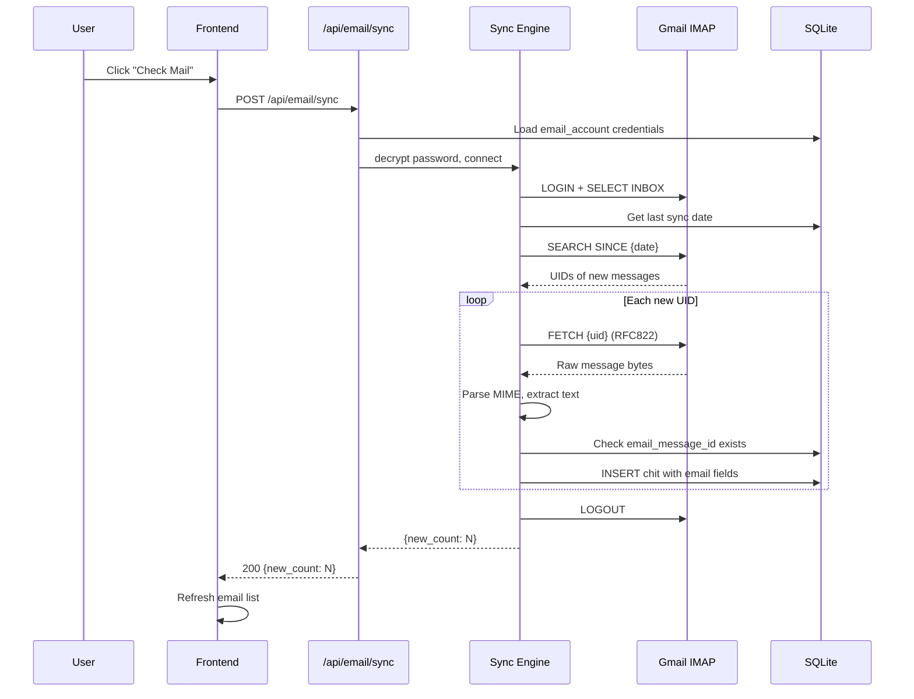
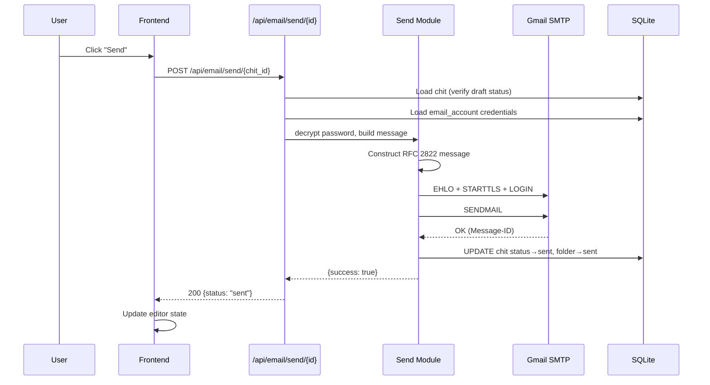

# Design Document — Email Integration

## Overview

This design adds a basic email client to CWOC by treating emails as chits with email-specific fields. The approach uses Python's stdlib `imaplib`, `smtplib`, and `email` modules to connect to an external Gmail server (MVP), with CWOC's FastAPI backend as the API layer and SQLite as the local cache/store.

The core principle is "one record, many views" — an email is just a chit with extra fields populated. The backend auto-assigns a `CWOC_System/Email` system tag, a new Email dashboard tab provides inbox-style browsing, and a new Email zone in the chit editor handles compose/read/reply/forward.

### Key Design Decisions

1. **Emails are chits** — email fields are optional columns on the existing `chits` table, not a separate table. This means emails automatically participate in search, tags, calendar, and all existing chit features.

2. **Client-only architecture** — CWOC connects to an external IMAP/SMTP server (Gmail for MVP). No mail server components (Postfix, Dovecot, Notmuch) are installed. Python stdlib handles all protocol work.

3. **Forward-only sync** — the sync engine fetches only messages newer than the last sync point. A separate backfill action (with space estimation warning) is available in settings.

4. **Plain-text MVP** — HTML emails have their text extracted via Python's `email` module. Full HTML rendering is deferred.

5. **Password encryption** — email passwords are stored with reversible encryption (Fernet symmetric encryption using a machine-derived key), not hashing, since the actual password is needed for IMAP/SMTP auth.

6. **Manual sync only** — no background polling for MVP. The user clicks "Check Mail" to fetch new messages.

---

## Architecture

### System Architecture

```mermaid
graph TB
    subgraph "Browser (Vanilla JS)"
        ET[Email Tab<br/>main-email.js]
        EZ[Email Zone<br/>editor-email.js]
        EC[Email CSS<br/>editor-email.css]
    end

    subgraph "FastAPI Backend"
        ER[email.py Router<br/>POST /api/email/sync<br/>POST /api/email/send/{id}<br/>PATCH /api/email/{id}/read<br/>POST /api/email/test-connection]
        SE[Sync Engine<br/>IMAP fetch + parse]
        SM[Send Module<br/>SMTP compose + send]
        CR[Crypto Module<br/>Fernet encrypt/decrypt]
    end

    subgraph "External"
        IMAP[Gmail IMAP<br/>imap.gmail.com:993]
        SMTP[Gmail SMTP<br/>smtp.gmail.com:587]
    end

    subgraph "Storage"
        DB[(SQLite<br/>chits table<br/>+ email columns<br/>settings table<br/>+ email_account)]
    end

    ET -->|REST API| ER
    EZ -->|REST API| ER
    ER --> SE
    ER --> SM
    SE --> CR
    SM --> CR
    SE -->|imaplib SSL| IMAP
    SM -->|smtplib STARTTLS| SMTP
    SE --> DB
    SM --> DB
    CR --> DB
```

### Request Flow — Sync



### Request Flow — Send



---

## Components and Interfaces

### Backend Components

#### 1. `src/backend/routes/email.py` — Email Router

New FastAPI router module following the existing route pattern.

**Endpoints:**

| Method | Path | Description |
|--------|------|-------------|
| `POST` | `/api/email/sync` | Trigger manual IMAP sync, returns `{new_count: int}` |
| `POST` | `/api/email/send/{chit_id}` | Send a draft email chit via SMTP |
| `PATCH` | `/api/email/{chit_id}/read` | Set `email_read` to true on an email chit |
| `POST` | `/api/email/test-connection` | Test IMAP + SMTP connectivity with configured credentials |
| `POST` | `/api/email/backfill-estimate` | Query IMAP for total message count and estimated storage |

**Dependencies:** `imaplib`, `smtplib`, `email` (all stdlib), `src.backend.db`, `src.backend.models`

**Registration:** Added to `main.py` alongside existing routers:
```python
from src.backend.routes.email import email_router
app.include_router(email_router)
```

#### 2. Sync Engine (within `email.py`)

Internal functions for IMAP sync logic:

- `_connect_imap(account: dict) -> imaplib.IMAP4_SSL` — Connect and authenticate
- `_get_last_sync_date(cursor, owner_id: str) -> str` — Query most recent `email_date` for this user
- `_fetch_new_messages(imap, since_date: str) -> list[tuple]` — SEARCH SINCE + FETCH
- `_parse_email_message(raw_bytes: bytes) -> dict` — Parse MIME, extract headers + plain text body
- `_extract_text_from_message(msg: email.message.Message) -> str` — Walk MIME parts, prefer text/plain, fallback to stripping HTML tags from text/html
- `_create_email_chit(cursor, parsed: dict, owner_id: str)` — INSERT into chits table with email fields

#### 3. Send Module (within `email.py`)

- `_connect_smtp(account: dict) -> smtplib.SMTP` — Connect with STARTTLS and authenticate
- `_build_rfc2822_message(chit: dict, account: dict) -> email.message.EmailMessage` — Construct valid email from chit fields
- `_send_email(smtp, message: EmailMessage, from_addr: str)` — Send and capture Message-ID

#### 4. Crypto Module (within `email.py` or a small helper)

Password encryption using `cryptography.fernet.Fernet` for proper symmetric encryption:

- The `cryptography` package is installed on the server only (via configurinator.sh and cwoc-push.sh) — NOT on the development machine
- Fernet provides authenticated encryption (AES-128-CBC + HMAC-SHA256) which is significantly more secure than XOR obfuscation
- The encryption key is generated once via `Fernet.generate_key()` and stored in `data/email.key`. If the file exists, it's reused. This keeps the key outside the database for defense-in-depth.

Functions:
- `_get_or_create_fernet_key() -> bytes` — Load key from `data/email.key` or generate, save, and return a new one
- `_get_fernet() -> Fernet` — Return a Fernet instance with the loaded key
- `_encrypt_password(plaintext: str) -> str` — Fernet encrypt, return the token as a string
- `_decrypt_password(ciphertext: str) -> str` — Fernet decrypt, return the original plaintext

**Deployment script changes (server-only installs):**
- `install/configurinator.sh` — add `cryptography` to the `/app/venv/bin/pip install` line
- `cwoc-push.sh` — add a pip install step after rsync: `ssh root@$HOST "/app/venv/bin/pip install cryptography -q"`

#### 5. Migration Functions (in `migrations.py`)

New migration function: `migrate_add_email_fields()`

Adds email columns to `chits` table and `email_account` column to `settings` table, following the existing column-existence-check pattern.

### Frontend Components

#### 1. `src/frontend/js/dashboard/main-email.js` — Email Tab View

New dashboard script for the Email tab, following the pattern of `main-views.js`.

**Functions:**
- `displayEmailView(chitsToDisplay)` — Render email list view with sender, subject, date, read/unread
- `_buildEmailRow(chit)` — Build a single email row element
- `_emailSubFilter` — State variable for sub-filter (inbox/bytag/drafts/trash)
- `_setEmailSubFilter(filter)` — Switch between Inbox, By Tag, Drafts, Trash
- `_checkMail()` — Call `POST /api/email/sync` and refresh
- `_composeEmail()` — Navigate to editor with `?new=email` param
- `_getUnreadCount()` — Return count of unread inbox emails for badge

**Integration points:**
- Added to `filterChits()` dispatch in `main-views.js`
- Email tab added to tab bar in `index.html`
- Unread badge updated on chit fetch

#### 2. `src/frontend/js/editor/editor-email.js` — Email Zone

New editor zone script following the pattern of `editor-dates.js`, `editor-tags.js`, etc.

**Functions:**
- `initEmailZone(chit)` — Populate email fields from chit data
- `getEmailData()` — Collect email field values for save
- `hasEmailData(chit)` — Check if chit has email data (for `applyZoneStates`)
- `_emailReply(chit)` — Create reply draft chit
- `_emailForward(chit)` — Create forward draft chit
- `_emailSend(chitId)` — Call `POST /api/email/send/{id}`
- `_setEmailZoneReadOnly(readOnly)` — Toggle field editability based on email_status

**Zone HTML structure** (added to `editor.html`):
this should have an Expand button in the header, just like notes. 
```html
<div id="emailSection" class="zone collapsed">
  <div class="zone-header" onclick="cwocToggleZone(event, 'emailSection', 'emailContent')">
    <span class="zone-toggle-icon">🔽</span>
    <span class="zone-title">✉️ Email</span>
    <button class="zone-button" id="emailSendBtn" style="display:none;">Send</button>
    <button class="zone-button" id="emailReplyBtn" style="display:none;">Reply</button>
    <button class="zone-button" id="emailForwardBtn" style="display:none;">Forward</button>
  </div>
  <div id="emailContent" class="zone-content" style="display:none;">
    <div class="email-field"><label>From:</label><span id="emailFrom"></span></div>
    <div class="email-field"><label>To:</label><input id="emailTo" type="text" placeholder="recipient@example.com"></div>
    <div class="email-field"><label>Cc:</label><input id="emailCc" type="text" placeholder="cc@example.com"></div>
    <div class="email-field"><label>Bcc:</label><input id="emailBcc" type="text" placeholder="bcc@example.com"></div>
    <div class="email-field email-body-field">
      <label>Body:</label>
      <textarea id="emailBody" rows="12" placeholder="Compose your message..."></textarea>
    </div>
  </div>
</div>
```

#### 3. `src/frontend/css/editor/editor-email.css` — Email Zone Styles

Styles for the email zone in the editor and email-specific additions to the dashboard.

#### 4. Settings Page Addition

New "Email Account" section in `settings.html` with fields for email configuration, test connection button, and backfill button. Follows the existing settings section pattern.

---

## Data Models

### Chit Model Changes (Pydantic)

New optional fields added to the `Chit` class in `models.py`:

```python
# Email fields (all optional — non-email chits have these as None)
email_message_id: Optional[str] = None      # RFC 2822 Message-ID
email_from: Optional[str] = None             # Sender address
email_to: Optional[str] = None               # JSON array of recipient addresses
email_cc: Optional[str] = None               # JSON array of CC addresses
email_bcc: Optional[str] = None              # JSON array of BCC addresses
email_subject: Optional[str] = None          # Subject line (also mapped to chit title)
email_body_text: Optional[str] = None        # Plain-text body content
email_date: Optional[str] = None             # ISO 8601 date from email Date header
email_folder: Optional[str] = None           # "inbox", "sent", "drafts", "trash"
email_status: Optional[str] = None           # "draft", "sent", "received"
email_read: Optional[bool] = None            # Read/unread state
email_in_reply_to: Optional[str] = None      # In-Reply-To Message-ID
email_references: Optional[str] = None       # References header (space-separated Message-IDs)
```

### Settings Model Changes (Pydantic)

New optional field on the `Settings` class:

```python
email_account: Optional[str] = None  # JSON string: {email, display_name, imap_host, imap_port, smtp_host, smtp_port, username, password_encrypted}
```

### SQLite Schema Changes

**Migration: `migrate_add_email_fields()`**

Adds to `chits` table:
| Column | Type | Default |
|--------|------|---------|
| `email_message_id` | TEXT | NULL |
| `email_from` | TEXT | NULL |
| `email_to` | TEXT | NULL |
| `email_cc` | TEXT | NULL |
| `email_bcc` | TEXT | NULL |
| `email_subject` | TEXT | NULL |
| `email_body_text` | TEXT | NULL |
| `email_date` | TEXT | NULL |
| `email_folder` | TEXT | NULL |
| `email_status` | TEXT | NULL |
| `email_read` | BOOLEAN | NULL |
| `email_in_reply_to` | TEXT | NULL |
| `email_references` | TEXT | NULL |

Adds to `settings` table:
| Column | Type | Default |
|--------|------|---------|
| `email_account` | TEXT | NULL |

### System Tag Integration

In `db.py`, `compute_system_tags()` gains one new check:

```python
if getattr(chit, 'email_message_id', None) or getattr(chit, 'email_status', None):
    system_tags.append("CWOC_System/Email")
```

This triggers for both received emails (have `email_message_id`) and draft emails (have `email_status: "draft"` but may not yet have a `message_id`).

### Reserved System Tag Namespace (`CWOC_System/`)

The `CWOC_System/` prefix is reserved for auto-generated system tags. No user — including admins — can create, rename, or manually assign tags with this prefix.

**Backend validation** (in `routes/chits.py` and `routes/settings.py`):

```python
RESERVED_TAG_PREFIX = "cwoc_system/"

def _strip_reserved_tags(tags: list[str]) -> list[str]:
    """Remove any user-submitted tags that start with CWOC_System/ (case-insensitive)."""
    return [t for t in tags if not t.lower().startswith(RESERVED_TAG_PREFIX)]

def _validate_tag_name(name: str) -> bool:
    """Return False if the tag name uses the reserved prefix."""
    return not name.lower().startswith(RESERVED_TAG_PREFIX)
```

**Applied at:**
1. **Chit create/update** (`POST /api/chits`, `PUT /api/chits/{id}`) — strip any `CWOC_System/` tags from the user-submitted `tags` array before saving. System tags are computed separately by `compute_system_tags` and merged in.
2. **Settings save** (`POST /api/settings`) — reject any tag in the `tags` list whose `name` starts with `CWOC_System/`. Return 400 with `"Tags starting with 'CWOC_System/' are reserved for system use and cannot be created manually."`
3. **Frontend validation** — both the settings tag creation UI and the editor inline tag creation check the tag name client-side before submission and show an inline error if the prefix is used.

### Email Account JSON Structure

Stored in `settings.email_account` as a JSON string:

```json
{
  "email": "user@gmail.com",
  "display_name": "C.W.",
  "imap_host": "imap.gmail.com",
  "imap_port": 993,
  "smtp_host": "smtp.gmail.com",
  "smtp_port": 587,
  "username": "user@gmail.com",
  "password_encrypted": "<base64-encoded-encrypted-password>"
}
```

### Chit Serialization/Deserialization

The `email_to`, `email_cc`, and `email_bcc` fields are JSON arrays serialized via the existing `serialize_json_field` / `deserialize_json_field` helpers. All other email fields are plain TEXT columns read/written directly.

In `routes/chits.py`, the `get_all_chits` and `get_chit` endpoints will deserialize these fields:

```python
chit["email_to"] = deserialize_json_field(chit.get("email_to"))
chit["email_cc"] = deserialize_json_field(chit.get("email_cc"))
chit["email_bcc"] = deserialize_json_field(chit.get("email_bcc"))
chit["email_read"] = bool(chit.get("email_read")) if chit.get("email_read") is not None else None
```


---

## Correctness Properties

*A property is a characteristic or behavior that should hold true across all valid executions of a system — essentially, a formal statement about what the system should do. Properties serve as the bridge between human-readable specifications and machine-verifiable correctness guarantees.*

### Property 1: Password Encryption Round-Trip

*For any* valid password string (including empty strings, unicode, and special characters), encrypting the password with `_encrypt_password` and then decrypting with `_decrypt_password` SHALL produce the original password string.

**Validates: Requirements 1.5**

### Property 2: Email Parsing Extracts Correct Fields

*For any* valid RFC 2822 email message containing From, To, Cc, Subject, Date, Message-ID, In-Reply-To, References headers and a text/plain body, parsing the message with `_parse_email_message` SHALL produce a dict where each extracted field matches the corresponding header value from the original message, and the body text matches the original plain-text content.

**Validates: Requirements 2.2, 2.3, 2.5, 2.7**

### Property 3: System Tag Computation for Email Chits

*For any* chit object, `compute_system_tags` SHALL include `"CWOC_System/Email"` in the returned tags if and only if the chit has a non-null `email_message_id` or a non-null `email_status`. For chits where both `email_message_id` and `email_status` are null, the returned tags SHALL NOT include `"CWOC_System/Email"`, and all other system tags SHALL be computed identically to the pre-email behavior.

**Validates: Requirements 2.4, 6.4, 6.5**

### Property 4: Sync Deduplication

*For any* set of existing email chits in the database (identified by `email_message_id`) and any set of messages returned by IMAP, the sync engine SHALL only create new chits for messages whose Message-ID is not already present in the database. The total number of email chits after sync SHALL equal the number of unique Message-IDs across both the existing set and the new messages.

**Validates: Requirements 2.1**

### Property 5: Reply and Forward Subject Prefix

*For any* email subject string, creating a reply SHALL produce a subject that starts with "Re: " followed by the original subject with any existing "Re: " prefix removed (no "Re: Re: " doubling). Creating a forward SHALL produce a subject that starts with "Fwd: " followed by the original subject with any existing "Fwd: " prefix removed. In both cases, the resulting subject SHALL contain the original subject text (minus any existing Re:/Fwd: prefix) exactly once.

**Validates: Requirements 3.4, 4.4, 4.5**

### Property 6: RFC 2822 Message Construction Round-Trip

*For any* valid set of email fields (from address, to addresses, cc addresses, subject, body text, in_reply_to), constructing an RFC 2822 message with `_build_rfc2822_message` and then parsing it back with `_parse_email_message` SHALL produce field values equivalent to the original inputs.

**Validates: Requirements 3.5**

### Property 7: Email Address Array Serialization Round-Trip

*For any* list of valid email address strings, serializing with `serialize_json_field` and deserializing with `deserialize_json_field` SHALL produce a list equal to the original.

**Validates: Requirements 6.3**

### Property 8: Email Sub-Filter Correctness

*For any* set of email chits with varying `email_folder` values ("inbox", "sent", "drafts", "trash") and any selected sub-filter value, filtering the set by that sub-filter SHALL return exactly the chits whose `email_folder` matches the filter value. The "trash" sub-filter SHALL return exactly the chits where `email_folder` is "trash".

**Validates: Requirements 5.7, 7.3**

### Property 9: Email List Sort Order

*For any* set of email chits with `email_date` values, displaying them in the Email tab SHALL produce a list sorted by `email_date` in descending order (newest first). For chits with identical `email_date` values, the relative order SHALL be stable.

**Validates: Requirements 5.2**

### Property 10: Delete and Restore Round-Trip

*For any* email chit with `email_folder` set to "inbox", deleting the chit SHALL set `email_folder` to "trash" and `deleted` to true. Subsequently restoring the chit SHALL set `email_folder` back to "inbox" and `deleted` to false. The chit's other fields SHALL remain unchanged through the delete/restore cycle.

**Validates: Requirements 7.1, 7.2**

### Property 11: Unread Count Computation

*For any* set of email chits with varying `email_read` and `email_folder` values, the unread count SHALL equal the number of chits where `email_read` is false AND `email_folder` is "inbox". Chits in other folders (sent, drafts, trash) with `email_read` false SHALL NOT be counted.

**Validates: Requirements 8.2**

### Property 12: Reserved Tag Namespace Enforcement

*For any* tag name string that starts with `CWOC_System/` (case-insensitive, including variations like `cwoc_system/`, `CWOC_SYSTEM/`, `Cwoc_System/`), `_validate_tag_name` SHALL return False. *For any* tag name string that does NOT start with `CWOC_System/` (case-insensitive), `_validate_tag_name` SHALL return True. Additionally, *for any* list of tags containing one or more `CWOC_System/`-prefixed entries, `_strip_reserved_tags` SHALL return a list containing only the non-reserved tags, preserving their order.

**Validates: Requirements 11.1, 11.2, 11.4**

---

## Error Handling

### IMAP Connection Errors

| Error Scenario | Handling |
|----------------|----------|
| Invalid credentials | Return 401 with `"IMAP authentication failed. Check your email and app password."` |
| Server unreachable | Return 502 with `"Cannot reach IMAP server {host}:{port}. Check your network and server settings."` |
| SSL/TLS failure | Return 502 with `"SSL connection to IMAP server failed. Verify the server supports SSL on port {port}."` |
| Timeout during sync | Return 504 with `"IMAP sync timed out. Try again later."` Leave existing chits unchanged. |
| Partial sync failure | Log error, return partial results with `{new_count: N, errors: ["Failed to fetch message UID {uid}"]}` |

### SMTP Connection Errors

| Error Scenario | Handling |
|----------------|----------|
| Invalid credentials | Return 401 with `"SMTP authentication failed."` Leave chit as draft. |
| Server unreachable | Return 502 with `"Cannot reach SMTP server."` Leave chit as draft. |
| Recipient rejected | Return 422 with `"Recipient address rejected: {address}"`. Leave chit as draft. |
| Message too large | Return 413 with `"Message exceeds server size limit."` Leave chit as draft. |

### Data Validation Errors

| Error Scenario | Handling |
|----------------|----------|
| No email account configured | Return 400 with `"No email account configured. Go to Settings → Email Account to set up your email."` |
| Chit is not a draft | Return 400 with `"Cannot send: this email has already been sent."` |
| Chit not found | Return 404 with `"Email chit not found."` |
| Empty To field on send | Return 422 with `"Cannot send: no recipients specified."` |
| Invalid email address format | Return 422 with `"Invalid email address: {address}"` |

### Password Encryption Errors

| Error Scenario | Handling |
|----------------|----------|
| Decryption fails (corrupted data) | Log error, return 500 with `"Failed to decrypt email credentials. Please re-enter your password in Settings."` |
| Instance ID missing | Fall back to a static key (less secure but functional) |

### Frontend Error Display

All email-related errors are displayed using the existing CWOC toast/notification pattern:
- Success messages (e.g., "3 new emails fetched") use a green toast
- Error messages use a red toast with the backend error detail
- Connection test results show inline success/failure indicators next to the Test Connection button

---

## Testing Strategy

### Property-Based Tests

Property-based testing is appropriate for this feature because it contains pure functions with clear input/output behavior (password encryption, email parsing, message construction, system tag computation, filtering, sorting) and universal properties that hold across a wide input space.

**Library:** `hypothesis` for Python property-based testing.

**Configuration:** Minimum 100 iterations per property test.

**Tag format:** `Feature: email-integration, Property {number}: {property_text}`

Each correctness property (1–11) maps to a single property-based test:

| Property | Test File | What It Tests |
|----------|-----------|---------------|
| 1 | `test_email.py` | `_encrypt_password` / `_decrypt_password` round-trip |
| 2 | `test_email.py` | `_parse_email_message` field extraction |
| 3 | `test_email.py` | `compute_system_tags` with email fields |
| 4 | `test_email.py` | Sync deduplication logic |
| 5 | `test_email.py` | Reply/forward subject prefix logic |
| 6 | `test_email.py` | `_build_rfc2822_message` → `_parse_email_message` round-trip |
| 7 | `test_email.py` | `serialize_json_field` / `deserialize_json_field` for address arrays |
| 8 | `test_email.py` | Email sub-filter function |
| 9 | `test_email.py` | Email sort order |
| 10 | `test_email.py` | Delete/restore state transitions |
| 11 | `test_email.py` | Unread count computation |
| 12 | `test_email.py` | Reserved tag namespace enforcement (`_validate_tag_name`, `_strip_reserved_tags`) |

### Unit Tests (Example-Based)

| Test | What It Verifies |
|------|------------------|
| Test connection with valid mock credentials | IMAP + SMTP connection flow (Req 1.3) |
| Test connection with invalid credentials | Error message format (Req 1.4) |
| Send draft email via mock SMTP | Status transition draft→sent (Req 3.2) |
| Send failure leaves chit as draft | Error handling (Req 3.3) |
| Mark email as read on open | email_read state change (Req 8.1) |
| Email endpoints return 400 without config | Pre-config guard (Req 10.6) |
| Migration runs without error | Column creation (Req 6.2) |
| Migration is idempotent | Running twice doesn't fail (Req 6.2) |

### Integration Tests

| Test | What It Verifies |
|------|------------------|
| Full sync cycle with mock IMAP | End-to-end: connect → fetch → parse → store (Req 2.1–2.7) |
| Full send cycle with mock SMTP | End-to-end: load chit → build message → send → update (Req 3.1–3.5) |
| Backfill estimation with mock IMAP | Message count and size estimation (Req 1.7) |

### Test File Location

All email tests go in `src/backend/test_email.py`, following the existing test file pattern (`test_audit.py`, `test_vcard.py`, etc.).
