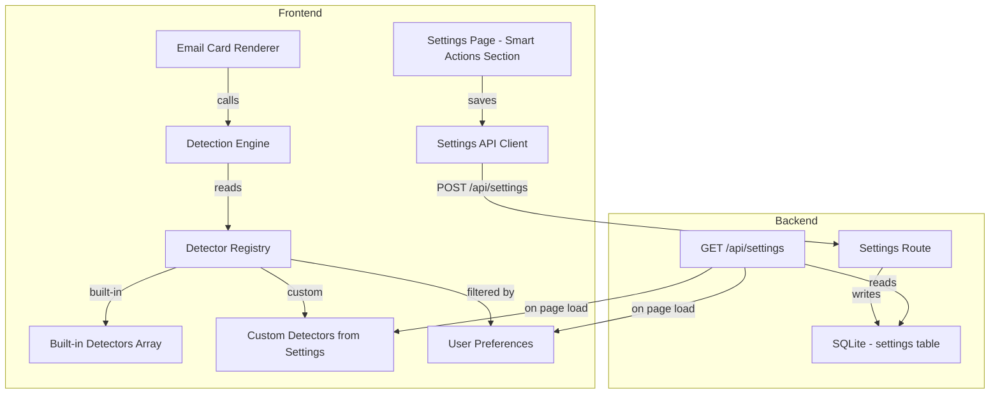

# Design Document: Email Smart Action Buttons

## Overview

This design extends the existing `shared-smart-links.js` detector registry into a fully configurable system. The current implementation already provides the core detection engine and built-in detectors for packages, flights, hotels, rentals, events, restaurants, and transit. This design adds:

1. **User configuration** — enable/disable detectors and categories via settings
2. **Custom detectors** — user-defined detectors persisted in the database
3. **Order confirmation category** — new built-in detectors for e-commerce
4. **Settings UI** — a dedicated section in the settings page for managing smart actions
5. **Backend persistence** — a new settings field for smart action preferences

The architecture keeps detection client-side (fast, no server round-trips per email) while persisting configuration server-side (survives across sessions/devices).

## Architecture



**Key architectural decisions:**

1. **Client-side detection** — Detection runs in the browser against already-loaded email text. No server calls per email. This keeps the system fast and offline-capable.
2. **Server-side configuration** — Preferences and custom detectors are stored in the existing settings table as a JSON field. This reuses the existing settings infrastructure with zero new tables.
3. **Single registry array** — Built-in and custom detectors live in the same array. Custom detectors are appended after built-ins with higher priority numbers (checked last within their category).
4. **Lazy initialization** — The registry is configured once on page load when settings are fetched. No per-email API calls.

## Components and Interfaces

### 1. Detection Engine (`shared-smart-links.js`)

Already exists. Modifications needed:

```javascript
/**
 * Initialize the detector registry with user preferences.
 * Called once after settings are loaded.
 *
 * @param {Object} config - Smart action configuration from settings
 * @param {Object} config.disabled - { detectorName: true } map of disabled detectors
 * @param {Array}  config.disabledCategories - ["Category1", ...] disabled categories
 * @param {Array}  config.customDetectors - Array of custom detector definitions
 * @param {number} config.maxResults - Max buttons per email card (default 3)
 */
function initSmartLinkRegistry(config) { ... }

/**
 * Existing function — no signature change.
 * Internally respects the initialized config (skips disabled detectors/categories).
 */
function detectSmartLinks(chit, options) { ... }
```

### 2. Settings Data Shape

New field on the Settings model: `smart_actions_config` (JSON string in SQLite).

```javascript
// Shape of smart_actions_config when deserialized:
{
    "disabled": {
        "USPS Intl": true,
        "Lyft": true
    },
    "disabledCategories": [],
    "maxResults": 3,
    "customDetectors": [
        {
            "id": "custom-1717000000000",
            "name": "My Pharmacy",
            "category": "Custom",
            "keywords": ["cvs pharmacy", "prescription ready"],
            "regex": "\\b(RX\\d{8,12})\\b",
            "url": "https://www.cvs.com/pharmacy/prescription-status?rx={code}",
            "label": "View",
            "icon": "/static/tracking/custom.svg",
            "priority": 50,
            "enabled": true
        }
    ]
}
```

### 3. Settings UI Component

A new section in `settings.html` / `settings.js`:

```
┌─────────────────────────────────────────────────┐
│ 🔗 Smart Actions                                │
├─────────────────────────────────────────────────┤
│ Max buttons per email: [3 ▾]                    │
│                                                 │
│ ▼ Package Tracking          [■ enabled]         │
│   ├ UPS                     [■]                 │
│   ├ FedEx                   [■]                 │
│   ├ USPS                    [■]                 │
│   ├ USPS Intl               [□]                 │
│   ├ DHL                     [■]                 │
│   ├ Amazon                  [■]                 │
│   ├ UniUni                  [■]                 │
│   ├ OnTrac                  [■]                 │
│   └ LaserShip               [■]                 │
│                                                 │
│ ▼ Flights                   [■ enabled]         │
│   └ Flight                  [■]                 │
│                                                 │
│ ▼ Hotels                    [■ enabled]         │
│   ├ Marriott                [■]                 │
│   ├ Hilton                  [■]                 │
│   └ ...                                        │
│                                                 │
│ ▼ Custom Detectors                              │
│   ├ My Pharmacy             [■] [✎] [🗑]       │
│   └ [+ Add Custom Detector]                    │
│                                                 │
└─────────────────────────────────────────────────┘
```

### 4. Custom Detector Form Modal

```
┌─────────────────────────────────────────────────┐
│ Add Custom Detector                             │
├─────────────────────────────────────────────────┤
│ Name:        [________________________]         │
│ Category:    [Custom ▾]                         │
│ Keywords:    [________________________]         │
│              (comma-separated, matched in email) │
│ Regex:       [________________________]         │
│              (must have one capture group)       │
│ URL Template:[________________________]         │
│              (use {code} for matched value)      │
│ Button Label:[View ▾]                           │
│ Icon:        [● Default ○ Package ○ Hotel ...]  │
│                                                 │
│              [Cancel]  [Save Detector]          │
└─────────────────────────────────────────────────┘
```

### 5. Backend Changes

**Model addition** (`models.py`):
```python
smart_actions_config: Optional[str] = None  # JSON string
```

**Migration** (`migrations.py`):
```python
def migrate_smart_actions_config():
    """Add smart_actions_config column to settings table."""
    # Standard pattern: check if column exists, ALTER TABLE if not
```

**Settings route** — no new endpoints needed. The existing `GET /api/settings/{user_id}` and `POST /api/settings` handle the new field automatically via the Pydantic model + `serialize_json_field`/`deserialize_json_field` pattern.

## Data Models

### Detector Definition (Built-in)

```javascript
{
    category: String,      // "Package" | "Flight" | "Hotel" | "Rental" | "Event" | "Restaurant" | "Transit" | "Order"
    name: String,          // Display name, e.g. "UPS"
    icon: String,          // Path to SVG, e.g. "/static/tracking/ups.svg"
    keywords: Array|null,  // Array of RegExp objects, or null for format-unique patterns
    regex: RegExp,         // Extraction regex — first capture group is the code
    url: String,           // URL template with {code} placeholder
    label: String,         // Button text: "Track", "Manage", "View", "Tickets", "Flight"
    priority: Number,      // Lower = checked first within category (default 10)
    _extract: Function|null // Optional custom extractor for multi-group regex
}
```

### Custom Detector Definition (User-created, stored as JSON)

```javascript
{
    id: String,            // Unique ID, e.g. "custom-" + Date.now()
    name: String,          // User-provided name
    category: String,      // "Custom" or user-chosen existing category
    keywords: Array,       // Array of keyword strings (converted to regex at runtime)
    regex: String,         // Regex as string (compiled at runtime)
    url: String,           // URL template with {code}
    label: String,         // Button label
    icon: String,          // Icon path (chosen from preset list)
    priority: Number,      // Default 50 (after all built-ins)
    enabled: Boolean       // Whether this custom detector is active
}
```

### Smart Actions Config (persisted in settings)

```javascript
{
    disabled: Object,           // { "detectorName": true } — disabled built-in detectors
    disabledCategories: Array,  // ["CategoryName"] — fully disabled categories
    maxResults: Number,         // Max buttons per email (default 3)
    customDetectors: Array      // Array of Custom Detector Definitions
}
```

### Smart Link Result (output of detection)

```javascript
{
    category: String,   // Category of the matched detector
    name: String,       // Provider name
    code: String,       // Extracted code/number
    url: String,        // Resolved URL (template with {code} replaced)
    icon: String,       // Icon path
    label: String       // Button label text
}
```


## Correctness Properties

*A property is a characteristic or behavior that should hold true across all valid executions of a system — essentially, a formal statement about what the system should do. Properties serve as the bridge between human-readable specifications and machine-verifiable correctness guarantees.*

### Property 1: Detection output correctness

*For any* email chit object containing text that matches a built-in detector's pattern (with keyword gate satisfied if applicable), the `detectSmartLinks` function SHALL return a Smart_Link object containing all required fields (category, name, code, url, icon, label) where the url contains the extracted code value.

**Validates: Requirements 1.2, 9.2**

### Property 2: Category uniqueness and result limiting

*For any* email chit that triggers matches across N distinct categories, and *for any* maxResults value M, the `detectSmartLinks` function SHALL return at most min(N, M) results, each from a distinct category, ordered by detector priority (lowest priority number first).

**Validates: Requirements 1.3, 3.1, 3.2, 3.3**

### Property 3: Keyword gate filtering

*For any* detector with a non-null keywords array, and *for any* email text that matches the detector's extraction regex but does NOT contain any of the detector's keyword patterns, the Detection_Engine SHALL NOT produce a match from that detector.

**Validates: Requirements 2.1**

### Property 4: Field-agnostic detection

*For any* detectable pattern string and *for any* placement of that pattern in exactly one of the four scanned fields (title, email_subject, email_body_text, email_from), the Detection_Engine SHALL produce a match.

**Validates: Requirements 2.3**

### Property 5: Priority ordering within category

*For any* email text that matches multiple detectors within the same category, the Detection_Engine SHALL return only the result from the detector with the lowest priority number in that category.

**Validates: Requirements 2.4**

### Property 6: Disabled detector and category exclusion

*For any* detector that is marked as disabled in the configuration, and *for any* email text that would otherwise match that detector, the Detection_Engine SHALL NOT include that detector's result. Similarly, *for any* category that is disabled, no detector in that category SHALL produce results regardless of email content.

**Validates: Requirements 5.1, 5.2**

### Property 7: Regex validation correctness

*For any* string input to the regex validation function, the function SHALL return true if and only if `new RegExp(input)` does not throw an exception.

**Validates: Requirements 7.4**

### Property 8: URL template validation correctness

*For any* string input to the URL template validation function, the function SHALL return true if and only if the string contains the literal substring `{code}`.

**Validates: Requirements 7.5**

## Error Handling

| Scenario | Handling |
|----------|----------|
| Settings API unreachable on page load | Use all built-in detectors with default (all enabled) state. Log warning to console. |
| Custom detector regex is invalid at runtime | Skip that detector, log error with detector name. Do not crash the detection loop. |
| Custom detector URL template missing {code} | Skip that detector at runtime (validation should prevent this at save time). |
| Icon SVG fails to load | `onerror` handler on `` replaces with a text-only fallback showing the label. |
| Empty email text (no subject, no body) | Return empty array immediately (existing behavior). |
| Malformed settings JSON | Fall back to defaults. Log error. |

## Testing Strategy

### Unit Tests (Example-based)

- Verify each built-in detector matches its expected pattern (one test per detector with a known-good input)
- Verify the custom _extract function for flights combines capture groups correctly
- Verify default behavior when no config is provided (all detectors active)
- Verify the settings UI form rejects empty required fields
- Verify icon fallback behavior on load error

### Property-Based Tests

Using the fast-check library (loaded via CDN for test files, or inline test runner):

- **Property 1**: Generate random email objects with embedded known patterns → verify output structure
- **Property 2**: Generate emails with N category patterns, vary maxResults → verify count and uniqueness
- **Property 3**: Generate text matching regex but missing keywords → verify no match
- **Property 4**: Place pattern in each field → verify detection
- **Property 5**: Generate text matching multiple same-category detectors → verify priority wins
- **Property 6**: Disable random detectors/categories → verify exclusion
- **Property 7**: Generate random strings → verify validation agrees with RegExp constructor
- **Property 8**: Generate random URL strings → verify validation agrees with {code} presence check

Each property test runs minimum 100 iterations.

Tag format: **Feature: email-smart-actions, Property N: [property text]**

### Integration Tests

- Save smart_actions_config via POST /api/settings, GET it back, verify round-trip
- Save custom detectors, reload settings, verify they appear in the response
- Verify migration adds the column without error on fresh and existing databases
