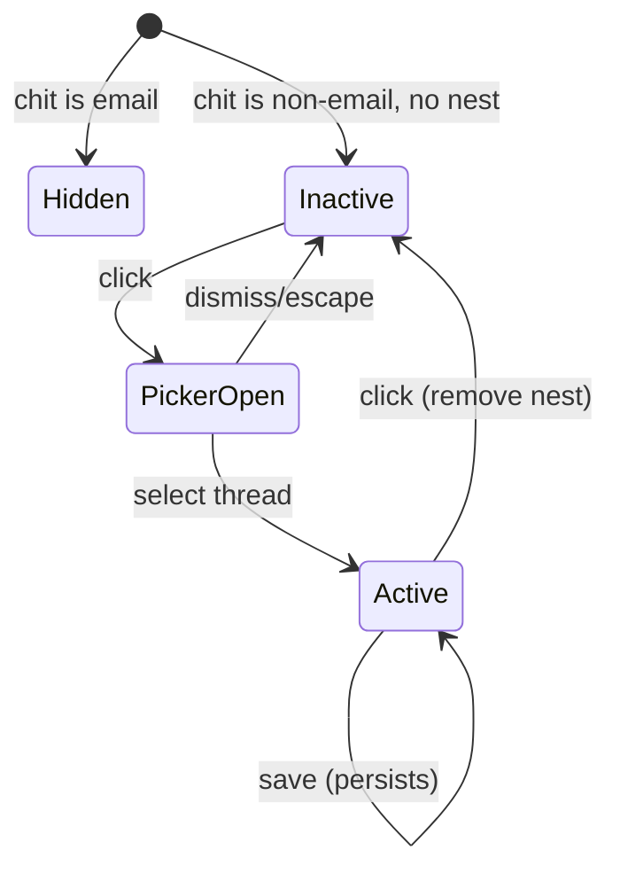
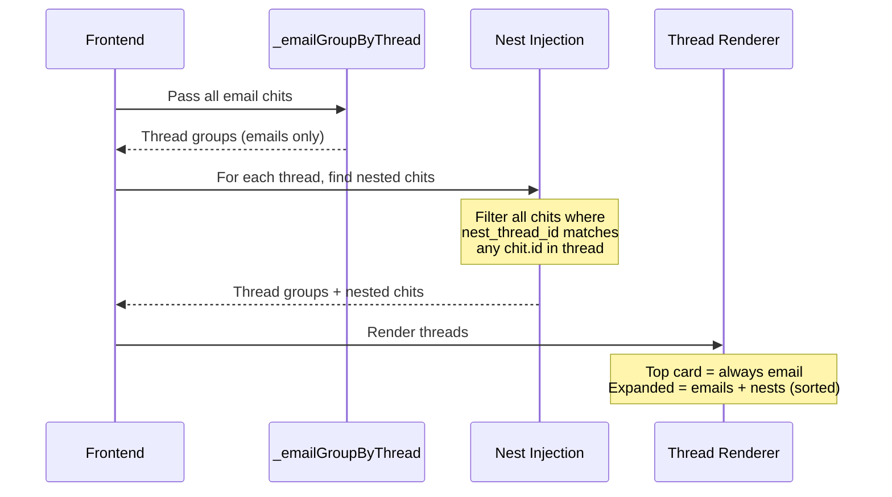

# Design Document — Email Thread Nests

## Overview

This design adds the ability to attach any non-email chit to an existing email thread via a `nest_thread_id` field. The nested chit then appears inline within the email thread's expanded view (both in the Email tab and the editor's thread display), bridging email conversations with tasks, notes, checklists, and other CWOC content.

The core approach is minimal: a single new column on the `chits` table, a nest button in the editor title row following the existing `status-icon-button` pattern, a thread picker modal for selection, and frontend injection of nested chits into the thread rendering pipeline after the existing `_emailGroupByThread()` algorithm runs.

### Key Design Decisions

1. **Single field on chit** — `nest_thread_id` stores the `id` of any email chit in the target thread. No junction table needed since a chit can only nest into one thread at a time.

2. **Frontend injection after threading** — The `_emailGroupByThread()` algorithm remains unchanged. After threads are grouped, nested chits are fetched and injected into the appropriate thread's message list before rendering. This keeps the threading algorithm clean.

3. **Nest button in title row** — Follows the existing `status-icon-button` pattern (like the pin button). Blue when active, muted brown when inactive. Shows first 15 chars of thread subject when active.

4. **Backend validation** — On save, the backend validates that `nest_thread_id` references an existing email chit. On permanent deletion of an email chit, any referencing `nest_thread_id` values are nulled out.

5. **Sorting within thread** — Nested chits sort by `due_date`, then `start_datetime`, then appear as the first item after the top email if no dates exist. They never appear as the topmost card of a collapsed thread.

---

## Architecture

### Data Flow

```mermaid
graph TB
    subgraph "Editor (Vanilla JS)"
        NB[Nest Button<br/>editor-nest.js]
        TP[Thread Picker Modal]
    end

    subgraph "Email Tab (Dashboard)"
        TG[_emailGroupByThread<br/>Groups emails into threads]
        NI[Nest Injection<br/>Injects nested chits into threads]
        TR[Thread Renderer<br/>_buildThreadedEmailCard]
    end

    subgraph "FastAPI Backend"
        CC[Chit CRUD<br/>routes/chits.py]
        TE[Thread Endpoint<br/>routes/email.py]
        RT[Recent Threads<br/>GET /api/email/threads/recent]
        MG[Migration<br/>migrations.py]
    end

    subgraph "Storage"
        DB[(SQLite<br/>chits.nest_thread_id)]
    end

    NB -->|Click: open picker| TP
    TP -->|Select thread| NB
    NB -->|Save: PUT /api/chits/{id}| CC
    CC -->|Validate nest_thread_id| DB
    RT -->|Query recent threads| DB
    TP -->|GET /api/email/threads/recent| RT

    TG -->|Thread groups| NI
    NI -->|Enriched threads| TR
    TE -->|Include nested chits| DB
```

### Nest Button State Machine



### Thread Rendering with Nests



---

## Components and Interfaces

### Backend Components

#### 1. Migration: `migrate_add_nest_thread_id()` (in `migrations.py`)

Adds `nest_thread_id` TEXT column to the `chits` table with NULL default, following the existing column-existence-check pattern.

```python
def migrate_add_nest_thread_id():
    conn = None
    try:
        conn = sqlite3.connect(DB_PATH)
        cursor = conn.cursor()
        cursor.execute("PRAGMA table_info(chits)")
        columns = [col[1] for col in cursor.fetchall()]
        if "nest_thread_id" not in columns:
            cursor.execute("ALTER TABLE chits ADD COLUMN nest_thread_id TEXT DEFAULT NULL")
            conn.commit()
            logger.info("Added nest_thread_id column to chits table")
    except Exception as e:
        logger.error(f"Error adding nest_thread_id column: {str(e)}")
        raise
    finally:
        if conn:
            conn.close()
```

#### 2. Model Update (in `models.py`)

Add to the `Chit` class:

```python
nest_thread_id: Optional[str] = None  # ID of an email chit in the target thread
```

#### 3. Chit CRUD Validation (in `routes/chits.py`)

On PUT/POST when `nest_thread_id` is non-null:
- Query the referenced chit by ID
- Verify it exists and has `email_message_id IS NOT NULL OR email_status IS NOT NULL`
- If invalid, return 422 with `"nest_thread_id must reference an existing email chit"`

On permanent delete of an email chit:
- `UPDATE chits SET nest_thread_id = NULL WHERE nest_thread_id = ?` (the deleted chit's ID)

#### 4. New Endpoint: `GET /api/email/threads/recent` (in `routes/email.py`)

Returns the 20 most recent email threads for the thread picker.

**Parameters:**
- `q` (optional query string) — case-insensitive substring filter on subject

**Response format:**
```json
[
  {
    "thread_id": "chit-id-of-newest-email",
    "subject": "Re: Project Update",
    "latest_date": "2026-06-15T10:30:00Z",
    "message_count": 5
  }
]
```

**Implementation:** Uses the same `_strip_email_prefixes()` normalization to group by subject, then returns the 20 most recent groups sorted by latest `email_date` descending.

#### 5. Updated Endpoint: `GET /api/email/thread/{chit_id}` (in `routes/email.py`)

Extended to include nested chits in the response:
- After finding all thread members, query: `SELECT * FROM chits WHERE nest_thread_id IN (thread_member_ids) AND (deleted = 0 OR deleted IS NULL)`
- Each nested chit in the response gets an additional `is_nest: true` flag
- Nested chits include: `id`, `title`, `note` (first 100 chars), `status`, `due_datetime`, `start_datetime`, `checklist` (summary), `is_nest`

### Frontend Components

#### 1. `src/frontend/js/editor/editor-nest.js` — Nest Button Logic

New editor script following the pattern of other editor zone scripts.

**Functions:**
- `initNestButton(chit)` — Set up nest button state based on `chit.nest_thread_id`
- `_nestButtonClick()` — Toggle: if active, remove nest; if inactive, open picker
- `_nestOpenPicker()` — Fetch recent threads, render modal
- `_nestSelectThread(threadId, subject)` — Set nest_thread_id, update button, mark dirty
- `_nestRemove()` — Clear nest_thread_id, update button, mark dirty
- `_nestTruncateSubject(subject)` — Return first 15 chars (or full if shorter)
- `getNestData()` — Return current nest_thread_id for save
- `_nestIsEmailChit(chit)` — Return true if chit has email_message_id or email_status

**Button HTML** (added to `editor.html` in the `pinned-archived-group` div, after owner chip, before email button):
```html
<button type="button" id="nestButton" class="status-icon-button" onclick="_nestButtonClick()" title="Nest into email thread" style="display:none;">
    <i class="fas fa-dove"></i>
    <span id="nestButtonLabel" class="nest-button-label"></span>
</button>
<input type="hidden" id="nestThreadId" value="" />
```

#### 2. Thread Picker Modal

A CWOC-styled modal (parchment background, brown border, Lora font) with:
- Search input at top (filters as you type)
- Scrollable list of recent threads (subject + date)
- Click to select, Escape to dismiss
- Mobile-friendly with 44px minimum tap targets

```html
<template id="tmpl-nest-thread-picker">
    <div class="cwoc-modal-overlay" id="nestThreadPickerOverlay">
        <div class="cwoc-modal nest-thread-picker-modal">
            <h3>Select Email Thread</h3>
            <input type="text" id="nestPickerSearch" placeholder="Filter by subject..." class="nest-picker-search" />
            <div class="nest-picker-list" id="nestPickerList"></div>
            <button type="button" class="zone-button" onclick="_nestClosePicker()">Cancel</button>
        </div>
    </div>
</template>
```

#### 3. Nest Injection in Email Tab (`main-email.js`)

New function `_emailInjectNests(threads)` called after `_emailGroupByThread()`:
- Filters all loaded chits to find those with non-null `nest_thread_id`
- For each nested chit, finds the thread containing the referenced chit ID
- Injects the nested chit into that thread's messages array with a `_isNest = true` flag
- Sorts nested chits within the thread by: `due_date` → `start_datetime` → position after top email

Modified `_toggleThreadExpand()`:
- When rendering expanded thread messages, checks `_isNest` flag
- Nested chits render with `_buildNestedChitCard()` instead of `_buildEmailCard()`

New function `_buildNestedChitCard(chit)`:
- Renders a card with nest icon, chit title, content preview
- Uses same card structure as email cards but with nest-specific indicators
- Click navigates to editor

Modified `_buildThreadedEmailCard()`:
- Thread count badge includes nested chits in total
- Top card selection always picks an email chit (never a nested chit)

#### 4. Nest Injection in Editor Thread View

The editor's email zone thread display (which calls `GET /api/email/thread/{chit_id}`) already receives nested chits from the updated backend endpoint. The frontend renders items with `is_nest: true` using the same `_buildNestedChitCard()` pattern.

#### 5. CSS: `src/frontend/css/editor/editor-nest.css`

Styles for:
- `.nest-button-label` — smaller font, ellipsis overflow, max-width
- `.nest-button-active` — blue color matching pinned button active state
- `.nest-thread-picker-modal` — parchment modal styling
- `.nest-picker-search` — search input styling
- `.nest-picker-list` — scrollable list with max-height
- `.nest-picker-item` — individual thread entry (44px min height for touch)
- `.email-nest-card` — nested chit card in thread view (subtle left border tint)
- `.email-nest-icon` — nest icon styling

---

## Data Models

### Chit Model Change

New field on the `Chit` class in `models.py`:

```python
nest_thread_id: Optional[str] = None  # ID of an email chit in the target thread
```

### SQLite Schema Change

**Migration: `migrate_add_nest_thread_id()`**

| Column | Type | Default | Description |
|--------|------|---------|-------------|
| `nest_thread_id` | TEXT | NULL | References the `id` of an email chit in the target thread |

### Validation Rules

1. **On save (PUT/POST):** If `nest_thread_id` is non-null, the referenced chit must exist and be an email chit (`email_message_id IS NOT NULL OR email_status IS NOT NULL`)
2. **On delete:** When an email chit is permanently deleted, all chits with `nest_thread_id` pointing to it get their `nest_thread_id` set to NULL
3. **Email chits cannot nest:** A chit with `email_message_id` or `email_status` set cannot have a `nest_thread_id` (enforced in frontend by hiding the button; backend rejects if attempted)

### Thread Picker Response Model

```python
class ThreadSummary(BaseModel):
    thread_id: str          # ID of the newest email chit in the thread
    subject: str            # Normalized thread subject
    latest_date: str        # ISO 8601 date of newest message
    message_count: int      # Number of emails in thread
```

### Nested Chit in Thread Response

Extended response from `GET /api/email/thread/{chit_id}`:

```json
{
  "id": "chit-uuid",
  "title": "Follow up on proposal",
  "note_preview": "Need to review the budget...",
  "status": "In Progress",
  "due_datetime": "2026-06-20T09:00:00",
  "start_datetime": null,
  "is_nest": true
}
```

---

## Correctness Properties

*A property is a characteristic or behavior that should hold true across all valid executions of a system — essentially, a formal statement about what the system should do. Properties serve as the bridge between human-readable specifications and machine-verifiable correctness guarantees.*

### Property 1: Nest Reference Validation

*For any* chit being saved with a non-null `nest_thread_id`, the save SHALL succeed if and only if the referenced ID corresponds to an existing chit that has a non-null `email_message_id` or a non-null `email_status`. If the referenced chit does not exist or is not an email chit, the save SHALL be rejected.

**Validates: Requirements 1.4**

### Property 2: Cascade Cleanup on Delete

*For any* email chit that is permanently deleted, all chits in the database whose `nest_thread_id` equals the deleted chit's ID SHALL have their `nest_thread_id` set to NULL after the deletion completes. No other chits' `nest_thread_id` values SHALL be affected.

**Validates: Requirements 1.5**

### Property 3: Subject Label Truncation

*For any* string used as a thread subject label, the displayed text SHALL be the first 15 characters of the string if the string length exceeds 15, or the full string if the length is 15 or fewer. The result SHALL never exceed 15 characters.

**Validates: Requirements 2.5, 2.6**

### Property 4: Nest Button Visibility

*For any* chit, the nest button SHALL be hidden (not displayed) if and only if the chit has a non-null `email_message_id` or a non-null `email_status`. For all other chits, the nest button SHALL be visible.

**Validates: Requirements 2.7**

### Property 5: Thread Search Filtering

*For any* search query string and any set of email threads, the filtered results SHALL contain exactly those threads whose subject contains the query as a case-insensitive substring. No thread whose subject does not contain the query SHALL appear in the results.

**Validates: Requirements 3.3, 7.5**

### Property 6: Nested Chit Thread Membership

*For any* email thread (a set of email chits grouped by message IDs/references/subject), the expanded view SHALL include exactly those non-email chits whose `nest_thread_id` matches the `id` of any email chit in that thread. No chit with a `nest_thread_id` referencing a chit outside the thread SHALL appear.

**Validates: Requirements 5.1, 6.1**

### Property 7: Nested Chit Sort Order

*For any* set of nested chits within a thread, they SHALL be sorted such that: chits with a `due_date` sort by `due_date` ascending, then chits with only `start_datetime` sort by `start_datetime` ascending, then chits with neither date appear after the thread's top-level email. Within each group, the relative order SHALL be stable.

**Validates: Requirements 5.2**

### Property 8: Top Card Invariant

*For any* email thread containing one or more nested chits, the topmost visible card of the collapsed thread SHALL always be an email chit (a chit with non-null `email_message_id` or `email_status`). A nested chit SHALL never be selected as the top card regardless of its dates or other properties.

**Validates: Requirements 5.3**

### Property 9: Inbox Exclusion Invariant

*For any* set of chits displayed in the email inbox list (the non-expanded view), no chit with a non-null `nest_thread_id` SHALL appear as an independent entry. Nested chits SHALL only be visible within their associated thread's expanded view.

**Validates: Requirements 5.4**

### Property 10: Nest Thread ID API Round-Trip

*For any* valid `nest_thread_id` value (referencing an existing email chit), saving it via `PUT /api/chits/{id}` and then retrieving the chit via `GET /api/chits` SHALL return the same `nest_thread_id` value. Setting `nest_thread_id` to null and saving SHALL result in the field being absent or null in subsequent retrieval.

**Validates: Requirements 7.1, 7.2**

### Property 11: Thread Endpoint Includes Nests

*For any* email thread queried via `GET /api/email/thread/{chit_id}`, the response SHALL include all non-deleted chits whose `nest_thread_id` references any chit in that thread, each with `is_nest` set to `true`. Email chits in the response SHALL have `is_nest` absent or set to `false`.

**Validates: Requirements 7.3**

---

## Error Handling

### Backend Errors

| Error Scenario | Handling |
|----------------|----------|
| `nest_thread_id` references non-existent chit | Return 422: `"nest_thread_id references a chit that does not exist"` |
| `nest_thread_id` references a non-email chit | Return 422: `"nest_thread_id must reference an email chit (has email_message_id or email_status)"` |
| `nest_thread_id` set on an email chit | Return 422: `"Email chits cannot be nested into threads — they already belong to threads natively"` |
| Thread picker query fails | Return 500: `"Failed to load recent threads"` |
| Referenced thread has no emails (all deleted) | On next save, validation fails with 422; frontend shows toast explaining the thread no longer exists |

### Frontend Errors

| Error Scenario | Handling |
|----------------|----------|
| Thread picker fetch fails | Show red toast: `"Could not load email threads. Check your connection."` |
| Save with invalid nest_thread_id (422 from backend) | Show red toast with backend error message; revert nest button to previous state |
| Thread picker returns empty list | Show message in picker: `"No email threads found. Send or receive emails first."` |
| Nested chit's thread no longer exists (orphaned reference) | Nest button shows "(thread deleted)" in muted text; clicking removes the association |

### Edge Cases

| Scenario | Behavior |
|----------|----------|
| User nests a chit, then the email thread gets more messages | Nest remains valid — `nest_thread_id` points to any chit in the thread, and the threading algorithm finds all members |
| User nests a chit into thread A, then the referenced email gets moved to trash | Nest remains valid as long as the email chit exists (even if soft-deleted). Only permanent deletion triggers cleanup |
| Multiple chits nested into the same thread | All appear in the expanded view, sorted by the date rules |
| Chit with nest_thread_id is itself deleted | Normal soft-delete behavior; it no longer appears in thread views (filtered by `deleted = 0`) |

---

## Testing Strategy

### Property-Based Tests

Property-based testing is appropriate for this feature because it contains pure functions with clear input/output behavior (subject truncation, sort ordering, filtering, validation logic) and universal invariants (top card rule, inbox exclusion, thread membership).

**Library:** `hypothesis` (already available in the project's test environment)

**Configuration:** Minimum 100 iterations per property test.

**Tag format:** `Feature: email-thread-nests, Property {number}: {property_text}`

| Property | Test Location | What It Tests |
|----------|---------------|---------------|
| 1 | `test_email_nests.py` | Nest reference validation logic |
| 2 | `test_email_nests.py` | Cascade cleanup on email chit deletion |
| 3 | `test_email_nests.py` | `_nestTruncateSubject()` truncation |
| 4 | `test_email_nests.py` | `_nestIsEmailChit()` visibility logic |
| 5 | `test_email_nests.py` | Thread search filtering (backend endpoint) |
| 6 | `test_email_nests.py` | Thread membership injection logic |
| 7 | `test_email_nests.py` | Nested chit sort order within thread |
| 8 | `test_email_nests.py` | Top card invariant (never a nest) |
| 9 | `test_email_nests.py` | Inbox exclusion (nests never shown independently) |
| 10 | `test_email_nests.py` | API round-trip for nest_thread_id |
| 11 | `test_email_nests.py` | Thread endpoint includes nests with is_nest flag |

### Unit Tests (Example-Based)

| Test | What It Verifies |
|------|------------------|
| Migration adds column without error | Schema change (Req 1.1, 1.2) |
| Migration is idempotent (run twice) | No error on second run (Req 1.2) |
| Chit model has nest_thread_id field | Model definition (Req 1.3) |
| Nest button hidden for email chit | UI visibility (Req 2.7) |
| Nest button shows subject label when active | UI state (Req 2.5) |
| Thread picker opens on inactive button click | UI interaction (Req 3.1) |
| Thread picker closes on Escape | ESC handling (Req 3.6) |
| Clicking active nest button removes association | Toggle behavior (Req 4.1) |
| Nested chit card shows nest icon | Visual indicator (Req 5.5) |
| Thread count badge includes nested chits | Count accuracy (Req 5.9) |
| Recent threads endpoint returns max 20 | Pagination limit (Req 7.4) |

### Integration Tests

| Test | What It Verifies |
|------|------------------|
| Full nest lifecycle: create chit → nest → save → retrieve → un-nest → save | End-to-end CRUD (Req 1–4, 7) |
| Thread expansion with nested chits | Frontend injection + rendering (Req 5, 6) |
| Delete email chit cascades to nested chits | Cleanup logic (Req 1.5) |

### Test File Location

All nest-related tests go in `src/backend/test_email_nests.py`, following the existing test file pattern.
