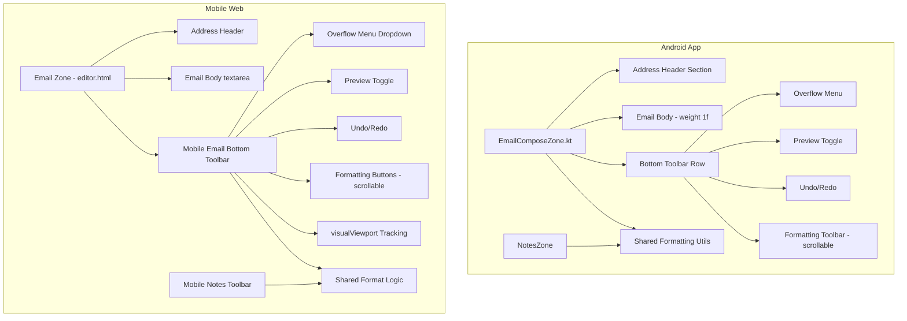

# Design Document: Email Zone Notes Parity

## Overview

This design brings the Email zone's body editing experience in line with the Notes zone's established pattern on App (Android) and Mobile (mobile web browser) platforms. The core change: replace the Email zone's scattered inline action buttons and missing formatting tools with the same bottom-pinned toolbar system that Notes uses — content fills the space, toolbar is always accessible at the bottom, actions live in a compact overflow menu.

**Platform scope:** App (Android) + Mobile (mobile web browser). Desktop web (>768px) is unchanged.

**Key principles adopted from Notes zone:**
1. Content fills available space — body uses `weight(1f)` (App) or auto-grow (Mobile)
2. Toolbar is always at the bottom — pinned above keyboard, never scrolls away
3. Two modes — Edit (full toolbar) and Preview (minimal toolbar)
4. Actions in overflow menu — not inline buttons, keeps toolbar compact
5. Formatting is horizontally scrollable — fits any screen width
6. Shared formatting logic — identical behavior between Notes and Email zones

## Architecture

### High-Level Component Structure



### Layout Architecture (Both Platforms)

```
┌─────────────────────────────────────────┐
│ Zone Header: ✉️ Email    [collapse ▼]   │
├─────────────────────────────────────────┤
│ Address Header (scrollable if >40% ht)  │
│   From: dropdown / read-only            │
│   To: [chip] [chip] [input___]  CC BCC  │
│   CC/BCC: collapsible                   │
│   Subject: text input                   │
├─────────────────────────────────────────┤
│                                         │
│  Body (fills remaining space)           │
│  - Edit: markdown textarea              │
│  - Preview: rendered markdown/HTML      │
│                                         │
├─────────────────────────────────────────┤
│ Bottom Toolbar (pinned above keyboard)  │
│ [⋮][👁][↺][↻] | [B][I][S][🔗][H▾][•][1.][❝▾] │
│                  ↑ scrollable ──────→   │
└─────────────────────────────────────────┘
```

## Components and Interfaces

### Android App Components

#### 1. EmailComposeZone.kt (Restructured)

The existing `EmailComposeZone.kt` will be restructured from its current flat Column layout to the Notes zone's three-section pattern:

```kotlin
// New structure
Column(modifier) {
    // Section 1: Address Header (fixed height, scrollable if tall)
    AddressHeaderSection(...)  // From, To, CC/BCC, Subject
    
    // Section 2: Body (fills remaining space)
    EmailBodyContent(
        modifier = Modifier.weight(1f),
        ...
    )
    
    // Section 3: Bottom Toolbar (pinned)
    EmailBottomToolbar(
        modifier = Modifier
            .imePadding()
            .navigationBarsPadding(),
        ...
    )
}
```

**Key interfaces:**

| Composable | Responsibility |
|---|---|
| `AddressHeaderSection` | From dropdown, To chips, CC/BCC toggle, Subject — scrollable if content exceeds 40% zone height |
| `EmailBodyContent` | OutlinedTextField (edit) or MarkdownRenderer (preview), weight(1f) |
| `EmailBottomToolbar` | Overflow menu, preview toggle, undo/redo, scrollable formatting buttons |
| `EmailOverflowMenu` | Context-dependent dropdown (draft/received/sent items) |

#### 2. Shared Formatting Utilities

Extract formatting logic from `NotesZone` into shared utility functions:

```kotlin
// New file: EmailNotesFormatUtils.kt (or add to existing shared utils)
object MarkdownFormatUtils {
    fun applyWrapFormat(textFieldValue: TextFieldValue, delimiter: String): TextFieldValue
    fun applyLinkFormat(textFieldValue: TextFieldValue): TextFieldValue
    fun applyHeadingFormat(textFieldValue: TextFieldValue, level: Int): TextFieldValue
    fun applyLinePrefixFormat(textFieldValue: TextFieldValue, prefix: String, numbered: Boolean): TextFieldValue
    fun applyBlockquoteFormat(textFieldValue: TextFieldValue): TextFieldValue
    fun applyHorizontalRule(textFieldValue: TextFieldValue): TextFieldValue
}
```

#### 3. Undo/Redo State Management

Same pattern as NotesZone — stack-based with max 50 entries:

```kotlin
data class UndoState(val text: String, val selection: TextRange)

// In EmailComposeZone composable state:
var undoStack by remember { mutableStateOf(listOf<UndoState>()) }
var redoStack by remember { mutableStateOf(listOf<UndoState>()) }
```

### Mobile Web Components

#### 1. `_createMobileEmailToolbar()` (New function in editor-email.js)

Mirrors `_createMobileNotesToolbar()` from editor-notes.js. Creates and injects a bottom-pinned toolbar for the email body when on mobile (≤768px).

**Toolbar structure:**
- Data/Actions button (⋮) → context-dependent dropdown
- Preview/Edit toggle (👁/✏️)
- Undo button (↺)
- Redo button (↻)
- Separator
- Scrollable formatting buttons: Bold, Italic, Strikethrough, Link, Heading▾, Bullet, Numbered, Block▾

#### 2. Keyboard Tracking

Uses the same `visualViewport` resize event pattern as the Notes toolbar:
- `_onEmailTextareaFocus()` — show toolbar, start tracking
- `_onEmailTextareaBlur()` — hide toolbar (with 150ms delay for button taps)
- `_positionEmailToolbarAboveKeyboard()` — position using `visualViewport.height + offsetTop`
- `_onMobileEmailViewportResize()` — reposition on viewport changes

#### 3. Overflow Menu Dropdowns

Three context-dependent dropdown menus (same pattern as Notes data menu):
- **Draft menu:** Send, Send Later, Send & Archive, PGP Encrypt toggle, Copy body, Discard draft
- **Received menu:** Reply, Forward, Archive, Copy body, Download, Add sender to contacts
- **Sent menu:** Forward, Copy body, Download

#### 4. Shared Formatting (Already Exists)

The web already shares formatting logic — `_notesFormatBtn()` calls `_emailFormatBtn()` from editor-email.js. The new mobile email toolbar will call `_emailFormatBtn(action, 'emailBody')` directly.

## Data Models

### Android App State

No new persistent data models. All state is in-memory composable state:

```kotlin
// Email body editing state (mirrors NotesZone pattern)
data class EmailEditState(
    val textFieldValue: TextFieldValue,    // Current text + selection
    val undoStack: List<UndoState>,        // Max 50 entries
    val redoStack: List<UndoState>,        // Cleared on new edit
    val isPreviewMode: Boolean,            // Edit vs Preview toggle
    val lastUndoTimestamp: Long,           // For 500ms debounce
    val lastWordBoundary: Int              // For word-boundary undo trigger
)

data class UndoState(
    val text: String,
    val selection: TextRange
)
```

### Mobile Web State

No new persistent data. In-memory state variables (same pattern as Notes):

```javascript
// Module-level state in editor-email.js
var _mobileEmailToolbarEl = null;        // Toolbar DOM element
var _mobileEmailDataMenu = null;         // Overflow dropdown
var _mobileEmailHeadingMenu = null;      // Heading dropdown
var _mobileEmailBlockMenu = null;        // Block formatting dropdown
var _mobileEmailIsPreview = false;       // Preview mode flag
var _mobileEmailKeyboardOpen = false;    // Keyboard state
var _mobileEmailZoneActive = false;      // Zone visibility state
```

### Existing Data (Unchanged)

The `ChitFormState` (Android) and chit API model (web) already have all needed fields:
- `emailBodyText` / `email_body_text` — markdown body content
- `emailBodyHtml` / `email_body_html` — HTML content for received emails
- `emailStatus` / `email_status` — "draft" | "received" | "sent"
- `emailFrom`, `emailTo`, `emailCc`, `emailBcc`, `emailSubject` — address fields

No schema changes, no migrations, no API changes required.


## Correctness Properties

*A property is a characteristic or behavior that should hold true across all valid executions of a system — essentially, a formal statement about what the system should do. Properties serve as the bridge between human-readable specifications and machine-verifiable correctness guarantees.*

### Property 1: Formatting produces identical output regardless of zone context

*For any* text content and *for any* valid selection range (start ≤ end ≤ text.length), applying a formatting action (bold, italic, strikethrough, link, heading, bullet list, numbered list, blockquote, code, horizontal rule) through the shared formatting utility SHALL produce the same resulting text and cursor position regardless of whether it is invoked from the Notes zone or the Email zone.

**Validates: Requirements 2.2, 2.3, 2.4, 10.3**

### Property 2: Undo/Redo round trip preserves state

*For any* sequence of text edits that trigger undo pushes, performing an undo followed by a redo SHALL restore the text content and cursor position to the state that existed before the undo was performed. Conversely, *for any* state on the undo stack, performing undo SHALL restore the text to that previous state exactly.

**Validates: Requirements 3.2, 3.3**

### Property 3: New edit clears redo stack

*For any* non-empty redo stack, when a new edit is made to the email body that triggers an undo push (500ms elapsed or word boundary crossed), the redo stack SHALL become empty and the undo stack SHALL grow by exactly one entry containing the pre-edit state.

**Validates: Requirements 3.6**

### Property 4: Preview/Edit round trip preserves content

*For any* email body text content in edit mode, switching to preview mode and then back to edit mode SHALL preserve the text content exactly (byte-for-byte identical to the original).

**Validates: Requirements 4.2**

## Error Handling

### Android App

| Scenario | Handling |
|---|---|
| Undo stack overflow (>50 entries) | Discard oldest entry silently — FIFO eviction |
| Formatting applied with invalid selection range | Clamp selection to valid bounds (0..text.length), apply at clamped position |
| Preview toggle with empty body | Show empty rendered view (no error) |
| Send tapped with empty To field | Button is disabled — prevented at UI level |
| Discard cancelled | Dismiss dialog, retain draft unchanged |
| Overflow menu item tapped for unavailable action | Item rendered disabled, tap is no-op |

### Mobile Web

| Scenario | Handling |
|---|---|
| visualViewport API unavailable | Fall back to `position:fixed; bottom:0` (toolbar may be behind keyboard on older browsers) |
| Toolbar button tapped while textarea not focused | Buttons appear disabled, no action taken |
| Formatting applied to empty textarea | Insert delimiters at position 0 |
| Dropdown menu open + keyboard closes | Dismiss dropdown, hide toolbar |
| Web Share API unavailable (for Share action) | Fall back to clipboard copy with toast notification |

## Testing Strategy

### Unit Tests (Example-Based)

Focus on specific scenarios and edge cases:

- **Toolbar visibility states:** Verify toolbar shows/hides correctly for each email status (draft/received/sent) and mode (edit/preview)
- **Overflow menu content:** Verify correct menu items appear for each email status
- **Button disabled states:** Verify Send is disabled when To is empty, Undo disabled when stack empty
- **Preview toggle:** Verify mode switches correctly for draft (markdown) and received (HTML/text)
- **Address header:** Verify read-only display for received/sent emails
- **Desktop unchanged:** Verify no bottom toolbar appears when viewport >768px

### Property Tests

Property-based testing applies to the shared formatting logic and undo/redo state management:

- **Library:** fast-check (JavaScript) for web, or manual property-style tests for Kotlin
- **Minimum iterations:** 100 per property
- **Tag format:** `Feature: email-zone-notes-parity, Property {N}: {description}`

**Property 1 — Formatting identity:** Generate random strings (0-5000 chars including unicode, newlines, existing markdown), random valid selection ranges, and random formatting actions. Verify the shared function produces identical output when called with the same inputs.

**Property 2 — Undo/Redo round trip:** Generate random sequences of 1-20 text edits (insertions, deletions, replacements at random positions). After each edit, push to undo stack. Then perform undo followed by redo and verify state restoration.

**Property 3 — Edit clears redo:** Generate a sequence of edits, perform 1-5 undos (creating redo entries), then make a new edit. Verify redo stack is empty after the new edit.

**Property 4 — Preview round trip:** Generate random markdown strings (including headings, lists, links, code blocks, special characters). Toggle to preview and back. Verify text is byte-identical.

### Integration Tests

- **Keyboard tracking (Mobile):** Manual test on physical device — verify toolbar stays above keyboard during typing
- **imePadding (App):** Manual test on physical device — verify toolbar stays above keyboard
- **End-to-end compose flow:** Draft an email with formatting, preview it, undo some changes, send via overflow menu

### What's NOT Tested via PBT

- Layout positioning (toolbar pinned to bottom) — visual/smoke test
- Button ordering — example test
- Icon styling and spacing — visual inspection
- Keyboard open/close detection — platform integration test
- Desktop web unchanged — smoke test at 769px+ viewport

