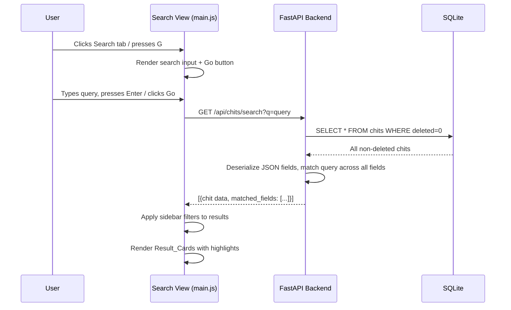

# Design Document: Global Chit Search

## Overview

Global Chit Search adds a cross-category search capability to the CWOC dashboard. Currently, the sidebar "Search" input filters chits only within the active C CAPTN tab. This feature introduces:

1. A new **Search tab** (magnifying glass icon, last in the tab bar) that opens a dedicated search view
2. A **Search API endpoint** (`GET /api/chits/search?q=...`) that performs server-side full-text search across all chit fields
3. **Result cards** showing matched field names with highlighted match text
4. Renaming the sidebar "Search" label to "Filter by Words" to clarify the distinction

The search is server-side to enable efficient querying across all fields including JSON-serialized ones (tags, people, checklist, alerts). The frontend renders results as cards with match metadata.

## Architecture



The architecture follows the existing pattern: backend provides data via REST API, frontend handles rendering and filtering. The search endpoint does the heavy lifting of searching across all fields (including JSON-serialized ones), while the frontend applies additional sidebar filters and renders highlighted results.

## Components and Interfaces

### Backend: Search API Endpoint

**Endpoint:** `GET /api/chits/search`

**Query Parameters:**
- `q` (string, required): The search query text

**Response:** JSON array of search result objects:
```json
[
  {
    "chit": { /* full chit object */ },
    "matched_fields": ["title", "note", "tags"]
  }
]
```

**Implementation approach:**
- Fetch all non-deleted chits from SQLite (same query as `GET /api/chits`)
- For each chit, deserialize JSON fields (tags, people, checklist, alerts, recurrence_rule, recurrence_exceptions)
- Perform case-insensitive substring matching of `q` against each field's string representation
- For array fields (tags, people), check each element individually
- For checklist, check each item's `text` field
- For alerts, check each alert's description/label fields
- Return matching chits with the list of field names that matched

**Searchable fields:** title, note, tags (each tag name), status, priority, severity, location, people (each person name), checklist items (each item text), start_datetime, end_datetime, due_datetime, created_datetime, modified_datetime, color, alert descriptions

### Frontend: Search Tab

A new tab element appended after the Notes tab in `index.html`:
- Icon: Font Awesome `fa-search` (magnifying glass)
- Label: "Global Search"
- Hotkey: `G`
- `onclick`: calls `filterChits('Search')`

### Frontend: Search View

A new `displaySearchView()` function in `main.js` that renders:

1. **Search bar area** — a text input (`#global-search-input`) and a Go button, styled with CWOC parchment aesthetic
2. **Results area** — Result_Cards rendered below the search bar

**State management:**
- `_globalSearchResults` — array of search result objects from the API
- `_globalSearchQuery` — the current search query string

**Search flow:**
1. User types query and presses Enter or clicks Go
2. Frontend calls `GET /api/chits/search?q=...`
3. Response stored in `_globalSearchResults`
4. Results filtered through existing sidebar filter functions (`_applyMultiSelectFilters`, `_applyArchiveFilter`)
5. Results rendered as Result_Cards with highlighted match text

### Frontend: Result Card

Each Result_Card displays:
- Chit title (using `_buildChitHeader` for consistency)
- Chit color as background (when present)
- For each matched field: field name label + field value excerpt with `<mark>` highlighting on the matched portion
- Click handler navigates to editor (`/frontend/editor.html?id={chitId}`)

### Frontend: Highlight Function

A pure function `highlightMatch(text, query)` that:
- Takes a text string and a query string
- Returns HTML with all occurrences of the query wrapped in `<mark>` tags
- Performs case-insensitive matching
- HTML-escapes the text before inserting `<mark>` tags to prevent XSS
- Returns the original text unchanged if query is empty

### Frontend: Label Rename

- Sidebar filter label: "Search" → "Filter by Words"
- Sidebar hotkey hint: "W" → "D"
- Hotkey panel option: "Search Words" → "Filter by Words"
- Reference overlay: update "Words" entry under Filter section
- Help page: update any references to the sidebar "Search" label
- Hotkey binding: "D" key in filter submenu focuses the Filter_By_Words_Input (replacing "W")

## Data Models

No new database tables or columns are needed. The search operates on the existing `chits` table.

**Search Result Object** (API response):
```python
# Not a Pydantic model — just a dict returned from the endpoint
{
    "chit": {
        "id": str,
        "title": str | None,
        "note": str | None,
        "tags": list[str] | None,
        # ... all existing chit fields
    },
    "matched_fields": list[str]  # e.g. ["title", "note", "tags"]
}
```

**Frontend state variables** (added to `main.js`):
```javascript
let _globalSearchResults = [];  // Array of {chit, matched_fields}
let _globalSearchQuery = '';    // Current search query
```

## Correctness Properties

*A property is a characteristic or behavior that should hold true across all valid executions of a system — essentially, a formal statement about what the system should do. Properties serve as the bridge between human-readable specifications and machine-verifiable correctness guarantees.*

### Property 1: Search completeness and soundness

*For any* non-deleted chit and *for any* substring of any searchable field value on that chit, searching for that substring SHALL return that chit in the results, AND every chit in the results SHALL contain the query string in at least one searchable field.

**Validates: Requirements 3.1, 3.3, 3.4, 7.5**

### Property 2: Case-insensitive matching

*For any* search query string, the set of chits returned SHALL be identical regardless of the case of the query characters (i.e., searching for "hello", "HELLO", and "HeLLo" returns the same results).

**Validates: Requirements 3.2**

### Property 3: matched_fields accuracy

*For any* search query and *for any* chit in the results, the `matched_fields` array SHALL contain exactly the field names where the query string appears as a case-insensitive substring, and no other field names.

**Validates: Requirements 3.6, 7.2**

### Property 4: Deleted chits exclusion

*For any* search query, no chit with `deleted = true` SHALL appear in the search results.

**Validates: Requirements 7.3**

### Property 5: Highlight function preserves text

*For any* text string and *for any* query string, the `highlightMatch` function SHALL produce output that, when stripped of `<mark>` and `</mark>` tags, equals the HTML-escaped original text.

**Validates: Requirements 4.4**

### Property 6: Sidebar filter intersection

*For any* set of search results and *for any* sidebar filter configuration, the displayed results SHALL equal the subset of search results that also satisfy all active sidebar filter criteria.

**Validates: Requirements 5.2**

## Error Handling

| Scenario | Handling |
|---|---|
| Search API returns HTTP error | Display error message in results area, log to console |
| Empty search query submitted | Do not call API, show no results (frontend guard) |
| API `q` parameter missing/empty | Return empty array `[]` (backend guard) |
| Network failure during search | Show "Search failed — check connection" message |
| Chit with malformed JSON fields | Backend `deserialize_json_field` returns `None`, field is skipped during search |
| Very long search query | No explicit limit — SQLite handles string comparison efficiently |
| XSS in search query | `highlightMatch` HTML-escapes text before inserting `<mark>` tags |

## Testing Strategy

### Unit Tests (Example-Based)

- Search tab renders in correct position with correct icon and label
- Search view shows input + Go button on initial load
- Input receives focus on view activation
- Enter key triggers search
- Empty query returns no results
- Result cards display chit title and matched fields
- Click on result card navigates to editor
- No-results state shows empty message
- Sidebar filters remain visible during search
- Label rename appears correctly in sidebar, hotkey panel, and reference overlay
- "G" hotkey activates search tab
- "D" hotkey focuses filter input in filter submenu

### Property-Based Tests

Property-based tests use Python's built-in `unittest` with randomized test data generation (no external PBT library needed given the project constraints of no npm/no pip installs). Each test generates random chit data and query strings to verify universal properties.

- **Property 1**: Search completeness — generate random chits, pick random substrings from field values, verify search returns the chit
- **Property 2**: Case insensitivity — generate random queries, verify same results regardless of case
- **Property 3**: matched_fields accuracy — generate random chits and queries, verify matched_fields lists exactly the correct fields
- **Property 4**: Deleted exclusion — generate chits with deleted=true, verify they never appear in results
- **Property 5**: Highlight preservation — generate random text and query strings, verify stripped output equals escaped input
- **Property 6**: Sidebar filter intersection — generate random results and filter states, verify correct intersection

Minimum 100 iterations per property test. Each test tagged with:
`Feature: global-chit-search, Property {N}: {description}`
