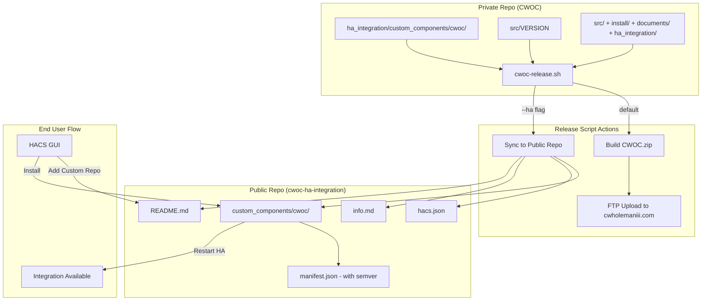

# Design Document: HACS Distribution for CWOC HA Integration

## Overview

This design covers the packaging and distribution layer that makes the existing CWOC Home Assistant integration installable via HACS (Home Assistant Community Store). The approach uses a dedicated public GitHub repository (`cwoc-ha-integration`) that contains only the integration files and HACS metadata, synced from the private main CWOC repo via a release script.

The system has three main components:
1. **Public repository structure** — the file layout HACS expects
2. **Metadata files** — `hacs.json`, updated `manifest.json`, `info.md`, `README.md`
3. **Release script** — `cwoc-release.sh` that builds the server zip, uploads via FTP, and optionally syncs the HA integration to the public repo

### Design Decisions

- **Separate public repo** rather than making the main repo public: keeps backend/frontend code private while satisfying HACS's requirement for a public GitHub repository.
- **No `zip_release`**: HACS will clone the repo directly. Simpler than managing zip artifacts.
- **Semver in manifest.json**: HACS requires semantic versioning. Since CWOC uses `YYYYMMDD.HHMM` internally, the HA integration maintains its own semver (`major.minor.patch`) that gets bumped manually when syncing. This avoids complex date-to-semver conversion and gives the integration its own meaningful version history.
- **Single release script** handles both server deployment (zip + FTP) and HA sync (file copy + version update). The `--ha` flag activates HA sync, keeping the common case (server-only release) fast.
- **No software installation required**: the release script uses only standard bash utilities (`zip`, `curl`, `sed`, `cp`, `git`) available on any Linux/macOS dev machine.

## Architecture



## Components and Interfaces

### 1. Public Repository File Layout

```
cwoc-ha-integration/          (Public GitHub repo root)
├── custom_components/
│   └── cwoc/
│       ├── __init__.py
│       ├── manifest.json     (HACS-compatible, with semver version)
│       ├── config_flow.py
│       ├── const.py
│       ├── coordinator.py
│       ├── sensor.py
│       ├── services.py
│       ├── services.yaml
│       ├── strings.json
│       ├── icons.json
│       └── translations/
│           └── en.json
├── hacs.json                 (HACS manifest)
├── info.md                   (HACS store listing)
└── README.md                 (GitHub landing page + install instructions)
```

### 2. HACS Manifest (`hacs.json`)

```json
{
  "name": "C.W.'s Omni Chits",
  "render_readme": true,
  "homeassistant": "2024.1.0",
  "content_in_root": false
}
```

- `content_in_root: false` — integration lives in `custom_components/cwoc/`, the standard HACS location for integrations.
- `render_readme: true` — HACS renders the README as the store page (in addition to `info.md`).
- `homeassistant` — minimum HA version. Set conservatively to 2024.1.0.

### 3. Updated Integration Manifest (`manifest.json`)

```json
{
  "domain": "cwoc",
  "name": "C.W.'s Omni Chits",
  "version": "1.0.0",
  "config_flow": true,
  "documentation": "https://github.com/cwhiii/cwoc-ha-integration",
  "requirements": [],
  "codeowners": ["@cwhiii"],
  "iot_class": "local_polling",
  "issue_tracker": "https://github.com/cwhiii/cwoc-ha-integration/issues"
}
```

Changes from current manifest:
- `documentation` → points to public repo (was local IP)
- `codeowners` → `["@cwhiii"]` (was empty)
- `issue_tracker` → added, points to public repo issues

### 4. Release Script (`cwoc-release.sh`)

**Location**: `ha_integration/cwoc-release.sh` in the private repo.

**Interface**:
```
Usage: cwoc-release.sh [OPTIONS]

Options:
  --ha          Sync HA integration to public repo after zip upload
  --push        (requires --ha) Auto-commit, push, and tag the public repo
  --help        Show this help message

Environment:
  Reads FTP credentials from ~/.cwoc-release.conf
  Reads version from src/VERSION (relative to script's parent directory)
  Public repo path: ../cwoc-ha-integration (sibling directory)
```

**Config file** (`~/.cwoc-release.conf`):
```bash
FTP_HOST="ftp.example.com"
FTP_USER="username"
FTP_PASS="password"
FTP_PATH="/code/cwoc/releases/"
```

**Execution phases**:

1. **Validation** — check `src/VERSION` exists, config file exists, required directories exist
2. **Build zip** — create `CWOC.zip` containing `src/`, `install/`, `documents/`, `ha_integration/`
3. **FTP upload** — upload `CWOC.zip` to configured host/path via `curl`
4. **HA sync** (if `--ha`) — copy integration files to public repo, update version in `manifest.json`
5. **Git operations** (if `--ha --push`) — commit, tag, push to public repo; otherwise print manual instructions

### 5. Documentation Files

**`info.md`** — HACS store listing. Brief, focused on what the integration does and how to set it up.

**`README.md`** — Full documentation for the GitHub landing page. Sections:
- Features (sensors + services)
- Installation via HACS (step-by-step)
- Manual Installation (fallback)
- Configuration (config flow walkthrough)
- Updating (HACS handles it)

## Data Models

### Version Mapping

| Context | Format | Example | Source |
|---------|--------|---------|--------|
| CWOC internal | `YYYYMMDD.HHMM` | `20260512.1135` | `src/VERSION` |
| HA integration (manifest.json) | Semver `major.minor.patch` | `1.0.0` | Manually bumped in release script |
| GitHub release tag | `v{semver}` | `v1.0.0` | Created by release script |

The release script prompts for the new semver version when `--ha` is used, or accepts it via `--version X.Y.Z`. This keeps version management explicit — the developer decides when a sync warrants a major/minor/patch bump.

### FTP Config Schema (`~/.cwoc-release.conf`)

```bash
# Required fields
FTP_HOST="ftp.cwholemaniii.com"
FTP_USER="<username>"
FTP_PASS="<password>"
FTP_PATH="/code/cwoc/releases/"

# Optional
PUBLIC_REPO_PATH="../cwoc-ha-integration"
```

## Error Handling

### Release Script Error Cases

| Condition | Behavior |
|-----------|----------|
| `src/VERSION` missing or empty | Exit with: `"ERROR: src/VERSION not found or empty"` |
| `~/.cwoc-release.conf` missing | Exit with: `"ERROR: FTP config not found at ~/.cwoc-release.conf"` |
| Source directory missing (for zip) | Exit with: `"ERROR: Required directory not found: <dir>"` |
| FTP upload fails | Exit with: `"ERROR: FTP upload failed to <host> — <curl error>"` |
| `--ha` but public repo path doesn't exist | Exit with: `"ERROR: Public repo not found at <path>"` |
| `--ha` but `manifest.json` not writable | Exit with: `"ERROR: Cannot update manifest.json at <path>"` |
| `--ha --push` but git push fails | Exit with error, leave local changes committed (user can retry push) |

All errors exit with non-zero status code. Progress messages use a consistent format:
```
[cwoc-release] Building CWOC.zip...
[cwoc-release] Uploading to FTP...
[cwoc-release] ✓ Upload complete
[cwoc-release] Syncing HA integration...
[cwoc-release] ✓ HA sync complete (v1.0.0)
```

## Testing Strategy

**PBT is NOT applicable for this feature.** This is infrastructure/packaging work consisting of:
- Static file layout (repository structure)
- JSON configuration files (hacs.json, manifest.json)
- A bash release script with side effects (file I/O, FTP, git)
- Documentation files (markdown)

None of these involve pure functions with meaningful input variation. The release script is side-effect-heavy (network calls, file system operations, git commands), and the metadata files are static configuration validated by HACS itself.

### Recommended Testing Approach

1. **Manual validation** — Run the release script in dry-run mode, verify file layout matches HACS expectations
2. **HACS validation** — After first publish, add the repo in HACS and verify it validates successfully
3. **Smoke test** — Install via HACS on a test HA instance, confirm the integration appears and configures correctly
4. **Script error paths** — Manually test each error condition (missing config, missing VERSION, bad FTP creds) to verify descriptive error messages

### Validation Checklist (post-implementation)

- [ ] `hacs.json` passes HACS validation (correct fields, no extras)
- [ ] `manifest.json` has all required HACS fields (version, codeowners, documentation, issue_tracker)
- [ ] Public repo structure matches `custom_components/cwoc/` layout
- [ ] Release script builds zip correctly (contains expected directories)
- [ ] Release script uploads to FTP successfully
- [ ] Release script syncs files to public repo with `--ha`
- [ ] GitHub release tag matches manifest version
- [ ] HACS can add the repo as a custom repository
- [ ] Integration installs and appears in HA after restart
