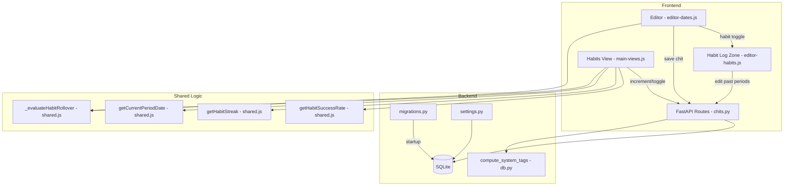

# Design Document: Habits Overhaul

## Overview

This design replaces CWOC's implicit habit inference (any recurring chit = habit) with an explicit opt-in model using a `habit` boolean flag. The overhaul introduces goal/progress tracking (`habit_goal`, `habit_success`), per-habit calendar visibility (`show_on_calendar`), auto-tagging, period rollover with historical snapshots, retroactive editing via a Habit Log zone, and performance charts — all while removing the legacy `hide_when_instance_done` field.

**Key design decisions:**
- **Lazy rollover** — period transitions are evaluated on view/editor load, not via background processes. This avoids scheduler complexity and ensures the system works even when the server is offline.
- **Recurrence exceptions as history store** — existing `recurrence_exceptions` array is extended with `habit_success` and `habit_goal` fields per entry, reusing the proven pattern rather than adding a new table.
- **No installs** — charts use vanilla JS with `<canvas>` elements. No charting libraries.
- **Table rebuild for column removal** — SQLite doesn't support `DROP COLUMN` in older versions, so removing `hide_when_instance_done` uses the standard copy-to-temp, recreate, copy-back pattern.

## Architecture



**Data flow for habit interactions:**
1. User checks "Track as habit" → editor auto-enables Repeat (Daily default), reveals goal/progress/calendar controls
2. User increments progress in Habits View → PATCH to `/api/chits/{id}` updates `habit_success`
3. When `habit_success >= habit_goal` → backend/frontend auto-sets status to "Complete"
4. On next period load → lazy rollover snapshots current progress into `recurrence_exceptions`, resets `habit_success` to 0

## Components and Interfaces

### Backend Components

#### 1. Pydantic Model Changes (`models.py`)

```python
class Chit(BaseModel):
    # ... existing fields ...
    habit: Optional[bool] = False
    habit_goal: Optional[int] = 1
    habit_success: Optional[int] = 0
    show_on_calendar: Optional[bool] = True
    # REMOVED: hide_when_instance_done
```

```python
class Settings(BaseModel):
    # ... existing fields ...
    default_show_habits_on_calendar: Optional[str] = "1"  # "1" = enabled, "0" = disabled
```

#### 2. Migration Function (`migrations.py`)

```python
def migrate_habits_overhaul():
    """Add habit fields to chits, add setting, remove hide_when_instance_done via table rebuild."""
```

The migration performs these steps:
1. Add `habit` (BOOLEAN DEFAULT 0), `habit_goal` (INTEGER DEFAULT 1), `habit_success` (INTEGER DEFAULT 0), `show_on_calendar` (BOOLEAN DEFAULT 1) columns to chits (with existence checks)
2. Add `default_show_habits_on_calendar` (TEXT DEFAULT '1') column to settings
3. Remove `hide_when_instance_done` column via table rebuild:
   - Create `chits_backup` with all columns except `hide_when_instance_done`
   - Copy data from `chits` to `chits_backup`
   - Drop `chits`
   - Rename `chits_backup` to `chits`
   - Recreate indexes

#### 3. System Tags Extension (`db.py`)

Extend `compute_system_tags()` to add `Habits` and `Habits/[title]` tags when `habit=True`:

```python
def compute_system_tags(chit) -> List[str]:
    # ... existing logic ...
    if getattr(chit, 'habit', False) or (isinstance(chit, dict) and chit.get('habit')):
        system_tags.append("Habits")
        title = getattr(chit, 'title', None) or (chit.get('title') if isinstance(chit, dict) else None)
        if title:
            system_tags.append(f"Habits/{title}")
    return list(set(user_tags + system_tags))
```

#### 4. Chit CRUD Updates (`routes/chits.py`)

- Add `habit`, `habit_goal`, `habit_success`, `show_on_calendar` to INSERT/UPDATE/SELECT statements
- Remove all references to `hide_when_instance_done`
- Serialize `habit` as integer (0/1) for SQLite boolean storage
- On GET, deserialize `habit`, `show_on_calendar` as Python booleans

#### 5. Settings Updates (`routes/settings.py`)

- Add `default_show_habits_on_calendar` to the settings INSERT/SELECT/UPDATE flow

### Frontend Components

#### 6. Editor Habit Controls (`editor-dates.js`)

New UI elements in the Dates zone:
- "Track as habit" checkbox — always visible, below the Repeat row
- Goal numeric input (min=1, default=1) — visible when habit=true
- Progress display "X / Y" — visible when habit=true
- "Show on calendar" toggle — visible when habit=true

Behavior:
- Checking "Track as habit" when Repeat is off → auto-enable Repeat with DAILY
- While habit=true → Repeat checkbox is disabled (locked checked)
- Unchecking "Track as habit" → hide goal/progress/calendar controls

#### 7. Habit Log Zone (`editor-habits.js` — new file)

A new collapsible zone in the editor (visible only when `habit=true`):
- **Period history list** — reverse chronological, showing date + "X / Y" for each past period
- **Editable counts** — click a count to edit it inline, updates the recurrence exception
- **Charts** — 2-column grid of `<canvas>` elements:
  - Completion over time (bar chart: habit_success per period, with habit_goal line)
  - Success rate trend (line chart: rolling percentage)
  - Streak history (timeline visualization)

#### 8. Habits View Update (`main-views.js`)

Replace the existing `displayHabitsView()` function:
- Filter by `chit.habit === true` (not by `recurrence_rule` presence)
- Remove "Show completed" toggle and `hide_when_instance_done` logic
- New card layout:
  - Goal=1: checkbox interaction (tap to toggle complete)
  - Goal>1: counter with +/− buttons
  - Display: progress "X/Y", frequency, streak 🔥, success rate %, status badge
- Lazy rollover: call `_evaluateHabitRollover(chit)` before rendering

#### 9. Period Rollover Logic (`shared.js`)

New function `_evaluateHabitRollover(chit)`:
```javascript
function _evaluateHabitRollover(chit) {
    // 1. Get current period date for this habit
    // 2. Check if last recorded period in exceptions matches current
    // 3. If not: snapshot current habit_success/habit_goal into exception for ended period
    // 4. Reset habit_success to 0, clear Complete status if set
    // 5. Return whether rollover occurred (caller decides whether to save)
}
```

#### 10. Updated Habit Metrics (`shared.js`)

Rewrite `getHabitSuccessRate()` and `getHabitStreak()` to use the new `habit_success`/`habit_goal` fields from recurrence exceptions instead of just checking `completed: true`.

#### 11. Calendar Filtering (`main-calendar.js`, `shared-calendar.js`)

Add filter: exclude chits where `habit === true && show_on_calendar === false`.

#### 12. Settings Page (`settings.js`, `settings.html`)

Add to the existing Habits section:
- "Default: show habits on calendar" toggle (checkbox)
- Persist as `default_show_habits_on_calendar` in settings

## Data Models

### Chit Table Schema (after migration)

| Column | Type | Default | Description |
|--------|------|---------|-------------|
| habit | BOOLEAN | 0 | Explicit habit opt-in flag |
| habit_goal | INTEGER | 1 | Completions per period target |
| habit_success | INTEGER | 0 | Current period completion count |
| show_on_calendar | BOOLEAN | 1 | Whether habit appears on calendar |
| ~~hide_when_instance_done~~ | ~~BOOLEAN~~ | — | **REMOVED** |

### Settings Table Schema (additions)

| Column | Type | Default | Description |
|--------|------|---------|-------------|
| default_show_habits_on_calendar | TEXT | "1" | Default for new habits' show_on_calendar |

### Recurrence Exception Entry (extended)

```json
{
  "date": "2025-01-15",
  "completed": true,
  "habit_success": 3,
  "habit_goal": 3,
  "broken_off": false
}
```

The `habit_success` and `habit_goal` fields are added to each exception entry during period rollover. Legacy entries (without these fields) are treated as: if `completed=true` then success=goal (met), else success=0 (missed).

### API Request/Response Changes

**PUT /api/chits/{id}** — accepts new fields:
```json
{
  "habit": true,
  "habit_goal": 3,
  "habit_success": 2,
  "show_on_calendar": true
}
```

**GET /api/chits** — returns new fields on each chit object.

**POST /api/settings** — accepts:
```json
{
  "default_show_habits_on_calendar": "1"
}
```

## Correctness Properties

*A property is a characteristic or behavior that should hold true across all valid executions of a system — essentially, a formal statement about what the system should do. Properties serve as the bridge between human-readable specifications and machine-verifiable correctness guarantees.*

### Property 1: Habit auto-enables repeat

*For any* chit where `habit` is set to `true` and no recurrence rule exists, the system SHALL auto-create a recurrence rule with `freq: 'DAILY'` and `interval: 1`.

**Validates: Requirements 1.2, 12.3**

### Property 2: Goal completion triggers Complete status

*For any* habit chit where `habit_success` is incremented to equal `habit_goal`, the system SHALL set the chit's status to "Complete".

**Validates: Requirements 2.5, 5.1**

### Property 3: Un-Complete resets habit_success

*For any* habit chit whose status is changed from "Complete" to any other value (or cleared), the system SHALL reset `habit_success` to 0.

**Validates: Requirements 2.6, 5.2**

### Property 4: Habit tags bidirectional sync

*For any* chit with a non-empty title, the chit's computed tags SHALL contain "Habits" and "Habits/[title]" if and only if `habit` is `true`.

**Validates: Requirements 3.1, 3.2**

### Property 5: Habit title change updates tag

*For any* habit chit whose title changes from `oldTitle` to `newTitle`, the computed tags SHALL contain "Habits/[newTitle]" and SHALL NOT contain "Habits/[oldTitle]".

**Validates: Requirements 3.3**

### Property 6: Habits view filters by habit flag only

*For any* set of chits, the Habits view SHALL display exactly those chits where `habit === true`, regardless of whether they have a `recurrence_rule`.

**Validates: Requirements 4.1, 14.1, 16.3**

### Property 7: Habits view sort order

*For any* set of habit chits, incomplete habits (where `habit_success < habit_goal`) SHALL appear before completed habits (where `habit_success >= habit_goal`) in the rendered list.

**Validates: Requirements 4.5**

### Property 8: Habit_success capped at habit_goal

*For any* habit chit, `habit_success` SHALL never exceed `habit_goal`. Any attempt to increment beyond the goal SHALL result in `habit_success === habit_goal`.

**Validates: Requirements 5.3**

### Property 9: Decrement below goal clears Complete

*For any* habit chit that was auto-completed (status="Complete" due to reaching goal), decrementing `habit_success` below `habit_goal` SHALL clear the "Complete" status.

**Validates: Requirements 5.4**

### Property 10: Period rollover preserves history and resets

*For any* habit chit where the current period has advanced past the last recorded period, the system SHALL: (a) create a recurrence exception entry containing the previous period's `habit_success` and `habit_goal` values, (b) reset `habit_success` to 0, and (c) clear "Complete" status if set.

**Validates: Requirements 6.2, 6.3, 6.4**

### Property 11: Calendar visibility matches show_on_calendar

*For any* habit chit, its inclusion in calendar view rendering SHALL equal the value of its `show_on_calendar` field — `true` means included, `false` means excluded.

**Validates: Requirements 7.3, 7.4**

### Property 12: Success rate calculation

*For any* habit chit and any success window value, the success rate SHALL equal `round((periods where habit_success >= habit_goal) / (total non-broken-off periods within window) * 100)`, returning 0 when no periods exist. Broken-off periods SHALL be excluded from both numerator and denominator.

**Validates: Requirements 8.1, 8.2, 8.3, 8.4, 8.5, 8.6, 8.7**

### Property 13: Streak calculation

*For any* habit chit, the streak SHALL equal the count of consecutive periods (walking backward from the most recent past period) where `habit_success >= habit_goal`. Broken-off periods SHALL be skipped (neutral — neither break nor count). The streak SHALL stop at the first genuinely missed period.

**Validates: Requirements 9.1, 9.2, 9.3**

### Property 14: Retroactive edit updates exception

*For any* past period edit, updating the `habit_success` value SHALL persist the new value in the corresponding recurrence exception entry, and the streak and success rate SHALL reflect the updated value.

**Validates: Requirements 11.3, 11.4**

### Property 15: Habit log reverse chronological order

*For any* habit chit with multiple past periods, the Habit Log SHALL display periods sorted by date descending (most recent first).

**Validates: Requirements 11.5**

### Property 16: Migration idempotency and data preservation

*For any* database state, running `migrate_habits_overhaul()` multiple times SHALL produce no errors, the new columns SHALL exist, `hide_when_instance_done` SHALL NOT exist, and all other chit data SHALL be preserved unchanged.

**Validates: Requirements 13.7, 13.9**

### Property 17: Chit CRUD round-trip for habit fields

*For any* valid combination of `habit`, `habit_goal`, `habit_success`, and `show_on_calendar` values, saving a chit and then loading it SHALL return the same values.

**Validates: Requirements 13.10**

## Error Handling

| Scenario | Handling |
|----------|----------|
| `habit_goal` set to 0 or negative | Frontend enforces min=1; backend clamps to 1 |
| `habit_success` set to negative | Frontend enforces min=0; backend clamps to 0 |
| `habit_success` exceeds `habit_goal` | Capped at `habit_goal` on save |
| Migration fails mid-rebuild | Transaction wraps the entire table rebuild; rollback on error preserves original table |
| Legacy chits without habit fields | Default values (habit=false, habit_goal=1, habit_success=0, show_on_calendar=true) applied on read |
| Recurrence exceptions without habit_success/habit_goal | Treated as: completed=true → met goal, else missed |
| Period rollover during concurrent edits | Rollover is evaluated client-side before save; server accepts whatever values the client sends |
| Chart rendering with no data | Charts display "No data yet" placeholder |
| Title with special characters in auto-tag | Tags are stored as-is (CWOC already handles special chars in tags) |

## Testing Strategy

### Property-Based Tests (Python stdlib `unittest` + `random`)

Each property test runs **minimum 100 iterations** with randomly generated inputs. No external libraries (no hypothesis, no pip installs).

**Test file:** `src/backend/test_habits.py`

Tests will cover:
- **Property 2**: Generate random `habit_goal` (1–100), set `habit_success` = `habit_goal`, verify status auto-set to "Complete"
- **Property 3**: Generate random non-Complete statuses, verify `habit_success` resets to 0
- **Property 4**: Generate random titles, verify tag computation includes/excludes Habits tags based on `habit` flag
- **Property 5**: Generate random old/new titles, verify tag update
- **Property 6**: Generate random chit sets (mixed habit/recurring), verify filter correctness
- **Property 7**: Generate random habit sets, verify sort order
- **Property 8**: Generate random goals, attempt to exceed, verify cap
- **Property 10**: Generate random habit states, simulate rollover, verify snapshot + reset
- **Property 12**: Generate random period histories, verify success rate formula
- **Property 13**: Generate random period sequences, verify streak count
- **Property 16**: Run migration multiple times, verify idempotency
- **Property 17**: Generate random field combinations, verify round-trip

**Tag format:** `Feature: habits-overhaul, Property {N}: {title}`

### Unit Tests (Example-Based)

- Editor UI state transitions (habit toggle reveals/hides controls)
- Repeat lock behavior when habit=true
- Chart rendering with known data sets
- Settings page load/save cycle
- Empty state rendering

### Integration Tests

- Full chit CRUD cycle with habit fields via API
- Migration on a populated database
- Calendar filtering with show_on_calendar=false habits

### Dual Testing Approach

- **Property tests** verify universal correctness across all inputs (success rate formula, streak algorithm, tag computation, rollover logic)
- **Unit tests** verify specific UI behaviors, edge cases, and integration points
- Together they provide comprehensive coverage without over-testing any single aspect
