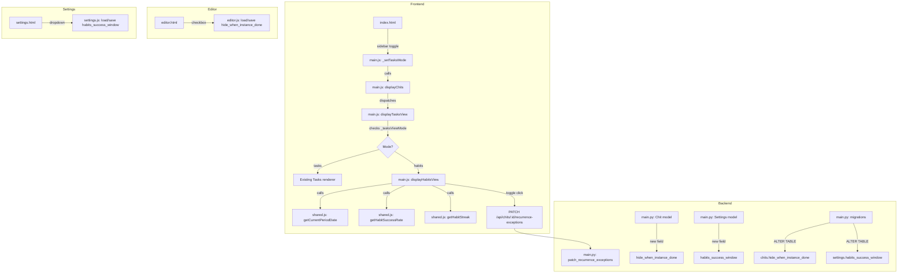

# Design Document: Habits View

## Overview

The Habits view adds a new view mode to the existing Tasks tab, allowing users to track recurring chits as habits. Instead of expanding recurrences into individual calendar instances, the Habits view shows one card per recurring chit with at-a-glance metrics: a completion toggle for the current period, a success rate badge over a configurable rolling window, and a streak counter.

The feature touches all layers of the stack — a new boolean column on chits, a new settings field, three new helper functions in `shared.js`, a new view renderer in `main.js`, sidebar toggle HTML, editor checkbox, and settings dropdown — but follows every existing pattern exactly. No new files, no new endpoints, no new dependencies.

### Key Design Decisions

1. **Reuse the Tasks tab** rather than creating a new top-level tab. The Habits view is a view mode toggle within Tasks, identical to how Projects has List/Kanban and Alarms has Chits/Independent.
2. **No recurrence expansion.** Unlike the Calendar view which calls `expandRecurrence()`, the Habits view works directly with the parent chit and its `recurrence_exceptions` array. This keeps the card count manageable and avoids virtual instance complexity.
3. **Current period calculation lives in `shared.js`** as `getCurrentPeriodDate(chit)` so it can be reused by both the Habits renderer and any future feature that needs period awareness.
4. **Success rate and streak are pure functions** of the chit's `recurrence_rule`, `recurrence_exceptions`, start date, and the current date. No server-side computation needed — all calculations happen client-side.
5. **Completion toggling reuses the existing `PATCH /api/chits/{chit_id}/recurrence-exceptions` endpoint.** No new API routes required.

## Architecture



### Data Flow

1. User switches to Tasks tab → sidebar shows "Tasks" / "Habits" toggle buttons
2. User clicks "Habits" → `_setTasksMode('habits')` stores preference in localStorage, calls `displayChits()`
3. `displayChits()` reaches the Tasks case in the switch → `displayTasksView(filteredChits)` checks `_tasksViewMode`
4. If `'habits'`, dispatches to `displayHabitsView(filteredChits)` which:
   - Filters to chits with `recurrence_rule.freq`
   - For each chit, calls `getCurrentPeriodDate(chit)` to get the YYYY-MM-DD key
   - Checks `recurrence_exceptions` for a completed entry matching that date
   - Calls `getHabitSuccessRate(chit, windowDays)` and `getHabitStreak(chit)` for metrics
   - Renders a habit card with checkbox, title, frequency, success badge, streak
5. Checkbox toggle → PATCH to existing endpoint → re-fetch chits → re-render

## Components and Interfaces

### 1. Sidebar Toggle (index.html)

A new `<div class="sidebar-section" id="section-tasks-mode">` following the exact pattern of `section-kanban` and `section-alarms-mode`:

```html
<div class="sidebar-section" id="section-tasks-mode" style="display:none;">
    <label class="sidebar-section-label">View Mode</label>
    <div style="display:flex;gap:4px;">
        <button class="action-button" id="tasks-mode-tasks"
                onclick="_setTasksMode('tasks')"
                style="flex:1;margin-bottom:0;font-size:0.8em;padding:6px;background:ivory;">
            📋 Tasks
        </button>
        <button class="action-button" id="tasks-mode-habits"
                onclick="_setTasksMode('habits')"
                style="flex:1;margin-bottom:0;font-size:0.8em;padding:6px;">
            🔁 Habits
        </button>
    </div>
</div>
```

Visibility controlled in the tab-switch function: `section-tasks-mode` shown when `tab === 'Tasks'`, hidden otherwise.

### 2. View Mode State (main.js)

```javascript
let _tasksViewMode = localStorage.getItem('cwoc_tasksViewMode') || 'tasks';

function _setTasksMode(mode) {
  _tasksViewMode = mode;
  localStorage.setItem('cwoc_tasksViewMode', mode);
  const tasksBtn = document.getElementById('tasks-mode-tasks');
  const habitsBtn = document.getElementById('tasks-mode-habits');
  if (tasksBtn) tasksBtn.style.background = mode === 'tasks' ? 'ivory' : '';
  if (habitsBtn) habitsBtn.style.background = mode === 'habits' ? 'ivory' : '';
  displayChits();
}
```

`_restoreViewModeButtons()` extended to sync Tasks mode buttons on init.

### 3. displayTasksView Dispatch (main.js)

The existing `displayTasksView` function gets a mode check at the top:

```javascript
function displayTasksView(chitsToDisplay) {
  if (_tasksViewMode === 'habits') {
    return displayHabitsView(chitsToDisplay);
  }
  // ... existing Tasks renderer unchanged ...
}
```

### 4. displayHabitsView(chitsToDisplay) (main.js)

New function that:
- Filters `chitsToDisplay` to only chits with `chit.recurrence_rule && chit.recurrence_rule.freq`
- Reads `habits_success_window` from `window._cwocSettings` (loaded at init)
- For each habit chit:
  - Calls `getCurrentPeriodDate(chit)` → `periodDate` (YYYY-MM-DD)
  - Checks `recurrence_exceptions` for `{ date: periodDate, completed: true }`
  - Calls `getHabitSuccessRate(chit, windowDays)` → percentage
  - Calls `getHabitStreak(chit)` → streak count
  - Renders a habit card with: checkbox, title link, frequency label, success badge, streak indicator
- Sorts: incomplete habits first, completed habits last; within each group, preserves existing sort order
- Handles `hide_when_instance_done`: if true and current period is completed, hides the card unless "Show completed" toggle is checked
- Renders a "Show completed" checkbox at the top when any habits are hidden

### 5. getCurrentPeriodDate(chit) (shared.js)

Returns a `YYYY-MM-DD` string representing the current period's date for the given chit's recurrence frequency.

```
Input: chit with recurrence_rule { freq, interval, byDay }
Output: "YYYY-MM-DD" string

Logic:
- DAILY (interval=1): today's date
- DAILY (interval>1): walk from chit start date by interval days, find the period containing today
- WEEKLY (no byDay): start of current week (using week_start_day setting)
- WEEKLY (with byDay): most recent scheduled day that is ≤ today
- MONTHLY: first day of current month
- YEARLY: first day of current year
- Custom intervals: walk from start date by interval steps, find the most recent occurrence ≤ today
```

Uses `window._cwocSettings.week_start_day` for weekly boundary calculation.

### 6. getHabitSuccessRate(chit, windowDays) (shared.js)

Returns the success rate as an integer percentage (0–100).

```
Input: chit, windowDays (number or "all")
Output: integer 0–100

Logic:
- Determine range: if windowDays is "all", from chit start to today; otherwise, last N days
- Walk recurrence from start date, counting occurrences within range
- Skip broken-off dates (neither count as scheduled nor completed)
- Count completed dates (from recurrence_exceptions where completed=true)
- Return Math.round((completed / total) * 100), or 0 if total is 0
```

### 7. getHabitStreak(chit) (shared.js)

Returns the count of consecutive completed periods working backward from the most recent past occurrence.

```
Input: chit
Output: integer ≥ 0

Logic:
- Walk recurrence from start date forward, collecting all occurrence dates up to today
- Skip broken-off dates entirely
- Walk backward from the most recent non-broken-off occurrence
- Count consecutive completed occurrences
- Stop at the first genuinely missed occurrence (not completed, not broken off)
- Return the count
```

### 8. Editor Checkbox (editor.html + editor.js)

A new checkbox row inside the recurrence section, visible only when repeat is enabled:

```html
<div class="date-mode-row" id="hideWhenDoneRow" style="display:none;">
    <label class="date-mode-label" style="cursor:pointer;">
        <input type="checkbox" id="hideWhenInstanceDone" />
        🙈 Hide from Habits when done
    </label>
</div>
```

- `onRepeatToggle()` shows/hides `hideWhenDoneRow` based on repeat checkbox state
- `_loadRecurrenceRule()` sets the checkbox from `chit.hide_when_instance_done`
- Save payload includes `hide_when_instance_done: document.getElementById('hideWhenInstanceDone').checked`

### 9. Settings Dropdown (settings.html + settings.js)

A new `setting-group` section in settings.html:

```html
<div class="setting-group">
    <h3>🔁 Habits</h3>
    <label for="habits-success-window">Success rate window</label>
    <select id="habits-success-window">
        <option value="7">Last 7 days</option>
        <option value="30" selected>Last 30 days</option>
        <option value="90">Last 90 days</option>
        <option value="all">All time</option>
    </select>
</div>
```

- `loadSettings()` in `CwocSettingsManager` sets the dropdown value from `this.settings.habits_success_window`
- `gatherSettings()` includes `habits_success_window: document.getElementById('habits-success-window').value`

### 10. Habit Card CSS (styles.css)

New CSS classes for habit cards:

```css
.habit-card { /* card container */ }
.habit-card.habit-done { opacity: 0.6; }
.habit-card .habit-header { /* title + frequency row */ }
.habit-card .habit-metrics { /* success badge + streak row */ }
.habit-success-badge { /* percentage badge */ }
.habit-streak { /* streak indicator */ }
```

Follows the parchment theme with brown tones, Courier New font.

## Data Models

### Chit Model Changes (backend/main.py)

Add one field to the `Chit` Pydantic model:

```python
hide_when_instance_done: Optional[bool] = False  # Hide from Habits view when current period is done
```

**Migration:** `migrate_add_habits_fields()` — checks `PRAGMA table_info(chits)` for `hide_when_instance_done`, adds via `ALTER TABLE chits ADD COLUMN hide_when_instance_done INTEGER DEFAULT 0` if missing.

**CRUD:** Add `hide_when_instance_done` to the column lists in `create_chit()` and `update_chit()` SQL statements.

### Settings Model Changes (backend/main.py)

Add one field to the `Settings` Pydantic model:

```python
habits_success_window: Optional[str] = "30"  # "7", "30", "90", or "all"
```

**Migration:** `migrate_add_habits_fields()` — checks `PRAGMA table_info(settings)` for `habits_success_window`, adds via `ALTER TABLE settings ADD COLUMN habits_success_window TEXT DEFAULT '30'` if missing.

**CRUD:** Add `habits_success_window` to `get_settings()` deserialization and `save_settings()` INSERT OR REPLACE column list.

### Existing Data Structures (unchanged, referenced)

**recurrence_rule:** `{ freq: string, interval: number, byDay: string[], until: string }`

**recurrence_exceptions:** `[{ date: string, completed: boolean, broken_off: boolean, title?: string, note?: string, ... }]`

These are not modified — the Habits view reads them as-is and writes new exceptions via the existing PATCH endpoint.


## Correctness Properties

*A property is a characteristic or behavior that should hold true across all valid executions of a system — essentially, a formal statement about what the system should do. Properties serve as the bridge between human-readable specifications and machine-verifiable correctness guarantees.*

### Property 1: Habits view only shows recurring chits

*For any* array of chits passed to `displayHabitsView`, the rendered output SHALL contain cards only for chits where `recurrence_rule` is non-null and `recurrence_rule.freq` is a truthy string. No non-recurring chit shall appear in the Habits view.

**Validates: Requirements 1.4**

### Property 2: Habit card contains title, separator, and frequency label

*For any* recurring chit with a title and a valid `recurrence_rule`, the rendered habit card SHALL contain the chit's title, a middle dot separator (·), and the string returned by `formatRecurrenceRule(chit.recurrence_rule)`. The card's checkbox checked state SHALL equal whether a completed recurrence exception exists for the date returned by `getCurrentPeriodDate(chit)`.

**Validates: Requirements 2.1, 2.2**

### Property 3: getCurrentPeriodDate returns a valid current-period date

*For any* recurring chit with a valid `recurrence_rule` and a start date in the past, `getCurrentPeriodDate(chit)` SHALL return a string matching the format `YYYY-MM-DD` that represents a date ≤ today, and the next scheduled occurrence after that date SHALL be > today. Specifically:
- For DAILY (interval=1): the result is today's date
- For WEEKLY without byDay: the result is the start of the current week per `week_start_day`
- For WEEKLY with byDay: the result's day-of-week is in the byDay array
- For MONTHLY: the result is the 1st of the current month
- For YEARLY: the result is Jan 1 of the current year
- For custom intervals: the result is the most recent scheduled occurrence ≤ today

**Validates: Requirements 3.1, 3.2, 3.3, 3.4, 3.5, 3.6, 3.7**

### Property 4: Success rate calculation correctness

*For any* recurring chit and any window value (7, 30, 90, or "all"), `getHabitSuccessRate(chit, window)` SHALL return `Math.round((completedCount / totalCount) * 100)` where `totalCount` is the number of scheduled occurrences within the window that are not broken-off, and `completedCount` is the number of those occurrences marked as completed. Broken-off occurrences SHALL be excluded from both counts. If `totalCount` is 0, the result SHALL be 0.

**Validates: Requirements 4.1, 4.6, 4.7**

### Property 5: Streak calculation correctness

*For any* recurring chit, `getHabitStreak(chit)` SHALL return the count of consecutive completed periods working backward from the most recent past non-broken-off occurrence. Broken-off occurrences SHALL be skipped (treated as neutral — they neither contribute to nor break the streak). The streak SHALL stop at the first genuinely missed occurrence (not completed and not broken off). If no completed occurrences exist, the result SHALL be 0.

**Validates: Requirements 5.1, 5.2, 5.3, 5.4**

### Property 6: Hide-when-done filtering

*For any* set of recurring chits where some have `hide_when_instance_done === true` and their current period is completed, the default Habits view (with show-completed toggle off) SHALL exclude those chits from the rendered output. All other recurring chits SHALL still appear.

**Validates: Requirements 6.3**

### Property 7: Show-completed toggle reveals all habits

*For any* set of recurring chits, when the show-completed toggle is enabled, the Habits view SHALL render cards for ALL recurring chits regardless of `hide_when_instance_done` or completion state.

**Validates: Requirements 6.4**

### Property 8: Completion-based sort ordering

*For any* set of habit cards rendered by `displayHabitsView`, all cards whose current period is NOT completed SHALL appear before all cards whose current period IS completed. Within each group, the relative order from the input array SHALL be preserved (stable sort).

**Validates: Requirements 2.7, 2.8, 9.1, 9.2**

### Property 9: hide_when_instance_done round-trip persistence

*For any* boolean value of `hide_when_instance_done`, creating or updating a chit with that value and then reading it back via the API SHALL return the same boolean value.

**Validates: Requirements 7.5**

### Property 10: habits_success_window round-trip persistence

*For any* valid `habits_success_window` value ("7", "30", "90", or "all"), saving settings with that value and then reading settings back SHALL return the same string value.

**Validates: Requirements 7.6**

## Error Handling

### Frontend Errors

| Scenario | Handling |
|---|---|
| `getCurrentPeriodDate` called on chit with no start date | Return today's date as fallback (habit still renders) |
| `getHabitSuccessRate` with 0 scheduled occurrences | Return 0 (not NaN or Infinity) |
| `getHabitStreak` with no past occurrences | Return 0 |
| PATCH recurrence-exceptions fails | Log error with `console.error`, do not update UI optimistically — wait for re-fetch |
| `formatRecurrenceRule` returns empty string | Display frequency label as empty (card still renders without it) |
| `window._cwocSettings` not yet loaded | Default `habits_success_window` to "30", `week_start_day` to "0" |

### Backend Errors

| Scenario | Handling |
|---|---|
| Migration fails (column already exists) | Column-existence check prevents duplicate ALTER TABLE — no error |
| `hide_when_instance_done` missing from old chits | SQLite default `0` (false) — no migration of existing data needed |
| `habits_success_window` missing from old settings | SQLite default `'30'` — no migration of existing data needed |
| Invalid `habits_success_window` value in DB | Frontend treats unknown values as "30" (fallback) |

## Testing Strategy

### Unit Tests (Example-Based)

Focus on specific scenarios and edge cases:

- **View mode toggle:** Verify localStorage persistence, button style updates, default mode
- **Editor checkbox:** Verify visibility tied to repeat toggle, save payload includes field
- **Settings dropdown:** Verify four options, correct value mapping, default selection
- **Rendering:** Verify habit card HTML structure, double-click/long-press handlers attached
- **API integration:** Verify PATCH called with correct payload on checkbox toggle

### Property-Based Tests

**Library:** No external PBT library (per project constraints — no pip, no npm). Property tests will be implemented as parameterized test loops in vanilla JavaScript, generating random inputs and running 100+ iterations per property.

**Configuration:** Each property test runs a minimum of 100 iterations with randomly generated inputs.

**Tag format:** `Feature: habits-view, Property {number}: {property_text}`

Properties to implement as automated tests:

1. **Property 3 (getCurrentPeriodDate):** Generate random recurring chits with various frequencies, intervals, byDay combinations, and start dates. Verify the output is ≤ today, matches YYYY-MM-DD format, and the next occurrence is > today.

2. **Property 4 (Success rate):** Generate random recurring chits with random exception arrays (completed, broken-off, neither). Verify the calculated rate matches manual computation excluding broken-off dates.

3. **Property 5 (Streak):** Generate random recurring chits with random exception patterns. Verify the streak count matches manual backward walk, with broken-off dates skipped.

4. **Property 8 (Sort ordering):** Generate random arrays of habit chits with varying completion states. Verify all incomplete cards precede all completed cards in the output, and relative order within groups is preserved.

5. **Property 9 (hide_when_instance_done round-trip):** Generate random boolean values, create/update chits, read back, verify equality.

6. **Property 10 (habits_success_window round-trip):** Generate random valid window values, save/read settings, verify equality.

### Integration Tests

- End-to-end flow: switch to Habits mode → verify only recurring chits shown → toggle completion → verify PATCH called → verify re-render
- Settings flow: change success window → save → reload → verify habit cards use new window
- Editor flow: enable repeat → check "Hide from Habits when done" → save → verify field persisted

### Tests NOT Needed

- No PBT for UI rendering aesthetics (faded styling, flame emoji display)
- No PBT for sidebar visibility toggling (simple show/hide logic)
- No PBT for migration (one-time column addition — smoke test only)
