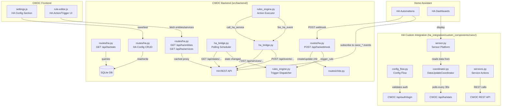

# Design Document: Home Assistant Integration

## Overview

This design adds a full, first-class bidirectional integration between CWOC and Home Assistant (HA). It spans two codebases:

1. **HA Custom Integration** (`ha_integration/custom_components/cwoc/`) — a proper Home Assistant custom component providing config flow, sensors, services, events, and a DataUpdateCoordinator. Deployed by copying to HA's `config/custom_components/cwoc/`.
2. **CWOC Backend** (Python/FastAPI) — new stats API, auth support for HA config flow, rules engine extensions (`call_ha_service`, `fire_ha_event`), HA state polling trigger, webhook endpoint, HA config storage, proxy endpoints, and database migration.

The result: CWOC appears as a native integration in HA's Settings → Integrations panel. Users configure it via the HA UI (enter CWOC URL + credentials), get live sensors on dashboards, call CWOC services from HA automations, and receive CWOC events on the HA event bus for automation triggers. In the other direction, CWOC rules can call HA services and HA automations can call CWOC via webhooks.

### Key Design Decisions

- **Single-row `ha_config` table** — HA config is instance-wide, not per-user. Avoids polluting the settings model and makes the "one HA connection per instance" constraint explicit.
- **Polling for HA state changes** rather than HA's websocket API — keeps implementation simple (stdlib `urllib.request` in a thread pool, same pattern as weather scheduler), avoids persistent connections that break silently, works through reverse proxies.
- **Backend proxy for HA API calls** — the HA long-lived access token never reaches the browser. Proxy endpoints cache responses for 60 seconds.
- **Reuse existing encryption** — `_encrypt_password` / `_decrypt_password` from `src/backend/routes/email.py` handle token encryption (Fernet with base64 fallback).
- **In-memory state tracking** for the polling scheduler — last-known entity states held in a dict, not persisted to SQLite, minimizing disk I/O.
- **HA integration uses only aiohttp** (built into HA) for HTTP calls — no external dependencies in `manifest.json`.
- **CWOC ha_bridge uses stdlib `urllib.request`** — no pip installs needed on the CWOC side.
- **Stats API as single polling endpoint** — the DataUpdateCoordinator polls one endpoint for all sensor data, avoiding N+1 API calls.

## Architecture



### Data Flow: CWOC → HA Service Call

1. A chit event fires a trigger (e.g., `chit_updated`)
2. `dispatch_trigger` loads matching rules, evaluates condition trees
3. If a rule matches and has a `call_ha_service` action, `execute_action` delegates to `ha_bridge.call_ha_service()`
4. `ha_bridge` reads `ha_config` from DB, decrypts the token, POSTs to `{ha_base_url}/api/services/{domain}/{service}`
5. Result logged in execution log

### Data Flow: CWOC → HA Event Firing

1. A chit event fires a trigger (e.g., `chit_created`, `email_received`)
2. `dispatch_trigger` loads matching rules, evaluates condition trees
3. If a rule matches and has a `fire_ha_event` action, `execute_action` delegates to `ha_bridge.fire_ha_event()`
4. `ha_bridge` POSTs to `{ha_base_url}/api/events/{event_type}` with event_data as JSON body
5. HA automations subscribed to that event_type receive the event

### Data Flow: HA → CWOC via Webhook

1. An HA automation POSTs to `http://<cwoc>:3333/api/ha/webhook?token=<secret>`
2. Webhook endpoint validates token against `ha_config.ha_webhook_secret`
3. Based on `action` field: creates chit, updates chit, adds checklist item, or fires `ha_webhook` trigger
4. For `trigger_rule`, the trigger dispatcher evaluates rules with `ha_webhook` trigger type

### Data Flow: HA State Polling → CWOC Rules

1. On startup, scheduler loads all enabled rules with `ha_state_change` trigger type
2. Builds monitored entity set from `schedule_config.ha_entity_id` values
3. Every N seconds (default 30), polls `GET {ha_base_url}/api/states/{entity_id}` for each
4. If state differs from last-known value, fires `ha_state_change` trigger with old/new state
5. Trigger dispatcher evaluates matching rules

### Data Flow: HA DataUpdateCoordinator → Sensors

1. DataUpdateCoordinator polls `GET http://<cwoc>:3333/api/ha/stats` every 30 seconds
2. Stats API returns aggregated counts (total, todo, in_progress, overdue, inbox, per-tag)
3. Coordinator distributes data to all registered sensor entities
4. Sensors update their `native_value` from the coordinator data

## Components and Interfaces

### HA Custom Integration File Structure

```
ha_integration/custom_components/cwoc/
├── __init__.py          # Integration setup, platform forwarding
├── config_flow.py       # Config flow + options flow
├── coordinator.py       # DataUpdateCoordinator (polls /api/ha/stats)
├── sensor.py            # Sensor platform (fixed + dynamic tag sensors)
├── services.py          # Service action handlers (create_chit, etc.)
├── const.py             # Domain, default interval, service names
├── manifest.json        # HA integration manifest
├── services.yaml        # Service definitions with field descriptions
├── strings.json         # User-facing strings for config flow
├── icons.json           # MDI icons for services
└── translations/
    └── en.json          # English translations
```

### New Backend Module: `src/backend/ha_bridge.py`

Handles all communication with the Home Assistant REST API. Uses stdlib `urllib.request` — no pip installs.

```python
# ── HA Config helpers ────────────────────────────────────────────────
def get_ha_config() -> Optional[dict]:
    """Read ha_config row from DB, decrypt token. Returns None if not configured."""

def is_ha_configured() -> bool:
    """Quick check — returns True if ha_config has a URL and token."""

# ── Service calls (CWOC → HA) ───────────────────────────────────────
def call_ha_service(domain: str, service: str, entity_id: Optional[str],
                    service_data: Optional[dict], timeout: int = 10) -> dict:
    """POST to HA /api/services/{domain}/{service}. Returns {success, message, status_code}."""

# ── Event firing (CWOC → HA Event Bus) ──────────────────────────────
def fire_ha_event(event_type: str, event_data: Optional[dict],
                  timeout: int = 10) -> dict:
    """POST to HA /api/events/{event_type}. Returns {success, message, status_code}."""

# ── State polling ────────────────────────────────────────────────────
def get_ha_entity_state(entity_id: str) -> Optional[dict]:
    """GET /api/states/{entity_id}. Returns parsed state dict or None on error."""

def get_ha_entities() -> list:
    """GET /api/states — returns simplified list of {entity_id, state, friendly_name}."""

def get_ha_services() -> list:
    """GET /api/services — returns list of {domain, services: [{service, description, fields}]}."""

def test_ha_connection(base_url: str, token: str) -> dict:
    """GET /api/ with provided credentials. Returns {success, message, ha_version}."""

# ── Template substitution ────────────────────────────────────────────
def substitute_template_placeholders(data: dict, context: dict) -> dict:
    """Replace {chit_title}, {chit_status}, {rule_name}, {entity_id} in string values."""

# ── Polling scheduler ────────────────────────────────────────────────
_monitored_entities: Dict[str, Set[str]] = {}  # owner_id → {entity_id, ...}
_last_known_states: Dict[str, dict] = {}       # entity_id → {state, attributes, last_changed}

async def start_ha_polling_scheduler():
    """Called from main.py on_startup. Loads monitored entities and starts polling loop."""

async def _ha_polling_loop():
    """Background loop: poll monitored entities, fire triggers on state change."""

def update_monitored_entities():
    """Reload monitored entity set from DB. Called when ha_state_change rules change."""
```

### New Backend Routes: `src/backend/routes/ha.py`

```python
# ── Stats endpoint (authenticated) ──────────────────────────────────
GET  /api/ha/stats              # Aggregated chit counts for DataUpdateCoordinator

# ── Admin-only HA config endpoints ───────────────────────────────────
POST /api/ha/config             # Save HA config (URL, token, poll interval)
GET  /api/ha/config             # Get HA config (token masked)
POST /api/ha/config/test        # Test connection
POST /api/ha/config/regenerate-webhook  # Regenerate webhook secret

# ── Proxy endpoints (any authenticated user) ─────────────────────────
GET  /api/ha/entities           # Proxy to HA /api/states (60s cache)
GET  /api/ha/services           # Proxy to HA /api/services (60s cache)

# ── Webhook endpoint (token-authenticated, no session required) ──────
POST /api/ha/webhook            # Inbound webhook from HA automations
```

### Rules Engine Extensions (in `src/backend/rules_engine.py`)

**New action types in `execute_action()`:**
- `call_ha_service` — delegates to `ha_bridge.call_ha_service()` with template substitution
- `fire_ha_event` — delegates to `ha_bridge.fire_ha_event()` with template substitution

**New trigger types in `dispatch_trigger()`:**
- `ha_state_change` — fired by the polling scheduler
- `ha_webhook` — fired by the webhook endpoint

**New entries in `_build_action_description()`:**
- `call_ha_service` → `"Call HA service {domain}.{service} on {entity_id}"`
- `fire_ha_event` → `"Fire Home Assistant event '{event_type}' with {N} data fields"`

### Frontend Changes

**Settings page (`settings.html` + `settings.js`):**
- New "Home Assistant" section (admin-only visibility)
- Fields: HA base URL, Long-Lived Access Token (masked), poll interval
- Test Connection button, Webhook URL with copy button, Regenerate Token button

**Rules editor (`rule-editor.html` + `rule-editor.js`):**
- `call_ha_service` action: domain, service, entity_id fields + key-value editor for service_data
- `fire_ha_event` action: event_type input with autocomplete suggestions + key-value editor for event_data
- Fetch Entities / Fetch Services buttons → searchable dropdowns
- `ha_state_change` trigger: entity_id input with Fetch Entities autocomplete
- `ha_webhook` trigger: hint text explaining webhook-driven rules
- JSON preview panel for both HA action types
- "HA not configured" message when ha_config is empty

### Database Migration (in `src/backend/migrations.py`)

```python
def migrate_create_ha_config():
    """Create ha_config table for instance-wide HA connection settings."""
    # CREATE TABLE IF NOT EXISTS ha_config (
    #     id INTEGER PRIMARY KEY CHECK (id = 1),
    #     ha_base_url TEXT,
    #     ha_access_token TEXT,        -- Fernet-encrypted
    #     ha_webhook_secret TEXT,      -- auto-generated UUID
    #     ha_poll_interval INTEGER DEFAULT 30,
    #     configured_by TEXT,          -- user_id of the admin
    #     modified_datetime TEXT
    # );
    # INSERT OR IGNORE INTO ha_config (id, ha_webhook_secret) VALUES (1, <uuid>);
```

## Data Models

### HA Config (Database Row — `ha_config` table)

| Column | Type | Description |
|--------|------|-------------|
| `id` | INTEGER | Always 1 (single-row constraint via CHECK) |
| `ha_base_url` | TEXT | e.g. `http://192.168.1.100:8123` |
| `ha_access_token` | TEXT | Fernet-encrypted long-lived access token |
| `ha_webhook_secret` | TEXT | Auto-generated UUID for webhook auth |
| `ha_poll_interval` | INTEGER | Seconds between state polls (default 30) |
| `configured_by` | TEXT | user_id of the admin who configured it |
| `modified_datetime` | TEXT | ISO 8601 timestamp |

### Pydantic Models (additions to `src/backend/models.py`)

```python
class HAConfigUpdate(BaseModel):
    ha_base_url: Optional[str] = None
    ha_access_token: Optional[str] = None  # plaintext from frontend, encrypted before storage
    ha_poll_interval: Optional[int] = 30

class HAWebhookPayload(BaseModel):
    action: str                          # create_chit, add_checklist_item, update_chit, trigger_rule
    user_id: Optional[str] = None        # target user; defaults to configured_by admin
    chit_id: Optional[str] = None        # for update_chit, add_checklist_item
    chit_title: Optional[str] = None     # for lookup by title
    title: Optional[str] = None          # for create_chit
    note: Optional[str] = None
    tags: Optional[List[str]] = None
    status: Optional[str] = None
    priority: Optional[str] = None
    due_datetime: Optional[str] = None
    checklist: Optional[List[Dict[str, Any]]] = None
    item_text: Optional[str] = None      # for add_checklist_item
    fields: Optional[Dict[str, Any]] = None  # for update_chit (arbitrary field updates)
    payload: Optional[Dict[str, Any]] = None # for trigger_rule (passed as entity dict)
```

### Stats API Response Schema

```json
{
    "total_chits": 142,
    "todo_count": 23,
    "in_progress_count": 8,
    "blocked_count": 3,
    "complete_count": 95,
    "overdue_count": 5,
    "inbox_count": 2,
    "tag_counts": {
        "Groceries": 4,
        "Work": 12,
        "Personal": 7
    }
}
```

### call_ha_service Action Schema (stored in rule actions array)

```json
{
    "type": "call_ha_service",
    "params": {
        "domain": "light",
        "service": "turn_on",
        "entity_id": "light.living_room",
        "service_data": {
            "brightness_pct": 100,
            "message": "New chit: {chit_title}"
        }
    }
}
```

### fire_ha_event Action Schema (stored in rule actions array)

```json
{
    "type": "fire_ha_event",
    "params": {
        "event_type": "cwoc_chit_updated",
        "event_data": {
            "chit_title": "{chit_title}",
            "chit_status": "{chit_status}",
            "rule_name": "{rule_name}",
            "chit_id": "{entity_id}"
        }
    }
}
```

### ha_state_change Trigger Entity Dict

```json
{
    "ha_entity_id": "light.living_room",
    "old_state": "off",
    "new_state": "on",
    "attributes": {"brightness": 255, "friendly_name": "Living Room"},
    "last_changed": "2026-01-15T10:30:00Z"
}
```

### ha_webhook Trigger Entity Dict

The full webhook payload is passed as the entity dict:

```json
{
    "action": "trigger_rule",
    "ha_entity_id": "binary_sensor.front_door",
    "state": "on",
    "custom_field": "any_value"
}
```

### HA Custom Integration — Config Entry Data

Stored by HA in its `.storage/` directory:

```json
{
    "cwoc_url": "http://192.168.1.111:3333",
    "username": "admin",
    "password": "cwoc",
    "session_token": "<from login response>",
    "tracked_tags": ["Groceries", "Work"]
}
```

### HA Custom Integration — Sensor Entity IDs

| Entity ID | Source Field | Icon |
|-----------|-------------|------|
| `sensor.cwoc_total_chits` | `total_chits` | `mdi:note-multiple` |
| `sensor.cwoc_todo_count` | `todo_count` | `mdi:checkbox-blank-outline` |
| `sensor.cwoc_in_progress_count` | `in_progress_count` | `mdi:progress-clock` |
| `sensor.cwoc_overdue_count` | `overdue_count` | `mdi:alert-circle` |
| `sensor.cwoc_inbox_count` | `inbox_count` | `mdi:email-outline` |
| `sensor.cwoc_tag_{name}_count` | `tag_counts[name]` | `mdi:tag` |


## Correctness Properties

*A property is a characteristic or behavior that should hold true across all valid executions of a system — essentially, a formal statement about what the system should do. Properties serve as the bridge between human-readable specifications and machine-verifiable correctness guarantees.*

### Property 1: Stats Computation Correctness

*For any* set of chits with varying statuses (ToDo, In Progress, Blocked, Complete), tags (user-defined and system), due_datetimes (past, future, none), deleted flags, email_read flags, and email_status values, the stats computation SHALL produce: a `total_chits` count equal to the number of non-deleted chits; a `todo_count` equal to non-deleted chits with status "ToDo"; an `overdue_count` equal to non-deleted chits where due_datetime is in the past and status is not "Complete"; an `inbox_count` equal to non-deleted chits where email_read is false and email_status is "received"; and `tag_counts` containing only user-defined tags (excluding any tag starting with "CWOC_System/") with correct per-tag counts.

**Validates: Requirements 1.1, 1.4, 1.5, 1.6**

### Property 2: HA Config Save/Read Round-Trip

*For any* valid HA base URL string and any access token string, saving the config via the HA config API and then reading it back SHALL return the same base URL and a token that decrypts to the original plaintext value. The poll interval SHALL also round-trip correctly.

**Validates: Requirements 12.2, 12.5, 13.1**

### Property 3: Graceful Skip When HA Unconfigured

*For any* `call_ha_service` or `fire_ha_event` action parameters, if the HA config is not configured (missing URL, missing token, or no ha_config row), the HA bridge SHALL return a result with `success=False` and a descriptive warning message, without raising an exception.

**Validates: Requirements 7.6, 9.4**

### Property 4: HA Bridge Request URL Construction

*For any* valid domain string and service string, `call_ha_service` SHALL construct a POST to `{ha_base_url}/api/services/{domain}/{service}`. *For any* valid event_type string, `fire_ha_event` SHALL construct a POST to `{ha_base_url}/api/events/{event_type}`. Both SHALL include an Authorization header with the decrypted Bearer token and a JSON content-type header.

**Validates: Requirements 7.1, 9.2**

### Property 5: Template Placeholder Substitution

*For any* dict containing string values with `{chit_title}`, `{chit_status}`, `{rule_name}`, and/or `{entity_id}` placeholders, and any context dict with corresponding values, the substitution function SHALL replace every placeholder occurrence with the context value, leaving non-placeholder text and non-string values unchanged.

**Validates: Requirements 7.5, 9.5**

### Property 6: call_ha_service Confirmation Description Format

*For any* domain, service, and entity_id strings, the action description for a `call_ha_service` action SHALL contain the domain, service, and entity_id values in a human-readable format.

**Validates: Requirements 9.6**

### Property 7: fire_ha_event Confirmation Description Format

*For any* event_type string and event_data dict with N keys, the action description for a `fire_ha_event` action SHALL be a string containing the event_type and the count N in the format "Fire Home Assistant event '{event_type}' with {N} data fields".

**Validates: Requirements 7.9**

### Property 8: State Change Detection

*For any* entity_id and two state values (old_state, new_state), if old_state differs from new_state, the state change detector SHALL produce an entity dict containing `ha_entity_id`, `old_state`, `new_state`, `attributes`, and `last_changed`. If old_state equals new_state, no trigger SHALL fire.

**Validates: Requirements 10.3**

### Property 9: Webhook Token Validation

*For any* request to the webhook endpoint, if the provided token does not exactly match the stored `ha_webhook_secret`, the endpoint SHALL reject with HTTP 401. If the token matches, the request SHALL proceed to action processing.

**Validates: Requirements 11.2, 11.8**

### Property 10: Webhook User Resolution

*For any* webhook payload, if `user_id` is present and non-empty, the resolved user SHALL be that user_id. If `user_id` is absent or empty, the resolved user SHALL be the `configured_by` admin from ha_config.

**Validates: Requirements 11.3**

### Property 11: Webhook Create Chit Field Mapping

*For any* webhook payload with `action: "create_chit"` and valid title, note, tags, status, priority, and due_datetime fields, the created chit SHALL have field values matching the payload, and be owned by the resolved user.

**Validates: Requirements 11.4**

### Property 12: Webhook Add Checklist Item

*For any* webhook payload with `action: "add_checklist_item"`, a valid chit identifier, and item_text, the target chit's checklist SHALL contain a new item with the specified text appended to the end.

**Validates: Requirements 11.5**

### Property 13: Webhook Update Chit Field Updates

*For any* webhook payload with `action: "update_chit"`, a valid chit_id, and a fields dict, each specified field on the target chit SHALL be updated to the new value.

**Validates: Requirements 11.6**

### Property 14: Webhook Trigger Rule Payload Passthrough

*For any* webhook payload with `action: "trigger_rule"`, the entity dict passed to the trigger dispatcher SHALL contain all fields from the original webhook payload.

**Validates: Requirements 11.7, 18.2**

### Property 15: Webhook Required Field Validation

*For any* webhook payload where the `action` field requires specific parameters (e.g., `create_chit` requires `title`, `add_checklist_item` requires `chit_id` or `chit_title` and `item_text`, `update_chit` requires `chit_id`), if those required parameters are missing, the endpoint SHALL return HTTP 400 with a descriptive error message.

**Validates: Requirements 11.9**

### Property 16: Entity List Simplification

*For any* HA states API response (a list of state objects with `entity_id`, `state`, and `attributes.friendly_name`), the proxy simplification function SHALL return a list of objects each containing `entity_id`, `state`, and `friendly_name`, with the same count as the input.

**Validates: Requirements 15.1**

### Property 17: Monitored Entity Set Computation

*For any* set of rules where some have `trigger_type = "ha_state_change"` and `enabled = True` with `schedule_config.ha_entity_id` values, the computed monitored entity set SHALL be exactly the union of all `ha_entity_id` values from enabled `ha_state_change` rules. Disabling or deleting a rule SHALL remove its entity_id from the set only if no other enabled rule references it. When no rules use `ha_state_change`, the set SHALL be empty.

**Validates: Requirements 10.5, 14.3, 14.4**

### Property 18: Migration Idempotency

*For any* number of consecutive calls to the `migrate_create_ha_config` function, the function SHALL complete without error, the `ha_config` table SHALL exist with the correct schema, and exactly one row SHALL exist after each call.

**Validates: Requirements 13.1, 13.2, 13.3**

### Property 19: Sensor Creation from Stats Data

*For any* stats response containing total_chits, todo_count, in_progress_count, overdue_count, inbox_count, and a tag_counts dict with N tags, the sensor platform SHALL create exactly 5 + N sensor entities, each with a `native_value` matching the corresponding stats field.

**Validates: Requirements 5.1, 5.4, 5.5**

### Property 20: Chit Lookup by Title or ID

*For any* chit with a unique title, looking up by `chit_title` SHALL return the same chit as looking up by `chit_id`. If multiple chits share the same title, lookup by title SHALL return the most recently modified one.

**Validates: Requirements 6.6**

## Error Handling

### HA Bridge Errors (`ha_bridge.py`)

| Scenario | Behavior |
|----------|----------|
| HA not configured (no URL or token) | Skip action, return `{success: False, message: "HA not configured"}`, log warning |
| HA service call returns non-2xx | Return `{success: False, message: "HA returned {status}", status_code: N}`, log error |
| HA service call times out (>10s) | Abort request, return `{success: False, message: "HA request timed out"}` |
| HA service call connection refused | Return `{success: False, message: "Cannot connect to HA at {url}"}` |
| HA event fire returns non-2xx | Return `{success: False, message: "HA event fire returned {status}"}`, log error |
| HA event fire times out (>10s) | Abort request, return `{success: False, message: "HA event fire timed out"}` |
| Missing event_type for fire_ha_event | Return `{success: False, message: "Missing required event_type"}` |
| Missing domain/service for call_ha_service | Return `{success: False, message: "Missing required domain or service"}` |

### Webhook Endpoint Errors (`routes/ha.py`)

| Scenario | HTTP Status | Response |
|----------|-------------|----------|
| Missing or invalid token | 401 | `{"detail": "Invalid or missing webhook token"}` |
| Missing `action` field | 400 | `{"detail": "Missing required field: action"}` |
| Unknown action type | 400 | `{"detail": "Unknown action: {action}"}` |
| Missing required fields for action | 400 | `{"detail": "Action {action} requires: {fields}"}` |
| Chit not found (update/checklist) | 404 | `{"detail": "Chit not found: {id}"}` |
| User not found | 404 | `{"detail": "User not found: {user_id}"}` |
| Internal error | 500 | `{"detail": "Webhook processing failed: {error}"}` |

### Stats API Errors

| Scenario | HTTP Status | Response |
|----------|-------------|----------|
| Not authenticated | 401 | Standard auth middleware response |
| Internal error | 500 | `{"detail": "Failed to compute stats: {error}"}` |

### Proxy Endpoint Errors

| Scenario | HTTP Status | Response |
|----------|-------------|----------|
| HA not configured | 400 | `{"detail": "Home Assistant is not configured"}` |
| HA unreachable | 502 | `{"detail": "Cannot reach Home Assistant"}` |
| HA returns error | 502 | `{"detail": "Home Assistant returned error: {status}"}` |

### HA Config Endpoint Errors

| Scenario | HTTP Status | Response |
|----------|-------------|----------|
| Non-admin user | 403 | `{"detail": "Admin access required"}` |
| Invalid URL format | 400 | `{"detail": "Invalid HA base URL"}` |
| Test connection failed | 200 | `{"success": false, "message": "Cannot connect..."}` |

### Polling Scheduler Errors

| Scenario | Behavior |
|----------|----------|
| Connection error during poll | Log error, continue to next entity, retry next cycle |
| Single entity poll fails | Log error for that entity, continue polling others |
| HA returns invalid JSON | Log warning, skip entity, retry next cycle |
| All polls fail (HA down) | Log error once per cycle, continue at configured interval |

### HA Custom Integration Errors

| Scenario | Behavior |
|----------|----------|
| CWOC unreachable during config flow | Show "Cannot connect" error, allow retry |
| Invalid credentials during config flow | Show "Invalid authentication" error, allow retry |
| CWOC unreachable during coordinator poll | Log warning, retry next interval, don't crash |
| CWOC returns 401 during coordinator poll | Raise `ConfigEntryAuthFailed` → HA prompts re-auth |
| CWOC returns error for service call | Raise `HomeAssistantError` with descriptive message |
| Chit not found for service call | Raise `HomeAssistantError("Chit not found")` |

## Testing Strategy

### Property-Based Tests (Python stdlib `unittest` + `random`, 120 iterations)

Property-based tests use the existing pattern from `test_rules_engine.py`: inline the minimal production logic to avoid importing `main.py` / `db.py`, generate random inputs with `random` module, run 120 iterations per property.

**Test file:** `src/backend/test_ha_integration.py`

Each property test is tagged with a comment referencing the design property:
```python
# Feature: home-assistant-integration, Property N: {property_text}
```

**Properties to implement as PBT:**
- Property 1: Stats Computation Correctness
- Property 2: HA Config Save/Read Round-Trip
- Property 3: Graceful Skip When HA Unconfigured
- Property 4: HA Bridge Request URL Construction
- Property 5: Template Placeholder Substitution
- Property 6: call_ha_service Confirmation Description Format
- Property 7: fire_ha_event Confirmation Description Format
- Property 8: State Change Detection
- Property 9: Webhook Token Validation
- Property 10: Webhook User Resolution
- Property 14: Webhook Trigger Rule Payload Passthrough
- Property 15: Webhook Required Field Validation
- Property 16: Entity List Simplification
- Property 17: Monitored Entity Set Computation
- Property 18: Migration Idempotency
- Property 19: Sensor Creation from Stats Data
- Property 20: Chit Lookup by Title or ID

**Properties better suited for example-based tests** (require DB setup with actual chit records):
- Property 11: Webhook Create Chit Field Mapping
- Property 12: Webhook Add Checklist Item
- Property 13: Webhook Update Chit Field Updates

### Unit Tests (Example-Based)

- Webhook create_chit with specific field combinations
- Webhook add_checklist_item with chit_id and chit_title lookup
- Webhook update_chit with various field updates
- Admin-only access control for HA config endpoints
- Token masking in GET /api/ha/config response
- Webhook secret auto-generation on first access
- Token regeneration produces new value
- Cache expiry for proxy endpoints (60s TTL)
- HA custom integration config flow: success, connection error, auth error
- HA custom integration coordinator: success, unreachable, auth error
- HA custom integration services: success, CWOC error, chit not found

### Integration Tests

- Test Connection button with mock HA server
- HA service call with mock HA server (success, error, timeout)
- HA event fire with mock HA server (success, error, timeout)
- Polling scheduler with mock HA server (state change detection)
- End-to-end: chit update → rule fires → HA service called
- End-to-end: HA webhook → chit created → rule chain fires
- End-to-end: HA state change → CWOC rule fires → chit updated

### Frontend Tests (Manual)

- Settings page HA section visibility (admin vs non-admin)
- Token masking toggle
- Test Connection button feedback
- Webhook URL copy button
- Regenerate Token button with warning
- Rules editor: `call_ha_service` action fields appear
- Rules editor: `fire_ha_event` action fields with autocomplete
- Rules editor: JSON preview updates as fields change
- Rules editor: Fetch Entities/Services buttons populate dropdowns
- Rules editor: `ha_state_change` trigger entity_id autocomplete
- Rules editor: `ha_webhook` trigger hint text
- Rules editor: "HA not configured" message when applicable
- Mobile responsiveness of all new UI elements
