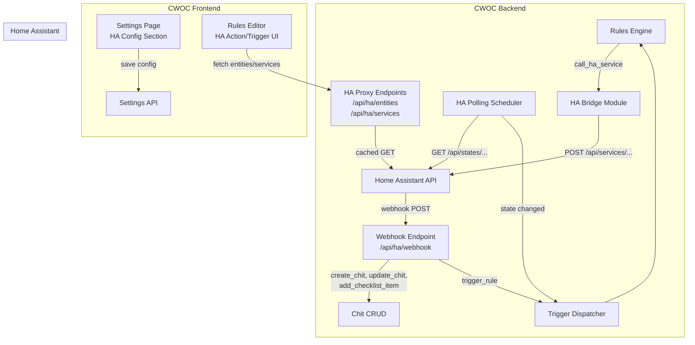

# Design Document: Home Assistant Integration

## Overview

This design adds bidirectional integration between CWOC and Home Assistant (HA). The integration has two directions:

1. **CWOC → HA**: The rules engine gains a `call_ha_service` action type that POSTs to the HA REST API, letting rule conditions trigger smart home actions (flash lights, play TTS, trigger scenes).
2. **HA → CWOC**: A new webhook endpoint (`/api/ha/webhook`) lets HA automations call back into CWOC to create chits, modify checklists, update chit fields, or fire rule chains.

A single admin configures the HA connection once (base URL + long-lived access token) in a new Settings section. The token is stored encrypted using the existing Fernet/base64 encryption from the email module. A background polling scheduler monitors HA entity states and fires `ha_state_change` triggers. The rules editor gains HA-specific action and trigger UIs with entity/service fetch buttons that proxy through the backend (keeping the HA token off the browser).

### Key Design Decisions

- **Single-row `ha_config` table** rather than extending the per-user `settings` table — HA config is instance-wide, not per-user. This avoids polluting the settings model and makes the "one HA connection per instance" constraint explicit.
- **Polling for state changes** rather than HA's websocket API — keeps the implementation simple (stdlib `urllib.request` in a thread pool, same pattern as weather), avoids a persistent connection that could break silently, and works through reverse proxies without special config.
- **Backend proxy for HA API calls** — the HA long-lived access token never reaches the browser. The proxy endpoints cache responses for 60 seconds to avoid hammering the HA instance.
- **Reuse existing encryption** — `_encrypt_password` / `_decrypt_password` from `src/backend/routes/email.py` handle token encryption, avoiding a new crypto dependency.
- **In-memory state tracking** for the polling scheduler — last-known entity states are held in a dict, not persisted to SQLite, minimizing disk I/O (same pattern as `_timer_tasks` in settings routes).

## Architecture



### Data Flow: CWOC → HA Service Call

1. A chit event fires a trigger (e.g., `chit_updated`)
2. `dispatch_trigger` loads matching rules, evaluates condition trees
3. If a rule matches and has a `call_ha_service` action, `execute_action` delegates to `ha_bridge.call_ha_service()`
4. `ha_bridge` reads `ha_config` from the DB, decrypts the token, POSTs to `{ha_base_url}/api/services/{domain}/{service}`
5. Result (success/failure/timeout) is logged in the execution log

### Data Flow: HA → CWOC Webhook

1. An HA automation sends a POST to `https://<cwoc>/api/ha/webhook?token=<secret>`
2. The webhook endpoint validates the token against `ha_config.ha_webhook_secret`
3. Based on the `action` field, it creates a chit, updates a chit, adds a checklist item, or fires `ha_webhook` trigger
4. For `trigger_rule`, the trigger dispatcher evaluates rules with `ha_webhook` trigger type

### Data Flow: HA State Polling

1. On startup, the scheduler loads all enabled rules with `ha_state_change` trigger type
2. It builds a set of monitored `entity_id` values from their `schedule_config`
3. Every N seconds (default 30), it polls `GET {ha_base_url}/api/states/{entity_id}` for each monitored entity
4. If the state differs from the last-known value, it fires `ha_state_change` trigger with old/new state info
5. The trigger dispatcher evaluates matching rules and executes/queues actions

## Components and Interfaces

### New Backend Module: `src/backend/ha_bridge.py`

The HA bridge is a focused module that handles all communication with the Home Assistant REST API. It has no FastAPI route dependencies — just pure functions and the polling scheduler.

```python
# ── HA Config helpers ────────────────────────────────────────────────
def get_ha_config() -> Optional[dict]:
    """Read ha_config row from DB, decrypt token. Returns None if not configured."""

def is_ha_configured() -> bool:
    """Quick check — returns True if ha_config has a URL and token."""

# ── Service calls (CWOC → HA) ───────────────────────────────────────
def call_ha_service(domain: str, service: str, entity_id: Optional[str],
                    service_data: Optional[dict], timeout: int = 10) -> dict:
    """POST to HA /api/services/{domain}/{service}. Returns {success, message, status_code}."""

# ── State polling ────────────────────────────────────────────────────
def get_ha_entity_state(entity_id: str) -> Optional[dict]:
    """GET /api/states/{entity_id}. Returns parsed state dict or None on error."""

def get_ha_entities() -> list:
    """GET /api/states — returns simplified list of {entity_id, state, friendly_name}."""

def get_ha_services() -> list:
    """GET /api/services — returns list of {domain, services: [{service, description, fields}]}."""

def test_ha_connection(base_url: str, token: str) -> dict:
    """GET /api/ with provided credentials. Returns {success, message, ha_version}."""

# ── Template substitution ────────────────────────────────────────────
def substitute_template_placeholders(service_data: dict, context: dict) -> dict:
    """Replace {chit_title}, {chit_status}, {rule_name}, {entity_id} in string values."""
```

### New Backend Routes: `src/backend/routes/ha.py`

```python
# ── Admin-only HA config endpoints ───────────────────────────────────
POST /api/ha/config          # Save HA config (URL, token, poll interval)
GET  /api/ha/config          # Get HA config (token masked)
POST /api/ha/config/test     # Test connection with provided or saved credentials
POST /api/ha/config/regenerate-token  # Regenerate webhook secret

# ── Proxy endpoints (any authenticated user) ─────────────────────────
GET  /api/ha/entities        # Proxy to HA /api/states (60s cache)
GET  /api/ha/services        # Proxy to HA /api/services (60s cache)

# ── Webhook endpoint (token-authenticated, no session required) ──────
POST /api/ha/webhook         # Inbound webhook from HA automations
```

### Rules Engine Extensions

**New action type in `execute_action()`:**
- `call_ha_service` — delegates to `ha_bridge.call_ha_service()`, with template placeholder substitution on `service_data` values

**New trigger types in `dispatch_trigger()`:**
- `ha_state_change` — fired by the polling scheduler when a monitored entity's state changes
- `ha_webhook` — fired by the webhook endpoint when it receives a `trigger_rule` action

**New action description in `_build_action_description()`:**
- `call_ha_service` → `"Call Home Assistant service {domain}.{service} on {entity_id}"`

### HA Polling Scheduler (in `src/backend/ha_bridge.py`)

```python
# In-memory state tracking
_monitored_entities: Dict[str, Set[str]] = {}  # owner_id → {entity_id, ...}
_last_known_states: Dict[str, dict] = {}       # entity_id → {state, attributes, last_changed}

async def start_ha_polling_scheduler():
    """Called from main.py on_startup. Loads monitored entities and starts polling loop."""

async def _ha_polling_loop():
    """Background loop: poll monitored entities, fire triggers on state change."""

def update_monitored_entities():
    """Reload monitored entity set from DB. Called when ha_state_change rules are created/updated/deleted."""
```

### Frontend Components

**Settings page (`settings.js` + `settings.html`):**
- New "Home Assistant" section (admin-only) with URL, token (masked), poll interval fields
- Test Connection button
- Webhook URL display with copy button
- Regenerate Token button with warning

**Rules editor (`shared-rules.js` or new `rules-ha.js`):**
- HA action fields (domain, service, entity_id, service_data key-value editor)
- Fetch Entities / Fetch Services buttons with searchable dropdowns
- HA trigger entity_id input with Fetch Entities autocomplete
- JSON preview of the service call payload
- Hint text for `ha_state_change` and `ha_webhook` triggers

### Database Migration

```sql
CREATE TABLE IF NOT EXISTS ha_config (
    id INTEGER PRIMARY KEY CHECK (id = 1),
    ha_base_url TEXT,
    ha_access_token TEXT,        -- Fernet-encrypted
    ha_webhook_secret TEXT,      -- auto-generated UUID
    ha_poll_interval INTEGER DEFAULT 30,
    configured_by TEXT,          -- user_id of the admin
    modified_datetime TEXT
);
INSERT OR IGNORE INTO ha_config (id) VALUES (1);
```

## Data Models

### HA Config (Database Row)

| Column | Type | Description |
|--------|------|-------------|
| `id` | INTEGER | Always 1 (single-row constraint) |
| `ha_base_url` | TEXT | e.g. `http://192.168.1.100:8123` |
| `ha_access_token` | TEXT | Fernet-encrypted long-lived access token |
| `ha_webhook_secret` | TEXT | Auto-generated UUID for webhook auth |
| `ha_poll_interval` | INTEGER | Seconds between state polls (default 30) |
| `configured_by` | TEXT | user_id of the admin who set it up |
| `modified_datetime` | TEXT | ISO 8601 timestamp |

### Pydantic Models (in `models.py`)

```python
class HAConfigUpdate(BaseModel):
    ha_base_url: Optional[str] = None
    ha_access_token: Optional[str] = None  # plaintext from frontend, encrypted before storage
    ha_poll_interval: Optional[int] = 30

class HAWebhookPayload(BaseModel):
    action: str                          # create_chit, add_checklist_item, update_chit, trigger_rule
    user_id: Optional[str] = None        # target user; defaults to configured_by admin
    chit_id: Optional[str] = None        # for update_chit, add_checklist_item
    chit_title: Optional[str] = None     # for add_checklist_item (lookup by title)
    title: Optional[str] = None          # for create_chit
    note: Optional[str] = None
    tags: Optional[List[str]] = None
    status: Optional[str] = None
    priority: Optional[str] = None
    due_datetime: Optional[str] = None
    checklist: Optional[List[Dict[str, Any]]] = None
    item_text: Optional[str] = None      # for add_checklist_item
    fields: Optional[Dict[str, Any]] = None  # for update_chit (arbitrary field updates)
    payload: Optional[Dict[str, Any]] = None # for trigger_rule (passed as entity dict)
```

### call_ha_service Action Schema (stored in rule actions array)

```json
{
    "type": "call_ha_service",
    "params": {
        "domain": "light",
        "service": "turn_on",
        "entity_id": "light.living_room",
        "service_data": {
            "brightness_pct": 100,
            "message": "New chit: {chit_title}"
        }
    }
}
```

### ha_state_change Trigger Entity Dict

```json
{
    "ha_entity_id": "light.living_room",
    "old_state": "off",
    "new_state": "on",
    "attributes": {"brightness": 255, "friendly_name": "Living Room"},
    "last_changed": "2026-01-15T10:30:00Z"
}
```

### ha_webhook Trigger Entity Dict

The full webhook payload is passed as the entity dict, allowing condition trees to evaluate any field:

```json
{
    "action": "trigger_rule",
    "ha_entity_id": "binary_sensor.front_door",
    "state": "on",
    "custom_field": "any_value"
}
```


## Correctness Properties

*A property is a characteristic or behavior that should hold true across all valid executions of a system — essentially, a formal statement about what the system should do. Properties serve as the bridge between human-readable specifications and machine-verifiable correctness guarantees.*

### Property 1: HA Config Save/Read Round-Trip

*For any* valid HA base URL string and any access token string, saving the config via the Settings API and then reading it back SHALL return the same base URL and a token that decrypts to the original plaintext value.

**Validates: Requirements 1.2, 1.6**

### Property 2: Graceful Skip When Unconfigured

*For any* `call_ha_service` action parameters (domain, service, entity_id, service_data), if the HA config is not configured (missing URL, missing token, or no ha_config row), the HA bridge SHALL return a result with `success=False` and a descriptive warning message, without raising an exception.

**Validates: Requirements 1.5, 2.4**

### Property 3: HA Service Call Request Construction

*For any* valid domain string, service string, optional entity_id, and optional service_data dict, the HA bridge SHALL construct a POST request to the URL `{ha_base_url}/api/services/{domain}/{service}` with a JSON body containing the entity_id and service_data, and an Authorization header with the decrypted Bearer token.

**Validates: Requirements 2.1, 2.2**

### Property 4: Template Placeholder Substitution

*For any* service_data dict containing string values with `{chit_title}`, `{chit_status}`, `{rule_name}`, and/or `{entity_id}` placeholders, and any context dict with corresponding values, the substitution function SHALL replace every placeholder occurrence with the context value, leaving non-placeholder text unchanged.

**Validates: Requirements 2.5**

### Property 5: HA Action Description Format

*For any* domain, service, and entity_id strings, the action description for a `call_ha_service` action SHALL be a string containing all three values in the format "Call Home Assistant service {domain}.{service} on {entity_id}".

**Validates: Requirements 2.6, 11.1**

### Property 6: State Change Detection

*For any* entity_id and two state strings (old_state, new_state), if old_state differs from new_state, the state change detector SHALL produce an entity dict containing `ha_entity_id`, `old_state`, `new_state`, `attributes`, and `last_changed`. If old_state equals new_state, no trigger SHALL fire.

**Validates: Requirements 3.3**

### Property 7: Webhook Token Validation

*For any* request to the webhook endpoint, if the provided token does not exactly match the stored `ha_webhook_secret`, the endpoint SHALL return HTTP 401. If the token matches, the request SHALL proceed to action processing.

**Validates: Requirements 4.2, 4.8, 5.4**

### Property 8: Webhook User Resolution

*For any* webhook payload, if `user_id` is present and non-empty, the resolved user SHALL be that user_id. If `user_id` is absent or empty, the resolved user SHALL be the `configured_by` admin from ha_config.

**Validates: Requirements 4.3**

### Property 9: Webhook Create Chit

*For any* webhook payload with `action: "create_chit"` and valid title, note, tags, status, priority, and due_datetime fields, the created chit SHALL have matching field values and be owned by the resolved user.

**Validates: Requirements 4.4**

### Property 10: Webhook Add Checklist Item

*For any* webhook payload with `action: "add_checklist_item"`, a valid chit_id, and item_text, the target chit's checklist SHALL contain a new item with the specified text appended to the end.

**Validates: Requirements 4.5**

### Property 11: Webhook Update Chit

*For any* webhook payload with `action: "update_chit"`, a valid chit_id, and a fields dict, each specified field on the target chit SHALL be updated to the new value.

**Validates: Requirements 4.6**

### Property 12: Webhook Required Field Validation

*For any* webhook payload where the `action` field requires specific parameters (e.g., `create_chit` requires `title`, `add_checklist_item` requires `chit_id` or `chit_title` and `item_text`, `update_chit` requires `chit_id`), if those required parameters are missing, the endpoint SHALL return HTTP 400 with a descriptive error message.

**Validates: Requirements 4.9**

### Property 13: Entity List Simplification

*For any* HA states API response (a list of state objects with `entity_id`, `state`, and `attributes.friendly_name`), the proxy endpoint SHALL return a list of simplified objects each containing `entity_id`, `state`, and `friendly_name`, with the same count as the input.

**Validates: Requirements 8.1**

### Property 14: Monitored Entity Set Computation

*For any* set of rules where some have `trigger_type = "ha_state_change"` and `enabled = True` with `schedule_config.ha_entity_id` values, the computed monitored entity set SHALL be exactly the union of all `ha_entity_id` values from enabled `ha_state_change` rules. Disabling or deleting a rule SHALL remove its entity_id from the set if no other enabled rule references it.

**Validates: Requirements 9.3, 9.4**

### Property 15: Webhook Payload Passthrough

*For any* webhook payload with `action: "trigger_rule"`, the entity dict passed to the trigger dispatcher SHALL contain all fields from the original webhook payload.

**Validates: Requirements 10.2**

### Property 16: Migration Idempotency

*For any* number of consecutive calls to the `migrate_create_ha_config` function, the function SHALL complete without error and the `ha_config` table SHALL exist with the correct schema after each call.

**Validates: Requirements 12.2**

## Error Handling

### HA Bridge Errors

| Scenario | Behavior |
|----------|----------|
| HA not configured (no URL or token) | Skip action, return `{success: False, message: "HA not configured"}`, log warning |
| HA service call returns non-2xx | Return `{success: False, message: "HA returned {status}", status_code: N}`, log error |
| HA service call times out (>10s) | Abort request, return `{success: False, message: "HA request timed out"}` |
| HA service call connection refused | Return `{success: False, message: "Cannot connect to HA at {url}"}` |
| Invalid domain/service format | Return `{success: False, message: "Invalid domain or service"}` |

### Webhook Endpoint Errors

| Scenario | HTTP Status | Response |
|----------|-------------|----------|
| Missing or invalid token | 401 | `{"detail": "Invalid or missing webhook token"}` |
| Missing `action` field | 400 | `{"detail": "Missing required field: action"}` |
| Unknown action type | 400 | `{"detail": "Unknown action: {action}"}` |
| Missing required fields for action | 400 | `{"detail": "Action {action} requires: {fields}"}` |
| Chit not found (update/checklist) | 404 | `{"detail": "Chit not found: {id}"}` |
| User not found | 404 | `{"detail": "User not found: {user_id}"}` |
| Internal error | 500 | `{"detail": "Webhook processing failed: {error}"}` |

### Polling Scheduler Errors

| Scenario | Behavior |
|----------|----------|
| Connection error during poll | Log error, continue to next entity, retry next cycle |
| Single entity poll fails | Log error for that entity, continue polling others |
| HA returns invalid JSON | Log warning, skip entity, retry next cycle |
| All polls fail (HA down) | Log error once per cycle, continue polling at configured interval |

### Proxy Endpoint Errors

| Scenario | HTTP Status | Response |
|----------|-------------|----------|
| HA not configured | 400 | `{"detail": "Home Assistant is not configured"}` |
| HA unreachable | 502 | `{"detail": "Cannot reach Home Assistant"}` |
| HA returns error | 502 | `{"detail": "Home Assistant returned error: {status}"}` |

## Testing Strategy

### Property-Based Tests (Python stdlib `unittest` + `random`)

Property-based tests use the existing pattern from `test_rules_engine.py`: inline the minimal production logic to avoid importing `main.py` / `db.py`, generate random inputs with `random` module, run 120+ iterations per property.

**Test file:** `src/backend/test_ha_integration.py`

Each property test is tagged with a comment referencing the design property:
```python
# Feature: home-assistant-integration, Property N: {property_text}
```

**Configuration:** Minimum 100 iterations per property test (set to 120 for margin).

**Properties to implement as PBT:**
- Property 1: HA Config Save/Read Round-Trip
- Property 2: Graceful Skip When Unconfigured
- Property 3: HA Service Call Request Construction
- Property 4: Template Placeholder Substitution
- Property 5: HA Action Description Format
- Property 6: State Change Detection
- Property 7: Webhook Token Validation
- Property 8: Webhook User Resolution
- Property 12: Webhook Required Field Validation
- Property 13: Entity List Simplification
- Property 14: Monitored Entity Set Computation
- Property 15: Webhook Payload Passthrough
- Property 16: Migration Idempotency

**Properties better suited for example-based tests** (due to DB/HTTP dependencies):
- Properties 9, 10, 11 (webhook create/update/checklist — require DB setup)

### Unit Tests (Example-Based)

- Webhook create_chit with specific field combinations
- Webhook add_checklist_item with chit_id and chit_title lookup
- Webhook update_chit with various field updates
- Admin-only access control for HA config endpoints
- Token masking in GET /api/ha/config response
- Webhook secret auto-generation on first access
- Token regeneration invalidates old token
- Cache expiry for proxy endpoints

### Integration Tests

- Test Connection button with mock HA server
- HA service call with mock HA server (success, error, timeout)
- Polling scheduler with mock HA server (state change detection)
- End-to-end: chit update → rule fires → HA service called
- End-to-end: HA webhook → chit created → rule chain fires

### Frontend Tests

Manual testing checklist:
- Settings page HA section visibility (admin vs non-admin)
- Token masking toggle
- Test Connection button feedback
- Webhook URL copy button
- Rules editor HA action fields appear when `call_ha_service` selected
- Fetch Entities/Services buttons populate dropdowns
- JSON preview updates as fields change
- HA trigger entity_id autocomplete
- Hint text displays for `ha_state_change` and `ha_webhook` triggers
- Mobile responsiveness of all new UI elements
