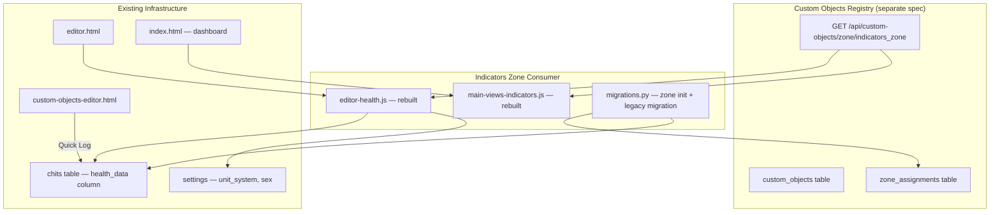

# Design Document: Indicators Zone

## Overview

The Indicators Zone is re-implemented as a **consumer** of the generic Custom Objects registry (defined in the `custom_objects` spec). The current hardcoded `_healthFields` array in `editor-health.js` is replaced with a data-driven approach where the zone queries `GET /api/custom-objects/zone/indicators_zone` at load time and dynamically renders inputs based on each object's `value_type`.

Key architectural decisions:
1. **Zone identifier**: `"indicators_zone"` — used in all zone assignment queries
2. **Config schema**: `{"is_default": true/false}` — stored in the zone assignment's opaque config blob
3. **Reading storage**: `chit.health_data` remains a JSON object, but keys change from legacy strings (e.g., `"heart_rate"`) to Custom Object UUIDs
4. **No new backend tables** — this feature only adds migration functions and frontend code; all data lives in the existing `custom_objects`, `zone_assignments`, and `chits` tables
5. **Unit display is cosmetic** — raw numeric values are stored without conversion; the unit label switches based on user settings

## Architecture



**Data flow at chit editor load:**
1. `editor-health.js` calls `GET /api/custom-objects/zone/indicators_zone`
2. Response includes all active Custom Objects assigned to the zone, each with their zone-specific config (`is_default` flag) and object metadata (name, value_type, units, range, conditional_display)
3. The zone evaluates `conditional_display` rules against cached user settings
4. Default indicators (`config.is_default = true`) render immediately
5. Per-chit indicators (UUIDs found in `chit.health_data` but not in the default set) also render
6. User can add more via the "Add Indicator" picker

## Components and Interfaces

### Backend Components

#### 1. Zone Initialization Migration: `migrate_indicators_zone_init(owner_id)`

Added to `migrations.py`. Called at startup after `seed_custom_objects()`.

**Logic:**
1. Check if any zone_assignments exist with `zone_id = "indicators_zone"` for this owner
2. If none exist, create assignments for all seeded Vital, Measurement, Activity, and "Period Active" objects with `config = {"is_default": true}`
3. Idempotent — skips if assignments already exist

```python
def migrate_indicators_zone_init(owner_id):
    """Create default indicators_zone assignments for seeded objects.
    Idempotent — only runs if no indicators_zone assignments exist for this owner."""
    conn = sqlite3.connect(DB_PATH)
    cursor = conn.cursor()
    
    # Check if already initialized
    cursor.execute(
        "SELECT COUNT(*) FROM zone_assignments WHERE zone_id = 'indicators_zone' AND owner_id = ?",
        (owner_id,)
    )
    if cursor.fetchone()[0] > 0:
        conn.close()
        return
    
    # Get all seeded Vital, Measurement, Activity objects for this owner
    cursor.execute("""
        SELECT id, type FROM custom_objects
        WHERE owner_id = ? AND is_standard = 1 AND deleted = 0
          AND type IN ('Vital', 'Measurement', 'Activity')
    """, (owner_id,))
    objects = cursor.fetchall()
    
    config = serialize_json_field({"is_default": True})
    sort_order = 0
    for obj_id, obj_type in objects:
        sort_order += 1
        cursor.execute("""
            INSERT INTO zone_assignments (id, custom_object_id, zone_id, config, sort_order, owner_id)
            VALUES (?, ?, 'indicators_zone', ?, ?, ?)
        """, (str(uuid4()), obj_id, config, sort_order, owner_id))
    
    conn.commit()
    conn.close()
```

#### 2. Legacy Data Migration: `migrate_health_data_to_uuids(owner_id)`

Added to `migrations.py`. Called at startup after zone initialization.

**Logic:**
1. Build a mapping from legacy keys to Custom Object UUIDs by querying seeded objects
2. Scan all chits with non-null `health_data` for this owner
3. For each legacy key found, add a new entry keyed by UUID with the same value
4. Preserve original legacy key entries (non-destructive)
5. Idempotent — if UUID key already exists, skip

**Legacy key → object mapping:**

| Legacy Key | Custom Object Name | Type |
|---|---|---|
| `heart_rate` | Heart Rate | Vital |
| `bp_systolic` | Blood Pressure Systolic | Vital |
| `bp_diastolic` | Blood Pressure Diastolic | Vital |
| `spo2` | Oxygen Saturation | Vital |
| `temperature` | Temperature | Vital |
| `weight` | Weight | Measurement |
| `height` | Height | Measurement |
| `glucose` | Glucose | Measurement |
| `distance` | Distance | Activity |
| `period_active` | Period Active | Vital |

```python
LEGACY_KEY_MAP = {
    "heart_rate": "Heart Rate",
    "bp_systolic": "Blood Pressure Systolic",
    "bp_diastolic": "Blood Pressure Diastolic",
    "spo2": "Oxygen Saturation",
    "temperature": "Temperature",
    "weight": "Weight",
    "height": "Height",
    "glucose": "Glucose",
    "distance": "Distance",
    "period_active": "Period Active",
}
```

#### 3. Health Data API Enhancement: `GET /api/health-data`

The existing endpoint in `routes/health.py` currently returns data keyed by legacy strings. It needs to be updated to also return UUID-keyed data. During the transition period, it reads both legacy keys and UUID keys from `health_data`, deduplicating by preferring UUID entries.

### Frontend Components

#### 1. Rebuilt `editor-health.js`

Complete rewrite of the current file. No longer uses a hardcoded `_healthFields` array.

**Exported functions (same interface as current):**
- `_loadHealthData(chit)` — fetches zone objects, evaluates conditional display, renders fields
- `_gatherHealthData()` — collects current values into a UUID-keyed object
- `renderHealthIndicator(indicatorId)` — removed (no longer needed; rendering is dynamic)

**New internal functions:**
- `_fetchIndicatorObjects()` — calls `GET /api/custom-objects/zone/indicators_zone`, caches result
- `_evaluateConditionalDisplay(rule, settings)` — returns boolean
- `_getUnitLabel(obj, unitSystem)` — returns appropriate unit string
- `_getRangeHighlightClass(value, rangeMin, rangeMax)` — returns CSS class or empty string
- `_renderIndicatorField(obj, value)` — creates DOM for one indicator input
- `_showAddIndicatorPicker()` — opens modal with non-default indicators
- `_addPerChitIndicator(objId)` — adds a per-chit indicator to the current chit

**State:**
```javascript
window._healthData = {};           // UUID-keyed readings for current chit
window._indicatorObjects = [];     // Cached zone query result
window._perChitIndicators = [];    // UUIDs of per-chit indicators on current chit
window._healthUnitSystem = 'imperial';
```

**Rendering logic:**

```
┌─────────────────────────────────────────────────────────┐
│ Health Indicators Zone                                   │
├─────────────────────────────────────────────────────────┤
│ ❤️ Heart Rate    [___70___] bpm                         │  ← default, numeric
│ 🩸 BP Systolic   [__120___] mmHg                        │  ← default, numeric
│ 🩸 BP Diastolic  [___80___] mmHg                        │  ← default, numeric
│ 🫁 O₂ Sat       [___98___] %                           │  ← default, numeric
│ 🌡️ Temperature   [__98.6__] °F                          │  ← default, decimal
│ ⚖️ Weight        [__175___] lbs                         │  ← default, decimal
│ 📐 Height        [___72___] in                          │  ← default, decimal
│ 🍬 Glucose       [___95___] mg/dL                       │  ← default, integer
│ 🏃 Distance      [___3.2__] mi                          │  ← default, decimal
│ 🏋️ Calories      [__350___] kcal                        │  ← default, integer
│ 🔴 Period Active  [☐]                                   │  ← conditional (sex=Woman)
│ ─────────────────────────────────────────────────────── │
│ 😴 Sleep Quality  [___7____] hrs                        │  ← per-chit (user added)
│                                                         │
│ [+ Add Indicator]                                       │
└─────────────────────────────────────────────────────────┘
```

**Range highlighting CSS classes:**
- `.indicator-range-high` — red border/background tint (value > range_max)
- `.indicator-range-low` — blue border/background tint (value < range_min)
- No class — value within range or no range defined

#### 2. Rebuilt `main-views-indicators.js`

Enhanced to support two modes: **Charts** (existing SVG line charts, now UUID-aware) and the new **Calendar Mode** + **Log Mode** for the Dashboard Indicators View.

**Dashboard Indicators View layout:**

```
┌─────────────────────────────────────────────────────────┐
│ [Calendar] [Log] [Charts]  ← mode toggle (pill toggle)  │
├─────────────────────────────────────────────────────────┤
│                                                         │
│  CALENDAR MODE:                                         │
│  ┌─ 2026 ──────────────────────────────────────────┐   │
│  │ Jan  ■■□■■■□■■■□□■■□■■■□□■■□■■■□□■■□           │   │
│  │ Feb  ■■□■■■□■■■□□■■□■■■□□■■□■■■□□              │   │
│  │ ...                                              │   │
│  │ Dec  □□□□□□□□□□□□□□□□□□□□□□□□□□□□□□□           │   │
│  └──────────────────────────────────────────────────┘   │
│  ■ = green (all in range)  ■ = amber (out of range)     │
│  □ = no data                                            │
│                                                         │
│  LOG MODE:                                              │
│  ┌──────────────────────────────────────────────────┐   │
│  │ 2026-06-15  HR: 72, BP: 120/80, Weight: 175     │   │
│  │ 2026-06-14  HR: 68, Temp: 98.4                   │   │
│  │ 2026-06-13  HR: 75, Weight: 174.5                │   │
│  │ ...                                              │   │
│  └──────────────────────────────────────────────────┘   │
│                                                         │
│  CHARTS MODE: (existing SVG charts, now UUID-aware)     │
└─────────────────────────────────────────────────────────┘
```

**New functions:**
- `_indicatorsRenderCalendar(data, objects)` — renders year-view grid
- `_indicatorsRenderLog(data, objects)` — renders reverse-chronological list
- `_classifyDayColor(dayReadings, objects)` — returns "green", "amber", or "none"
- `_buildLogSummary(healthData, objects)` — builds readable summary string

#### 3. Quick-Log Button on Custom Objects Editor

Added to the Custom Objects Editor page (`custom-objects-editor.js`).

**Behavior:**
1. Button labeled "⚡ Quick Log" in the page header area
2. On click: `POST /api/chits` with `{point_in_time: now, status: "Complete"}`
3. On success: navigate to `/editor?id={new_chit_id}` — the editor loads with indicators zone showing defaults

#### 4. Graph Filter Additions

The existing `main-views-indicators.js` charts mode is enhanced:
- Filter dropdown populated from `GET /api/custom-objects/zone/graphs`
- "Add Graph" option opens a picker for any Custom Object not in the graphs zone
- Filter selections persisted to `localStorage` key `cwoc_ind_selection` (already exists, just needs UUID migration)

### Pure Logic Functions (testable without DOM)

These functions contain the core logic and are testable independently:

```javascript
// Conditional display evaluation
function _evaluateConditionalDisplay(rule, settings) {
    if (!rule) return true;
    return settings[rule.setting] === rule.equals;
}

// Unit label selection
function _getUnitLabel(obj, unitSystem) {
    if (unitSystem === 'metric' && obj.metric_units) return obj.metric_units;
    return obj.units || '';
}

// Range highlight classification
function _getRangeHighlightClass(value, rangeMin, rangeMax) {
    if (rangeMin == null && rangeMax == null) return '';
    if (value == null || value === '') return '';
    var numVal = parseFloat(value);
    if (isNaN(numVal)) return '';
    if (rangeMax != null && numVal > rangeMax) return 'indicator-range-high';
    if (rangeMin != null && numVal < rangeMin) return 'indicator-range-low';
    return '';
}

// Default indicator filtering
function _getDefaultIndicators(objects) {
    return objects.filter(function(obj) {
        return obj.config && obj.config.is_default === true;
    });
}

// Non-default indicator filtering (for picker)
function _getNonDefaultIndicators(objects) {
    return objects.filter(function(obj) {
        return !obj.config || obj.config.is_default !== true;
    });
}

// Day color classification for calendar
function _classifyDayColor(dayReadings, objects) {
    if (!dayReadings || dayReadings.length === 0) return 'none';
    var hasOutOfRange = false;
    for (var i = 0; i < dayReadings.length; i++) {
        var reading = dayReadings[i];
        var obj = objects.find(function(o) { return o.id === reading.objectId; });
        if (!obj || obj.value_type === 'boolean' || obj.value_type === 'string') continue;
        if (obj.range_min == null && obj.range_max == null) continue;
        var val = parseFloat(reading.value);
        if (isNaN(val)) continue;
        if ((obj.range_max != null && val > obj.range_max) ||
            (obj.range_min != null && val < obj.range_min)) {
            hasOutOfRange = true;
            break;
        }
    }
    return hasOutOfRange ? 'amber' : 'green';
}

// Legacy key migration mapping (pure function)
function _mapLegacyKeyToUuid(legacyKey, objectsByName) {
    var name = LEGACY_KEY_MAP[legacyKey];
    if (!name) return null;
    var obj = objectsByName[name];
    return obj ? obj.id : null;
}
```

## Data Models

### Indicator Object (from zone query response)

```json
{
    "id": "uuid-of-custom-object",
    "name": "Heart Rate",
    "type": "Vital",
    "value_type": "integer",
    "units": "bpm",
    "metric_units": "bpm",
    "range_min": 60,
    "range_max": 100,
    "conditional_display": null,
    "config": {"is_default": true},
    "sort_order": 1
}
```

### Chit health_data (after migration)

```json
{
    "heart_rate": 72,
    "550e8400-e29b-41d4-a716-446655440001": 72,
    "bp_systolic": 120,
    "550e8400-e29b-41d4-a716-446655440002": 120,
    "bp_diastolic": 80,
    "550e8400-e29b-41d4-a716-446655440003": 80,
    "weight": 175.5,
    "550e8400-e29b-41d4-a716-446655440010": 175.5
}
```

Legacy keys are preserved for backward compatibility. New entries are written only with UUID keys. The zone reads UUID keys; the legacy keys remain as historical artifacts.

### Graph Filter Persistence (localStorage)

```json
// Key: cwoc_ind_selection
["uuid-heart-rate", "uuid-weight", "uuid-bp-systolic"]
```

## Correctness Properties

*A property is a characteristic or behavior that should hold true across all valid executions of a system — essentially, a formal statement about what the system should do. Properties serve as the bridge between human-readable specifications and machine-verifiable correctness guarantees.*

### Property 1: Conditional Display Evaluation

*For any* Custom Object with a conditional_display rule `{"setting": S, "equals": V}` and any user settings object, the evaluation function SHALL return `true` if and only if `settings[S] === V`, and SHALL return `true` when no rule is defined (rule is null/undefined).

**Validates: Requirements 1.2**

### Property 2: Value Type to Input Type Mapping

*For any* Custom Object with a valid value_type, the render function SHALL produce a numeric input for "integer" or "decimal", a checkbox for "boolean", and a text input for "string" — with no other input types possible.

**Validates: Requirements 1.3, 1.4, 1.5**

### Property 3: Unit Label Selection

*For any* Custom Object with units and metric_units fields, and any unit_system setting ("imperial" or "metric"), the unit label function SHALL return `metric_units` when unit_system is "metric" and `units` when unit_system is "imperial". When both fields are identical, the same value is returned regardless of setting.

**Validates: Requirements 1.6, 9.2, 9.3, 9.4**

### Property 4: Health Data Storage Round-Trip

*For any* set of indicator readings (numeric, boolean, or string values) associated with Custom Object UUIDs, storing them in `health_data` and then extracting readings for a given UUID SHALL return the original value unchanged — no unit conversion, no type coercion beyond JSON serialization.

**Validates: Requirements 1.7, 7.5, 9.5**

### Property 5: Sort Order Rendering

*For any* list of Custom Objects with distinct sort_order values, the rendered field order SHALL match the ascending sort_order sequence.

**Validates: Requirements 1.9**

### Property 6: Default vs Non-Default Indicator Filtering

*For any* set of Custom Objects with mixed `config.is_default` values, the default filter function SHALL return exactly those objects where `config.is_default === true`, and the non-default filter SHALL return exactly those where `config.is_default` is false or absent. The union of both sets equals the full set, with no overlap.

**Validates: Requirements 2.1, 2.2, 2.3**

### Property 7: Per-Chit Indicator Persistence Round-Trip

*For any* chit with per-chit indicator readings (non-default objects with values), saving the chit and then reloading it SHALL produce the same set of per-chit indicator UUIDs and their values in `health_data`.

**Validates: Requirements 2.5, 2.6**

### Property 8: Range Highlight Classification

*For any* numeric value and any acceptable range (min, max — either or both may be null), the range classification function SHALL return "high" if value > max, "low" if value < min, and "none" if value is within range (inclusive) or if both min and max are null.

**Validates: Requirements 3.1, 3.2, 3.3, 3.4**

### Property 9: Calendar Day Color Classification

*For any* day with a set of numeric readings and their associated Custom Objects (with acceptable ranges), the day color function SHALL return "green" if all readings fall within their respective ranges, "amber" if any reading falls outside its range, and "none" if no readings exist for that day.

**Validates: Requirements 5.2, 5.3, 5.4, 5.5**

### Property 10: Log Mode Reverse-Chronological Ordering

*For any* set of chits with health_data and dates, the log mode sort function SHALL produce a list ordered by date descending (most recent first), with no chit appearing before a chit with a later date.

**Validates: Requirements 6.1**

### Property 11: UUID-to-Name Resolution in Log Summary

*For any* health_data object keyed by UUIDs and a corresponding set of Custom Objects, the summary function SHALL resolve every UUID key to its Custom Object display name. No UUID appears as a raw string in the output when a matching object exists.

**Validates: Requirements 6.2, 6.3**

### Property 12: Graph Filter Persistence Round-Trip

*For any* set of selected Custom Object UUIDs, persisting them to localStorage and then restoring SHALL produce the identical set of UUIDs.

**Validates: Requirements 7.4**

### Property 13: Legacy Key Migration Mapping

*For any* health_data object containing legacy keys that exist in the LEGACY_KEY_MAP, the migration function SHALL add a new entry keyed by the corresponding Custom Object UUID with the same value, while preserving the original legacy key entry unchanged.

**Validates: Requirements 8.1, 8.2**

### Property 14: Legacy Migration Idempotence

*For any* health_data object, running the legacy migration function twice SHALL produce the same result as running it once — no duplicate entries, no value changes, no data loss.

**Validates: Requirements 8.3**

### Property 15: Zone Initialization Idempotence

*For any* owner, running the zone initialization function multiple times SHALL NOT create duplicate Zone_Assignments — the count of assignments with `zone_id = "indicators_zone"` remains constant after the first run.

**Validates: Requirements 10.5**

## Error Handling

### Frontend Error Handling

| Scenario | Behavior |
|----------|----------|
| Zone query fails (network error) | Show toast "Failed to load indicators", render empty zone with retry button |
| Zone query returns empty list | Show message "No indicators configured — visit Custom Objects Editor to set up" |
| Invalid value in numeric input | Ignore non-numeric characters; store null if field is empty |
| Quick Log chit creation fails | Show toast "Failed to create Quick Log chit" |
| health_data parse error on load | Initialize with empty object, log warning |
| UUID not found in objects list (orphaned reading) | Skip rendering that field, preserve data on save |

### Backend Error Handling

| Scenario | Behavior |
|----------|----------|
| Migration encounters unknown legacy key | Log warning, leave entry unchanged |
| Zone init finds no seeded objects | Log warning, skip (no assignments created) |
| health_data column is null | Treat as empty object |
| Duplicate zone assignment attempt | Skip (idempotent — check before insert) |

## Testing Strategy

### Property-Based Testing

The core logic functions (conditional display evaluation, unit selection, range classification, day color classification, migration mapping, idempotence) are pure functions with clear input/output behavior suitable for PBT.

**Configuration:** Minimum 100 iterations per property test.
**Tag format:** `Feature: indicators_zone, Property {number}: {property_text}`

**Recommended library:** Since this is vanilla JS with no build step, tests would use a lightweight PBT library loaded via `<script>` tag (e.g., `fast-check` from CDN) or Python's `hypothesis` for backend migration logic.

### Unit Tests (Example-Based)

- Quick Log creates chit with correct fields (point_in_time = now, status = "Complete")
- Blood pressure special case: bp_systolic and bp_diastolic map to correct UUIDs
- Calendar mode click navigates to correct chit
- Log mode displays correct date format
- "Add Indicator" picker excludes already-added per-chit indicators
- Zone initialization creates expected number of assignments for seeded objects

### Integration Tests

- Full flow: zone query → render → input → save → reload → verify persistence
- Legacy migration: run on real demo data, verify all keys mapped correctly
- Graph filter: select objects, verify chart renders with correct data points

### Tests Are Optional

Per project rules, all tests are optional and never block feature completion.
