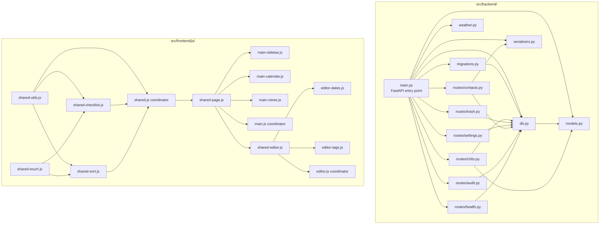

# Design Document — Manageable Code Blocks

## Overview

This design covers the restructuring of the CWOC codebase from a flat directory layout with five monolithic files into a well-organized `src/` directory tree with focused, single-responsibility files. The restructuring is executed in 12 sequential phases, each leaving the application fully functional.

The three coordinated changes are:

1. **Directory restructuring** — Move all source code under `src/` with logical subdirectories (`src/backend/`, `src/frontend/html/`, `src/frontend/js/`, `src/frontend/css/`, `src/static/`), and flatten the data directory to a top-level `data/` path.
2. **File decomposition** — Split five monolithic files (`backend/main.py`, `frontend/main.js`, `frontend/editor.js`, `frontend/shared.js`, `frontend/styles.css`) into smaller, focused files.
3. **Data directory reorganization** — Move contact profile images from `/app/static/contact_images/` to `data/contacts/profile_pictures/` and establish a scalable `data/` layout.

### Design Rationale

The restructuring is purely mechanical — no new features, no new dependencies, no behavioral changes. Every function, route, CSS rule, and HTML element continues to work identically. The key constraint is the vanilla JS architecture: all frontend functions must remain in global scope, loaded via `<script>` tags in the correct order. The backend uses standard Python imports with FastAPI's `APIRouter` for route modules.

The 12-phase approach ensures each step can be verified independently. Phases are ordered to minimize cross-cutting changes: backend splits before frontend splits, file decomposition before directory moves.

## Architecture

### Current Architecture

```
backend/
  main.py              (~4,500 lines — everything)

frontend/
  index.html           (loads shared.js → shared-page.js → main.js)
  editor.html          (loads editor_checklists.js → editor_projects.js → shared.js → shared-page.js → shared-editor.js → editor.js)
  main.js              (~7,300 lines — all dashboard logic)
  editor.js            (~4,600 lines — all editor logic)
  shared.js            (~5,000 lines — all shared utilities)
  styles.css           (~3,081 lines — all dashboard styles)
  ...other pages and files

static/
  contact_images/      (profile pictures mixed with app assets)
  ...logos, icons, parchment.jpg

data/data/
  app.db               (nested data/data/ path)
```

### Target Architecture

```
src/
  backend/
    __init__.py
    main.py            (entry point — imports and registers routes)
    models.py           (Pydantic models)
    db.py               (DB init, helpers, shared state)
    migrations.py       (all migrate_* functions)
    serializers.py      (vCard, CSV export/import)
    weather.py          (weather API, geocoding, schedulers)
    routes/
      __init__.py
      chits.py          (chit CRUD, recurrence)
      trash.py          (trash list, restore, purge)
      settings.py       (settings get/save, standalone alerts)
      contacts.py       (contact CRUD, image, import/export)
      audit.py          (audit log, auto-prune)
      health.py         (health check, version, WebSocket, health data)
  frontend/
    html/               (all .html files)
    js/
      shared/           (shared-utils.js, shared-checklist.js, etc.)
      dashboard/        (main-sidebar.js, main-calendar.js, etc.)
      editor/           (editor-dates.js, editor-tags.js, etc.)
      pages/            (shared-page.js, settings.js, people.js, etc.)
    css/
      shared/           (shared-page.css, shared-editor.css)
      dashboard/        (styles-variables.css, styles-layout.css, etc.)
      editor/           (editor.css)
  static/               (logos, icons, parchment.jpg — app assets only)

data/
  app.db                (flat — no nesting)
  contacts/
    profile_pictures/   (moved from /app/static/contact_images/)
    pgp_keys/           (placeholder for future use)
```

### Architecture Diagram



## Components and Interfaces

### Backend Components

#### main.py (Entry Point)
- Creates the `FastAPI` app instance
- Imports and registers all route modules via `app.include_router()`
- Calls all migration functions and `init_db()` at startup
- Mounts `StaticFiles` for frontend, static, and data directories
- Defines the `NoCacheStaticMiddleware`
- Starts weather schedulers via `@app.on_event("startup")`

#### models.py
- All Pydantic model classes: `Tag`, `Settings`, `Chit`, `MultiValueEntry`, `Contact`, `ImportRequest`
- No dependencies on other project modules

#### db.py
- `DB_PATH` constant and `_update_lock` threading lock (shared state)
- `init_db()` — creates the chits and settings tables
- `get_or_create_instance_id()`, `_build_export_envelope()`, `get_version_info()`, `update_version_info()`, `seed_version_info()`
- `serialize_json_field()`, `deserialize_json_field()`
- `compute_display_name()`, `compute_system_tags()`
- Imports from: `models.py`

#### migrations.py
- All `migrate_*` functions (15+ migration functions)
- `init_contacts_table()`
- Imports from: `db.py` (for `DB_PATH`)

#### serializers.py
- `vcard_parse()`, `vcard_print()`
- `csv_export()`, `csv_import()`
- `_csv_header()`
- Imports from: `models.py` (for `Contact` field definitions)

#### weather.py
- `_sync_weather_fetch()`, `_fetch_weather_for_location()`
- `_geocode_address()`, `_sync_geocode_fetch()`
- `weather_update()`, `_weather_hourly_loop()`, `_weather_daily_loop()`, `start_weather_schedulers()`
- `_get_chit_focus_date()`, `_partition_eligible_chits()`, `_extract_weather_for_date()`
- Imports from: `db.py` (for `DB_PATH`)

#### routes/chits.py
- `APIRouter` with prefix `/api`
- Handlers: `get_all_chits`, `search_chits`, `create_chit`, `get_chit`, `update_chit`, `delete_chit`, `patch_recurrence_exceptions`, `export_chits`, `export_userdata`, `import_chits`, `import_userdata`
- Imports from: `db.py`, `models.py`

#### routes/trash.py
- `APIRouter` with prefix `/api`
- Handlers: `get_trash`, `restore_chit`, `purge_chit`
- Imports from: `db.py`

#### routes/settings.py
- `APIRouter` with prefix `/api`
- Handlers: `get_settings`, `save_settings`, standalone alert CRUD (`get_standalone_alerts`, `create_standalone_alert`, `update_standalone_alert`, `delete_standalone_alert`), alert state management (`get_alert_states`, `set_alert_state`, `cleanup_alert_states`)
- Imports from: `db.py`, `models.py`

#### routes/contacts.py
- `APIRouter` with prefix `/api`
- Handlers: `create_contact`, `get_contacts`, `get_contact`, `update_contact`, `delete_contact`, `upload_contact_image`, `delete_contact_image`, `toggle_contact_favorite`, `export_contacts`, `export_single_contact`, `import_contacts`
- `_serialize_contact_for_db()`, `_row_to_contact()`, `_write_vcf_file()`
- Imports from: `db.py`, `models.py`, `serializers.py`

#### routes/audit.py
- `APIRouter` with prefix `/api`
- Handlers: `get_audit_log`, `export_audit_log_csv`, `trim_audit_log`, `clear_audit_log`, `auto_prune_audit_log`
- `get_current_actor()`, `compute_audit_diff()`, `insert_audit_entry()`, `_run_auto_prune()`
- Imports from: `db.py`

#### routes/health.py
- `APIRouter` with prefix `/api`
- Handlers: `health_check`, `get_instance_id`, `get_version`, `get_health_data`, `get_update_log`, `run_update`
- `root()` — serves index.html
- `editor()` — serves editor.html
- WebSocket: `websocket_sync`, `sync_send_message`, `sync_poll`
- `_SyncHub` class
- `geocode_proxy`
- Imports from: `db.py`

### Frontend JS Components

#### Shared Sub-Scripts (src/frontend/js/shared/)

| File | Purpose | Key Functions |
|------|---------|---------------|
| `shared-utils.js` | Core utilities | `generateUniqueId`, `formatDate`, `formatTime`, `setSaveButtonUnsaved`, `contrastColorForBg`, `applyChitColors`, `isLightColor`, `_utcToLocalDate`, `_parseISOTime`, `getPastelColor`, `cwocConfirm`, `getCachedSettings`, `_invalidateSettingsCache` |
| `shared-touch.js` | Touch drag support | `enableTouchDrag` and all touch event handling |
| `shared-checklist.js` | Inline checklist interactions | `toggleChecklistItem`, `moveChecklistItem`, `moveChecklistItemCrossChit`, `renderInlineChecklist` |
| `shared-sort.js` | Manual sort persistence | `getManualOrder`, `saveManualOrder`, `applyManualOrder`, `enableDragToReorder` |
| `shared-indicators.js` | Alert indicator helpers | `_chitHasAlerts`, `_getAlertIndicators`, `_getAllIndicators`, `_shouldShow`, `_chitAlertTypesPresent`, `_ALERT_TYPES`, `_ALERT_ICON_MAP`, `_STATUS_ICONS` |
| `shared-calendar.js` | Calendar display helpers | `getCalendarDateInfo`, `chitMatchesDay`, `calendarEventTitle`, `calendarEventTooltip`, `enableCalendarDrag`, `enableMonthDrag`, `enableAllDayDrag`, `renderAllDayEventsInCells`, `enableCalendarPinchZoom` |
| `shared-tags.js` | Tag tree and filtering | `buildTagTree`, `flattenTagTree`, `matchesTagFilter`, `renderTagTree`, `trackRecentTag`, `getRecentTags`, `createTagInline`, `isSystemTag` |
| `shared-recurrence.js` | Recurrence helpers | `formatRecurrenceRule`, `expandRecurrence`, `getRecurrenceSeriesInfo`, `_advanceRecurrence` |
| `shared-geocoding.js` | Shared geocoding | `_geocodeAddress` with progressive fallback |
| `shared-qr.js` | QR code modal | `showQRModal` and related display functions |
| `shared.js` | Coordinator | Shared state variables, remaining glue code (quick-edit modal, notes masonry layout, mobile sidebar, weather cache, sync WebSocket, shared alarm system, audio unlock, delete undo toast) |

**Load order**: `shared-utils.js` → `shared-touch.js` → `shared-checklist.js` → `shared-sort.js` → `shared-indicators.js` → `shared-calendar.js` → `shared-tags.js` → `shared-recurrence.js` → `shared-geocoding.js` → `shared-qr.js` → `shared.js`

#### Dashboard Sub-Scripts (src/frontend/js/dashboard/)

| File | Purpose | Key Functions |
|------|---------|---------------|
| `main-sidebar.js` | Sidebar rendering and filters | `CwocSidebarFilter`, `_buildTagFilterPanel`, `_buildPeopleFilterPanel`, `_renderPeopleFilterPanel`, `toggleSidebar`, `toggleSidebarSection`, `restoreSidebarState`, filter toggle/clear functions |
| `main-hotkeys.js` | Hotkey mode state machine | `_showPanel`, `_hideAllPanels`, `_dimSidebar`, `_exitHotkeyMode`, `_pickNav`, `_pickPeriod`, `_applyEnabledPeriods`, `_enterFilterSub`, `_toggleReference`, `_closeReference`, keyboard event dispatcher |
| `main-calendar.js` | All calendar period views | `displayWeekView`, `displayDayView`, `displaySevenDayView`, `displayWorkView`, `displayMonthView`, `displayItineraryView`, `displayYearView`, `renderTimeBar`, `scrollToSixAM`, `_addAllDayHeightCap`, date navigation helpers (`getWeekStart`, `getMonthStart`, `getYearStart`, `formatDate`, `formatWeekRange`, `previousPeriod`, `nextPeriod`, `changePeriod`, `goToToday`, `updateDateRange`) |
| `main-views.js` | List-based views | `displayChecklistView`, `displayTasksView`, `displayNotesView`, `displayProjectsView`, `_displayProjectsKanban`, `displayAlarmsView`, `_displayIndependentAlertsBoard`, `displayIndicatorsView`, `displaySearchView`, `_buildChitHeader`, `_renderChitMeta`, `filterChits`, `searchChits` |
| `main-alerts.js` | Alert system | `_globalCheckAlarms`, `_globalCheckNotifications`, `_startGlobalAlertSystem`, `_showAlertModal`, `_dismissAlertModal`, `_showTimerDoneModal`, `_sendBrowserNotification`, `_globalPlayAlarm`, `_globalStopAlarm`, `_globalPlayTimer`, `_globalStopTimer`, `_showGlobalToast`, `_loadAlertStates`, `_persistDismiss`, `_persistSnooze` |
| `main-search.js` | Global search overlay | `displaySearchView`, `_renderSearchResults`, `_getChitFieldValue`, `_saveSearch`, `_loadSavedSearch`, `_deleteSavedSearch`, `_renderSavedSearches` |
| `main-modals.js` | Clock, weather, quick-edit modals | `_openClockModal`, `_closeClockModal`, `_renderClocks`, `_renderAnalogClock`, `_openWeatherModal`, `_closeWeatherModal`, `_fetchWeatherForModal`, weather helper functions, `deleteChit`, `cancelEdit` |
| `main-init.js` | Application initialization | `DOMContentLoaded` handler, `displayChits` orchestrator, `fetchChits`, `_applySort`, `_applyMultiSelectFilters`, `_applyArchiveFilter`, `_applyChitDisplayOptions`, `_updateTabCounts`, `storePreviousState`, `_restoreUIState`, `_onDebouncedResize`, `_checkTabOverflow`, `_scheduleWeatherRefresh` |

**Load order**: `main-sidebar.js` → `main-hotkeys.js` → `main-calendar.js` → `main-views.js` → `main-alerts.js` → `main-search.js` → `main-modals.js` → `main-init.js` → `main.js`

#### Editor Sub-Scripts (src/frontend/js/editor/)

| File | Purpose | Key Functions |
|------|---------|---------------|
| `editor-dates.js` | Date mode system, recurrence | `onDateModeChange`, `_detectDateMode`, `_setDateMode`, `toggleAllDay`, `onRecurrenceChange`, `onRepeatToggle`, `_buildRecurrenceRule`, `_loadRecurrenceRule`, `_showTimeDropdown`, `_loadSnapSetting`, `clearStartAndEndDates`, `clearDueDate` |
| `editor-tags.js` | Tag tree in editor | `_loadTags`, `_renderTags`, `toggleAllTags`, `createTag`, `clearTagSearch`, `_filterTagTree`, `addSearchedTag`, `navigateToSettings` |
| `editor-people.js` | People zone | `_focusPeopleSearch`, `_initPeopleAutocomplete`, `_clearPeopleSearch`, `_loadAllContactsForTree`, `_renderPeopleTree`, `_filterPeopleTree`, `_toggleAllPeopleGroups`, `_addPeopleChip`, `_removePeopleChip`, `_renderPeopleChips`, `_syncPeopleHiddenField`, `_setPeopleFromArray` |
| `editor-location.js` | Location zone | `_getCoordinates`, `_getWeather`, `_fetchWeatherData`, `_displayWeatherInCompactSection`, `_displayMapInUI`, `loadSavedLocationsDropdown`, `onSavedLocationSelect`, `onAddDefaultLocation`, `onClearLocation`, `loadCompactLocationDropdown`, `onCompactLocationSelect`, `searchLocationMap`, `openLocationInNewTab`, `openLocationDirections` |
| `editor-notes.js` | Notes zone | `autoGrowNote`, `_checkChitLinkAutocomplete`, `_showChitLinkDropdown`, `_removeChitLinkDropdown`, `_insertChitLink`, `shrinkNoteToFourLines`, `_setNotesRenderToggleLabel`, `toggleNotesViewMode`, `copyNotesToClipboard`, `downloadNotes`, `openNotesModal`, `closeNotesModal`, `toggleModalNotesRender` |
| `editor-alerts.js` | Alerts zone | `renderAllAlerts`, `renderAlarmsContainer`, `renderNotificationsContainer`, `renderTimersContainer`, `renderStopwatchesContainer`, `_applyDefaultNotifications`, alarm/timer/stopwatch/notification CRUD modals, `_alertsFromChit`, `_alertsToArray`, `_startAlarmChecker`, `_checkAlarms` |
| `editor-color.js` | Color zone | `_fetchCustomColors`, `_setColor`, `_updateColorPreview`, `_renderCustomColors`, `_attachColorSwatchListeners` |
| `editor-health.js` | Health indicators | `renderHealthIndicator`, `_loadHealthData`, `_gatherHealthData` |
| `editor-save.js` | Save system | `buildChitObject`, `saveChitData`, `saveChit`, `saveChitAndStay`, `deleteChit`, `performDeleteChit`, `chitExists`, `cancelOrExit`, `setSaveButtonSaved`, `markEditorUnsaved`, `markEditorSaved`, `togglePinned`, `toggleArchived`, `_showQRCode`, `_showInstanceBanner`, `_saveInstanceException` |
| `editor-init.js` | Editor initialization | `_initializeChitId`, `resetEditorForNewChit`, `_collapseAllZonesForNewChit`, `loadChitData`, `applyZoneStates`, `setSelectValue`, `toggleZone`, `_toggleSection`, `initializeFlatpickr`, `_loadEditorTimeFormat`, `DOMContentLoaded` handler |

**Load order**: `editor-dates.js` → `editor-tags.js` → `editor-people.js` → `editor-location.js` → `editor-notes.js` → `editor-alerts.js` → `editor-color.js` → `editor-health.js` → `editor-save.js` → `editor-init.js` → `editor.js`

#### Dashboard Sub-Stylesheets (src/frontend/css/dashboard/)

| File | Purpose |
|------|---------|
| `styles-variables.css` | `:root` block with all CSS custom properties |
| `styles-layout.css` | Body, main content wrapper, header, top bar, logo |
| `styles-sidebar.css` | Sidebar positioning, sections, buttons, scroll, filter groups |
| `styles-tabs.css` | Tab bar, tab styling, active/hover states, icon-only mode, counts |
| `styles-calendar.css` | All calendar view styles: week grid, day columns, hour blocks, month grid, year view, timed/all-day events, drag resize handles |
| `styles-cards.css` | Chit card styling, header row, meta, completed/archived states, drag feedback, notes masonry, markdown styling |
| `styles-hotkeys.css` | Hotkey overlay, panels, options, reference overlay |
| `styles-modals.css` | Delete modal, clock modal, weather modal, quick-edit modal, all overlays |
| `styles-responsive.css` | All `@media` breakpoint rules (768px, 480px, 400px) |
| `styles.css` | Minimal coordinator — organizational comment and any remaining rules |

**Load order**: `styles-variables.css` → (other sub-stylesheets in any order) → `styles.css`

### Interface Contracts

All existing interfaces are preserved exactly:

- **24+ REST API endpoints** — identical request/response JSON contracts
- **Global JS function names** — all `onclick` handlers in HTML continue to work
- **CSS class names** — no changes to any class name or selector
- **URL paths** — updated from `/frontend/editor.html` to `/frontend/html/editor.html` etc., with all references updated consistently
- **Database schema** — identical tables, columns, and migration behavior

## Data Models

No data model changes. The existing SQLite schema and Pydantic models are preserved exactly. The only data-related change is:

### Contact Image Path Migration

The `image_url` column in the `contacts` table currently stores paths like `/static/contact_images/{contact_id}.jpg`. After the data directory reorganization:

- **Old path**: `/static/contact_images/{contact_id}.jpg`
- **New path**: `/data/contacts/profile_pictures/{contact_id}.jpg`

A migration function updates all existing `image_url` values, skipping NULL/empty rows. A new `StaticFiles` mount at `/data/contacts/` serves the profile pictures directory.

### Shared Backend State

The following shared state is defined in `db.py` and imported by route modules:

- `DB_PATH` — absolute path to the SQLite database file
- `_update_lock` — threading lock for concurrent update protection
- `CONTACT_IMAGES_DIR` — absolute path to profile pictures directory

## Error Handling

### Phase-Level Error Handling

Each of the 12 phases is designed to be independently reversible:

- **Pre-phase snapshot**: Before each phase, the developer can create a git commit as a checkpoint.
- **Verification gates**: Each phase includes specific verification steps (API endpoints respond, pages load without console errors, no broken image references).
- **Rollback strategy**: If a phase fails verification, revert to the pre-phase commit. No phase depends on a subsequent phase for correctness.

### Backend Module Import Errors

- If a module file has a syntax error or missing import, the FastAPI app will fail to start with a clear Python traceback pointing to the exact file and line.
- All module imports happen at startup time (not lazily), so import errors are caught immediately.

### Frontend Script Load Errors

- If a sub-script has a syntax error, the browser console will show the exact file and line number — this is the primary benefit of the split.
- If a sub-script is missing from the HTML `<script>` tags, functions it defines will be `undefined`, causing clear `ReferenceError` messages in the console.
- The coordinator files (`main.js`, `editor.js`, `shared.js`) load last, so they can verify that expected globals exist.

### Path Reference Errors

- Broken `StaticFiles` mount paths cause 404 errors for all assets under that mount — immediately visible.
- Broken `FileResponse` paths cause 500 errors on page navigation — immediately visible.
- Broken `<script src>` or `<link href>` paths cause 404s visible in the browser network tab.

### Data Migration Errors

- The contact image path migration skips NULL/empty `image_url` rows without error.
- If the old image directory doesn't exist or is empty, the migration completes with no file moves.
- The migration is idempotent — running it again on already-migrated paths is a no-op.

## Testing Strategy

### Why Property-Based Testing Does Not Apply

This feature is a pure code restructuring — moving files between directories, splitting monolithic files into smaller files, and updating path references. There are no new algorithms, data transformations, parsers, serializers, or business logic being created. The acceptance criteria are about preserving existing behavior, not creating new behavior that varies with input.

Property-based testing requires universal properties that hold across a wide range of generated inputs. The requirements here are structural (files exist in the right places, paths are correct, load order is correct) — these are verified by example-based checks, not by generating random inputs.

### Manual Verification Per Phase

Each phase has a verification checklist in `mega_restructure_plan.md`. Verification is manual because:

1. **No installs allowed** — no pytest, no hypothesis, no test frameworks can be added.
2. **The app is the test** — if the app starts and all pages load without console errors, the restructuring succeeded.
3. **Existing tests** — `backend/test_audit.py` and `backend/test_vcard.py` can be run after the backend split to verify those specific modules.

### Phase Verification Strategy

| Phase | Verification |
|-------|-------------|
| Phase 1: Create directories | Directories exist, no files moved |
| Phase 2: Data directory reorg | Profile images accessible at new URL, old path returns 404, DB migration applied |
| Phase 3: Split backend | `uvicorn backend.main:app` starts, all 24+ API endpoints return correct responses, existing tests pass |
| Phase 4: Move backend to src/ | `uvicorn src.backend.main:app` starts, all endpoints still work |
| Phase 5: Split shared.js | All pages load without console errors, shared functions available globally |
| Phase 6: Split main.js | Dashboard loads, all 6 C CAPTN views render, calendar navigation works, sidebar filters work |
| Phase 7: Split editor.js | Editor loads, all zones expand/collapse, save/load works, all zone interactions work |
| Phase 8: Split styles.css | Dashboard renders identically — no visual changes |
| Phase 9: Move frontend to src/ | All pages load from new paths, all `<script>` and `<link>` tags resolve |
| Phase 10: Move static to src/ | All images, audio, and assets load correctly |
| Phase 11: Create INDEX.md | Index file exists with complete function/file listings |
| Phase 12: Cleanup | No empty old directories remain, no broken references, full end-to-end verification |

### Specific Checks Per Phase

**Backend verification** (Phases 3-4):
- `GET /api/chits` returns chit list
- `GET /api/settings/default_user` returns settings
- `GET /api/contacts` returns contact list
- `GET /api/audit-log` returns audit entries
- `GET /api/health` returns health status
- `POST /api/chits` creates a chit successfully
- WebSocket at `/api/sync` connects

**Frontend verification** (Phases 5-9):
- Dashboard: all 6 tabs render, calendar navigation works, sidebar opens/closes, hotkeys work
- Editor: all zones expand/collapse, save creates a chit, load populates fields, date picker works
- Settings: tag editor works, save persists
- People: contact list renders, search works
- Contact editor: all fields populate, image upload works
- Trash: deleted chits appear, restore works
- Help: page renders with header/footer injection

**CSS verification** (Phase 8):
- Visual comparison: dashboard looks identical before and after split
- All CSS variables resolve (`:root` block loads first)
- Responsive breakpoints still trigger at correct widths
- No missing styles on any element

### Existing Test Files

- `backend/test_audit.py` — tests audit log functionality; run after backend split to verify audit module
- `backend/test_vcard.py` — tests vCard parsing/printing; run after backend split to verify serializers module

These tests should be updated to import from the new module paths after the split.
