# Design Document: Map, Weather & Tasks Mobile Parity

## Overview

This design covers achieving pixel-perfect functional parity between the CWOC mobile web (≤768px) and the Android app for three views: Map, Weather, and Tasks/Timeline. The mobile web is the reference implementation.

**Scope:**
- **Map**: People filter wiring, marker clustering, custom markers, popups, tooltips, period/tag/people filters, home button, focus mode
- **Weather**: Complete rewrite from vertical card layout to horizontal scrollable table with period filtering, event highlighting, city rows, drag reorder, day click navigation, week separators, temp conversion, precip formatting, temp borders, extreme highlighting
- **Timeline**: Entirely new view — dependency graph with nodes, SVG/Canvas lines, zoom/pan, highlighting, drag-to-link, context menu, link mode, order toggle, critical path, undo/redo

**Platform:** Android app only (Kotlin/Jetpack Compose)

---

## Architecture

```mermaid
graph TD
    subgraph "Map Enhancements"
        MS[MapScreen.kt] --> MVM[MapViewModel.kt]
        MS --> PFP[PeopleFilterPanel.kt]
        MS --> MC[MarkerClusterOverlay]
        MS --> MP[MarkerPopupOverlay]
        MS --> MT[MarkerTooltipOverlay]
        MVM --> CR[ChitRepository]
        MVM --> CD[ContactDao]
        MVM --> SR[SettingsRepository]
    end

    subgraph "Weather Rewrite"
        WS[WeatherScreen.kt] --> WVM[WeatherViewModel.kt]
        WS --> WHT[WeatherHorizontalTable]
        WS --> WDR[WeatherDragReorder]
        WVM --> API[CwocApiService]
        WVM --> CR
        WVM --> SR
    end

    subgraph "Timeline View (New)"
        TS[TasksScreen.kt] --> TVM[TasksViewModel.kt]
        TS --> TL[TimelineView.kt]
        TL --> TLC[TimelineCanvas]
        TL --> TLN[TimelineNode]
        TL --> TLL[TimelineLines]
        TL --> TLZ[TimelineZoomControls]
        TVM --> CR
        TVM --> TLA[TimelineAlgorithms.kt]
    end
```



### Key Architectural Decisions

1. **osmdroid clustering**: Use osmdroid's built-in `RadiusMarkerClusterer` for marker clustering rather than implementing custom clustering logic. This matches the web's Leaflet.markercluster behavior.

2. **Weather table as horizontally-scrolling Row**: Replace the current vertical `LazyColumn` of cards with a `Row` inside a `horizontalScroll` modifier, with each location as a row and each day as a column block. This matches the web's CSS grid/flex table layout.

3. **Timeline as Canvas-based composable**: Use Jetpack Compose's `Canvas` for drawing dependency lines (SVG equivalent) combined with absolutely-positioned composable nodes. Zoom/pan via `graphicsLayer` with `transformOrigin` and gesture detection via `pointerInput`.

4. **Pure algorithm extraction**: Timeline graph algorithms (cycle detection, critical path, layout computation) are extracted into a pure Kotlin object (`TimelineAlgorithms.kt`) with no Android dependencies, enabling direct unit testing.

5. **State management**: All new state flows through existing Hilt ViewModels with `StateFlow`. No new ViewModel classes needed — extend `MapViewModel`, `WeatherViewModel`, and `TasksViewModel`.

---

## Components and Interfaces

### Map Components

#### MarkerPopupOverlay
```kotlin
@Composable
fun MarkerPopupOverlay(
    marker: ChitMarker?,
    onDismiss: () -> Unit,
    onOpenEditor: (String) -> Unit,
    onOpenContact: (String) -> Unit
)
```
Displays a popup card over the map when a marker is tapped. Shows chit title/date/status/indicators or contact name/address with action button.

#### MarkerTooltipOverlay
Permanent title labels rendered as osmdroid `Marker.setTitle()` with custom `InfoWindow` that shows a small label above each marker. Hidden when popup is open for that marker.

#### MapViewModel Extensions
- Add `tagFilters: StateFlow<Set<String>>` and `peopleFilters: StateFlow<Set<String>>` (already partially present)
- Add `MapPeriod.NEXT_HOUR`, `MapPeriod.DAY`, `MapPeriod.NEXT_X_DAYS`, `MapPeriod.QUARTER` to the enum
- Add `homeButtonTapped()` method that emits `flyToPoint` with default lat/lon/zoom
- Wire `PeopleFilterPanel` callbacks to filter contact markers

### Weather Components

#### WeatherHorizontalTable
```kotlin
@Composable
fun WeatherHorizontalTable(
    forecasts: List<LocationForecast>,
    chits: List<ChitEntity>,
    period: WeatherPeriod,
    periodOffset: Int,
    weekStartDay: Int,
    tempUnit: String,
    precipUnit: String,
    rowOrder: List<String>,
    onDayClick: (String) -> Unit,
    onReorder: (Int, Int) -> Unit
)
```
The main weather table composable. Renders date header row + location rows with day blocks.

#### WeatherDayBlock
```kotlin
@Composable
fun WeatherDayBlock(
    forecast: DailyForecast,
    isToday: Boolean,
    hasEvent: Boolean,
    isExtreme: Boolean,
    isWeekStart: Boolean,
    tempUnit: String,
    precipUnit: String,
    onClick: () -> Unit
)
```
Individual day cell showing icon, temps (with gradient border), and precipitation.

#### WeatherViewModel Extensions
- Add `chits: StateFlow<List<ChitEntity>>` for event highlighting
- Add `period: StateFlow<WeatherPeriod>` and `periodOffset: StateFlow<Int>`
- Add `rowOrder: StateFlow<List<String>>` persisted to SharedPreferences
- Add `tempUnit: StateFlow<String>` and `precipUnit: StateFlow<String>` from settings
- Add `weekStartDay: StateFlow<Int>` from settings
- Add temperature conversion functions (`convertTemp`, `getTempBorderColor`, `isExtreme`)
- Add precipitation formatting (`formatPrecip`, `getPrecipType`)
- Add chit-location matching (`buildLocDateMap`)

### Timeline Components

#### TimelineView
```kotlin
@Composable
fun TimelineView(
    tasks: List<ChitEntity>,
    onOpenEditor: (String) -> Unit,
    viewModel: TasksViewModel
)
```
Top-level timeline composable containing the canvas, nodes, lines, and controls.

#### TimelineCanvas
Handles zoom/pan gestures via `pointerInput` with `detectTransformGestures` for pinch-zoom and `detectDragGestures` for panning. Renders within a `graphicsLayer` with scale/translation transforms.

#### TimelineNode
```kotlin
@Composable
fun TimelineNode(
    chit: ChitEntity,
    position: Offset,
    isHighlighted: Boolean,
    isCriticalPath: Boolean,
    isGreyedOut: Boolean,
    isLinkSource: Boolean,
    onTap: () -> Unit,
    onDoubleTap: () -> Unit,
    onLongPress: () -> Unit,
    onDragStart: () -> Unit,
    onDragEnd: (targetChitId: String?) -> Unit
)
```

#### TimelineAlgorithms (Pure Kotlin Object)
```kotlin
object TimelineAlgorithms {
    fun buildGraph(chits: List<ChitEntity>): DependencyGraph
    fun computeDepths(chits: List<ChitEntity>): Map<String, Int>
    fun wouldCycle(fromId: String, toId: String, graph: DependencyGraph): Boolean
    fun criticalPath(chits: List<ChitEntity>): Set<String>
    fun layoutByDate(chits: List<ChitEntity>, canvasWidth: Float): Map<String, NodePosition>
    fun layoutByDependency(chits: List<ChitEntity>, canvasWidth: Float): Map<String, NodePosition>
    fun connectedNodes(nodeId: String, graph: DependencyGraph): Set<String>
}

data class DependencyGraph(
    val forward: Map<String, List<String>>,  // prereqId → [dependentIds]
    val reverse: Map<String, List<String>>   // dependentId → [prereqIds]
)

data class NodePosition(
    val x: Float,
    val y: Float,
    val lane: String  // "dated" or "undated"
)
```

#### TasksViewModel Extensions
- Add `timelineZoom: MutableStateFlow<Float>` (0.25f to 3.0f)
- Add `timelineOffset: MutableStateFlow<Offset>`
- Add `timelineOrderMode: MutableStateFlow<TimelineOrderMode>` (BY_DATE, BY_DEPENDENCY)
- Add `highlightedNodes: MutableStateFlow<Set<String>>`
- Add `linkMode: MutableStateFlow<Boolean>`
- Add `linkSource: MutableStateFlow<String?>`
- Add `criticalPathActive: MutableStateFlow<Boolean>`
- Add `undoStack: MutableStateFlow<List<DependencyChange>>`
- Add `redoStack: MutableStateFlow<List<DependencyChange>>`
- Add `addDependency(prereqId: String, dependentId: String)` — with cycle check
- Add `removeDependency(prereqId: String, dependentId: String)`
- Add `undo()` and `redo()` methods

---

## Data Models

### Existing Models (Extended)

```kotlin
// ChitEntity already has:
// val prerequisites: List<String>?
// This is the dependency data source for the timeline.

// WeatherViewModel additions:
enum class WeatherPeriod(val label: String) {
    ONE_HOUR("1 Hour"),
    DAY("Day"),
    WORK_HOURS("Work Hours"),
    WEEK("Week"),
    X_DAYS("X Days"),
    MONTH("Month"),
    YEAR("Year"),
    FORECAST_MAX("Forecast Max (16 day)")
}

// MapViewModel additions:
enum class MapPeriod(val label: String) {
    ALL("All Time"),
    NEXT_HOUR("Next Hour"),
    TODAY("Today"),
    DAY("Day"),
    WEEK("Week"),
    NEXT_X_DAYS("Next X Days"),
    MONTH("Month"),
    QUARTER("Quarter"),
    YEAR("Year")
}
```

### New Models

```kotlin
// Timeline-specific models
data class DependencyChange(
    val type: ChangeType,  // ADD or REMOVE
    val prereqId: String,
    val dependentId: String,
    val timestamp: Long = System.currentTimeMillis()
)

enum class ChangeType { ADD, REMOVE }

enum class TimelineOrderMode { BY_DATE, BY_DEPENDENCY }

// Weather event highlighting
data class LocationDateEvents(
    val locationIndex: Int,
    val dates: Set<String>  // YYYY-MM-DD strings with events
)
```

### Temperature Conversion Functions

```kotlin
object WeatherUtils {
    fun convertTemp(celsius: Double?, toFahrenheit: Boolean): Int? {
        if (celsius == null) return null
        return if (toFahrenheit) ((celsius * 9.0 / 5.0) + 32).roundToInt()
        else celsius.roundToInt()
    }

    fun getTempBorderColor(celsius: Double?): Color {
        // Maps temperature to color gradient:
        // Very cold (< -10°C) → deep blue
        // Cold (0°C) → light blue
        // Mild (15°C) → green
        // Warm (25°C) → orange
        // Hot (> 35°C) → red
    }

    fun isExtreme(highC: Double?, lowC: Double?, weatherCode: Int?): Boolean {
        // Matches web's _wxIsExtreme: high > 5°C threshold
        return highC != null && highC > 5
    }

    fun formatPrecip(precip: Double?, weatherCode: Int?, emptyVal: String = "—"): String {
        if (precip == null || precip <= 0) return emptyVal
        val isSnow = weatherCode in listOf(71, 73, 75, 77, 85, 86)
        val icon = if (isSnow) "❄️" else "💧"
        return "$icon ${String.format("%.1f", precip)} mm"
    }

    fun isWeekStart(dateStr: String, weekStartDay: Int): Boolean {
        // Returns true if the date's day-of-week matches weekStartDay
    }

    fun computePeriodRange(period: WeatherPeriod, offset: Int, customDays: Int): Pair<LocalDate, LocalDate>? {
        // Returns start/end dates for the given period and offset
    }

    fun buildLocDateMap(chits: List<ChitEntity>, locations: List<LocationForecast>): Map<Int, Set<String>> {
        // Maps location index → set of YYYY-MM-DD dates with events
        // Case-insensitive matching of chit.location against location label/address
        // Considers start_datetime, end_datetime, due_datetime
        // Expands multi-day ranges
    }
}
```

---

## Correctness Properties

*A property is a characteristic or behavior that should hold true across all valid executions of a system — essentially, a formal statement about what the system should do. Properties serve as the bridge between human-readable specifications and machine-verifiable correctness guarantees.*

### Property 1: Filter Predicate Correctness

*For any* set of items (contacts or chits) and any combination of filter criteria (text search, favorites toggle, tag selection, people selection), all items in the filtered result set satisfy every active filter predicate, and no item satisfying all predicates is excluded from the result.

**Validates: Requirements 1.2, 1.3, 1.4, 1.6, 6.3, 7.3**

### Property 2: Period Date Range Computation

*For any* period type (Day, Week, Month, Quarter, Year, X Days) and any integer offset, the computed date range shall have start ≤ end, the span shall equal exactly one period unit, and incrementing the offset by 1 shall produce a range that starts exactly where the previous range ended + 1 day.

**Validates: Requirements 5.2, 5.3, 5.4, 5.5, 12.2, 12.3**

### Property 3: Chit-Location-Date Event Matching

*For any* set of chits with location and date fields, and any set of saved locations, the event matching function shall: (a) match locations case-insensitively against both label and address, (b) consider start_datetime, end_datetime, and due_datetime fields, and (c) for multi-day chits (start to end), include all intermediate dates in the result set.

**Validates: Requirements 13.1, 13.2, 13.3, 13.4**

### Property 4: Temperature Conversion Correctness

*For any* temperature value in Celsius, converting to Fahrenheit using F = C × 9/5 + 32 and formatting as an integer with degree symbol shall produce the correct result. Additionally, for any Celsius value, convertTemp(c, true) > c when c > -40 (the crossover point).

**Validates: Requirements 18.1, 18.2, 18.3, 18.4**

### Property 5: Precipitation Formatting Correctness

*For any* precipitation value and weather code, the formatting function shall: return em-dash for zero/null precipitation, use snow icon (❄️) for snow weather codes (71, 73, 75, 77, 85, 86), and use rain icon (💧) for all other non-zero precipitation codes.

**Validates: Requirements 19.1, 19.2, 19.3**

### Property 6: Temperature-to-Color Mapping Monotonicity

*For any* two temperatures where t1 < t2, the color mapping function shall produce colors where the "warmth" (red channel proportion) of getTempBorderColor(t2) ≥ getTempBorderColor(t1), maintaining a monotonic temperature-to-color gradient.

**Validates: Requirements 20.1, 20.2**

### Property 7: Extreme Weather Detection Consistency

*For any* daily forecast with high temperature, low temperature, and weather code, the isExtreme function shall return true if and only if the conditions meet the defined threshold (highC > 5), matching the web's `_wxIsExtreme` logic exactly.

**Validates: Requirements 21.1, 21.2**

### Property 8: Week Boundary Detection

*For any* date string in YYYY-MM-DD format and any configured week start day (0-6), the isWeekStart function shall return true if and only if the date's day-of-week equals the configured week start day.

**Validates: Requirements 17.1, 17.2**

### Property 9: Dependency Graph Cycle Detection

*For any* directed acyclic graph (DAG) of task dependencies and any proposed new edge (fromId → toId), the wouldCycle function shall return true if and only if adding the edge would create a cycle (i.e., toId can reach fromId through existing forward edges). Self-loops (fromId == toId) shall always return true.

**Validates: Requirements 25.5**

### Property 10: Connected-Node Highlighting Completeness

*For any* dependency graph and any selected node, the connectedNodes function shall return exactly the set of nodes that are direct neighbors (one edge away) — all nodes that are immediate prerequisites of the selected node, plus all nodes that are immediate dependents of the selected node.

**Validates: Requirements 24.1, 24.2**

### Property 11: Dependency Layout Ordering Invariant

*For any* set of tasks with prerequisites arranged in a DAG, the dependency-based layout shall position every node such that all of its prerequisites have a strictly smaller x-coordinate (are positioned to the left).

**Validates: Requirements 28.2, 28.3**

### Property 12: Critical Path is Longest Path

*For any* DAG of task dependencies, the critical path computation shall return a set of nodes forming the longest chain from any root (no prerequisites) to any leaf (no dependents). No other path in the graph shall have more nodes than the critical path.

**Validates: Requirements 29.2, 29.3**

### Property 13: Undo/Redo Round-Trip

*For any* sequence of dependency add/remove operations, undoing all operations in reverse order shall restore the dependency graph to its original state. Additionally, redoing all undone operations shall restore the graph to the state after all operations were applied.

**Validates: Requirements 30.1, 30.2, 30.3**

### Property 14: Persistence Round-Trip

*For any* valid row order (list of location labels) or view mode selection, persisting the value and then reading it back shall produce an identical value.

**Validates: Requirements 15.3, 15.4, 32.2**

---

## Error Handling

### Map Errors
- **Geocoding failure**: Show toast "Location not found" and maintain current map position. Already handled in `MapViewModel.goToAddress()`.
- **Cluster rendering failure**: Fall back to individual markers without clustering.
- **Focus mode with invalid address**: Show error toast, skip focus mode, load map normally.

### Weather Errors
- **API failure**: Show existing error state with retry button (already implemented).
- **City row geocoding failure**: Skip the city row silently (non-saved locations are supplementary).
- **Invalid temperature data**: Display "—" for null/invalid values.
- **Row order corruption**: Fall back to default order (as returned by API).

### Timeline Errors
- **Cycle detection on link**: Show toast "Cannot create circular dependency" and cancel the operation.
- **Invalid prerequisite reference**: Skip edges where the target chit doesn't exist in the visible set (already handled in web's `_tlBuildGraph`).
- **Layout computation overflow**: Cap node positions at canvas bounds, enable scrolling.
- **Undo stack overflow**: Limit undo stack to 50 entries, dropping oldest.
- **Dependency save failure**: Show error toast, revert local state, remove from undo stack.

---

## Testing Strategy

### Property-Based Tests (fast-check / kotlin-test with custom generators)

Property-based testing is appropriate for this feature because it contains multiple pure algorithm functions (filtering, date computation, graph algorithms, formatting) with clear input/output behavior and large input spaces.

**Library**: Use the existing project test infrastructure (JUnit + custom random generators as seen in existing property tests like `MapMarkerPropertyTest.kt`, `FilterEngineTest.kt`).

**Configuration**: Minimum 100 iterations per property test.

**Tag format**: `Feature: map-weather-tasks-mobile-parity, Property {number}: {property_text}`

Each correctness property (1-14) maps to a single property-based test targeting the pure function under test.

### Unit Tests (Example-Based)

- Marker popup content rendering (correct fields displayed)
- Cluster icon shape selection (chit=square, contact=circle, both=combined)
- Weather day block rendering (today highlight, event indicator, extreme class)
- Timeline node gesture disambiguation (single tap vs double tap vs long press)
- Timeline context menu option availability
- Link mode state transitions (activate → select source → select target → create link)

### Integration Tests

- osmdroid marker clustering behavior at various zoom levels
- Weather API response parsing and mapping to UI model
- City row geocoding and weather fetch for non-saved locations
- Dependency persistence via ChitRepository (add/remove prerequisites, sync)

### What Is NOT Property-Tested

- UI rendering and layout (visual verification only)
- osmdroid map interactions (external library behavior)
- Network requests and API responses (integration tests)
- Gesture detection (platform behavior)
- Navigation between screens (integration tests)
