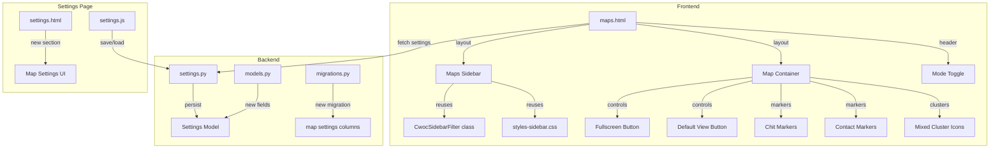

# Design Document: Maps View Overhaul

## Overview

The Maps View Overhaul redesigns the `/maps` page to maximize map visibility, improve filter ergonomics, and add new marker behaviors and user settings. The core changes are:

1. **Collapsible sidebar filters** — Move all filter controls from inline panels into a left sidebar, reusing the dashboard's `CwocSidebarFilter` class and `styles-sidebar.css` patterns.
2. **Maximized map area** — The map fills all available viewport space using a flexbox layout with `overflow: hidden` on the body.
3. **Header mode toggle** — Relocate the Chits/People toggle from the filter area into the page header so it's always visible.
4. **Semi-transparent people markers** — Contact markers get semi-transparent fills (matching chit marker style) so overlapping markers remain visible.
5. **Mixed cluster markers** — When a cluster contains both chit and contact markers, it renders with a distinct mixed icon (square with inscribed circle).
6. **Fullscreen mode** — A Leaflet control button activates the browser Fullscreen API.
7. **Map start settings** — New settings fields for default center, zoom, and auto-zoom behavior, with a corresponding "Default View" reset button on the map.
8. **Responsive layout** — Sidebar overlays on mobile (≤768px) with backdrop, compact header toggle, and touch-friendly controls.

All changes maintain the existing 1940s parchment/magic aesthetic and are mobile-friendly. No new dependencies are introduced — everything uses vanilla JS, existing CDN libs (Leaflet, Font Awesome), and the project's CSS variable system.

## Architecture

The overhaul modifies the existing Maps page architecture rather than introducing new pages or backend services. The changes span four layers:



**Key architectural decisions:**

- **Reuse over reinvention**: The sidebar reuses `CwocSidebarFilter` and dashboard sidebar CSS rather than building a new filter component. This keeps the codebase DRY and ensures visual consistency.
- **Single cluster group for mixed mode**: Rather than maintaining separate cluster groups that can't detect mixed composition, the design uses a single `L.markerClusterGroup` when both modes could overlap (or detects composition in the `iconCreateFunction`). Since the current design has separate modes (chits OR people, not both), mixed clusters only apply if a future "both" mode is added. For now, each mode's cluster group uses its own `iconCreateFunction` with the appropriate styling. The mixed cluster icon infrastructure is built into the `iconCreateFunction` so it's ready when needed.
- **No new JS files**: All changes go into existing files (`maps.js`, `maps.html`, `settings.js`, `settings.html`, `models.py`, `migrations.py`, `settings.py`). The maps page is self-contained enough that a new file isn't warranted.
- **CSS in shared-page.css**: New sidebar and map layout styles go into `shared-page.css` (where existing maps styles live) rather than creating a separate maps CSS file. Page-specific styles that are truly unique stay in the `<style>` block in `maps.html`.

## Components and Interfaces

### 1. Maps Sidebar (`maps.html` + `maps.js`)

**HTML structure:**
```html
<div class="maps-page-layout">
  <aside id="maps-sidebar" class="maps-sidebar active">
    <button id="maps-sidebar-toggle" class="maps-sidebar-toggle-btn">☰</button>
    <div class="maps-sidebar-scroll">
      <!-- Chits Filter Panel (shown when mode=chits) -->
      <div id="maps-chits-filter-panel" class="maps-sidebar-panel">
        <!-- Status, Tags, Priority, People, Text Search, Date Range, Clear -->
      </div>
      <!-- People Filter Panel (shown when mode=people) -->
      <div id="maps-people-filter-panel" class="maps-sidebar-panel" style="display:none">
        <!-- Text Search, Favorites, Tags, Clear -->
      </div>
    </div>
  </aside>
  <main class="maps-main">
    <div id="maps-container"></div>
  </main>
</div>
```

**JS functions (new/modified in `maps.js`):**

| Function | Description |
|---|---|
| `_initMapsSidebar()` | Initializes sidebar: restores state from localStorage, wires toggle button, sets up resize observer |
| `_toggleMapsSidebar()` | Toggles sidebar collapsed/expanded state, persists to localStorage, calls `_mapsLeafletMap.invalidateSize()` |
| `_restoreMapsSidebarState()` | Reads `cwoc_maps_sidebar` from localStorage, applies collapsed/expanded class |
| `_showMobileSidebarBackdrop()` | Creates/shows backdrop overlay on mobile when sidebar is expanded |
| `_hideMobileSidebarBackdrop()` | Hides/removes backdrop overlay |

**CSS classes (in `shared-page.css`):**

| Class | Description |
|---|---|
| `.maps-page-layout` | Flexbox row container: sidebar + main content, `height: calc(100vh - <header>)` |
| `.maps-sidebar` | Fixed-width left sidebar (240px), collapsible, scrollable content area |
| `.maps-sidebar.collapsed` | Width collapses to toggle button only (~40px) |
| `.maps-sidebar-toggle-btn` | Toggle button styled as a parchment-themed icon button |
| `.maps-sidebar-scroll` | Scrollable inner area for filter panels |
| `.maps-sidebar-panel` | Container for a mode's filter controls |
| `.maps-sidebar-backdrop` | Semi-transparent overlay for mobile sidebar |
| `.maps-main` | Flex-grow container for the map, fills remaining space |

**localStorage key:** `cwoc_maps_sidebar` — values: `"open"` or `"closed"`

### 2. Maximized Map Layout

The current layout wraps everything in a `.settings-panel` with padding and borders. The overhaul replaces this with a full-viewport flexbox layout:

```css
body[data-page-title="Maps View"] {
  padding: 0;
  overflow: hidden;
  height: 100vh;
}

.maps-page-layout {
  display: flex;
  height: calc(100vh - var(--maps-header-height, 56px));
  overflow: hidden;
}

.maps-main {
  flex: 1;
  min-width: 0;
  position: relative;
}

#maps-container {
  width: 100%;
  height: 100%;
}
```

The `.settings-panel` wrapper is removed for the maps page. The header bar (page title, mode toggle, nav buttons) sits above the flex layout.

### 3. Header Mode Toggle

The mode toggle moves from inside the filter panel area to the page header bar:

```html
<div class="maps-header">
  <div class="maps-header-left">
    <button id="maps-sidebar-toggle" class="maps-sidebar-toggle-btn" title="Toggle filters">
      <i class="fa-solid fa-bars"></i>
    </button>
    <h2>🗺️ Maps</h2>
  </div>
  <div class="maps-mode-toggle" id="maps-mode-toggle">
    <button class="maps-mode-btn active" data-mode="chits">Chits</button>
    <button class="maps-mode-btn" data-mode="people">People</button>
  </div>
  <div class="maps-header-right">
    <!-- Nav buttons (profile menu injected by shared-page.js) -->
  </div>
</div>
```

The existing `_mapsSetMode()` function is updated to also swap the sidebar panel visibility.

### 4. Semi-Transparent Contact Markers

**Current contact marker:** `L.divIcon` with a solid-colored `<div>`.

**New contact marker:** `L.circleMarker` (matching chit marker pattern) with:
- `fillOpacity: 0.6` (semi-transparent fill)
- `opacity: 1.0` (full-opacity border)
- Square shape achieved via a custom `L.divIcon` with CSS `border-radius: 4px` instead of `50%`

Alternatively, keep the `L.divIcon` approach but apply `opacity: 0.6` to the fill background via CSS `rgba()`:

```javascript
var iconHtml = '<div class="maps-contact-marker" style="background-color:' + _hexToRgba(color, 0.6) + ';border: 2px solid ' + color + ';">';
```

**New helper function:**

| Function | Description |
|---|---|
| `_hexToRgba(hex, alpha)` | Converts a hex color string to `rgba(r, g, b, alpha)` for semi-transparent fills |

### 5. Cluster Marker Styling

The cluster `iconCreateFunction` is customized for each cluster group:

**Chit clusters** — Square icon, brown/amber color scheme:
```javascript
_mapsClusterGroup = L.markerClusterGroup({
  iconCreateFunction: function(cluster) {
    var count = cluster.getChildCount();
    var size = count < 10 ? 'small' : (count < 100 ? 'medium' : 'large');
    return L.divIcon({
      html: '<div><span>' + count + '</span></div>',
      className: 'maps-chit-cluster maps-chit-cluster-' + size,
      iconSize: L.point(40, 40)
    });
  }
});
```

**People clusters** — Square icon, teal color scheme (already implemented).

**Mixed clusters** — Square icon with inscribed circle, purple/mixed color scheme. Since the current architecture uses separate cluster groups per mode (only one active at a time), mixed clusters would only occur if both modes are active simultaneously. The `iconCreateFunction` infrastructure is built to detect marker types via a custom property (`_cwocMarkerType: 'chit'` or `'contact'`) set on each marker. If a cluster contains both types, it renders the mixed icon.

**CSS classes:**

| Class | Description |
|---|---|
| `.maps-chit-cluster` | Square cluster icon with amber/brown gradient |
| `.maps-chit-cluster-small/medium/large` | Size variants |
| `.maps-people-cluster` | Square cluster icon with teal gradient (existing) |
| `.maps-mixed-cluster` | Square icon with inscribed circle, purple gradient |

### 6. Fullscreen Control

A custom Leaflet control added to the map:

```javascript
L.Control.Fullscreen = L.Control.extend({
  options: { position: 'topright' },
  onAdd: function(map) {
    var container = L.DomUtil.create('div', 'leaflet-bar maps-fullscreen-control');
    var button = L.DomUtil.create('a', 'maps-fullscreen-btn', container);
    button.href = '#';
    button.title = 'Toggle fullscreen';
    button.innerHTML = '<i class="fa-solid fa-expand"></i>';
    button.setAttribute('role', 'button');
    button.setAttribute('aria-label', 'Toggle fullscreen');
    // Click handler toggles fullscreen
    L.DomEvent.on(button, 'click', L.DomEvent.stop);
    L.DomEvent.on(button, 'click', this._toggleFullscreen, this);
    // Listen for fullscreenchange to update icon
    document.addEventListener('fullscreenchange', this._onFullscreenChange.bind(this));
    this._button = button;
    return container;
  },
  _toggleFullscreen: function() { /* ... */ },
  _onFullscreenChange: function() { /* ... */ }
});
```

The control checks `document.fullscreenEnabled` on creation and hides itself if the API is unavailable.

### 7. Default View Control

A custom Leaflet control:

```javascript
L.Control.DefaultView = L.Control.extend({
  options: { position: 'topright' },
  onAdd: function(map) {
    var container = L.DomUtil.create('div', 'leaflet-bar maps-default-view-control');
    var button = L.DomUtil.create('a', 'maps-default-view-btn', container);
    button.href = '#';
    button.title = 'Reset to default view';
    button.innerHTML = '<i class="fa-solid fa-house"></i>';
    button.setAttribute('role', 'button');
    button.setAttribute('aria-label', 'Reset to default view');
    L.DomEvent.on(button, 'click', L.DomEvent.stop);
    L.DomEvent.on(button, 'click', this._resetView, this);
    return container;
  },
  _resetView: function() {
    // Read settings: if auto-zoom enabled, fitBounds to markers
    // If auto-zoom disabled and custom center/zoom set, use those
    // Otherwise, default to US view (39.8283, -98.5795, zoom 4)
  }
});
```

### 8. Map Settings (Backend)

**Settings Model (`models.py`)** — New fields on the `Settings` class:
```python
map_default_lat: Optional[str] = None    # Latitude string, e.g. "39.8283"
map_default_lon: Optional[str] = None    # Longitude string, e.g. "-98.5795"
map_default_zoom: Optional[str] = None   # Zoom level string, e.g. "4"
map_auto_zoom: Optional[str] = "1"       # "1" = enabled (fit markers), "0" = disabled (use center/zoom)
```

**Migration (`migrations.py`)** — New function `migrate_add_map_settings()`:
```python
def migrate_add_map_settings():
    """Add map_default_lat, map_default_lon, map_default_zoom, map_auto_zoom columns to settings."""
    conn = None
    try:
        conn = sqlite3.connect(DB_PATH)
        cursor = conn.cursor()
        cursor.execute("PRAGMA table_info(settings)")
        existing = {row[1] for row in cursor.fetchall()}
        if "map_default_lat" not in existing:
            cursor.execute("ALTER TABLE settings ADD COLUMN map_default_lat TEXT")
        if "map_default_lon" not in existing:
            cursor.execute("ALTER TABLE settings ADD COLUMN map_default_lon TEXT")
        if "map_default_zoom" not in existing:
            cursor.execute("ALTER TABLE settings ADD COLUMN map_default_zoom TEXT")
        if "map_auto_zoom" not in existing:
            cursor.execute("ALTER TABLE settings ADD COLUMN map_auto_zoom TEXT DEFAULT '1'")
        conn.commit()
    except Exception as e:
        logger.error(f"Error adding map settings columns: {str(e)}")
    finally:
        if conn:
            conn.close()
```

**Settings Route (`settings.py`)** — The `save_settings` and `get_settings` functions are updated to include the four new fields in the INSERT/SELECT and serialization/deserialization logic.

### 9. Map Settings UI (Settings Page)

A new `setting-group` section in `settings.html`:

```html
<div class="setting-group">
  <h3>🗺️ Map Settings</h3>
  <div class="setting-inline">
    <label class="cwoc-checkbox-label">
      <input type="checkbox" id="map-auto-zoom" checked /> Auto-zoom to markers on load
    </label>
  </div>
  <div id="map-custom-view-settings">
    <div class="setting-inline">
      <label for="map-default-lat">Default Latitude</label>
      <input type="number" id="map-default-lat" step="any" placeholder="39.8283" />
    </div>
    <div class="setting-inline">
      <label for="map-default-lon">Default Longitude</label>
      <input type="number" id="map-default-lon" step="any" placeholder="-98.5795" />
    </div>
    <div class="setting-inline">
      <label for="map-default-zoom">Default Zoom (1–18)</label>
      <input type="number" id="map-default-zoom" min="1" max="18" placeholder="4" />
    </div>
  </div>
</div>
```

When auto-zoom is checked, the lat/lon/zoom inputs are visually dimmed (disabled). When unchecked, they become editable.

**JS functions (in `settings.js`):**

| Function | Description |
|---|---|
| `_toggleMapAutoZoom()` | Enables/disables the lat/lon/zoom inputs based on the auto-zoom checkbox |
| `_loadMapSettings(settings)` | Populates the map settings UI from the settings object |
| `_collectMapSettings()` | Reads the map settings UI values for saving |

### 10. Map Initialization Flow

The `_mapsInit()` function is updated to read map settings and decide the initial view:

```
1. Fetch settings via getCachedSettings()
2. Check Google Maps preference (existing)
3. Initialize Leaflet map with temporary default view
4. Read map_auto_zoom setting
5. If auto-zoom enabled:
   - Proceed with existing behavior (fetch markers, fitBounds)
6. If auto-zoom disabled:
   - Read map_default_lat, map_default_lon, map_default_zoom
   - If all three are set: setView(lat, lon, zoom)
   - Else: setView(39.8283, -98.5795, 4) (US default)
   - Then fetch and display markers WITHOUT fitBounds
```

## Data Models

### Settings Model Changes

| Field | Type | Default | Description |
|---|---|---|---|
| `map_default_lat` | `Optional[str]` | `None` | Default map center latitude |
| `map_default_lon` | `Optional[str]` | `None` | Default map center longitude |
| `map_default_zoom` | `Optional[str]` | `None` | Default map zoom level (1–18) |
| `map_auto_zoom` | `Optional[str]` | `"1"` | Auto-zoom to markers on load ("1"=yes, "0"=no) |

### SQLite Schema Changes

```sql
ALTER TABLE settings ADD COLUMN map_default_lat TEXT;
ALTER TABLE settings ADD COLUMN map_default_lon TEXT;
ALTER TABLE settings ADD COLUMN map_default_zoom TEXT;
ALTER TABLE settings ADD COLUMN map_auto_zoom TEXT DEFAULT '1';
```

### localStorage Keys

| Key | Values | Description |
|---|---|---|
| `cwoc_maps_sidebar` | `"open"` / `"closed"` | Sidebar collapsed/expanded state |
| `cwoc_maps_mode` | `"chits"` / `"people"` | Active mode (existing) |

## Correctness Properties

*A property is a characteristic or behavior that should hold true across all valid executions of a system — essentially, a formal statement about what the system should do. Properties serve as the bridge between human-readable specifications and machine-verifiable correctness guarantees.*

### Property 1: Sidebar state persistence round-trip

*For any* sequence of sidebar toggle actions (open/close), the final sidebar state stored in localStorage SHALL match the actual DOM state, and reading that value back on a simulated page load SHALL restore the same state.

**Validates: Requirements 1.6**

### Property 2: Contact marker opacity invariants

*For any* contact with a valid color (hex string), the generated marker SHALL have a fill opacity between 0.5 and 0.7 (inclusive) and a border opacity of 1.0.

**Validates: Requirements 4.1, 4.2**

### Property 3: Cluster marker composition classification

*For any* set of markers in a cluster, the cluster icon style SHALL correctly reflect its composition: chit-only clusters use the chit color scheme, people-only clusters use the people color scheme, and clusters containing both types use the mixed color scheme. The displayed count SHALL equal the total number of markers in the cluster.

**Validates: Requirements 5.3, 5.4, 5.5**

### Property 4: Map settings initialization from config

*For any* valid latitude (−90 to 90), longitude (−180 to 180), and zoom level (1 to 18) saved in user settings with auto-zoom disabled, the map SHALL initialize at that center point and zoom level.

**Validates: Requirements 7.4**

### Property 5: Map settings API round-trip

*For any* valid map settings values (map_default_lat, map_default_lon, map_default_zoom, map_auto_zoom), saving via `POST /api/settings` and reading back via `GET /api/settings/{user_id}` SHALL return the same values.

**Validates: Requirements 7.8**

## Error Handling

### Frontend Errors

| Scenario | Handling |
|---|---|
| Settings fetch fails during map init | Log error, fall back to default US view (39.8283, -98.5795, zoom 4) with auto-zoom behavior |
| Fullscreen API unavailable | Hide the fullscreen button entirely (check `document.fullscreenEnabled`) |
| Fullscreen request rejected (e.g., iframe restrictions) | Catch the promise rejection, log a warning, leave the button in "enter fullscreen" state |
| Geocoding fails for a marker | Skip that marker silently (existing behavior), log a console warning |
| localStorage unavailable | Catch exceptions in sidebar state save/restore, default to sidebar expanded |
| Invalid lat/lon/zoom in settings | Validate on the frontend before saving; if invalid values are read, fall back to US default |

### Backend Errors

| Scenario | Handling |
|---|---|
| Migration fails (column already exists) | Each migration checks column existence before ALTER TABLE — idempotent by design |
| Invalid map settings values in POST | Pydantic model accepts Optional[str] — no validation failure. Frontend validates before sending |
| Settings save fails | Return HTTP 500 with error detail (existing pattern) |

### Validation Rules

- **Latitude**: Must be a number between −90 and 90 (validated in frontend JS before save)
- **Longitude**: Must be a number between −180 and 180 (validated in frontend JS before save)
- **Zoom**: Must be an integer between 1 and 18 (validated in frontend JS before save)
- **Auto-zoom**: Must be "0" or "1" (checkbox produces these values)

## Testing Strategy

### Unit Tests (Example-Based)

Unit tests verify specific behaviors and edge cases:

- **Sidebar toggle**: Verify clicking the toggle button changes sidebar state and persists to localStorage
- **Mode switching**: Verify switching modes swaps the visible filter panel in the sidebar
- **Fullscreen toggle**: Verify the fullscreen button calls the correct API methods and updates its icon
- **Default view button**: Verify the button resets to the correct view based on settings (auto-zoom on, auto-zoom off with custom settings, auto-zoom off with no settings)
- **Map layout**: Verify the map container fills available space when sidebar is collapsed vs expanded
- **Settings UI**: Verify the auto-zoom checkbox enables/disables the lat/lon/zoom inputs
- **Migration idempotency**: Verify running the migration twice doesn't error

### Property-Based Tests

Property-based tests verify universal properties across generated inputs. The project uses vanilla JS with no test framework installed, so property tests would be implemented as backend Python tests (for the settings round-trip) using the existing test patterns in `src/backend/`.

- **Property 5 (Settings round-trip)**: Generate random valid lat/lon/zoom/auto-zoom values, POST to `/api/settings`, GET back, and verify equality. This is the most valuable property test since it validates the full backend persistence pipeline.
- **Property 1 (Sidebar persistence)**: Can be tested as a JS unit test — generate random toggle sequences, verify final state matches localStorage.
- **Properties 2, 3, 4**: These are frontend rendering properties that are better verified through example-based tests with a few representative inputs, since they depend on Leaflet DOM rendering which is difficult to property-test without a browser environment.

**PBT library**: Use Python's built-in `random` module with a simple property test loop (matching the existing `test_audit.py` pattern in the project), running 100+ iterations per property.

**Tag format**: `Feature: maps-view-overhaul, Property {number}: {property_text}`

### Integration Tests

- **End-to-end settings flow**: Save map settings via the settings page, navigate to the maps page, verify the map initializes at the configured view
- **Sidebar + mode interaction**: Toggle sidebar, switch modes, verify filter panels swap correctly
- **Mobile responsive**: Verify sidebar overlays on narrow viewports and backdrop closes it
