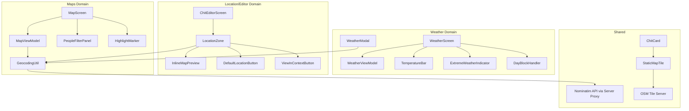

# Design Document: Maps, Weather & Location Parity

## Overview

This design covers the Android parity implementation for 20 web functions (W176-179, W183, W186, W779, W767, W768, W773, W165-167, W253-255, W791, W921) spanning Maps, Weather, and Location features. The implementation adds map thumbnails on chit cards, inline map previews in the editor, progressive fallback geocoding, weather navigation/interaction enhancements, people filters on the map, focus address handling, and temperature bar visualization.

All features target the existing Android architecture (Kotlin, Jetpack Compose, Room, Hilt, MVVM) and reuse existing dependencies (osmdroid, OkHttp, Gson). No new external dependencies are introduced.

## Architecture

The implementation spans three feature domains that share the `GeocodingUtil` utility:



### Key Design Decisions

1. **Static map tiles via URL composition** — Map thumbnails on cards use direct OSM tile URLs (`https://tile.openstreetmap.org/{z}/{x}/{y}.png`) loaded via Coil/AsyncImage. No osmdroid MapView needed for static previews, keeping cards lightweight.

2. **Inline map preview via osmdroid MapView** — The editor's LocationZone uses a small osmdroid `MapView` wrapped in `AndroidView` for the interactive inline preview. This reuses the existing osmdroid dependency already used by MapScreen.

3. **Progressive fallback geocoding in GeocodingUtil** — The existing `GeocodingUtil.geocode()` is extended with variant generation matching the web's `_geocodeAddress()`. Uses the server's `/api/geocode` proxy (already used by WeatherModal) to avoid Nominatim rate limits.

4. **Navigation route parameters for Map focus** — The `Screen.Map` route is extended with optional query parameters (`focusType`, `address`) to support "View in Context" navigation from the editor.

5. **Temperature bar as a custom Composable** — `TemperatureBar` is a `Canvas`-based composable that draws the gradient and highlighted range, matching the web's CSS-based implementation.

6. **Drag-to-reorder via existing ReorderableLazyColumn** — The WeatherScreen already uses `ReorderableLazyColumn` for location rows. The existing implementation satisfies Requirement 11.

## Components and Interfaces

### New Components

| Component | Location | Purpose |
|-----------|----------|---------|
| `StaticMapTile` | `ui/components/StaticMapTile.kt` | Composable rendering a static OSM tile image for a lat/lon |
| `InlineMapPreview` | `ui/components/InlineMapPreview.kt` | osmdroid MapView wrapper for editor LocationZone |
| `TemperatureBar` | `ui/components/TemperatureBar.kt` | Gradient temperature range bar composable |
| `PeopleFilterPanel` | `ui/screens/map/PeopleFilterPanel.kt` | Filter panel for contacts on MapScreen |
| `HighlightMarker` | `ui/screens/map/HighlightMarker.kt` | Temporary pulsing marker overlay for focus mode |

### Modified Components

| Component | Changes |
|-----------|---------|
| `GeocodingUtil` | Add progressive fallback variant generation, server proxy usage, country_code in result |
| `MapViewModel` | Add focus mode flag, mode switching on focusType, period override, highlight marker state, people filter state |
| `MapScreen` | Add PeopleFilterPanel, HighlightMarker rendering, focus mode behavior |
| `WeatherScreen` | Add TemperatureBar to day rows, extreme weather border styling, tap handler navigation |
| `WeatherViewModel` | Add extreme weather detection with proper thresholds, calendar navigation support |
| `WeatherModal` | Add "Type a location" option, text input + Go button, custom location weather fetch |
| `ChitEditorScreen` (LocationZone) | Add default location button, View in Context button, inline map preview, address field fix |
| `Screen.kt` | Extend `Screen.Map` with optional focusType/address parameters |
| `CwocNavGraph.kt` | Update Map composable route to accept and pass focus parameters |
| Chit card composables | Add StaticMapTile when showMapThumbnails enabled and location differs from default |

### Interfaces

```kotlin
// Extended GeocodingUtil result
data class GeoResult(
    val lat: Double,
    val lon: Double,
    val displayName: String,
    val countryCode: String? = null
)

// People filter state in MapViewModel
data class PeopleFilterState(
    val favoritesOnly: Boolean = false,
    val selectedTags: Set<String> = emptySet(),
    val searchText: String = "",
    val allPeopleOverride: Boolean = false
)

// Focus mode state in MapViewModel
data class FocusState(
    val isActive: Boolean = false,
    val focusType: String? = null,
    val address: String? = null,
    val highlightPoint: GeoPoint? = null,
    val highlightVisible: Boolean = false
)

// Temperature bar configuration
data class TempBarConfig(
    val barMin: Double,  // -10°C metric, 14°F imperial
    val barMax: Double,  // 40°C metric, 104°F imperial
    val dayLow: Double,
    val dayHigh: Double,
    val unitSystem: String
)
```

## Data Models

### GeocodingUtil Changes

```kotlin
object GeocodingUtil {
    data class GeoResult(
        val lat: Double,
        val lon: Double,
        val displayName: String,
        val countryCode: String? = null
    )

    // New: generate address variants for progressive fallback
    fun generateVariants(address: String): List<String>

    // Modified: tries variants sequentially via server proxy
    suspend fun geocode(address: String, serverUrl: String, authToken: String): GeoResult?

    // Backward-compatible: direct Nominatim (existing behavior, kept as fallback)
    suspend fun geocodeDirect(address: String): GeoResult?
}
```

### Navigation Route Extension

```kotlin
// Screen.kt — Map route with optional focus parameters
data object Map : Screen("map?focusType={focusType}&address={address}") {
    fun createRoute(focusType: String? = null, address: String? = null): String {
        val params = mutableListOf<String>()
        if (focusType != null) params.add("focusType=$focusType")
        if (address != null) params.add("address=${Uri.encode(address)}")
        return if (params.isEmpty()) "map" else "map?${params.joinToString("&")}"
    }
}
```

### Temperature Gradient Stops (matching web)

```kotlin
data class TempGradientStop(val tempC: Double, val color: Color)

val TEMP_GRADIENT_STOPS = listOf(
    TempGradientStop(-10.0, Color(0xFF001040)),  // Deep blue
    TempGradientStop(0.0, Color(0xFF2166AC)),    // Blue
    TempGradientStop(15.0, Color(0xFFE0DDD4)),   // Neutral
    TempGradientStop(22.0, Color(0xFFF0C830)),   // Yellow
    TempGradientStop(30.0, Color(0xFFD73027)),   // Red
    TempGradientStop(40.0, Color(0xFF3A0000))    // Dark red
)
```

### Extreme Weather Thresholds (matching web intent)

The web's `_wxIsExtreme` currently uses `highC > 5` which appears to be a placeholder/bug. The requirements specify:
- High ≥ 35°C
- Low ≤ -18°C
- WMO codes 95, 96, 99 (thunderstorms)

```kotlin
fun isExtreme(highC: Double?, lowC: Double?, weatherCode: Int?): Boolean {
    if (highC != null && highC >= 35.0) return true
    if (lowC != null && lowC <= -18.0) return true
    if (weatherCode in listOf(95, 96, 99)) return true
    return false
}
```

## Correctness Properties

*A property is a characteristic or behavior that should hold true across all valid executions of a system — essentially, a formal statement about what the system should do. Properties serve as the bridge between human-readable specifications and machine-verifiable correctness guarantees.*

### Property 1: Thumbnail visibility decision

*For any* chit with a location string, a default saved location, and a showMapThumbnails setting value, the thumbnail should be displayed if and only if: (a) showMapThumbnails is enabled, AND (b) the chit's location is non-empty, AND (c) the chit's location differs (case-insensitive) from the default saved location's address.

**Validates: Requirements 1.1, 1.2, 1.4**

### Property 2: Tile coordinate calculation

*For any* valid latitude in [-85.05, 85.05] and longitude in [-180, 180], the tile coordinate function at zoom level 14 shall produce tile x in [0, 2^14 - 1] and tile y in [0, 2^14 - 1], and the resulting tile URL shall be a valid OSM tile path.

**Validates: Requirements 1.3**

### Property 3: Saved location address extraction

*For any* saved location JSON object containing both a "name"/"label" field and an "address" field, the location extraction function shall always return the "address" field value, never the "name"/"label" field value.

**Validates: Requirements 3.2, 3.4**

### Property 4: Weather fetch gating on date presence

*For any* editor state where the location field is populated, if no date field (start, due, or point-in-time) is set, then geocoding and map display shall be triggered but weather fetch shall NOT be attempted.

**Validates: Requirements 3.8**

### Property 5: People filter AND composition

*For any* set of contacts and any combination of active people filters (favorites toggle, tag selection, text search), a contact appears in the filtered output if and only if it satisfies ALL active filters simultaneously: (a) if favorites is active, contact.favorite must be true; (b) if tags are selected, contact must have at least one tag in the selected set (OR within tags); (c) if text search is non-empty, at least one searchable field must contain the query as a case-insensitive substring.

**Validates: Requirements 5.2, 5.3, 5.4, 5.5**

### Property 6: All People override bypasses filters

*For any* people filter state where the "All People" toggle is enabled, the filtered output shall include every contact that has a non-empty address, regardless of the favorites toggle, tag selection, or text search values.

**Validates: Requirements 5.7**

### Property 7: Variant generation correctness

*For any* non-empty address string, the progressive fallback variant generation function shall produce a list of unique variants (compared case-insensitively after trimming) in the specified order: original, no-zip, period-normalized, comma-split-after-first, last-two-parts, city-state-with-zip, city-state-without-zip — omitting any that are empty or duplicate a previous entry.

**Validates: Requirements 7.1, 7.5**

### Property 8: Variant count bound

*For any* address string, the deduplicated variant list produced by the progressive fallback generator shall contain at most 7 entries.

**Validates: Requirements 7.2**

### Property 9: Geocode cache round-trip

*For any* address that successfully geocodes (via any variant), the cache shall contain the result keyed by the original address lowercased and trimmed, and retrieving from the cache with that key shall return the same lat/lon/countryCode.

**Validates: Requirements 7.3**

### Property 10: Extreme weather detection

*For any* forecast day with highC, lowC, and weatherCode values, the isExtreme function shall return true if and only if at least one of: (a) highC ≥ 35, (b) lowC ≤ -18, (c) weatherCode ∈ {95, 96, 99}. The function shall return a single boolean regardless of how many conditions are met.

**Validates: Requirements 9.1, 9.2, 9.3, 9.4**

### Property 11: Weather location reorder persistence round-trip

*For any* list of location forecasts and any valid reorder operation (moving item at index i to index j), persisting the reorder and then loading the forecasts shall produce a list in the reordered sequence, with any new locations (not in the saved order) appended at the end.

**Validates: Requirements 11.2, 11.3**

### Property 12: Whitespace input rejection for custom weather location

*For any* string composed entirely of whitespace characters (spaces, tabs, newlines, or empty string), the weather modal's "Go" action shall not trigger geocoding or weather fetch.

**Validates: Requirements 12.4**

### Property 13: Temperature bar position calculation

*For any* day low temperature, day high temperature, and unit system (metric or imperial), the temperature bar shall: (a) use scale [-10, 40] for metric or [14, 104] for imperial; (b) compute startPct = clamp((low - barMin) / (barMax - barMin) * 100, 0, 100); (c) compute endPct = clamp((high - barMin) / (barMax - barMin) * 100, 0, 100); (d) ensure startPct ≤ endPct.

**Validates: Requirements 13.1, 13.4, 13.5, 13.6**


## Error Handling

### Geocoding Errors

| Scenario | Handling |
|----------|----------|
| Network unreachable during geocoding | Return null/throw after all variants exhausted; caller shows toast "Location not found" |
| Server proxy returns non-200 | Skip that variant, try next; if all fail, throw |
| All variants return zero results | Throw "Location not found" error; caller retains address text in field |
| Malformed address (empty/whitespace) | Return null immediately without API call |
| Rate limiting (429) | Respect Retry-After header; skip variant and try next |

### Map Thumbnail Errors

| Scenario | Handling |
|----------|----------|
| Tile image fails to load (network) | Show placeholder map-marker icon; do not retry automatically |
| Geocode pending for chit location | Show placeholder icon until coordinates resolve |
| Invalid lat/lon from geocode | Do not render tile; show placeholder |

### Weather Errors

| Scenario | Handling |
|----------|----------|
| Open-Meteo API unreachable | Show error message in WeatherModal; retain previous data in WeatherScreen |
| Custom location geocode fails | Show "Location not found: [address]" in modal |
| Invalid temperature data (null) | Skip temperature bar rendering for that day; show "—" for temp text |

### Navigation Errors

| Scenario | Handling |
|----------|----------|
| Focus address geocode fails on MapScreen | Clear focus mode; show error toast; display default map view |
| Calendar Day view receives invalid date | Ignore navigation; remain on current view |
| Editor has unsaved changes on "View in Context" | Show confirmation dialog; only navigate on explicit "Leave" |

### Drag-and-Drop Errors

| Scenario | Handling |
|----------|----------|
| Persistence of reorder fails | UI reflects new order (optimistic); silently log error |
| Invalid from/to indices | No-op; return without modifying list |

## Testing Strategy

### Property-Based Tests

Property-based testing is appropriate for this feature because it contains multiple pure functions with clear input/output behavior (geocoding variant generation, filter logic, temperature calculations, tile coordinate math).

**Library:** [kotlin-quickcheck](https://github.com/nicemak/kotlin-quickcheck) or manual property test loops using JUnit + random generators (since no new dependencies are allowed, use `kotlin.random.Random` with JUnit `@RepeatedTest(100)`).

**Configuration:** Minimum 100 iterations per property test.

**Tag format:** `Feature: maps-weather-location-parity, Property {number}: {property_text}`

| Property | Test Target | Key Generators |
|----------|-------------|----------------|
| 1: Thumbnail visibility | `shouldShowMapThumbnail(location, defaultLocation, settingEnabled)` | Random strings for locations, random booleans for setting |
| 2: Tile coordinates | `latLonToTile(lat, lon, zoom)` | Random doubles in valid lat/lon ranges |
| 3: Address extraction | `extractLocationAddress(savedLocationJson)` | Random JSON objects with name/address fields |
| 4: Weather fetch gating | `shouldFetchWeather(hasLocation, hasDate)` | Random booleans |
| 5: People filter AND | `applyPeopleFilters(contacts, filterState)` | Random contact lists with random attributes, random filter states |
| 6: All People override | `applyPeopleFilters(contacts, filterState.copy(allPeople=true))` | Same as 5 with allPeople forced true |
| 7: Variant generation | `generateVariants(address)` | Random address strings in various formats |
| 8: Variant count bound | `generateVariants(address).size` | Random addresses including edge cases |
| 9: Cache round-trip | `geocode(address) → cache.get(address.lowercase().trim())` | Random addresses with mocked API |
| 10: Extreme weather | `isExtreme(highC, lowC, weatherCode)` | Random doubles for temps, random ints for codes |
| 11: Reorder round-trip | `reorder(list, from, to) → persist → load` | Random lists and valid index pairs |
| 12: Whitespace rejection | `isValidCustomLocation(input)` | Random whitespace-only strings |
| 13: Temp bar positions | `computeBarPositions(low, high, unitSystem)` | Random temps including out-of-range values |

### Unit Tests (Example-Based)

| Area | Test Cases |
|------|-----------|
| StaticMapTile | Correct URL for known lat/lon; placeholder on null coords |
| InlineMapPreview | Shows on geocode success; hides on clear; not shown on failure |
| DefaultLocationButton | Populates address field; shows error when no default; toggles to Clear |
| ViewInContext | Correct route construction; confirmation on dirty editor; hidden when empty |
| FocusMode | Mode switch on focusType; period override; highlight marker timeout |
| WeatherModal custom | Input field appears; Go triggers fetch; error on failure |
| DayBlock tap | Navigation with correct date/location; no-op on invalid date |
| Extreme weather styling | Red border on extreme; no border on normal |

### Integration Tests

| Area | Test Cases |
|------|-----------|
| Progressive geocoding end-to-end | Address that fails raw but succeeds on variant |
| Weather → Calendar navigation | Tap day block → calendar shows correct date |
| View in Context → Map focus | Editor → Map with highlight marker |
| Reorder persistence | Reorder → kill process → relaunch → verify order |

### What Is NOT Property-Tested

- UI rendering (composable layout, colors, dimensions) — verified by visual inspection and snapshot tests
- Navigation wiring — verified by integration tests
- Network behavior (timeouts, retries) — verified by unit tests with mocked OkHttp
- Drag gesture recognition — verified by manual testing
- 8-second highlight marker timeout — verified by coroutine test with `advanceTimeBy`
