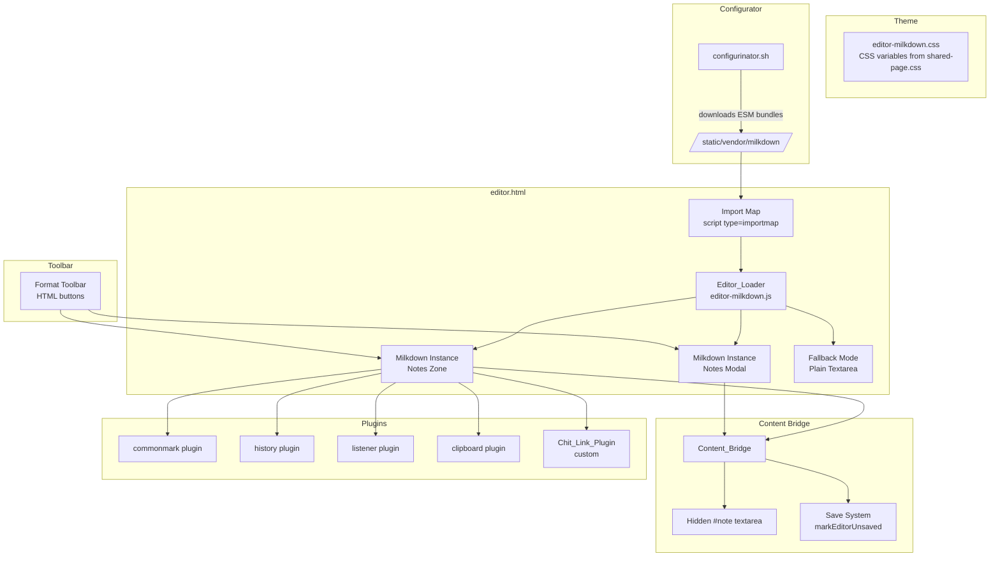
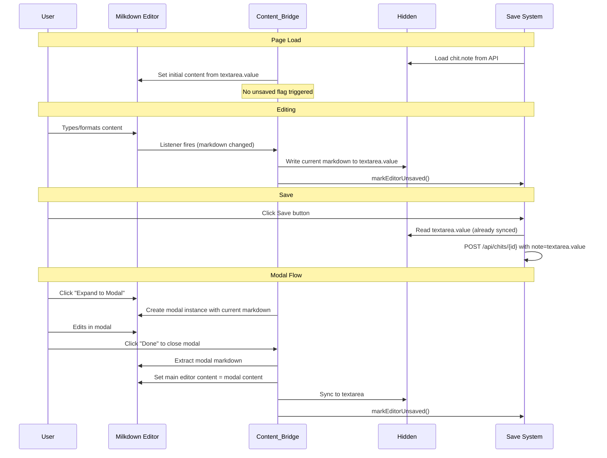

# Design Document: Milkdown Editor Integration

## Overview

This design integrates Milkdown — a plugin-driven WYSIWYG markdown editor built on ProseMirror and Remark — into CWOC's chit editor as the primary rich editing experience for the Notes zone and Notes modal. It replaces the current textarea + marked.js render-toggle approach and supersedes the custom "Obsidian-style Token-Level Live Preview" spec.

Milkdown is self-hosted: the configurator downloads ESM bundles to `/app/src/static/vendor/milkdown/` during install/update, and an `<script type="importmap">` in `editor.html` maps bare specifiers to these local files. This preserves CWOC's no-build-step, no-npm architecture while providing a full WYSIWYG markdown editing experience.

The integration is scoped to the chit editor page only. The dashboard Notes view continues using marked.js for read-only rendering, and inline dashboard editing remains a plain textarea.

### Design Decisions

1. **Import map + dynamic import** over script tags: Milkdown is an ESM-only library. Import maps let us use bare specifiers (`@milkdown/core`) without a bundler, pointing them to local files.
2. **Separate CSS file** (`editor-milkdown.css`) for all Milkdown theming rather than Milkdown's built-in theme packages, keeping full control over the parchment aesthetic.
3. **Hidden textarea as data bridge**: The existing `#note` textarea remains in the DOM (hidden) as the canonical data store. The Content Bridge syncs Milkdown state to it, so the existing save system works unchanged.
4. **Fallback-first loading**: The textarea is shown by default. Milkdown replaces it only after successful load, ensuring zero-downtime editing if vendor files are missing.
5. **No Milkdown on dashboard**: Milkdown is heavyweight (~200KB+ of ESM modules). Loading it only on the editor page keeps the dashboard fast.

## Architecture



### Data Flow: Content Synchronization



## Components and Interfaces

### Component 1: Editor_Loader (`editor-milkdown.js`)

**Purpose**: Loads Milkdown via dynamic import, creates/destroys editor instances, manages lifecycle and fallback.

**Interface**:
```javascript
/**
 * Global namespace for Milkdown integration.
 * Attached to window for access from other editor scripts.
 */
window.CwocMilkdown = {
  /** Promise that resolves when Milkdown modules are loaded, rejects on failure */
  ready: Promise,

  /**
   * Create a Milkdown editor instance in a container element.
   * @param {HTMLElement} container - DOM element to mount editor into
   * @param {string} initialMarkdown - Starting content
   * @param {object} options - { onUpdate: fn, editorId: string }
   * @returns {Promise<MilkdownEditorInstance>}
   */
  createEditor(container, initialMarkdown, options): Promise,

  /**
   * Destroy a Milkdown editor instance and clean up.
   * @param {MilkdownEditorInstance} instance
   */
  destroyEditor(instance): void,

  /**
   * Extract current markdown from an editor instance.
   * @param {MilkdownEditorInstance} instance
   * @returns {string}
   */
  getMarkdown(instance): string,

  /**
   * Set markdown content in an editor instance.
   * @param {MilkdownEditorInstance} instance
   * @param {string} markdown
   */
  setMarkdown(instance, markdown): void,

  /** Whether Milkdown loaded successfully */
  isLoaded: boolean,

  /** Whether we're in fallback mode */
  isFallback: boolean,
};
```

**Responsibilities**:
- Dynamic import of `@milkdown/core`, `@milkdown/preset-commonmark`, `@milkdown/plugin-history`, `@milkdown/plugin-listener`, `@milkdown/plugin-clipboard`
- 5-second timeout on import — if exceeded, activate fallback mode
- Create editor instances with the full plugin set
- Destroy instances on page unload (cleanup via `beforeunload` listener)
- Expose ready promise for other components to await

---

### Component 2: Content_Bridge (`editor-milkdown.js`, integrated)

**Purpose**: Syncs markdown between Milkdown instances and the hidden `#note` textarea, integrates with the save system.

**Interface**:
```javascript
/**
 * Initialize the Content Bridge for the Notes zone.
 * Called after Milkdown is ready and the editor instance is created.
 */
function _initContentBridge(editorInstance): void

/**
 * Sync modal editor content back to main editor on modal close.
 * @param {MilkdownEditorInstance} modalInstance
 * @param {MilkdownEditorInstance} mainInstance
 */
function _syncModalToMain(modalInstance, mainInstance): void

/**
 * Extract markdown for save/copy/download operations.
 * @returns {string} Current markdown from the active editor
 */
function _getActiveMarkdown(): string
```

**Responsibilities**:
- Register Milkdown listener plugin callback to detect content changes
- On every content change: write markdown to `#note` textarea, call `markEditorUnsaved()`
- On initial load: set editor content from textarea without triggering unsaved state (use a `_suppressUnsaved` flag)
- On modal close: extract modal markdown, set into main editor, sync to textarea
- Provide `_getActiveMarkdown()` for copy-to-clipboard and download-as-md features

---

### Component 3: Theme_Layer (`editor-milkdown.css`)

**Purpose**: Styles the Milkdown editor to match CWOC's 1940s parchment aesthetic using existing CSS variables.

**Interface**: Pure CSS file, no JavaScript API.

**Key Styling Targets**:
```css
/* Editor container */
.milkdown-editor { ... }

/* ProseMirror content area */
.milkdown-editor .ProseMirror { ... }

/* Block elements */
.milkdown-editor h1, h2, h3, h4, h5, h6 { ... }
.milkdown-editor blockquote { ... }
.milkdown-editor pre code { ... }
.milkdown-editor hr { ... }

/* Inline elements */
.milkdown-editor a { ... }
.milkdown-editor code { ... }

/* Focus state */
.milkdown-editor .ProseMirror:focus { ... }

/* Auto-grow and scroll */
.milkdown-editor .ProseMirror { min-height: 6em; max-height: 60vh; overflow-y: auto; }
```

**Design Choices**:
- Uses `var(--parchment-light)`, `var(--text-color)`, `var(--aged-brown-medium)`, `var(--accent-gold)` from `shared-page.css`
- Font: `'Lora', Georgia, serif` (inherited from body)
- Headings: decreasing size from H1 (1.6em) to H6 (1em), color `var(--aged-brown-dark)`
- Code blocks: `background: var(--parchment-medium)`, `border: 1px solid var(--aged-brown-medium)`, monospace font
- Blockquotes: left border `3px solid var(--accent-gold)`, italic
- Links: `color: var(--info-blue)`, underline on hover
- Focus: `box-shadow: 0 0 0 2px var(--accent-gold)`
- Minimum font size: 16px (body inherited), never below 14px

---

### Component 4: Chit_Link_Plugin (`editor-milkdown-chitlink.js`)

**Purpose**: Custom Milkdown/ProseMirror plugin providing `[[title]]` autocomplete for cross-referencing chits.

**Interface**:
```javascript
/**
 * Creates the chit link autocomplete plugin for Milkdown.
 * @param {string} currentChitId - ID of the chit being edited (excluded from results)
 * @returns {MilkdownPlugin} Plugin to pass to editor.use()
 */
function createChitLinkPlugin(currentChitId): MilkdownPlugin
```

**Behavior**:
- Monitors text input for `[[` trigger sequence
- On trigger: fetches chit titles from `/api/chits` (cached after first fetch)
- Displays a positioned dropdown below the cursor with filtered matches
- Filters: case-insensitive substring match on title, excludes current chit
- Keyboard navigation: Arrow Up/Down to highlight, Enter to select, Escape to dismiss
- On selection: replaces the `[[query` text with `[[selected title]]`
- Dropdown styled to match CWOC parchment theme (same as existing chit link dropdown)

**Implementation Approach**:
- Uses ProseMirror's `Plugin` system with a `DecorationSet` for the dropdown positioning
- Alternatively, uses a DOM-based dropdown positioned relative to the editor (simpler, matches existing pattern in `editor-notes.js`)
- The simpler DOM approach is preferred since it matches the existing codebase pattern

---

### Component 5: Format Toolbar (HTML + JS in `editor-milkdown.js`)

**Purpose**: Provides formatting buttons above the editor that execute ProseMirror commands.

**Interface**:
```javascript
/**
 * Execute a format action on the active Milkdown editor.
 * @param {string} action - One of: 'bold', 'italic', 'strikethrough', 'link',
 *   'h1', 'h2', 'h3', 'bulletList', 'orderedList', 'blockquote', 'code', 'hr'
 */
function _milkdownFormat(action): void

/**
 * Update toolbar button active states based on current cursor position.
 * Called on editor selection change.
 */
function _updateToolbarState(): void
```

**Toolbar Layout** (HTML in `editor.html`):
```
[B] [I] [S] [🔗] | [H1] [H2] [H3] | [•] [1.] [❝] [</>] [—]
```

**Keyboard Shortcuts** (same as current):
- Ctrl/Cmd+B: Bold
- Ctrl/Cmd+I: Italic
- Ctrl/Cmd+K: Link
- Ctrl/Cmd+E: Inline code
- Ctrl/Cmd+Shift+X: Strikethrough

## File Structure

### New Files

| File | Purpose |
|------|---------|
| `src/frontend/js/editor/editor-milkdown.js` | Editor_Loader + Content_Bridge + Format Toolbar logic |
| `src/frontend/js/editor/editor-milkdown-chitlink.js` | Chit_Link_Plugin (custom autocomplete) |
| `src/frontend/css/editor/editor-milkdown.css` | Theme_Layer (parchment styling for Milkdown) |
| `src/static/vendor/milkdown/` | Directory for self-hosted ESM bundles (created by configurator) |

### Modified Files

| File | Changes |
|------|---------|
| `src/frontend/html/editor.html` | Add import map, add `<link>` for `editor-milkdown.css`, add `<script type="module">` for editor-milkdown.js, update Notes zone HTML (add milkdown container div, keep hidden textarea) |
| `src/frontend/js/editor/editor-notes.js` | Guard existing functions behind `CwocMilkdown.isFallback` check; when Milkdown is active, delegate to Milkdown-based implementations |
| `src/frontend/js/editor/editor-init.js` | Add Milkdown initialization call after page load |
| `install/configurinator.sh` | Add Milkdown ESM bundle download step |

### Vendor Files (downloaded by configurator)

The configurator downloads these ESM bundles to `/app/src/static/vendor/milkdown/`:

```
vendor/milkdown/
├── core.js              # @milkdown/core
├── ctx.js               # @milkdown/ctx
├── prose.js             # @milkdown/prose (ProseMirror re-exports)
├── preset-commonmark.js # @milkdown/preset-commonmark
├── plugin-history.js    # @milkdown/plugin-history
├── plugin-listener.js   # @milkdown/plugin-listener
├── plugin-clipboard.js  # @milkdown/plugin-clipboard
├── transformer.js       # @milkdown/transformer
└── utils.js             # @milkdown/utils
```

These are pinned to a specific Milkdown version (e.g., 7.x) and downloaded from esm.sh or jsdelivr as pre-built ESM bundles with all dependencies inlined.

### Import Map (in editor.html)

```html
<script type="importmap">
{
  "imports": {
    "@milkdown/core": "/static/vendor/milkdown/core.js",
    "@milkdown/ctx": "/static/vendor/milkdown/ctx.js",
    "@milkdown/prose": "/static/vendor/milkdown/prose.js",
    "@milkdown/preset-commonmark": "/static/vendor/milkdown/preset-commonmark.js",
    "@milkdown/plugin-history": "/static/vendor/milkdown/plugin-history.js",
    "@milkdown/plugin-listener": "/static/vendor/milkdown/plugin-listener.js",
    "@milkdown/plugin-clipboard": "/static/vendor/milkdown/plugin-clipboard.js",
    "@milkdown/transformer": "/static/vendor/milkdown/transformer.js",
    "@milkdown/utils": "/static/vendor/milkdown/utils.js"
  }
}
</script>
```

## Data Models

### Editor Instance State

```javascript
/**
 * Internal state tracked per Milkdown editor instance.
 */
{
  id: string,              // Unique identifier ('notes-zone' or 'notes-modal')
  editor: Editor,          // Milkdown Editor object
  container: HTMLElement,  // DOM container element
  isDestroyed: boolean,    // Whether destroy() has been called
}
```

### Content Bridge State

```javascript
/**
 * Module-level state for the Content Bridge.
 */
{
  _mainInstance: EditorInstance | null,   // Notes zone editor
  _modalInstance: EditorInstance | null,  // Notes modal editor (when open)
  _suppressUnsaved: boolean,             // True during initial content load
  _textarea: HTMLTextAreaElement,         // Reference to #note textarea
}
```

### Chit Link Cache

```javascript
/**
 * Cached chit titles for autocomplete.
 * Fetched once per page load, refreshed on demand.
 */
window._allChitTitles = [
  { id: string, title: string },
  ...
]
```

## Correctness Properties

*A property is a characteristic or behavior that should hold true across all valid executions of a system — essentially, a formal statement about what the system should do. Properties serve as the bridge between human-readable specifications and machine-verifiable correctness guarantees.*

### Property 1: Markdown Round-Trip Preservation

*For any* valid markdown string containing commonmark elements (headings, bold, italic, code, lists, blockquotes, links, paragraphs), setting that content into a Milkdown editor instance and then extracting it SHALL produce markdown that, when rendered to HTML, produces semantically equivalent output to the original markdown rendered to HTML.

**Validates: Requirements 3.5**

### Property 2: Content Bridge Textarea Sync

*For any* sequence of edit operations performed on the Milkdown editor, the hidden `#note` textarea value SHALL always reflect the current markdown state of the editor after each edit completes.

**Validates: Requirements 3.2, 3.3**

### Property 3: Modal-to-Main Content Sync

*For any* markdown content present in the Notes modal editor, closing the modal with "Done" SHALL result in the main Notes zone editor containing that same markdown content.

**Validates: Requirements 2.3**

### Property 4: Paste Sanitization

*For any* clipboard content containing HTML markup (including script tags, event handlers, style elements, and arbitrary HTML), pasting into the Milkdown editor SHALL result in only plain text or valid markdown being inserted — no raw HTML tags, script elements, or event handler attributes SHALL appear in the editor's markdown output.

**Validates: Requirements 4.4, 4.5, 10.3**

### Property 5: Chit Link Autocomplete Filtering

*For any* query string typed after `[[` and any set of chit titles, the autocomplete results SHALL: (a) contain only titles that include the query as a case-insensitive substring, and (b) never include the currently-edited chit's title/ID.

**Validates: Requirements 6.3, 6.6**

### Property 6: Chit Link Insertion Format

*For any* chit title selected from the autocomplete dropdown, the text inserted into the editor SHALL be exactly `[[selected title]]` — the title wrapped in double square brackets with no modification to the title text.

**Validates: Requirements 6.2**

### Property 7: Format Action Correctness

*For any* selected text in the editor and any format action (bold, italic, strikethrough, code, heading, list, blockquote), applying the format SHALL produce markdown where the selected text is wrapped in or prefixed with the correct markdown syntax for that format type.

**Validates: Requirements 7.2**

### Property 8: Schema-Based XSS Prevention

*For any* markdown content containing `<script>` tags, `javascript:` URLs, `on*` event handler attributes, or `<iframe>` elements, the Milkdown editor's rendered DOM SHALL contain none of these executable elements — they are excluded by the ProseMirror schema.

**Validates: Requirements 10.1**

### Property 9: Link Security Attributes

*For any* markdown link (`[text](url)`) rendered in the Milkdown editor, the resulting anchor element in the DOM SHALL include `rel="noopener noreferrer"` and `target="_blank"` attributes.

**Validates: Requirements 10.2**

## Error Handling

### Scenario 1: Milkdown Vendor Files Missing or Corrupt

**Condition**: Dynamic import fails because ESM files are not at expected paths or are malformed.
**Detection**: `Promise.race` with 5-second timeout on the initial dynamic import.
**Response**: Set `CwocMilkdown.isFallback = true`, show the plain textarea (already visible by default), display a non-blocking toast notification ("Rich editor unavailable — editing in plain text mode"), log error details to `console.error`.
**Recovery**: User can still edit and save normally via textarea. Next configurator update will re-download vendor files.

### Scenario 2: Editor Instance Creation Fails

**Condition**: Milkdown modules loaded but `Editor.make()` throws (e.g., container element missing, plugin conflict).
**Detection**: try/catch around `createEditor()`.
**Response**: Fall back to textarea for that specific container. Log error. Other instances (if any) are unaffected.
**Recovery**: Page reload may fix transient issues.

### Scenario 3: Content Extraction Returns Empty/Null

**Condition**: `getMarkdown()` returns empty string when editor visually has content (ProseMirror state corruption).
**Detection**: Content Bridge checks extracted markdown length against a "was there content before?" flag.
**Response**: If extraction returns empty but previous content existed, do NOT overwrite textarea. Log warning. Show user notification.
**Recovery**: User can copy content manually from the visible editor. Textarea retains last-known-good value.

### Scenario 4: Listener Plugin Stops Firing

**Condition**: Content changes occur but the listener callback is not invoked (plugin misconfiguration or ProseMirror transaction issue).
**Detection**: On save, compare textarea value with freshly-extracted markdown. If they differ, the listener missed updates.
**Response**: On save action, always do a fresh `getMarkdown()` extraction as a safety net, regardless of whether the listener has been keeping textarea in sync.
**Recovery**: This is a defensive measure — the save path always extracts fresh content.

### Scenario 5: Chit Link API Fetch Fails

**Condition**: `/api/chits` returns error or network timeout during autocomplete.
**Detection**: try/catch on fetch call.
**Response**: Silently close/hide the autocomplete dropdown. User can still type `[[title]]` manually.
**Recovery**: Next `[[` trigger will retry the fetch.

### Scenario 6: Multiple Rapid Editor Creates/Destroys

**Condition**: User rapidly opens/closes the Notes modal, creating and destroying instances.
**Detection**: Track instance state with `isDestroyed` flag.
**Response**: Guard all operations against destroyed instances. Queue destroy operations to avoid race conditions.
**Recovery**: Each create/destroy pair is independent. Stale references are nulled out.

## Testing Strategy

### Property-Based Tests (Python stdlib `unittest` + `random`, 120 iterations)

Property-based testing applies to the pure logic components of this feature:

1. **Chit link filtering** (Property 5): Generate random chit title lists and query strings, verify filtering correctness.
2. **Chit link insertion format** (Property 6): Generate random title strings (including special characters, unicode, brackets), verify `[[title]]` format.
3. **Paste sanitization logic** (Property 4): Generate random HTML strings with injection attempts, verify stripping produces safe output.
4. **XSS prevention** (Property 8): Generate markdown with embedded script/event handler attempts, verify they don't survive schema processing.

Each property test runs 120 iterations with randomized inputs. Tests are tagged with:
```python
# Feature: milkdown-editor, Property N: <property text>
```

**Testing library**: Python stdlib `unittest` + `random` module (no external dependencies).

### Unit Tests (Example-Based)

- Editor_Loader: test ready state resolution, test 5-second timeout fallback
- Content_Bridge: test initial load doesn't trigger unsaved, test save extracts fresh markdown
- Format toolbar: test each button maps to correct ProseMirror command name
- Chit_Link_Plugin: test `[[` trigger detection, test Escape closes dropdown, test keyboard navigation
- Fallback mode: test textarea is shown when `isFallback = true`

### Integration Tests

- Full page load → Milkdown initializes → type content → save → reload → content preserved
- Modal open → edit → Done → main editor updated → save → content correct
- Fallback mode: remove vendor files → page load → textarea shown → edit → save works
- Format toolbar: click Bold → verify markdown contains `**text**`

### Manual Testing Scenarios

- Mobile: iOS Safari and Android Chrome touch editing, toolbar scroll, virtual keyboard behavior
- Performance: Large notes (1000+ lines) — editor responsiveness
- Paste: Copy from Word/Google Docs/web pages — verify HTML stripping
- Concurrent instances: Main editor + modal editor open simultaneously
- Theme: Visual verification of parchment aesthetic, contrast, font sizes
- Accessibility: Screen reader compatibility, keyboard-only navigation
