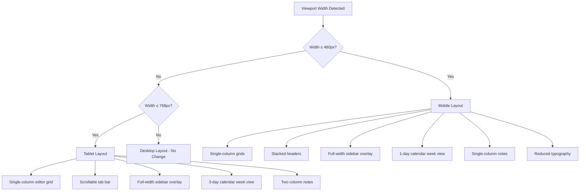

# Design Document: Mobile Responsive CWOC

## Overview

This design adds comprehensive responsive layout support to the CWOC web application across all pages — the Dashboard, Editor, and Secondary Pages (Settings, Help, Trash, People, Contact Editor). The approach uses CSS media queries appended to existing stylesheets and a small touch-event adapter in `shared.js`, with zero new frameworks, build tools, or CSS files.

Three viewport breakpoints drive all layout changes:

| Breakpoint | Width | Target |
|---|---|---|
| Mobile | ≤ 480px | Phones |
| Tablet | 481px – 768px | Tablets, small laptops |
| Desktop | > 768px | Current layout (unchanged) |

All changes are additive — desktop behavior is the default, and media queries progressively adapt the layout for smaller screens. No functionality is removed at any viewport size.

## Architecture

### Design Principles

1. **CSS-first**: Layout changes are handled entirely by CSS media queries. JS is only needed for touch event support and sidebar overlay behavior.
2. **Additive media queries**: All new rules are appended to the bottom of existing CSS files. Desktop styles remain untouched.
3. **Mobile-first overlay sidebar**: On tablet/mobile, the sidebar becomes a full-screen overlay with a backdrop, instead of pushing content.
4. **Touch parity**: Touch events are mapped to existing mouse-based drag handlers via a shared adapter function.
5. **No new files**: All CSS goes into existing stylesheets. Touch adapter goes into `shared.js`.

### File Change Map

```
frontend/styles.css          ← Dashboard responsive media queries (bulk of CSS changes)
frontend/shared-page.css     ← Secondary pages responsive media queries
frontend/shared-editor.css   ← Editor base responsive (expand existing 400px → 480px + 768px)
frontend/editor.css          ← Editor-specific responsive overrides
frontend/shared.js           ← Touch event adapter, sidebar overlay logic
frontend/main.js             ← Mobile calendar view adaptations (day count reduction)
```

### Responsive Strategy Per Page



## Components and Interfaces

### 1. Dashboard Responsive CSS (`styles.css`)

Appended media query blocks targeting the Dashboard layout:

**At ≤ 768px (Tablet)**:
- `.header` — allow flex-wrap so tabs can flow to a second row
- `.tabs` — `flex-wrap: wrap` with `overflow-x: auto` fallback; each `.tab` gets `min-height: 44px` for touch targets
- `.sidebar` — becomes a full-width overlay (`width: 100%; left: -100%` when closed, `left: 0` when `.active`); add `.sidebar-backdrop` element
- `.sidebar.active ~ .main-content` — no `margin-left` shift (overlay doesn't push content)
- `.chit-header-row` — `flex-wrap: wrap` so metadata flows below title
- `.notes-view` — JS-driven column count reduced to 2
- `.week-view` — JS reduces visible day columns to 3

**At ≤ 480px (Mobile)**:
- `.header` — `flex-direction: column; height: auto; padding: 8px 12px`
- `.logo` — `width: 48px; height: 48px`
- `h1` — `font-size: 1.5em; padding: 4px 8px`
- `.tabs` — horizontal scroll with `-webkit-overflow-scrolling: touch`
- `.tab` — `padding: 8px 12px; font-size: 0.85em; min-height: 44px; min-width: 44px`
- `.sidebar` — `width: 100%` overlay, `padding-top: 1em`
- `.chit-card` — `width: 100%; margin: 0; padding: 8px 12px`
- `.notes-view` — JS-driven single column
- `.week-view` — JS shows single day with prev/next navigation
- `.month-day` — `min-height: 60px; font-size: 0.75em`
- `.ref-columns` — `flex-direction: column`
- `.hotkey-panel` — `width: calc(100% - 16px); left: 8px; transform: translate(0, -50%)`
- `.reference-content` — `width: calc(100% - 16px)`
- General padding/margin reduction (~40%)

### 2. Sidebar Overlay Behavior (`shared.js`)

New functions added to `shared.js`:

```
function initMobileSidebar()
  - Checks viewport width on load and resize
  - On ≤ 768px: creates/shows backdrop div when sidebar opens
  - Backdrop click closes sidebar
  - Modifies existing toggleSidebar() to handle overlay mode

function _onSidebarBackdropClick()
  - Closes sidebar and removes backdrop
```

The existing `toggleSidebar()` function in `main.js` will be augmented to check `window.innerWidth <= 768` and toggle the backdrop accordingly.

### 3. Mobile Calendar Adaptations (`main.js`)

The calendar rendering functions already accept a day range. The responsive adaptation:

- On `≤ 480px`: Week view renders 1 day with prev/next day buttons
- On `481px–768px`: Week view renders 3 days with prev/next navigation
- On `> 768px`: Week view renders 7 days (current behavior)

This is implemented by checking `window.innerWidth` at render time and adjusting the column count passed to the existing grid rendering logic. A `_getResponsiveDayCount()` helper function returns the appropriate count.

The Notes view column count is similarly adapted:
- `≤ 480px`: 1 column
- `481px–768px`: 2 columns
- `> 768px`: current multi-column masonry

A `resize` event listener triggers re-render when crossing breakpoint boundaries.

### 4. Touch Event Adapter (`shared.js`)

A generic touch-to-mouse adapter that wraps existing drag handlers:

```
function enableTouchDrag(element, callbacks)
  - Maps touchstart → mousedown equivalent
  - Maps touchmove → mousemove equivalent (with preventDefault to block scroll)
  - Maps touchend → mouseup equivalent
  - Extracts clientX/clientY from first touch point
  - Calls existing callback functions with synthesized event-like objects
```

This adapter is applied to:
- Calendar timed events (drag-to-move, drag-to-resize) — wraps `enableCalendarDrag`
- Checklist items (drag-to-reorder) — wraps inline checklist drag handlers
- Chit cards (manual sort drag-to-reorder) — wraps `enableDragToReorder`

### 5. Editor Responsive CSS (`shared-editor.css` + `editor.css`)

**`shared-editor.css` changes** — expand the existing `@media (max-width: 400px)` to two breakpoints:

**At ≤ 768px**:
- `.main-zones-grid` — `grid-template-columns: 1fr` (single column)
- `.zone-actions .zone-button` — icon-only display via `.hideWhenNarrow { display: none }`
- `.grid-span-2` — `grid-column: span 1`

**At ≤ 480px**:
- `.header-row` — `flex-direction: column; padding: 10px`
- `.buttons` — `flex-direction: column; width: 100%`
- `#titleWeatherContainer` — `flex-direction: column`
- `.verticalBox` — `flex-direction: column`
- `.two-column-fields` — `flex-direction: column`
- `.notes-checklist-container` — `flex-direction: column`
- `.status-location-container` — `flex-direction: column`
- Flatpickr inputs — `width: 100%`

### 6. Secondary Pages Responsive CSS (`shared-page.css`)

**At ≤ 768px**:
- `.settings-grid` — `grid-template-columns: 1fr`
- `.settings-panel` — `padding: 12px`

**At ≤ 480px**:
- `.header-and-buttons` — `flex-direction: column; align-items: flex-start; gap: 8px`
- `.header-buttons` — `width: 100%; justify-content: flex-start`
- `.help-content .index ul` — `columns: 1`
- `.cwoc-table` — `display: block; overflow-x: auto` (horizontal scroll wrapper)
- `.settings-panel` — `padding: 8px`
- `h2, h3` — `font-size: 18px`

## Data Models

No data model changes are required. This feature is purely frontend CSS and JS.

## Error Handling

- **Resize listener**: Debounced (200ms) to avoid excessive re-renders during window resize.
- **Touch adapter**: Wrapped in try/catch; falls back to no-op if touch events are unsupported.
- **Breakpoint detection**: Uses `window.matchMedia` where available, falls back to `window.innerWidth` comparison.
- **Sidebar backdrop**: If backdrop element already exists, reuse it rather than creating duplicates.
- **Calendar day count**: Clamped to valid range (1–7) regardless of viewport calculation.

## Testing Strategy

### Why Property-Based Testing Does Not Apply

This feature consists entirely of:
- **CSS media queries** — declarative layout rules that change at specific breakpoints
- **UI rendering** — how elements are sized, positioned, and displayed
- **Touch event wiring** — mapping touch events to existing mouse-based drag handlers
- **DOM manipulation** — sidebar overlay show/hide

None of these involve pure functions with meaningful input variation, data transformations, parsers, serializers, or business logic. There are no universal properties that hold "for all inputs" — the behavior is deterministic based on viewport width and user interaction. Property-based testing is not appropriate for this feature.

### Recommended Testing Approach

**Manual Browser Testing** (primary):
- Test each page at 320px, 480px, 768px, and 1024px widths
- Verify all 6 C CAPTN tabs are accessible at every width
- Verify all 7 calendar periods render correctly at every width
- Verify sidebar overlay opens/closes correctly on mobile/tablet
- Verify touch drag works for calendar events, checklists, and card reorder
- Verify no horizontal overflow on any page at any width

**Visual Regression Tests** (recommended):
- Screenshot comparison at each breakpoint for key pages (Dashboard, Editor, Settings, Help, Trash)
- Detect unintended layout shifts from CSS changes

**Example-Based Unit Tests** (for JS logic):
- `_getResponsiveDayCount()` returns correct day count for given widths
- `enableTouchDrag()` correctly translates touch coordinates to callback arguments
- Sidebar backdrop is created/removed on toggle at mobile widths
- Resize debounce fires re-render after crossing breakpoint boundary

**Smoke Tests**:
- All HTML files contain viewport meta tag
- No new CSS files or build tool configs introduced
- Existing media queries in editor.css are preserved (not broken)
