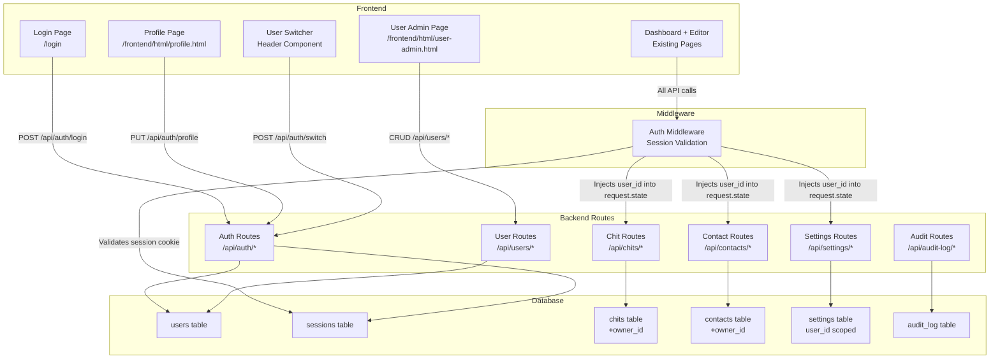

# Design Document: Multi-User System

## Overview

This design introduces multi-user support to CWOC, transforming it from a single-user application into one that supports multiple user accounts with authentication, per-user data isolation, session management, and user administration. The system is built entirely on the existing tech stack: FastAPI + SQLite3 backend, vanilla JS frontend, no pip/npm installs, and Python stdlib for password hashing.

The multi-user system is the foundation for a future Chit Sharing System. This phase focuses on identity, authentication, data ownership, and administration — not sharing.

### Key Design Decisions

1. **Password hashing with `hashlib` (PBKDF2-HMAC-SHA256)**: Python's `hashlib.pbkdf2_hmac` provides secure password hashing without any pip installs. Each password is salted with `os.urandom(32)` and hashed with 600,000 iterations.

2. **Session tokens as HTTP-only cookies**: Sessions are stored in a `sessions` table and referenced by a UUID token in an HTTP-only cookie. This prevents XSS-based session theft.

3. **FastAPI middleware for auth**: A Starlette `BaseHTTPMiddleware` intercepts all requests, validates the session cookie, and injects the authenticated user's UUID into `request.state`. Routes that need the user ID read it from `request.state.user_id`.

4. **Inline migration pattern**: All schema changes follow the existing `migrations.py` pattern — column-existence checks before `ALTER TABLE`, table-existence checks before `CREATE TABLE`. The migration assigns all existing data to a default admin account.

5. **Owner_Record as flat columns**: Rather than a JSON blob, the owner info on chits is stored as three flat columns (`owner_id`, `owner_display_name`, `owner_username`) for efficient querying and indexing.

6. **Rate limiting with in-memory tracking**: Login rate limiting uses an in-memory dict keyed by username, tracking failed attempts with timestamps. This is simple, requires no external dependencies, and resets on server restart (acceptable for a self-hosted single-instance app).

---

## Architecture



### Request Flow

1. Browser sends request with `cwoc_session` HTTP-only cookie
2. `AuthMiddleware` intercepts the request
3. Middleware looks up the session token in the `sessions` table
4. If valid and not expired, middleware updates `last_active` and sets `request.state.user_id` and `request.state.username`
5. If invalid/missing/expired, middleware returns 401 (API) or redirects to `/login` (page)
6. Route handler reads `request.state.user_id` to scope all queries

### Excluded Endpoints

These endpoints bypass authentication:
- `POST /api/auth/login` — login endpoint itself
- `GET /login` — login page
- `GET /health` — health check
- `GET /static/*`, `GET /frontend/*` — static files

---

## Components and Interfaces

### 1. Auth Module (`src/backend/routes/auth.py`)

New route module handling authentication, sessions, and profile management.

```python
# POST /api/auth/login
# Request: { "username": str, "password": str }
# Response: 200 + Set-Cookie: cwoc_session=<token>; HttpOnly; Path=/; SameSite=Lax
#           { "user_id": str, "username": str, "display_name": str, "is_admin": bool }
# Errors: 401 (invalid credentials), 429 (rate limited)

# POST /api/auth/logout
# Response: 200 + Clear-Cookie
#           { "message": "Logged out" }

# GET /api/auth/me
# Response: { "user_id": str, "username": str, "display_name": str, "email": str, "is_admin": bool }

# PUT /api/auth/profile
# Request: { "display_name": str?, "email": str? }
# Response: { "user_id": str, "display_name": str, "email": str }

# PUT /api/auth/password
# Request: { "current_password": str, "new_password": str }
# Response: 200 { "message": "Password updated" }
# Errors: 403 (current password incorrect)

# POST /api/auth/switch
# Request: { "username": str, "password": str }
# Response: 200 + Set-Cookie (new session)
#           { "user_id": str, "username": str, "display_name": str }
# Errors: 401 (invalid credentials)
```

### 2. User Admin Module (`src/backend/routes/users.py`)

New route module for admin-only user management.

```python
# GET /api/users
# Response: [{ "id": str, "username": str, "display_name": str, "email": str, "is_active": bool, "is_admin": bool, "created_datetime": str }]
# Requires: admin

# POST /api/users
# Request: { "username": str, "display_name": str, "password": str, "email": str?, "is_admin": bool? }
# Response: 201 { "id": str, "username": str, "display_name": str }
# Requires: admin

# PUT /api/users/{user_id}/deactivate
# Response: 200 { "message": "User deactivated" }
# Requires: admin. Cannot deactivate last admin.

# PUT /api/users/{user_id}/reactivate
# Response: 200 { "message": "User reactivated" }
# Requires: admin

# PUT /api/users/{user_id}/reset-password
# Request: { "new_password": str }
# Response: 200 { "message": "Password reset" }
# Requires: admin
```

### 3. Auth Middleware (`src/backend/middleware.py`)

New middleware module for session validation.

```python
class AuthMiddleware(BaseHTTPMiddleware):
    """
    Validates cwoc_session cookie on every request.
    Sets request.state.user_id and request.state.username for authenticated requests.
    Returns 401 for unauthenticated API requests.
    Redirects to /login for unauthenticated page requests.
    Skips: /api/auth/login, /login, /health, /static/*, /frontend/*
    """
```

### 4. Password Utilities (`src/backend/auth_utils.py`)

New utility module for password hashing (stdlib only).

```python
def hash_password(password: str) -> str:
    """Hash a password with PBKDF2-HMAC-SHA256 using os.urandom(32) salt.
    Returns 'salt_hex$hash_hex' string for storage."""

def verify_password(password: str, stored_hash: str) -> bool:
    """Verify a password against a stored 'salt_hex$hash_hex' string."""
```

### 5. Login Page (`src/frontend/html/login.html`)

Standalone page (no shared-page.js header injection — no `data-page-title`). Parchment theme, centered form with username/password fields and submit button. No navigation header since the user isn't authenticated yet.

### 6. Profile Page (`src/frontend/html/profile.html`)

Secondary page using `shared-page.css`, `shared-page.js` with `data-page-title="Profile"`. Uses `CwocSaveSystem` for save/cancel. Displays username (read-only), editable display name and email, and a password change section requiring current password verification.

### 7. User Admin Page (`src/frontend/html/user-admin.html`)

Secondary page using `shared-page.css`, `shared-page.js` with `data-page-title="User Admin"`. Admin-only. Lists all users in a `cwoc-table`, with buttons to create, deactivate/reactivate users, and reset passwords.

### 8. User Switcher (Header Component)

Added to the shared-page.js header injection and the dashboard sidebar. Shows the current user's display name. Clicking opens a dropdown of all active users. Selecting a different user prompts for that user's password, then switches sessions and reloads.

### 9. Frontend Auth Guard (`src/frontend/js/shared/shared-auth.js`)

New shared script that runs on every page. On load, calls `GET /api/auth/me`. If it returns 401, redirects to `/login`. Also exports `getCurrentUser()` for other scripts to use.

---

## Data Models

### Users Table

```sql
CREATE TABLE IF NOT EXISTS users (
    id TEXT PRIMARY KEY,                -- UUID v4
    username TEXT NOT NULL UNIQUE,       -- Login identifier
    display_name TEXT NOT NULL,          -- Friendly name shown in UI
    email TEXT,                          -- Optional email
    password_hash TEXT NOT NULL,         -- 'salt_hex$hash_hex' (PBKDF2-HMAC-SHA256)
    is_admin BOOLEAN DEFAULT 0,         -- Admin flag
    is_active BOOLEAN DEFAULT 1,        -- Active flag (soft deactivation)
    created_datetime TEXT NOT NULL,      -- ISO 8601
    modified_datetime TEXT NOT NULL      -- ISO 8601
);
```

### Sessions Table

```sql
CREATE TABLE IF NOT EXISTS sessions (
    token TEXT PRIMARY KEY,             -- UUID v4 session token
    user_id TEXT NOT NULL,              -- FK to users.id
    created_datetime TEXT NOT NULL,     -- ISO 8601
    expires_datetime TEXT NOT NULL,     -- ISO 8601 (created + 24h)
    last_active_datetime TEXT NOT NULL  -- ISO 8601 (updated on each request)
);
CREATE INDEX IF NOT EXISTS idx_sessions_user ON sessions (user_id);
CREATE INDEX IF NOT EXISTS idx_sessions_expires ON sessions (expires_datetime);
```

### Chits Table Changes

```sql
-- New columns added via migration
ALTER TABLE chits ADD COLUMN owner_id TEXT;           -- FK to users.id
ALTER TABLE chits ADD COLUMN owner_display_name TEXT;  -- Denormalized for display
ALTER TABLE chits ADD COLUMN owner_username TEXT;       -- Denormalized for display
```

### Contacts Table Changes

```sql
ALTER TABLE contacts ADD COLUMN owner_id TEXT;  -- FK to users.id
```

### Settings Table

The existing `settings` table already uses `user_id` as the primary key. Currently the only row has `user_id = 'default_user'`. After migration, each user gets their own settings row keyed by their UUID. The default admin user's settings row will be re-keyed from `'default_user'` to the admin's UUID.

### Pydantic Models

```python
class UserCreate(BaseModel):
    username: str
    display_name: str
    password: str
    email: Optional[str] = None
    is_admin: Optional[bool] = False

class UserResponse(BaseModel):
    id: str
    username: str
    display_name: str
    email: Optional[str] = None
    is_admin: bool
    is_active: bool
    created_datetime: str

class LoginRequest(BaseModel):
    username: str
    password: str

class ProfileUpdate(BaseModel):
    display_name: Optional[str] = None
    email: Optional[str] = None

class PasswordChange(BaseModel):
    current_password: str
    new_password: str
```

### Rate Limiting Data Structure (In-Memory)

```python
# Dict keyed by username, value is list of failed attempt timestamps
_login_attempts: Dict[str, List[float]] = {}
# Max 10 failures per 15-minute window
_MAX_ATTEMPTS = 10
_WINDOW_SECONDS = 900  # 15 minutes
```

### Migration Strategy

The migration function `migrate_add_multi_user()` in `migrations.py` will:

1. Create the `users` table if it doesn't exist
2. Create the `sessions` table if it doesn't exist
3. Create a default admin user:
   - UUID generated via `uuid4()`
   - Username: `"admin"`
   - Display name: read from existing `settings.username` for `default_user`, or `"Admin"` if not set
   - Password: `"cwoc"` (hashed) — must be changed on first login
   - `is_admin = True`, `is_active = True`
4. Add `owner_id`, `owner_display_name`, `owner_username` columns to `chits` if they don't exist
5. Set all existing chits' `owner_id` to the admin user's UUID, `owner_display_name` and `owner_username` from the admin account
6. Add `owner_id` column to `contacts` if it doesn't exist
7. Set all existing contacts' `owner_id` to the admin user's UUID
8. Update the `settings` table: change `user_id = 'default_user'` to the admin user's UUID

All steps use column/table existence checks so the migration is idempotent and safe to run multiple times.

---

## Correctness Properties

*A property is a characteristic or behavior that should hold true across all valid executions of a system — essentially, a formal statement about what the system should do. Properties serve as the bridge between human-readable specifications and machine-verifiable correctness guarantees.*

### Property 1: Password hash round-trip

*For any* valid password string, hashing it with `hash_password()` and then verifying it with `verify_password()` against the stored hash SHALL return `True`. Additionally, the stored hash string SHALL NOT contain the plaintext password.

**Validates: Requirements 1.4**

### Property 2: User creation persists all required fields

*For any* valid user creation input (username, display_name, password, optional email), creating the user and reading it back SHALL return a record with a valid UUID v4 as the `id`, the exact `username`, `display_name`, and `email` provided, a non-empty `password_hash`, `is_active = True`, and valid ISO 8601 `created_datetime` and `modified_datetime` timestamps.

**Validates: Requirements 1.1, 1.3**

### Property 3: Username uniqueness

*For any* username, after successfully creating a user with that username, attempting to create a second user with the same username (case-sensitive) SHALL be rejected with an error.

**Validates: Requirements 1.2**

### Property 4: Login and logout session lifecycle

*For any* user with valid credentials, logging in SHALL return a valid session token. Using that token for API requests SHALL succeed. After calling logout with that token, using the same token for API requests SHALL return 401.

**Validates: Requirements 2.1, 2.4**

### Property 5: Invalid credentials return generic 401

*For any* login attempt with an incorrect password (for an existing username) or a non-existent username, the Auth_Service SHALL return a 401 status. The error message SHALL be identical in both cases, not revealing whether the username or password was wrong.

**Validates: Requirements 2.2**

### Property 6: Unauthenticated API requests return 401

*For any* API endpoint path that is not in the excluded set (`/api/auth/login`, `/health`), sending a request without a valid session token or with an expired/invalid token SHALL return a 401 status with a JSON error body.

**Validates: Requirements 2.3, 10.1, 10.3**

### Property 7: Per-user data isolation

*For any* two distinct users A and B, chits created by user A SHALL NOT appear in user B's chit list query, contacts created by user A SHALL NOT appear in user B's contact list query, and settings saved by user A SHALL NOT affect user B's settings. Each user's data is completely independent.

**Validates: Requirements 4.3, 4.4, 4.5**

### Property 8: Chit owner record populated from authenticated user

*For any* authenticated user creating a chit, the returned chit JSON SHALL include `owner_id` matching the user's UUID, `owner_display_name` matching the user's display name, and `owner_username` matching the user's username.

**Validates: Requirements 5.1, 5.2, 5.3**

### Property 9: Profile update round-trip

*For any* valid profile update (display_name and/or email), applying the update via the profile endpoint and then reading the user's profile back SHALL return the updated values.

**Validates: Requirements 7.2**

### Property 10: Password change requires correct current password

*For any* password change attempt, if the provided `current_password` does not match the user's actual password, the request SHALL return 403 and the password SHALL remain unchanged (login with the old password still works). If the `current_password` is correct, the new password SHALL be accepted and login with the new password SHALL succeed.

**Validates: Requirements 7.3, 7.4**

### Property 11: User switch invalidates old session

*For any* authenticated user who switches to a different account with valid credentials, the old session token SHALL become invalid (returns 401) and a new valid session token SHALL be issued for the target account.

**Validates: Requirements 8.4**

### Property 12: Migration idempotency

*For any* database state, running the multi-user migration function multiple times SHALL produce the same result as running it once, with no errors on subsequent runs.

**Validates: Requirements 9.7**

### Property 13: Deactivation and reactivation lifecycle

*For any* non-last-admin user, deactivating the user SHALL invalidate all their active sessions and reject future login attempts. Reactivating the same user SHALL allow login attempts to succeed again.

**Validates: Requirements 12.4, 12.5**

### Property 14: Last admin protection

*For any* set of user accounts where exactly one user has `is_admin = True`, attempting to deactivate that user SHALL be rejected, ensuring the instance always has at least one active administrator.

**Validates: Requirements 12.6**

### Property 15: Multiple concurrent sessions per user

*For any* user, creating multiple sessions (by logging in from different contexts) SHALL result in all sessions being independently valid. Invalidating one session SHALL NOT affect the others.

**Validates: Requirements 3.5**

### Property 16: Audit log records correct actor

*For any* auditable action (chit create, update, delete) performed by an authenticated user, the resulting audit log entry SHALL record that user's UUID and username as the actor, not a value read from settings.

**Validates: Requirements 11.1**

---

## Error Handling

### Authentication Errors

| Scenario | HTTP Status | Response |
|----------|-------------|----------|
| Invalid credentials (login) | 401 | `{ "detail": "Invalid username or password" }` |
| Rate limited (login) | 429 | `{ "detail": "Too many login attempts. Please wait before retrying." }` |
| Missing/invalid session (API) | 401 | `{ "detail": "Authentication required" }` |
| Missing/invalid session (page) | 302 | Redirect to `/login` |
| Expired session | 401 | `{ "detail": "Session expired" }` |
| Deactivated account (login) | 401 | `{ "detail": "Invalid username or password" }` (same generic message) |

### Authorization Errors

| Scenario | HTTP Status | Response |
|----------|-------------|----------|
| Non-admin accessing admin endpoints | 403 | `{ "detail": "Admin access required" }` |
| Wrong current password (password change) | 403 | `{ "detail": "Current password is incorrect" }` |
| Deactivating last admin | 400 | `{ "detail": "Cannot deactivate the last admin account" }` |
| Duplicate username (user creation) | 409 | `{ "detail": "Username already exists" }` |

### Data Errors

| Scenario | HTTP Status | Response |
|----------|-------------|----------|
| User not found | 404 | `{ "detail": "User not found" }` |
| Missing required fields | 422 | Standard Pydantic validation error |
| Database error | 500 | `{ "detail": "Internal server error" }` |

### Frontend Error Handling

- Login page: Display error message in a styled alert div below the form. Clear on next submission attempt.
- Profile page: Use existing `cwocConfirm` pattern for error display.
- User admin page: Show errors inline near the action that triggered them.
- Auth guard (`shared-auth.js`): On 401 from any API call, redirect to `/login`. Store the intended URL in `localStorage` for post-login redirect.

---

## Testing Strategy

### Dual Testing Approach

This feature is well-suited for property-based testing because it involves:
- Pure functions with clear input/output (password hashing)
- Universal properties across all inputs (data isolation, session lifecycle)
- Business logic with a large input space (usernames, passwords, user combinations)

**Property-Based Testing Library**: Python's built-in `unittest` with a custom property test runner using `random` for input generation (no Hypothesis — no pip installs allowed). Each property test will run a minimum of 100 iterations with randomly generated inputs.

**Tag format**: `Feature: multi-user-system, Property {number}: {property_text}`

### Unit Tests (Example-Based)

- Login rate limiting: verify 10 failed attempts trigger 429, verify window resets after 15 minutes
- Session expiry: verify sessions older than 24h are treated as expired
- Migration smoke tests: verify tables created, admin account exists, data assigned
- Login page structure: verify form elements present
- Excluded endpoints: verify `/health`, `/login`, static files accessible without auth

### Property Tests

Each correctness property (1–16) will be implemented as a property-based test with 100+ iterations:

1. Password hash round-trip (pure function, fast)
2. User creation field persistence (DB operations with random data)
3. Username uniqueness enforcement (DB constraint testing)
4. Login/logout session lifecycle (integration with random users)
5. Invalid credentials generic response (random invalid inputs)
6. Unauthenticated request rejection (random API paths)
7. Per-user data isolation (random users + random data)
8. Chit owner record population (random users + random chits)
9. Profile update round-trip (random profile data)
10. Password change verification (random passwords)
11. User switch session management (random user pairs)
12. Migration idempotency (repeated execution)
13. Deactivation/reactivation lifecycle (random users)
14. Last admin protection (varying admin counts)
15. Multiple concurrent sessions (random session counts)
16. Audit log actor attribution (random users + actions)

### Integration Tests

- End-to-end login flow: login → access dashboard → logout → verify redirect
- Data migration: pre-populate single-user data, run migration, verify all data assigned to admin
- User switcher flow: login as user A → switch to user B → verify data changes
- Admin workflow: create user → deactivate → verify blocked → reactivate → verify unblocked

### Test File Organization

```
src/backend/test_auth.py          # Property tests for auth (Properties 1, 4, 5, 6, 10, 11)
src/backend/test_users.py         # Property tests for user management (Properties 2, 3, 13, 14, 15)
src/backend/test_isolation.py     # Property tests for data isolation (Properties 7, 8, 9, 16)
src/backend/test_migration.py     # Property + smoke tests for migration (Property 12)
```

