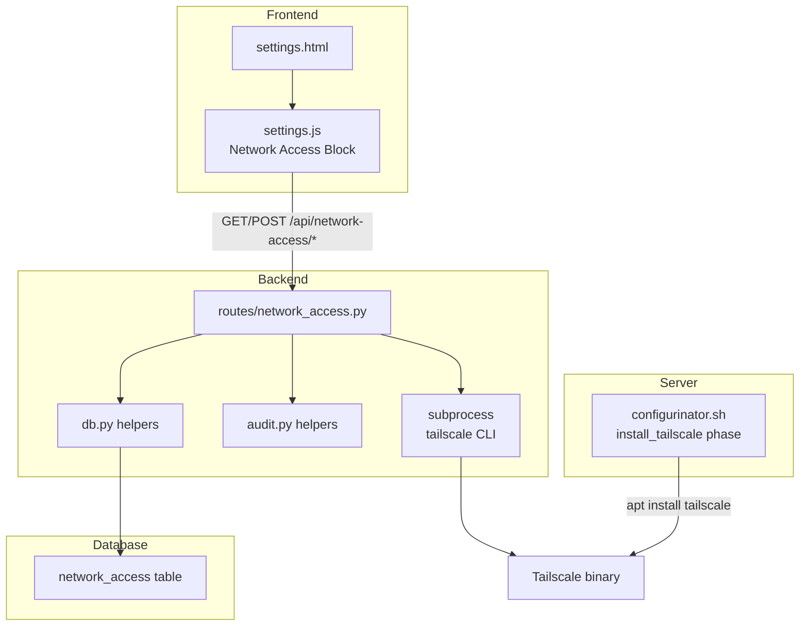
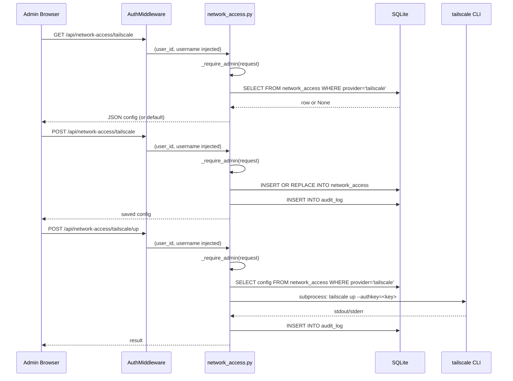

# Design Document: Network Access

## Overview

This feature adds a "Network Access" administration block to the CWOC settings page, providing centralized configuration for external network access providers. The initial implementation focuses on Tailscale (a WireGuard-based mesh VPN), with an extensible architecture for future providers.

The feature spans four layers:

1. **Database** — A `network_access` table storing per-provider configuration as JSON
2. **Backend API** — A new `routes/network_access.py` module with CRUD endpoints, status checks, and service control
3. **Frontend UI** — A new admin-only settings block with Tailscale configuration controls
4. **Configurinator** — A new phase function that installs the Tailscale package during provisioning

### Design Rationale

- **Separate route module**: Network access logic is isolated in `routes/network_access.py` to avoid bloating the existing `routes/settings.py` and to keep provider-specific logic contained.
- **JSON config column**: Each provider stores its own config schema as a JSON blob in a single `config` TEXT column. This avoids needing provider-specific columns and makes adding new providers a data-only change.
- **Admin-only enforcement**: All endpoints use the same `_require_admin()` pattern established in `routes/users.py`, checking `is_admin` in the users table.
- **Subprocess for Tailscale control**: The backend shells out to `tailscale` CLI commands rather than using a Tailscale API, keeping the implementation simple and dependency-free.

## Architecture



### Request Flow



## Components and Interfaces

### 1. Database Migration — `migrate_add_network_access()` in `migrations.py`

Creates the `network_access` table if it does not exist. Uses `CREATE TABLE IF NOT EXISTS` consistent with existing migration patterns (e.g., `migrate_add_audit_log`, `migrate_add_standalone_alerts`).

```python
def migrate_add_network_access():
    """Create network_access table for storing network provider configurations."""
    conn = None
    try:
        conn = sqlite3.connect(DB_PATH)
        cursor = conn.cursor()
        cursor.execute("""
            CREATE TABLE IF NOT EXISTS network_access (
                id TEXT PRIMARY KEY,
                provider TEXT NOT NULL UNIQUE,
                enabled BOOLEAN DEFAULT 0,
                config TEXT,
                created_datetime TEXT,
                modified_datetime TEXT
            )
        """)
        conn.commit()
        logger.info("network_access table ready")
    except Exception as e:
        logger.error(f"Error creating network_access table: {str(e)}")
    finally:
        if conn:
            conn.close()
```

Called from `main.py` in the migration sequence, after `migrate_add_kiosk_users()`.

### 2. Backend Route Module — `routes/network_access.py`

New file. Registered in `main.py` as a router.

**Admin guard**: Reuses the `_require_admin()` pattern from `routes/users.py` (copied locally to avoid circular imports, or imported if feasible).

#### Endpoints

| Method | Path | Description | Auth |
|--------|------|-------------|------|
| GET | `/api/network-access` | List all provider configs | Admin |
| GET | `/api/network-access/{provider}` | Get single provider config | Admin |
| POST | `/api/network-access/{provider}` | Create/update provider config | Admin |
| GET | `/api/network-access/tailscale/status` | Get Tailscale service status | Admin |
| POST | `/api/network-access/tailscale/up` | Start Tailscale with saved auth key | Admin |
| POST | `/api/network-access/tailscale/down` | Stop Tailscale | Admin |

**Route ordering note**: The `/tailscale/status`, `/tailscale/up`, and `/tailscale/down` routes must be registered before the `/{provider}` catch-all route to avoid FastAPI matching "tailscale" as a provider path parameter for the status/up/down paths.

#### GET /api/network-access

```python
@router.get("/api/network-access")
def list_network_access(request: Request):
    _require_admin(request)
    # SELECT * FROM network_access ORDER BY provider
    # Deserialize config JSON for each row
    # Return as JSON array
```

#### GET /api/network-access/{provider}

```python
@router.get("/api/network-access/{provider}")
def get_network_access(provider: str, request: Request):
    _require_admin(request)
    # SELECT * FROM network_access WHERE provider = ?
    # If no row: return default { provider, enabled: false, config: {} }
    # Deserialize config JSON
    # Return as JSON object
```

#### POST /api/network-access/{provider}

```python
@router.post("/api/network-access/{provider}")
def save_network_access(provider: str, body: dict, request: Request):
    _require_admin(request)
    # INSERT OR REPLACE INTO network_access (id, provider, enabled, config, ...)
    # Use provider as lookup key; generate UUID for id on first insert
    # Serialize config to JSON
    # Audit log the change
    # Return saved config
```

Uses `INSERT OR REPLACE` keyed on the `UNIQUE` provider column. The `id` is a UUID generated on first insert; on update, the existing row's id is preserved by selecting it first.

#### GET /api/network-access/tailscale/status

Checks Tailscale status by running subprocess commands:

1. `which tailscale` — if not found, return `{ status: "not_installed" }`
2. `tailscale status --json` — parse the JSON output
   - If service not running (subprocess error), return `{ status: "installed_inactive" }`
   - If running, extract `TailscaleIPs[0]` and `Self.HostName`, return `{ status: "active", ip: "...", hostname: "..." }`
3. On any exception, return `{ status: "error", message: "..." }`

Uses `subprocess.run()` with `capture_output=True, text=True, timeout=10`.

#### POST /api/network-access/tailscale/up

1. Load saved config from `network_access` table where `provider = 'tailscale'`
2. Extract `auth_key` from the deserialized `config` JSON
3. If no auth key, return 400 with descriptive message
4. Run `subprocess.run(["tailscale", "up", "--authkey=" + auth_key], capture_output=True, text=True, timeout=30)`
5. If returncode != 0, return 500 with stderr
6. Audit log the action
7. Return success with stdout

#### POST /api/network-access/tailscale/down

1. Run `subprocess.run(["tailscale", "down"], capture_output=True, text=True, timeout=15)`
2. If returncode != 0, return 500 with stderr
3. Audit log the action
4. Return success

### 3. Frontend — Settings Page Additions

#### HTML (`settings.html`)

A new `setting-group` div inside the `#admin-section` `.settings-grid`, placed before the existing "🔄 Version & Updates" group. Structure:

```html
<div class="setting-group" id="network-access-block">
    <h3>🌐 Network Access</h3>

    <!-- Tailscale sub-section -->
    <label class="setting-subheader">Tailscale</label>

    <!-- Status indicator -->
    <div id="tailscale-status-row" class="setting-inline">
        <span>Status:</span>
        <span id="tailscale-status-badge">Checking...</span>
        <button id="tailscale-refresh-btn" class="standard-button"
                onclick="refreshTailscaleStatus()" style="margin-left:auto;">
            🔄 Refresh
        </button>
    </div>

    <!-- IP + Hostname (shown when active) -->
    <div id="tailscale-info-row" style="display:none;" class="setting-inline">
        <span>IP:</span>
        <span id="tailscale-ip">—</span>
        <span style="margin-left:12px;">Host:</span>
        <span id="tailscale-hostname">—</span>
    </div>

    <!-- Error message (shown when error) -->
    <div id="tailscale-error-row" style="display:none;color:#b22222;font-size:0.9em;margin:6px 0;">
        <span id="tailscale-error-msg"></span>
    </div>

    <!-- Auth Key input -->
    <div class="setting-inline" style="margin-top:10px;">
        <label for="tailscale-auth-key">Auth Key</label>
        <input type="password" id="tailscale-auth-key" placeholder="tskey-auth-..."
               style="flex:1;min-width:0;" />
        <button type="button" class="standard-button" onclick="toggleAuthKeyVisibility()"
                id="tailscale-key-toggle" title="Show/hide key">👁️</button>
    </div>

    <!-- Enable/Disable toggle -->
    <div class="setting-inline" style="margin-top:8px;">
        <label>Enabled</label>
        <input type="checkbox" id="tailscale-enabled" />
    </div>

    <!-- Save + Up/Down controls -->
    <div style="display:flex;gap:8px;margin-top:12px;flex-wrap:wrap;">
        <button class="standard-button" onclick="saveTailscaleConfig()" style="flex:1;">
            💾 Save Config
        </button>
        <button class="standard-button" onclick="tailscaleUp()" id="tailscale-up-btn" style="flex:1;">
            ▶️ Connect
        </button>
        <button class="standard-button" onclick="tailscaleDown()" id="tailscale-down-btn" style="flex:1;">
            ⏹️ Disconnect
        </button>
    </div>
</div>
```

#### JavaScript (`settings.js`)

New functions appended to the existing `settings.js` file, in a clearly marked section:

- `refreshTailscaleStatus()` — fetches `GET /api/network-access/tailscale/status`, updates the status badge, IP/hostname display, and error message visibility
- `loadTailscaleConfig()` — fetches `GET /api/network-access/tailscale`, populates the auth key input and enabled checkbox
- `saveTailscaleConfig()` — collects auth key and enabled state, POSTs to `/api/network-access/tailscale`
- `tailscaleUp()` — POSTs to `/api/network-access/tailscale/up`, shows result
- `tailscaleDown()` — POSTs to `/api/network-access/tailscale/down`, shows result
- `toggleAuthKeyVisibility()` — toggles the auth key input between `type="password"` and `type="text"`

**Initialization**: Called from the existing admin section init block. After `waitForAuth()` resolves and the user is admin, call `loadTailscaleConfig()` and `refreshTailscaleStatus()`.

**Status badge rendering**: Uses inline text with a colored dot prefix:
- `not_installed` → "⚪ Not Installed" (gray)
- `installed_inactive` → "🟡 Inactive" (yellow)
- `active` → "🟢 Connected" (green)
- `error` → "🔴 Error" (red)

### 4. Configurinator — `install_tailscale()` phase

New standalone function in `configurinator.sh`:

```bash
install_tailscale() {
    log_step "Installing Tailscale..."

    if command -v tailscale &>/dev/null; then
        log_ok "Tailscale already installed — skipping."
        return 0
    fi

    # Use official Tailscale install script
    if curl -fsSL https://tailscale.com/install.sh | bash; then
        log_ok "Tailscale installed successfully."
    else
        log_warn "Tailscale installation failed — continuing without Tailscale."
        return 0  # Non-fatal: don't abort provisioning
    fi
}
```

Called in both the fresh-install and upgrade paths of `main()`, after `configure_https` and before `start_and_verify`. Uses `return 0` on failure (non-fatal) so the rest of provisioning continues.

### 5. Registration in `main.py`

```python
# In imports section:
from src.backend.routes.network_access import router as network_access_router

# In migration sequence (after migrate_add_kiosk_users):
from src.backend.migrations import migrate_add_network_access
migrate_add_network_access()

# In router registration:
app.include_router(network_access_router)
```

### 6. Page Route for Settings

No new page route needed — the Network Access block is added to the existing `settings.html` page.

## Data Models

### network_access Table

| Column | Type | Constraints | Description |
|--------|------|-------------|-------------|
| `id` | TEXT | PRIMARY KEY | UUID, generated on first insert |
| `provider` | TEXT | NOT NULL UNIQUE | Provider discriminator (e.g., "tailscale") |
| `enabled` | BOOLEAN | DEFAULT 0 | Whether the provider is enabled |
| `config` | TEXT | — | JSON blob with provider-specific config |
| `created_datetime` | TEXT | — | ISO 8601 creation timestamp |
| `modified_datetime` | TEXT | — | ISO 8601 last-modified timestamp |

### Tailscale Config JSON Schema

Stored in the `config` column when `provider = 'tailscale'`:

```json
{
    "auth_key": "tskey-auth-..."
}
```

Future providers would store their own schema in the same column. For example, a hypothetical Cloudflare Tunnel provider might store `{ "tunnel_token": "...", "tunnel_name": "..." }`.

### API Response Shapes

**GET /api/network-access** (list):
```json
[
    {
        "id": "uuid",
        "provider": "tailscale",
        "enabled": true,
        "config": { "auth_key": "tskey-auth-..." },
        "created_datetime": "2025-01-01T00:00:00",
        "modified_datetime": "2025-01-01T00:00:00"
    }
]
```

**GET /api/network-access/{provider}** (single, or default if not found):
```json
{
    "provider": "tailscale",
    "enabled": false,
    "config": {}
}
```

**GET /api/network-access/tailscale/status**:
```json
{
    "status": "active",
    "ip": "100.64.0.1",
    "hostname": "cwoc-server"
}
```

**POST /api/network-access/tailscale/up** (success):
```json
{
    "success": true,
    "message": "Tailscale connected",
    "output": "..."
}
```

**POST /api/network-access/tailscale/up** (error — no auth key):
```json
{
    "detail": "No Tailscale auth key configured. Save an auth key first."
}
```

## Correctness Properties

*A property is a characteristic or behavior that should hold true across all valid executions of a system — essentially, a formal statement about what the system should do. Properties serve as the bridge between human-readable specifications and machine-verifiable correctness guarantees.*

### Property 1: Provider config API round-trip

*For any* valid provider name and config dictionary, POSTing the config to `/api/network-access/{provider}` and then GETting `/api/network-access/{provider}` should return an object whose `provider`, `enabled`, and `config` fields match what was POSTed.

**Validates: Requirements 1.3, 2.2, 2.4**

### Property 2: GET all returns all stored providers

*For any* set of distinct provider names and configs that have been POSTed to `/api/network-access/{provider}`, a subsequent `GET /api/network-access` should return a list containing every stored provider, with no missing entries and no duplicates.

**Validates: Requirements 2.1, 8.2**

### Property 3: Auth key included in tailscale up command

*For any* non-empty auth key string saved in the Tailscale config, when `POST /api/network-access/tailscale/up` is called, the subprocess command executed should contain `--authkey=` followed by the exact saved auth key value.

**Validates: Requirements 7.4**

## Error Handling

### Backend Errors

| Scenario | HTTP Status | Response |
|----------|-------------|----------|
| Non-admin calls any network-access endpoint | 403 | `{ "detail": "Admin access required" }` |
| Unauthenticated request | 401 | `{ "detail": "Authentication required" }` |
| `tailscale/up` called with no saved auth key | 400 | `{ "detail": "No Tailscale auth key configured. Save an auth key first." }` |
| `tailscale up` subprocess fails | 500 | `{ "detail": "Tailscale command failed", "output": "<stderr>" }` |
| `tailscale down` subprocess fails | 500 | `{ "detail": "Tailscale command failed", "output": "<stderr>" }` |
| `tailscale status` check errors | 200 | `{ "status": "error", "message": "<error description>" }` |
| Database error during config save | 500 | `{ "detail": "Failed to save network access config: <error>" }` |

### Frontend Error Handling

- **Status fetch failure**: Display "⚠️ Unable to check status" in the status badge area. Do not block the rest of the settings page.
- **Config save failure**: Show an alert with the error message. Do not clear the form.
- **Connect/Disconnect failure**: Show the error output in a temporary message below the buttons.
- **Non-admin user**: The entire Network Access block is hidden via the existing admin-section visibility logic, so non-admins never see the controls.

### Configurinator Error Handling

- Tailscale installation failure is non-fatal: `log_warn` and `return 0` so provisioning continues.
- The script does NOT attempt `tailscale up` or `tailscale login` — authentication is deferred to the settings UI.

## Testing Strategy

### Unit Tests (Example-Based)

Focus on specific scenarios and edge cases:

1. **Migration idempotency** — Run `migrate_add_network_access()` twice, verify no errors and table exists correctly.
2. **Default config for missing provider** — GET a provider that doesn't exist, verify default response shape.
3. **Admin-only enforcement** — Call each endpoint as a non-admin user, verify 403 for all.
4. **Tailscale status parsing** — Mock subprocess outputs for each status state (`not_installed`, `installed_inactive`, `active`, `error`) and verify correct response.
5. **No auth key error** — Call `tailscale/up` with no saved config, verify 400.
6. **Subprocess failure handling** — Mock a failed `tailscale up` command, verify 500 with error output.
7. **Audit logging** — Save a config, verify an audit log entry is created.
8. **Provider uniqueness** — POST two configs for the same provider, verify only one row exists.

### Property-Based Tests

Property-based testing is applicable here for the API round-trip and data integrity properties. The project does not use a PBT library, so these tests should be implemented as randomized loop tests (100+ iterations with random inputs) using Python's `random` and `string` modules.

- **Property 1: Provider config API round-trip** — Generate random provider names (alphanumeric, 1-50 chars) and random config dicts (nested JSON-safe values), POST them, GET them back, assert equality. Minimum 100 iterations.
  - Tag: **Feature: network-access, Property 1: Provider config API round-trip**

- **Property 2: GET all returns all stored providers** — Generate random sets of 1-10 provider names, POST configs for each, GET all, assert the returned list contains exactly the stored providers. Minimum 100 iterations.
  - Tag: **Feature: network-access, Property 2: GET all returns all stored providers**

- **Property 3: Auth key in subprocess command** — Generate random auth key strings, save them as Tailscale config, call the up endpoint (with mocked subprocess), assert the command args contain the exact key. Minimum 100 iterations.
  - Tag: **Feature: network-access, Property 3: Auth key included in tailscale up command**

### Integration Tests

- **Configurinator script** — Verify the `install_tailscale` function exists, uses `log_step`/`log_ok`/`log_warn`, checks for existing installation, and does not call `tailscale up` or `tailscale login`.
- **End-to-end flow** — Save a Tailscale config via the API, verify it persists across server restart (database persistence).

### What Is NOT Tested

- Actual Tailscale installation or network connectivity (requires real infrastructure)
- Frontend rendering and visual appearance (no JS test framework in this project)
- CSS styling consistency (visual inspection only)
