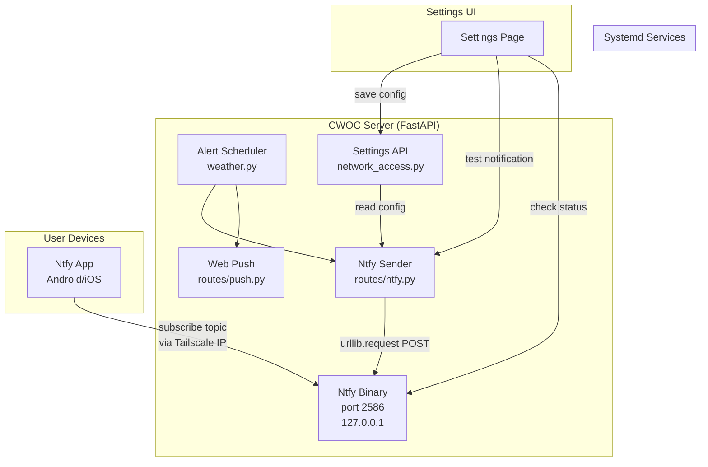

# Design Document — Ntfy Push Notifications

## Overview

This feature adds Ntfy as a parallel push notification channel alongside the existing Web Push (pywebpush) system. Ntfy solves the Firefox Android + self-signed certificate problem by providing a native app with persistent connections that bypass browser limitations.

**Key design decisions:**

1. **No new pip dependencies** — All Ntfy communication uses Python stdlib `urllib.request`. The Ntfy binary is a standalone Go executable managed by systemd.
2. **Parallel channel, not replacement** — Ntfy runs alongside Web Push. The alert scheduler fires both channels independently; failure in one does not block the other.
3. **Reuses existing patterns** — The Ntfy provider config lives in the `network_access` table (same as Tailscale). The Settings UI follows the same collapsible toggle-button pattern. The push script follows the same service-check pattern.
4. **Deterministic per-user topics** — Each user gets `cwoc-<first 12 chars of UUID>`, computed at send time with no stored state.

## Architecture



**Data flow for a chit alert:**
1. `_alert_push_loop()` detects a chit with start/due time in the current 60s window
2. Calls `_send_chit_push()` for Web Push (existing)
3. Calls `send_ntfy_notification()` for Ntfy (new)
4. `send_ntfy_notification()` reads config from `network_access` table, builds topic from user UUID, POSTs to `{server_url}/{topic}`
5. Ntfy binary delivers to subscribed mobile apps via persistent connection

## Components and Interfaces

### 1. Ntfy Sender Module (`src/backend/routes/ntfy.py`)

The core module encapsulating all Ntfy logic. Exposes:

```python
def get_ntfy_topic(user_id: str) -> str:
    """Return deterministic topic: 'cwoc-' + first 12 chars of user_id."""

def get_ntfy_config() -> dict:
    """Read ntfy provider config from network_access table.
    Returns {'enabled': bool, 'server_url': str} or {'enabled': False} if not configured."""

def send_ntfy_notification(user_id: str, title: str, body: str, 
                           click_url: str = None, tags: str = None) -> dict:
    """Send notification via HTTP POST to ntfy server.
    Returns {'sent': True, 'topic': str} on success,
    {'sent': False, 'reason': str} on skip/failure."""
```

**HTTP POST format:**
```
POST {server_url}/{topic}
Headers:
  X-Title: {title}
  X-Tags: {tags}  (optional)
  X-Click: {click_url}  (optional)
Body: {body text}
```

### 2. API Endpoints

| Method | Path | Auth | Purpose |
|--------|------|------|---------|
| GET | `/api/network-access/ntfy/status` | Admin | Check if ntfy service is reachable |
| POST | `/api/network-access/ntfy/test` | Any user | Send test notification to user's topic |
| GET | `/api/network-access/ntfy` | Admin | Get ntfy config (existing generic CRUD) |
| POST | `/api/network-access/ntfy` | Admin | Save ntfy config (existing generic CRUD) |

**Status endpoint response:**
```json
{"status": "active"}
{"status": "unreachable", "message": "Connection refused"}
{"status": "not_configured"}
```

**Test endpoint response:**
```json
{"success": true, "topic": "cwoc-a1b2c3d4e5f6"}
{"success": false, "error": "Ntfy service unreachable"}
```

### 3. Alert Scheduler Integration (`src/backend/weather.py`)

New helper function `_send_chit_ntfy()` added alongside existing `_send_chit_push()`:

```python
def _send_chit_ntfy(owner_id, chit_id, chit_title, time_label, time_value):
    """Send ntfy notification for a chit event. Graceful on failure."""
```

Called from `_alert_push_loop()` immediately after the Web Push call for each matching chit.

### 4. Settings UI — Ntfy Section

Added to `settings.html` in the Network Access block, below the Tailscale section. Follows identical pattern:

- Toggle button with status icon (🟢 active / ⚪ inactive / 🔴 error)
- Collapsible config body with:
  - Status indicator + refresh button
  - Server URL input (default: `http://localhost:2586`)
  - Read-only Topic display (per-user, computed from logged-in user's UUID)
  - "💾 Save Config" button
  - "🔔 Test" button

### 5. Configurator Addition (`install/configurinator.sh`)

New `install_ntfy()` function:
- Downloads ntfy binary from official GitHub releases
- Installs to `/usr/bin/ntfy`
- Creates systemd unit (`ntfy.service`) listening on `127.0.0.1:2586`
- Enables and starts the service
- Idempotent: skips if already installed

### 6. Push Script Addition (`cwoc-push.sh`)

After the Tailscale check block, adds an Ntfy service check:
```bash
# If ntfy is installed, ensure it stays running
if command -v ntfy &>/dev/null || [ -f /usr/bin/ntfy ]; then
    systemctl start ntfy 2>/dev/null
    echo "   ✅ Ntfy service running"
fi
```

## Data Models

### Network Access Table (existing)

The Ntfy provider uses the existing `network_access` table with no schema changes:

| Column | Value for Ntfy |
|--------|---------------|
| `id` | UUID (auto-generated) |
| `provider` | `"ntfy"` |
| `enabled` | `0` or `1` |
| `config` | JSON string (see below) |
| `created_datetime` | ISO 8601 |
| `modified_datetime` | ISO 8601 |

**Config JSON structure:**
```json
{
  "server_url": "http://localhost:2586"
}
```

### Topic Generation (computed, not stored)

```
Topic = "cwoc-" + user_id[0:12]
Example: user_id = "a1b2c3d4-e5f6-7890-abcd-ef1234567890"
         topic   = "cwoc-a1b2c3d4e5f6"
```

No database storage needed — deterministic from user UUID.

### Ntfy HTTP POST Payload (wire format)

Not stored in DB. Sent as HTTP headers + body:
```
POST http://localhost:2586/cwoc-a1b2c3d4e5f6
X-Title: Morning Standup
X-Tags: alarm_clock
X-Click: https://192.168.1.111/frontend/html/editor.html?id=<chit-uuid>
Content-Type: text/plain

Starts at 9:00 AM
```

## Correctness Properties

*A property is a characteristic or behavior that should hold true across all valid executions of a system — essentially, a formal statement about what the system should do. Properties serve as the bridge between human-readable specifications and machine-verifiable correctness guarantees.*

### Property 1: Topic generation is deterministic and correctly formatted

*For any* valid UUID string, `get_ntfy_topic(user_id)` SHALL always return a string equal to `"cwoc-"` concatenated with the first 12 alphanumeric characters of the UUID (hyphens excluded), and calling it multiple times with the same input SHALL always produce the same result.

**Validates: Requirements 2.1, 2.2**

### Property 2: Whitespace-only Server URLs are rejected

*For any* string composed entirely of whitespace characters (spaces, tabs, newlines, or empty string), attempting to save it as the Ntfy Server_URL SHALL be rejected and the configuration SHALL remain unchanged.

**Validates: Requirements 1.4**

### Property 3: HTTP request construction is correct

*For any* valid server_url, user_id, title, body, and optional click_url, the HTTP request constructed by `send_ntfy_notification` SHALL have: (a) target URL equal to `{server_url}/{topic}` where topic is `get_ntfy_topic(user_id)`, (b) an `X-Title` header equal to the title parameter, (c) request body equal to the body parameter, and (d) if click_url is provided, an `X-Click` header equal to click_url.

**Validates: Requirements 3.1, 3.2, 3.4**

### Property 4: Notification title defaults to "CWOC Reminder" for empty titles

*For any* chit with a None or empty-string title, the notification title passed to `send_ntfy_notification` SHALL be "CWOC Reminder", and for any chit with a non-empty title, the notification title SHALL equal that chit's title.

**Validates: Requirements 4.5**

### Property 5: Disabled provider always skips without HTTP attempt

*For any* combination of user_id, title, body, and click_url, when the Ntfy provider is disabled or not configured, `send_ntfy_notification` SHALL return immediately with `{'sent': False, 'reason': ...}` and SHALL NOT make any HTTP request.

**Validates: Requirements 11.5, 4.2**

## Error Handling

| Scenario | Behavior |
|----------|----------|
| Ntfy service unreachable | `send_ntfy_notification` logs warning, returns `{'sent': False, 'reason': 'unreachable'}`. Alert loop continues. |
| Ntfy returns non-2xx | Same as unreachable — log and return gracefully. |
| urllib timeout (10s) | Caught by timeout parameter. Logged as timeout error. |
| No ntfy config in DB | `get_ntfy_config()` returns `{'enabled': False, 'server_url': 'http://localhost:2586'}`. Send skips. |
| Invalid user_id (too short) | `get_ntfy_topic` still works — pads with whatever characters are available. Edge case but non-fatal. |
| Network_access table missing | Caught by sqlite3 exception. Logged, returns skip. |
| Status endpoint — ntfy not installed | Returns `{"status": "not_configured"}` |
| Test endpoint — ntfy disabled | Returns `{"success": false, "error": "Ntfy is not enabled"}` |

**Design principle:** Ntfy failures never block the alert scheduler or crash the server. Every external call is wrapped in try/except with timeout.

## Testing Strategy

### Unit Tests (example-based)

- `test_ntfy.py` — Tests for the ntfy module:
  - Test `get_ntfy_config()` returns default when no config exists
  - Test `get_ntfy_config()` reads saved config correctly
  - Test status endpoint returns "active" when health check passes (mocked)
  - Test status endpoint returns "unreachable" on connection error (mocked)
  - Test status endpoint returns "not_configured" when no config
  - Test test endpoint sends correct notification (mocked urllib)
  - Test test endpoint requires authentication
  - Test `send_ntfy_notification` handles timeout gracefully
  - Test `send_ntfy_notification` handles non-2xx response gracefully
  - Test alert scheduler calls ntfy sender when enabled
  - Test alert scheduler skips ntfy when disabled
  - Test alert scheduler continues after ntfy failure

### Property-Based Tests

**Library:** [hypothesis](https://hypothesis.readthedocs.io/) — but per project rules (no pip installs), property tests will use Python's built-in `random` module with a custom lightweight PBT harness that runs 100+ iterations with generated inputs.

**Configuration:** Minimum 100 iterations per property test.

Each property test references its design document property:

- **Feature: ntfy-notifications, Property 1: Topic generation is deterministic and correctly formatted**
  - Generate random UUID strings, verify output format and determinism
- **Feature: ntfy-notifications, Property 2: Whitespace-only Server URLs are rejected**
  - Generate random whitespace-only strings, verify rejection
- **Feature: ntfy-notifications, Property 3: HTTP request construction is correct**
  - Generate random server URLs, user IDs, titles, bodies, click URLs; verify request structure
- **Feature: ntfy-notifications, Property 4: Notification title defaults to "CWOC Reminder" for empty titles**
  - Generate random chit titles (including None and empty), verify formatting
- **Feature: ntfy-notifications, Property 5: Disabled provider always skips without HTTP attempt**
  - Generate random notification inputs with disabled config, verify skip behavior

