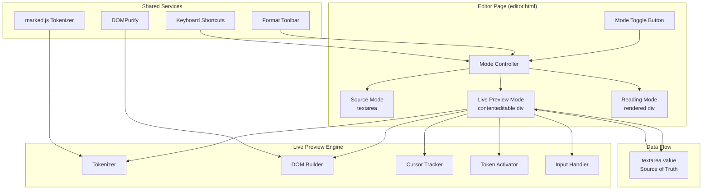
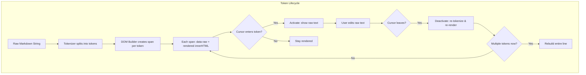
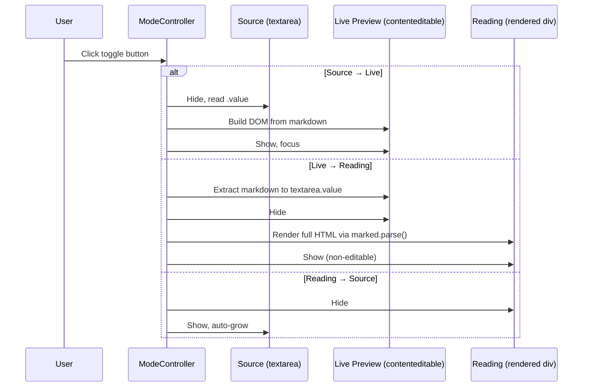
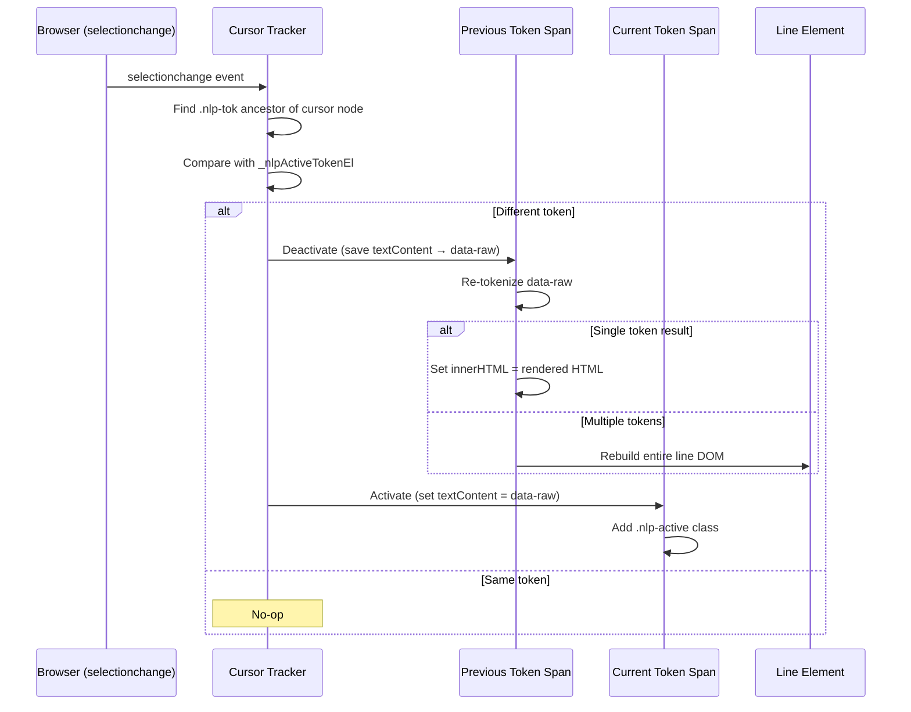
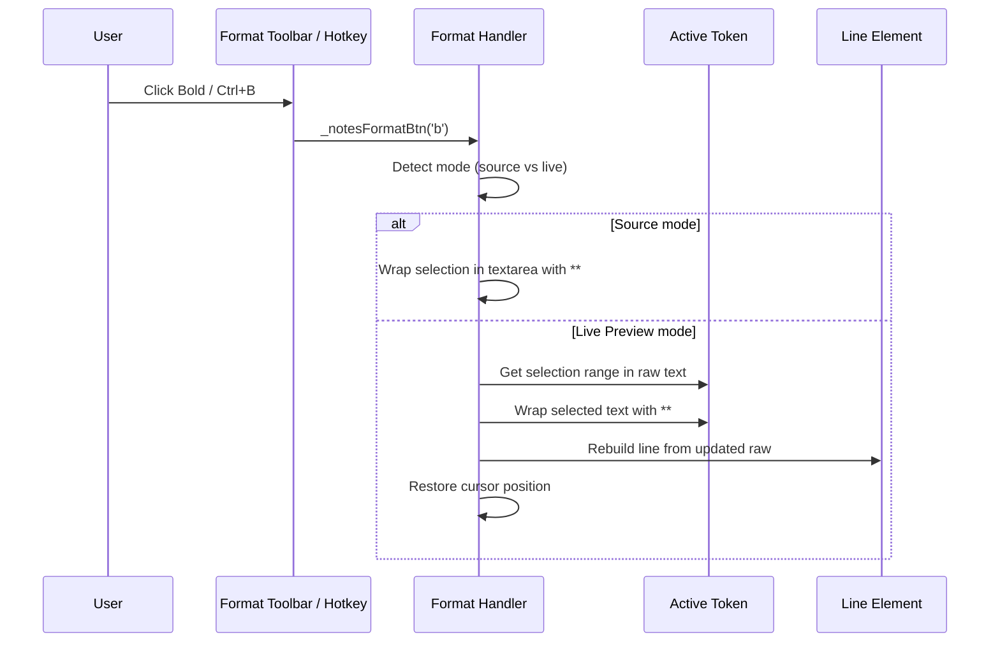

# Design Document: Obsidian-Style Token-Level Live Preview

## Overview

This feature implements an Obsidian-style "Live Preview" mode for the Notes zone (and Email body) in the CWOC chit editor. The core behavior is **token-level granularity**: the entire note renders as formatted markdown, except the specific inline token the cursor currently touches — that token reveals its raw markdown syntax. As the cursor moves between tokens, the previous token re-renders and the new token reveals its source.

The system provides three cycling modes (Source → Live Preview → Reading) controlled by a zone header button, a formatting toolbar with keyboard shortcuts, and reusable architecture shared between the Notes zone and Email body editor.

## Architecture



## Component Architecture — Detailed Flow



## Sequence Diagrams

### Mode Cycling



### Token Activation on Cursor Move



### Format Toolbar Action (Live Preview Mode)



## Components and Interfaces

### Component 1: Tokenizer (`_nlpTokenize`)

**Purpose**: Splits a single line of markdown into an ordered array of token objects, each with its raw source, rendered HTML, character offsets, and type classification.

**Interface**:
```javascript
/**
 * @param {string} line - A single line of markdown text
 * @returns {Array<Token>} - Ordered tokens with raw, html, start, end, type
 */
function _nlpTokenize(line) → Token[]

// Token shape:
// { raw: string, html: string, start: number, end: number, type?: string }
```

**Responsibilities**:
- Match inline markdown patterns: bold (`**`), italic (`_`), code, links, images, strikethrough, chit links
- Only `**` is recognized for bold (never `__`). Only `_` is recognized for italic (never `*`).
- Preserve character offsets for cursor mapping
- Handle nested/overlapping patterns with priority ordering
- Return plain text segments as type-less tokens

**Known Issues with Current Implementation**:
- Regex-based approach cannot handle nested formatting (e.g., `**bold _and italic_**`)
- No support for escaped characters (`\*not bold\*`)
- Image tokens render inline which can break line layout
- Code fence blocks (```) not handled (only inline backticks)

---

### Component 2: Line Parser (`_nlpParseLine`)

**Purpose**: Identifies block-level prefixes (headings, lists, blockquotes, horizontal rules, checkboxes) and separates them from inline content for tokenization.

**Interface**:
```javascript
/**
 * @param {string} line - Full raw line including any block prefix
 * @returns {ParsedLine} - Block metadata + inline tokens
 */
function _nlpParseLine(line) → ParsedLine

// ParsedLine variants:
// { isHr: true, raw: string }
// { heading: number, tokens: Token[], raw: string }
// { bullet: true, indent: number, tokens: Token[], raw: string }
// { ordered: string, indent: number, tokens: Token[], raw: string }
// { check: boolean, indent: number, tokens: Token[], raw: string }
// { quote: true, tokens: Token[], raw: string }
// { tokens: Token[], raw: string }  // plain paragraph
```

**Responsibilities**:
- Detect and classify block-level syntax
- Strip block prefix before passing content to inline tokenizer
- Preserve indentation for nested lists
- Handle checkbox state (checked/unchecked)

---

### Component 3: DOM Builder (`_nlpBuild`, `_nlpBuildLine`)

**Purpose**: Constructs the contenteditable DOM tree from parsed markdown. Each line becomes a `div.nlp-line`, each token becomes a `span.nlp-tok` with `data-raw` attribute storing the original markdown.

**Interface**:
```javascript
/**
 * Build entire live preview DOM from textarea content
 */
function _nlpBuild() → void

/**
 * Build a single line's DOM element
 * @param {string} rawLine - The raw markdown line
 * @param {number} idx - Line index for data-lineIdx
 * @returns {HTMLDivElement} - The constructed line element
 */
function _nlpBuildLine(rawLine, idx) → HTMLDivElement
```

**Responsibilities**:
- Create line divs with appropriate CSS classes for block types
- Create token spans with `data-raw` attributes and rendered `innerHTML`
- Apply block-level styling (heading sizes, list indentation, quote borders)
- Handle empty lines (insert `<br>` to maintain editability)

---

### Component 4: Cursor Tracker (`_nlpOnSelectionChange`)

**Purpose**: Listens to the browser's `selectionchange` event and determines which token span the cursor currently occupies. Triggers activation/deactivation of tokens.

**Interface**:
```javascript
/**
 * Event handler for document selectionchange
 * Detects cursor's containing .nlp-tok span and manages activation
 */
function _nlpOnSelectionChange() → void
```

**Responsibilities**:
- Verify cursor is within the live preview div
- Walk up DOM from selection anchor to find `.nlp-tok` ancestor
- Compare with `_nlpActiveTokenEl` to detect token changes
- Trigger deactivation of old token and activation of new token
- Handle edge cases: cursor between tokens, cursor in prefix spans, cursor in empty lines

---

### Component 5: Token Activator/Deactivator

**Purpose**: Manages the visual swap between rendered HTML and raw markdown text for individual token spans.

**Interface**:
```javascript
/**
 * Show raw markdown for a token (cursor entered)
 * @param {HTMLSpanElement} tokEl - The token span to activate
 */
function _nlpActivateToken(tokEl) → void

/**
 * Re-render a token as formatted HTML (cursor left)
 * @param {HTMLSpanElement} tokEl - The token span to deactivate
 */
function _nlpDeactivateToken(tokEl) → void
```

**Responsibilities**:
- Activation: replace innerHTML with textContent of `data-raw`, add `.nlp-active` class
- Deactivation: save current textContent back to `data-raw`, re-tokenize, set innerHTML to rendered HTML
- Handle token splitting: if edited text now contains multiple tokens, trigger line rebuild
- Update line's `data-raw` attribute after deactivation

---

### Component 6: Input Handler (`_nlpOnKeydown`, `_nlpOnInput`)

**Purpose**: Handles special key events (Enter, Backspace, Tab) and input events within the contenteditable live preview.

**Interface**:
```javascript
function _nlpOnKeydown(e) → void  // Enter, Backspace, format hotkeys
function _nlpOnInput() → void     // Mark unsaved state
```

**Responsibilities**:
- **Enter**: Split current line at cursor position, create new line below, place cursor
- **Backspace at line start**: Merge with previous line, place cursor at merge point
- **Format hotkeys**: Detect Ctrl+B/I/K etc., delegate to format handler
- **Input**: Mark document as unsaved via `setSaveButtonUnsaved()`
- **Tab**: Indent/outdent list items (future enhancement)

---

### Component 7: Markdown Extractor (`_nlpExtract`)

**Purpose**: Reconstructs the full markdown string from the live preview DOM, reading `data-raw` from each token and joining lines.

**Interface**:
```javascript
/**
 * Extract full markdown from live preview DOM
 * @returns {string} - Complete markdown content
 */
function _nlpExtract() → string
```

**Responsibilities**:
- Iterate all `.nlp-line` elements
- For lines containing the active token, read textContent instead of data-raw
- Reconstruct block prefixes from line metadata
- Join lines with newline characters
- Sync result back to hidden textarea for save operations

---

### Component 8: Mode Controller (`_setNotesMode`, `_cycleNotesRenderMode`)

**Purpose**: Manages transitions between Source, Live Preview, and Reading modes, ensuring data consistency across mode switches.

**Interface**:
```javascript
function _cycleNotesRenderMode(event) → void  // Source → Live → Reading → Source
function _setNotesMode(mode) → void           // Set specific mode
```

**Responsibilities**:
- Extract markdown from live preview before leaving live mode
- Sync textarea value as source of truth
- Show/hide appropriate DOM elements (textarea, live div, rendered div)
- Show/hide format toolbar (visible in Source + Live, hidden in Reading)
- Update toggle button icon and label

---

### Component 9: Format Toolbar Handler (`_notesFormatBtn`)

**Purpose**: Applies markdown formatting (bold, italic, headings, lists, etc.) to selected text in both Source and Live Preview modes.

**Interface**:
```javascript
/**
 * @param {string} action - Format action: 'b', 'i', 's', 'k', 'h1', 'h2', 'h3', 'ul', 'ol', 'q', 'code', 'hr'
 */
function _notesFormatBtn(action) → void
function _notesFormatBtnLive(action) → void  // Live preview variant
function _getNotesFormatAction(e) → string|null  // Map keydown to action
```

**Responsibilities**:
- Detect current mode and delegate to appropriate handler
- Source mode: manipulate textarea selection (wrap with syntax characters)
- Live mode: manipulate active token's raw text or insert at cursor
- Rebuild affected line after formatting in live mode
- Restore cursor position after formatting

---

### Component 10: Email Body Live Preview (Reuse)

**Purpose**: Applies the same token-level live preview to the Email body textarea, replacing the current below-textarea preview with an inline Obsidian-style editor.

**Interface**:
```javascript
// Reuses the same engine with different DOM element IDs
function _emailSetMode(mode) → void
function _emailCycleMode(event) → void
```

**Responsibilities**:
- Share tokenizer, line parser, DOM builder, cursor tracker with Notes
- Operate on `#emailBody` textarea and a new `#emailLivePreview` contenteditable div
- Provide same three-mode cycling (Source / Live / Reading)
- Integrate with existing email expand modal

## Data Models

### Token

```javascript
/**
 * Represents a single inline markdown token within a line.
 */
{
  raw: string,      // Original markdown source, e.g. "**bold**"
  html: string,     // Rendered HTML, e.g. "<strong>bold</strong>"
  start: number,    // Character offset within line (0-based)
  end: number,      // End offset (exclusive)
  type?: string     // Token type: 'bold', 'italic', 'code', 'link', 'image',
                    //   'strike', 'chitlink', or undefined for plain text
                    //   Bold uses ** exclusively (never __). Italic uses _ exclusively (never *).
}
```

### ParsedLine

```javascript
/**
 * Represents a parsed markdown line with block-level metadata and inline tokens.
 */
{
  // Block-level classification (mutually exclusive):
  isHr?: boolean,           // Horizontal rule line
  heading?: number,         // Heading level 1-6
  bullet?: boolean,         // Unordered list item
  ordered?: string,         // Ordered list marker (e.g. "1.")
  check?: boolean,          // Checkbox state (true = checked)
  quote?: boolean,          // Blockquote line

  // Common fields:
  indent?: number,          // Indentation level (for nested lists)
  tokens: Token[],          // Inline tokens for the content portion
  raw: string               // Full original line text
}
```

### DOM Structure

```
#notesLivePreview (contenteditable div)
├── div.nlp-line[data-line-idx="0"][data-raw="# Hello **world**"]
│   ├── span.nlp-tok.nlp-tok-text[data-raw="Hello "] → "Hello "
│   └── span.nlp-tok.nlp-tok-bold[data-raw="**world**"] → <strong>world</strong>
├── div.nlp-line[data-line-idx="1"][data-raw=""]
│   └── <br>
├── div.nlp-line[data-line-idx="2"][data-raw="Some _italic_ text"]
│   ├── span.nlp-tok.nlp-tok-text[data-raw="Some "] → "Some "
│   ├── span.nlp-tok.nlp-tok-italic[data-raw="_italic_"] → <em>italic</em>
│   └── span.nlp-tok.nlp-tok-text[data-raw=" text"] → " text"
└── ...
```

**Active token state** (cursor inside "**world**"):
```
span.nlp-tok.nlp-tok-bold.nlp-active[data-raw="**world**"]
  └── textNode: "**world**"   ← raw syntax visible, editable
```

### State Variables

```javascript
var _notesRenderMode = 'source';     // Current mode: 'source' | 'live' | 'reading'
var _nlpActiveTokenEl = null;        // Reference to the currently-active token span (or null)
```

## Error Handling

### Scenario 1: Cursor in Non-Token Area

**Condition**: User clicks in whitespace between tokens, in a prefix span, or in an empty line
**Response**: Deactivate any currently-active token; no new token activated
**Recovery**: All tokens remain rendered; editing continues normally when cursor enters a token

### Scenario 2: Token Edit Creates Multiple Tokens

**Condition**: User edits `**bold**` to `**bold** _italic_` within a single active token
**Response**: On deactivation, re-tokenization detects multiple tokens → triggers full line rebuild
**Recovery**: Line DOM is reconstructed with correct token spans; cursor position may shift

### Scenario 3: Token Edit Removes Formatting

**Condition**: User deletes the closing `**` from `**bold**`, leaving `**bold`
**Response**: On deactivation, re-tokenization finds no valid token → treated as plain text
**Recovery**: Token span becomes `.nlp-tok-text` with escaped HTML content

### Scenario 4: Paste Event with Rich Content

**Condition**: User pastes formatted HTML or multi-line text into the contenteditable
**Response**: Intercept paste event, extract plain text, insert at cursor position
**Recovery**: Rebuild affected lines from the pasted raw text

### Scenario 5: marked.js Unavailable

**Condition**: CDN fails to load marked.js
**Response**: Fall back to plain text display (escape HTML, no formatting)
**Recovery**: All modes still functional but without markdown rendering

### Scenario 6: Data-Raw Desync

**Condition**: Browser contenteditable mutations cause DOM state to diverge from data-raw attributes
**Response**: On mode switch (live → source), extract from DOM and reconcile
**Recovery**: Textarea always holds authoritative value after extraction

## Testing Strategy

### Unit Testing Approach

Key test cases for the tokenizer:
- Single formatting tokens: `**bold**`, `_italic_`, `` `code` ``, `~~strike~~`
- Nested formatting: `**bold _and italic_**`
- Adjacent tokens: `**bold** _italic_`
- Links and images: `[text](url)`, ``
- Chit links: `[[title]]`
- Edge cases: empty strings, only whitespace, unmatched delimiters
- Ensure `__` is NOT recognized as bold and `*` is NOT recognized as italic
- Block-level parsing: headings, lists, quotes, checkboxes, horizontal rules

### Integration Testing Approach

- Mode cycling preserves content (Source → Live → Reading → Source roundtrip)
- Cursor tracking correctly identifies tokens after DOM rebuild
- Format toolbar applies correct syntax in both modes
- Enter/Backspace line operations maintain data integrity
- Paste handling strips formatting and inserts plain text
- Email body live preview operates independently from Notes

### Manual Testing Scenarios

- Rapid cursor movement across multiple tokens
- Selecting text across multiple tokens
- Undo/Redo behavior within contenteditable
- Mobile touch interactions (tap to place cursor)
- Long documents with many lines (performance)
- Copy/paste between live preview and external apps

## Performance Considerations

- **selectionchange frequency**: This event fires on every cursor movement (including arrow keys, mouse drags). The handler must be lightweight — only DOM traversal to find the token span, no re-rendering unless the token actually changed.
- **Line rebuild scope**: When a token edit triggers a rebuild, only the affected line is reconstructed — not the entire document.
- **Debouncing**: The `_nlpOnInput` handler should not trigger expensive operations. Markdown extraction only happens on mode switch or save.
- **Large documents**: For notes exceeding ~500 lines, consider virtualizing off-screen lines (render only visible viewport). Initial implementation can skip this optimization.
- **DOM mutation observer**: Not needed — all mutations are controlled through the keydown/input handlers. Native contenteditable mutations are intercepted.

## Security Considerations

- **XSS via rendered tokens**: All rendered HTML must be escaped or sanitized. The current implementation uses `_escHtml()` for text content and constructs HTML from known-safe templates. DOMPurify should be applied to any user-generated HTML that passes through `marked.parse()`.
- **Link injection**: Rendered `<a>` tags from `[text](url)` tokens should have `rel="noopener noreferrer"` and potentially `target="_blank"` restrictions.
- **Paste sanitization**: Pasted content must be stripped to plain text before insertion to prevent script injection via clipboard.
- **data-raw attribute**: Contains user markdown — never interpreted as HTML. Always read via `.dataset.raw` (auto-escaped by browser).

## Dependencies

- **marked.js** (CDN) — Used for full-document rendering in Reading mode and potentially for tokenization reference. The live preview engine uses its own regex tokenizer for inline tokens.
- **DOMPurify** (CDN) — Sanitizes HTML output in Reading mode rendering.
- **Font Awesome 6** (CDN) — Icons for the mode toggle button and toolbar.
- **No new dependencies required** — The token-level engine is built with vanilla JS using the Selection API and contenteditable.

## Correctness Properties

*A property is a characteristic or behavior that should hold true across all valid executions of a system — essentially, a formal statement about what the system should do. Properties serve as the bridge between human-readable specifications and machine-verifiable correctness guarantees.*

### Property 1: Tokenization Structural Invariants

*For any* line of markdown text, the Tokenizer SHALL produce an array of tokens where: (a) each token has non-empty `raw`, valid `start` and `end` offsets, (b) tokens are ordered by `start` offset, (c) token boundaries are non-overlapping and contiguous (no gaps or overlaps), and (d) concatenating all token `raw` values reproduces the original inline content of the line.

**Validates: Requirements 1.1, 1.4, 1.5**

### Property 2: Token Type Classification Correctness

*For any* line containing known markdown syntax patterns (bold, italic, code, strikethrough, links, images, chit links), the Tokenizer SHALL assign the correct `type` to each formatted segment; and for any line containing no formatting syntax, the Tokenizer SHALL return a single token with no type (plain text).

**Validates: Requirements 1.2, 1.3**

### Property 3: Block-Level Classification Correctness

*For any* line beginning with a recognized block prefix (heading `#`–`######`, bullet `-`/`*`/`+`, ordered `N.`, checkbox `- [ ]`/`- [x]`, blockquote `>`), the Line_Parser SHALL correctly identify the block type, level/indent, and tokenize the remaining inline content; and for any line without a block prefix, it SHALL classify it as a plain paragraph.

**Validates: Requirements 2.1, 2.2, 2.3, 2.4, 2.5, 2.7**

### Property 4: DOM Construction Correctness

*For any* multi-line markdown string, the DOM_Builder SHALL produce exactly one `div.nlp-line` per line (with correct `data-line-idx` and `data-raw` attributes) and exactly one `span.nlp-tok` per token within each line (with `data-raw` matching the token's raw source and `innerHTML` containing rendered HTML).

**Validates: Requirements 3.1, 3.2, 3.4**

### Property 5: Build-Extract Round Trip

*For any* valid markdown string, building the live preview DOM and then extracting markdown from it SHALL produce content equivalent to the original input.

**Validates: Requirements 6.5, 9.4**

### Property 6: Token Activation Correctness

*For any* token span with a `data-raw` attribute, activating it SHALL set its `textContent` to the value of `data-raw` and add the `.nlp-active` CSS class, making the raw markdown syntax visible and editable.

**Validates: Requirement 4.2**

### Property 7: Token Deactivation and Re-rendering

*For any* active token span with edited text content, deactivating it SHALL: (a) save the current textContent to `data-raw`, (b) re-tokenize the content, and (c) if a single token results, update innerHTML with rendered HTML; if multiple tokens result, trigger a line rebuild; if no valid formatting exists, render as plain text.

**Validates: Requirements 4.3, 5.1, 5.2, 5.3**

### Property 8: Cursor Idempotence

*For any* sequence of selectionchange events where the cursor remains within the same token span, the Cursor_Tracker SHALL perform no activation or deactivation operations (no-op).

**Validates: Requirement 4.6**

### Property 9: Line Split and Merge Inverses

*For any* line and any cursor position within it, splitting the line at that position SHALL produce two lines whose raw content concatenates to the original; and for any two adjacent lines, merging them SHALL produce a single line equal to their concatenation.

**Validates: Requirements 8.1, 8.2**

### Property 10: Format Wrapping Correctness

*For any* selected text and any format action (bold, italic, code, strikethrough, link), applying the format in Source mode SHALL wrap the selection with the correct markdown syntax characters, and the resulting string SHALL contain the original selected text between the appropriate delimiters.

**Validates: Requirement 7.2**

### Property 11: Paste Sanitization

*For any* clipboard content containing HTML markup, pasting into the live preview SHALL insert only the plain text content with all HTML tags, attributes, and scripts stripped.

**Validates: Requirements 8.3, 11.4**

### Property 12: XSS Prevention in Rendered Output

*For any* markdown content containing script tags, event handler attributes, or javascript: URLs, the rendered HTML output (in both live preview tokens and Reading mode) SHALL contain none of these executable elements.

**Validates: Requirements 3.5, 11.1, 11.2**

### Property 13: Link Security Attributes

*For any* markdown link token (`[text](url)`), the rendered HTML anchor element SHALL include `rel="noopener noreferrer"`.

**Validates: Requirement 11.3**

### Property 14: Line Rebuild Preserves Data-Raw Consistency

*For any* line element after a rebuild triggered by token splitting, the line's `data-raw` attribute SHALL equal the concatenation of all its child token spans' `data-raw` attributes.

**Validates: Requirement 5.4**
