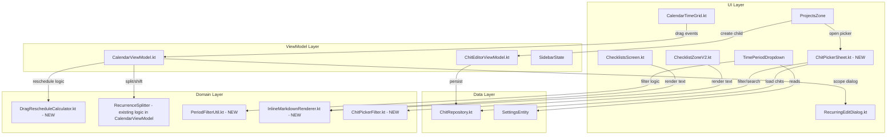

# Design Document: Parity Gaps W350–500

## Overview

This design covers five Android parity gaps spanning calendar interaction, settings enforcement, rich text rendering, and project management:

1. **W368 — Recurring Event Drag-to-Reschedule**: Adds long-press drag-to-move for timed events in the time grid, with recurring scope selection (this instance / all / following).
2. **W395 — Enabled Periods Filtering**: Filters the time period dropdown to only show periods the user has enabled in settings.
3. **W405 — Inline Markdown in Checklist Items**: Renders bold, italic, code, and links in checklist item text across all display locations.
4. **W429 — Project Child Chit Picker**: A searchable, filterable bottom sheet for selecting existing chits to add as project children.
5. **W431 — Create New Child Chit**: A title prompt that creates a new chit and immediately adds it as a project child.

All changes are Android-only (Kotlin/Jetpack Compose). No server changes required.

## Architecture



## Components and Interfaces

### W368: Drag-to-Reschedule

**Modified files:**
- `CalendarTimeGrid.kt` — Change `DayEventCard` from `detectDragGestures` to `detectDragGesturesAfterLongPress` (300ms threshold). On drag end for recurring events, emit a pending drag context instead of immediately persisting.
- `CalendarViewModel.kt` — Add `handleTimeGridDrag(chitId, sourceMinute, targetMinute, date)` that detects recurring vs non-recurring and either persists directly or shows the recurring dialog. Reuse existing `handleRecurringThisInstanceOnly`, `handleRecurringAllEvents`, `handleRecurringThisAndFollowing` with time-based deltas instead of day-based deltas.
- `RecurringEditDialog.kt` — No changes needed; already has the four options.

**New file:**
- `domain/calendar/DragRescheduleCalculator.kt` — Pure functions for:
  - `snapToGrid(rawMinutes: Int, snapInterval: Int): Int` — already exists inline, extract to testable utility
  - `clampToValidRange(minutes: Int, eventDurationMinutes: Int, dayStartMinute: Int, dayEndMinute: Int): Int`
  - `computeTimeDelta(sourceMinute: Int, targetMinute: Int): Long` (in minutes)
  - `shiftDateTimes(start: String?, end: String?, due: String?, pit: String?, deltaMinutes: Long): ShiftedDateTimes`
  - `updateByDayForWeekly(recurrenceRule: String, sourceDate: LocalDate, targetDate: LocalDate): String`

**Key design decisions:**
- Long-press threshold is 300ms (matching Android platform conventions for drag-after-long-press).
- The existing `detectDragGestures` (immediate drag) is replaced with `detectDragGesturesAfterLongPress` so that short taps still open the event and scrolling isn't hijacked.
- The snap grid overlay (dashed lines at snap intervals) already exists and is triggered by `isAnyEventDragging`. No changes needed for the overlay.
- Duration is always preserved for move operations (both start and end shift by the same delta).

### W395: Enabled Periods Filtering

**Modified files:**
- `SidebarContent.kt` — `TimePeriodDropdown` gains two new parameters: `enabledPeriods: String?` and `customDaysCount: Int`. It filters the periods list before rendering and handles the "SevenDay" label.
- `SidebarState` (or wherever the sidebar state is managed) — Passes `enabledPeriods` from `SettingsEntity` to the dropdown.

**New file:**
- `domain/settings/PeriodFilterUtil.kt` — Pure functions:
  - `filterEnabledPeriods(allPeriods: List<String>, enabledPeriodsRaw: String?): List<String>` — parses comma-separated string, returns intersection with valid periods, falls back to `["Day"]` if empty/null/invalid.
  - `resolveSelectedPeriod(currentSelection: String, enabledPeriods: List<String>, displayOrder: List<String>): String` — if current selection is not in enabled list, returns first enabled period in display order.
  - `formatPeriodLabel(periodId: String, customDaysCount: Int): String` — returns "X Days" for SevenDay, standard labels for others.

**Key design decisions:**
- The display order is fixed: Itinerary, Day, Work, Week, SevenDay, Month, Year.
- The dropdown re-reads `enabledPeriods` from the settings entity on every recomposition (reactive via StateFlow/collectAsState), so no restart is needed.
- Fallback to "Day" when enabledPeriods is null/empty/invalid ensures the user always has at least one option.

### W405: Inline Markdown in Checklist Items

**New file:**
- `ui/util/InlineMarkdownRenderer.kt` — A focused inline-only markdown parser that produces `AnnotatedString` with:
  - `SpanStyle(fontWeight = Bold)` for `**text**`
  - `SpanStyle(fontStyle = Italic)` for `*text*`
  - `SpanStyle(fontFamily = Monospace)` for `` `code` ``
  - URL annotation + `SpanStyle(color = linkColor, textDecoration = Underline)` for `[text](url)`
  - Nested combinations (e.g., `**[bold link](url)**`)
  - GFM checkbox stripping (`- [x] `, `- [ ] `)
  - Block-level syntax passed through as literal text
  - Malformed/unclosed syntax displayed as raw text

**Modified files:**
- `ChecklistZoneV2.kt` — Replace `Text(text = item.text, ...)` in display mode with `ClickableText(text = InlineMarkdownRenderer.render(item.text), ...)` and handle URL click via `onClick` offset lookup.
- `ChecklistsScreen.kt` — Same replacement for the dashboard checklist view.
- `OmniViewScreen.kt` (checklist section) — Same replacement.
- `NotebookScreen.kt` (if checklist items appear there) — Same replacement.

**Key design decisions:**
- A new `InlineMarkdownRenderer` is created rather than reusing the existing `MarkdownRenderer` because:
  - The existing one handles block-level elements (headings, code blocks, lists) which must NOT be rendered in checklist items.
  - The existing one doesn't handle links or URL annotations.
  - Checklist items need GFM checkbox stripping.
- The renderer is a pure function (`String → AnnotatedString`) making it easily testable.
- `ClickableText` is used instead of `Text` to support tappable links.
- In editing mode, raw markdown text is shown (no rendering) so users can edit the syntax directly.

### W429: Project Child Chit Picker

**New file:**
- `ui/components/ChitPickerSheet.kt` — A `ModalBottomSheet` composable containing:
  - Header with count ("Add Child Chits (N shown)")
  - Search text field with clear action
  - Filter row: Status dropdown, Priority dropdown, Email toggle
  - LazyColumn of chit rows (checkbox + title + tags + due date + status)
  - Already-assigned rows shown dimmed with checkmark, non-selectable
  - Bottom bar: selection count + "Add Selected" button (disabled when count = 0)

**New file:**
- `domain/picker/ChitPickerFilter.kt` — Pure filtering/search functions:
  - `filterChits(allChits: List<ChitEntity>, excludeIds: Set<String>, excludeProjectMasters: Boolean, excludeEmails: Boolean): List<ChitEntity>`
  - `searchChits(chits: List<ChitEntity>, query: String): List<ChitEntity>` — matches against title, notes, checklist text, people, location, priority, severity, status, tags. `#` prefix triggers tag-only search.
  - `applyStatusFilter(chits: List<ChitEntity>, status: String?): List<ChitEntity>`
  - `applyPriorityFilter(chits: List<ChitEntity>, priority: String?): List<ChitEntity>`

**Modified files:**
- `ChitEditorViewModel.kt` — Add functions:
  - `loadPickerChits()` — loads all chits from repository for the picker
  - `addChildChits(selectedIds: List<String>)` — adds IDs to `child_chits` and refreshes summaries
- `ChitEditorScreen.kt` — Wire `onPickChit` callback to show `ChitPickerSheet`

**Key design decisions:**
- The picker loads all non-deleted chits from the local Room database (already synced). No network call needed.
- Search is performed in-memory on the loaded list (the dataset is bounded by the user's total chits, typically < 5000).
- Multi-select uses a `Set<String>` of selected IDs in the sheet's local state.
- The two-step dismiss (clear search first, then close) prevents accidental loss of search context.

### W431: Create New Child Chit

**Modified files:**
- `ChitEditorViewModel.kt` — Add `createChildChit(title: String)`:
  1. Trim title, validate non-empty and ≤ 200 chars
  2. Create a new `ChitEntity` with UUID, title, status = "ToDo", timestamps
  3. Persist via `chitRepository.upsertAndSync()`
  4. Add new ID to current chit's `child_chits`
  5. Refresh child summaries
  6. Return success/failure result
- `ChitEditorScreen.kt` — Wire `onCreateNewChild` to show an `AlertDialog` with a title text field, Cancel and Create buttons. On confirm, call `viewModel.createChildChit(title)`.

**Key design decisions:**
- Uses a simple `AlertDialog` with `OutlinedTextField` rather than a full bottom sheet (the interaction is lightweight — just a title).
- Title is trimmed before validation. Empty/whitespace-only strings keep the dialog open with no action.
- The 200-character limit matches the web implementation.
- Success/error feedback via toast (using the existing toast pattern in the app).

## Data Models

### Existing models (no changes needed):

```kotlin
// ChitEntity — already has all needed fields:
// - id, title, status, startDatetime, endDatetime, dueDatetime, pointInTime
// - recurrenceRule, recurrenceExceptions, recurrence, recurrenceId
// - childChits (JSON string list), isProjectMaster
// - tags, notes, checklist, people, location, priority, severity, color

// SettingsEntity — already has:
// - enabledPeriods: String? (comma-separated)
// - customDaysCount: Int (default 7)
// - calendarSnap: Int (default 15)
```

### New data classes:

```kotlin
// domain/calendar/DragRescheduleCalculator.kt
data class ShiftedDateTimes(
    val start: String?,
    val end: String?,
    val due: String?,
    val pointInTime: String?
)

// Already exists in CalendarViewModel:
data class RecurringDragContext(
    val chitId: String,
    val sourceDate: LocalDate,
    val targetDate: LocalDate,
    val isVirtual: Boolean,
    val parentId: String,
    val virtualDateStr: String?,
    // NEW fields for time-grid drag:
    val sourceMinute: Int? = null,
    val targetMinute: Int? = null,
    val deltaMinutes: Long? = null
)
```

## Correctness Properties

*A property is a characteristic or behavior that should hold true across all valid executions of a system — essentially, a formal statement about what the system should do. Properties serve as the bridge between human-readable specifications and machine-verifiable correctness guarantees.*

### Property 1: Snap function produces nearest grid-aligned value

*For any* raw minute value and any positive snap interval, `snapToGrid(rawMinutes, snapInterval)` SHALL return the nearest multiple of `snapInterval` to `rawMinutes`, and the result SHALL always be a multiple of `snapInterval`.

**Validates: Requirements 1.1**

### Property 2: "This instance only" produces a standalone copy and adds exception

*For any* recurring chit with a valid recurrence rule and any valid virtual instance date, applying the "this instance only" operation SHALL produce: (a) a new chit with `recurrenceRule = null` and datetimes shifted by the time delta, and (b) the parent chit's `recurrenceExceptions` containing a new `broken_off` entry keyed by the original instance date.

**Validates: Requirements 1.3**

### Property 3: "All in series" shifts datetimes by exact delta and updates byDay correctly

*For any* recurring chit and any time delta in minutes, applying the "all in series" operation SHALL shift all datetime fields (start, end, due, pointInTime) by exactly that delta. Additionally, *for any* weekly recurrence with a `byDay` list where the day of week changes, the original day abbreviation SHALL be replaced with the target day abbreviation.

**Validates: Requirements 1.4**

### Property 4: "All following" splits recurrence correctly

*For any* recurring chit and any split date within the recurrence range, applying the "all following" operation SHALL produce: (a) the parent chit with an `until` date before the split date (or equivalent exception cutoff), and (b) a new chit starting from the split date with datetimes shifted to the target times and the same recurrence rule (with byDay updated if the day of week changed for weekly recurrences).

**Validates: Requirements 1.5**

### Property 5: Non-recurring drag preserves event duration

*For any* non-recurring timed event with a start and end time, and any valid time delta, shifting the event SHALL move both start and end by the same delta, preserving the original duration exactly.

**Validates: Requirements 1.8**

### Property 6: Clamping keeps event within valid day boundaries

*For any* target minute value and event duration, `clampToValidRange` SHALL return a value in `[dayStartMinute, dayEndMinute - duration]`, and if the input is already within that range, it SHALL be returned unchanged.

**Validates: Requirements 1.9**

### Property 7: Period filtering returns only enabled periods in correct order

*For any* subset of valid period identifiers provided as a comma-separated `enabledPeriods` string, `filterEnabledPeriods` SHALL return exactly those periods that appear in both the enabled set and the valid periods list, in display order. If the enabled set is empty/null/invalid, it SHALL return `["Day"]`.

**Validates: Requirements 2.1, 2.4**

### Property 8: Selection fallback picks first enabled period in display order

*For any* current period selection that is NOT in the enabled periods list, `resolveSelectedPeriod` SHALL return the first period in display order (Itinerary, Day, Work, Week, SevenDay, Month, Year) that IS in the enabled list.

**Validates: Requirements 2.3**

### Property 9: Inline markdown parsing produces correct spans without block-level rendering

*For any* string containing inline markdown syntax (bold, italic, code, links), `InlineMarkdownRenderer.render()` SHALL produce an `AnnotatedString` where: (a) bold text has `FontWeight.Bold` span, (b) italic text has `FontStyle.Italic` span, (c) inline code has `FontFamily.Monospace` span, (d) links have URL annotations. For multi-line input, line breaks SHALL be preserved. For block-level syntax (headings, blockquotes, horizontal rules, bullet lists), the raw syntax characters SHALL appear as literal text with no special formatting.

**Validates: Requirements 3.1, 3.6, 3.7**

### Property 10: Link parsing produces correct URL annotations

*For any* string containing markdown link syntax `[text](url)`, the rendered `AnnotatedString` SHALL contain a URL annotation with the exact URL value from the markdown, and the visible text SHALL be the link text without the markdown syntax characters.

**Validates: Requirements 3.2**

### Property 11: Plain text produces no style spans

*For any* string containing no markdown special characters (`*`, `` ` ``, `[`, `]`, `(`, `)`), `InlineMarkdownRenderer.render()` SHALL produce an `AnnotatedString` with no `SpanStyle` annotations and text content identical to the input.

**Validates: Requirements 3.3**

### Property 12: GFM checkbox stripping removes prefix preserving content

*For any* string prefixed with `- [x] ` or `- [ ] `, `InlineMarkdownRenderer.render()` SHALL produce output where the prefix is removed but all subsequent text content is preserved.

**Validates: Requirements 3.4**

### Property 13: Malformed markdown displays raw text

*For any* string containing unclosed markdown delimiters (e.g., `**unclosed`, `` `unclosed ``), `InlineMarkdownRenderer.render()` SHALL produce an `AnnotatedString` containing the raw delimiter characters as literal text with no partial formatting applied.

**Validates: Requirements 3.8**

### Property 14: Chit picker excludes project masters, current chit, and emails by default

*For any* set of chits and a current project chit ID, `filterChits` with `excludeProjectMasters=true` and `excludeEmails=true` SHALL return only chits where `isProjectMaster != true` AND `id != currentChitId` AND the chit is not email-sourced, sorted alphabetically by title.

**Validates: Requirements 4.1**

### Property 15: Chit search returns only matching chits

*For any* set of chits and a non-empty search query, `searchChits` SHALL return only chits where at least one searchable field (title, notes, checklist text, people, location, priority, severity, status, tags) contains the query as a case-insensitive substring. When the query starts with `#`, only the tags field SHALL be searched.

**Validates: Requirements 4.2**

### Property 16: Confirm selection adds all selected IDs to child_chits

*For any* existing `child_chits` list and any set of selected chit IDs (that are not already in the list), confirming the selection SHALL produce a new `child_chits` list that contains all original IDs plus all selected IDs, with no duplicates.

**Validates: Requirements 4.6**

### Property 17: Already-assigned chits are non-selectable

*For any* chit whose ID is already in the project's `child_chits` list, the picker SHALL mark it as non-selectable (it cannot be added to the selection set).

**Validates: Requirements 4.7**

### Property 18: Valid title creates child chit and adds to project

*For any* non-empty, non-whitespace string of at most 200 characters (after trimming), `createChildChit` SHALL produce a new chit with that trimmed title, status "ToDo", and a valid UUID, AND add that UUID to the project's `child_chits` list.

**Validates: Requirements 5.2, 5.3**

### Property 19: Whitespace-only title is rejected

*For any* string composed entirely of whitespace characters (spaces, tabs, newlines), `createChildChit` SHALL reject the input without creating a chit or modifying the project's `child_chits` list.

**Validates: Requirements 5.8**

## Error Handling

| Scenario | Handling |
|----------|----------|
| Drag target outside valid time range | Clamp to nearest boundary (0 or 1425 for 15-min event) |
| Recurring event drag on birthday event | Block drag (already handled — birthday events have `isBirthday` check) |
| Recurring event drag on viewer-role event | Block drag (already handled — `isViewerRole` check) |
| `enabledPeriods` null/empty/invalid | Fall back to `["Day"]` |
| Current period removed from enabled list | Auto-switch to first enabled period in display order |
| Malformed markdown in checklist item | Display raw text as-is (graceful degradation) |
| Chit picker fails to load data | Show error toast, close sheet |
| Child chit creation fails (persistence error) | Show error toast, leave child_chits unchanged |
| Title prompt with empty/whitespace input | Keep prompt open, do not create |
| Title exceeds 200 characters | Truncate at 200 after trim (or reject — implementation choice: truncate silently) |

## Testing Strategy

**Property-Based Testing Library:** [fast-check](https://github.com/dubzzz/fast-check) is not applicable here (Kotlin project). Use **Kotest** with its property-based testing module (`kotest-property`) for generating random inputs and verifying properties.

**Dual Testing Approach:**
- **Unit tests (example-based):** Verify specific scenarios — dialog appearance, toast messages, UI state transitions, cancel/dismiss behavior.
- **Property tests:** Verify universal properties across generated inputs for all pure domain functions.

**Property test configuration:**
- Minimum 100 iterations per property test
- Each property test tagged with: `Feature: parity-gaps-w350-500, Property {N}: {title}`

**Test file organization:**
- `domain/calendar/DragRescheduleCalculatorTest.kt` — Properties 1, 5, 6
- `domain/calendar/RecurrenceSplitTest.kt` — Properties 2, 3, 4
- `domain/settings/PeriodFilterUtilTest.kt` — Properties 7, 8
- `ui/util/InlineMarkdownRendererTest.kt` — Properties 9, 10, 11, 12, 13
- `domain/picker/ChitPickerFilterTest.kt` — Properties 14, 15, 16, 17
- `domain/editor/CreateChildChitTest.kt` — Properties 18, 19

**What is NOT property-tested (example-based only):**
- UI rendering (opacity, snap grid overlay, dialog appearance)
- Toast/feedback messages
- Cancel/dismiss behavior
- Integration with Room DB and repository
- Reactive state observation (settings → dropdown update)
