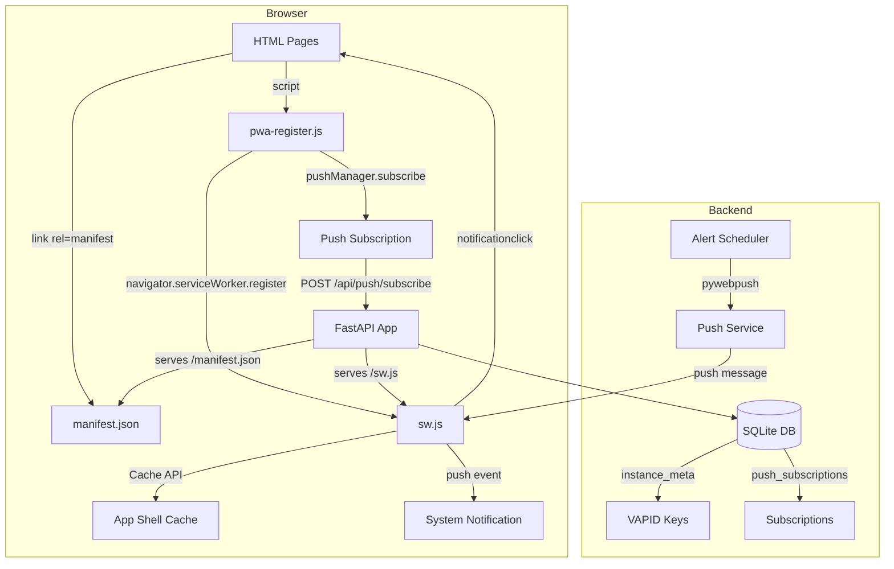
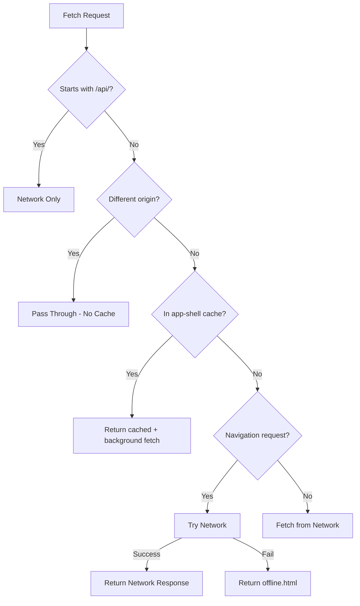

# Design Document: PWA Wrapper

## Overview

This feature wraps CWOC as a Progressive Web App (PWA) so it can be installed on phones, tablets, and desktops as a standalone application. The implementation adds:

1. A **web app manifest** (`manifest.json`) with app metadata and icons
2. A **service worker** (`sw.js`) for app-shell caching and push notification handling
3. **PWA meta tags** across all 14 HTML pages
4. An **install prompt button** in the dashboard sidebar
5. **Web Push notifications** via VAPID/pywebpush for server-sent alerts
6. An **offline fallback page** for graceful degradation

All new PWA-specific files live in `src/pwa/`. The backend push route follows the existing route module pattern at `src/backend/routes/push.py`. No build tools, no npm — everything is vanilla JS served by FastAPI.

## Architecture



### Request Flow — Service Worker Fetch Strategy



## Components and Interfaces

### New Files

| File | Purpose |
|------|---------|
| `src/pwa/manifest.json` | Web app manifest with name, icons, display mode, colors |
| `src/pwa/sw.js` | Service worker — caching, push handler, notification click |
| `src/pwa/offline.html` | Offline fallback page with CWOC parchment theme |
| `src/pwa/pwa-register.js` | SW registration, install prompt capture, push subscription |
| `src/pwa/cwoc-icon-192.png` | 192×192 app icon (scaled from cwod_logo.png) |
| `src/pwa/cwoc-icon-512.png` | 512×512 app icon (scaled from cwod_logo.png) |
| `src/backend/routes/push.py` | Push notification API routes (subscribe, VAPID key, send) |

### Modified Files

| File | Change |
|------|--------|
| `src/backend/main.py` | Add routes for `/sw.js`, `/manifest.json`; mount push router; add VAPID migration call |
| `src/backend/migrations.py` | Add `migrate_add_push_subscriptions()` and `migrate_add_vapid_keys()` |
| `src/frontend/html/*.html` (14 files) | Add PWA meta/link tags to `<head>`, add `pwa-register.js` script |
| `src/frontend/js/dashboard/main-init.js` | Add install button logic to sidebar |
| `src/frontend/html/index.html` | Add install button HTML in sidebar |
| `install/configurinator.sh` | Add `pywebpush` to pip install list |

### Component Interfaces

#### `src/pwa/sw.js` — Service Worker

```javascript
// Constants
const CACHE_NAME = 'cwoc-shell-v1';
const APP_SHELL_URLS = [/* list of core HTML, CSS, JS, icon URLs */];

// Events handled:
// - install: pre-cache app shell + offline.html
// - activate: delete old caches
// - fetch: stale-while-revalidate for shell, network-only for /api/*, passthrough for CDN
// - push: display notification from push payload
// - notificationclick: focus/open app window, navigate to chit
```

#### `src/pwa/pwa-register.js` — Registration & Install Prompt

```javascript
// Functions:
// - registerServiceWorker(): registers /sw.js, handles success/failure
// - captureInstallPrompt(): listens for beforeinstallprompt, shows install button
// - subscribeToPush(): gets VAPID key, subscribes via pushManager, POSTs to backend
// - handleInstallClick(): triggers deferred prompt, hides button on resolution
```

#### `src/backend/routes/push.py` — Push API Routes

```python
# Routes:
# GET  /api/push/vapid-public-key  — returns VAPID public key (no auth required for key fetch)
# POST /api/push/subscribe         — stores push subscription for authenticated user
# DELETE /api/push/subscribe       — removes a push subscription
# POST /api/push/send              — internal: send push to a user's devices (called by scheduler)

# Helper functions:
# get_or_create_vapid_keys() -> dict  — generates/retrieves VAPID key pair from instance_meta
# send_push_to_user(user_id, payload) — sends push to all user's subscriptions, cleans up 410s
```

## Data Models

### `push_subscriptions` Table

```sql
CREATE TABLE IF NOT EXISTS push_subscriptions (
    id TEXT PRIMARY KEY,
    user_id TEXT NOT NULL,
    endpoint TEXT NOT NULL UNIQUE,
    p256dh TEXT NOT NULL,
    auth TEXT NOT NULL,
    device_label TEXT,
    created_datetime TEXT NOT NULL
);
```

- `id`: UUID primary key
- `user_id`: FK to users table
- `endpoint`: The push service URL (unique per browser/device)
- `p256dh`: Client public key for encryption
- `auth`: Auth secret for encryption
- `device_label`: Optional user-agent or device name for display
- `created_datetime`: ISO timestamp

### `instance_meta` Table (existing, new rows)

| key | value |
|-----|-------|
| `vapid_public_key` | Base64url-encoded public key |
| `vapid_private_key` | Base64url-encoded private key |

VAPID keys are generated once on first access using Python's `cryptography` library (already available in the Python stdlib ecosystem) or via `py_vapid` (bundled with pywebpush). Stored as two rows in the existing `instance_meta` key-value table.

### Push Notification Payload (JSON sent via Web Push)

```json
{
  "title": "Chit Title",
  "body": "Alarm at 3:00 PM",
  "icon": "/static/cwoc-icon-192.png",
  "badge": "/static/cwoc-icon-192.png",
  "data": {
    "chit_id": "uuid-here",
    "url": "/frontend/html/editor.html?id=uuid-here"
  }
}
```

### manifest.json Structure

```json
{
  "name": "C.W.'s Omni Chits",
  "short_name": "CWOC",
  "display": "standalone",
  "start_url": "/",
  "scope": "/",
  "theme_color": "#8b5a2b",
  "background_color": "#f5e6cc",
  "orientation": "any",
  "icons": [
    { "src": "/static/cwoc-icon-192.png", "sizes": "192x192", "type": "image/png" },
    { "src": "/static/cwoc-icon-512.png", "sizes": "512x512", "type": "image/png" }
  ]
}
```

## Correctness Properties

*A property is a characteristic or behavior that should hold true across all valid executions of a system — essentially, a formal statement about what the system should do. Properties serve as the bridge between human-readable specifications and machine-verifiable correctness guarantees.*

### Property 1: All HTML pages contain required PWA tags

*For any* HTML page served by CWOC (all files in `src/frontend/html/` excluding `_template.html`), the `<head>` section SHALL contain all five required PWA tags: `<link rel="manifest">`, `<meta name="theme-color">`, `<link rel="apple-touch-icon">`, `<meta name="apple-mobile-web-app-capable">`, and `<meta name="apple-mobile-web-app-status-bar-style">`.

**Validates: Requirements 2.1, 2.2, 2.3, 2.4, 2.5**

### Property 2: App-shell requests use stale-while-revalidate

*For any* fetch request whose URL matches an entry in the app-shell cache list, the service worker fetch handler SHALL return the cached response immediately AND initiate a background network fetch to update the cache.

**Validates: Requirements 5.3, 6.5**

### Property 3: Non-app-shell requests bypass the cache

*For any* fetch request whose URL starts with `/api/` OR whose origin differs from the app origin (CDN resources), the service worker fetch handler SHALL NOT read from or write to the cache — the request SHALL pass directly to the network.

**Validates: Requirements 5.5, 5.6**

### Property 4: Failed uncached navigation requests return offline fallback

*For any* navigation request (mode: 'navigate') that fails due to network unavailability AND whose URL is not present in the app-shell cache, the service worker SHALL respond with the pre-cached offline fallback page.

**Validates: Requirements 6.2**

### Property 5: VAPID key generation is idempotent

*For any* number of calls to `get_or_create_vapid_keys()`, the function SHALL always return the same key pair — generating keys only on the first invocation and retrieving from `instance_meta` on all subsequent calls.

**Validates: Requirements 11.1**

### Property 6: Push subscription storage round-trip

*For any* valid push subscription object (containing endpoint, p256dh, and auth), storing it via `POST /api/push/subscribe` and then querying the `push_subscriptions` table by user_id SHALL return a record with identical endpoint, p256dh, and auth values.

**Validates: Requirements 11.5**

### Property 7: Due-time chits trigger push to all subscribed devices

*For any* chit whose alarm time, start time, or due time has arrived, and whose owner has N active push subscriptions, the push sender SHALL attempt to send exactly N push messages (one per subscription).

**Validates: Requirements 11.7**

### Property 8: Expired subscriptions are removed on 410

*For any* push subscription where the push service returns HTTP 410 Gone, the backend SHALL delete that subscription from the `push_subscriptions` table so it is not used in future send attempts.

**Validates: Requirements 11.10**

## Error Handling

| Scenario | Handling |
|----------|----------|
| Browser doesn't support Service Workers | `pwa-register.js` checks `'serviceWorker' in navigator` before registering; no error thrown |
| SW registration fails | Log error to console, app continues functioning normally |
| Push subscription fails | Log error, app continues without push; user can retry from settings |
| `pywebpush` returns 410 Gone | Delete the subscription from DB, continue sending to remaining devices |
| `pywebpush` returns 401/403 | Log VAPID key mismatch error; do not delete subscription (may be transient) |
| `pywebpush` network timeout | Log error, skip this send cycle; subscription remains for next attempt |
| Offline + uncached page | Show `offline.html` with friendly message and retry suggestion |
| Offline + cached page | Serve from cache transparently (stale-while-revalidate) |
| VAPID key generation failure | Log critical error; push features disabled but app continues |
| Push payload too large (>4KB) | Truncate notification body to fit within Web Push size limits |
| User revokes notification permission | Frontend detects `Notification.permission === 'denied'`, hides push UI |

## Testing Strategy

### Unit Tests (Example-Based)

- **Manifest validation**: Parse `manifest.json` and assert all required fields have correct values (name, short_name, display, start_url, scope, theme_color, background_color, orientation, icons)
- **Backend route tests**: Test `/api/push/subscribe` stores subscription, `/api/push/vapid-public-key` returns key, unauthenticated access to `/sw.js` and `/manifest.json` succeeds
- **SW event handlers**: Test install caches correct URLs, activate deletes old caches, notificationclick navigates correctly
- **Install prompt logic**: Test beforeinstallprompt capture, button visibility toggling, standalone mode detection

### Property-Based Tests

Property-based testing applies to this feature for the service worker routing logic and backend push subscription management.

- **Library**: `hypothesis` (Python, for backend properties) and manual iteration tests for frontend (no PBT framework available without npm)
- **Minimum iterations**: 100 per property test
- **Tag format**: `Feature: pwa-wrapper, Property {number}: {property_text}`

Backend properties to implement with Hypothesis:
- Property 5 (VAPID idempotence)
- Property 6 (subscription round-trip)
- Property 7 (push fan-out to N devices)
- Property 8 (410 cleanup)

Frontend properties (verified via file parsing, not runtime PBT):
- Property 1 (PWA tags on all pages) — script that parses all HTML files
- Properties 2, 3, 4 (SW routing) — verified by code inspection and integration tests since SW fetch logic is deterministic routing, not input-varying computation

### Integration Tests

- Full push flow: subscribe → store → trigger alarm → verify pywebpush called with correct payload
- Service worker registration in browser context (manual testing)
- Install prompt flow on Android/Chrome (manual testing)
- Offline fallback display when network disabled (manual testing)

### Smoke Tests

- `/sw.js` returns 200 with `Content-Type: application/javascript` and `Service-Worker-Allowed: /`
- `/manifest.json` returns 200 with `Content-Type: application/json`
- `/static/cwoc-icon-192.png` and `/static/cwoc-icon-512.png` return 200
- `/api/push/vapid-public-key` returns 200 with a base64url string
- Unauthenticated requests to `/sw.js` and `/manifest.json` succeed (no 401)
