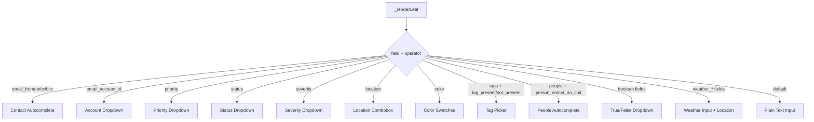

# Design Document: Rule Editor Smart Inputs

## Overview

This feature replaces the plain text value inputs in the Rule Editor's condition builder with context-aware "smart inputs" — dropdowns, autocomplete widgets, color pickers, and comboboxes — based on the selected condition field. It also adds missing email fields, a "Create Chit" action type, and weather-based conditions for scheduled rules.

The design follows CWOC's existing patterns: vanilla JS DOM construction, `getCachedSettings()` for user data, the contacts API (`/api/contacts?q=`) for autocomplete, and the existing tag picker pattern already used in action rows. No new dependencies are introduced.

## Architecture

The smart input system is implemented as a **factory function** (`_renderSmartInput`) that inspects the current field name and operator, then returns the appropriate DOM element. This function replaces the current plain `<input type="text">` in `_renderLeaf()`.



### File Organization

| File | Responsibility |
|------|---------------|
| `src/frontend/js/pages/rule-editor.js` | Smart input factory, condition builder changes, weather fields, Create Chit action UI |
| `src/frontend/html/rule-editor.html` | `<template>` elements for smart input widgets |
| `src/frontend/css/shared/shared-page.css` | Smart input CSS classes (`.smart-input-*`) |
| `src/backend/rules_engine.py` | Weather condition evaluation in `evaluate_leaf()`, `create_chit` action executor |

## Components and Interfaces

### Frontend: Smart Input Factory

```javascript
/**
 * Returns the appropriate DOM element for a condition leaf's value input.
 * @param {object} leaf - The condition leaf node {field, operator, value}
 * @param {function} onChange - Callback when value changes (calls _markDirty)
 * @returns {HTMLElement} The smart input DOM element
 */
function _renderSmartInput(leaf, onChange)
```

**Field-to-Widget Mapping:**

| Field(s) | Widget | Data Source |
|----------|--------|-------------|
| `email_from`, `email_to`, `email_cc`, `email_bcc` | Contact Autocomplete (email mode) | `/api/contacts?q=` |
| `email_account_id` | Select dropdown | `getCachedSettings()` → `email_accounts` |
| `priority` | Select dropdown | Static: `[Low, Medium, High, Critical]` |
| `status` | Select dropdown | Static: `[ToDo, In Progress, Blocked, Complete, Rejected]` |
| `severity` | Select dropdown | Static: `[Low, Medium, High, Critical]` |
| `location` | Combobox (dropdown + text) | `getCachedSettings()` → `saved_locations` |
| `color` | Color swatches | `getCachedSettings()` → `custom_colors` + default palette |
| `tags` (with `tag_present`/`tag_not_present`) | Tag picker | `_cachedTagList` (existing) |
| `people` (with `person_on_chit`/`person_not_on_chit`) | Contact Autocomplete (name mode) | `/api/contacts?q=` |
| `archived`, `pinned`, `all_day`, `habit`, `email_read` | Select dropdown | Static: `[true, false]` |
| `weather_*` fields | Numeric input + Location selector | `getCachedSettings()` → `saved_locations` |

### Frontend: Contact Autocomplete Widget

A reusable autocomplete component used for both email address and people name lookups.

```javascript
/**
 * @param {object} options
 * @param {string} options.mode - 'email' or 'name'
 * @param {string} options.currentValue - Pre-existing value
 * @param {number} options.maxLength - Max input length (254 for email, unlimited for name)
 * @param {function} options.onChange - Callback with selected/typed value
 * @returns {HTMLElement} Wrapper div containing input + dropdown
 */
function _renderContactAutocomplete(options)
```

**Behavior:**
- Queries `/api/contacts?q={input}` when input length >= 2 characters
- Displays up to 10 results
- In email mode: shows contact name + email, populates value with email address
- In name mode: shows contact name, populates value with display name
- Caches the most recent API response to avoid redundant calls for the same query
- Dismisses dropdown on blur, Escape, or selection
- Always allows manual text entry regardless of API status
- On API error: silently dismisses dropdown, no error shown to user

### Frontend: Operator Filtering

The operator dropdown is filtered based on the selected field:

| Field | Allowed Operators |
|-------|-------------------|
| `email_to`, `email_cc`, `email_bcc` | equals, not_equals, contains, not_contains, starts_with, ends_with, is_empty, is_not_empty, regex_match |
| `email_account_id` | equals, not_equals, is_empty, is_not_empty |
| `weather_temperature_high/low`, `weather_precipitation`, `weather_wind_speed` | greater_than, less_than, equals |
| `weather_code` | equals, not_equals |
| Date fields | All operators including days_ago_* |
| All other fields | All operators (current behavior) |

### Frontend: Weather Condition Fields

Weather fields are added to the field dropdown only when trigger type is `"scheduled"`:

```javascript
var WEATHER_FIELDS = [
    { value: 'weather_code', label: 'Weather Code (WMO)' },
    { value: 'weather_temperature_high', label: 'Temperature High (°C)' },
    { value: 'weather_temperature_low', label: 'Temperature Low (°C)' },
    { value: 'weather_precipitation', label: 'Precipitation (mm)' },
    { value: 'weather_wind_speed', label: 'Wind Speed (km/h)' }
];
```

When a weather field is selected, the smart input renders:
1. A numeric input for the threshold value
2. A location selector (combobox with saved locations + manual entry) stored as a `weather_location` property on the leaf node

The leaf node for weather conditions is serialized as:
```json
{
  "type": "leaf",
  "field": "weather_temperature_high",
  "operator": "greater_than",
  "value": "30",
  "weather_location": "4 Rolling Mill Way, Canton, MA 02021"
}
```

### Frontend: Create Chit Action

Added to `CHIT_ACTION_TYPES` with a custom renderer (similar to HA actions):

```javascript
{ value: 'create_chit', label: 'Create Chit', params: null }
```

The `params: null` signals that a custom panel renderer (`_renderCreateChitAction`) handles the UI, displaying smart input controls for: title, note, status, priority, tags, start_datetime, due_datetime, location, color, and people.

All fields are optional. Text fields support `{{placeholder}}` template syntax.

### Backend: Weather Condition Evaluation

Added to `evaluate_leaf()` in `rules_engine.py`:

```python
# Weather condition fields
WEATHER_FIELDS = frozenset({
    "weather_code", "weather_temperature_high", "weather_temperature_low",
    "weather_precipitation", "weather_wind_speed"
})
```

**Evaluation flow:**
1. Detect weather field in leaf condition
2. Extract `weather_location` from the leaf
3. Geocode the location using existing `_geocode_address()` from `schedulers.py`
4. Fetch today's daily forecast from Open-Meteo API
5. Extract the relevant metric (temperature_high → `temperature_2m_max`, etc.)
6. Compare against the condition value using the specified operator
7. On any failure (geocode, API, timeout): return `False` and log the error

### Backend: Create Chit Action Executor

Added to `execute_action()` in `rules_engine.py`:

```python
elif action_type == "create_chit":
    # Build chit dict from params, resolve templates, insert into DB
```

**Template resolution:**
- Supported placeholders: `{{matched_title}}`, `{{matched_note}}`, `{{matched_status}}`, `{{today}}`, `{{trigger_field}}` (any field from the triggering entity)
- Unresolved placeholders → empty string
- Applied to: title, note, location text fields

**Transaction safety:**
- Single `INSERT` wrapped in the existing connection's transaction
- On error: `conn.rollback()`, return `{"success": False, "message": "..."}`

## Data Models

### Condition Leaf (extended)

```json
{
  "type": "leaf",
  "field": "string",
  "operator": "string",
  "value": "string",
  "weather_location": "string (optional, only for weather_* fields)"
}
```

### Create Chit Action Params

```json
{
  "type": "create_chit",
  "params": {
    "title": "string (optional, supports {{templates}})",
    "note": "string (optional, supports {{templates}})",
    "status": "string (optional)",
    "priority": "string (optional)",
    "tags": ["string"] ,
    "start_datetime": "ISO string (optional)",
    "due_datetime": "ISO string (optional)",
    "location": "string (optional, supports {{templates}})",
    "color": "string (optional, hex)",
    "people": ["string"]
  }
}
```

### EMAIL_FIELDS Array (updated)

```javascript
var EMAIL_FIELDS = [
    { value: 'title', label: 'Title / Subject' },
    { value: 'note', label: 'Note / Body' },
    { value: 'email_from', label: 'Email From' },
    { value: 'email_to', label: 'Email To' },        // NEW
    { value: 'email_cc', label: 'Email CC' },         // NEW
    { value: 'email_bcc', label: 'Email BCC' },       // NEW
    { value: 'email_account_id', label: 'Email Account' }, // NEW
    { value: 'email_subject', label: 'Email Subject' },
    { value: 'email_body_text', label: 'Email Body' },
    { value: 'email_folder', label: 'Email Folder' },
    { value: 'email_read', label: 'Email Read' },
    { value: 'email_date', label: 'Email Date' },
    // ... rest unchanged
];
```

## Correctness Properties

*A property is a characteristic or behavior that should hold true across all valid executions of a system — essentially, a formal statement about what the system should do. Properties serve as the bridge between human-readable specifications and machine-verifiable correctness guarantees.*

### Property 1: Smart Input Type Mapping

*For any* condition field name and operator combination, the smart input factory SHALL return the correct widget type as defined by the field-to-widget mapping table (e.g., email address fields → contact_autocomplete, boolean fields → true/false dropdown, priority → priority dropdown).

**Validates: Requirements 2.1, 4.1, 5.1, 6.1, 8.1, 9.1, 10.1, 11.1**

### Property 2: Operator Filtering by Field

*For any* condition field, the set of operators presented in the operator dropdown SHALL match the allowed operator set for that field type (e.g., email address fields get the text comparison set, email_account_id gets only equals/not_equals/is_empty/is_not_empty, weather numeric fields get only greater_than/less_than/equals).

**Validates: Requirements 1.3, 1.4**

### Property 3: Autocomplete Filtering

*For any* search string of 2 or more characters and any set of contacts, the autocomplete filter function SHALL return at most 10 results where each result matches the query as a case-insensitive substring of either the contact's display name or email address (in email mode) or display name (in name mode).

**Validates: Requirements 2.2, 10.2**

### Property 4: Dropdown Pre-Selection

*For any* dropdown-type smart input (priority, status, severity, boolean, email_account) and any pre-existing condition value that matches one of the dropdown's options, the rendered dropdown SHALL have that option pre-selected. When no value is set, no option SHALL be pre-selected and a placeholder SHALL be shown.

**Validates: Requirements 4.2, 4.3, 5.2, 5.3, 6.2, 6.3, 11.2, 11.3**

### Property 5: Email Account Label Computation

*For any* email account object, the display label SHALL be the account's nickname if the nickname is a non-empty string, otherwise the account's email address.

**Validates: Requirements 3.2**

### Property 6: Tag List Sorting and Filtering

*For any* list of user tags, the tag picker SHALL display only non-system tags, sorted with favorite tags first (alphabetically among favorites), then non-favorite tags alphabetically.

**Validates: Requirements 9.2**

### Property 7: Template Placeholder Resolution

*For any* text string containing `{{placeholder}}` patterns and a trigger entity dictionary, resolving templates SHALL replace each placeholder with the corresponding entity field value if it exists, or an empty string if it does not exist. The resulting string SHALL contain no unresolved `{{...}}` patterns.

**Validates: Requirements 12.5, 12.6**

### Property 8: Weather Condition Numeric Comparison

*For any* weather field value (numeric) and condition threshold (numeric), the comparison operators (greater_than, less_than, equals) SHALL return the mathematically correct boolean result. For weather_code, equals and not_equals SHALL perform exact integer comparison.

**Validates: Requirements 13.4, 13.5**

### Property 9: Create Chit Action Produces Valid Record

*For any* valid combination of optional chit field parameters, executing the create_chit action SHALL produce a new chit record where each specified field matches the provided value (after template resolution), the owner_id matches the rule owner, and created_datetime is set to the current UTC timestamp.

**Validates: Requirements 12.4**

## Error Handling

| Scenario | Behavior |
|----------|----------|
| Contacts API unreachable during autocomplete | Dismiss dropdown silently, allow manual text entry |
| Settings API fails (no email_accounts, saved_locations, custom_colors) | Render fallback (empty dropdown with placeholder, text-only input, default palette only) |
| Saved email_account_id not in current accounts | Show value with "unrecognized" visual indicator |
| Open-Meteo API timeout (15s) or error | Log error, treat weather condition as `False`, continue evaluating other conditions |
| Geocoding fails for weather location | Log error, treat weather condition as `False`, continue evaluating other conditions |
| create_chit DB error | Rollback transaction, return `{"success": false, "message": "..."}` |
| Invalid regex in regex_match operator | Return `False` (existing behavior) |
| Template placeholder unresolvable | Replace with empty string |

## Testing Strategy

### Unit Tests (Example-Based)

- Verify EMAIL_FIELDS array contains new fields in correct position
- Verify weather fields only appear when trigger is "scheduled"
- Verify Create Chit action panel renders all expected fields
- Verify color swatches include both default palette and custom colors
- Verify autocomplete dismisses on blur/Escape

### Property-Based Tests

Property-based testing is appropriate for this feature because several components have pure-function logic with clear input/output behavior and large input spaces (template resolution, autocomplete filtering, operator mapping, numeric comparison).

**Library:** Python `hypothesis` for backend properties, manual test functions for frontend logic (since no npm/test framework is available).

**Note:** Per project conventions, tests are optional and not a blocker. The properties above define what correctness means; implementation of automated PBT is deferred unless explicitly requested.

**Configuration:**
- Minimum 100 iterations per property test
- Tag format: `Feature: rule-editor-smart-inputs, Property {N}: {title}`

**Backend properties to test:**
- Property 7 (template resolution): Generate random strings with `{{...}}` patterns and entity dicts
- Property 8 (weather comparison): Generate random numeric values and thresholds
- Property 9 (create_chit): Generate random field combinations

**Frontend properties (testable as pure functions if extracted):**
- Property 1 (smart input mapping): Generate random field/operator pairs
- Property 2 (operator filtering): Generate random field names
- Property 3 (autocomplete filtering): Generate random query strings and contact lists
- Property 4 (dropdown pre-selection): Generate random values and option sets
- Property 5 (account label): Generate random account objects
- Property 6 (tag sorting): Generate random tag lists with mixed favorites/system tags

### Integration Tests

- Weather condition evaluation with mocked geocoding + Open-Meteo responses
- Create Chit action with DB transaction rollback on error
- End-to-end rule save/load with smart input values preserved
