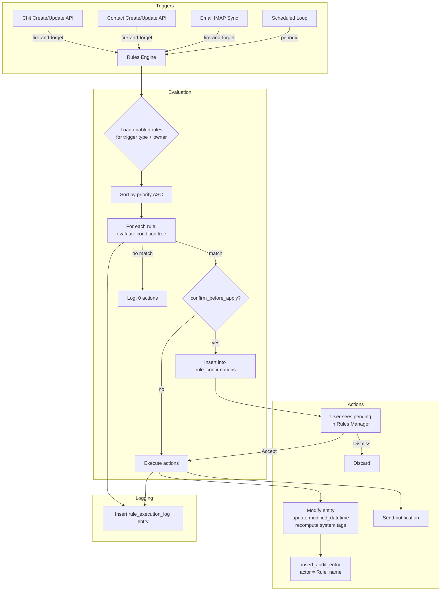

# Design Document: Rules Engine

## Overview

The Rules Engine adds "if this, then that" automation to CWOC. Users define rules with triggers, conditions, and actions. When a trigger fires (chit created, email received, scheduled time, etc.), the engine evaluates the rule's condition tree and executes matching actions in priority order.

The system is composed of four layers:

1. **Data Layer** — Two new SQLite tables (`rules`, `rule_confirmations`, `rule_execution_log`) managed via inline migrations in `migrations.py`. A new Pydantic v1 model (`Rule`, `RuleConfirmation`) in `models.py` for request validation.
2. **Evaluation Engine** — A pure-function condition tree evaluator (`rules_engine.py`) that recursively walks AND/OR group nodes and leaf conditions, returning a boolean. Supports 12 operators, contact cross-references, and regex with timeout guards.
3. **API Layer** — A new route module `routes/rules.py` exposing CRUD endpoints for rules, pending confirmations, and execution logs under `/api/rules/*`. Follows the existing REST pattern (JSON in/out, owner-scoped, audit-logged).
4. **Frontend Layer** — Two new pages (`rules-manager.html`, `rule-editor.html`) built from `_template.html` with `shared-page.js` header/footer injection. A sidebar button (🤖 Rules) and F10 hotkey for quick access.

Trigger hooks are inserted into the existing `chits.py` and `contacts.py` route handlers (create/update endpoints) as lightweight async fire-and-forget calls. Scheduled triggers run in a background loop registered in `schedulers.py`, following the same pattern as the weather scheduler.

### Design Rationale

- **Pure evaluation engine**: The condition tree evaluator is a standalone module (`rules_engine.py`) with no database or HTTP dependencies. This makes it independently testable and keeps the route layer thin.
- **Confirmation as first-class concept**: The `rule_confirmations` table decouples action execution from evaluation. Rules with `confirm_before_apply=True` write to this table instead of executing immediately, giving users a safety net.
- **All-match semantics**: All matching rules fire (not first-match-wins). This is simpler to reason about and avoids subtle ordering bugs where a high-priority rule shadows others.
- **Existing patterns throughout**: Migrations use column-existence checks, models use Pydantic v1 with Optional fields, routes use `get_actor_from_request()` for auth, audit uses `insert_audit_entry()`, and the scheduler follows `start_weather_schedulers()`.

## Architecture



### File Organization

| Layer | File | Purpose |
|-------|------|---------|
| Backend — Engine | `src/backend/rules_engine.py` | Pure condition tree evaluator, action executor, trigger dispatcher |
| Backend — Routes | `src/backend/routes/rules.py` | CRUD API for rules, confirmations, execution logs |
| Backend — Models | `src/backend/models.py` | `Rule`, `RuleConfirmation` Pydantic models (additions) |
| Backend — Migrations | `src/backend/migrations.py` | `migrate_create_rules_tables()` |
| Backend — Schedulers | `src/backend/schedulers.py` | `start_rules_scheduler()` background loop |
| Backend — Main | `src/backend/main.py` | Register rules routes, call migration, start scheduler |
| Frontend — HTML | `src/frontend/html/rules-manager.html` | Rules Manager page |
| Frontend — HTML | `src/frontend/html/rule-editor.html` | Rule Editor page |
| Frontend — JS | `src/frontend/js/pages/rules-manager.js` | Rules Manager logic |
| Frontend — JS | `src/frontend/js/pages/rule-editor.js` | Rule Editor logic (condition tree builder, action config) |
| Frontend — CSS | `src/frontend/css/shared/shared-rules.css` | Rules-specific styles (condition tree, action rows) |
| Frontend — Sidebar | `src/frontend/js/shared/shared-sidebar.js` | Add 🤖 Rules button next to Calculator |
| Frontend — Hotkeys | `src/frontend/js/dashboard/main-hotkeys.js` | Register F10 hotkey |

## Components and Interfaces

### 1. Condition Tree Evaluator (`rules_engine.py`)

The core evaluation function is pure — it takes a condition tree (dict) and an entity (dict) and returns a boolean. No database access, no side effects.

```python
def evaluate_condition_tree(tree: dict, entity: dict, contacts: list[dict] | None = None) -> bool:
    """Recursively evaluate a condition tree against an entity.
    
    Args:
        tree: A Condition_Tree node (group or leaf).
        entity: The triggering entity as a flat dict (chit or contact row).
        contacts: Optional list of user's contacts for cross-reference conditions.
    
    Returns:
        True if the entity satisfies the condition tree, False otherwise.
    """
```

**Group node evaluation:**
```python
if tree["type"] == "group":
    results = [evaluate_condition_tree(child, entity, contacts) for child in tree["children"]]
    if tree["operator"] == "AND":
        return all(results)
    else:  # OR
        return any(results)
```

**Leaf node evaluation:**
```python
def evaluate_leaf(leaf: dict, entity: dict, contacts: list[dict] | None = None) -> bool:
    """Evaluate a single leaf condition.
    
    Handles field extraction, JSON deserialization for list fields,
    operator dispatch, and contact cross-reference resolution.
    """
```

**Supported operators:**

| Operator | Behavior | Applicable Types |
|----------|----------|-----------------|
| `equals` | Exact string match (case-insensitive) | All string fields |
| `not_equals` | Negation of equals | All string fields |
| `contains` | Substring match (case-insensitive) | All string fields |
| `not_contains` | Negation of contains | All string fields |
| `starts_with` | Prefix match (case-insensitive) | All string fields |
| `ends_with` | Suffix match (case-insensitive) | All string fields |
| `is_empty` | Field is None, empty string, or empty list | All fields |
| `is_not_empty` | Negation of is_empty | All fields |
| `greater_than` | Numeric/date comparison | Numeric, datetime fields |
| `less_than` | Numeric/date comparison | Numeric, datetime fields |
| `regex_match` | Regex pattern match with 2-second timeout | All string fields |
| `tag_present` | Check if a specific tag exists in the tags list | tags field |
| `tag_not_present` | Check if a specific tag does NOT exist in the tags list | tags field |
| `person_on_chit` | Check if a name exists in the people list | people field |
| `person_not_on_chit` | Check if a name does NOT exist in the people list | people field |

**Contact cross-reference:**
```python
def resolve_contact_cross_ref(field: str, operator: str, value: str, 
                                entity: dict, contacts: list[dict]) -> bool:
    """Resolve a condition that cross-references user contacts.
    
    Example: field="location", operator="contains_contact_city" 
    checks if the entity's location matches any city in the user's contact addresses.
    """
```

**Regex timeout guard:**
```python
import re
import signal

def _regex_match_with_timeout(pattern: str, text: str, timeout_seconds: int = 2) -> bool:
    """Compile and match a regex with a timeout to prevent catastrophic backtracking."""
```

### 2. Action Executor (`rules_engine.py`)

```python
def execute_action(action: dict, entity_type: str, entity_id: str, 
                   owner_id: str, rule_name: str, rule_id: str) -> dict:
    """Execute a single rule action against an entity.
    
    Args:
        action: Action dict with "type" and "params" keys.
        entity_type: "chit" or "contact".
        entity_id: UUID of the target entity.
        owner_id: UUID of the rule owner (for permission checks).
        rule_name: For audit logging.
        rule_id: For audit logging.
    
    Returns:
        {"success": True/False, "message": str}
    """
```

**Supported chit actions:**

| Action Type | Parameters | Behavior |
|-------------|-----------|----------|
| `add_tag` | `{"tag": "Invoice"}` | Append tag to chit's tags list |
| `remove_tag` | `{"tag": "Inbox"}` | Remove tag from chit's tags list |
| `set_status` | `{"status": "Complete"}` | Set chit status field |
| `set_priority` | `{"priority": "High"}` | Set chit priority field |
| `set_severity` | `{"severity": "Critical"}` | Set chit severity field |
| `set_color` | `{"color": "#ff0000"}` | Set chit color field |
| `set_location` | `{"location": "Office"}` | Set chit location field |
| `add_person` | `{"person": "John Doe"}` | Append person to chit's people list |
| `archive` | `{}` | Set chit archived=True |
| `move_to_trash` | `{}` | Set chit deleted=True, deleted_datetime=now |
| `add_to_project` | `{"project_id": "uuid"}` | Append chit ID to project's child_chits |
| `add_alert` | `{"alert": {...}}` | Append alert object to chit's alerts list |
| `share_with_user` | `{"user_id": "uuid", "role": "viewer"}` | Add share entry to chit's shares |
| `assign_to_user` | `{"user_id": "uuid"}` | Set chit assigned_to field |

**Email-specific actions:**

| Action Type | Parameters | Behavior |
|-------------|-----------|----------|
| `mark_email_read` | `{}` | Set email_read=True |
| `mark_email_unread` | `{}` | Set email_read=False |
| `move_email_to_folder` | `{"folder": "trash"}` | Set email_folder field |

**Notification action:**

| Action Type | Parameters | Behavior |
|-------------|-----------|----------|
| `send_notification` | `{"message": "template"}` | Send push/ntfy notification using existing helpers |

**Contact cross-reference action:**

| Action Type | Parameters | Behavior |
|-------------|-----------|----------|
| `add_matching_contacts_as_people` | `{"match_field": "city"}` | Look up contacts whose address city matches chit location, add display names to people list |

Each action:
1. Reads the current entity from the database
2. Verifies the owner has edit access
3. Applies the modification
4. Updates `modified_datetime`
5. Recomputes system tags (for chits) via `compute_system_tags()`
6. Inserts an audit entry with actor = `"Rule: {rule_name} ({rule_id}) on behalf of {username} ({user_id})"`
7. Returns success/failure result

### 3. Trigger Dispatcher (`rules_engine.py`)

```python
async def dispatch_trigger(trigger_type: str, entity_type: str, 
                           entity: dict, owner_id: str):
    """Fire-and-forget: load matching rules, evaluate, execute/queue actions.
    
    Called from chit/contact route handlers after create/update operations.
    Runs in a background task so it doesn't block the API response.
    """
```

Flow:
1. Query all enabled rules for `owner_id` with matching `trigger_type`, ordered by `priority ASC`
2. For contact cross-reference conditions, load the user's contacts once
3. For each rule, evaluate the condition tree against the entity
4. If conditions match and `confirm_before_apply=True`, insert into `rule_confirmations`
5. If conditions match and `confirm_before_apply=False`, execute each action
6. Insert a `rule_execution_log` entry for every rule evaluated
7. Update the rule's `last_run_datetime`, `run_count`, and `last_run_result`

### 4. Rules CRUD API (`routes/rules.py`)

All endpoints require authentication via `get_actor_from_request()` and scope queries by `owner_id`.

| Method | Endpoint | Description |
|--------|----------|-------------|
| GET | `/api/rules` | List all rules for authenticated user, sorted by priority |
| GET | `/api/rules/{rule_id}` | Get single rule (404 if not owned) |
| POST | `/api/rules` | Create new rule (UUID generated, owner_id set from auth) |
| PUT | `/api/rules/{rule_id}` | Update existing rule (404 if not owned) |
| DELETE | `/api/rules/{rule_id}` | Delete rule (404 if not owned) |
| PATCH | `/api/rules/{rule_id}/toggle` | Toggle enabled flag |
| PUT | `/api/rules/reorder` | Accept ordered list of rule IDs, update priorities |
| GET | `/api/rules/confirmations` | List pending confirmations for user |
| POST | `/api/rules/confirmations/{id}/accept` | Execute queued action, delete confirmation |
| POST | `/api/rules/confirmations/{id}/dismiss` | Discard queued action, delete confirmation |
| GET | `/api/rules/{rule_id}/log` | Execution log for specific rule (paginated) |
| GET | `/api/rules/log` | Execution log across all rules (filterable) |

### 5. Frontend — Rules Manager Page

The Rules Manager page (`rules-manager.html`) follows the standard CWOC secondary page pattern:
- Built from `_template.html`
- Uses `shared-page.js` for header/footer injection via `data-page-title="Rules Manager"` and `data-page-icon="🤖"`
- Parchment/brown aesthetic with Lora serif font

**Layout:**
1. **Pending Confirmations Section** (top) — Collapsible section showing queued rule actions with Accept/Dismiss buttons. Polls `/api/rules/confirmations` on load. Hidden when empty.
2. **Rules Table** — Sortable table with columns: enabled toggle (checkbox), name (clickable link to editor), trigger type (badge), priority (#), last run (relative time), run count. Drag-and-drop reorder via `shared-sort.js` pattern.
3. **Action Bar** — "New Rule" button navigating to `rule-editor.html`.

**Interactions:**
- Toggle enabled: PATCH `/api/rules/{id}/toggle` on checkbox change
- Reorder: drag rows, PUT `/api/rules/reorder` on drop
- Delete: confirmation prompt via `cwocConfirm()` from `shared-utils.js`, then DELETE
- Click rule name: navigate to `rule-editor.html?id={rule_id}`

### 6. Frontend — Rule Editor Page

The Rule Editor page (`rule-editor.html`) follows the standard CWOC secondary page pattern with `CwocSaveSystem` for save/cancel with dirty-state tracking.

**Sections:**
1. **Rule Info** — Name (text input, required), Description (textarea, optional)
2. **Trigger** — Dropdown: Chit Created, Chit Updated, Email Received, Contact Created, Contact Updated, Scheduled. When "Scheduled" is selected, show frequency (daily / every N hours) and time-of-day inputs.
3. **Conditions** — Visual tree builder:
   - Root is always a group node (AND by default)
   - "Add Condition" button adds a leaf node (field dropdown + operator dropdown + value input)
   - "Add Group" button adds a nested AND/OR group
   - Each node has a remove (×) button
   - Groups show their operator (AND/OR) as a toggle button
   - Field dropdown is filtered by trigger type (chit fields for chit triggers, contact fields for contact triggers, email fields for email triggers)
   - Indentation with left-border lines to visualize nesting
4. **Actions** — List of action rows. Each row: action type dropdown + parameter inputs (dynamic based on type). "Add Action" button appends a row.
5. **Settings** — Confirm before apply toggle (default: on)
6. **Save/Cancel** — `CwocSaveSystem` buttons

**Validation before save:**
- Name is required (non-empty)
- Trigger type is selected
- At least one condition exists
- At least one action exists

### 7. Sidebar & Hotkey Integration

**Sidebar (`shared-sidebar.js`):**
The Calculator button currently sits alone in a `<div>` row. The design changes this to a half-width row with Calculator and Rules side by side:

```javascript
// Before (current):
html += '  <div style="display:flex;gap:6px;margin-top:6px;">';
html += '    <button class="action-button sidebar-compact-btn" id="sidebar-calculator-btn" ...>';
html += '      🧮 Calculator';
html += '    </button>';
html += '  </div>';

// After (with Rules):
html += '  <div style="display:flex;gap:6px;margin-top:6px;">';
html += '    <button class="action-button sidebar-compact-btn" id="sidebar-calculator-btn" ...>';
html += '      🧮 Calculator';
html += '    </button>';
html += '    <button class="action-button sidebar-compact-btn" id="sidebar-rules-btn" title="Rules Engine (F10)">';
html += '      🤖 Rules';
html += '    </button>';
html += '  </div>';
```

**Hotkey (`main-hotkeys.js`):**
Register F10 to navigate to `/frontend/html/rules-manager.html`, following the same pattern as other hotkeys (e.g., F4 for Calculator).

### 8. Scheduled Rule Execution (`schedulers.py`)

A new `start_rules_scheduler()` function registered in `main.py`'s `on_startup()`:

```python
async def start_rules_scheduler():
    """Background loop that checks for scheduled rules every 60 seconds."""
    while True:
        await asyncio.sleep(60)
        # Query all enabled rules with trigger_type="scheduled"
        # For each, check if enough time has elapsed since last_run_datetime
        # If due, dispatch the rule against all matching entities
```

On server restart, the loop checks `last_run_datetime` for each scheduled rule and immediately runs any that are overdue.

## Data Models

### SQLite Tables

**`rules` table:**

| Column | Type | Default | Description |
|--------|------|---------|-------------|
| id | TEXT PRIMARY KEY | — | UUID |
| owner_id | TEXT | — | User UUID (foreign key to users) |
| name | TEXT | — | Human-readable rule name |
| description | TEXT | NULL | Optional description |
| enabled | BOOLEAN | 1 | Whether rule is active |
| priority | INTEGER | 0 | Execution order (lower = first) |
| trigger_type | TEXT | — | One of: chit_created, chit_updated, email_received, contact_created, contact_updated, scheduled |
| conditions | TEXT | — | JSON string: Condition_Tree |
| actions | TEXT | — | JSON string: array of action objects |
| confirm_before_apply | BOOLEAN | 1 | Whether to queue for confirmation |
| schedule_config | TEXT | NULL | JSON string: {"frequency": "daily"/"hourly", "interval": 1, "time_of_day": "09:00"} |
| created_datetime | TEXT | — | ISO 8601 UTC |
| modified_datetime | TEXT | — | ISO 8601 UTC |
| last_run_datetime | TEXT | NULL | ISO 8601 UTC of last execution |
| run_count | INTEGER | 0 | Total execution count |
| last_run_result | TEXT | NULL | Summary string of last execution |

**`rule_confirmations` table:**

| Column | Type | Default | Description |
|--------|------|---------|-------------|
| id | TEXT PRIMARY KEY | — | UUID |
| rule_id | TEXT | — | FK to rules.id |
| rule_name | TEXT | — | Denormalized for display |
| owner_id | TEXT | — | User UUID |
| action_description | TEXT | — | Human-readable description |
| action_data | TEXT | — | JSON string: the action to execute |
| target_entity_type | TEXT | — | "chit" or "contact" |
| target_entity_id | TEXT | — | UUID of target entity |
| created_datetime | TEXT | — | ISO 8601 UTC |

**`rule_execution_log` table:**

| Column | Type | Default | Description |
|--------|------|---------|-------------|
| id | TEXT PRIMARY KEY | — | UUID |
| rule_id | TEXT | — | FK to rules.id |
| owner_id | TEXT | — | User UUID |
| trigger_event | TEXT | — | Description of the triggering event |
| entities_evaluated | INTEGER | 0 | Count of entities checked |
| entities_matched | INTEGER | 0 | Count that satisfied conditions |
| actions_executed | INTEGER | 0 | Count of successful actions |
| actions_failed | INTEGER | 0 | Count of failed actions |
| result_summary | TEXT | — | Human-readable summary |
| executed_datetime | TEXT | — | ISO 8601 UTC |

### Condition Tree JSON Structure

```json
{
  "type": "group",
  "operator": "AND",
  "children": [
    {
      "type": "leaf",
      "field": "status",
      "operator": "equals",
      "value": "ToDo"
    },
    {
      "type": "group",
      "operator": "OR",
      "children": [
        {
          "type": "leaf",
          "field": "tags",
          "operator": "tag_present",
          "value": "Urgent"
        },
        {
          "type": "leaf",
          "field": "priority",
          "operator": "equals",
          "value": "High"
        }
      ]
    }
  ]
}
```

**Leaf node schema:**
```json
{
  "type": "leaf",
  "field": "<field_name>",
  "operator": "<operator>",
  "value": "<comparison_value>"
}
```

**Group node schema:**
```json
{
  "type": "group",
  "operator": "AND" | "OR",
  "children": [<node>, ...]
}
```

### Action JSON Structure

```json
[
  {
    "type": "add_tag",
    "params": {
      "tag": "Invoice"
    }
  },
  {
    "type": "set_status",
    "params": {
      "status": "In Progress"
    }
  },
  {
    "type": "send_notification",
    "params": {
      "message": "Rule '{rule_name}' matched chit '{chit_title}'"
    }
  }
]
```

### Pydantic Models (additions to `models.py`)

```python
class RuleCreate(BaseModel):
    name: str
    description: Optional[str] = None
    enabled: Optional[bool] = True
    priority: Optional[int] = 0
    trigger_type: str
    conditions: Optional[dict] = None      # Condition_Tree
    actions: Optional[list] = None         # Array of action objects
    confirm_before_apply: Optional[bool] = True
    schedule_config: Optional[dict] = None # For scheduled triggers

class RuleUpdate(BaseModel):
    name: Optional[str] = None
    description: Optional[str] = None
    enabled: Optional[bool] = None
    priority: Optional[int] = None
    trigger_type: Optional[str] = None
    conditions: Optional[dict] = None
    actions: Optional[list] = None
    confirm_before_apply: Optional[bool] = None
    schedule_config: Optional[dict] = None

class RuleReorder(BaseModel):
    rule_ids: List[str]  # Ordered list of rule IDs
```

### Migration Function

```python
def migrate_create_rules_tables():
    """Create rules, rule_confirmations, and rule_execution_log tables if they don't exist."""
    conn = None
    try:
        conn = sqlite3.connect(DB_PATH)
        cursor = conn.cursor()
        
        cursor.execute("""
        CREATE TABLE IF NOT EXISTS rules (
            id TEXT PRIMARY KEY,
            owner_id TEXT,
            name TEXT,
            description TEXT,
            enabled BOOLEAN DEFAULT 1,
            priority INTEGER DEFAULT 0,
            trigger_type TEXT,
            conditions TEXT,
            actions TEXT,
            confirm_before_apply BOOLEAN DEFAULT 1,
            schedule_config TEXT,
            created_datetime TEXT,
            modified_datetime TEXT,
            last_run_datetime TEXT,
            run_count INTEGER DEFAULT 0,
            last_run_result TEXT
        )
        """)
        
        cursor.execute("""
        CREATE TABLE IF NOT EXISTS rule_confirmations (
            id TEXT PRIMARY KEY,
            rule_id TEXT,
            rule_name TEXT,
            owner_id TEXT,
            action_description TEXT,
            action_data TEXT,
            target_entity_type TEXT,
            target_entity_id TEXT,
            created_datetime TEXT
        )
        """)
        
        cursor.execute("""
        CREATE TABLE IF NOT EXISTS rule_execution_log (
            id TEXT PRIMARY KEY,
            rule_id TEXT,
            owner_id TEXT,
            trigger_event TEXT,
            entities_evaluated INTEGER DEFAULT 0,
            entities_matched INTEGER DEFAULT 0,
            actions_executed INTEGER DEFAULT 0,
            actions_failed INTEGER DEFAULT 0,
            result_summary TEXT,
            executed_datetime TEXT
        )
        """)
        
        conn.commit()
        logger.info("Rules tables created/verified")
    except Exception as e:
        logger.error(f"Error creating rules tables: {str(e)}")
    finally:
        if conn:
            conn.close()
```


## Correctness Properties

*A property is a characteristic or behavior that should hold true across all valid executions of a system — essentially, a formal statement about what the system should do. Properties serve as the bridge between human-readable specifications and machine-verifiable correctness guarantees.*

### Property 1: Condition Tree Serialization Round-Trip

*For any* valid Condition_Tree (with arbitrary nesting depth, mix of group and leaf nodes, any supported operator, and any string/boolean/numeric comparison values), serializing the tree to JSON via `serialize_json_field` and then deserializing via `deserialize_json_field` SHALL produce a structurally equivalent Condition_Tree.

**Validates: Requirements 1.4, 12.1, 12.2, 12.3**

### Property 2: Leaf Condition Operator Correctness

*For any* entity dict and *any* leaf condition with a supported operator (equals, not_equals, contains, not_contains, starts_with, ends_with, is_empty, is_not_empty, greater_than, less_than, tag_present, tag_not_present, person_on_chit, person_not_on_chit), the evaluator SHALL produce a result consistent with the operator's defined semantics — including correct deserialization of JSON-serialized list fields (tags, people, alerts) before comparison.

**Validates: Requirements 2.2, 2.5, 2.7**

### Property 3: Boolean Group Evaluation Correctness

*For any* Condition_Tree consisting of group nodes and leaf nodes, an AND group SHALL return True if and only if all its children evaluate to True, and an OR group SHALL return True if and only if at least one child evaluates to True, applied recursively at every nesting level.

**Validates: Requirements 2.1**

### Property 4: Missing Field Safety

*For any* leaf condition that references a field name not present on the triggering entity dict, the evaluator SHALL return False (condition not satisfied) rather than raising an exception.

**Validates: Requirements 2.8**

### Property 5: Dispatch Priority Ordering and All-Match Semantics

*For any* set of enabled rules matching a trigger event, the dispatcher SHALL evaluate and execute them in ascending priority order (lower number first), and SHALL execute ALL matching rules — not just the first match.

**Validates: Requirements 3.7, 3.8**

### Property 6: Chit Action Side-Effects Invariant

*For any* rule action that modifies a chit (add_tag, remove_tag, set_status, set_priority, set_severity, set_color, set_location, add_person, archive, move_to_trash, add_to_project, add_alert, share_with_user, assign_to_user, mark_email_read, mark_email_unread, move_email_to_folder), the action executor SHALL update the chit's `modified_datetime` to the current UTC timestamp AND recompute system tags via `compute_system_tags`.

**Validates: Requirements 4.5, 4.6**

### Property 7: Action Failure Continuation

*For any* sequence of actions in a rule where one or more actions fail (database error, permission denied, invalid target), the executor SHALL continue executing the remaining actions in the sequence and SHALL log each failure in the rule's `last_run_result`.

**Validates: Requirements 4.8**

### Property 8: Confirmation Mode Branching

*For any* rule where `confirm_before_apply` is True, when conditions match, the dispatcher SHALL insert a pending confirmation record into `rule_confirmations` and SHALL NOT execute the action immediately. Conversely, *for any* rule where `confirm_before_apply` is False, when conditions match, the dispatcher SHALL execute the action immediately and SHALL NOT create a confirmation record.

**Validates: Requirements 5.1, 5.2, 5.7**

### Property 9: Execution Bookkeeping

*For any* rule evaluation (whether conditions match or not), the engine SHALL: (a) insert a `rule_execution_log` entry recording the trigger event, entities evaluated, entities matched, actions executed, and actions failed; (b) update the rule's `last_run_datetime` to the current UTC timestamp; (c) increment the rule's `run_count` by 1; and (d) set `last_run_result` to a summary string. Additionally, *for any* action that modifies an entity, the engine SHALL insert an audit log entry with actor formatted as `"Rule: {rule_name} ({rule_id}) on behalf of {username} ({user_id})"`.

**Validates: Requirements 6.1, 6.2, 6.4, 13.2**

### Property 10: Condition Tree Validation

*For any* valid Condition_Tree (where every node is either a leaf with field/operator/value keys or a group with operator "AND"/"OR" and a children array), validation SHALL pass. *For any* malformed tree (missing required keys, invalid operator, non-array children), validation SHALL reject the tree with an error.

**Validates: Requirements 12.4**

### Property 11: Owner Scoping Isolation

*For any* two distinct users A and B, and *any* rule owned by user B, querying rules with user A's owner_id SHALL never return user B's rule. Attempting to read, update, or delete user B's rule via user A's authenticated session SHALL return HTTP 404.

**Validates: Requirements 1.3, 7.9**

## Error Handling

### Condition Evaluation Errors

| Error Scenario | Handling |
|---------------|----------|
| Missing field on entity | Return `False` for the leaf condition (Req 2.8) |
| Invalid regex pattern | Catch `re.error`, return `False` for the leaf, log warning |
| Regex timeout (catastrophic backtracking) | Kill regex after 2 seconds, return `False`, log warning |
| Malformed condition tree JSON | Reject on load with validation error (Req 12.4), skip rule evaluation |
| Empty children array in group node | AND with no children returns `True` (vacuous truth), OR with no children returns `False` |

### Action Execution Errors

| Error Scenario | Handling |
|---------------|----------|
| Target entity not found | Log failure in `last_run_result`, continue to next action (Req 4.8) |
| Permission denied (owner lacks edit access) | Log failure, continue to next action |
| Database write error | Log failure, continue to next action |
| Invalid action type | Log failure, continue to next action |
| Invalid action parameters | Log failure, continue to next action |

### API Errors

| Error Scenario | HTTP Status | Response |
|---------------|-------------|----------|
| Rule not found or not owned by user | 404 | `{"detail": "Rule not found"}` |
| Confirmation not found or not owned | 404 | `{"detail": "Confirmation not found"}` |
| Validation error (missing name, trigger, etc.) | 422 | Pydantic validation error detail |
| Invalid rule ID format | 400 | `{"detail": "Invalid rule ID"}` |
| Database error | 500 | `{"detail": "Internal server error"}` |

### Trigger Dispatch Errors

| Error Scenario | Handling |
|---------------|----------|
| Database error loading rules | Log error, skip trigger dispatch (don't block the API response) |
| Exception during rule evaluation | Log error, record in execution log, continue to next rule |
| Exception during action execution | Log error, record in execution log, continue to next action |

All trigger dispatches run as fire-and-forget background tasks so they never block or fail the originating API request.

## Testing Strategy

### Property-Based Tests

Property-based testing is well-suited for the Rules Engine because the core evaluation logic is a pure function with a large input space (arbitrary condition trees × arbitrary entities). The following properties will be tested using Python's built-in `unittest` with randomized test data generation (no external PBT libraries, per project constraints — no pip installs).

Each property test will:
- Generate randomized inputs using a custom generator module
- Run a minimum of 100 iterations per property
- Tag each test with a comment referencing the design property

**Test file:** `src/backend/test_rules_engine.py`

| Property | Test Description | Iterations |
|----------|-----------------|------------|
| Property 1 | Generate random condition trees, serialize/deserialize, verify equivalence | 100+ |
| Property 2 | Generate random entities and leaf conditions with each operator, verify correct boolean result | 100+ |
| Property 3 | Generate random nested AND/OR trees with known leaf values, verify group evaluation matches expected boolean logic | 100+ |
| Property 4 | Generate random field names not on entity, verify evaluator returns False | 100+ |
| Property 5 | Generate random rule sets with different priorities, verify dispatch order and all-match | 100+ |
| Property 8 | Generate random rules with confirm_before_apply True/False, verify queuing vs immediate execution | 100+ |
| Property 10 | Generate random valid and invalid condition trees, verify validation accepts/rejects correctly | 100+ |
| Property 11 | Generate random users and rules, verify owner scoping isolation | 100+ |

**Tag format:** `# Feature: rules-engine, Property {N}: {property_text}`

### Unit Tests (Example-Based)

**Test file:** `src/backend/test_rules_engine.py`

| Test | Description |
|------|-------------|
| Operator examples | Specific examples for each of the 14 operators with known inputs/outputs |
| Chit field conditions | Verify conditions work on each chit field (title, note, status, etc.) |
| Contact field conditions | Verify conditions work on each contact field |
| Contact cross-reference | Verify cross-reference condition resolves contact data correctly |
| Regex timeout | Verify catastrophic regex is caught within timeout |
| Action execution | Verify each action type modifies the entity correctly |
| CRUD API | Verify create, read, update, delete, toggle, reorder endpoints |
| Confirmation flow | Verify accept and dismiss endpoints work correctly |
| Execution log | Verify log entries are created and queryable |

### Integration Tests

| Test | Description |
|------|-------------|
| Trigger hooks | Verify chit create/update triggers rule evaluation |
| Contact triggers | Verify contact create/update triggers rule evaluation |
| Scheduled execution | Verify scheduled rules run at configured intervals |
| Audit trail | Verify rule actions produce correct audit log entries |
| Permission checks | Verify rules cannot modify entities the owner lacks access to |

### Manual Testing

| Test | Description |
|------|-------------|
| Rules Manager page | Verify table display, toggle, reorder, delete, navigation |
| Rule Editor page | Verify form fields, condition tree builder, action config, save/cancel |
| Sidebar button | Verify 🤖 Rules button appears next to Calculator |
| F10 hotkey | Verify F10 opens Rules Manager from dashboard |
| Confirmation popup | Verify pending confirmations display with Accept/Dismiss |
| Mobile responsiveness | Verify both pages work on small screens |
