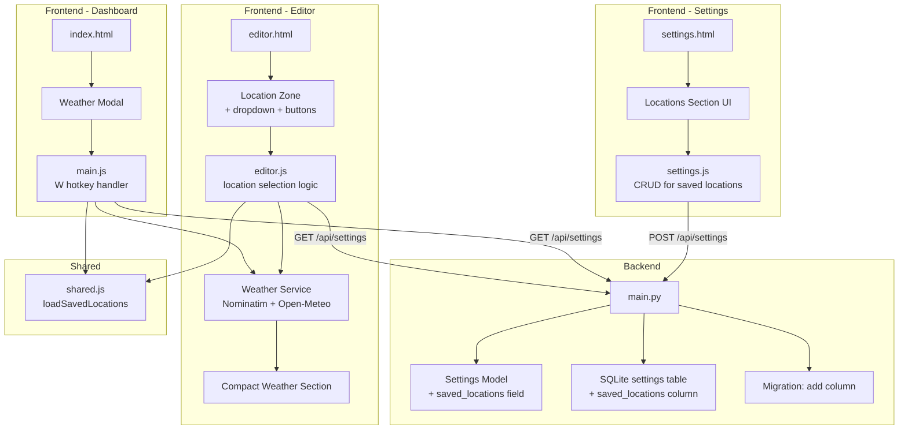

# Design Document: Saved Locations & Weather

## Overview

This feature fixes broken weather loading in the chit editor, introduces a saved locations management system in Settings, adds a dashboard weather hotkey modal ("W"), and enhances the editor's Location zone with saved-location selection controls.

The current weather system has two bugs: the `defaultAddress` constant is hardcoded as an empty string, and the weather fetch logic has control-flow issues that prevent display when a chit has both a location and a date. This design resolves those bugs and layers a full saved-locations subsystem on top.

### Key Design Decisions

1. **Saved locations stored in settings JSON** — Reuses the existing `/api/settings/default_user` endpoint and settings table rather than creating a new table. Locations are a small dataset (typically < 20 entries) that naturally belongs with user preferences.

2. **No new API endpoints** — The `saved_locations` field is added to the existing Settings Pydantic model and persisted as a JSON column. All pages already fetch settings at init, so saved locations are available everywhere without extra network calls.

3. **Frontend-driven weather fetch** — Weather continues to be fetched client-side via Open-Meteo and Nominatim. No backend proxy. This keeps the backend simple and avoids caching complexity.

4. **Shared location loading utility** — A new `loadSavedLocations()` function in `shared.js` fetches and caches saved locations from settings, used by both the editor and dashboard.

## Architecture



## Components and Interfaces

### Backend Changes (main.py)

**Settings Model Update:**
- Add `saved_locations: Optional[str] = None` to the `Settings` Pydantic model (JSON-serialized string, matching the existing pattern for `active_clocks`)

**Migration Function:**
- `migrate_add_saved_locations()` — adds `saved_locations TEXT` column to the `settings` table if not present

**GET /api/settings/{user_id} Update:**
- Deserialize `saved_locations` via `deserialize_json_field()` before returning

**POST /api/settings Update:**
- Include `saved_locations` in the INSERT OR REPLACE column list
- Serialize via `serialize_json_field()` before writing

### Saved Locations Data Shape

```json
{
  "saved_locations": [
    { "label": "Home", "address": "123 Main St, Springfield, IL", "is_default": true },
    { "label": "Office", "address": "456 Oak Ave, Springfield, IL", "is_default": false }
  ]
}
```

- `label` (string): User-defined name for the location
- `address` (string): Full address string for geocoding
- `is_default` (boolean): Exactly one entry should have `is_default: true`

### Frontend - Shared (shared.js)

**`loadSavedLocations()`** — Async function that fetches settings and returns the `saved_locations` array (or empty array). Caches the result in `window._savedLocations` for the page lifetime.

**`getDefaultLocation()`** — Returns the saved location object where `is_default === true`, or `null` if none configured.

### Frontend - Settings Page (settings.js + settings.html)

**New Locations Section in settings.html:**
- A `<div class="setting-group">` containing:
  - Section header "📍 Saved Locations"
  - Container `<div id="locations-list">` for dynamic location rows
  - Each row: radio button (default) + label input + address input + remove button
  - "+" button to add a new row (shown when last row has a non-empty address)

**settings.js additions:**
- `renderLocationsSection(locations)` — Renders the saved locations rows from data
- `collectLocationsData()` — Reads the DOM rows and returns the array for saving
- Auto-select logic: if only one location has a non-empty address, auto-check its radio
- Empty row cleanup on save: remove rows with empty addresses (keep at least one)
- Integration with existing `SettingsManager.save()` flow

### Frontend - Editor (editor.js + editor.html)

**Weather Bug Fixes:**
- Remove the hardcoded `const defaultAddress = ""` — it serves no purpose
- Fix `loadChitData()` weather fetch: check `chit.location` directly (not `chit.location || defaultAddress`)
- Add error handling in `fetchWeatherData()` to display error messages in the compact weather section instead of silently failing
- Add distinct placeholder messages: "📅 Add a date for weather" (has location, no date) and "📍 Add a location for weather" (has date, no location)

**Location Zone Enhancements (editor.html):**
- Add "+Location" button in the Location zone header (next to existing Search/Map/Directions buttons)
- Add a `<select id="saved-locations-dropdown">` inside the location zone body, above the address input
- Add a "✕ Clear" button to remove the current location

**editor.js additions:**
- `loadSavedLocationsDropdown()` — Populates the dropdown from cached saved locations
- `onSavedLocationSelect()` — When a dropdown option is selected, populate the location input and trigger weather/map fetch
- `onAddDefaultLocation()` — "+Location" button handler: populate from default location or show message
- `onClearLocation()` — Clear location input, map display, and weather section
- Compact dropdown button in the title/weather area for quick access

### Frontend - Dashboard (main.js + index.html)

**Weather Modal:**
- New `<div id="weather-modal-overlay">` appended to body dynamically (same pattern as existing clock modal)
- Parchment/brown theme matching existing modals

**main.js additions:**
- `_openWeatherModal()` — Fetches default location, calls Weather Service, renders modal
- `_closeWeatherModal()` — Removes modal from DOM
- Hotkey handler: add "W" case to the existing keydown handler (when no input focused and no hotkey mode active)
- Modal displays: location label, address, weather icon, high/low °F, precipitation, temperature bar (reusing the compact weather rendering pattern from editor.js)

## Data Models

### Settings Table Schema Change

```sql
ALTER TABLE settings ADD COLUMN saved_locations TEXT;
```

The column stores a JSON string. Example value:

```json
[
  {"label": "Home", "address": "123 Main St, Springfield, IL", "is_default": true},
  {"label": "Work", "address": "456 Oak Ave, Springfield, IL", "is_default": false}
]
```

### Settings Pydantic Model Update

```python
class Settings(BaseModel):
    # ... existing fields ...
    saved_locations: Optional[str] = None  # JSON string of location objects
```

### Saved Location Object Shape (Frontend)

```javascript
{
  label: "Home",        // string — user-defined name
  address: "123 Main St, Springfield, IL",  // string — geocodable address
  is_default: true      // boolean — exactly one should be true
}
```

## Correctness Properties

*A property is a characteristic or behavior that should hold true across all valid executions of a system — essentially, a formal statement about what the system should do. Properties serve as the bridge between human-readable specifications and machine-verifiable correctness guarantees.*

### Property 1: Saved locations API round-trip

*For any* valid saved_locations array (containing objects with label, address, and is_default fields), POSTing it to `/api/settings` and then GETting from `/api/settings/default_user` SHALL return an equivalent saved_locations array.

**Validates: Requirements 3.3, 3.4**

### Property 2: Weather modal renders all required fields

*For any* valid weather data object (with daily weathercode, temperature_2m_max, temperature_2m_min, precipitation_sum) and any saved location (with label and address), the rendered Weather_Modal HTML SHALL contain the location label, address, a weather icon, the high temperature, the low temperature, and precipitation information.

**Validates: Requirements 4.5**

### Property 3: Saved locations dropdown completeness

*For any* non-empty list of saved locations, the editor's saved-locations dropdown SHALL contain exactly one option per saved location (each showing the location's label), plus one null/empty option for clearing.

**Validates: Requirements 5.5, 5.6**

## Error Handling

### Weather Service Errors

| Error Condition | Behavior |
|---|---|
| Geocoding fails (Nominatim returns empty) | Display "Location not found: [address]" in compact weather section |
| Geocoding network error | Display "Could not reach location service" in compact weather section |
| Weather API fails (Open-Meteo error) | Display "Weather data unavailable for [address]" in compact weather section |
| Weather API network error | Display "Could not reach weather service" in compact weather section |
| No date on chit | Display "📅 Add a date for weather" placeholder |
| No location on chit | Display "📍 Add a location for weather" placeholder |

### Settings / Saved Locations Errors

| Error Condition | Behavior |
|---|---|
| Settings API fails to load | Saved locations dropdown shows empty; "+Location" button shows "Could not load locations" |
| No default location configured | "+Location" button shows "No default location set — configure in Settings"; Weather modal shows "No default location configured. Add one in Settings." |
| All saved location addresses empty on save | Keep one empty row; don't persist empty entries to backend |

### Dashboard Weather Modal Errors

| Error Condition | Behavior |
|---|---|
| Default location geocoding fails | Modal shows "Could not find location: [address]" |
| Weather fetch fails | Modal shows "Weather unavailable — try again later" |
| Settings load fails | Modal shows "Could not load settings" |

## Testing Strategy

### Unit Tests (Example-Based)

Focus on specific scenarios and edge cases:

- **Weather bug fixes**: Verify correct placeholder messages for missing date, missing location, and both present
- **Error display**: Verify error messages appear in compact weather section on fetch failure
- **Settings locations section**: Verify initial empty state shows one row, "+" button visibility, auto-select of single location
- **Editor location controls**: Verify "+Location" populates from default, dropdown selection populates field, clear button resets all three areas (field, map, weather)
- **Dashboard modal**: Verify "W" key opens modal, Escape closes it, no-default-location message displays correctly

### Property-Based Tests

Using a property-based testing library (e.g., Hypothesis for Python backend, fast-check for JS if added via CDN):

- **Property 1** (API round-trip): Generate random saved_locations arrays with varying labels, addresses, and default flags. POST then GET and verify equality. Minimum 100 iterations.
  - Tag: `Feature: saved-locations-weather, Property 1: Saved locations API round-trip`

- **Property 2** (Modal rendering): Generate random weather data objects and location objects. Render the modal HTML and verify all required fields are present. Minimum 100 iterations.
  - Tag: `Feature: saved-locations-weather, Property 2: Weather modal renders all required fields`

- **Property 3** (Dropdown completeness): Generate random lists of saved locations (1–20 entries). Render the dropdown and verify option count equals locations + 1 (null option) and each label appears. Minimum 100 iterations.
  - Tag: `Feature: saved-locations-weather, Property 3: Saved locations dropdown completeness`

### Integration Tests

- **End-to-end settings flow**: Save locations in Settings, navigate to Editor, verify dropdown is populated
- **End-to-end weather flow**: Set a location on a chit with a date, verify weather displays
- **Dashboard modal flow**: Configure a default location, press "W" on dashboard, verify weather appears
