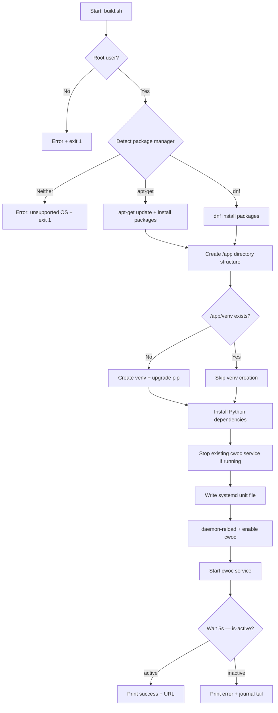

# Design Document: Server Configurinator

## Overview

The Server Configurinator is a single, self-contained Bash script (`configurinator/build.sh`) that provisions a bare Linux machine into a fully running CWOC production server. It targets Proxmox LXC containers running Debian/Ubuntu or Fedora/RHEL and handles the full lifecycle: system package installation, directory structure creation, Python virtual environment setup, dependency installation, systemd service configuration, and service startup with verification.

The script is designed to be idempotent — running it multiple times on the same machine produces the same end state without breaking existing installations. It uses execution guards (root check, package manager detection, `set -e`), structured progress logging, and error handling with informative messages at every step.

### Design Rationale

- **Single script**: One file keeps deployment simple — `scp` it to a machine and run it. No dependencies on configuration management tools (Ansible, Chef, etc.).
- **Idempotent by default**: Every create/install step checks for existing state first, making re-runs safe.
- **Fail-fast with `set -e`**: The script exits immediately on any command failure, preventing cascading errors on a half-provisioned machine.
- **Distro detection via package manager**: Checking for `apt-get` vs `dnf` is more reliable than parsing `/etc/os-release` across distro variants.

## Architecture

The script follows a linear, top-down execution model with clearly separated phases. There is no complex control flow — each phase runs in sequence, and failure at any point halts execution.



### Execution Phases

| Phase | Description | Idempotency Strategy |
|-------|-------------|---------------------|
| 1. Guards | Root check, package manager detection | Always runs — fast checks |
| 2. System packages | Install python3, pip, venv, sqlite3 | Package managers handle already-installed packages |
| 3. Directory structure | Create `/app` and subdirectories | `mkdir -p` — no-op if exists |
| 4. Virtual environment | Create `/app/venv` | Skip if `/app/venv/bin/python` exists |
| 5. Python dependencies | Install fastapi, uvicorn, pydantic, python-dotenv | pip handles already-installed packages |
| 6. Service config | Write unit file, daemon-reload, enable | Overwrites unit file, reload is always safe |
| 7. Service startup | Start cwoc, verify active status | Stop first if running, then start fresh |

## Components and Interfaces

Since this is a single shell script, "components" are logical sections (functions) within `build.sh`.

### Script Structure

```bash
#!/usr/bin/env bash
set -e

# --- Logging helpers ---
log_step()    # Print "[STEP] ..." before a phase
log_ok()      # Print "[OK] ..." after a phase succeeds
log_error()   # Print "[ERROR] ..." on failure, then exit 1

# --- Phase functions ---
check_root()              # Verify running as root
detect_package_manager()  # Set PKG_MGR to "apt" or "dnf", or exit
install_system_packages() # Install python3, pip, venv, sqlite3
create_directories()      # mkdir -p /app/{backend,frontend,static,data}
setup_virtualenv()        # Create /app/venv if missing, upgrade pip
install_python_deps()     # pip install fastapi uvicorn pydantic python-dotenv
configure_service()       # Write unit file, daemon-reload, enable
start_and_verify()        # Stop if running, start, wait, check is-active

# --- Main ---
main()                    # Calls each phase function in order
```

### Logging Interface

All output follows a consistent format for easy scanning:

```
[STEP] Installing system packages...
[OK]   System packages installed.
[ERROR] Failed to install python3-venv. Exiting.
```

### Package Manager Abstraction

The script sets a variable (`PKG_MGR`) after detection and uses it to branch install commands:

| Package | apt-get (Debian/Ubuntu) | dnf (Fedora/RHEL) |
|---------|------------------------|--------------------|
| Python 3 | `python3` | `python3` |
| pip | `python3-pip` | `python3-pip` |
| venv | `python3-venv` | *(included with python3)* |
| SQLite | `sqlite3` | `sqlite` |

### Systemd Unit File

The script writes the following unit file to `/etc/systemd/system/cwoc.service`:

```ini
[Unit]
Description=CWOC FastAPI Backend Service
After=network.target

[Service]
Type=simple
User=root
WorkingDirectory=/app
Environment="PATH=/app/venv/bin:/usr/local/sbin:/usr/local/bin:/usr/sbin:/usr/bin:/sbin:/bin"
ExecStart=/app/venv/bin/uvicorn backend.main:app --host 0.0.0.0 --port 3333 --log-level debug
Restart=always
RestartSec=3
StandardOutput=journal
StandardError=journal

[Install]
WantedBy=multi-user.target
```

This matches the existing `cwoc.service` file already in the repo, ensuring consistency between the manual setup and the automated provisioner.

## Data Models

This feature has no application data models. The relevant "data" is:

- **Filesystem state**: Directories and files created under `/app`
- **Systemd state**: The `cwoc.service` unit file and its enabled/active status
- **Python venv state**: The virtual environment at `/app/venv` and installed packages

### Directory Layout Produced

```
/app/
├── backend/        # FastAPI application code (main.py)
├── frontend/       # HTML, JS, CSS files
├── static/         # Images and assets
├── data/           # SQLite database (app.db created at runtime)
└── venv/           # Python virtual environment
    └── bin/
        ├── python
        ├── pip
        └── uvicorn
```

Note: The script creates the directory structure but does **not** deploy application files (backend/, frontend/, static/ contents). File deployment is handled separately by the existing `cwoc-push.sh` script. The configurinator only provisions the machine — it creates the skeleton that `cwoc-push.sh` fills.

## Error Handling

The script uses a layered error handling approach:

### Layer 1: `set -e` (Global)

The script runs with `set -e`, so any command returning a non-zero exit code immediately terminates the script. This prevents partial provisioning from going unnoticed.

### Layer 2: Explicit Guard Checks

Before any work begins, the script validates preconditions:

| Check | Failure Behavior |
|-------|-----------------|
| Not running as root | Print error, exit 1 |
| No supported package manager | Print error naming the unsupported OS, exit 1 |

### Layer 3: Per-Phase Error Messages

Each phase wraps its critical commands so that on failure (caught by `set -e`), the most recent `log_step` message provides context. For package installation and pip install steps, the script can use `trap` or explicit `|| log_error "..."` patterns to print which specific operation failed before `set -e` terminates the script.

### Layer 4: Service Verification

After starting the service, the script waits up to 5 seconds and checks `systemctl is-active cwoc`. If the service isn't active:
- Prints an error message
- Dumps the last 20 lines of `journalctl -u cwoc` for diagnosis
- Exits with non-zero status

### Error Scenarios Summary

| Scenario | Response |
|----------|----------|
| Not root | Error message + exit 1 |
| Unsupported OS (no apt-get/dnf) | Error message + exit 1 |
| System package install fails | Error message identifying package + exit 1 |
| Venv creation fails | Error message + exit 1 |
| pip install fails | Error message identifying dependency + exit 1 |
| Service fails to start | Error message + journal tail + exit 1 |

## Testing Strategy

### Why Property-Based Testing Does Not Apply

This feature is a single Bash shell script that performs system administration tasks (package installation, file creation, service management). PBT is not appropriate here because:

- The script is imperative side-effect-only code — it installs packages, creates directories, writes files, and manages systemd services
- There are no pure functions with input/output behavior to test across a range of inputs
- There is no meaningful "for all inputs X, property P(X) holds" statement possible
- The script interacts entirely with external system state (filesystem, package manager, systemd)

### Recommended Testing Approach

**Integration tests** in a disposable LXC container or Docker container are the right strategy for this script:

1. **Smoke test — Fresh provision**: Run `build.sh` on a bare Debian and a bare Fedora container. Verify:
   - Exit code is 0
   - `/app/{backend,frontend,static,data,venv}` directories exist
   - `/app/venv/bin/python` and `/app/venv/bin/uvicorn` exist
   - `pip list` in the venv includes fastapi, uvicorn, pydantic, python-dotenv
   - `/etc/systemd/system/cwoc.service` exists with correct content
   - `systemctl is-enabled cwoc` returns "enabled"

2. **Idempotency test**: Run `build.sh` twice on the same container. Verify:
   - Second run exits 0
   - No errors in output
   - Existing `/app/data/app.db` (if present) is preserved
   - Service is running after second execution

3. **Guard tests**: Verify failure modes:
   - Run as non-root user → exits with error
   - Run on a container with neither apt-get nor dnf → exits with error

4. **Service verification test**: After a successful run, verify:
   - `systemctl is-active cwoc` returns "active"
   - Port 3333 is listening (`ss -tlnp | grep 3333`)

### Test Execution

Tests should be run manually or via CI against disposable containers. A simple test runner script (`configurinator/test.sh`) could automate spinning up an LXC/Docker container, copying `build.sh` in, running it, and checking assertions via SSH — but this is outside the scope of the build script itself.
